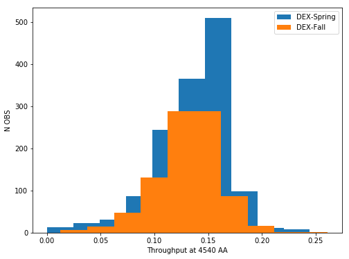
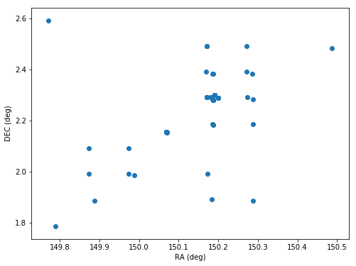

Surve Table and API
===================

The survey HDF5 file is a master look up table for each observation made
by VIRUS for HETDEX. It can be accessed directly through the HDF5 survey
file, or through the Survey class API. The Survey class includes
information for each three dither set HETDEX observation in an HDR. It
includes both science and calibration shots. Any quantity related to an
individual dither is provided in an array of length three. Fundamental
properties of a shot and quality assessment values for seeing (fwhm),
astrometry, flux limits and transparency (response\_4540) are tabulated
to allow for querying of desired shots.

We first introduce the basic API to query the Survey Class by sky
coordinates to get a list of shots where fibers are located within that
region. Later on in this notebook we show some basic querying of the
Survey class and demonstrate a few examples.

Survey class
~~~~~~~~~~~~

.. code:: ipython3

    %matplotlib inline
    import tables as tb
    import numpy as np
    import matplotlib.pyplot as plt
    
    from astropy.table import Table
    import astropy.units as u
    from astropy.coordinates import SkyCoord
    
    from hetdex_api.survey import Survey, FiberIndex

.. code:: ipython3

    survey = Survey('hdr2.1')

This calls the HDR1 survey class and sets each column in the survey
table as an attribute to this object. This is how it looks through an
astropy Table object:

.. code:: ipython3

    survey_table=survey.return_astropy_table()

.. code:: ipython3

    survey_table

.. raw:: html

    <i>Table length=2440</i>
    <table id="table47490101360848" class="table-striped table-bordered table-condensed">
    <thead><tr><th>shotid</th><th>field</th><th>objid</th><th>date</th><th>obsid</th><th>ra</th><th>dec</th><th>pa</th><th>n_ifu</th><th>fwhm_virus</th><th>fwhm_virus_err</th><th>response_4540</th><th>relflux_virus [3]</th><th>ambtemp</th><th>darktime [3]</th><th>datevobs</th><th>dewpoint</th><th>expnum [3]</th><th>exptime [3]</th><th>humidity</th><th>mjd [3]</th><th>nstars_fit [3]</th><th>nstars_fit_fwhm</th><th>obsind</th><th>pressure</th><th>structaz</th><th>time</th><th>trajcdec</th><th>trajcpa</th><th>trajcra</th><th>xditherpos [3]</th><th>xoffset [3]</th><th>xrms [3]</th><th>yditherpos [3]</th><th>yoffset [3]</th><th>yrms [3]</th><th>shot_flag</th></tr></thead>
    <thead><tr><th>int64</th><th>bytes12</th><th>bytes18</th><th>int32</th><th>int32</th><th>float64</th><th>float64</th><th>float64</th><th>int32</th><th>float32</th><th>float32</th><th>float32</th><th>float32</th><th>float32</th><th>float32</th><th>bytes12</th><th>float32</th><th>int32</th><th>float32</th><th>float32</th><th>float32</th><th>int32</th><th>int32</th><th>int32</th><th>float32</th><th>float32</th><th>bytes7</th><th>float32</th><th>float32</th><th>float32</th><th>float32</th><th>float32</th><th>float32</th><th>float32</th><th>float32</th><th>float32</th><th>bool</th></tr></thead>
    <tr><td>20170103002</td><td>cosmos</td><td>COS10_W_000_W</td><td>20170103</td><td>2</td><td>149.887695</td><td>1.885366</td><td>213.616553</td><td>14</td><td>2.3224666</td><td>0.33501986</td><td>0.09</td><td>0.83899117 .. 1.208469</td><td>7.055</td><td>395.0349 .. 395.08752</td><td>20170103v002</td><td>-7.0894446</td><td>1 .. 3</td><td>365.29913 .. 364.9993</td><td>34.054</td><td>57756.465 .. 57756.473</td><td>7 .. 7</td><td>7</td><td>1</td><td>800.37286</td><td>218.2631</td><td>1109049</td><td>1.886055</td><td>212.19806</td><td>149.886</td><td>0.0 .. 1.5292</td><td>-0.0 .. 1e-05</td><td>0.19808 .. 0.28259</td><td>0.0 .. 0.5084</td><td>-0.0 .. 0.0</td><td>0.28311 .. 0.26157</td><td>True</td></tr>
    <tr><td>20170103003</td><td>cosmos</td><td>COS64_W</td><td>20170103</td><td>3</td><td>150.485883</td><td>2.483296</td><td>215.160015</td><td>14</td><td>1.9453459</td><td>0.70668113</td><td>0.0437</td><td>1.1756307 .. 0.8494048</td><td>7.111111</td><td>394.85974 .. 395.2984</td><td>20170103v003</td><td>-7.351111</td><td>1 .. 3</td><td>364.89917 .. 365.1494</td><td>33.338</td><td>57756.484 .. 57756.492</td><td>3 .. 3</td><td>4</td><td>1</td><td>800.37286</td><td>220.17468</td><td>1135427</td><td>2.483722</td><td>213.73126</td><td>150.4845</td><td>0.0 .. 1.2627</td><td>-2e-05 .. 0.0</td><td>0.01868 .. 0.10318</td><td>0.0 .. 1.7278</td><td>2e-05 .. 3e-05</td><td>0.01476 .. 0.39071</td><td>True</td></tr>
    <tr><td>20170105008</td><td>cosmos</td><td>COS57_E</td><td>20170105</td><td>8</td><td>149.771392</td><td>2.592347</td><td>147.352919</td><td>14</td><td>2.4116552</td><td>0.27407384</td><td>0.1007</td><td>0.77864236 .. 1.2305791</td><td>10.595</td><td>392.88577 .. 395.38724</td><td>20170105v008</td><td>-1.4522222</td><td>1 .. 3</td><td>362.6497 .. 365.34888</td><td>42.01</td><td>57758.336 .. 57758.348</td><td>4 .. 4</td><td>4</td><td>1</td><td>796.5801</td><td>139.48857</td><td>0806287</td><td>2.591758</td><td>146.0002</td><td>149.772</td><td>0.0 .. 1.5756</td><td>-0.0 .. 0.0</td><td>0.21676 .. 0.18716</td><td>0.0 .. 1.5143</td><td>0.0 .. -0.0</td><td>0.16183 .. 0.0861</td><td>True</td></tr>
    <tr><td>20170105009</td><td>cosmos</td><td>COS19_E_000_E</td><td>20170105</td><td>9</td><td>149.97293</td><td>2.091282</td><td>148.690592</td><td>14</td><td>3.0098238</td><td>0.17375052</td><td>0.0698</td><td>1.1348697 .. 0.81575423</td><td>10.82</td><td>395.13513 .. 394.24307</td><td>20170105v009</td><td>-0.50222224</td><td>1 .. 3</td><td>365.0495 .. 362.64868</td><td>44.681</td><td>57758.36 .. 57758.367</td><td>3 .. 3</td><td>5</td><td>1</td><td>796.5801</td><td>141.07867</td><td>0838053</td><td>2.090136</td><td>147.27345</td><td>149.9715</td><td>0.0 .. 2.7508</td><td>-7e-05 .. -1e-05</td><td>0.31348 .. 0.02273</td><td>0.0 .. 1.0052</td><td>0.00032 .. 0.0</td><td>0.38061 .. 0.21452</td><td>True</td></tr>
    <tr><td>20170105010</td><td>cosmos</td><td>COS1_W</td><td>20170105</td><td>10</td><td>149.788237</td><td>1.78615</td><td>213.329534</td><td>14</td><td>2.0568435</td><td>0.17912686</td><td>0.1279</td><td>0.8645878 .. 1.1153272</td><td>9.510555</td><td>395.5891 .. 394.662</td><td>20170105v010</td><td>-0.22388889</td><td>1 .. 3</td><td>365.14957 .. 364.95065</td><td>50.362</td><td>57758.46 .. 57758.47</td><td>7 .. 8</td><td>7</td><td>1</td><td>796.2076</td><td>217.93459</td><td>1101477</td><td>1.786439</td><td>211.93365</td><td>149.787</td><td>0.0 .. 2.1155</td><td>0.0 .. 0.0</td><td>0.71585 .. 0.64878</td><td>0.0 .. 1.4337</td><td>-0.0 .. -0.0</td><td>0.31281 .. 0.2366</td><td>True</td></tr>
    <tr><td>20170105011</td><td>cosmos</td><td>COS14_W</td><td>20170105</td><td>11</td><td>150.287775</td><td>1.886035</td><td>213.74048</td><td>14</td><td>2.6563892</td><td>0.52853006</td><td>0.0718</td><td>1.241345 .. 0.77688354</td><td>9.596666</td><td>395.08527 .. 395.28873</td><td>20170105v011</td><td>0.12388889</td><td>1 .. 3</td><td>365.2006 .. 365.0496</td><td>51.564</td><td>57758.48 .. 57758.49</td><td>5 .. 3</td><td>6</td><td>1</td><td>796.2076</td><td>218.2599</td><td>1130484</td><td>1.886055</td><td>212.19548</td><td>150.2865</td><td>0.0 .. 0.1096</td><td>0.0 .. 1e-05</td><td>0.281 .. 0.27286</td><td>0.0 .. 2.1655</td><td>0.0 .. 1e-05</td><td>0.88719 .. 0.41315</td><td>True</td></tr>
    <tr><td>20170106001</td><td>cosmos</td><td>COS18_E</td><td>20170106</td><td>1</td><td>149.872346</td><td>2.091178</td><td>148.663047</td><td>14</td><td>2.0175648</td><td>0.493342</td><td>0.0642</td><td>0.76809865 .. 1.2480891</td><td>9.454445</td><td>395.43484 .. 395.2338</td><td>20170106v001</td><td>-3.6533334</td><td>1 .. 3</td><td>365.35022 .. 365.299</td><td>39.457</td><td>57759.336 .. 57759.344</td><td>7 .. 7</td><td>7</td><td>1</td><td>794.24347</td><td>141.08037</td><td>0804099</td><td>2.090136</td><td>147.27481</td><td>149.871</td><td>0.0 .. 0.2394</td><td>5e-05 .. -2e-05</td><td>0.88333 .. 0.88421</td><td>0.0 .. 0.8497</td><td>8e-05 .. 4e-05</td><td>0.6588 .. 0.65531</td><td>True</td></tr>
    <tr><td>20170106002</td><td>cosmos</td><td>COS10_E</td><td>20170106</td><td>2</td><td>149.87241</td><td>1.99063</td><td>148.885585</td><td>14</td><td>2.6078148</td><td>0.37767038</td><td>0.1025</td><td>1.1572015 .. 0.81802744</td><td>9.538333</td><td>393.13885 .. 394.58774</td><td>20170106v002</td><td>-3.4677777</td><td>1 .. 3</td><td>363.09958 .. 364.94952</td><td>39.525</td><td>57759.355 .. 57759.367</td><td>8 .. 7</td><td>7</td><td>1</td><td>794.24347</td><td>141.40508</td><td>0834078</td><td>1.989807</td><td>147.53558</td><td>149.871</td><td>0.0 .. 1.5108</td><td>-1e-05 .. -5e-05</td><td>0.1938 .. 0.7087</td><td>0.0 .. 0.0065</td><td>0.0 .. 2e-05</td><td>0.1416 .. 0.33973</td><td>True</td></tr>
    <tr><td>20170106003</td><td>cosmos</td><td>COS19_W</td><td>20170106</td><td>3</td><td>149.988279</td><td>1.985643</td><td>213.927043</td><td>14</td><td>3.0485</td><td>0.015947422</td><td>0.066</td><td>1.2205125 .. 0.84155726</td><td>8.274445</td><td>396.4476 .. 394.98724</td><td>20170106v003</td><td>-4.5133333</td><td>1 .. 3</td><td>364.99957 .. 365.25012</td><td>38.563</td><td>57759.477 .. 57759.484</td><td>2 .. 2</td><td>3</td><td>1</td><td>793.4646</td><td>218.58522</td><td>1126174</td><td>1.98525</td><td>212.45705</td><td>149.988</td><td>0.0 .. 2.3515</td><td>-0.0 .. 0.0</td><td>0.0424 .. 0.01811</td><td>0.0 .. 0.8448</td><td>0.0 .. -0.0</td><td>0.07718 .. 0.20584</td><td>True</td></tr>
    <tr><td>20170107012</td><td>cosmos</td><td>COS11_E</td><td>20170107</td><td>12</td><td>149.972774</td><td>1.990583</td><td>148.980505</td><td>14</td><td>1.2905</td><td>0.07669981</td><td>0.0595</td><td>0.8565348 .. 1.189691</td><td>-6.261667</td><td>397.21362 .. 395.06284</td><td>20170107v012</td><td>-17.24295</td><td>1 .. 3</td><td>364.89847 .. 365.2996</td><td>47.212</td><td>57760.336 .. 57760.348</td><td>3 .. 3</td><td>3</td><td>1</td><td>804.1317</td><td>141.40497</td><td>0805421</td><td>1.989807</td><td>147.5355</td><td>149.9715</td><td>0.0 .. 0.2119</td><td>0.0 .. -0.00011</td><td>0.79596 .. 0.04604</td><td>0.0 .. 0.3941</td><td>0.0 .. 0.00013</td><td>1.68356 .. 1.83586</td><td>True</td></tr>
    <tr><td>...</td><td>...</td><td>...</td><td>...</td><td>...</td><td>...</td><td>...</td><td>...</td><td>...</td><td>...</td><td>...</td><td>...</td><td>...</td><td>...</td><td>...</td><td>...</td><td>...</td><td>...</td><td>...</td><td>...</td><td>...</td><td>...</td><td>...</td><td>...</td><td>...</td><td>...</td><td>...</td><td>...</td><td>...</td><td>...</td><td>...</td><td>...</td><td>...</td><td>...</td><td>...</td><td>...</td><td>...</td></tr>
    <tr><td>20200202025</td><td>dex-spring</td><td>DEXsp0541</td><td>20200202</td><td>25</td><td>190.112158</td><td>52.205049</td><td>68.870164</td><td>64</td><td>2.2841842</td><td>0.35716027</td><td>0.115</td><td>1.1674091 .. 0.7911729</td><td>10.267777</td><td>406.72586 .. 408.19897</td><td>20200202v025</td><td>-12.470722</td><td>1 .. 3</td><td>367.19946 .. 368.5982</td><td>16.308</td><td>58881.35 .. 58881.36</td><td>17 .. 14</td><td>16</td><td>1</td><td>806.36676</td><td>41.340294</td><td>0826098</td><td>52.204853</td><td>67.35483</td><td>190.1113</td><td>0.0 .. 1.172</td><td>1e-05 .. -2e-05</td><td>0.558 .. 0.49844</td><td>0.0 .. 0.7062</td><td>1e-05 .. 1e-05</td><td>0.26532 .. 0.32565</td><td>True</td></tr>
    <tr><td>20200202026</td><td>dex-spring</td><td>DEXsp0522</td><td>20200202</td><td>26</td><td>197.845468</td><td>52.132801</td><td>68.894831</td><td>64</td><td>1.9989867</td><td>0.1578825</td><td>0.1267</td><td>1.0039965 .. 0.90861374</td><td>10.098889</td><td>527.1484 .. 527.2163</td><td>20200202v026</td><td>-12.741722</td><td>1 .. 3</td><td>487.74963 .. 487.29926</td><td>15.664</td><td>58881.367 .. 58881.38</td><td>14 .. 14</td><td>13</td><td>1</td><td>806.36676</td><td>41.340294</td><td>0849093</td><td>52.132874</td><td>67.35483</td><td>197.84476</td><td>0.0 .. 1.2112</td><td>1e-05 .. 2e-05</td><td>0.60696 .. 0.38435</td><td>0.0 .. 0.82</td><td>-1e-05 .. -1e-05</td><td>0.281 .. 0.3577</td><td>True</td></tr>
    <tr><td>20200202027</td><td>dex-spring</td><td>DEXsp0559</td><td>20200202</td><td>27</td><td>204.746348</td><td>51.902117</td><td>68.94877</td><td>64</td><td>2.051887</td><td>0.53437006</td><td>0.106</td><td>0.47014093 .. 1.2475735</td><td>9.717222</td><td>527.56866 .. 527.14417</td><td>20200202v027</td><td>-13.148334</td><td>1 .. 3</td><td>487.44806 .. 486.99927</td><td>16.133</td><td>58881.387 .. 58881.4</td><td>7 .. 14</td><td>13</td><td>1</td><td>805.89264</td><td>41.340294</td><td>0918129</td><td>51.90216</td><td>67.35483</td><td>204.74641</td><td>0.0 .. 1.2117</td><td>1e-05 .. 0.0</td><td>0.34106 .. 0.22951</td><td>0.0 .. 0.7366</td><td>-0.0 .. 0.0</td><td>0.19947 .. 0.20474</td><td>True</td></tr>
    <tr><td>20200202028</td><td>dex-spring</td><td>DEXsp3455</td><td>20200202</td><td>28</td><td>212.736199</td><td>52.221804</td><td>68.956924</td><td>64</td><td>1.9992324</td><td>0.49429527</td><td>0.0872</td><td>1.517288 .. 0.3487138</td><td>9.399445</td><td>408.22702 .. 407.79803</td><td>20200202v028</td><td>-12.7502775</td><td>1 .. 3</td><td>368.62692 .. 368.09946</td><td>17.311</td><td>58881.406 .. 58881.418</td><td>17 .. 9</td><td>17</td><td>1</td><td>805.89264</td><td>41.340294</td><td>0947440</td><td>52.221912</td><td>67.35483</td><td>212.73647</td><td>0.0 .. 1.1729</td><td>0.0 .. -1e-05</td><td>0.30293 .. 0.32641</td><td>0.0 .. 0.6444</td><td>-0.0 .. -1e-05</td><td>0.26365 .. 0.31838</td><td>True</td></tr>
    <tr><td>20200202029</td><td>dex-spring</td><td>DEXsp2570</td><td>20200202</td><td>29</td><td>165.311744</td><td>52.078758</td><td>294.27709</td><td>64</td><td>1.6357081</td><td>0.36003077</td><td>0.1987</td><td>0.8592948 .. 1.159794</td><td>8.811111</td><td>766.52026 .. 767.2434</td><td>20200202v029</td><td>-12.823944</td><td>1 .. 3</td><td>727.37317 .. 727.6731</td><td>17.658</td><td>58881.46 .. 58881.48</td><td>21 .. 28</td><td>27</td><td>1</td><td>804.809</td><td>318.79105</td><td>1103351</td><td>52.07855</td><td>292.82144</td><td>165.31091</td><td>0.0 .. 1.2322</td><td>-1e-05 .. -1e-05</td><td>0.58351 .. 0.56164</td><td>0.0 .. 0.8258</td><td>-0.0 .. 0.0</td><td>0.26295 .. 0.30037</td><td>True</td></tr>
    <tr><td>20200202030</td><td>dex-spring</td><td>DEXsp2543</td><td>20200202</td><td>30</td><td>165.77294</td><td>52.05068</td><td>294.281512</td><td>64</td><td>1.9461403</td><td>0.22722109</td><td>0.1467</td><td>0.994858 .. 0.9693605</td><td>9.212778</td><td>467.99487 .. 468.02386</td><td>20200202v030</td><td>-13.061444</td><td>1 .. 3</td><td>428.34924 .. 428.04816</td><td>17.161</td><td>58881.49 .. 58881.5</td><td>21 .. 19</td><td>21</td><td>1</td><td>804.809</td><td>318.79105</td><td>1144478</td><td>52.049854</td><td>292.82144</td><td>165.77242</td><td>0.0 .. 1.2633</td><td>1e-05 .. -1e-05</td><td>0.33362 .. 0.51132</td><td>0.0 .. 0.6113</td><td>1e-05 .. -0.0</td><td>0.26786 .. 0.26644</td><td>True</td></tr>
    <tr><td>20200203023</td><td>dex-spring</td><td>DEXsp0279_000_E</td><td>20200203</td><td>23</td><td>204.453178</td><td>50.533361</td><td>72.138027</td><td>64</td><td>1.9069787</td><td>0.3162317</td><td>0.1086</td><td>1.1607761 .. 0.7250008</td><td>10.633333</td><td>407.45187 .. 409.44116</td><td>20200203v023</td><td>-11.637222</td><td>1 .. 3</td><td>367.89944 .. 367.35007</td><td>17.883</td><td>58882.375 .. 58882.383</td><td>23 .. 20</td><td>22</td><td>1</td><td>795.53033</td><td>44.300213</td><td>0858497</td><td>50.533497</td><td>70.54193</td><td>204.45271</td><td>0.0 .. 1.2522</td><td>-1e-05 .. 0.0</td><td>0.60245 .. 0.41719</td><td>0.0 .. 0.6921</td><td>-0.0 .. -0.0</td><td>0.22193 .. 0.24768</td><td>True</td></tr>
    <tr><td>20200203024</td><td>dex-spring</td><td>DEXsp3316_000_E</td><td>20200203</td><td>24</td><td>212.856128</td><td>51.488692</td><td>70.225405</td><td>64</td><td>2.4848497</td><td>0.36336267</td><td>0.1115</td><td>0.9065211 .. 0.9456405</td><td>10.716666</td><td>406.67334 .. 407.60175</td><td>20200203v024</td><td>-6.2833333</td><td>1 .. 3</td><td>367.10028 .. 367.74948</td><td>26.85</td><td>58882.4 .. 58882.406</td><td>17 .. 19</td><td>19</td><td>1</td><td>795.53033</td><td>42.503685</td><td>0931583</td><td>51.48893</td><td>68.62578</td><td>212.85475</td><td>0.0 .. 1.1616</td><td>-0.0 .. -0.0</td><td>0.49063 .. 0.35825</td><td>0.0 .. 0.6712</td><td>0.0 .. 0.0</td><td>0.2282 .. 0.25613</td><td>True</td></tr>
    <tr><td>20200203025</td><td>dex-spring</td><td>DEXsp3659_000_E</td><td>20200203</td><td>25</td><td>219.037086</td><td>52.088549</td><td>69.002517</td><td>64</td><td>2.2222862</td><td>0.34233415</td><td>0.147</td><td>1.0322891 .. 0.84551567</td><td>10.497222</td><td>527.7994 .. 527.8706</td><td>20200203v025</td><td>-5.5594444</td><td>1 .. 3</td><td>487.97632 .. 487.72623</td><td>29.177</td><td>58882.414 .. 58882.426</td><td>20 .. 18</td><td>25</td><td>1</td><td>795.2933</td><td>41.362785</td><td>0955574</td><td>52.088837</td><td>67.37964</td><td>219.03625</td><td>0.0 .. 1.2169</td><td>1e-05 .. 0.0</td><td>0.49616 .. 0.26846</td><td>0.0 .. 0.6649</td><td>0.0 .. 1e-05</td><td>0.37567 .. 0.39695</td><td>True</td></tr>
    <tr><td>20200204021</td><td>dex-spring</td><td>DEXsp2185_000_W</td><td>20200204</td><td>21</td><td>166.514558</td><td>50.290787</td><td>290.493898</td><td>63</td><td>2.7383194</td><td>0.37426585</td><td>0.1832</td><td>0.9779727 .. 0.9860752</td><td>7.6266665</td><td>527.2511 .. 526.82184</td><td>20200204v021</td><td>3.045</td><td>1 .. 3</td><td>487.22995 .. 487.24927</td><td>71.419</td><td>58883.48 .. 58883.492</td><td>17 .. 18</td><td>20</td><td>1</td><td>792.3471</td><td>315.24396</td><td>1130488</td><td>50.290607</td><td>289.0139</td><td>166.51346</td><td>0.0 .. 1.1112</td><td>0.0 .. 1e-05</td><td>0.46389 .. 0.55396</td><td>0.0 .. 0.6763</td><td>-0.0 .. -0.0</td><td>0.18748 .. 0.17304</td><td>True</td></tr>
    </table>

It also converts RA and DEC into astropy coordinate objects.

.. code:: ipython3

    survey.coords

.. parsed-literal::

    <SkyCoord (ICRS): (ra, dec) in deg
        [(149.887695,  1.885366), (150.485883,  2.483296),
         (149.771392,  2.592347), ..., (212.856128, 51.488692),
         (219.037086, 52.088549), (166.514558, 50.290787)]>

Shots are labeled based on their observation date and observation ID:

.. code:: ipython3

    survey.date

.. parsed-literal::

    array([20170103, 20170103, 20170105, ..., 20200203, 20200203, 20200204],
          dtype=int32)

.. code:: ipython3

    survey.obsid

.. parsed-literal::

    array([ 2,  3,  8, ..., 24, 25, 21], dtype=int32)

A specific shot can be linked either by an integer combination of these
two values, called ``shotid``, or the ``DATEvOBS`` form:

.. code:: ipython3

    survey.datevobs

.. parsed-literal::

    array(['20170103v002', '20170103v003', '20170105v008', ...,
           '20200203v024', '20200203v025', '20200204v021'], dtype='<U12')

.. code:: ipython3

    survey.shotid

.. parsed-literal::

    array([20170103002, 20170103003, 20170105008, ..., 20200203024,
           20200203025, 20200204021])

Searching for shots near a sky coordinate
-----------------------------------------

Most users searching for observations will want to get a list of
observations/shots at a specific sky position. Each shot has a single
associated sky coordinate. We can retrieve a list of shots that may
contain fibers in a specific region. However, because of the varying and
non-contiguous footprint of VIRUS, this is not an immediate guarantee a
region has been observed. You must further query fibers in each shot to
determine this. See Notebook 02 to learn how to query with the Fibers
Class API.

get\_shotlist()
~~~~~~~~~~~~~~~

This function which operates on the Survey class object. An astropy
coordinates object is required as input.

.. code:: ipython3

    coords = SkyCoord(11.628530 * u.deg, 0.081790 * u.deg, frame='icrs')

We can either search a rectangular region, width and height in degrees:

.. code:: ipython3

    shotlist = survey.get_shotlist(coords, width=0.5, height=0.2)

.. code:: ipython3

    shotlist

.. parsed-literal::

    array([20171119003, 20180106004, 20181003009, 20181005017, 20181107014,
           20191222012])

or we can search a circular aperture with a radius given in degress, or
in an astropy quantity object:

.. code:: ipython3

    shotlist = survey.get_shotlist(coords, radius=10*u.arcmin)

.. code:: ipython3

    shotlist

.. parsed-literal::

    array([20171119003, 20180106004, 20181003009, 20181107014, 20191222012])

From here a user can take their shotlist and query the position on the
Fibers class and see if their region of interest is observed in the
survey.

Basic querying for the Survey Class
-----------------------------------

The Survey HDF5 itself contains information about the quality of each
observation. A user can query different parameters and plot up general
shot quantities. For example, we can compare the distribution of
throughput values (technically the response at 4540 AA) between the
HETDEX spring and HETDEX fall fields:

Example: Plotting up the canonical throughput value at 4540 AA

.. code:: ipython3

    idx_spring = np.where( (survey.field == 'dex-spring') * np.isfinite(survey.response_4540) )

.. code:: ipython3

    idx_fall = np.where( (survey.field == 'dex-fall') * np.isfinite(survey.response_4540))

.. code:: ipython3

    plt.figure(figsize=(8,6))
    plt.hist(survey.response_4540[idx_spring], label = 'DEX-Spring')
    plt.hist(survey.response_4540[idx_fall], label = 'DEX-Fall')
    plt.xlabel('Throughput at 4540 AA')
    plt.ylabel('N OBS')
    plt.legend()

.. parsed-literal::

    <matplotlib.legend.Legend at 0x2b31269f3cc0>

Example: Plotting up the locations of all cosmos shots:

.. code:: ipython3

    idx_cosmos = np.where(survey.field == 'cosmos')

.. code:: ipython3

    plt.figure(figsize=(8,6))
    plt.scatter(survey.ra[idx_cosmos],survey.dec[idx_cosmos])
    plt.xlabel('RA (deg)')
    plt.ylabel('DEC (deg)')
    plt.show()

Fiber Index Table:
==================

New to HDR2 is a Master Fiber Index table for all Fibers in the HDR2
survey. This file can be accessed through the FiberIndex class:

FiberIndex Class
~~~~~~~~~~~~~~~~

.. code:: ipython3

    FibIndex = FiberIndex()

.. code:: ipython3

    coords = SkyCoord(11.628530 * u.deg, 0.081790 * u.deg, frame='icrs')

You can read in a circular region of the Fiber Index table using the
query\_region() function:

.. code:: ipython3

    fiber_table_region = FibIndex.query_region(coords, radius=3.*u.arcsec, shotid=None, astropy=True)

.. code:: ipython3

    fiber_table_region

.. raw:: html

    <i>Table length=15</i>
    <table id="table47490103745560" class="table-striped table-bordered table-condensed">
    <thead><tr><th>multiframe</th><th>ra</th><th>dec</th><th>fiber_id</th><th>healpix</th><th>amp</th><th>expnum</th><th>fibidx</th><th>fibnum</th><th>fpx</th><th>fpy</th><th>ifuid</th><th>ifuslot</th><th>ifux</th><th>ifuy</th><th>shotid</th><th>specid</th></tr></thead>
    <thead><tr><th>bytes20</th><th>float32</th><th>float32</th><th>bytes38</th><th>int64</th><th>bytes2</th><th>int32</th><th>int32</th><th>int32</th><th>float32</th><th>float32</th><th>bytes3</th><th>bytes3</th><th>float32</th><th>float32</th><th>int64</th><th>bytes3</th></tr></thead>
    <tr><td>multi_308_047_024_LL</td><td>11.627942</td><td>0.0814511</td><td>20181003009_1_multi_308_047_024_LL_079</td><td>102932169254</td><td>LL</td><td>1</td><td>78</td><td>79</td><td>-251.53</td><td>-158.53</td><td>024</td><td>047</td><td>-1.27</td><td>-8.81</td><td>2018100300</td><td>308</td></tr>
    <tr><td>multi_308_047_024_LL</td><td>11.628648</td><td>0.0813975</td><td>20181003009_1_multi_308_047_024_LL_098</td><td>102932169255</td><td>LL</td><td>1</td><td>97</td><td>98</td><td>-250.26</td><td>-160.74</td><td>024</td><td>047</td><td>0.0</td><td>-11.02</td><td>2018100300</td><td>308</td></tr>
    <tr><td>multi_308_047_024_LL</td><td>11.628344</td><td>0.0820341</td><td>20181003009_1_multi_308_047_024_LL_099</td><td>102931644967</td><td>LL</td><td>1</td><td>98</td><td>99</td><td>-252.8</td><td>-160.74</td><td>024</td><td>047</td><td>-2.54</td><td>-11.02</td><td>2018100300</td><td>308</td></tr>
    <tr><td>multi_308_047_024_LU</td><td>11.629047</td><td>0.0819793</td><td>20181003009_1_multi_308_047_024_LU_006</td><td>102931644968</td><td>LU</td><td>1</td><td>5</td><td>6</td><td>-251.53</td><td>-162.94</td><td>024</td><td>047</td><td>-1.27</td><td>-13.22</td><td>2018100300</td><td>308</td></tr>
    <tr><td>multi_308_047_024_LL</td><td>11.628618</td><td>0.0810092</td><td>20181003009_3_multi_308_047_024_LL_098</td><td>102933217831</td><td>LL</td><td>3</td><td>97</td><td>98</td><td>-249.045</td><td>-160.04</td><td>024</td><td>047</td><td>0.0</td><td>-11.02</td><td>2018100300</td><td>308</td></tr>
    <tr><td>multi_308_047_024_LL</td><td>11.628314</td><td>0.0816458</td><td>20181003009_3_multi_308_047_024_LL_099</td><td>102931644967</td><td>LL</td><td>3</td><td>98</td><td>99</td><td>-251.585</td><td>-160.04</td><td>024</td><td>047</td><td>-2.54</td><td>-11.02</td><td>2018100300</td><td>308</td></tr>
    <tr><td>multi_308_047_024_LL</td><td>11.62801</td><td>0.0822824</td><td>20181003009_3_multi_308_047_024_LL_100</td><td>102931120678</td><td>LL</td><td>3</td><td>99</td><td>100</td><td>-254.125</td><td>-160.04</td><td>024</td><td>047</td><td>-5.08</td><td>-11.02</td><td>2018100300</td><td>308</td></tr>
    <tr><td>multi_308_047_024_LU</td><td>11.629018</td><td>0.0815909</td><td>20181003009_3_multi_308_047_024_LU_006</td><td>102932169255</td><td>LU</td><td>3</td><td>5</td><td>6</td><td>-250.315</td><td>-162.24</td><td>024</td><td>047</td><td>-1.27</td><td>-13.22</td><td>2018100300</td><td>308</td></tr>
    <tr><td>multi_308_047_024_LU</td><td>11.628714</td><td>0.0822275</td><td>20181003009_3_multi_308_047_024_LU_007</td><td>102931120679</td><td>LU</td><td>3</td><td>6</td><td>7</td><td>-252.855</td><td>-162.24</td><td>024</td><td>047</td><td>-3.81</td><td>-13.22</td><td>2018100300</td><td>308</td></tr>
    <tr><td>multi_308_047_024_LL</td><td>11.628263</td><td>0.0812304</td><td>20181003009_2_multi_308_047_024_LL_079</td><td>102932693543</td><td>LL</td><td>2</td><td>78</td><td>79</td><td>-250.315</td><td>-159.23</td><td>024</td><td>047</td><td>-1.27</td><td>-8.81</td><td>2018100300</td><td>308</td></tr>
    <tr><td>multi_308_047_024_LL</td><td>11.627959</td><td>0.081867</td><td>20181003009_2_multi_308_047_024_LL_080</td><td>102931644966</td><td>LL</td><td>2</td><td>79</td><td>80</td><td>-252.855</td><td>-159.23</td><td>024</td><td>047</td><td>-3.81</td><td>-8.81</td><td>2018100300</td><td>308</td></tr>
    <tr><td>multi_308_047_024_LL</td><td>11.628969</td><td>0.0811768</td><td>20181003009_2_multi_308_047_024_LL_098</td><td>102932693544</td><td>LL</td><td>2</td><td>97</td><td>98</td><td>-249.045</td><td>-161.44</td><td>024</td><td>047</td><td>0.0</td><td>-11.02</td><td>2018100300</td><td>308</td></tr>
    <tr><td>multi_308_047_024_LL</td><td>11.628665</td><td>0.0818134</td><td>20181003009_2_multi_308_047_024_LL_099</td><td>102932169255</td><td>LL</td><td>2</td><td>98</td><td>99</td><td>-251.585</td><td>-161.44</td><td>024</td><td>047</td><td>-2.54</td><td>-11.02</td><td>2018100300</td><td>308</td></tr>
    <tr><td>multi_308_047_024_LL</td><td>11.628361</td><td>0.08245</td><td>20181003009_2_multi_308_047_024_LL_100</td><td>102930596391</td><td>LL</td><td>2</td><td>99</td><td>100</td><td>-254.125</td><td>-161.44</td><td>024</td><td>047</td><td>-5.08</td><td>-11.02</td><td>2018100300</td><td>308</td></tr>
    <tr><td>multi_308_047_024_LU</td><td>11.629065</td><td>0.0823952</td><td>20181003009_2_multi_308_047_024_LU_007</td><td>102930596392</td><td>LU</td><td>2</td><td>6</td><td>7</td><td>-252.855</td><td>-163.64</td><td>024</td><td>047</td><td>-3.81</td><td>-13.22</td><td>2018100300</td><td>308</td></tr>
    </table>

Note: you have the option to request a specific shotid (default is None)
or whether to return an astropy table format or not. Default is to
return an astropy table.

.. code:: ipython3

    healpix_table = FibIndex.get_fib_from_hp(102930596392)

.. code:: ipython3

    healpix_table

.. raw:: html

    <i>Table length=1</i>
    <table id="table47490101951512" class="table-striped table-bordered table-condensed">
    <thead><tr><th>multiframe</th><th>ra</th><th>dec</th><th>fiber_id</th><th>healpix</th><th>amp</th><th>expnum</th><th>fibidx</th><th>fibnum</th><th>fpx</th><th>fpy</th><th>ifuid</th><th>ifuslot</th><th>ifux</th><th>ifuy</th><th>shotid</th><th>specid</th></tr></thead>
    <thead><tr><th>bytes20</th><th>float32</th><th>float32</th><th>bytes38</th><th>int64</th><th>bytes2</th><th>int32</th><th>int32</th><th>int32</th><th>float32</th><th>float32</th><th>bytes3</th><th>bytes3</th><th>float32</th><th>float32</th><th>int64</th><th>bytes3</th></tr></thead>
    <tr><td>multi_308_047_024_LU</td><td>11.629065</td><td>0.0823952</td><td>20181003009_2_multi_308_047_024_LU_007</td><td>102930596392</td><td>LU</td><td>2</td><td>6</td><td>7</td><td>-252.855</td><td>-163.64</td><td>024</td><td>047</td><td>-3.81</td><td>-13.22</td><td>2018100300</td><td>308</td></tr>
    </table>

Other access should be done directly through pytables, for example. The
table is optimized for querying on 'ra', 'fiber\_id' and 'healpix'
integer.

.. code:: ipython3

    fiber_id_i =  '20181003009_2_multi_308_047_024_LL_080'
    fiber_table = FibIndex.hdfile.root.FiberIndex.read_where('fiber_id == fiber_id_i')
    Table(fiber_table)

.. raw:: html

    <i>Table length=1</i>
    <table id="table47490103843472" class="table-striped table-bordered table-condensed">
    <thead><tr><th>multiframe</th><th>ra</th><th>dec</th><th>fiber_id</th><th>healpix</th><th>amp</th><th>expnum</th><th>fibidx</th><th>fibnum</th><th>fpx</th><th>fpy</th><th>ifuid</th><th>ifuslot</th><th>ifux</th><th>ifuy</th><th>shotid</th><th>specid</th></tr></thead>
    <thead><tr><th>bytes20</th><th>float32</th><th>float32</th><th>bytes38</th><th>int64</th><th>bytes2</th><th>int32</th><th>int32</th><th>int32</th><th>float32</th><th>float32</th><th>bytes3</th><th>bytes3</th><th>float32</th><th>float32</th><th>int64</th><th>bytes3</th></tr></thead>
    <tr><td>multi_308_047_024_LL</td><td>11.627959</td><td>0.081867</td><td>20181003009_2_multi_308_047_024_LL_080</td><td>102931644966</td><td>LL</td><td>2</td><td>79</td><td>80</td><td>-252.855</td><td>-159.23</td><td>024</td><td>047</td><td>-3.81</td><td>-8.81</td><td>2018100300</td><td>308</td></tr>
    </table>

Exploring the Survey HDF5 File
------------------------------

The hdfile attribute contains the link to the survey HDF5 file. Calling
it will show you all the information in the HDF5 file. You may interact
with this directly rather than using the Survey class initiation.

.. code:: ipython3

    survey.hdfile

.. parsed-literal::

    File(filename=/data/05350/ecooper/hdr2/survey/survey_hdr2.h5, title='HDR2Survey file ', mode='r', root_uep='/', filters=Filters(complevel=0, shuffle=False, bitshuffle=False, fletcher32=False, least_significant_digit=None))
    / (RootGroup) 'HDR2Survey file '
    /Survey (Table(2489,)) ''
      description := {
      "shotid": Int64Col(shape=(), dflt=0, pos=0),
      "field": StringCol(itemsize=12, shape=(), dflt=b'', pos=1),
      "objid": StringCol(itemsize=18, shape=(), dflt=b'', pos=2),
      "date": Int32Col(shape=(), dflt=0, pos=3),
      "obsid": Int32Col(shape=(), dflt=0, pos=4),
      "ra": Float64Col(shape=(), dflt=0.0, pos=5),
      "dec": Float64Col(shape=(), dflt=0.0, pos=6),
      "pa": Float64Col(shape=(), dflt=0.0, pos=7),
      "n_ifu": Int32Col(shape=(), dflt=0, pos=8),
      "fwhm_virus": Float32Col(shape=(), dflt=0.0, pos=9),
      "fwhm_virus_err": Float32Col(shape=(), dflt=0.0, pos=10),
      "response_4540": Float32Col(shape=(), dflt=0.0, pos=11),
      "relflux_virus": Float32Col(shape=(3,), dflt=0.0, pos=12),
      "ambtemp": Float32Col(shape=(), dflt=0.0, pos=13),
      "darktime": Float32Col(shape=(3,), dflt=0.0, pos=14),
      "datevobs": StringCol(itemsize=12, shape=(), dflt=b'', pos=15),
      "dewpoint": Float32Col(shape=(), dflt=0.0, pos=16),
      "expnum": Int32Col(shape=(3,), dflt=0, pos=17),
      "exptime": Float32Col(shape=(3,), dflt=0.0, pos=18),
      "humidity": Float32Col(shape=(), dflt=0.0, pos=19),
      "mjd": Float32Col(shape=(3,), dflt=0.0, pos=20),
      "nstars_fit": Int32Col(shape=(3,), dflt=0, pos=21),
      "nstars_fit_fwhm": Int32Col(shape=(), dflt=0, pos=22),
      "obsind": Int32Col(shape=(), dflt=0, pos=23),
      "pressure": Float32Col(shape=(), dflt=0.0, pos=24),
      "structaz": Float32Col(shape=(), dflt=0.0, pos=25),
      "time": StringCol(itemsize=7, shape=(), dflt=b'', pos=26),
      "trajcdec": Float32Col(shape=(), dflt=0.0, pos=27),
      "trajcpa": Float32Col(shape=(), dflt=0.0, pos=28),
      "trajcra": Float32Col(shape=(), dflt=0.0, pos=29),
      "xditherpos": Float32Col(shape=(3,), dflt=0.0, pos=30),
      "xoffset": Float32Col(shape=(3,), dflt=0.0, pos=31),
      "xrms": Float32Col(shape=(3,), dflt=0.0, pos=32),
      "yditherpos": Float32Col(shape=(3,), dflt=0.0, pos=33),
      "yoffset": Float32Col(shape=(3,), dflt=0.0, pos=34),
      "yrms": Float32Col(shape=(3,), dflt=0.0, pos=35)}
      byteorder := 'little'
      chunkshape := (226,)

