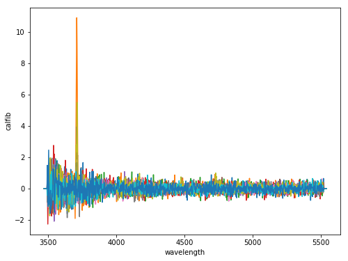
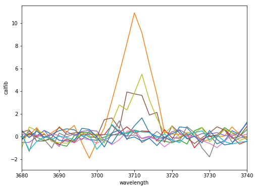
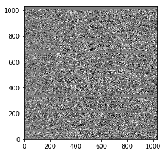

02 - Accessing Processed Data: The Fibers and Images Classes
============================================================

All data for a single HETDEX observation, a dither set of three
exposures, is stored in one HDF5 file. This file contains the processed
data in the form of 2D image data and individual fiber data. It also
contains additional branches including information about the astrometric
and flux-calibration details. Most users will be most interested in the
flux-calibrated fiber information and 2D image data. A user can access
all fibers observated at a specific RA/DEC and perform analysis on these
retrieved fibers. This data can be retrieved through the Fibers class
API described here. The 2D image data represents the intermediary
processed data. It provides images for each IFU/amp (essential the
original CCD image of the fiber spectra) along each step of calibration.
Please refer to Panacea documentation for detailed information on the
reduction process.

We begin by first introducing some global shot functions and then delve
into the Fibers Class API.

Opening a shot
--------------

If you want to just open the shot HDF5 file and explore contents, you
must know the shot ID: either its integer shotid value (20180124010) or
the datevobs ('20180124v010'). The last notebook showed how to find a
list of shots based on querying the Survey Class. A shot HDF5 file can
then be opened using the ``open_shot_file()`` global command:

.. code:: ipython3

    %matplotlib inline
    import matplotlib.pyplot as plt
    from matplotlib.colors import LogNorm
    from astropy.visualization import ZScaleInterval
    
    import astropy.units as u
    from astropy.coordinates import SkyCoord
    
    from hetdex_api.shot import *

.. code:: ipython3

    fileh = open_shot_file('20180124v010')

To see all contents of the shot file, you can do ``print(fileh)``:

Opening up files from data releases other than the default
~~~~~~~~~~~~~~~~~~~~~~~~~~~~~~~~~~~~~~~~~~~~~~~~~~~~~~~~~~

To open up from a different data release than the default (currently
'hdr2')

.. code:: ipython3

    fileh2 = open_shot_file('20190104v026', survey='hdr1')

Close up a file you aren't using:

.. code:: ipython3

    fileh2.close()

Initiate the Fibers Class
-------------------------

To access the fibers of a given shot, you can open the HDF5 shot and
load in the RA/DEC of each fiber as an astropy coordinates object in one
instance. This will take from 2-10 seconds as it loads in the full
Fibers dataset.

.. code:: ipython3

    fibers = Fibers('20180124v010')

This will also initialize an array of rectified wavelengths to be used
when plotting the 'calfib' column representing the calibrated flux for
each individual fiber.

.. code:: ipython3

    fibers.wave_rect

.. parsed-literal::

    array([3470., 3472., 3474., ..., 5536., 5538., 5540.])

The following are functions that act upon the fibers class to aid in
querying and retrieving fibers. Use ``query_region_idx()`` to get the
index of all fibers within a defined circular aperture. The center of
the aperture must be an astropy coords object, for example:

.. code:: ipython3

    coords = SkyCoord(150.025513 * u.deg, 2.087767 * u.deg, frame='icrs')

.. code:: ipython3

    idx = fibers.query_region_idx(coords, radius=3.*u.arcsec)

To plot the fiber spectra for each fiber, use `plot_fiber_spectrum()`:

We got plot up all spectra using the plot\_fiber\_spectrum which takes a
row index value as an argument and acts upon the Fibers class object.

.. code:: ipython3

    plt.figure(figsize=(8,6))
    for i in idx :
        fibers.plot_fiber_spectrum(i)

Using the xlim and ylim options, we can vary the axes range:

.. code:: ipython3

    plt.figure(figsize=(8,6))
    for i in idx:
        fibers.plot_fiber_spectrum(i, xlim=[3680,3740])

Each fiber can be saved to a text file as follows:

.. code:: ipython3

    for i in idx:
        fibers.save_fiber_spectrum(i, file='spec_' + str(i) + '.dat')

.. parsed-literal::

    Saving the flux-calibrated fiber spectrum
    Saving the flux-calibrated fiber spectrum
    Saving the flux-calibrated fiber spectrum
    Saving the flux-calibrated fiber spectrum
    Saving the flux-calibrated fiber spectrum
    Saving the flux-calibrated fiber spectrum
    Saving the flux-calibrated fiber spectrum
    Saving the flux-calibrated fiber spectrum
    Saving the flux-calibrated fiber spectrum
    Saving the flux-calibrated fiber spectrum
    Saving the flux-calibrated fiber spectrum

Some other Fibers class functions
---------------------------------

To find the closet fiber to a set of coordinates:

.. code:: ipython3

    idx = fibers.get_closest_fiber(coords)

To find the x,y image value in the 2D images arrays, use get\_image\_xy
on the fibers class. A user must provide both a fiber index and a
wavelength:

.. code:: ipython3

    x, y = fibers.get_image_xy(idx, 3710)

Get Image cutouts:
------------------

An image cutout can be extracted for a specific shot either around a set
of coordinates or for a specific multiframe ID (this is the IFU/amp ID).
For example:

.. code:: ipython3

    implot = get_image2D_cutout('20180124v010', coords, 3710)

.. code:: ipython3

    zscale = ZScaleInterval(contrast=0.5,krej=2.5) 
    vmin, vmax = zscale.get_limits(values=implot)
    plt.imshow(implot,vmin=vmin, vmax=vmax, origin="lower",cmap=plt.get_cmap('gray'),interpolation="none")

.. parsed-literal::

    <matplotlib.image.AxesImage at 0x2b04c76a45c0>

.. image:: output_35_1.png

Or we can grab an entire amp of interest for a specific shot:

.. code:: ipython3

    multiframe_obj = 'multi_319_083_023_RL'

.. code:: ipython3

    im_amp = get_image2D_amp('20180124v010', multiframe_obj)
    zscale = ZScaleInterval(contrast=0.5,krej=2.5) 
    vmin, vmax = zscale.get_limits(values=im_amp)
    plt.imshow(im_amp,vmin=vmin, vmax=vmax, origin="lower",cmap=plt.get_cmap('gray'),interpolation="none")

.. parsed-literal::

    <matplotlib.image.AxesImage at 0x2b04c774f908>

