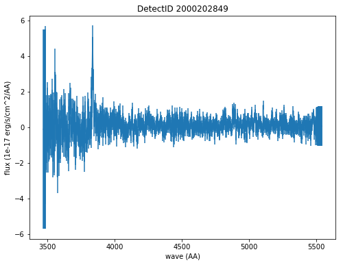

Detections Database and API
===========================

This notebook demonstrates how to access the HDF5 container for the
HETDEX line detections database through the API. Querying of the
database through an interactive GUI follows in Notebook 11 - Querying
Detections GUI. This database is a catalog of line emission detections
and their associated 1D, aperture summed, psf-weighted spectra. There
are three tables contained within this HDF5 file:

1. Detections - this is the main database of line detection sources. It
   provides the position and central wavelength of each detection and
   corresponding line fluxes. A source detection corresponds to an
   emission line so it is possible to have multiple line detections at
   different wavelengths for a single source. There can also be multiple
   observations of the same line if it has been observed in multiple
   shots or if it is associated with a large source.

2. Fibers - for each source detection, this table lists information
   about each fiber used to extract the flux measurment and weighted
   spectrum. This allows a user to return to the processed data products
   (ie. the shot HDF5 files) to investigate the source further.

3. Spectra - for each source, this table contains arrays of wavelength
   and 1D flux-weighted aperture summed spectral data and corresponding
   errors. Non-calibrated spectra is also provided in counts

.. code:: ipython3

    %matplotlib inline
    import sys
    import os
    import os.path
    import subprocess
    import numpy as np
    import tables as tb
    import matplotlib.pyplot as plt
    
    from astropy.io import ascii
    from astropy.table import Table, Column
    from astropy.coordinates import SkyCoord
    import astropy.units as u
    
    from hetdex_api.config import HDRconfig
    from hetdex_api.detections import Detections
    from hetdex_api.elixer_widget_cls import ElixerWidget

Initiate the API
~~~~~~~~~~~~~~~~

When you call ``Detections()`` you intiate the Detections Class object
which takes columns from the Detections Table in the HDF5 file and adds
them as array attributes to the Detections class object. It also
converts ra/dec into astropy skycoords in the ``coords`` attribute,
calculates an approximate gband magnitude using the 1D spectra and adds
elixer probabilities for each detection. If you append the call with
``refine()`` then a number of downselections are applied to the database
to return a more robust list of line emitters. ``refine()`` removes
spurious detections found in bad amps or at the edges of the CCD or in
shots that are not deemed appropriate for HETDEX analysis. It can also
remove all bright objects above a specific gband magnitude if desired
(default to None if no option is given).

.. code:: ipython3

    #old way still works
    #detects = Detections('hdr1').refine()
    
    # but this is the new way
    detects = Detections(survey='hdr2', catalog_type='lines')
    
    #detects = Detections('hdr1').refine(gmagcut=22)
    
    # or if you want to open the continuum source catalog:
    # detects = Detections(survey='hdr2', catalog_type='continuum')

Here are a list of attributes built into the Detections class:

.. code:: ipython3

    detects.__dict__.keys()

.. parsed-literal::

    dict_keys(['survey', 'filename', 'hdfile', 'loadtable', 'detectid', 'shotid', 'ra', 'dec', 'date', 'obsid', 'wave', 'wave_err', 'flux', 'flux_err', 'linewidth', 'linewidth_err', 'continuum', 'continuum_err', 'sn', 'sn_err', 'chi2', 'chi2_err', 'multiframe', 'fibnum', 'x_raw', 'y_raw', 'amp', 'expnum', 'fiber_id', 'ifuid', 'ifuslot', 'inputid', 'specid', 'weight', 'x_ifu', 'y_ifu', 'hdfile_elix', 'field', 'fwhm', 'throughput', 'n_ifu', 'vis_class', 'coords'])

If you prefer working in astropy tables, you can grab it this way:

.. code:: ipython3

    detect_table = detects.return_astropy_table()

.. code:: ipython3

    detect_table

.. raw:: html

    <i>Table length=1103825</i>
    <table id="table47765059573296" class="table-striped table-bordered table-condensed">
    <thead><tr><th>detectid</th><th>fwhm</th><th>throughput</th><th>shotid</th><th>field</th><th>n_ifu</th><th>ra</th><th>dec</th><th>date</th><th>obsid</th><th>wave</th><th>wave_err</th><th>flux</th><th>flux_err</th><th>linewidth</th><th>linewidth_err</th><th>continuum</th><th>continuum_err</th><th>sn</th><th>sn_err</th><th>chi2</th><th>chi2_err</th><th>multiframe</th><th>fibnum</th><th>x_raw</th><th>y_raw</th><th>amp</th><th>expnum</th><th>fiber_id</th><th>ifuid</th><th>ifuslot</th><th>inputid</th><th>specid</th><th>weight</th><th>x_ifu</th><th>y_ifu</th></tr></thead>
    <thead><tr><th>int64</th><th>float64</th><th>float64</th><th>int64</th><th>bytes12</th><th>int64</th><th>float32</th><th>float32</th><th>int32</th><th>int32</th><th>float32</th><th>float32</th><th>float32</th><th>float32</th><th>float32</th><th>float32</th><th>float32</th><th>float32</th><th>float32</th><th>float32</th><th>float32</th><th>float32</th><th>str20</th><th>int32</th><th>int32</th><th>int32</th><th>str2</th><th>int32</th><th>str38</th><th>str3</th><th>str3</th><th>str40</th><th>str3</th><th>float32</th><th>float32</th><th>float32</th></tr></thead>
    <tr><td>2000000001</td><td>1.5907049179077148</td><td>0.11550000309944153</td><td>20170130027</td><td>goods-n</td><td>14</td><td>189.20155</td><td>62.240665</td><td>20170130</td><td>27</td><td>4245.91</td><td>0.09</td><td>206.76</td><td>5.52</td><td>2.87</td><td>0.09</td><td>10.75</td><td>0.23</td><td>55.3</td><td>1.12</td><td>2.23</td><td>0.23</td><td>multi_020_095_004_LU</td><td>19</td><td>375</td><td>171</td><td>LU</td><td>1</td><td>20170130027_0_multi_020_095_004_LU_019</td><td>004</td><td>095</td><td>20170130v027_2</td><td>020</td><td>0.314</td><td>-15.25</td><td>15.42</td></tr>
    <tr><td>2000000002</td><td>1.2000000476837158</td><td>0.11379999667406082</td><td>20170129008</td><td>goods-n</td><td>14</td><td>189.20099</td><td>62.240814</td><td>20170129</td><td>8</td><td>4246.22</td><td>0.07</td><td>162.65</td><td>3.49</td><td>2.86</td><td>0.06</td><td>8.79</td><td>0.14</td><td>51.71</td><td>1.47</td><td>1.23</td><td>0.22</td><td>multi_008_093_054_RU</td><td>109</td><td>371</td><td>997</td><td>RU</td><td>1</td><td>20170129008_0_multi_008_093_054_RU_109</td><td>054</td><td>093</td><td>20170129v008_4</td><td>008</td><td>0.3224</td><td>-3.81</td><td>13.22</td></tr>
    <tr><td>2000000003</td><td>2.5434999465942383</td><td>0.12540000677108765</td><td>20170131033</td><td>goods-n</td><td>14</td><td>189.20114</td><td>62.240673</td><td>20170131</td><td>33</td><td>4245.61</td><td>0.09</td><td>211.71</td><td>5.58</td><td>2.73</td><td>0.08</td><td>12.53</td><td>0.26</td><td>51.65</td><td>1.16</td><td>1.82</td><td>0.23</td><td>multi_016_104_026_RU</td><td>74</td><td>381</td><td>672</td><td>RU</td><td>2</td><td>20170131033_0_multi_016_104_026_RU_074</td><td>026</td><td>104</td><td>20170131v033_3</td><td>016</td><td>0.1667</td><td>-13.98</td><td>17.63</td></tr>
    <tr><td>2000000004</td><td>3.109930992126465</td><td>0.07289999723434448</td><td>20170124013</td><td>cosmos</td><td>14</td><td>150.09532</td><td>2.220459</td><td>20170124</td><td>13</td><td>4420.82</td><td>0.11</td><td>391.34</td><td>10.22</td><td>3.29</td><td>0.1</td><td>38.63</td><td>0.45</td><td>46.14</td><td>1.19</td><td>1.48</td><td>0.23</td><td>multi_032_094_028_RU</td><td>98</td><td>463</td><td>893</td><td>RU</td><td>1</td><td>20170124013_0_multi_032_094_028_RU_098</td><td>028</td><td>094</td><td>20170124v013_6</td><td>032</td><td>0.1113</td><td>24.15</td><td>13.22</td></tr>
    <tr><td>2000000005</td><td>2.200000047683716</td><td>0.08150000125169754</td><td>20170131037</td><td>goods-n</td><td>14</td><td>189.15326</td><td>62.193085</td><td>20170131</td><td>37</td><td>5400.52</td><td>0.11</td><td>181.97</td><td>6.51</td><td>2.43</td><td>0.09</td><td>23.65</td><td>0.32</td><td>45.61</td><td>1.07</td><td>2.3</td><td>0.22</td><td>multi_017_086_022_RL</td><td>111</td><td>974</td><td>1006</td><td>RL</td><td>2</td><td>20170131037_0_multi_017_086_022_RL_111</td><td>022</td><td>086</td><td>20170131v037_8</td><td>017</td><td>0.196</td><td>3.81</td><td>0.0</td></tr>
    <tr><td>2000000006</td><td>2.5434999465942383</td><td>0.12540000677108765</td><td>20170131033</td><td>goods-n</td><td>14</td><td>188.98015</td><td>62.251427</td><td>20170131</td><td>33</td><td>4500.57</td><td>0.1</td><td>107.95</td><td>2.79</td><td>3.07</td><td>0.09</td><td>6.26</td><td>0.13</td><td>41.49</td><td>1.04</td><td>1.17</td><td>0.22</td><td>multi_025_076_032_LL</td><td>5</td><td>525</td><td>68</td><td>LL</td><td>3</td><td>20170131033_0_multi_025_076_032_LL_005</td><td>032</td><td>076</td><td>20170131v033_9</td><td>025</td><td>0.1556</td><td>-11.44</td><td>0.0</td></tr>
    <tr><td>2000000007</td><td>1.2000000476837158</td><td>0.1014999970793724</td><td>20170130023</td><td>cosmos</td><td>14</td><td>150.13708</td><td>2.232205</td><td>20170130</td><td>23</td><td>4184.51</td><td>0.09</td><td>126.1</td><td>3.55</td><td>2.72</td><td>0.08</td><td>5.71</td><td>0.16</td><td>39.39</td><td>1.37</td><td>1.2</td><td>0.22</td><td>multi_027_085_001_LL</td><td>76</td><td>342</td><td>714</td><td>LL</td><td>2</td><td>20170130023_0_multi_027_085_001_LL_076</td><td>001</td><td>085</td><td>20170130v023_11</td><td>027</td><td>0.332</td><td>6.36</td><td>-8.81</td></tr>
    <tr><td>2000000008</td><td>2.0279998779296875</td><td>0.12439999729394913</td><td>20170126002</td><td>goods-n</td><td>14</td><td>189.07237</td><td>62.238018</td><td>20170126</td><td>2</td><td>4311.43</td><td>0.08</td><td>109.41</td><td>2.45</td><td>2.9</td><td>0.07</td><td>3.35</td><td>0.12</td><td>38.99</td><td>1.03</td><td>1.08</td><td>0.22</td><td>multi_047_075_075_RL</td><td>53</td><td>409</td><td>483</td><td>RL</td><td>1</td><td>20170126002_0_multi_047_075_075_RL_053</td><td>075</td><td>075</td><td>20170126v002_12</td><td>047</td><td>0.1901</td><td>2.54</td><td>6.61</td></tr>
    <tr><td>2000000009</td><td>1.2000000476837158</td><td>0.1014999970793724</td><td>20170130023</td><td>cosmos</td><td>14</td><td>150.0961</td><td>2.220377</td><td>20170130</td><td>23</td><td>4421.34</td><td>0.13</td><td>189.43</td><td>6.01</td><td>3.18</td><td>0.12</td><td>21.34</td><td>0.25</td><td>38.47</td><td>1.0</td><td>1.74</td><td>0.23</td><td>multi_032_094_028_LL</td><td>108</td><td>466</td><td>977</td><td>LL</td><td>3</td><td>20170130023_0_multi_032_094_028_LL_108</td><td>028</td><td>094</td><td>20170130v023_13</td><td>032</td><td>0.4785</td><td>24.15</td><td>-13.22</td></tr>
    <tr><td>2000000010</td><td>2.5434999465942383</td><td>0.12540000677108765</td><td>20170131033</td><td>goods-n</td><td>14</td><td>189.24345</td><td>62.26362</td><td>20170131</td><td>33</td><td>5428.81</td><td>0.12</td><td>77.63</td><td>2.29</td><td>3.37</td><td>0.11</td><td>1.11</td><td>0.11</td><td>36.94</td><td>1.33</td><td>0.94</td><td>0.22</td><td>multi_013_103_019_RU</td><td>31</td><td>989</td><td>286</td><td>RU</td><td>1</td><td>20170131033_0_multi_013_103_019_RU_031</td><td>019</td><td>103</td><td>20170131v033_14</td><td>013</td><td>0.1551</td><td>-3.81</td><td>22.03</td></tr>
    <tr><td>...</td><td>...</td><td>...</td><td>...</td><td>...</td><td>...</td><td>...</td><td>...</td><td>...</td><td>...</td><td>...</td><td>...</td><td>...</td><td>...</td><td>...</td><td>...</td><td>...</td><td>...</td><td>...</td><td>...</td><td>...</td><td>...</td><td>...</td><td>...</td><td>...</td><td>...</td><td>...</td><td>...</td><td>...</td><td>...</td><td>...</td><td>...</td><td>...</td><td>...</td><td>...</td><td>...</td></tr>
    <tr><td>2001107351</td><td>1.9149425029754639</td><td>0.08489999920129776</td><td>20200202024</td><td>dex-spring</td><td>64</td><td>179.72044</td><td>52.042465</td><td>20200202</td><td>24</td><td>3588.94</td><td>0.92</td><td>27.31</td><td>8.52</td><td>2.32</td><td>0.78</td><td>-0.56</td><td>0.57</td><td>5.01</td><td>0.95</td><td>1.7</td><td>0.23</td><td>multi_308_047_024_LU</td><td>97</td><td>51</td><td>882</td><td>LU</td><td>1</td><td>20200202024_0_multi_308_047_024_LU_097</td><td>024</td><td>047</td><td>20200202v024_14735</td><td>308</td><td>0.2096</td><td>15.25</td><td>-24.24</td></tr>
    <tr><td>2001107352</td><td>2.354261875152588</td><td>0.16419999301433563</td><td>20200201021</td><td>dex-spring</td><td>64</td><td>175.45403</td><td>51.88926</td><td>20200201</td><td>21</td><td>3588.63</td><td>0.72</td><td>16.96</td><td>4.49</td><td>2.17</td><td>0.64</td><td>-0.43</td><td>0.33</td><td>5.01</td><td>0.96</td><td>1.28</td><td>0.23</td><td>multi_315_021_073_RU</td><td>29</td><td>52</td><td>265</td><td>RU</td><td>1</td><td>20200201021_0_multi_315_021_073_RU_029</td><td>073</td><td>021</td><td>20200201v021_13387</td><td>315</td><td>0.1984</td><td>1.27</td><td>22.03</td></tr>
    <tr><td>2001107353</td><td>2.284184217453003</td><td>0.11500000208616257</td><td>20200202025</td><td>dex-spring</td><td>64</td><td>190.27716</td><td>52.285637</td><td>20200202</td><td>25</td><td>3583.84</td><td>0.89</td><td>41.14</td><td>10.63</td><td>2.99</td><td>0.87</td><td>-0.99</td><td>0.58</td><td>5.01</td><td>0.9</td><td>1.39</td><td>0.23</td><td>multi_419_040_046_RL</td><td>18</td><td>43</td><td>170</td><td>RL</td><td>2</td><td>20200202025_0_multi_419_040_046_RL_018</td><td>046</td><td>040</td><td>20200202v025_7979</td><td>419</td><td>0.1831</td><td>-7.63</td><td>11.02</td></tr>
    <tr><td>2001107354</td><td>2.7383193969726562</td><td>0.18320000171661377</td><td>20200204021</td><td>dex-spring</td><td>63</td><td>166.67976</td><td>50.35738</td><td>20200204</td><td>21</td><td>3582.17</td><td>0.59</td><td>26.2</td><td>5.29</td><td>2.59</td><td>0.55</td><td>0.1</td><td>0.31</td><td>5.01</td><td>1.0</td><td>0.95</td><td>0.22</td><td>multi_017_097_022_RL</td><td>63</td><td>45</td><td>568</td><td>RL</td><td>3</td><td>20200204021_0_multi_017_097_022_RL_063</td><td>022</td><td>097</td><td>20200204v021_11199</td><td>017</td><td>0.1328</td><td>-22.88</td><td>6.61</td></tr>
    <tr><td>2001107355</td><td>2.2357285022735596</td><td>0.13689999282360077</td><td>20200201030</td><td>dex-spring</td><td>64</td><td>164.89185</td><td>50.646744</td><td>20200201</td><td>30</td><td>3579.75</td><td>0.53</td><td>21.1</td><td>3.7</td><td>2.37</td><td>0.5</td><td>-0.0</td><td>0.22</td><td>5.01</td><td>0.96</td><td>0.97</td><td>0.22</td><td>multi_301_052_072_LL</td><td>17</td><td>42</td><td>162</td><td>LL</td><td>1</td><td>20200201030_0_multi_301_052_072_LL_017</td><td>072</td><td>052</td><td>20200201v030_14975</td><td>301</td><td>0.1649</td><td>7.63</td><td>-2.2</td></tr>
    <tr><td>2001107356</td><td>2.2339999675750732</td><td>0.14329999685287476</td><td>20200201022</td><td>dex-spring</td><td>64</td><td>182.39124</td><td>51.918068</td><td>20200201</td><td>22</td><td>3542.59</td><td>0.74</td><td>42.54</td><td>8.26</td><td>3.04</td><td>0.67</td><td>-1.28</td><td>0.33</td><td>5.01</td><td>0.87</td><td>0.98</td><td>0.22</td><td>multi_051_105_051_RL</td><td>86</td><td>31</td><td>782</td><td>RL</td><td>2</td><td>20200201022_0_multi_051_105_051_RL_086</td><td>051</td><td>105</td><td>20200201v022_10025</td><td>051</td><td>0.1641</td><td>17.8</td><td>2.2</td></tr>
    <tr><td>2001107357</td><td>1.6082031726837158</td><td>0.1379999965429306</td><td>20200202023</td><td>dex-spring</td><td>64</td><td>178.2632</td><td>51.9616</td><td>20200202</td><td>23</td><td>3531.08</td><td>1.09</td><td>25.63</td><td>6.18</td><td>4.12</td><td>1.1</td><td>0.02</td><td>0.28</td><td>5.01</td><td>0.83</td><td>0.99</td><td>0.22</td><td>multi_016_104_026_LL</td><td>14</td><td>28</td><td>138</td><td>LL</td><td>3</td><td>20200202023_0_multi_016_104_026_LL_014</td><td>026</td><td>104</td><td>20200202v023_16384</td><td>016</td><td>0.37</td><td>15.25</td><td>-2.2</td></tr>
    <tr><td>2001107358</td><td>1.906978726387024</td><td>0.10859999805688858</td><td>20200203023</td><td>dex-spring</td><td>64</td><td>204.41112</td><td>50.480522</td><td>20200203</td><td>23</td><td>3526.61</td><td>0.52</td><td>31.75</td><td>7.12</td><td>1.97</td><td>0.51</td><td>-2.08</td><td>0.56</td><td>5.01</td><td>0.95</td><td>1.58</td><td>0.23</td><td>multi_325_076_044_LL</td><td>1</td><td>27</td><td>29</td><td>LL</td><td>3</td><td>20200203023_0_multi_325_076_044_LL_001</td><td>044</td><td>076</td><td>20200203v023_14989</td><td>325</td><td>0.2509</td><td>-1.27</td><td>0.0</td></tr>
    <tr><td>2001107359</td><td>1.9992324113845825</td><td>0.08720000088214874</td><td>20200202028</td><td>dex-spring</td><td>64</td><td>212.82892</td><td>52.255726</td><td>20200202</td><td>28</td><td>3516.38</td><td>0.82</td><td>120.45</td><td>20.26</td><td>5.57</td><td>1.16</td><td>-3.77</td><td>1.04</td><td>5.01</td><td>1.85</td><td>1.63</td><td>0.23</td><td>multi_301_052_072_RL</td><td>41</td><td>8</td><td>378</td><td>RL</td><td>3</td><td>20200202028_0_multi_301_052_072_RL_041</td><td>072</td><td>052</td><td>20200202v028_13847</td><td>301</td><td>0.2566</td><td>-16.53</td><td>8.81</td></tr>
    <tr><td>2001107360</td><td>2.354261875152588</td><td>0.16419999301433563</td><td>20200201021</td><td>dex-spring</td><td>64</td><td>175.16063</td><td>51.832054</td><td>20200201</td><td>21</td><td>3497.98</td><td>0.48</td><td>34.15</td><td>3.18</td><td>4.53</td><td>0.52</td><td>-0.44</td><td>0.19</td><td>5.01</td><td>1.08</td><td>2.49</td><td>0.23</td><td>multi_413_028_042_LU</td><td>96</td><td>10</td><td>876</td><td>LU</td><td>3</td><td>20200201021_0_multi_413_028_042_LU_096</td><td>042</td><td>028</td><td>20200201v021_13849</td><td>413</td><td>0.178</td><td>17.8</td><td>-24.24</td></tr>
    </table>

Querying by sky coordinates
---------------------------

Upon initialization of the Detections Class, sky coordinates are
converted to an Astropy sky coordinates array to allow for easy
querying:

.. code:: ipython3

    detects.coords

.. parsed-literal::

    <SkyCoord (ICRS): (ra, dec) in deg
        [(189.20155, 62.240665), (189.20099, 62.240814),
         (189.20114, 62.240673), ..., (204.41112, 50.480522),
         (212.82892, 52.255726), (175.16063, 51.832054)]>

To query a region of the sky, you can use the Detections function
``query_by_coords`` which takes an astropy coords objects as an argument
as well as a radius represented by an astropy quantity. It returns a
boolean mask to index the Detections class object.

.. code:: ipython3

    obj_coords = SkyCoord(199.35704 * u.deg, 51.06718 * u.deg, frame='icrs')

.. code:: ipython3

    maskregion = detects.query_by_coords(obj_coords, 10. * u.arcsec)

The Detections class allows slicing so that a boolean mask applied to
the class will slice each array attribute accordingly:

.. code:: ipython3

    detects_in_region = detects[maskregion]
    print(np.size(detects_in_region.detectid))

.. parsed-literal::

    5

Find a direct line match
------------------------

If you want to find an exact line match you can use the function
``find_match()``

.. code:: ipython3

    obj_coords = SkyCoord(199.35704 * u.deg, 51.06718 * u.deg, frame='icrs')

.. code:: ipython3

    wave_obj = 3836.

.. code:: ipython3

    idx = detects.find_match(obj_coords, wave=wave_obj, radius=5.*u.arcsec, dwave=5 )

.. code:: ipython3

    detects.detectid[idx]

.. parsed-literal::

    array([2000202849, 2000214268])

.. code:: ipython3

    detect_table[idx]

.. raw:: html

    <i>Table length=2</i>
    <table id="table47766004155840" class="table-striped table-bordered table-condensed">
    <thead><tr><th>detectid</th><th>fwhm</th><th>throughput</th><th>shotid</th><th>field</th><th>n_ifu</th><th>ra</th><th>dec</th><th>date</th><th>obsid</th><th>wave</th><th>wave_err</th><th>flux</th><th>flux_err</th><th>linewidth</th><th>linewidth_err</th><th>continuum</th><th>continuum_err</th><th>sn</th><th>sn_err</th><th>chi2</th><th>chi2_err</th><th>multiframe</th><th>fibnum</th><th>x_raw</th><th>y_raw</th><th>amp</th><th>expnum</th><th>fiber_id</th><th>ifuid</th><th>ifuslot</th><th>inputid</th><th>specid</th><th>weight</th><th>x_ifu</th><th>y_ifu</th></tr></thead>
    <thead><tr><th>int64</th><th>float64</th><th>float64</th><th>int64</th><th>bytes12</th><th>int64</th><th>float32</th><th>float32</th><th>int32</th><th>int32</th><th>float32</th><th>float32</th><th>float32</th><th>float32</th><th>float32</th><th>float32</th><th>float32</th><th>float32</th><th>float32</th><th>float32</th><th>float32</th><th>float32</th><th>str20</th><th>int32</th><th>int32</th><th>int32</th><th>str2</th><th>int32</th><th>str38</th><th>str3</th><th>str3</th><th>str40</th><th>str3</th><th>float32</th><th>float32</th><th>float32</th></tr></thead>
    <tr><td>2000202849</td><td>1.4780957698822021</td><td>0.15860000252723694</td><td>20180313011</td><td>dex-spring</td><td>29</td><td>199.35716</td><td>51.067146</td><td>20180313</td><td>11</td><td>3836.39</td><td>0.57</td><td>46.76</td><td>5.38</td><td>4.48</td><td>0.63</td><td>0.3</td><td>0.18</td><td>11.62</td><td>0.91</td><td>1.54</td><td>0.23</td><td>multi_025_076_032_RU</td><td>32</td><td>178</td><td>300</td><td>RU</td><td>1</td><td>20180313011_0_multi_025_076_032_RU_032</td><td>032</td><td>076</td><td>20180313v011_1175</td><td>025</td><td>0.3247</td><td>-6.36</td><td>22.03</td></tr>
    <tr><td>2000214268</td><td>1.4780957698822021</td><td>0.15860000252723694</td><td>20180313011</td><td>dex-spring</td><td>29</td><td>199.35861</td><td>51.067303</td><td>20180313</td><td>11</td><td>3684.61</td><td>0.96</td><td>16.8</td><td>4.01</td><td>3.52</td><td>0.85</td><td>-0.18</td><td>0.22</td><td>5.23</td><td>0.92</td><td>1.18</td><td>0.22</td><td>multi_025_076_032_RU</td><td>31</td><td>102</td><td>289</td><td>RU</td><td>3</td><td>20180313011_0_multi_025_076_032_RU_031</td><td>032</td><td>076</td><td>20180313v011_11018</td><td>025</td><td>0.4056</td><td>-3.81</td><td>22.03</td></tr>
    </table>

Check out matched sources in the ElixerWidget
---------------------------------------------

For this example, we have found 12 detections in this region, we can
examine these via the ELiXer reports using the ``ElixerWidget()`` class
from ``hetdex_api.elixer_widget_cls.py``. To do so we need to save the
detectid list to examine in the widget.

.. code:: ipython3

    np.savetxt('detects_obj.txt', detects_in_region.detectid)

You can the run the elixer\_widget to scan through the ELiXer reports
for this object. Use the "Next DetectID" button to scan the list. The
"DetectID" text widget will give access to all reports interactively and
scans in increasing single digit increments, but the green Next DetectID
button will go in order of the ingest list from 'detects\_obj.txt'.

.. code:: ipython3

    elix_widget = ElixerWidget(detectfile='detects_obj.txt')

.. parsed-literal::

    interactive(children=(BoundedIntText(value=2000202849, description='DetectID:', max=9900000000, min=1000000000…

For more information on using the Elixer Widgets GUI go to Notebook 12.
We will discuss team classification efforts there. But for quick
investigation its helpful to pull the GUI up to just scan through a
detection list.

Accessing 1D Spectra
--------------------

Spectra in counts and flux-calibrated units are stored in the Spectra
Table of the Detection HDF5 file, it can be accessed directly through
the Detections class object which stores the detect HDF5 as an
attribute:

.. code:: ipython3

    print(detects.hdfile)

.. parsed-literal::

    /data/05350/ecooper/hdr2/detect/detect_hdr2.h5 (File) 'HDR2 Detections Database'
    Last modif.: 'Sun Mar 29 08:19:24 2020'
    Object Tree: 
    / (RootGroup) 'HDR2 Detections Database'
    /Detections (Table(1103825,)) 'HETDEX Line Detection Catalog'
    /Fibers (Table(15019537,)) 'Fiber info for each detection'
    /Spectra (Table(1103825,)) '1D Spectra for each Line Detection'
    

.. code:: ipython3

    spectra = detects.hdfile.root.Spectra

This is a very large table so its not advised to read it in all at once.
The columns are:

.. code:: ipython3

    spectra.cols

.. parsed-literal::

    /Spectra.cols (Cols), 11 columns
      detectid (Column(1103825,), int64)
      wave1d (Column(1103825, 1036), ('<f4', (1036,)))
      spec1d (Column(1103825, 1036), ('<f4', (1036,)))
      spec1d_err (Column(1103825, 1036), ('<f4', (1036,)))
      counts1d (Column(1103825, 1036), ('<f4', (1036,)))
      counts1d_err (Column(1103825, 1036), ('<f4', (1036,)))
      apsum_counts (Column(1103825, 1036), ('<f4', (1036,)))
      apsum_counts_err (Column(1103825, 1036), ('<f4', (1036,)))
      apcor (Column(1103825, 1036), ('<f4', (1036,)))
      spec1d_nc (Column(1103825, 1036), ('<f4', (1036,)))
      spec1d_nc_err (Column(1103825, 1036), ('<f4', (1036,)))

Flux calibrated, psf-weighted 1D spectra can be retrieved via the API
for a single detectid through the function ``get_spectrum``:

.. code:: ipython3

    detectid_nice_lae = 2000202849
    spec_table = detects.get_spectrum(detectid_nice_lae) 

.. code:: ipython3

    detects.plot_spectrum(detectid_nice_lae)

or if we want to zoom in on the emission line:

.. code:: ipython3

    cw = detects.wave[detects.detectid == detectid_nice_lae]
    detects.plot_spectrum(detectid_nice_lae, xlim=(cw-50, cw+50))

.. image:: output_42_0.png

You can also save the spectrum to a text file. It is automatically saved
as spec\_##detectid##.dat, but you can also use the argument ``outfile``

.. code:: ipython3

    detects.save_spectrum(detectid_nice_lae)
    # or
    # detects.save_spectrum(detectid_nice_lae, outfile='tmp.txt')

Example: Finding average number of sources per IFU
--------------------------------------------------

To reach our survey goal we need to obtain a critical number of
detections per IFU on average. Here we show how the number of detections
based on the signal-to-noise requirement.

.. code:: ipython3

    ndets_ifu = []
    
    sn_array = np.arange(start = 5, stop = 10, step = 1)
    
    # only choose detections that lied on good shots
    
    for sn_i in sn_array:
        sel = (detects.sn > sn_i) * (detects.n_ifu > 0) * (detects.chi2 < 3) * (detects.chi2 >0.1)
        detifu = 1./(detects.n_ifu[sel])
        ndets_ifu.append(np.sum(detifu)/np.size(np.unique(detects.shotid)))
        
    ndets_ifult2 = []
    
    for sn_i in sn_array:
        sel = (detects.sn > sn_i) * (detects.n_ifu > 0) * (detects.chi2 < 2) * (detects.chi2 >0.1)
        detifu = 1./(detects.n_ifu[sel])
        ndets_ifult2.append(np.sum(detifu)/np.size(np.unique(detects.shotid)))
        
    # only choose detections that lied on good shots
    sel = (detects.throughput > 0.095) * (detects.fwhm < 2.5)
    detects_good_shots = detects[sel]
    
    ndets_ifu_gs =[]
    for sn_i in sn_array:
        sel = (detects_good_shots.sn > sn_i) * (detects_good_shots.n_ifu > 0) * (detects_good_shots.chi2 < 3) * (detects_good_shots.chi2 >0.1)
        detifu = 1./(detects_good_shots.n_ifu[sel])
        ndets_ifu_gs.append(np.sum(detifu)/np.size(np.unique(detects_good_shots.shotid)))
        
    ndets_ifu_gs_lt2 = []
    for sn_i in sn_array:
        sel = (detects_good_shots.sn > sn_i) * (detects_good_shots.n_ifu > 0) * (detects_good_shots.chi2 < 2) * (detects_good_shots.chi2 >0.1)
        detifu = 1./(detects_good_shots.n_ifu[sel])
        ndets_ifu_gs_lt2.append(np.sum(detifu)/np.size(np.unique(detects_good_shots.shotid)))
        

.. code:: ipython3

    plt.rcParams.update({'font.size': 18})
    plt.figure(figsize=(9,9))
    plt.scatter(sn_array, ndets_ifu, label='Chi2 < 3')
    plt.scatter(sn_array, ndets_ifu_gs, label='Chi2 < 3, tp > 0.095, fwhm < 2.5')
    plt.scatter(sn_array, ndets_ifult2, label='Chi2 < 2')
    plt.scatter(sn_array, ndets_ifu_gs_lt2, label='Chi2 < 2, tp > 0.095, fwhm < 2.5')
    plt.xlabel('SN')
    plt.ylabel('N detections per IFU')
    plt.legend(fontsize='small')
    plt.savefig('ndetsperifu_vs_sn.png')

.. image:: output_48_0.png

Saving to a file
----------------

If you want to just save a subset of columns for a subset of detections,
use the ``return_astropy_table()`` function to return all column
attributes of the Detections class into an astropy table which you may
then save.

.. code:: ipython3

    detects = Detections('hdr1').refine(gmagcut=21)
    sel = (detects.throughput > 0.09) * (detects.fwhm < 2.6) * (detects.chi2 < 1.6) * (detects.chi2 < 1.1+0.9*(detects.sn-5.2)/(8-5.2)) 
    detects_sel = detects[sel]
    table_sel = detects_sel.return_astropy_table()

.. code:: ipython3

    ascii.write(table_sel, 'HDR1_source_catalog_20190628.dat', overwrite=True)

Getting Fiber information for a detection
-----------------------------------------

You can find a list of all fibers used in the measurement in the Fibers
table. The Fibers table and its associated columns can be accessed
similar to the Spectra table by searching for a match in the the
detectid column.

.. code:: ipython3

    fibers = detects.hdfile.root.Fibers
    fibers.cols

.. parsed-literal::

    /Fibers.cols (Cols), 23 columns
      detectid (Column(15019537,), int64)
      ra (Column(15019537,), float32)
      dec (Column(15019537,), float32)
      multiframe (Column(15019537,), |S20)
      fiber_id (Column(15019537,), |S38)
      x_ifu (Column(15019537,), float32)
      y_ifu (Column(15019537,), float32)
      date (Column(15019537,), int32)
      obsid (Column(15019537,), int32)
      expnum (Column(15019537,), int32)
      distance (Column(15019537,), float32)
      timestamp (Column(15019537,), |S17)
      wavein (Column(15019537,), float32)
      flag (Column(15019537,), int32)
      weight (Column(15019537,), float32)
      ADC (Column(15019537, 5), ('<f4', (5,)))
      amp (Column(15019537,), |S2)
      fibnum (Column(15019537,), int32)
      ifuid (Column(15019537,), |S3)
      ifuslot (Column(15019537,), |S3)
      specid (Column(15019537,), |S3)
      x_raw (Column(15019537,), int32)
      y_raw (Column(15019537,), int32)

Access the fiber table for the above source:

.. code:: ipython3

    fiber_table = fibers.read_where("detectid == detectid_nice_lae") 

.. code:: ipython3

    Table(fiber_table)

.. raw:: html

    <i>Table length=15</i>
    <table id="table47766103988376" class="table-striped table-bordered table-condensed">
    <thead><tr><th>detectid</th><th>ra</th><th>dec</th><th>multiframe</th><th>fiber_id</th><th>x_ifu</th><th>y_ifu</th><th>date</th><th>obsid</th><th>expnum</th><th>distance</th><th>timestamp</th><th>wavein</th><th>flag</th><th>weight</th><th>ADC [5]</th><th>amp</th><th>fibnum</th><th>ifuid</th><th>ifuslot</th><th>specid</th><th>x_raw</th><th>y_raw</th></tr></thead>
    <thead><tr><th>int64</th><th>float32</th><th>float32</th><th>bytes20</th><th>bytes38</th><th>float32</th><th>float32</th><th>int32</th><th>int32</th><th>int32</th><th>float32</th><th>bytes17</th><th>float32</th><th>int32</th><th>float32</th><th>float32</th><th>bytes2</th><th>int32</th><th>bytes3</th><th>bytes3</th><th>bytes3</th><th>int32</th><th>int32</th></tr></thead>
    <tr><td>2000202849</td><td>199.35779</td><td>51.066734</td><td>multi_025_076_032_RU</td><td>20180313011_1_multi_025_076_032_RU_012</td><td>-5.08</td><td>24.24</td><td>20180313</td><td>11</td><td>1</td><td>2.196</td><td>20180313T060419.0</td><td>3836.4</td><td>0</td><td>0.0216</td><td>0.0 .. 0.0</td><td>RU</td><td>12</td><td>032</td><td>076</td><td>025</td><td>180</td><td>123</td></tr>
    <tr><td>2000202849</td><td>199.35672</td><td>51.0665</td><td>multi_025_076_032_RU</td><td>20180313011_1_multi_025_076_032_RU_013</td><td>-7.63</td><td>24.24</td><td>20180313</td><td>11</td><td>1</td><td>2.698</td><td>20180313T060419.0</td><td>3836.4</td><td>0</td><td>0.0074</td><td>0.0 .. 0.0</td><td>RU</td><td>13</td><td>032</td><td>076</td><td>025</td><td>180</td><td>132</td></tr>
    <tr><td>2000202849</td><td>199.358</td><td>51.06743</td><td>multi_025_076_032_RU</td><td>20180313011_1_multi_025_076_032_RU_031</td><td>-3.81</td><td>22.03</td><td>20180313</td><td>11</td><td>1</td><td>2.07</td><td>20180313T060419.0</td><td>3836.4</td><td>0</td><td>0.017</td><td>0.0 .. 0.0</td><td>RU</td><td>31</td><td>032</td><td>076</td><td>025</td><td>178</td><td>291</td></tr>
    <tr><td>2000202849</td><td>199.35693</td><td>51.0672</td><td>multi_025_076_032_RU</td><td>20180313011_1_multi_025_076_032_RU_032</td><td>-6.36</td><td>22.03</td><td>20180313</td><td>11</td><td>1</td><td>0.513</td><td>20180313T060419.0</td><td>3836.4</td><td>0</td><td>0.3247</td><td>0.0 .. 0.0</td><td>RU</td><td>32</td><td>032</td><td>076</td><td>025</td><td>178</td><td>300</td></tr>
    <tr><td>2000202849</td><td>199.35715</td><td>51.06789</td><td>multi_025_076_032_RU</td><td>20180313011_1_multi_025_076_032_RU_051</td><td>-5.08</td><td>19.83</td><td>20180313</td><td>11</td><td>1</td><td>2.492</td><td>20180313T060419.0</td><td>3836.4</td><td>0</td><td>0.0053</td><td>0.0 .. 0.0</td><td>RU</td><td>51</td><td>032</td><td>076</td><td>025</td><td>176</td><td>476</td></tr>
    <tr><td>2000202849</td><td>199.35608</td><td>51.06766</td><td>multi_025_076_032_RU</td><td>20180313011_1_multi_025_076_032_RU_052</td><td>-7.63</td><td>19.83</td><td>20180313</td><td>11</td><td>1</td><td>2.944</td><td>20180313T060419.0</td><td>3836.4</td><td>0</td><td>0.0024</td><td>0.0 .. 0.0</td><td>RU</td><td>52</td><td>032</td><td>076</td><td>025</td><td>176</td><td>484</td></tr>
    <tr><td>2000202849</td><td>199.3582</td><td>51.067028</td><td>multi_025_076_032_RU</td><td>20180313011_2_multi_025_076_032_RU_012</td><td>-5.08</td><td>24.24</td><td>20180313</td><td>11</td><td>2</td><td>2.419</td><td>20180313T061147.1</td><td>3836.4</td><td>0</td><td>0.01</td><td>0.0 .. 0.0</td><td>RU</td><td>12</td><td>032</td><td>076</td><td>025</td><td>181</td><td>123</td></tr>
    <tr><td>2000202849</td><td>199.35713</td><td>51.066795</td><td>multi_025_076_032_RU</td><td>20180313011_2_multi_025_076_032_RU_013</td><td>-7.63</td><td>24.24</td><td>20180313</td><td>11</td><td>2</td><td>1.452</td><td>20180313T061147.1</td><td>3836.4</td><td>0</td><td>0.1145</td><td>0.0 .. 0.0</td><td>RU</td><td>13</td><td>032</td><td>076</td><td>025</td><td>180</td><td>132</td></tr>
    <tr><td>2000202849</td><td>199.35735</td><td>51.067493</td><td>multi_025_076_032_RU</td><td>20180313011_2_multi_025_076_032_RU_032</td><td>-6.36</td><td>22.03</td><td>20180313</td><td>11</td><td>2</td><td>1.129</td><td>20180313T061147.1</td><td>3836.4</td><td>0</td><td>0.1042</td><td>0.0 .. 0.0</td><td>RU</td><td>32</td><td>032</td><td>076</td><td>025</td><td>178</td><td>300</td></tr>
    <tr><td>2000202849</td><td>199.35628</td><td>51.06726</td><td>multi_025_076_032_RU</td><td>20180313011_2_multi_025_076_032_RU_033</td><td>-8.9</td><td>22.03</td><td>20180313</td><td>11</td><td>2</td><td>2.006</td><td>20180313T061147.1</td><td>3836.4</td><td>0</td><td>0.0216</td><td>0.0 .. 0.0</td><td>RU</td><td>33</td><td>032</td><td>076</td><td>025</td><td>178</td><td>308</td></tr>
    <tr><td>2000202849</td><td>199.35733</td><td>51.06643</td><td>multi_025_076_032_RU</td><td>20180313011_3_multi_025_076_032_RU_013</td><td>-7.63</td><td>24.24</td><td>20180313</td><td>11</td><td>3</td><td>2.8</td><td>20180313T061917.4</td><td>3836.4</td><td>0</td><td>0.0061</td><td>0.0 .. 0.0</td><td>RU</td><td>13</td><td>032</td><td>076</td><td>025</td><td>180</td><td>132</td></tr>
    <tr><td>2000202849</td><td>199.35754</td><td>51.067123</td><td>multi_025_076_032_RU</td><td>20180313011_3_multi_025_076_032_RU_032</td><td>-6.36</td><td>22.03</td><td>20180313</td><td>11</td><td>3</td><td>0.906</td><td>20180313T061917.4</td><td>3836.4</td><td>0</td><td>0.2242</td><td>0.0 .. 0.0</td><td>RU</td><td>32</td><td>032</td><td>076</td><td>025</td><td>178</td><td>300</td></tr>
    <tr><td>2000202849</td><td>199.35649</td><td>51.066895</td><td>multi_025_076_032_RU</td><td>20180313011_3_multi_025_076_032_RU_033</td><td>-8.9</td><td>22.03</td><td>20180313</td><td>11</td><td>3</td><td>1.89</td><td>20180313T061917.4</td><td>3836.4</td><td>0</td><td>0.0404</td><td>0.0 .. 0.0</td><td>RU</td><td>33</td><td>032</td><td>076</td><td>025</td><td>178</td><td>308</td></tr>
    <tr><td>2000202849</td><td>199.35776</td><td>51.067818</td><td>multi_025_076_032_RU</td><td>20180313011_3_multi_025_076_032_RU_051</td><td>-5.08</td><td>19.83</td><td>20180313</td><td>11</td><td>3</td><td>2.607</td><td>20180313T061917.4</td><td>3836.4</td><td>0</td><td>0.0044</td><td>0.0 .. 0.0</td><td>RU</td><td>51</td><td>032</td><td>076</td><td>025</td><td>176</td><td>476</td></tr>
    <tr><td>2000202849</td><td>199.35669</td><td>51.067585</td><td>multi_025_076_032_RU</td><td>20180313011_3_multi_025_076_032_RU_052</td><td>-7.63</td><td>19.83</td><td>20180313</td><td>11</td><td>3</td><td>1.748</td><td>20180313T061917.4</td><td>3836.4</td><td>0</td><td>0.0297</td><td>0.0 .. 0.0</td><td>RU</td><td>52</td><td>032</td><td>076</td><td>025</td><td>176</td><td>485</td></tr>
    </table>

When you are done with the HDF5 file, close it. The data that you
extracted into tables and arrays will remain.

.. code:: ipython3

    detects.hdfile.close()

Accessing the ELiXer Classifications
------------------------------------

.. code:: ipython3

    config = HDRconfig(survey='hdr2')
    file_elix = tb.open_file(config.elixerh5)

.. code:: ipython3

    file_elix.root.Detections

.. parsed-literal::

    /Detections (Table(1098592,)) 'ELiXer Detection Summary Table'
      description := {
      "detectid": Int64Col(shape=(), dflt=0, pos=0),
      "detectname": StringCol(itemsize=64, shape=(), dflt=b'', pos=1),
      "elixer_version": StringCol(itemsize=16, shape=(), dflt=b'', pos=2),
      "elixer_datetime": StringCol(itemsize=21, shape=(), dflt=b'', pos=3),
      "ra": Float32Col(shape=(), dflt=-999.999, pos=4),
      "dec": Float32Col(shape=(), dflt=-999.999, pos=5),
      "wavelength_obs": Float32Col(shape=(), dflt=-999.999, pos=6),
      "wavelength_obs_err": Float32Col(shape=(), dflt=-999.999, pos=7),
      "chi2": Float32Col(shape=(), dflt=-999.999, pos=8),
      "chi2_err": Float32Col(shape=(), dflt=-999.999, pos=9),
      "combined_continuum": Float32Col(shape=(), dflt=-999.999, pos=10),
      "combined_continuum_err": Float32Col(shape=(), dflt=-999.999, pos=11),
      "combined_plae": Float32Col(shape=(), dflt=-999.999, pos=12),
      "combined_plae_err": Float32Col(shape=(), dflt=-999.999, pos=13),
      "continuum_full_spec": Float32Col(shape=(), dflt=-999.999, pos=14),
      "continuum_full_spec_err": Float32Col(shape=(), dflt=-999.999, pos=15),
      "continuum_line": Float32Col(shape=(), dflt=-999.999, pos=16),
      "continuum_line_err": Float32Col(shape=(), dflt=-999.999, pos=17),
      "continuum_sdss_g": Float32Col(shape=(), dflt=-999.999, pos=18),
      "continuum_sdss_g_err": Float32Col(shape=(), dflt=-999.999, pos=19),
      "eqw_rest_lya_full_spec": Float32Col(shape=(), dflt=-999.999, pos=20),
      "eqw_rest_lya_full_spec_err": Float32Col(shape=(), dflt=-999.999, pos=21),
      "eqw_rest_lya_line": Float32Col(shape=(), dflt=-999.999, pos=22),
      "eqw_rest_lya_line_err": Float32Col(shape=(), dflt=-999.999, pos=23),
      "eqw_rest_lya_sdss_g": Float32Col(shape=(), dflt=-999.999, pos=24),
      "eqw_rest_lya_sdss_g_err": Float32Col(shape=(), dflt=-999.999, pos=25),
      "fieldname": StringCol(itemsize=32, shape=(), dflt=b'', pos=26),
      "flux_line": Float32Col(shape=(), dflt=-999.999, pos=27),
      "flux_line_err": Float32Col(shape=(), dflt=-999.999, pos=28),
      "fwhm_line_aa": Float32Col(shape=(), dflt=-999.999, pos=29),
      "fwhm_line_aa_err": Float32Col(shape=(), dflt=-999.999, pos=30),
      "ifuid": StringCol(itemsize=3, shape=(), dflt=b'', pos=31),
      "ifuslot": StringCol(itemsize=3, shape=(), dflt=b'', pos=32),
      "mag_full_spec": Float32Col(shape=(), dflt=-999.999, pos=33),
      "mag_full_spec_err": Float32Col(shape=(), dflt=-999.999, pos=34),
      "mag_sdss_g": Float32Col(shape=(), dflt=-999.999, pos=35),
      "mag_sdss_g_err": Float32Col(shape=(), dflt=-999.999, pos=36),
      "multiline_flag": BoolCol(shape=(), dflt=False, pos=37),
      "multiline_frac_score": Float32Col(shape=(), dflt=-999.999, pos=38),
      "multiline_name": StringCol(itemsize=16, shape=(), dflt=b'', pos=39),
      "multiline_prob": Float32Col(shape=(), dflt=-999.999, pos=40),
      "multiline_raw_score": Float32Col(shape=(), dflt=-999.999, pos=41),
      "multiline_rest_w": Float32Col(shape=(), dflt=-999.999, pos=42),
      "multiline_z": Float32Col(shape=(), dflt=-999.999, pos=43),
      "obsid": Int32Col(shape=(), dflt=0, pos=44),
      "plae_classification": Float32Col(shape=(), dflt=-999.999, pos=45),
      "plae_full_spec": Float32Col(shape=(), dflt=-999.999, pos=46),
      "plae_full_spec_max": Float32Col(shape=(), dflt=-999.999, pos=47),
      "plae_full_spec_min": Float32Col(shape=(), dflt=-999.999, pos=48),
      "plae_line": Float32Col(shape=(), dflt=-999.999, pos=49),
      "plae_line_max": Float32Col(shape=(), dflt=-999.999, pos=50),
      "plae_line_min": Float32Col(shape=(), dflt=-999.999, pos=51),
      "plae_sdss_g": Float32Col(shape=(), dflt=-999.999, pos=52),
      "plae_sdss_g_max": Float32Col(shape=(), dflt=-999.999, pos=53),
      "plae_sdss_g_min": Float32Col(shape=(), dflt=-999.999, pos=54),
      "pseudo_color_blue_flux": Float32Col(shape=(), dflt=-999.999, pos=55),
      "pseudo_color_blue_flux_err": Float32Col(shape=(), dflt=-999.999, pos=56),
      "pseudo_color_flag": Int64Col(shape=(), dflt=0, pos=57),
      "pseudo_color_red_flux": Float32Col(shape=(), dflt=-999.999, pos=58),
      "pseudo_color_red_flux_err": Float32Col(shape=(), dflt=-999.999, pos=59),
      "pseudo_color_rvb_ratio": Float32Col(shape=(), dflt=-999.999, pos=60),
      "pseudo_color_rvb_ratio_err": Float32Col(shape=(), dflt=-999.999, pos=61),
      "response": Float32Col(shape=(), dflt=-999.999, pos=62),
      "seeing_gaussian": Float32Col(shape=(), dflt=-999.999, pos=63),
      "seeing_moffat": Float32Col(shape=(), dflt=-999.999, pos=64),
      "shotid": Int64Col(shape=(), dflt=0, pos=65),
      "sn": Float32Col(shape=(), dflt=-999.999, pos=66),
      "sn_err": Float32Col(shape=(), dflt=-999.999, pos=67),
      "specid": StringCol(itemsize=3, shape=(), dflt=b'', pos=68)}
      byteorder := 'little'
      chunkshape := (159,)
      autoindex := True
      colindexes := {
        "detectid": Index(9, full, shuffle, zlib(1)).is_csi=True}

Note: these are also appended to the Detections() class object. Each
column in the above table can be accessed as an attribute of the
Detections() class object. For example, the probability of LAE to OII
measured from the HETDEX continuum is:

.. code:: ipython3

    #detects.plae_poii_hetdex

or the nearest neighbour magnitude in an ancillary photometric catalog
is:

.. code:: ipython3

    #detects.mag_match

and this comes from the filter:

.. code:: ipython3

    #detects.cat_filter

