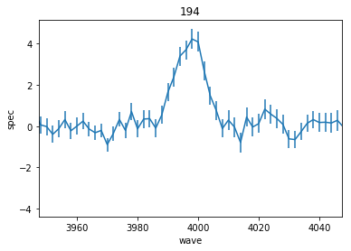
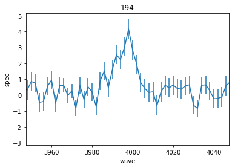
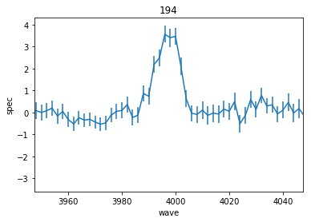
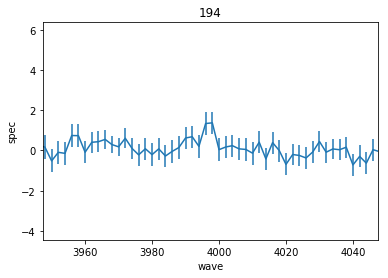

Extracting Spectra
==================

This notebook demonstrates how to grab 1D aperture summed HETDEX spectra
for an input of ID, RA and DEC using the ``Extract`` Class API from
``hetdex_api``. This can be done interactively using ``get_spectra``
from hte ``hetdex_tools.get_spec`` module. It can also be done in the
command line using the quick entry call ``hetdex_get_spec`` providing
you have hetdex\_api pip installed.

Examples of what you might like to do with the spectra afterwards is
shown later. The output is stored in an astropy table of spectra. For
every HETDEX observation where spectra is found, a spectra is given. It
is up to the user to combine the spectra afterwards.

IMPORTANT NOTE OF CAUTION WITH RUNNING ON TACC!!!
~~~~~~~~~~~~~~~~~~~~~~~~~~~~~~~~~~~~~~~~~~~~~~~~~

Because this script involves opening the Fibers class object which
contains all fiber spectra from a 3 dither observation, you will be
pulling in a lot of memory for each shot that is open. **NEVER** run
this script from a login node on TACC. A login node is a node you access
when you ssh in.

You need to request a compute node instead by either

(1) using the idev command : ``idev -t 04:00:00``

(2) using a jupyter notebook

(3) or by submitting the job into the slurm job scheduler (this is
    probably only needed if you are doing more than 1000 extractions per
    shot on more than 1000 shots)

Import all necessary python packages.
~~~~~~~~~~~~~~~~~~~~~~~~~~~~~~~~~~~~~

These are mainly for working within the notebook. The command line tool
already has the necessary preamble built in.

.. code:: ipython3

    %matplotlib inline
    import matplotlib.pyplot as plt
    import numpy as np
    
    import astropy.units as u
    from astropy.io import fits
    from astropy.coordinates import SkyCoord
    from astropy.table import Table, join
    
    from hetdex_tools.get_spec import get_spectra

Getting all spectra at a specified RA/DEC. This will search through all shots in HDR2
-------------------------------------------------------------------------------------

If a shotid is not specified the program will search for any shot within
HDR2 that overlaps within an 11 arcmin radius of the input coordinates.
Because of the non-contiguous VIRUS footprint, there is no guarantee the
aperture defined by the input ra/dec/rad will contain enough fibers to
do a measurement. The aperture radius is 3" by default or can be
specified with the --rad argument.

Open a catalog of IDs, RAs, DECs:

.. code:: ipython3

    input_cat = Table.read('/work/05350/ecooper/stampede2/hdr2-tests/hps-muse/highz_emitters.fits')

.. code:: ipython3

    input_cat.show_in_notebook(display_length=10)

.. raw:: html

    <i>Table length=189</i>
    <table id="table48011182693512-137511" class="table-striped table-bordered table-condensed">
    <thead><tr><th>idx</th><th>ID</th><th>RA</th><th>DEC</th><th>WAVE</th><th>FLUX</th><th>FLUXE_L</th><th>FLUXE_H</th><th>z</th></tr></thead>
    <thead><tr><th></th><th></th><th>deg</th><th>deg</th><th>Angstrom</th><th>1e-17 erg / (cm2 s)</th><th>1e-17 erg / (cm2 s)</th><th>1e-17 erg / (cm2 s)</th><th></th></tr></thead>
    <tr><td>0</td><td>3</td><td>35.30979166666667</td><td>-4.527130555555556</td><td>4973.93</td><td>19.9</td><td>3.1</td><td>4.7</td><td>3.0915</td></tr>
    <tr><td>1</td><td>4</td><td>35.31191666666666</td><td>-4.532388888888889</td><td>5261.37</td><td>42.6</td><td>12.4</td><td>11.2</td><td>1.7561</td></tr>
    <tr><td>2</td><td>5</td><td>35.31308333333333</td><td>-4.531666666666666</td><td>4270.67</td><td>342.1</td><td>14.3</td><td>16.5</td><td>1.757</td></tr>
    <tr><td>3</td><td>6</td><td>35.31816666666666</td><td>-4.4926</td><td>4591.58</td><td>32.7</td><td>3.6</td><td>3.5</td><td>2.777</td></tr>
    <tr><td>4</td><td>11</td><td>35.32691666666666</td><td>-4.459319444444445</td><td>4590.82</td><td>21.2</td><td>4.6</td><td>4.7</td><td>2.7764</td></tr>
    <tr><td>5</td><td>13</td><td>35.3305</td><td>-4.510855555555556</td><td>5250.96</td><td>11.7</td><td>1.9</td><td>2.6</td><td>3.3194</td></tr>
    <tr><td>6</td><td>17</td><td>35.33283333333333</td><td>-4.462030555555556</td><td>4588.13</td><td>13.2</td><td>3.4</td><td>3.9</td><td>2.7742</td></tr>
    <tr><td>7</td><td>22</td><td>35.34562499999999</td><td>-4.490197222222222</td><td>4586.3</td><td>17.7</td><td>4.3</td><td>5.5</td><td>2.7727</td></tr>
    <tr><td>8</td><td>25</td><td>35.34804166666666</td><td>-4.486058333333333</td><td>4319.48</td><td>64.3</td><td>8.8</td><td>10.1</td><td>2.5532</td></tr>
    <tr><td>9</td><td>34</td><td>35.36329166666666</td><td>-4.494222222222223</td><td>4569.09</td><td>20.6</td><td>5.0</td><td>5.3</td><td>2.7585</td></tr>
    <tr><td>10</td><td>51</td><td>46.64495833333333</td><td>-0.0141</td><td>4980.74</td><td>9.1</td><td>4.0</td><td>5.0</td><td>3.0971</td></tr>
    <tr><td>11</td><td>62</td><td>46.65920833333333</td><td>0.010777777777777777</td><td>3741.83</td><td>67.7</td><td>21.0</td><td>22.9</td><td>2.078</td></tr>
    <tr><td>12</td><td>82</td><td>46.66941666666666</td><td>-0.025202777777777775</td><td>3950.67</td><td>89.8</td><td>24.2</td><td>23.4</td><td>2.2498</td></tr>
    <tr><td>13</td><td>84</td><td>46.671166666666664</td><td>-0.0471</td><td>5159.92</td><td>31.9</td><td>5.8</td><td>10.2</td><td>3.2445</td></tr>
    <tr><td>14</td><td>89</td><td>46.68345833333333</td><td>-0.024802777777777778</td><td>4299.64</td><td>30.2</td><td>7.0</td><td>5.7</td><td>2.5368</td></tr>
    <tr><td>15</td><td>91</td><td>46.684416666666664</td><td>0.012855555555555556</td><td>4858.31</td><td>16.7</td><td>5.2</td><td>5.8</td><td>2.9964</td></tr>
    <tr><td>16</td><td>93</td><td>46.68654166666666</td><td>-0.04702777777777778</td><td>3966.35</td><td>65.2</td><td>17.1</td><td>13.9</td><td>2.2627</td></tr>
    <tr><td>17</td><td>95</td><td>46.693666666666665</td><td>0.051736111111111115</td><td>4196.57</td><td>34.6</td><td>12.2</td><td>12.4</td><td>2.4521</td></tr>
    <tr><td>18</td><td>99</td><td>46.70170833333333</td><td>0.004713888888888889</td><td>4868.35</td><td>33.0</td><td>5.3</td><td>8.3</td><td>3.0047</td></tr>
    <tr><td>19</td><td>109</td><td>46.709083333333325</td><td>-0.03758333333333333</td><td>5111.34</td><td>30.7</td><td>6.2</td><td>9.9</td><td>3.2045</td></tr>
    <tr><td>20</td><td>111</td><td>46.709999999999994</td><td>0.027897222222222223</td><td>5080.69</td><td>15.1</td><td>5.4</td><td>4.6</td><td>3.1793</td></tr>
    <tr><td>21</td><td>126</td><td>46.73079166666667</td><td>0.009197222222222221</td><td>4653.11</td><td>167.1</td><td>13.8</td><td>14.8</td><td>2.8276</td></tr>
    <tr><td>22</td><td>127</td><td>46.73104166666666</td><td>0.05921388888888889</td><td>4298.41</td><td>22.1</td><td>6.8</td><td>10.9</td><td>2.5358</td></tr>
    <tr><td>23</td><td>142</td><td>46.74570833333333</td><td>-0.04310555555555556</td><td>4352.06</td><td>20.6</td><td>3.2</td><td>6.8</td><td>2.58</td></tr>
    <tr><td>24</td><td>144</td><td>150.02399999999997</td><td>2.3302611111111107</td><td>4534.15</td><td>5.5</td><td>2.5</td><td>2.7</td><td>2.7298</td></tr>
    <tr><td>25</td><td>145</td><td>150.0257083333333</td><td>2.2185055555555557</td><td>3859.84</td><td>84.0</td><td>8.1</td><td>14.8</td><td>2.1751</td></tr>
    <tr><td>26</td><td>148</td><td>150.02945833333334</td><td>2.3238416666666666</td><td>5370.35</td><td>8.6</td><td>2.6</td><td>2.0</td><td>3.4176</td></tr>
    <tr><td>27</td><td>150</td><td>150.0305</td><td>2.2485055555555555</td><td>4742.42</td><td>29.1</td><td>6.7</td><td>6.9</td><td>2.9011</td></tr>
    <tr><td>28</td><td>153</td><td>150.0308333333333</td><td>2.212511111111111</td><td>4507.81</td><td>31.9</td><td>6.4</td><td>6.2</td><td>2.7081</td></tr>
    <tr><td>29</td><td>154</td><td>150.03174999999996</td><td>2.2548833333333334</td><td>4707.81</td><td>10.6</td><td>2.8</td><td>2.6</td><td>2.8726</td></tr>
    <tr><td>30</td><td>160</td><td>150.03570833333333</td><td>2.2941527777777777</td><td>4175.32</td><td>17.1</td><td>6.4</td><td>10.5</td><td>2.4346</td></tr>
    <tr><td>31</td><td>161</td><td>150.03641666666664</td><td>2.2140222222222223</td><td>5168.43</td><td>39.1</td><td>4.1</td><td>4.1</td><td>3.2515</td></tr>
    <tr><td>32</td><td>162</td><td>150.0368333333333</td><td>2.258111111111111</td><td>4167.83</td><td>76.4</td><td>11.5</td><td>14.6</td><td>2.4284</td></tr>
    <tr><td>33</td><td>164</td><td>150.03725</td><td>2.28925</td><td>4196.31</td><td>25.4</td><td>12.9</td><td>13.7</td><td>2.4518</td></tr>
    <tr><td>34</td><td>168</td><td>150.04074999999997</td><td>2.2483305555555555</td><td>5409.27</td><td>34.9</td><td>3.0</td><td>2.8</td><td>3.4496</td></tr>
    <tr><td>35</td><td>174</td><td>150.04583333333332</td><td>2.207555555555556</td><td>5405.49</td><td>3.2</td><td>2.4</td><td>2.4</td><td>3.4465</td></tr>
    <tr><td>36</td><td>182</td><td>150.05175</td><td>2.2376444444444443</td><td>4174.25</td><td>25.6</td><td>5.2</td><td>5.8</td><td>2.4337</td></tr>
    <tr><td>37</td><td>183</td><td>150.05229166666666</td><td>2.2979333333333334</td><td>3844.49</td><td>27.8</td><td>11.3</td><td>23.1</td><td>2.1624</td></tr>
    <tr><td>38</td><td>184</td><td>150.05229166666666</td><td>2.2983777777777776</td><td>5112.92</td><td>6.1</td><td>3.2</td><td>5.0</td><td>3.2058</td></tr>
    <tr><td>39</td><td>189</td><td>150.05504166666665</td><td>2.31525</td><td>4195.93</td><td>12.9</td><td>6.7</td><td>8.7</td><td>2.4515</td></tr>
    <tr><td>40</td><td>190</td><td>150.05520833333333</td><td>2.280333333333333</td><td>3980.38</td><td>19.2</td><td>5.8</td><td>4.7</td><td>2.2742</td></tr>
    <tr><td>41</td><td>194</td><td>150.05908333333332</td><td>2.2405861111111114</td><td>3997.41</td><td>61.0</td><td>4.3</td><td>4.9</td><td>2.2882</td></tr>
    <tr><td>42</td><td>196</td><td>150.06099999999998</td><td>2.274375</td><td>4441.28</td><td>24.0</td><td>4.7</td><td>3.1</td><td>2.6534</td></tr>
    <tr><td>43</td><td>197</td><td>150.06166666666664</td><td>2.296183333333333</td><td>4184.22</td><td>17.8</td><td>6.0</td><td>7.1</td><td>2.4419</td></tr>
    <tr><td>44</td><td>205</td><td>150.068625</td><td>2.3419194444444447</td><td>4750.98</td><td>22.6</td><td>6.2</td><td>6.2</td><td>2.9081</td></tr>
    <tr><td>45</td><td>207</td><td>150.07004166666664</td><td>2.3057027777777774</td><td>4509.08</td><td>9.9</td><td>3.2</td><td>3.5</td><td>2.7091</td></tr>
    <tr><td>46</td><td>210</td><td>150.07116666666664</td><td>2.270452777777778</td><td>5455.26</td><td>10.5</td><td>3.3</td><td>3.4</td><td>3.4874</td></tr>
    <tr><td>47</td><td>213</td><td>150.07245833333332</td><td>2.2826166666666667</td><td>5226.89</td><td>13.0</td><td>3.1</td><td>3.5</td><td>3.2996</td></tr>
    <tr><td>48</td><td>214</td><td>150.07291666666666</td><td>2.317994444444444</td><td>5221.86</td><td>8.2</td><td>3.2</td><td>4.4</td><td>3.2955</td></tr>
    <tr><td>49</td><td>222</td><td>150.07599999999996</td><td>2.2642694444444444</td><td>4793.4</td><td>87.3</td><td>5.8</td><td>4.7</td><td>2.943</td></tr>
    <tr><td>50</td><td>223</td><td>150.07774999999998</td><td>2.2499972222222224</td><td>4018.61</td><td>39.0</td><td>9.4</td><td>11.5</td><td>2.3057</td></tr>
    <tr><td>51</td><td>229</td><td>150.08091666666664</td><td>2.220005555555556</td><td>4910.43</td><td>41.6</td><td>5.0</td><td>4.2</td><td>3.0393</td></tr>
    <tr><td>52</td><td>231</td><td>150.0865833333333</td><td>2.3216083333333333</td><td>4524.17</td><td>30.8</td><td>7.6</td><td>8.0</td><td>2.7215</td></tr>
    <tr><td>53</td><td>244</td><td>150.09916666666663</td><td>2.2195222222222224</td><td>3768.03</td><td>10.4</td><td>4.2</td><td>5.2</td><td>2.0996</td></tr>
    <tr><td>54</td><td>249</td><td>150.11133333333333</td><td>2.2947916666666663</td><td>5194.68</td><td>7.4</td><td>2.7</td><td>3.1</td><td>3.2731</td></tr>
    <tr><td>55</td><td>251</td><td>150.1135</td><td>2.2920166666666666</td><td>3993.64</td><td>45.0</td><td>11.6</td><td>13.7</td><td>2.2851</td></tr>
    <tr><td>56</td><td>253</td><td>150.11475</td><td>2.264047222222222</td><td>5085.05</td><td>20.4</td><td>4.4</td><td>3.6</td><td>3.1829</td></tr>
    <tr><td>57</td><td>256</td><td>150.11804166666667</td><td>2.2995666666666668</td><td>4243.48</td><td>31.4</td><td>6.5</td><td>9.3</td><td>2.4907</td></tr>
    <tr><td>58</td><td>258</td><td>150.11891666666665</td><td>2.298961111111111</td><td>4631.84</td><td>31.2</td><td>4.9</td><td>2.8</td><td>2.8101</td></tr>
    <tr><td>59</td><td>261</td><td>150.11929166666664</td><td>2.296875</td><td>3763.7</td><td>143.7</td><td>10.1</td><td>23.2</td><td>2.096</td></tr>
    <tr><td>60</td><td>263</td><td>150.1210833333333</td><td>2.2354166666666666</td><td>4172.49</td><td>24.1</td><td>7.7</td><td>8.0</td><td>2.4323</td></tr>
    <tr><td>61</td><td>266</td><td>150.123875</td><td>2.3139166666666666</td><td>3886.57</td><td>41.9</td><td>5.7</td><td>5.8</td><td>2.1971</td></tr>
    <tr><td>62</td><td>269</td><td>150.127625</td><td>2.2953694444444444</td><td>4334.67</td><td>13.9</td><td>2.9</td><td>4.4</td><td>2.5657</td></tr>
    <tr><td>63</td><td>274</td><td>150.133875</td><td>2.3197861111111107</td><td>4703.77</td><td>17.4</td><td>2.6</td><td>3.8</td><td>2.8693</td></tr>
    <tr><td>64</td><td>283</td><td>150.1388333333333</td><td>2.3070416666666667</td><td>5226.85</td><td>22.1</td><td>3.1</td><td>3.3</td><td>3.2996</td></tr>
    <tr><td>65</td><td>286</td><td>150.14149999999998</td><td>2.2210388888888892</td><td>3925.73</td><td>28.4</td><td>4.3</td><td>8.1</td><td>2.2293</td></tr>
    <tr><td>66</td><td>287</td><td>150.14537499999997</td><td>2.295572222222222</td><td>5248.1</td><td>6.0</td><td>3.0</td><td>2.3</td><td>3.317</td></tr>
    <tr><td>67</td><td>288</td><td>150.14612499999998</td><td>2.2970666666666664</td><td>4911.08</td><td>11.9</td><td>3.3</td><td>2.6</td><td>3.0398</td></tr>
    <tr><td>68</td><td>292</td><td>150.14895833333333</td><td>2.316027777777778</td><td>4706.49</td><td>30.1</td><td>3.5</td><td>4.4</td><td>2.8715</td></tr>
    <tr><td>69</td><td>296</td><td>150.1533333333333</td><td>2.2195722222222223</td><td>4664.6</td><td>11.1</td><td>2.8</td><td>5.5</td><td>2.8371</td></tr>
    <tr><td>70</td><td>306</td><td>150.1650833333333</td><td>2.2274444444444446</td><td>4180.67</td><td>38.3</td><td>9.2</td><td>5.8</td><td>2.439</td></tr>
    <tr><td>71</td><td>310</td><td>150.16970833333332</td><td>2.2947333333333333</td><td>4948.2</td><td>10.7</td><td>2.4</td><td>2.9</td><td>3.0703</td></tr>
    <tr><td>72</td><td>313</td><td>150.1700833333333</td><td>2.306388888888889</td><td>3765.58</td><td>25.1</td><td>10.1</td><td>12.4</td><td>2.0975</td></tr>
    <tr><td>73</td><td>314</td><td>150.1712083333333</td><td>2.284333333333333</td><td>4414.31</td><td>14.4</td><td>2.9</td><td>5.7</td><td>2.6312</td></tr>
    <tr><td>74</td><td>315</td><td>150.17299999999997</td><td>2.3047888888888886</td><td>4949.89</td><td>8.6</td><td>2.4</td><td>2.9</td><td>3.0717</td></tr>
    <tr><td>75</td><td>316</td><td>150.17854166666663</td><td>2.2752777777777777</td><td>4628.37</td><td>22.1</td><td>4.8</td><td>6.8</td><td>2.8073</td></tr>
    <tr><td>76</td><td>318</td><td>150.18449999999999</td><td>2.2662472222222223</td><td>4201.16</td><td>30.3</td><td>11.1</td><td>8.9</td><td>2.4558</td></tr>
    <tr><td>77</td><td>327</td><td>150.19041666666664</td><td>2.282972222222222</td><td>3954.25</td><td>15.5</td><td>6.0</td><td>6.5</td><td>2.2527</td></tr>
    <tr><td>78</td><td>334</td><td>189.06262499999997</td><td>62.17366666666666</td><td>4680.15</td><td>29.2</td><td>5.2</td><td>6.3</td><td>2.8499</td></tr>
    <tr><td>79</td><td>338</td><td>189.07208333333332</td><td>62.17348055555555</td><td>4378.8</td><td>33.3</td><td>8.2</td><td>9.4</td><td>2.602</td></tr>
    <tr><td>80</td><td>341</td><td>189.07299999999998</td><td>62.21937777777778</td><td>4778.04</td><td>12.8</td><td>2.8</td><td>4.1</td><td>2.9304</td></tr>
    <tr><td>81</td><td>360</td><td>189.1318333333333</td><td>62.19435</td><td>4765.23</td><td>18.7</td><td>4.9</td><td>4.8</td><td>2.9198</td></tr>
    <tr><td>82</td><td>370</td><td>189.14537499999997</td><td>62.21485277777778</td><td>5079.2</td><td>11.8</td><td>3.3</td><td>3.6</td><td>3.1781</td></tr>
    <tr><td>83</td><td>371</td><td>189.14724999999999</td><td>62.23983333333334</td><td>4660.93</td><td>13.9</td><td>5.5</td><td>4.1</td><td>2.009</td></tr>
    <tr><td>84</td><td>372</td><td>189.14991666666666</td><td>62.201680555555555</td><td>4569.17</td><td>10.8</td><td>2.1</td><td>3.3</td><td>2.7586</td></tr>
    <tr><td>85</td><td>373</td><td>189.1497083333333</td><td>62.19397222222222</td><td>4755.83</td><td>19.2</td><td>4.1</td><td>4.7</td><td>2.9121</td></tr>
    <tr><td>86</td><td>389</td><td>189.1738333333333</td><td>62.21080555555556</td><td>4362.38</td><td>21.5</td><td>3.6</td><td>4.3</td><td>2.5885</td></tr>
    <tr><td>87</td><td>391</td><td>189.1767083333333</td><td>62.246858333333336</td><td>4812.62</td><td>28.0</td><td>6.8</td><td>6.5</td><td>2.9588</td></tr>
    <tr><td>88</td><td>395</td><td>189.18379166666665</td><td>62.23608055555555</td><td>3979.36</td><td>20.4</td><td>7.5</td><td>10.0</td><td>2.2734</td></tr>
    <tr><td>89</td><td>401</td><td>189.1934583333333</td><td>62.24605555555556</td><td>3649.39</td><td>103.2</td><td>13.1</td><td>20.9</td><td>2.002</td></tr>
    <tr><td>90</td><td>402</td><td>189.19574999999998</td><td>62.20725277777778</td><td>4821.05</td><td>16.8</td><td>3.2</td><td>1.7</td><td>2.9658</td></tr>
    <tr><td>91</td><td>403</td><td>189.19737499999997</td><td>62.253505555555556</td><td>5079.54</td><td>10.2</td><td>2.5</td><td>1.9</td><td>3.1784</td></tr>
    <tr><td>92</td><td>415</td><td>189.20637499999998</td><td>62.23920555555556</td><td>5308.51</td><td>12.0</td><td>2.6</td><td>3.2</td><td>3.3667</td></tr>
    <tr><td>93</td><td>419</td><td>189.20891666666662</td><td>62.23363055555556</td><td>3932.55</td><td>24.4</td><td>5.1</td><td>3.3</td><td>2.2349</td></tr>
    <tr><td>94</td><td>420</td><td>189.21008333333333</td><td>62.18201666666666</td><td>4776.35</td><td>18.6</td><td>4.3</td><td>3.5</td><td>2.929</td></tr>
    <tr><td>95</td><td>426</td><td>189.21554166666664</td><td>62.252827777777775</td><td>5354.45</td><td>7.6</td><td>1.4</td><td>2.3</td><td>3.4045</td></tr>
    <tr><td>96</td><td>428</td><td>189.21624999999997</td><td>62.254275</td><td>5270.01</td><td>14.3</td><td>2.3</td><td>2.8</td><td>3.3351</td></tr>
    <tr><td>97</td><td>434</td><td>189.22591666666662</td><td>62.22660555555556</td><td>3970.24</td><td>11.9</td><td>3.4</td><td>3.8</td><td>2.2659</td></tr>
    <tr><td>98</td><td>436</td><td>189.22766666666664</td><td>62.228141666666666</td><td>4156.58</td><td>7.5</td><td>2.5</td><td>2.8</td><td>2.4192</td></tr>
    <tr><td>99</td><td>447</td><td>189.24770833333332</td><td>62.22795555555556</td><td>5016.05</td><td>7.2</td><td>1.2</td><td>2.1</td><td>3.1262</td></tr>
    <tr><td>100</td><td>461</td><td>189.267375</td><td>62.24630555555556</td><td>4977.89</td><td>13.5</td><td>3.0</td><td>4.4</td><td>2.2136</td></tr>
    <tr><td>101</td><td>462</td><td>189.26812499999997</td><td>62.24615555555555</td><td>3905.67</td><td>78.9</td><td>7.9</td><td>8.8</td><td>2.2128</td></tr>
    <tr><td>102</td><td>466</td><td>189.27545833333332</td><td>62.25040555555555</td><td>5152.53</td><td>20.5</td><td>2.1</td><td>2.6</td><td>3.2384</td></tr>
    <tr><td>103</td><td>467</td><td>189.281375</td><td>62.19397222222222</td><td>4622.35</td><td>9.4</td><td>2.7</td><td>3.9</td><td>2.8023</td></tr>
    <tr><td>104</td><td>474</td><td>189.29591666666664</td><td>62.19447222222222</td><td>3980.21</td><td>13.6</td><td>6.4</td><td>8.8</td><td>2.2741</td></tr>
    <tr><td>105</td><td>201002048</td><td>150.0936100103027</td><td>2.197079804110475</td><td>4909.6015625</td><td>6.040083618164062</td><td>0.6770445251464844</td><td>0.6770445251464844</td><td>3.041830062866211</td></tr>
    <tr><td>106</td><td>201004081</td><td>150.0973625368513</td><td>2.1989284511255036</td><td>4957.1015625</td><td>24.0437353515625</td><td>1.332271728515625</td><td>1.332271728515625</td><td>3.0806000232696533</td></tr>
    <tr><td>107</td><td>202003009</td><td>150.11300542162525</td><td>2.2055545703502295</td><td>4974.59716796875</td><td>3.041697692871094</td><td>0.6218219757080078</td><td>0.6218219757080078</td><td>3.0950798988342285</td></tr>
    <tr><td>108</td><td>202004010</td><td>150.10835439857973</td><td>2.2077084434577796</td><td>4979.59716796875</td><td>2.0813160705566407</td><td>0.5939425659179688</td><td>0.5939425659179688</td><td>3.0997800827026367</td></tr>
    <tr><td>109</td><td>202005011</td><td>150.10638104406365</td><td>2.205966966701576</td><td>5040.84716796875</td><td>1.6859991455078125</td><td>0.5191465759277344</td><td>0.5191465759277344</td><td>3.1497600078582764</td></tr>
    <tr><td>110</td><td>202008022</td><td>150.10223373165607</td><td>2.208492044066441</td><td>5142.09716796875</td><td>1.092920684814453</td><td>0.40910652160644534</td><td>0.40910652160644534</td><td>3.232840061187744</td></tr>
    <tr><td>111</td><td>202010025</td><td>150.11398801583178</td><td>2.201566510104526</td><td>5398.34716796875</td><td>4.680664672851562</td><td>0.7666251373291015</td><td>0.7666251373291015</td><td>3.4479000568389893</td></tr>
    <tr><td>112</td><td>203003080</td><td>150.12392223953074</td><td>2.194697065557271</td><td>4825.8486328125</td><td>1.7365447998046875</td><td>0.5362403869628907</td><td>0.5362403869628907</td><td>2.9733200073242188</td></tr>
    <tr><td>113</td><td>203007099</td><td>150.11562435811962</td><td>2.206308042126145</td><td>5017.0986328125</td><td>1.7836306762695313</td><td>0.47349220275878906</td><td>0.47349220275878906</td><td>3.1273</td></tr>
    <tr><td>114</td><td>206004030</td><td>150.16313817597705</td><td>2.200090831769376</td><td>5022.03662109375</td><td>1.7173178100585937</td><td>0.5557575225830078</td><td>0.5557575225830078</td><td>3.1340699195861816</td></tr>
    <tr><td>115</td><td>206005031</td><td>150.16977452360257</td><td>2.201128165451167</td><td>5023.28662109375</td><td>1.8908502197265624</td><td>0.7347137451171875</td><td>0.7347137451171875</td><td>3.1362099647521973</td></tr>
    <tr><td>116</td><td>206012087</td><td>150.16579251962278</td><td>2.1970864758281774</td><td>5202.03662109375</td><td>5.338741455078125</td><td>1.4613812255859375</td><td>1.4613812255859375</td><td>3.2824699878692627</td></tr>
    <tr><td>117</td><td>206013088</td><td>150.175088444528</td><td>2.2039103947676635</td><td>5395.78662109375</td><td>0.8027860260009766</td><td>0.39751094818115235</td><td>0.39751094818115235</td><td>3.441970109939575</td></tr>
    <tr><td>118</td><td>206014089</td><td>150.1759890713672</td><td>2.2058759713710496</td><td>5425.78662109375</td><td>2.168329772949219</td><td>0.5119286727905273</td><td>0.5119286727905273</td><td>3.467170000076294</td></tr>
    <tr><td>119</td><td>207007152</td><td>150.1835107152323</td><td>2.2032855507721476</td><td>4970.12890625</td><td>1.3458299255371093</td><td>0.43450424194335935</td><td>0.43450424194335935</td><td>3.0925099849700928</td></tr>
    <tr><td>120</td><td>207008153</td><td>150.17665932378333</td><td>2.2004988502122727</td><td>5025.12890625</td><td>2.881204833984375</td><td>0.6021175384521484</td><td>0.6021175384521484</td><td>3.136780023574829</td></tr>
    <tr><td>121</td><td>207009154</td><td>150.19023939360343</td><td>2.194596482546886</td><td>5243.87890625</td><td>0.8885382080078125</td><td>0.41606117248535157</td><td>0.41606117248535157</td><td>3.3162100315093994</td></tr>
    <tr><td>122</td><td>207010155</td><td>150.1807236499591</td><td>2.194942220582654</td><td>5273.87890625</td><td>3.64375</td><td>0.562629165649414</td><td>0.562629165649414</td><td>3.3410799503326416</td></tr>
    <tr><td>123</td><td>207012157</td><td>150.1868414731068</td><td>2.1956956929365146</td><td>5430.12890625</td><td>1.2259458923339843</td><td>0.2869565773010254</td><td>0.2869565773010254</td><td>3.4702200889587402</td></tr>
    <tr><td>124</td><td>208005148</td><td>150.08376515160856</td><td>2.2182323397697625</td><td>4879.845703125</td><td>1.4492535400390625</td><td>0.41133209228515627</td><td>0.41133209228515627</td><td>3.0173099040985107</td></tr>
    <tr><td>125</td><td>208006149</td><td>150.08345793548796</td><td>2.2160142275343357</td><td>4879.845703125</td><td>2.894234924316406</td><td>0.7781204223632813</td><td>0.7781204223632813</td><td>3.0180399417877197</td></tr>
    <tr><td>126</td><td>208007150</td><td>150.0872080814207</td><td>2.208978293014077</td><td>4882.345703125</td><td>0.80390380859375</td><td>0.4174640655517578</td><td>0.4174640655517578</td><td>3.0200400352478027</td></tr>
    <tr><td>127</td><td>208011254</td><td>150.0890237159948</td><td>2.2118520638723815</td><td>5079.845703125</td><td>0.5708731079101562</td><td>0.3174759292602539</td><td>0.3174759292602539</td><td>3.1814401149749756</td></tr>
    <tr><td>128</td><td>208012255</td><td>150.09001912115818</td><td>2.221605235299222</td><td>5163.595703125</td><td>2.3117642211914062</td><td>0.5153635787963867</td><td>0.5153635787963867</td><td>3.2509100437164307</td></tr>
    <tr><td>129</td><td>208013257</td><td>150.09396802356156</td><td>2.2246379398758074</td><td>5177.345703125</td><td>0.26800636291503904</td><td>0.5118918228149414</td><td>0.5118918228149414</td><td>3.261850118637085</td></tr>
    <tr><td>130</td><td>208014258</td><td>150.08979122309785</td><td>2.214058294477085</td><td>5217.345703125</td><td>-12.42165283203125</td><td>0.926033935546875</td><td>0.926033935546875</td><td>3.2948598861694336</td></tr>
    <tr><td>131</td><td>208015259</td><td>150.0861788068713</td><td>2.215653261908533</td><td>5217.345703125</td><td>0.623852767944336</td><td>0.32785152435302733</td><td>0.32785152435302733</td><td>3.2949700355529785</td></tr>
    <tr><td>132</td><td>208018270</td><td>150.093779644174</td><td>2.2120477145624564</td><td>5336.095703125</td><td>2.8650738525390627</td><td>0.5835579681396484</td><td>0.5835579681396484</td><td>3.3930299282073975</td></tr>
    <tr><td>133</td><td>208019271</td><td>150.0943778579285</td><td>2.2157644366106117</td><td>5347.345703125</td><td>1.3014967346191406</td><td>0.3877186584472656</td><td>0.3877186584472656</td><td>3.4018900394439697</td></tr>
    <tr><td>134</td><td>208021281</td><td>150.0967610186054</td><td>2.210226055855397</td><td>5387.345703125</td><td>1.1932009887695312</td><td>0.3766132736206055</td><td>0.3766132736206055</td><td>3.434890031814575</td></tr>
    <tr><td>135</td><td>209004106</td><td>150.0997408133018</td><td>2.219563438723454</td><td>4889.8466796875</td><td>0.12314460754394531</td><td>0.3668796157836914</td><td>0.3668796157836914</td><td>3.025979995727539</td></tr>
    <tr><td>136</td><td>209005107</td><td>150.10515420600376</td><td>2.2101667405271503</td><td>4986.0966796875</td><td>0.7008580780029297</td><td>0.409814338684082</td><td>0.409814338684082</td><td>3.1049299240112305</td></tr>
    <tr><td>137</td><td>209006108</td><td>150.11395213416137</td><td>2.217843978379339</td><td>5014.8466796875</td><td>1.140467987060547</td><td>0.376722526550293</td><td>0.376722526550293</td><td>3.1279499530792236</td></tr>
    <tr><td>138</td><td>209010135</td><td>150.10564951271456</td><td>2.220533632934088</td><td>5112.3466796875</td><td>2.097617340087891</td><td>0.5667033004760742</td><td>0.5667033004760742</td><td>3.209120035171509</td></tr>
    <tr><td>139</td><td>209013149</td><td>150.1037868463829</td><td>2.2104448595571027</td><td>5156.0966796875</td><td>3.980615539550781</td><td>0.681175765991211</td><td>0.681175765991211</td><td>3.2442100048065186</td></tr>
    <tr><td>140</td><td>209015151</td><td>150.10771638157627</td><td>2.2097663724977554</td><td>5204.8466796875</td><td>1.065474853515625</td><td>0.3719486618041992</td><td>0.3719486618041992</td><td>3.2850899696350098</td></tr>
    <tr><td>141</td><td>209017156</td><td>150.1072353902555</td><td>2.2199070734405444</td><td>5396.0966796875</td><td>1.0309259796142578</td><td>0.3059754753112793</td><td>0.3059754753112793</td><td>3.442389965057373</td></tr>
    <tr><td>142</td><td>209018157</td><td>150.10773389515768</td><td>2.210563446066236</td><td>5484.8466796875</td><td>0.6695948791503906</td><td>0.27219831466674804</td><td>0.27219831466674804</td><td>3.5151000022888184</td></tr>
    <tr><td>143</td><td>210003213</td><td>150.11812918473055</td><td>2.212888209556925</td><td>4866.0810546875</td><td>7.896867065429688</td><td>0.8164598083496094</td><td>0.8164598083496094</td><td>3.0062999725341797</td></tr>
    <tr><td>144</td><td>210006216</td><td>150.1273792357165</td><td>2.2147139895096166</td><td>4977.3310546875</td><td>4.5834326171875</td><td>0.6518028259277344</td><td>0.6518028259277344</td><td>3.0979299545288086</td></tr>
    <tr><td>145</td><td>210012237</td><td>150.12834299468483</td><td>2.211460037394944</td><td>5251.0810546875</td><td>0.8965462493896484</td><td>0.35950897216796873</td><td>0.35950897216796873</td><td>3.323499917984009</td></tr>
    <tr><td>146</td><td>211006179</td><td>150.13420312342396</td><td>2.2227468684086604</td><td>4994.83203125</td><td>0.9598367309570313</td><td>0.42652130126953125</td><td>0.42652130126953125</td><td>3.112449884414673</td></tr>
    <tr><td>147</td><td>211009186</td><td>150.13111001940976</td><td>2.2219068036707506</td><td>5202.33203125</td><td>1.7453984069824218</td><td>0.41878662109375</td><td>0.41878662109375</td><td>3.282560110092163</td></tr>
    <tr><td>148</td><td>211011193</td><td>150.13065696675815</td><td>2.2238988976213565</td><td>5272.33203125</td><td>0.9423961639404297</td><td>0.34596920013427734</td><td>0.34596920013427734</td><td>3.3407199382781982</td></tr>
    <tr><td>149</td><td>212002004</td><td>150.16004373126643</td><td>2.216139525952327</td><td>4868.5732421875</td><td>2.9883938598632813</td><td>0.6268703079223633</td><td>0.6268703079223633</td><td>3.0089900493621826</td></tr>
    <tr><td>150</td><td>212005007</td><td>150.1551060829414</td><td>2.2216891531370653</td><td>5056.0732421875</td><td>1.413601837158203</td><td>0.4958915710449219</td><td>0.4958915710449219</td><td>3.1631600856781006</td></tr>
    <tr><td>151</td><td>212008018</td><td>150.14686282798576</td><td>2.2123079160540824</td><td>5422.3232421875</td><td>2.914283447265625</td><td>0.606224365234375</td><td>0.606224365234375</td><td>3.46382999420166</td></tr>
    <tr><td>152</td><td>213001001</td><td>150.1674368764682</td><td>2.2104624944184756</td><td>4756.07421875</td><td>0.9408351135253906</td><td>0.5194489669799804</td><td>0.5194489669799804</td><td>2.9154000282287598</td></tr>
    <tr><td>153</td><td>213002002</td><td>150.17675020119012</td><td>2.2231212125578073</td><td>4786.07421875</td><td>2.78972900390625</td><td>0.5562894821166993</td><td>0.5562894821166993</td><td>2.9392900466918945</td></tr>
    <tr><td>154</td><td>213003003</td><td>150.17501070898177</td><td>2.212364241933338</td><td>4824.82421875</td><td>2.768005676269531</td><td>0.5076504135131836</td><td>0.5076504135131836</td><td>2.9730000495910645</td></tr>
    <tr><td>155</td><td>213004004</td><td>150.1659416538878</td><td>2.222090869461713</td><td>4867.32421875</td><td>0.8094330596923828</td><td>0.4116691589355469</td><td>0.4116691589355469</td><td>3.007420063018799</td></tr>
    <tr><td>156</td><td>213007015</td><td>150.16997531490887</td><td>2.2190311823013316</td><td>4927.32421875</td><td>0.6598477172851562</td><td>0.36363895416259767</td><td>0.36363895416259767</td><td>3.0567400455474854</td></tr>
    <tr><td>157</td><td>213011046</td><td>150.1659081501985</td><td>2.2217525781744243</td><td>4973.57421875</td><td>3.840245361328125</td><td>0.5671250152587891</td><td>0.5671250152587891</td><td>3.094680070877075</td></tr>
    <tr><td>158</td><td>213012047</td><td>150.16446038351467</td><td>2.214270866946237</td><td>4982.32421875</td><td>1.6865493774414062</td><td>0.4241415786743164</td><td>0.4241415786743164</td><td>3.1018199920654297</td></tr>
    <tr><td>159</td><td>213021101</td><td>150.1695736479751</td><td>2.216292447741216</td><td>5424.82421875</td><td>0.8030073547363281</td><td>0.30307783126831056</td><td>0.30307783126831056</td><td>3.4655699729919434</td></tr>
    <tr><td>160</td><td>213023112</td><td>150.16171319112092</td><td>2.210333198404271</td><td>5457.32421875</td><td>1.2218739318847656</td><td>0.41161121368408204</td><td>0.41161121368408204</td><td>3.4926199913024902</td></tr>
    <tr><td>161</td><td>214002011</td><td>150.1926030331675</td><td>2.2199205106849913</td><td>4968.4208984375</td><td>14.488447265625</td><td>1.516922149658203</td><td>1.516922149658203</td><td>3.0902299880981445</td></tr>
    <tr><td>162</td><td>214004017</td><td>150.18474929527684</td><td>2.215924104524965</td><td>5023.4208984375</td><td>2.218711700439453</td><td>0.5754315948486328</td><td>0.5754315948486328</td><td>3.135469913482666</td></tr>
    <tr><td>163</td><td>215004022</td><td>150.08474372310837</td><td>2.2333281454141813</td><td>5155.80078125</td><td>5.754979858398437</td><td>0.6680517578125</td><td>0.6680517578125</td><td>3.244489908218384</td></tr>
    <tr><td>164</td><td>215007030</td><td>150.0865895555618</td><td>2.227649957839217</td><td>5413.30078125</td><td>2.1744847106933594</td><td>0.40720333099365236</td><td>0.40720333099365236</td><td>3.4561500549316406</td></tr>
    <tr><td>165</td><td>215008031</td><td>150.08815408513772</td><td>2.2345232702337428</td><td>5455.80078125</td><td>5.965879516601563</td><td>0.7175324249267578</td><td>0.7175324249267578</td><td>3.4907100200653076</td></tr>
    <tr><td>166</td><td>216004181</td><td>150.10596718475523</td><td>2.2303421418714455</td><td>4875.79345703125</td><td>5.757721557617187</td><td>1.0101393127441407</td><td>1.0101393127441407</td><td>3.0142300128936768</td></tr>
    <tr><td>167</td><td>216005182</td><td>150.1030777064425</td><td>2.2372279642435218</td><td>4910.79345703125</td><td>2.021614685058594</td><td>0.481492805480957</td><td>0.481492805480957</td><td>3.0432000160217285</td></tr>
    <tr><td>168</td><td>216011208</td><td>150.11315312313297</td><td>2.2307097233691993</td><td>5203.29345703125</td><td>3.299577331542969</td><td>0.8899745941162109</td><td>0.8899745941162109</td><td>3.283989906311035</td></tr>
    <tr><td>169</td><td>217001001</td><td>150.11755878426104</td><td>2.231532511649025</td><td>4830.21337890625</td><td>4.649094543457031</td><td>0.978067704444237</td><td>0.978067704444237</td><td>2.9743900299072266</td></tr>
    <tr><td>170</td><td>217002002</td><td>150.12465655183414</td><td>2.2286307098985025</td><td>4956.0947265625</td><td>2.04770751953125</td><td>0.5833852710717391</td><td>0.5833852710717391</td><td>3.0779600143432617</td></tr>
    <tr><td>171</td><td>217006014</td><td>150.12374116537518</td><td>2.2298708031440633</td><td>5406.1279296875</td><td>2.1186485290527344</td><td>0.5893145659506774</td><td>0.5893145659506774</td><td>3.4482500553131104</td></tr>
    <tr><td>172</td><td>218004058</td><td>150.13914744923224</td><td>2.2350988048871474</td><td>5007.9189453125</td><td>9.129331665039063</td><td>0.9399143374495151</td><td>0.9399143374495151</td><td>3.1205999851226807</td></tr>
    <tr><td>173</td><td>219004217</td><td>150.14835170687115</td><td>2.2405648917016223</td><td>4910.14990234375</td><td>2.758470153808594</td><td>0.5126450509758043</td><td>0.5126450509758043</td><td>3.0401599407196045</td></tr>
    <tr><td>174</td><td>219009247</td><td>150.15624094702946</td><td>2.2257588142787603</td><td>5083.9267578125</td><td>8.1466259765625</td><td>0.8727129922896569</td><td>0.8727129922896569</td><td>3.19398</td></tr>
    <tr><td>175</td><td>219011255</td><td>150.1470183323773</td><td>2.2264556834836107</td><td>5218.98779296875</td><td>0.9354926300048828</td><td>0.3449556342219561</td><td>0.3449556342219561</td><td>3.2942700386047363</td></tr>
    <tr><td>176</td><td>219013257</td><td>150.15991676115678</td><td>2.2306868993322366</td><td>5301.00390625</td><td>2.3502069091796876</td><td>0.5138403024473683</td><td>0.5138403024473683</td><td>3.3617498874664307</td></tr>
    <tr><td>177</td><td>220005082</td><td>150.1621118264402</td><td>2.2308279141258427</td><td>4990.45849609375</td><td>2.115766754150391</td><td>0.5613741278599235</td><td>0.5613741278599235</td><td>3.1062400341033936</td></tr>
    <tr><td>178</td><td>220008087</td><td>150.17066425071</td><td>2.2394725579896058</td><td>5307.578125</td><td>1.1334942626953124</td><td>0.3556336195804366</td><td>0.3556336195804366</td><td>3.369580030441284</td></tr>
    <tr><td>179</td><td>258003034</td><td>150.10573767592626</td><td>2.328916889720253</td><td>5116.3193359375</td><td>3.3640130615234374</td><td>0.7164601202602101</td><td>0.7164601202602101</td><td>3.2098000049591064</td></tr>
    <tr><td>180</td><td>259001001</td><td>150.11922861010837</td><td>2.3332236762264325</td><td>4871.23486328125</td><td>2.3845901489257812</td><td>0.7198298127873839</td><td>0.7198298127873839</td><td>3.0081400871276855</td></tr>
    <tr><td>181</td><td>259002002</td><td>150.12271795269461</td><td>2.3311474951578344</td><td>4979.3857421875</td><td>5.091370849609375</td><td>0.941842737938811</td><td>0.941842737938811</td><td>3.097130060195923</td></tr>
    <tr><td>182</td><td>259004007</td><td>150.12108470380272</td><td>2.3298617257957046</td><td>5020.27001953125</td><td>0.9068038177490234</td><td>0.396488253146525</td><td>0.396488253146525</td><td>3.130769968032837</td></tr>
    <tr><td>183</td><td>259008055</td><td>150.11836157380864</td><td>2.3218553092554695</td><td>5185.31494140625</td><td>4.764658813476562</td><td>0.8392513297253437</td><td>0.8392513297253437</td><td>3.2665600776672363</td></tr>
    <tr><td>184</td><td>259009056</td><td>150.115962096584</td><td>2.327410979556468</td><td>5185.60009765625</td><td>2.581982421875</td><td>0.9219445544180432</td><td>0.9219445544180432</td><td>3.2667999267578125</td></tr>
    <tr><td>185</td><td>259010057</td><td>150.12923118575054</td><td>2.318836329996964</td><td>5204.986328125</td><td>1.4121124267578125</td><td>0.5816445927422071</td><td>0.5816445927422071</td><td>3.282749891281128</td></tr>
    <tr><td>186</td><td>259011058</td><td>150.1248390835313</td><td>2.3212713174319255</td><td>5373.63037109375</td><td>1.7152011108398437</td><td>0.5433808916470996</td><td>0.5433808916470996</td><td>3.4215099811553955</td></tr>
    <tr><td>187</td><td>259013060</td><td>150.11824847120954</td><td>2.317702711223091</td><td>5468.52783203125</td><td>1.6527587890625</td><td>0.48986440091110417</td><td>0.48986440091110417</td><td>3.4995899200439453</td></tr>
    <tr><td>188</td><td>259014061</td><td>150.11463383028598</td><td>2.323572347495875</td><td>5469.24755859375</td><td>3.098494567871094</td><td>0.6771348513767546</td><td>0.6771348513767546</td><td>3.500190019607544</td></tr>
    </table>
    

``get_spectra()`` requires an astropy coordinates object list as an
input.

.. code:: ipython3

    input_coords = SkyCoord(ra=input_cat['RA'], dec=input_cat['DEC'])

.. code:: ipython3

    sources = get_spectra(input_coords, ID=input_cat['ID'])

get\_spectra() options
----------------------

There are a few options to consider when running get\_spectra():

.. code:: ipython3

    help(get_spectra)

.. parsed-literal::

    Help on function get_spectra in module hetdex_tools.get_spec:
    
    get_spectra(coords, ID=None, rad=3.0, multiprocess=True, shotid=None, survey='hdr2', tpmin=0.09, ffsky=False)
        Function to retrieve PSF-weighted, ADR and aperture corrected
        spectral extractions of HETDEX fibers. It will search all shots
        within a specific HETDEX Data Release and return a table of
        spectra for each extraction per shot in which more than 7 fibers
        are found in order to generate an extracted spectrum.
        
        Parameters
        ----------
        coords
            list astropy coordinates
        ID
            list of ID names (must be same length as coords). Will
            generate a running index if no ID is given
        rad
            radius of circular aperture to be extracted in arcsec.
            Default is 3.0
        multiprocess
            boolean flag to use multiprocessing. This will greatly
            speed up its operation as it will extract on 32 shots at
            time. But only use this when on a compute node. Use
            idev, a jupyter notebook, or submit the job as a single
            python slurm job.
        shotid
            list of integer shotids to do extractions on. By default
            it will search the whole survey except for shots located
            in the bad.shotlist file
        survey
            Survey you want to access. User note that HDR1 extractions
            are much slower compared to HDR2.
        tpmin
            Include only shots above tpmin. Default is 0.09.
        ffsky
            Use the full frame 2D sky subtraction model. Default is
            to use the local sky subtracted, flux calibrated fibers.
        
        Returns
        -------
        sources
            an astropy table object of source spectra for all input
            coords/ID that have spectra in the survey shots. There
            is one row per source ID/shotid observation.
    

Reading in the output - astropy FITS files
~~~~~~~~~~~~~~~~~~~~~~~~~~~~~~~~~~~~~~~~~~

.. code:: ipython3

    sources.show_in_notebook(display_length=10)

.. raw:: html

    <i>Table length=858</i>
    <table id="table48011185487768-912975" class="table-striped table-bordered table-condensed">
    <thead><tr><th>idx</th><th>ID</th><th>shotid</th><th>wavelength [1036]</th><th>spec [1036]</th><th>spec_err [1036]</th><th>weights [1036]</th></tr></thead>
    <thead><tr><th></th><th></th><th></th><th>Angstrom</th><th>1e-17 erg / (Angstrom cm2 s)</th><th>1e-17 erg / (Angstrom cm2 s)</th><th></th></tr></thead>
    <tr><td>0</td><td>341</td><td>20170126003</td><td>3470.0 .. 5540.0</td><td>nan .. nan</td><td>nan .. nan</td><td>0.9065021474265645 .. 0.893418440896396</td></tr>
    <tr><td>1</td><td>341</td><td>20170221014</td><td>3470.0 .. 5540.0</td><td>nan .. nan</td><td>nan .. nan</td><td>0.9029319758754685 .. 0.8989879113908035</td></tr>
    <tr><td>2</td><td>341</td><td>20170202007</td><td>3470.0 .. 5540.0</td><td>nan .. nan</td><td>nan .. nan</td><td>0.8124610740083382 .. 0.8426150873328833</td></tr>
    <tr><td>3</td><td>341</td><td>20170322014</td><td>3470.0 .. 5540.0</td><td>nan .. nan</td><td>nan .. nan</td><td>0.9460336970356462 .. 0.8956389817407907</td></tr>
    <tr><td>4</td><td>341</td><td>20170322016</td><td>3470.0 .. 5540.0</td><td>nan .. nan</td><td>nan .. nan</td><td>0.8966659189916262 .. 0.9178859890426</td></tr>
    <tr><td>5</td><td>372</td><td>20170126002</td><td>3470.0 .. 5540.0</td><td>nan .. nan</td><td>nan .. nan</td><td>0.8811780092325096 .. 0.8900289027924926</td></tr>
    <tr><td>6</td><td>372</td><td>20170202007</td><td>3470.0 .. 5540.0</td><td>nan .. nan</td><td>nan .. nan</td><td>0.6012390842206148 .. 0.6132336546325194</td></tr>
    <tr><td>7</td><td>372</td><td>20170322015</td><td>3470.0 .. 5540.0</td><td>nan .. nan</td><td>nan .. nan</td><td>0.8613708741541923 .. 0.890723027140991</td></tr>
    <tr><td>8</td><td>372</td><td>20170322016</td><td>3470.0 .. 5540.0</td><td>nan .. nan</td><td>nan .. nan</td><td>0.8997470730626222 .. 0.9202416808656538</td></tr>
    <tr><td>9</td><td>372</td><td>20170326010</td><td>3470.0 .. 5540.0</td><td>nan .. nan</td><td>nan .. nan</td><td>0.8888425915758742 .. 0.9059273857618267</td></tr>
    <tr><td>10</td><td>370</td><td>20170129003</td><td>3470.0 .. 5540.0</td><td>nan .. nan</td><td>nan .. nan</td><td>0.9037570355908783 .. 0.9550012896982842</td></tr>
    <tr><td>11</td><td>370</td><td>20170301015</td><td>3470.0 .. 5540.0</td><td>nan .. nan</td><td>nan .. nan</td><td>0.6685682575928429 .. 0.7156606166387274</td></tr>
    <tr><td>12</td><td>370</td><td>20170224005</td><td>3470.0 .. 5540.0</td><td>nan .. nan</td><td>nan .. nan</td><td>0.853848235881405 .. 0.8804222459004306</td></tr>
    <tr><td>13</td><td>370</td><td>20170306018</td><td>3470.0 .. 5540.0</td><td>nan .. nan</td><td>nan .. nan</td><td>0.8404906220349568 .. 0.8507912646062605</td></tr>
    <tr><td>14</td><td>370</td><td>20170202007</td><td>3470.0 .. 5540.0</td><td>nan .. nan</td><td>nan .. nan</td><td>0.8099596366236621 .. 0.8429426166813735</td></tr>
    <tr><td>15</td><td>370</td><td>20170322016</td><td>3470.0 .. 5540.0</td><td>nan .. nan</td><td>nan .. nan</td><td>0.6702238285968342 .. 0.3243772762997246</td></tr>
    <tr><td>16</td><td>370</td><td>20170322014</td><td>3470.0 .. 5540.0</td><td>nan .. nan</td><td>nan .. nan</td><td>0.9135344237513479 .. 0.9527324892639014</td></tr>
    <tr><td>17</td><td>370</td><td>20180415016</td><td>3470.0 .. 5540.0</td><td>nan .. nan</td><td>nan .. nan</td><td>0.8543126254134268 .. 0.8554703212690863</td></tr>
    <tr><td>18</td><td>370</td><td>20180613012</td><td>3470.0 .. 5540.0</td><td>nan .. nan</td><td>nan .. nan</td><td>0.6607878880756027 .. 0.7058259509135437</td></tr>
    <tr><td>19</td><td>370</td><td>20180516012</td><td>3470.0 .. 5540.0</td><td>nan .. nan</td><td>nan .. nan</td><td>0.8302611472926043 .. 0.8127926888479742</td></tr>
    <tr><td>20</td><td>370</td><td>20180511015</td><td>3470.0 .. 5540.0</td><td>nan .. nan</td><td>nan .. nan</td><td>0.8035805107338712 .. 0.8301000165968084</td></tr>
    <tr><td>21</td><td>370</td><td>20180518009</td><td>3470.0 .. 5540.0</td><td>nan .. nan</td><td>nan .. nan</td><td>0.7781560514634724 .. 0.7738289535628085</td></tr>
    <tr><td>22</td><td>370</td><td>20180517009</td><td>3470.0 .. 5540.0</td><td>nan .. nan</td><td>nan .. nan</td><td>0.7990735991691952 .. 0.7857624252932491</td></tr>
    <tr><td>23</td><td>360</td><td>20170130027</td><td>3470.0 .. 5540.0</td><td>nan .. nan</td><td>nan .. nan</td><td>0.8530224046204286 .. 0.8566766913047349</td></tr>
    <tr><td>24</td><td>360</td><td>20170224006</td><td>3470.0 .. 5540.0</td><td>nan .. nan</td><td>nan .. nan</td><td>0.8502338248829885 .. 0.8602435340384444</td></tr>
    <tr><td>25</td><td>360</td><td>20170326010</td><td>3470.0 .. 5540.0</td><td>nan .. nan</td><td>nan .. nan</td><td>0.8750953493900122 .. 0.8787945903307385</td></tr>
    <tr><td>26</td><td>296</td><td>20170131034</td><td>3470.0 .. 5540.0</td><td>nan .. nan</td><td>nan .. nan</td><td>0.8745953699006289 .. 0.8962739810778355</td></tr>
    <tr><td>27</td><td>296</td><td>20170130023</td><td>3470.0 .. 5540.0</td><td>nan .. nan</td><td>nan .. nan</td><td>1.036695141223456 .. 0.8728216998540403</td></tr>
    <tr><td>28</td><td>296</td><td>20170321012</td><td>3470.0 .. 5540.0</td><td>nan .. nan</td><td>nan .. nan</td><td>0.8700402031712225 .. 0.8950483608174764</td></tr>
    <tr><td>29</td><td>296</td><td>20181215031</td><td>3470.0 .. 5540.0</td><td>nan .. nan</td><td>nan .. nan</td><td>0.8918659317213776 .. 1.007810640516669</td></tr>
    <tr><td>30</td><td>296</td><td>20190112023</td><td>3470.0 .. 5540.0</td><td>nan .. nan</td><td>nan .. nan</td><td>0.814348220659398 .. 0.844884930998556</td></tr>
    <tr><td>31</td><td>296</td><td>20190104018</td><td>3470.0 .. 5540.0</td><td>nan .. nan</td><td>nan .. nan</td><td>0.8265626997625068 .. 0.8364829366301355</td></tr>
    <tr><td>32</td><td>296</td><td>20190105022</td><td>3470.0 .. 5540.0</td><td>nan .. nan</td><td>nan .. nan</td><td>0.8940789956448113 .. 0.9174282070263918</td></tr>
    <tr><td>33</td><td>395</td><td>20170129008</td><td>3470.0 .. 5540.0</td><td>nan .. nan</td><td>nan .. nan</td><td>1.0844538375192059 .. 0.8785232630578396</td></tr>
    <tr><td>34</td><td>395</td><td>20170225014</td><td>3470.0 .. 5540.0</td><td>nan .. nan</td><td>nan .. nan</td><td>0.9137861548472858 .. 0.9027359421904939</td></tr>
    <tr><td>35</td><td>395</td><td>20170130027</td><td>3470.0 .. 5540.0</td><td>nan .. nan</td><td>nan .. nan</td><td>0.9291609540160165 .. 0.9241818406567045</td></tr>
    <tr><td>36</td><td>395</td><td>20170224005</td><td>3470.0 .. 5540.0</td><td>nan .. nan</td><td>nan .. nan</td><td>0.8858431213508939 .. 0.9045426947410357</td></tr>
    <tr><td>37</td><td>395</td><td>20180415016</td><td>3470.0 .. 5540.0</td><td>nan .. nan</td><td>nan .. nan</td><td>0.933930236552327 .. 0.904613190836055</td></tr>
    <tr><td>38</td><td>395</td><td>20180613012</td><td>3470.0 .. 5540.0</td><td>nan .. nan</td><td>nan .. nan</td><td>0.9107388849234629 .. 0.9340844780409723</td></tr>
    <tr><td>39</td><td>395</td><td>20180516012</td><td>3470.0 .. 5540.0</td><td>nan .. nan</td><td>nan .. nan</td><td>0.903649932326427 .. 0.9590295740909934</td></tr>
    <tr><td>40</td><td>395</td><td>20180517009</td><td>3470.0 .. 5540.0</td><td>nan .. nan</td><td>nan .. nan</td><td>0.9016807399182757 .. 0.9449380605056046</td></tr>
    <tr><td>41</td><td>395</td><td>20180511015</td><td>3470.0 .. 5540.0</td><td>nan .. nan</td><td>nan .. nan</td><td>0.8479703964443902 .. 0.8817540869667582</td></tr>
    <tr><td>42</td><td>395</td><td>20180518009</td><td>3470.0 .. 5540.0</td><td>nan .. nan</td><td>nan .. nan</td><td>0.9051332401750521 .. 0.9405798820631839</td></tr>
    <tr><td>43</td><td>313</td><td>20170131032</td><td>3470.0 .. 5540.0</td><td>nan .. nan</td><td>nan .. nan</td><td>0.7410612657337965 .. 0.7732871903898518</td></tr>
    <tr><td>44</td><td>182</td><td>20170202003</td><td>3470.0 .. 5540.0</td><td>nan .. nan</td><td>nan .. nan</td><td>0.9882423520354104 .. 0.9140588857024189</td></tr>
    <tr><td>45</td><td>182</td><td>20170222007</td><td>3470.0 .. 5540.0</td><td>nan .. nan</td><td>nan .. nan</td><td>0.8779764074573124 .. 0.8919157194039836</td></tr>
    <tr><td>46</td><td>389</td><td>20170205012</td><td>3470.0 .. 5540.0</td><td>nan .. nan</td><td>nan .. nan</td><td>0.7421123757745597 .. 0.8633583542394669</td></tr>
    <tr><td>47</td><td>389</td><td>20170130027</td><td>3470.0 .. 5540.0</td><td>nan .. nan</td><td>nan .. nan</td><td>0.82262767190562 .. 0.5524172145646502</td></tr>
    <tr><td>48</td><td>389</td><td>20170224006</td><td>3470.0 .. 5540.0</td><td>nan .. nan</td><td>nan .. nan</td><td>0.8574023881433066 .. 0.8808945950240916</td></tr>
    <tr><td>49</td><td>402</td><td>20170202008</td><td>3470.0 .. 5540.0</td><td>nan .. nan</td><td>nan .. nan</td><td>0.8648766753678616 .. 0.890774029841545</td></tr>
    <tr><td>50</td><td>402</td><td>20170306022</td><td>3470.0 .. 5540.0</td><td>nan .. nan</td><td>nan .. nan</td><td>0.8878432674353166 .. 0.8922688927419664</td></tr>
    <tr><td>51</td><td>402</td><td>20170126003</td><td>3470.0 .. 5540.0</td><td>nan .. nan</td><td>nan .. nan</td><td>0.9681004061015666 .. 0.9735117947715134</td></tr>
    <tr><td>52</td><td>402</td><td>20170326010</td><td>3470.0 .. 5540.0</td><td>nan .. nan</td><td>nan .. nan</td><td>0.8644698835939004 .. 0.8905799388667842</td></tr>
    <tr><td>53</td><td>244</td><td>20170130023</td><td>3470.0 .. 5540.0</td><td>nan .. nan</td><td>nan .. nan</td><td>0.870070244015505 .. 1.0724980199291998</td></tr>
    <tr><td>54</td><td>244</td><td>20170321012</td><td>3470.0 .. 5540.0</td><td>nan .. nan</td><td>nan .. nan</td><td>0.9480273654364751 .. 0.9183279150930194</td></tr>
    <tr><td>55</td><td>244</td><td>20181215031</td><td>3470.0 .. 5540.0</td><td>nan .. nan</td><td>nan .. nan</td><td>0.9091862478451836 .. 0.9012642318192077</td></tr>
    <tr><td>56</td><td>244</td><td>20190108013</td><td>3470.0 .. 5540.0</td><td>nan .. nan</td><td>nan .. nan</td><td>0.8366448061824485 .. 0.8511217210856186</td></tr>
    <tr><td>57</td><td>244</td><td>20190112023</td><td>3470.0 .. 5540.0</td><td>nan .. nan</td><td>nan .. nan</td><td>0.7984160968094349 .. 0.8243865652611693</td></tr>
    <tr><td>58</td><td>244</td><td>20190105022</td><td>3470.0 .. 5540.0</td><td>nan .. nan</td><td>nan .. nan</td><td>0.8876294115123352 .. 0.9005275094696644</td></tr>
    <tr><td>59</td><td>244</td><td>20190104018</td><td>3470.0 .. 5540.0</td><td>nan .. nan</td><td>nan .. nan</td><td>0.798936982962759 .. 0.8141928247195585</td></tr>
    <tr><td>60</td><td>401</td><td>20170129008</td><td>3470.0 .. 5540.0</td><td>nan .. nan</td><td>nan .. nan</td><td>0.9304020963726003 .. 0.9263746928152965</td></tr>
    <tr><td>61</td><td>401</td><td>20170131033</td><td>3470.0 .. 5540.0</td><td>nan .. nan</td><td>nan .. nan</td><td>0.7990925705201597 .. 0.8096333714200067</td></tr>
    <tr><td>62</td><td>401</td><td>20170221014</td><td>3470.0 .. 5540.0</td><td>nan .. nan</td><td>nan .. nan</td><td>0.8976823444938938 .. 0.9282538822011209</td></tr>
    <tr><td>63</td><td>401</td><td>20170225014</td><td>3470.0 .. 5540.0</td><td>nan .. nan</td><td>nan .. nan</td><td>0.9153125881872094 .. 0.9029467373157242</td></tr>
    <tr><td>64</td><td>401</td><td>20170130027</td><td>3470.0 .. 5540.0</td><td>nan .. nan</td><td>nan .. nan</td><td>0.8857652422722244 .. 0.9091076402852795</td></tr>
    <tr><td>65</td><td>327</td><td>20170131032</td><td>3470.0 .. 5540.0</td><td>nan .. nan</td><td>nan .. nan</td><td>0.4881040253646295 .. 0.3320962583339535</td></tr>
    <tr><td>66</td><td>327</td><td>20170225007</td><td>3470.0 .. 5540.0</td><td>nan .. nan</td><td>nan .. nan</td><td>0.877424145863774 .. 0.8763660690970936</td></tr>
    <tr><td>67</td><td>207</td><td>20170222008</td><td>3470.0 .. 5540.0</td><td>nan .. nan</td><td>nan .. nan</td><td>0.8116497681911985 .. 0.8441595710652012</td></tr>
    <tr><td>68</td><td>207</td><td>20181215031</td><td>3470.0 .. 5540.0</td><td>nan .. nan</td><td>nan .. nan</td><td>0.9653051085059626 .. 0.9326422185200279</td></tr>
    <tr><td>69</td><td>207</td><td>20190108013</td><td>3470.0 .. 5540.0</td><td>nan .. nan</td><td>nan .. nan</td><td>0.8506541591764678 .. 0.8723368265803503</td></tr>
    <tr><td>70</td><td>207</td><td>20190105022</td><td>3470.0 .. 5540.0</td><td>nan .. nan</td><td>nan .. nan</td><td>0.9081813722690765 .. 0.936900646960761</td></tr>
    <tr><td>71</td><td>207</td><td>20190104018</td><td>3470.0 .. 5540.0</td><td>nan .. nan</td><td>nan .. nan</td><td>0.8192551643682608 .. 0.8419012775854421</td></tr>
    <tr><td>72</td><td>207</td><td>20190112023</td><td>3470.0 .. 5540.0</td><td>nan .. nan</td><td>nan .. nan</td><td>0.8166301961253003 .. 0.8349112974766865</td></tr>
    <tr><td>73</td><td>426</td><td>20170129003</td><td>3470.0 .. 5540.0</td><td>nan .. nan</td><td>nan .. nan</td><td>0.9026085845796963 .. 0.9355615074333409</td></tr>
    <tr><td>74</td><td>426</td><td>20170202008</td><td>3470.0 .. 5540.0</td><td>nan .. nan</td><td>nan .. nan</td><td>0.8694103411984414 .. 0.8856059280142363</td></tr>
    <tr><td>75</td><td>426</td><td>20170306022</td><td>3470.0 .. 5540.0</td><td>nan .. nan</td><td>nan .. nan</td><td>0.8828724230761696 .. 0.9088151786890531</td></tr>
    <tr><td>76</td><td>426</td><td>20170224005</td><td>3470.0 .. 5540.0</td><td>nan .. nan</td><td>nan .. nan</td><td>0.8863704110451726 .. 0.8924545221868025</td></tr>
    <tr><td>77</td><td>426</td><td>20170326010</td><td>3470.0 .. 5540.0</td><td>nan .. nan</td><td>nan .. nan</td><td>0.8776850442988087 .. 0.876091044782993</td></tr>
    <tr><td>78</td><td>420</td><td>20170126002</td><td>3470.0 .. 5540.0</td><td>nan .. nan</td><td>nan .. nan</td><td>0.8661104741402432 .. 0.8844140088716613</td></tr>
    <tr><td>79</td><td>420</td><td>20170129008</td><td>3470.0 .. 5540.0</td><td>nan .. nan</td><td>nan .. nan</td><td>1.028740295337338 .. 0.8670336009496684</td></tr>
    <tr><td>80</td><td>403</td><td>20170202008</td><td>3470.0 .. 5540.0</td><td>nan .. nan</td><td>nan .. nan</td><td>0.8703949323063943 .. 0.8778157501768377</td></tr>
    <tr><td>81</td><td>403</td><td>20170306022</td><td>3470.0 .. 5540.0</td><td>nan .. nan</td><td>nan .. nan</td><td>0.8760530121291208 .. 0.874370514048874</td></tr>
    <tr><td>82</td><td>403</td><td>20170131033</td><td>3470.0 .. 5540.0</td><td>nan .. nan</td><td>nan .. nan</td><td>0.7800279670689074 .. 0.8127831115742155</td></tr>
    <tr><td>83</td><td>403</td><td>20170221014</td><td>3470.0 .. 5540.0</td><td>nan .. nan</td><td>nan .. nan</td><td>0.891204693928966 .. 0.9009298144929525</td></tr>
    <tr><td>84</td><td>403</td><td>20170224005</td><td>3470.0 .. 5540.0</td><td>nan .. nan</td><td>nan .. nan</td><td>0.866771843163323 .. 0.8862514527524763</td></tr>
    <tr><td>85</td><td>403</td><td>20170322015</td><td>3470.0 .. 5540.0</td><td>nan .. nan</td><td>nan .. nan</td><td>0.9180463476130213 .. 0.8735091538747932</td></tr>
    <tr><td>86</td><td>403</td><td>20170326010</td><td>3470.0 .. 5540.0</td><td>nan .. nan</td><td>nan .. nan</td><td>0.8920673956814974 .. 0.9008340555964925</td></tr>
    <tr><td>87</td><td>318</td><td>20170131034</td><td>3470.0 .. 5540.0</td><td>nan .. nan</td><td>nan .. nan</td><td>0.8864310072225584 .. 0.895292086649612</td></tr>
    <tr><td>88</td><td>415</td><td>20170205012</td><td>3470.0 .. 5540.0</td><td>nan .. nan</td><td>nan .. nan</td><td>0.8888666550971063 .. 0.9580639642740629</td></tr>
    <tr><td>89</td><td>415</td><td>20170301015</td><td>3470.0 .. 5540.0</td><td>nan .. nan</td><td>nan .. nan</td><td>0.8052905618316628 .. 0.8006724014134856</td></tr>
    <tr><td>90</td><td>415</td><td>20170129008</td><td>3470.0 .. 5540.0</td><td>nan .. nan</td><td>nan .. nan</td><td>0.9235269358497504 .. 0.9407282744997078</td></tr>
    <tr><td>91</td><td>415</td><td>20170225014</td><td>3470.0 .. 5540.0</td><td>nan .. nan</td><td>nan .. nan</td><td>0.543652692754542 .. 0.8324346414757708</td></tr>
    <tr><td>92</td><td>415</td><td>20170306018</td><td>3470.0 .. 5540.0</td><td>nan .. nan</td><td>nan .. nan</td><td>0.6593480076799956 .. 0.4112675922362546</td></tr>
    <tr><td>93</td><td>415</td><td>20170130027</td><td>3470.0 .. 5540.0</td><td>nan .. nan</td><td>nan .. nan</td><td>0.052289874504682664 .. 0.1891968642640847</td></tr>
    <tr><td>94</td><td>415</td><td>20170224006</td><td>3470.0 .. 5540.0</td><td>nan .. nan</td><td>nan .. nan</td><td>0.775670732499778 .. 0.780723959712876</td></tr>
    <tr><td>95</td><td>415</td><td>20170322014</td><td>3470.0 .. 5540.0</td><td>nan .. nan</td><td>nan .. nan</td><td>0.8306764667949589 .. 0.6515772685689031</td></tr>
    <tr><td>96</td><td>194</td><td>20170202003</td><td>3470.0 .. 5540.0</td><td>nan .. nan</td><td>nan .. nan</td><td>0.9602315220879565 .. 0.9175058500267246</td></tr>
    <tr><td>97</td><td>194</td><td>20170222007</td><td>3470.0 .. 5540.0</td><td>nan .. nan</td><td>nan .. nan</td><td>0.8799012694259848 .. 0.8974807985409177</td></tr>
    <tr><td>98</td><td>194</td><td>20181114020</td><td>3470.0 .. 5540.0</td><td>nan .. nan</td><td>nan .. nan</td><td>0.8211261682267719 .. 0.730172296780675</td></tr>
    <tr><td>99</td><td>194</td><td>20181115017</td><td>3470.0 .. 5540.0</td><td>nan .. nan</td><td>nan .. nan</td><td>0.8569610088571226 .. 0.8640680243953127</td></tr>
    <tr><td>100</td><td>194</td><td>20181118019</td><td>3470.0 .. 5540.0</td><td>nan .. nan</td><td>nan .. nan</td><td>0.8649696188899028 .. 0.8181062728556395</td></tr>
    <tr><td>101</td><td>194</td><td>20181117010</td><td>3470.0 .. 5540.0</td><td>nan .. nan</td><td>nan .. nan</td><td>0.8559235841764234 .. 0.794577504985113</td></tr>
    <tr><td>102</td><td>373</td><td>20170224006</td><td>3470.0 .. 5540.0</td><td>nan .. nan</td><td>nan .. nan</td><td>0.8351050783895044 .. 0.8651634864761842</td></tr>
    <tr><td>103</td><td>373</td><td>20180222020</td><td>3470.0 .. 5540.0</td><td>nan .. nan</td><td>nan .. nan</td><td>0.8516430367532125 .. 0.8767934164359088</td></tr>
    <tr><td>104</td><td>373</td><td>20170326010</td><td>3470.0 .. 5540.0</td><td>nan .. nan</td><td>nan .. nan</td><td>0.8909834511557039 .. 0.9166212451851897</td></tr>
    <tr><td>105</td><td>373</td><td>20180613012</td><td>3470.0 .. 5540.0</td><td>nan .. nan</td><td>nan .. nan</td><td>0.9093248600672929 .. 0.9041530519740759</td></tr>
    <tr><td>106</td><td>373</td><td>20180415016</td><td>3470.0 .. 5540.0</td><td>nan .. nan</td><td>nan .. nan</td><td>0.9035515528524559 .. 0.9174812091544304</td></tr>
    <tr><td>107</td><td>373</td><td>20180516012</td><td>3470.0 .. 5540.0</td><td>nan .. nan</td><td>nan .. nan</td><td>0.925660328230997 .. 0.9102252554410143</td></tr>
    <tr><td>108</td><td>373</td><td>20180518009</td><td>3470.0 .. 5540.0</td><td>nan .. nan</td><td>nan .. nan</td><td>0.9153394419452399 .. 0.9086287540701634</td></tr>
    <tr><td>109</td><td>373</td><td>20180517009</td><td>3470.0 .. 5540.0</td><td>nan .. nan</td><td>nan .. nan</td><td>0.9171711349141933 .. 0.9054851925591874</td></tr>
    <tr><td>110</td><td>373</td><td>20180511015</td><td>3470.0 .. 5540.0</td><td>nan .. nan</td><td>nan .. nan</td><td>0.8792197167524252 .. 0.8992223378168094</td></tr>
    <tr><td>111</td><td>251</td><td>20170130023</td><td>3470.0 .. 5540.0</td><td>nan .. nan</td><td>nan .. nan</td><td>0.6062518495157008 .. 1.0450574804393082</td></tr>
    <tr><td>112</td><td>251</td><td>20170321012</td><td>3470.0 .. 5540.0</td><td>nan .. nan</td><td>nan .. nan</td><td>0.9218221608767245 .. 0.8653982730955725</td></tr>
    <tr><td>113</td><td>251</td><td>20181215031</td><td>3470.0 .. 5540.0</td><td>nan .. nan</td><td>nan .. nan</td><td>0.9167343738422599 .. 0.8980933839363224</td></tr>
    <tr><td>114</td><td>251</td><td>20190112023</td><td>3470.0 .. 5540.0</td><td>nan .. nan</td><td>nan .. nan</td><td>0.8158708931918863 .. 0.8218038697535767</td></tr>
    <tr><td>115</td><td>251</td><td>20190104018</td><td>3470.0 .. 5540.0</td><td>nan .. nan</td><td>nan .. nan</td><td>0.7946386835622727 .. 0.8207755319777627</td></tr>
    <tr><td>116</td><td>251</td><td>20190105022</td><td>3470.0 .. 5540.0</td><td>nan .. nan</td><td>nan .. nan</td><td>0.9064493727039399 .. 0.9090652287087407</td></tr>
    <tr><td>117</td><td>371</td><td>20170322015</td><td>3470.0 .. 5540.0</td><td>nan .. nan</td><td>nan .. nan</td><td>1.0164365565964388 .. 0.8846900873440731</td></tr>
    <tr><td>118</td><td>214</td><td>20170222008</td><td>3470.0 .. 5540.0</td><td>nan .. nan</td><td>nan .. nan</td><td>0.8036320296792586 .. 0.8198958068361417</td></tr>
    <tr><td>119</td><td>391</td><td>20170306018</td><td>3470.0 .. 5540.0</td><td>nan .. nan</td><td>nan .. nan</td><td>0.4892713534695514 .. 0.721644003279641</td></tr>
    <tr><td>120</td><td>391</td><td>20170202007</td><td>3470.0 .. 5540.0</td><td>nan .. nan</td><td>nan .. nan</td><td>0.8467884630666365 .. 0.8634593183300101</td></tr>
    <tr><td>121</td><td>391</td><td>20170224006</td><td>3470.0 .. 5540.0</td><td>nan .. nan</td><td>nan .. nan</td><td>0.8685906354559824 .. 0.8839117124653232</td></tr>
    <tr><td>122</td><td>391</td><td>20170322014</td><td>3470.0 .. 5540.0</td><td>nan .. nan</td><td>nan .. nan</td><td>0.650249581902011 .. 0.8793657883135435</td></tr>
    <tr><td>123</td><td>391</td><td>20170322016</td><td>3470.0 .. 5540.0</td><td>nan .. nan</td><td>nan .. nan</td><td>0.9055182804596973 .. 0.9045219584952418</td></tr>
    <tr><td>124</td><td>428</td><td>20170129003</td><td>3470.0 .. 5540.0</td><td>nan .. nan</td><td>nan .. nan</td><td>0.9341727334490011 .. 0.9277095057209076</td></tr>
    <tr><td>125</td><td>428</td><td>20170202008</td><td>3470.0 .. 5540.0</td><td>nan .. nan</td><td>nan .. nan</td><td>0.8454919247912916 .. 0.8689246388616043</td></tr>
    <tr><td>126</td><td>428</td><td>20170306022</td><td>3470.0 .. 5540.0</td><td>nan .. nan</td><td>nan .. nan</td><td>0.8785770652855686 .. 0.8915740093618171</td></tr>
    <tr><td>127</td><td>428</td><td>20170224005</td><td>3470.0 .. 5540.0</td><td>nan .. nan</td><td>nan .. nan</td><td>0.8714801563132556 .. 0.9001667073122276</td></tr>
    <tr><td>128</td><td>428</td><td>20170326010</td><td>3470.0 .. 5540.0</td><td>nan .. nan</td><td>nan .. nan</td><td>0.8675202054793411 .. 0.8856988718417474</td></tr>
    <tr><td>129</td><td>419</td><td>20170222011</td><td>3470.0 .. 5540.0</td><td>nan .. nan</td><td>nan .. nan</td><td>0.2599836861972783 .. 0.259984071264139</td></tr>
    <tr><td>130</td><td>419</td><td>20170205012</td><td>3470.0 .. 5540.0</td><td>nan .. nan</td><td>nan .. nan</td><td>0.8909958491336448 .. 0.9647518033709088</td></tr>
    <tr><td>131</td><td>419</td><td>20170301015</td><td>3470.0 .. 5540.0</td><td>nan .. nan</td><td>nan .. nan</td><td>0.7752458101157534 .. 0.8118661027816281</td></tr>
    <tr><td>132</td><td>419</td><td>20170306018</td><td>3470.0 .. 5540.0</td><td>nan .. nan</td><td>nan .. nan</td><td>0.8581481396251327 .. 0.873143633263416</td></tr>
    <tr><td>133</td><td>419</td><td>20170202007</td><td>3470.0 .. 5540.0</td><td>nan .. nan</td><td>nan .. nan</td><td>0.8234879116091242 .. 0.8401499489586444</td></tr>
    <tr><td>134</td><td>419</td><td>20170322016</td><td>3470.0 .. 5540.0</td><td>nan .. nan</td><td>nan .. nan</td><td>0.6453398949061351 .. 0.7098040161304706</td></tr>
    <tr><td>135</td><td>419</td><td>20170224006</td><td>3470.0 .. 5540.0</td><td>nan .. nan</td><td>nan .. nan</td><td>0.8432670052511587 .. 0.8666502892824239</td></tr>
    <tr><td>136</td><td>419</td><td>20170322014</td><td>3470.0 .. 5540.0</td><td>nan .. nan</td><td>nan .. nan</td><td>0.9032040497914744 .. 0.9249711285166315</td></tr>
    <tr><td>137</td><td>207009154</td><td>20170225007</td><td>3470.0 .. 5540.0</td><td>nan .. nan</td><td>nan .. nan</td><td>0.8720815693335597 .. 0.8810829969731173</td></tr>
    <tr><td>138</td><td>207009154</td><td>20181116015</td><td>3470.0 .. 5540.0</td><td>nan .. nan</td><td>nan .. nan</td><td>0.9055370284699171 .. 0.9445482707121048</td></tr>
    <tr><td>139</td><td>207009154</td><td>20181115017</td><td>3470.0 .. 5540.0</td><td>nan .. nan</td><td>nan .. nan</td><td>0.9814641457582397 .. 0.926504504116182</td></tr>
    <tr><td>140</td><td>207009154</td><td>20181118019</td><td>3470.0 .. 5540.0</td><td>nan .. nan</td><td>nan .. nan</td><td>0.9495884266201478 .. 0.9337797208665283</td></tr>
    <tr><td>141</td><td>207009154</td><td>20181117010</td><td>3470.0 .. 5540.0</td><td>nan .. nan</td><td>nan .. nan</td><td>0.9310463905923635 .. 0.9188747999752442</td></tr>
    <tr><td>142</td><td>207009154</td><td>20181114020</td><td>3470.0 .. 5540.0</td><td>nan .. nan</td><td>nan .. nan</td><td>0.8910416017576377 .. 0.8979429835203468</td></tr>
    <tr><td>143</td><td>434</td><td>20170126003</td><td>3470.0 .. 5540.0</td><td>nan .. nan</td><td>nan .. nan</td><td>0.9277839158608301 .. 0.8988750172576855</td></tr>
    <tr><td>144</td><td>434</td><td>20170225014</td><td>3470.0 .. 5540.0</td><td>nan .. nan</td><td>nan .. nan</td><td>0.8912444641226206 .. 0.8991200467506038</td></tr>
    <tr><td>145</td><td>434</td><td>20170130027</td><td>3470.0 .. 5540.0</td><td>nan .. nan</td><td>nan .. nan</td><td>0.9005184474518281 .. 0.9563375472141782</td></tr>
    <tr><td>146</td><td>434</td><td>20170306022</td><td>3470.0 .. 5540.0</td><td>nan .. nan</td><td>nan .. nan</td><td>0.8057986892313348 .. 0.8101823840227784</td></tr>
    <tr><td>147</td><td>434</td><td>20170326010</td><td>3470.0 .. 5540.0</td><td>nan .. nan</td><td>nan .. nan</td><td>0.6987095592606294 .. 0.6551174710844136</td></tr>
    <tr><td>148</td><td>196</td><td>20170202003</td><td>3470.0 .. 5540.0</td><td>nan .. nan</td><td>nan .. nan</td><td>0.9085897238187808 .. 0.9413602743161021</td></tr>
    <tr><td>149</td><td>196</td><td>20170222007</td><td>3470.0 .. 5540.0</td><td>nan .. nan</td><td>nan .. nan</td><td>0.8715621006979659 .. 0.8832799262767642</td></tr>
    <tr><td>150</td><td>196</td><td>20181215031</td><td>3470.0 .. 5540.0</td><td>nan .. nan</td><td>nan .. nan</td><td>0.04057424105119763 .. 0.1657041023627291</td></tr>
    <tr><td>151</td><td>196</td><td>20190105022</td><td>3470.0 .. 5540.0</td><td>nan .. nan</td><td>nan .. nan</td><td>0.0742277466549439 .. 0.23786660514736355</td></tr>
    <tr><td>152</td><td>196</td><td>20190104018</td><td>3470.0 .. 5540.0</td><td>nan .. nan</td><td>nan .. nan</td><td>0.18272338825185638 .. 0.383830321263866</td></tr>
    <tr><td>153</td><td>196</td><td>20190112023</td><td>3470.0 .. 5540.0</td><td>nan .. nan</td><td>nan .. nan</td><td>0.6389945538784501 .. 0.7717536294080369</td></tr>
    <tr><td>154</td><td>206013088</td><td>20170131034</td><td>3470.0 .. 5540.0</td><td>nan .. nan</td><td>nan .. nan</td><td>0.8928068179554012 .. 0.9169336147615045</td></tr>
    <tr><td>155</td><td>206013088</td><td>20181215031</td><td>3470.0 .. 5540.0</td><td>nan .. nan</td><td>nan .. nan</td><td>0.8844731395849684 .. 0.9527925261144382</td></tr>
    <tr><td>156</td><td>206013088</td><td>20190108013</td><td>3470.0 .. 5540.0</td><td>nan .. nan</td><td>nan .. nan</td><td>0.842224462890712 .. 0.8537162770367246</td></tr>
    <tr><td>157</td><td>206013088</td><td>20190112023</td><td>3470.0 .. 5540.0</td><td>nan .. nan</td><td>nan .. nan</td><td>0.8303647522896309 .. 0.8418872509320965</td></tr>
    <tr><td>158</td><td>206013088</td><td>20190104018</td><td>3470.0 .. 5540.0</td><td>nan .. nan</td><td>nan .. nan</td><td>0.8159636408690472 .. 0.8437886185129154</td></tr>
    <tr><td>159</td><td>206013088</td><td>20190105022</td><td>3470.0 .. 5540.0</td><td>nan .. nan</td><td>nan .. nan</td><td>0.8897778213782727 .. 0.9077795406168847</td></tr>
    <tr><td>160</td><td>467</td><td>20170129003</td><td>3470.0 .. 5540.0</td><td>nan .. nan</td><td>nan .. nan</td><td>0.6995829218815052 .. 0.5543478162242252</td></tr>
    <tr><td>161</td><td>467</td><td>20170129008</td><td>3470.0 .. 5540.0</td><td>nan .. nan</td><td>nan .. nan</td><td>1.076838849008388 .. 0.8388231501209483</td></tr>
    <tr><td>162</td><td>274</td><td>20170222008</td><td>3470.0 .. 5540.0</td><td>nan .. nan</td><td>nan .. nan</td><td>0.7906148187843889 .. 0.8214115918980699</td></tr>
    <tr><td>163</td><td>274</td><td>20181215031</td><td>3470.0 .. 5540.0</td><td>nan .. nan</td><td>nan .. nan</td><td>0.09890719978656265 .. 0.38005549268375993</td></tr>
    <tr><td>164</td><td>274</td><td>20190108013</td><td>3470.0 .. 5540.0</td><td>nan .. nan</td><td>nan .. nan</td><td>0.23544712242780652 .. 0.491740808434638</td></tr>
    <tr><td>165</td><td>274</td><td>20190112023</td><td>3470.0 .. 5540.0</td><td>nan .. nan</td><td>nan .. nan</td><td>0.43661874226007524 .. 0.6486400665842792</td></tr>
    <tr><td>166</td><td>274</td><td>20190104018</td><td>3470.0 .. 5540.0</td><td>nan .. nan</td><td>nan .. nan</td><td>0.26212111315818076 .. 0.486930302184509</td></tr>
    <tr><td>167</td><td>274</td><td>20190105022</td><td>3470.0 .. 5540.0</td><td>nan .. nan</td><td>nan .. nan</td><td>0.14006750417591404 .. 0.41755442781205987</td></tr>
    <tr><td>168</td><td>436</td><td>20170222011</td><td>3470.0 .. 5540.0</td><td>nan .. nan</td><td>nan .. nan</td><td>0.16822498783557635 .. 0.16822583618280473</td></tr>
    <tr><td>169</td><td>436</td><td>20170126003</td><td>3470.0 .. 5540.0</td><td>nan .. nan</td><td>nan .. nan</td><td>0.8686874853055504 .. 0.8623562961273429</td></tr>
    <tr><td>170</td><td>436</td><td>20170202008</td><td>3470.0 .. 5540.0</td><td>nan .. nan</td><td>nan .. nan</td><td>0.86686512843587 .. 0.8868417366333554</td></tr>
    <tr><td>171</td><td>436</td><td>20170306022</td><td>3470.0 .. 5540.0</td><td>nan .. nan</td><td>nan .. nan</td><td>0.8932245259554688 .. 0.9127024478754189</td></tr>
    <tr><td>172</td><td>436</td><td>20170326010</td><td>3470.0 .. 5540.0</td><td>nan .. nan</td><td>nan .. nan</td><td>0.8753920529319511 .. 0.8878219951313037</td></tr>
    <tr><td>173</td><td>207012157</td><td>20170225007</td><td>3470.0 .. 5540.0</td><td>nan .. nan</td><td>nan .. nan</td><td>0.8670053723828947 .. 0.8898239486210278</td></tr>
    <tr><td>174</td><td>207012157</td><td>20181116015</td><td>3470.0 .. 5540.0</td><td>nan .. nan</td><td>nan .. nan</td><td>0.8982861580459172 .. 0.9193950911144889</td></tr>
    <tr><td>175</td><td>207012157</td><td>20181115017</td><td>3470.0 .. 5540.0</td><td>nan .. nan</td><td>nan .. nan</td><td>0.8732721563956128 .. 1.005009140795714</td></tr>
    <tr><td>176</td><td>207012157</td><td>20181118019</td><td>3470.0 .. 5540.0</td><td>nan .. nan</td><td>nan .. nan</td><td>0.8955722064080618 .. 0.9779253769359715</td></tr>
    <tr><td>177</td><td>207012157</td><td>20181117010</td><td>3470.0 .. 5540.0</td><td>nan .. nan</td><td>nan .. nan</td><td>0.8911576262154011 .. 0.9524995062090588</td></tr>
    <tr><td>178</td><td>207012157</td><td>20181114020</td><td>3470.0 .. 5540.0</td><td>nan .. nan</td><td>nan .. nan</td><td>0.8884594276020119 .. 0.9211983797471675</td></tr>
    <tr><td>179</td><td>210</td><td>20170202003</td><td>3470.0 .. 5540.0</td><td>nan .. nan</td><td>nan .. nan</td><td>0.840266293430359 .. 0.43411446699275724</td></tr>
    <tr><td>180</td><td>210</td><td>20190209020</td><td>3470.0 .. 5540.0</td><td>nan .. nan</td><td>nan .. nan</td><td>0.45981993507597824 .. 0.4552686324228174</td></tr>
    <tr><td>181</td><td>210</td><td>20190204014</td><td>3470.0 .. 5540.0</td><td>nan .. nan</td><td>nan .. nan</td><td>0.7416345026186648 .. 0.7434532614874748</td></tr>
    <tr><td>182</td><td>206014089</td><td>20170131034</td><td>3470.0 .. 5540.0</td><td>nan .. nan</td><td>nan .. nan</td><td>0.8831693746180703 .. 0.9111628489004158</td></tr>
    <tr><td>183</td><td>461</td><td>20170301015</td><td>3470.0 .. 5540.0</td><td>nan .. nan</td><td>nan .. nan</td><td>0.7759067468283317 .. 0.8067072746612411</td></tr>
    <tr><td>184</td><td>461</td><td>20170306018</td><td>3470.0 .. 5540.0</td><td>nan .. nan</td><td>nan .. nan</td><td>0.8565511759084635 .. 0.8535254724919114</td></tr>
    <tr><td>185</td><td>461</td><td>20170126003</td><td>3470.0 .. 5540.0</td><td>nan .. nan</td><td>nan .. nan</td><td>1.0592216317914287 .. 0.8596562994701263</td></tr>
    <tr><td>186</td><td>461</td><td>20170322014</td><td>3470.0 .. 5540.0</td><td>nan .. nan</td><td>nan .. nan</td><td>0.8940261825438776 .. 0.8932723200355983</td></tr>
    <tr><td>187</td><td>223</td><td>20170222007</td><td>3470.0 .. 5540.0</td><td>nan .. nan</td><td>nan .. nan</td><td>0.8969677448194769 .. 0.9120989237894356</td></tr>
    <tr><td>188</td><td>223</td><td>20170202003</td><td>3470.0 .. 5540.0</td><td>nan .. nan</td><td>nan .. nan</td><td>0.8925649615171692 .. 0.8899303756972725</td></tr>
    <tr><td>189</td><td>223</td><td>20181215031</td><td>3470.0 .. 5540.0</td><td>nan .. nan</td><td>nan .. nan</td><td>0.9965240981349431 .. 0.9217726154934979</td></tr>
    <tr><td>190</td><td>223</td><td>20190105022</td><td>3470.0 .. 5540.0</td><td>nan .. nan</td><td>nan .. nan</td><td>0.917160355860889 .. 0.904950865386363</td></tr>
    <tr><td>191</td><td>223</td><td>20190104018</td><td>3470.0 .. 5540.0</td><td>nan .. nan</td><td>nan .. nan</td><td>0.802118287948992 .. 0.8291808188633746</td></tr>
    <tr><td>192</td><td>208007150</td><td>20170130023</td><td>3470.0 .. 5540.0</td><td>nan .. nan</td><td>nan .. nan</td><td>0.8676874398513942 .. 0.9261377539944293</td></tr>
    <tr><td>193</td><td>208007150</td><td>20170321012</td><td>3470.0 .. 5540.0</td><td>nan .. nan</td><td>nan .. nan</td><td>0.9521389684431877 .. 0.9356843895336486</td></tr>
    <tr><td>194</td><td>208007150</td><td>20171221016</td><td>3470.0 .. 5540.0</td><td>nan .. nan</td><td>nan .. nan</td><td>0.801604027046017 .. 0.8248293187526022</td></tr>
    <tr><td>195</td><td>208007150</td><td>20171220015</td><td>3470.0 .. 5540.0</td><td>nan .. nan</td><td>nan .. nan</td><td>0.7949409498684104 .. 0.8228807148840916</td></tr>
    <tr><td>196</td><td>208007150</td><td>20180113013</td><td>3470.0 .. 5540.0</td><td>nan .. nan</td><td>nan .. nan</td><td>0.8960203272729955 .. 0.9053211131765908</td></tr>
    <tr><td>197</td><td>208007150</td><td>20180124010</td><td>3470.0 .. 5540.0</td><td>nan .. nan</td><td>nan .. nan</td><td>0.8896882014605829 .. 0.8981092332419255</td></tr>
    <tr><td>198</td><td>208007150</td><td>20180123009</td><td>3470.0 .. 5540.0</td><td>nan .. nan</td><td>nan .. nan</td><td>0.8809310644269418 .. 0.8914033814422705</td></tr>
    <tr><td>199</td><td>208007150</td><td>20180110021</td><td>3470.0 .. 5540.0</td><td>nan .. nan</td><td>nan .. nan</td><td>0.7370344570479989 .. 0.7739732779329532</td></tr>
    <tr><td>200</td><td>208007150</td><td>20171225015</td><td>3470.0 .. 5540.0</td><td>nan .. nan</td><td>nan .. nan</td><td>0.8036519959909985 .. 0.8145655372304841</td></tr>
    <tr><td>201</td><td>208007150</td><td>20180209009</td><td>3470.0 .. 5540.0</td><td>nan .. nan</td><td>nan .. nan</td><td>0.87925977932148 .. 0.8912600220491106</td></tr>
    <tr><td>202</td><td>208007150</td><td>20180114013</td><td>3470.0 .. 5540.0</td><td>nan .. nan</td><td>nan .. nan</td><td>0.7875100895477853 .. 0.8111899695547758</td></tr>
    <tr><td>203</td><td>208007150</td><td>20180210006</td><td>3470.0 .. 5540.0</td><td>nan .. nan</td><td>nan .. nan</td><td>0.9005710382415352 .. 0.9006995017579353</td></tr>
    <tr><td>204</td><td>208007150</td><td>20180120008</td><td>3470.0 .. 5540.0</td><td>nan .. nan</td><td>nan .. nan</td><td>0.772368642385454 .. 0.7966542584079441</td></tr>
    <tr><td>205</td><td>208007150</td><td>20181116015</td><td>3470.0 .. 5540.0</td><td>nan .. nan</td><td>nan .. nan</td><td>0.08963935325256164 .. 0.34571206073537153</td></tr>
    <tr><td>206</td><td>208007150</td><td>20190201014</td><td>3470.0 .. 5540.0</td><td>nan .. nan</td><td>nan .. nan</td><td>0.9091726293587382 .. 0.7180299091838932</td></tr>
    <tr><td>207</td><td>208007150</td><td>20190209021</td><td>3470.0 .. 5540.0</td><td>nan .. nan</td><td>nan .. nan</td><td>0.7730996038201462 .. 0.5948647405699075</td></tr>
    <tr><td>208</td><td>208007150</td><td>20190209020</td><td>3470.0 .. 5540.0</td><td>nan .. nan</td><td>nan .. nan</td><td>0.8212625488928961 .. 0.7791266529730387</td></tr>
    <tr><td>209</td><td>208007150</td><td>20190204014</td><td>3470.0 .. 5540.0</td><td>nan .. nan</td><td>nan .. nan</td><td>0.9006943015922879 .. 0.912851943668609</td></tr>
    <tr><td>210</td><td>447</td><td>20170126003</td><td>3470.0 .. 5540.0</td><td>nan .. nan</td><td>nan .. nan</td><td>0.8529638601658865 .. 1.0477832720276492</td></tr>
    <tr><td>211</td><td>447</td><td>20170202008</td><td>3470.0 .. 5540.0</td><td>nan .. nan</td><td>nan .. nan</td><td>0.860283150292827 .. 0.9065634577433642</td></tr>
    <tr><td>212</td><td>447</td><td>20170306022</td><td>3470.0 .. 5540.0</td><td>nan .. nan</td><td>nan .. nan</td><td>0.8893404542959492 .. 0.9073205949442376</td></tr>
    <tr><td>213</td><td>447</td><td>20170326010</td><td>3470.0 .. 5540.0</td><td>nan .. nan</td><td>nan .. nan</td><td>0.8874897508572109 .. 0.912593492462483</td></tr>
    <tr><td>214</td><td>207007152</td><td>20170131034</td><td>3470.0 .. 5540.0</td><td>nan .. nan</td><td>nan .. nan</td><td>0.8877992010378978 .. 0.8958589992513709</td></tr>
    <tr><td>215</td><td>207007152</td><td>20181116015</td><td>3470.0 .. 5540.0</td><td>nan .. nan</td><td>nan .. nan</td><td>0.3714460571115631 .. 0.7614596265952133</td></tr>
    <tr><td>216</td><td>207007152</td><td>20190209020</td><td>3470.0 .. 5540.0</td><td>nan .. nan</td><td>nan .. nan</td><td>0.8298980191819928 .. 0.826105348069941</td></tr>
    <tr><td>217</td><td>207007152</td><td>20190204014</td><td>3470.0 .. 5540.0</td><td>nan .. nan</td><td>nan .. nan</td><td>0.8721748247241247 .. 0.8772068461426465</td></tr>
    <tr><td>218</td><td>213001001</td><td>20170225007</td><td>3470.0 .. 5540.0</td><td>nan .. nan</td><td>nan .. nan</td><td>0.841598027219609 .. 0.8591567197039418</td></tr>
    <tr><td>219</td><td>213001001</td><td>20181119015</td><td>3470.0 .. 5540.0</td><td>nan .. nan</td><td>nan .. nan</td><td>0.6589019446302309 .. 0.35194838248710764</td></tr>
    <tr><td>220</td><td>213001001</td><td>20181120013</td><td>3470.0 .. 5540.0</td><td>nan .. nan</td><td>nan .. nan</td><td>0.6419617487664215 .. 0.3739647982766681</td></tr>
    <tr><td>221</td><td>213001001</td><td>20181118020</td><td>3470.0 .. 5540.0</td><td>nan .. nan</td><td>nan .. nan</td><td>0.6852114254950914 .. 0.40101992168903167</td></tr>
    <tr><td>222</td><td>213001001</td><td>20181120012</td><td>3470.0 .. 5540.0</td><td>nan .. nan</td><td>nan .. nan</td><td>0.6625994674490427 .. 0.39612277602330864</td></tr>
    <tr><td>223</td><td>213001001</td><td>20181119016</td><td>3470.0 .. 5540.0</td><td>nan .. nan</td><td>nan .. nan</td><td>0.6104454923733779 .. 0.2909317834595153</td></tr>
    <tr><td>224</td><td>462</td><td>20170301015</td><td>3470.0 .. 5540.0</td><td>nan .. nan</td><td>nan .. nan</td><td>0.7877492582071585 .. 0.8043052660003358</td></tr>
    <tr><td>225</td><td>462</td><td>20170306018</td><td>3470.0 .. 5540.0</td><td>nan .. nan</td><td>nan .. nan</td><td>0.831165046487031 .. 0.8425071230038602</td></tr>
    <tr><td>226</td><td>462</td><td>20170126003</td><td>3470.0 .. 5540.0</td><td>nan .. nan</td><td>nan .. nan</td><td>0.9994705382437218 .. 0.9549529809150868</td></tr>
    <tr><td>227</td><td>462</td><td>20170322014</td><td>3470.0 .. 5540.0</td><td>nan .. nan</td><td>nan .. nan</td><td>0.8837135316532259 .. 0.9010451489796828</td></tr>
    <tr><td>228</td><td>259010057</td><td>20170222008</td><td>3470.0 .. 5540.0</td><td>nan .. nan</td><td>nan .. nan</td><td>0.8325711755783922 .. 0.8503952463155187</td></tr>
    <tr><td>229</td><td>259010057</td><td>20181120013</td><td>3470.0 .. 5540.0</td><td>nan .. nan</td><td>nan .. nan</td><td>0.8681802566962471 .. 0.8872163140572713</td></tr>
    <tr><td>230</td><td>259010057</td><td>20181119015</td><td>3470.0 .. 5540.0</td><td>nan .. nan</td><td>nan .. nan</td><td>0.8689498095015094 .. 0.9043395231234862</td></tr>
    <tr><td>231</td><td>259010057</td><td>20181118020</td><td>3470.0 .. 5540.0</td><td>nan .. nan</td><td>nan .. nan</td><td>0.9014760113838447 .. 0.9040803918908015</td></tr>
    <tr><td>232</td><td>259010057</td><td>20181120012</td><td>3470.0 .. 5540.0</td><td>nan .. nan</td><td>nan .. nan</td><td>0.8862019452752883 .. 0.8892736945286885</td></tr>
    <tr><td>233</td><td>259010057</td><td>20181119016</td><td>3470.0 .. 5540.0</td><td>nan .. nan</td><td>nan .. nan</td><td>0.8720787088067345 .. 0.905099119472076</td></tr>
    <tr><td>234</td><td>256</td><td>20170202003</td><td>3470.0 .. 5540.0</td><td>nan .. nan</td><td>nan .. nan</td><td>0.9514930463502528 .. 0.8304194452279469</td></tr>
    <tr><td>235</td><td>208013257</td><td>20170130023</td><td>3470.0 .. 5540.0</td><td>nan .. nan</td><td>nan .. nan</td><td>0.877445090093717 .. 0.899062547278148</td></tr>
    <tr><td>236</td><td>208013257</td><td>20170321012</td><td>3470.0 .. 5540.0</td><td>nan .. nan</td><td>nan .. nan</td><td>0.9298197491008982 .. 0.9768957780211525</td></tr>
    <tr><td>237</td><td>208013257</td><td>20170222007</td><td>3470.0 .. 5540.0</td><td>nan .. nan</td><td>nan .. nan</td><td>0.8758675234862053 .. 0.8905962849904139</td></tr>
    <tr><td>238</td><td>208013257</td><td>20170202003</td><td>3470.0 .. 5540.0</td><td>nan .. nan</td><td>nan .. nan</td><td>0.9083903756773409 .. 0.9278615511486246</td></tr>
    <tr><td>239</td><td>208013257</td><td>20181215031</td><td>3470.0 .. 5540.0</td><td>nan .. nan</td><td>nan .. nan</td><td>0.9452157774373875 .. 0.8976775394743829</td></tr>
    <tr><td>240</td><td>208013257</td><td>20190108013</td><td>3470.0 .. 5540.0</td><td>nan .. nan</td><td>nan .. nan</td><td>0.8282500895650202 .. 0.8555123503650329</td></tr>
    <tr><td>241</td><td>208013257</td><td>20190112023</td><td>3470.0 .. 5540.0</td><td>nan .. nan</td><td>nan .. nan</td><td>0.8107101300113103 .. 0.8369340805396418</td></tr>
    <tr><td>242</td><td>208013257</td><td>20190104018</td><td>3470.0 .. 5540.0</td><td>nan .. nan</td><td>nan .. nan</td><td>0.7893464461765388 .. 0.8210437306006158</td></tr>
    <tr><td>243</td><td>208013257</td><td>20190105022</td><td>3470.0 .. 5540.0</td><td>nan .. nan</td><td>nan .. nan</td><td>0.908376133337678 .. 0.9102785990878982</td></tr>
    <tr><td>244</td><td>213003003</td><td>20170225007</td><td>3470.0 .. 5540.0</td><td>nan .. nan</td><td>nan .. nan</td><td>0.8636064581733117 .. 0.8892291726905607</td></tr>
    <tr><td>245</td><td>213003003</td><td>20190201014</td><td>3470.0 .. 5540.0</td><td>nan .. nan</td><td>nan .. nan</td><td>0.8756049634956685 .. 0.8873225146925515</td></tr>
    <tr><td>246</td><td>213003003</td><td>20190209021</td><td>3470.0 .. 5540.0</td><td>nan .. nan</td><td>nan .. nan</td><td>0.8745556005827024 .. 0.8850669387686996</td></tr>
    <tr><td>247</td><td>213003003</td><td>20190209020</td><td>3470.0 .. 5540.0</td><td>nan .. nan</td><td>nan .. nan</td><td>0.8579485354673636 .. 0.8667293681191343</td></tr>
    <tr><td>248</td><td>213003003</td><td>20190204014</td><td>3470.0 .. 5540.0</td><td>nan .. nan</td><td>nan .. nan</td><td>0.9066333420723636 .. 0.9316198160830534</td></tr>
    <tr><td>249</td><td>202003009</td><td>20170222007</td><td>3470.0 .. 5540.0</td><td>nan .. nan</td><td>nan .. nan</td><td>0.8733974507262827 .. 0.8849179843412944</td></tr>
    <tr><td>250</td><td>202003009</td><td>20170202003</td><td>3470.0 .. 5540.0</td><td>nan .. nan</td><td>nan .. nan</td><td>0.9036887546925401 .. 0.9572689070245771</td></tr>
    <tr><td>251</td><td>202003009</td><td>20180123009</td><td>3470.0 .. 5540.0</td><td>nan .. nan</td><td>nan .. nan</td><td>0.9270433068729027 .. 0.9709530940612218</td></tr>
    <tr><td>252</td><td>202003009</td><td>20180110021</td><td>3470.0 .. 5540.0</td><td>nan .. nan</td><td>nan .. nan</td><td>0.7130509248707704 .. 0.7583642069648562</td></tr>
    <tr><td>253</td><td>202003009</td><td>20180124010</td><td>3470.0 .. 5540.0</td><td>nan .. nan</td><td>nan .. nan</td><td>0.9042806779766138 .. 0.9846597619049525</td></tr>
    <tr><td>254</td><td>202003009</td><td>20180209009</td><td>3470.0 .. 5540.0</td><td>nan .. nan</td><td>nan .. nan</td><td>0.8770479932249685 .. 0.8813826442849589</td></tr>
    <tr><td>255</td><td>202003009</td><td>20180120008</td><td>3470.0 .. 5540.0</td><td>nan .. nan</td><td>nan .. nan</td><td>0.828472937162081 .. 0.8396766080086628</td></tr>
    <tr><td>256</td><td>202003009</td><td>20180210006</td><td>3470.0 .. 5540.0</td><td>nan .. nan</td><td>nan .. nan</td><td>0.8900287730321332 .. 0.9252125225089096</td></tr>
    <tr><td>257</td><td>202003009</td><td>20180114013</td><td>3470.0 .. 5540.0</td><td>nan .. nan</td><td>nan .. nan</td><td>0.7822532002295332 .. 0.8090084575014945</td></tr>
    <tr><td>258</td><td>202003009</td><td>20190201014</td><td>3470.0 .. 5540.0</td><td>nan .. nan</td><td>nan .. nan</td><td>0.9227324174494699 .. 0.8735962192424535</td></tr>
    <tr><td>259</td><td>202003009</td><td>20190209021</td><td>3470.0 .. 5540.0</td><td>nan .. nan</td><td>nan .. nan</td><td>0.8049991434654954 .. 0.8377253617360904</td></tr>
    <tr><td>260</td><td>202003009</td><td>20190209020</td><td>3470.0 .. 5540.0</td><td>nan .. nan</td><td>nan .. nan</td><td>0.8577961083676641 .. 0.8657934289513062</td></tr>
    <tr><td>261</td><td>202003009</td><td>20190204014</td><td>3470.0 .. 5540.0</td><td>nan .. nan</td><td>nan .. nan</td><td>0.9024876589577719 .. 0.9080863716791545</td></tr>
    <tr><td>262</td><td>212002004</td><td>20170131034</td><td>3470.0 .. 5540.0</td><td>nan .. nan</td><td>nan .. nan</td><td>0.8838903243163705 .. 0.887925493919414</td></tr>
    <tr><td>263</td><td>212002004</td><td>20170130023</td><td>3470.0 .. 5540.0</td><td>nan .. nan</td><td>nan .. nan</td><td>0.8575702247130444 .. 0.8658130920751252</td></tr>
    <tr><td>264</td><td>212002004</td><td>20170321012</td><td>3470.0 .. 5540.0</td><td>nan .. nan</td><td>nan .. nan</td><td>0.9118268336057443 .. 1.0111180639491406</td></tr>
    <tr><td>265</td><td>212002004</td><td>20181119015</td><td>3470.0 .. 5540.0</td><td>nan .. nan</td><td>nan .. nan</td><td>1.0360172895773243 .. 0.8755046069620146</td></tr>
    <tr><td>266</td><td>212002004</td><td>20181120013</td><td>3470.0 .. 5540.0</td><td>nan .. nan</td><td>nan .. nan</td><td>0.876777277154961 .. 0.8928275098759861</td></tr>
    <tr><td>267</td><td>212002004</td><td>20181118020</td><td>3470.0 .. 5540.0</td><td>nan .. nan</td><td>nan .. nan</td><td>0.9118938383327315 .. 0.9053420107293632</td></tr>
    <tr><td>268</td><td>212002004</td><td>20181120012</td><td>3470.0 .. 5540.0</td><td>nan .. nan</td><td>nan .. nan</td><td>0.8977723835976686 .. 0.9061303978001546</td></tr>
    <tr><td>269</td><td>212002004</td><td>20181119016</td><td>3470.0 .. 5540.0</td><td>nan .. nan</td><td>nan .. nan</td><td>1.0966757827894682 .. 0.8642674267477841</td></tr>
    <tr><td>270</td><td>259011058</td><td>20170222008</td><td>3470.0 .. 5540.0</td><td>nan .. nan</td><td>nan .. nan</td><td>0.8185772069174717 .. 0.8402716330097655</td></tr>
    <tr><td>271</td><td>259011058</td><td>20181120013</td><td>3470.0 .. 5540.0</td><td>nan .. nan</td><td>nan .. nan</td><td>0.8856933557726044 .. 0.8933681513295005</td></tr>
    <tr><td>272</td><td>259011058</td><td>20181119015</td><td>3470.0 .. 5540.0</td><td>nan .. nan</td><td>nan .. nan</td><td>0.9560993557066527 .. 0.8764970620562835</td></tr>
    <tr><td>273</td><td>259011058</td><td>20181118020</td><td>3470.0 .. 5540.0</td><td>nan .. nan</td><td>nan .. nan</td><td>0.9184126074398408 .. 0.9082608998902568</td></tr>
    <tr><td>274</td><td>259011058</td><td>20181120012</td><td>3470.0 .. 5540.0</td><td>nan .. nan</td><td>nan .. nan</td><td>0.8829647598277804 .. 0.8917941614944286</td></tr>
    <tr><td>275</td><td>259011058</td><td>20181119016</td><td>3470.0 .. 5540.0</td><td>nan .. nan</td><td>nan .. nan</td><td>0.9203563653490942 .. 0.8684263807586208</td></tr>
    <tr><td>276</td><td>213007015</td><td>20170225007</td><td>3470.0 .. 5540.0</td><td>nan .. nan</td><td>nan .. nan</td><td>0.5899786587107707 .. 0.796566702304419</td></tr>
    <tr><td>277</td><td>213007015</td><td>20181115017</td><td>3470.0 .. 5540.0</td><td>nan .. nan</td><td>nan .. nan</td><td>0.8829203779254858 .. 0.8853698001159606</td></tr>
    <tr><td>278</td><td>213007015</td><td>20181118019</td><td>3470.0 .. 5540.0</td><td>nan .. nan</td><td>nan .. nan</td><td>0.8980565687541323 .. 0.901718540461302</td></tr>
    <tr><td>279</td><td>213007015</td><td>20181117010</td><td>3470.0 .. 5540.0</td><td>nan .. nan</td><td>nan .. nan</td><td>0.8921423978905327 .. 0.9034394650244837</td></tr>
    <tr><td>280</td><td>213007015</td><td>20181116015</td><td>3470.0 .. 5540.0</td><td>nan .. nan</td><td>nan .. nan</td><td>0.9157554734446346 .. 0.9170683938350829</td></tr>
    <tr><td>281</td><td>213007015</td><td>20181114020</td><td>3470.0 .. 5540.0</td><td>nan .. nan</td><td>nan .. nan</td><td>0.8527166843705002 .. 0.8889100593649916</td></tr>
    <tr><td>282</td><td>209004106</td><td>20170130023</td><td>3470.0 .. 5540.0</td><td>nan .. nan</td><td>nan .. nan</td><td>0.9264160303650604 .. 0.5036865291365002</td></tr>
    <tr><td>283</td><td>209004106</td><td>20170321012</td><td>3470.0 .. 5540.0</td><td>nan .. nan</td><td>nan .. nan</td><td>0.8736643210505588 .. 0.871674273093035</td></tr>
    <tr><td>284</td><td>209004106</td><td>20181215031</td><td>3470.0 .. 5540.0</td><td>nan .. nan</td><td>nan .. nan</td><td>0.9056601281528922 .. 0.9450466033232744</td></tr>
    <tr><td>285</td><td>209004106</td><td>20190108013</td><td>3470.0 .. 5540.0</td><td>nan .. nan</td><td>nan .. nan</td><td>0.8483115540801796 .. 0.8701825243470964</td></tr>
    <tr><td>286</td><td>209004106</td><td>20190112023</td><td>3470.0 .. 5540.0</td><td>nan .. nan</td><td>nan .. nan</td><td>0.8156282193187472 .. 0.8349804945905058</td></tr>
    <tr><td>287</td><td>209004106</td><td>20190104018</td><td>3470.0 .. 5540.0</td><td>nan .. nan</td><td>nan .. nan</td><td>0.8202503066965243 .. 0.8390196370081835</td></tr>
    <tr><td>288</td><td>209004106</td><td>20190105022</td><td>3470.0 .. 5540.0</td><td>nan .. nan</td><td>nan .. nan</td><td>0.8952277722923202 .. 0.9160247336832708</td></tr>
    <tr><td>289</td><td>202004010</td><td>20170222007</td><td>3470.0 .. 5540.0</td><td>nan .. nan</td><td>nan .. nan</td><td>0.8818546459815241 .. 0.8726548624142365</td></tr>
    <tr><td>290</td><td>202004010</td><td>20170202003</td><td>3470.0 .. 5540.0</td><td>nan .. nan</td><td>nan .. nan</td><td>0.893144640135147 .. 1.0131409480055822</td></tr>
    <tr><td>291</td><td>202004010</td><td>20181119016</td><td>3470.0 .. 5540.0</td><td>nan .. nan</td><td>nan .. nan</td><td>0.8476777027332316 .. 1.083484460598722</td></tr>
    <tr><td>292</td><td>202004010</td><td>20181118020</td><td>3470.0 .. 5540.0</td><td>nan .. nan</td><td>nan .. nan</td><td>0.9015748181604731 .. 0.9446730644452557</td></tr>
    <tr><td>293</td><td>202004010</td><td>20181120013</td><td>3470.0 .. 5540.0</td><td>nan .. nan</td><td>nan .. nan</td><td>0.8922991938335605 .. 0.9083337533925494</td></tr>
    <tr><td>294</td><td>202004010</td><td>20181119015</td><td>3470.0 .. 5540.0</td><td>nan .. nan</td><td>nan .. nan</td><td>0.8623515248350054 .. 1.0811844954507848</td></tr>
    <tr><td>295</td><td>202004010</td><td>20181120012</td><td>3470.0 .. 5540.0</td><td>nan .. nan</td><td>nan .. nan</td><td>0.8894762723288189 .. 0.909398847209273</td></tr>
    <tr><td>296</td><td>212005007</td><td>20170131034</td><td>3470.0 .. 5540.0</td><td>nan .. nan</td><td>nan .. nan</td><td>0.8647875842463507 .. 0.8785885367539535</td></tr>
    <tr><td>297</td><td>212005007</td><td>20170130023</td><td>3470.0 .. 5540.0</td><td>nan .. nan</td><td>nan .. nan</td><td>0.8624852998700695 .. 1.0049432720156246</td></tr>
    <tr><td>298</td><td>212005007</td><td>20170321012</td><td>3470.0 .. 5540.0</td><td>nan .. nan</td><td>nan .. nan</td><td>0.9901040558417322 .. 0.9342448629411598</td></tr>
    <tr><td>299</td><td>212005007</td><td>20181215031</td><td>3470.0 .. 5540.0</td><td>nan .. nan</td><td>nan .. nan</td><td>1.0215900506025544 .. 0.8814655351783115</td></tr>
    <tr><td>300</td><td>212005007</td><td>20190112023</td><td>3470.0 .. 5540.0</td><td>nan .. nan</td><td>nan .. nan</td><td>0.7913149261663563 .. 0.8252805495055181</td></tr>
    <tr><td>301</td><td>212005007</td><td>20190104018</td><td>3470.0 .. 5540.0</td><td>nan .. nan</td><td>nan .. nan</td><td>0.8071402332723085 .. 0.8141601092174349</td></tr>
    <tr><td>302</td><td>212005007</td><td>20190105022</td><td>3470.0 .. 5540.0</td><td>nan .. nan</td><td>nan .. nan</td><td>0.9088775049262882 .. 0.9024757639792667</td></tr>
    <tr><td>303</td><td>466</td><td>20170126003</td><td>3470.0 .. 5540.0</td><td>nan .. nan</td><td>nan .. nan</td><td>0.9052723294916588 .. 0.9522035328611809</td></tr>
    <tr><td>304</td><td>213021101</td><td>20170225007</td><td>3470.0 .. 5540.0</td><td>nan .. nan</td><td>nan .. nan</td><td>0.8785560052083765 .. 0.8871758638818757</td></tr>
    <tr><td>305</td><td>213021101</td><td>20181115017</td><td>3470.0 .. 5540.0</td><td>nan .. nan</td><td>nan .. nan</td><td>0.8765889879841353 .. 0.876786491239482</td></tr>
    <tr><td>306</td><td>213021101</td><td>20181118019</td><td>3470.0 .. 5540.0</td><td>nan .. nan</td><td>nan .. nan</td><td>0.8941014140641673 .. 0.8984426077455298</td></tr>
    <tr><td>307</td><td>213021101</td><td>20181117010</td><td>3470.0 .. 5540.0</td><td>nan .. nan</td><td>nan .. nan</td><td>0.8834087435556781 .. 0.8988253503057939</td></tr>
    <tr><td>308</td><td>213021101</td><td>20181116015</td><td>3470.0 .. 5540.0</td><td>nan .. nan</td><td>nan .. nan</td><td>0.8794432887797964 .. 0.8795624780815575</td></tr>
    <tr><td>309</td><td>213021101</td><td>20181114020</td><td>3470.0 .. 5540.0</td><td>nan .. nan</td><td>nan .. nan</td><td>0.8685015774950959 .. 0.8851848625163595</td></tr>
    <tr><td>310</td><td>213021101</td><td>20181119015</td><td>3470.0 .. 5540.0</td><td>nan .. nan</td><td>nan .. nan</td><td>0.7994096676836601 .. 0.5137442514845152</td></tr>
    <tr><td>311</td><td>213021101</td><td>20181120013</td><td>3470.0 .. 5540.0</td><td>nan .. nan</td><td>nan .. nan</td><td>0.6144249122402052 .. 0.6019961403136057</td></tr>
    <tr><td>312</td><td>213021101</td><td>20181118020</td><td>3470.0 .. 5540.0</td><td>nan .. nan</td><td>nan .. nan</td><td>0.6147343422396166 .. 0.5736767022970802</td></tr>
    <tr><td>313</td><td>213021101</td><td>20181120012</td><td>3470.0 .. 5540.0</td><td>nan .. nan</td><td>nan .. nan</td><td>0.6104816569984801 .. 0.6182236982330638</td></tr>
    <tr><td>314</td><td>213021101</td><td>20181119016</td><td>3470.0 .. 5540.0</td><td>nan .. nan</td><td>nan .. nan</td><td>0.8898175019401671 .. 0.508962360020702</td></tr>
    <tr><td>315</td><td>202005011</td><td>20170222007</td><td>3470.0 .. 5540.0</td><td>nan .. nan</td><td>nan .. nan</td><td>0.8827059299621786 .. 0.9032276737048768</td></tr>
    <tr><td>316</td><td>202005011</td><td>20170202003</td><td>3470.0 .. 5540.0</td><td>nan .. nan</td><td>nan .. nan</td><td>0.9097823154785866 .. 0.925248234367865</td></tr>
    <tr><td>317</td><td>202005011</td><td>20181120013</td><td>3470.0 .. 5540.0</td><td>nan .. nan</td><td>nan .. nan</td><td>0.8988806501325578 .. 0.9153385757219203</td></tr>
    <tr><td>318</td><td>202005011</td><td>20181118020</td><td>3470.0 .. 5540.0</td><td>nan .. nan</td><td>nan .. nan</td><td>0.8944919123545007 .. 0.9314821920694974</td></tr>
    <tr><td>319</td><td>202005011</td><td>20181119015</td><td>3470.0 .. 5540.0</td><td>nan .. nan</td><td>nan .. nan</td><td>0.8791145006025172 .. 0.9720228809101623</td></tr>
    <tr><td>320</td><td>202005011</td><td>20181119016</td><td>3470.0 .. 5540.0</td><td>nan .. nan</td><td>nan .. nan</td><td>0.9066479357640058 .. 0.9444566985901753</td></tr>
    <tr><td>321</td><td>202005011</td><td>20181120012</td><td>3470.0 .. 5540.0</td><td>nan .. nan</td><td>nan .. nan</td><td>0.8975445904956619 .. 0.9190986096796472</td></tr>
    <tr><td>322</td><td>213004004</td><td>20170131034</td><td>3470.0 .. 5540.0</td><td>nan .. nan</td><td>nan .. nan</td><td>0.8723518076564237 .. 0.8990278196186284</td></tr>
    <tr><td>323</td><td>213004004</td><td>20170130023</td><td>3470.0 .. 5540.0</td><td>nan .. nan</td><td>nan .. nan</td><td>1.0107706750067353 .. 0.8678134966442166</td></tr>
    <tr><td>324</td><td>213004004</td><td>20170321012</td><td>3470.0 .. 5540.0</td><td>nan .. nan</td><td>nan .. nan</td><td>0.8644306177889571 .. 0.8852399303537085</td></tr>
    <tr><td>325</td><td>213004004</td><td>20181115017</td><td>3470.0 .. 5540.0</td><td>nan .. nan</td><td>nan .. nan</td><td>0.9026933355718785 .. 0.9612730851758474</td></tr>
    <tr><td>326</td><td>213004004</td><td>20181118019</td><td>3470.0 .. 5540.0</td><td>nan .. nan</td><td>nan .. nan</td><td>0.9028897660368544 .. 0.9663858326279949</td></tr>
    <tr><td>327</td><td>213004004</td><td>20181117010</td><td>3470.0 .. 5540.0</td><td>nan .. nan</td><td>nan .. nan</td><td>0.9016926603663561 .. 0.9326978891508121</td></tr>
    <tr><td>328</td><td>213004004</td><td>20181116015</td><td>3470.0 .. 5540.0</td><td>nan .. nan</td><td>nan .. nan</td><td>0.874702178989195 .. 0.9400517528013099</td></tr>
    <tr><td>329</td><td>213004004</td><td>20181114020</td><td>3470.0 .. 5540.0</td><td>nan .. nan</td><td>nan .. nan</td><td>0.8726064095526127 .. 0.8920434780837936</td></tr>
    <tr><td>330</td><td>213004004</td><td>20181119015</td><td>3470.0 .. 5540.0</td><td>nan .. nan</td><td>nan .. nan</td><td>0.6348122520535956 .. 0.47643786718177866</td></tr>
    <tr><td>331</td><td>213004004</td><td>20181120013</td><td>3470.0 .. 5540.0</td><td>nan .. nan</td><td>nan .. nan</td><td>0.6092480327111123 .. 0.5619966279144549</td></tr>
    <tr><td>332</td><td>213004004</td><td>20181118020</td><td>3470.0 .. 5540.0</td><td>nan .. nan</td><td>nan .. nan</td><td>0.6063879635271489 .. 0.5122175222374938</td></tr>
    <tr><td>333</td><td>213004004</td><td>20181120012</td><td>3470.0 .. 5540.0</td><td>nan .. nan</td><td>nan .. nan</td><td>0.6206670461113187 .. 0.5645915355074399</td></tr>
    <tr><td>334</td><td>213004004</td><td>20181119016</td><td>3470.0 .. 5540.0</td><td>nan .. nan</td><td>nan .. nan</td><td>0.5767029239918295 .. 0.4827816256295853</td></tr>
    <tr><td>335</td><td>219013257</td><td>20170225007</td><td>3470.0 .. 5540.0</td><td>nan .. nan</td><td>nan .. nan</td><td>0.8535477770638649 .. 0.8753690229030915</td></tr>
    <tr><td>336</td><td>219013257</td><td>20170202003</td><td>3470.0 .. 5540.0</td><td>nan .. nan</td><td>nan .. nan</td><td>0.9414874306592023 .. 0.9353669264516822</td></tr>
    <tr><td>337</td><td>219013257</td><td>20170222007</td><td>3470.0 .. 5540.0</td><td>nan .. nan</td><td>nan .. nan</td><td>0.8837405290266744 .. 0.8904472378090668</td></tr>
    <tr><td>338</td><td>219013257</td><td>20181215031</td><td>3470.0 .. 5540.0</td><td>nan .. nan</td><td>nan .. nan</td><td>0.8711779518626261 .. 0.8890079787101505</td></tr>
    <tr><td>339</td><td>219013257</td><td>20190104018</td><td>3470.0 .. 5540.0</td><td>nan .. nan</td><td>nan .. nan</td><td>0.7191233384759014 .. 0.7303170802888042</td></tr>
    <tr><td>340</td><td>219013257</td><td>20190112023</td><td>3470.0 .. 5540.0</td><td>nan .. nan</td><td>nan .. nan</td><td>0.6037978895784016 .. 0.6231971804657143</td></tr>
    <tr><td>341</td><td>219013257</td><td>20190105022</td><td>3470.0 .. 5540.0</td><td>nan .. nan</td><td>nan .. nan</td><td>0.8305228201812433 .. 0.8570374349682268</td></tr>
    <tr><td>342</td><td>210003213</td><td>20170321012</td><td>3470.0 .. 5540.0</td><td>nan .. nan</td><td>nan .. nan</td><td>0.8897276733391644 .. 1.0424147303402442</td></tr>
    <tr><td>343</td><td>202008022</td><td>20170222007</td><td>3470.0 .. 5540.0</td><td>nan .. nan</td><td>nan .. nan</td><td>0.34266886543649455 .. 0.6564056450094876</td></tr>
    <tr><td>344</td><td>202008022</td><td>20181120013</td><td>3470.0 .. 5540.0</td><td>nan .. nan</td><td>nan .. nan</td><td>0.8901334602868386 .. 0.8968373862812885</td></tr>
    <tr><td>345</td><td>202008022</td><td>20181118020</td><td>3470.0 .. 5540.0</td><td>nan .. nan</td><td>nan .. nan</td><td>0.9137194884978347 .. 0.9218733471076159</td></tr>
    <tr><td>346</td><td>202008022</td><td>20181119015</td><td>3470.0 .. 5540.0</td><td>nan .. nan</td><td>nan .. nan</td><td>0.9346275343967309 .. 1.006618761371873</td></tr>
    <tr><td>347</td><td>202008022</td><td>20181119016</td><td>3470.0 .. 5540.0</td><td>nan .. nan</td><td>nan .. nan</td><td>0.9143860701948127 .. 1.002295246192301</td></tr>
    <tr><td>348</td><td>202008022</td><td>20181120012</td><td>3470.0 .. 5540.0</td><td>nan .. nan</td><td>nan .. nan</td><td>0.887842604218809 .. 0.8970002541266501</td></tr>
    <tr><td>349</td><td>213011046</td><td>20170131034</td><td>3470.0 .. 5540.0</td><td>nan .. nan</td><td>nan .. nan</td><td>0.878765161333323 .. 0.9073273808366225</td></tr>
    <tr><td>350</td><td>213011046</td><td>20170130023</td><td>3470.0 .. 5540.0</td><td>nan .. nan</td><td>nan .. nan</td><td>1.1182713125016177 .. 0.8571100711100412</td></tr>
    <tr><td>351</td><td>213011046</td><td>20170321012</td><td>3470.0 .. 5540.0</td><td>nan .. nan</td><td>nan .. nan</td><td>0.8617310381326031 .. 0.8590086956811778</td></tr>
    <tr><td>352</td><td>213011046</td><td>20181115017</td><td>3470.0 .. 5540.0</td><td>nan .. nan</td><td>nan .. nan</td><td>0.9234543192068626 .. 0.9430692817400554</td></tr>
    <tr><td>353</td><td>213011046</td><td>20181118019</td><td>3470.0 .. 5540.0</td><td>nan .. nan</td><td>nan .. nan</td><td>0.8942913819639198 .. 0.9157304429608843</td></tr>
    <tr><td>354</td><td>213011046</td><td>20181117010</td><td>3470.0 .. 5540.0</td><td>nan .. nan</td><td>nan .. nan</td><td>0.8743672929404501 .. 0.8920256247975104</td></tr>
    <tr><td>355</td><td>213011046</td><td>20181116015</td><td>3470.0 .. 5540.0</td><td>nan .. nan</td><td>nan .. nan</td><td>0.8256364898890041 .. 0.8488801483542301</td></tr>
    <tr><td>356</td><td>213011046</td><td>20181114020</td><td>3470.0 .. 5540.0</td><td>nan .. nan</td><td>nan .. nan</td><td>0.8327317539162559 .. 0.8471248380988259</td></tr>
    <tr><td>357</td><td>213011046</td><td>20181120013</td><td>3470.0 .. 5540.0</td><td>nan .. nan</td><td>nan .. nan</td><td>0.7792972653870933 .. 0.7978061254751435</td></tr>
    <tr><td>358</td><td>213011046</td><td>20181119015</td><td>3470.0 .. 5540.0</td><td>nan .. nan</td><td>nan .. nan</td><td>0.9513634860856994 .. 0.849578079763721</td></tr>
    <tr><td>359</td><td>213011046</td><td>20181118020</td><td>3470.0 .. 5540.0</td><td>nan .. nan</td><td>nan .. nan</td><td>0.8159850394226852 .. 0.8103587665446842</td></tr>
    <tr><td>360</td><td>213011046</td><td>20181120012</td><td>3470.0 .. 5540.0</td><td>nan .. nan</td><td>nan .. nan</td><td>0.7753579802304144 .. 0.7870466927862652</td></tr>
    <tr><td>361</td><td>213011046</td><td>20181119016</td><td>3470.0 .. 5540.0</td><td>nan .. nan</td><td>nan .. nan</td><td>0.9418844478122466 .. 0.8472549398631536</td></tr>
    <tr><td>362</td><td>220005082</td><td>20170225007</td><td>3470.0 .. 5540.0</td><td>nan .. nan</td><td>nan .. nan</td><td>0.632850528150584 .. 0.3565748086449073</td></tr>
    <tr><td>363</td><td>220005082</td><td>20170202003</td><td>3470.0 .. 5540.0</td><td>nan .. nan</td><td>nan .. nan</td><td>0.8866016249439519 .. 0.9249682543905178</td></tr>
    <tr><td>364</td><td>220005082</td><td>20170222007</td><td>3470.0 .. 5540.0</td><td>nan .. nan</td><td>nan .. nan</td><td>0.8754027985741948 .. 0.8968297837921063</td></tr>
    <tr><td>365</td><td>220005082</td><td>20190201014</td><td>3470.0 .. 5540.0</td><td>nan .. nan</td><td>nan .. nan</td><td>0.5782838832487152 .. 0.8456626803796359</td></tr>
    <tr><td>366</td><td>220005082</td><td>20190209021</td><td>3470.0 .. 5540.0</td><td>nan .. nan</td><td>nan .. nan</td><td>0.5658060502223334 .. 0.6137902301549355</td></tr>
    <tr><td>367</td><td>220005082</td><td>20190209020</td><td>3470.0 .. 5540.0</td><td>nan .. nan</td><td>nan .. nan</td><td>0.8521825608976521 .. 0.8674038262455976</td></tr>
    <tr><td>368</td><td>220005082</td><td>20190204014</td><td>3470.0 .. 5540.0</td><td>nan .. nan</td><td>nan .. nan</td><td>0.902257819936786 .. 0.8872158252360522</td></tr>
    <tr><td>369</td><td>210006216</td><td>20170321012</td><td>3470.0 .. 5540.0</td><td>nan .. nan</td><td>nan .. nan</td><td>0.9976391628043155 .. 0.9287963478845663</td></tr>
    <tr><td>370</td><td>210006216</td><td>20181215031</td><td>3470.0 .. 5540.0</td><td>nan .. nan</td><td>nan .. nan</td><td>0.9966047616775728 .. 0.9313403894297891</td></tr>
    <tr><td>371</td><td>210006216</td><td>20190108013</td><td>3470.0 .. 5540.0</td><td>nan .. nan</td><td>nan .. nan</td><td>0.8456305953036592 .. 0.8738409338377945</td></tr>
    <tr><td>372</td><td>210006216</td><td>20190112023</td><td>3470.0 .. 5540.0</td><td>nan .. nan</td><td>nan .. nan</td><td>0.8068408843833298 .. 0.8254760030498952</td></tr>
    <tr><td>373</td><td>210006216</td><td>20190104018</td><td>3470.0 .. 5540.0</td><td>nan .. nan</td><td>nan .. nan</td><td>0.8083414850695191 .. 0.8310607761379809</td></tr>
    <tr><td>374</td><td>210006216</td><td>20190105022</td><td>3470.0 .. 5540.0</td><td>nan .. nan</td><td>nan .. nan</td><td>0.913310836596677 .. 0.9175505830081653</td></tr>
    <tr><td>375</td><td>202010025</td><td>20170222007</td><td>3470.0 .. 5540.0</td><td>nan .. nan</td><td>nan .. nan</td><td>0.8952606139313408 .. 0.9099315392411599</td></tr>
    <tr><td>376</td><td>202010025</td><td>20170202003</td><td>3470.0 .. 5540.0</td><td>nan .. nan</td><td>nan .. nan</td><td>0.895640798188352 .. 0.9185266697443486</td></tr>
    <tr><td>377</td><td>202010025</td><td>20180113013</td><td>3470.0 .. 5540.0</td><td>nan .. nan</td><td>nan .. nan</td><td>0.40187091286031507 .. 0.33518182369206895</td></tr>
    <tr><td>378</td><td>202010025</td><td>20171225015</td><td>3470.0 .. 5540.0</td><td>nan .. nan</td><td>nan .. nan</td><td>0.3702001630087617 .. 0.3604010869743996</td></tr>
    <tr><td>379</td><td>219009247</td><td>20170131034</td><td>3470.0 .. 5540.0</td><td>nan .. nan</td><td>nan .. nan</td><td>0.8759598261684386 .. 0.9142188381279208</td></tr>
    <tr><td>380</td><td>219009247</td><td>20170130023</td><td>3470.0 .. 5540.0</td><td>nan .. nan</td><td>nan .. nan</td><td>1.0403394034175046 .. 0.9120462618299201</td></tr>
    <tr><td>381</td><td>219009247</td><td>20170202003</td><td>3470.0 .. 5540.0</td><td>nan .. nan</td><td>nan .. nan</td><td>0.9206697995841551 .. 0.9604148954410365</td></tr>
    <tr><td>382</td><td>219009247</td><td>20170222007</td><td>3470.0 .. 5540.0</td><td>nan .. nan</td><td>nan .. nan</td><td>0.8237683162491662 .. 0.7127828004775874</td></tr>
    <tr><td>383</td><td>219009247</td><td>20181215031</td><td>3470.0 .. 5540.0</td><td>nan .. nan</td><td>nan .. nan</td><td>0.9555932558031422 .. 0.8923010719796547</td></tr>
    <tr><td>384</td><td>219009247</td><td>20190104018</td><td>3470.0 .. 5540.0</td><td>nan .. nan</td><td>nan .. nan</td><td>0.8002053252146089 .. 0.8131041815791188</td></tr>
    <tr><td>385</td><td>219009247</td><td>20190112023</td><td>3470.0 .. 5540.0</td><td>nan .. nan</td><td>nan .. nan</td><td>0.8076454150573563 .. 0.8326499912482436</td></tr>
    <tr><td>386</td><td>219009247</td><td>20190105022</td><td>3470.0 .. 5540.0</td><td>nan .. nan</td><td>nan .. nan</td><td>0.9014755850540621 .. 0.8946602603735259</td></tr>
    <tr><td>387</td><td>210012237</td><td>20170321012</td><td>3470.0 .. 5540.0</td><td>nan .. nan</td><td>nan .. nan</td><td>0.9241716025756729 .. 1.0131338989752727</td></tr>
    <tr><td>388</td><td>210012237</td><td>20181215031</td><td>3470.0 .. 5540.0</td><td>nan .. nan</td><td>nan .. nan</td><td>0.8742097634529948 .. 1.018298012774108</td></tr>
    <tr><td>389</td><td>210012237</td><td>20190108013</td><td>3470.0 .. 5540.0</td><td>nan .. nan</td><td>nan .. nan</td><td>0.8434603045672929 .. 0.8814640537612146</td></tr>
    <tr><td>390</td><td>210012237</td><td>20190112023</td><td>3470.0 .. 5540.0</td><td>nan .. nan</td><td>nan .. nan</td><td>0.82333751706407 .. 0.8445167934093698</td></tr>
    <tr><td>391</td><td>210012237</td><td>20190104018</td><td>3470.0 .. 5540.0</td><td>nan .. nan</td><td>nan .. nan</td><td>0.804963205002088 .. 0.8418134232126429</td></tr>
    <tr><td>392</td><td>210012237</td><td>20190105022</td><td>3470.0 .. 5540.0</td><td>nan .. nan</td><td>nan .. nan</td><td>0.9036153445669174 .. 0.939231418518353</td></tr>
    <tr><td>393</td><td>203007099</td><td>20170202003</td><td>3470.0 .. 5540.0</td><td>nan .. nan</td><td>nan .. nan</td><td>0.8986207801524434 .. 0.8970181024737389</td></tr>
    <tr><td>394</td><td>203007099</td><td>20170222007</td><td>3470.0 .. 5540.0</td><td>nan .. nan</td><td>nan .. nan</td><td>0.8916459677219548 .. 0.9089328100284119</td></tr>
    <tr><td>395</td><td>203007099</td><td>20180110021</td><td>3470.0 .. 5540.0</td><td>nan .. nan</td><td>nan .. nan</td><td>0.7440822775282687 .. 0.7600576343405633</td></tr>
    <tr><td>396</td><td>203007099</td><td>20180123009</td><td>3470.0 .. 5540.0</td><td>nan .. nan</td><td>nan .. nan</td><td>0.8818834533290619 .. 1.0175754432054083</td></tr>
    <tr><td>397</td><td>203007099</td><td>20180124010</td><td>3470.0 .. 5540.0</td><td>nan .. nan</td><td>nan .. nan</td><td>0.9091341479238578 .. 0.9498289327504775</td></tr>
    <tr><td>398</td><td>203007099</td><td>20171225015</td><td>3470.0 .. 5540.0</td><td>nan .. nan</td><td>nan .. nan</td><td>0.13873700935539335 .. 0.29340292502648674</td></tr>
    <tr><td>399</td><td>203007099</td><td>20180209009</td><td>3470.0 .. 5540.0</td><td>nan .. nan</td><td>nan .. nan</td><td>0.8932768057378565 .. 0.9121280347676595</td></tr>
    <tr><td>400</td><td>203007099</td><td>20180210006</td><td>3470.0 .. 5540.0</td><td>nan .. nan</td><td>nan .. nan</td><td>0.9109438400162108 .. 0.9092374821115138</td></tr>
    <tr><td>401</td><td>203007099</td><td>20180120008</td><td>3470.0 .. 5540.0</td><td>nan .. nan</td><td>nan .. nan</td><td>0.805115260935465 .. 0.8279147353402015</td></tr>
    <tr><td>402</td><td>203007099</td><td>20180114013</td><td>3470.0 .. 5540.0</td><td>nan .. nan</td><td>nan .. nan</td><td>0.7695523327494971 .. 0.7987027103761208</td></tr>
    <tr><td>403</td><td>203007099</td><td>20190201014</td><td>3470.0 .. 5540.0</td><td>nan .. nan</td><td>nan .. nan</td><td>0.9867533125475306 .. 0.8730019450979427</td></tr>
    <tr><td>404</td><td>203007099</td><td>20190209021</td><td>3470.0 .. 5540.0</td><td>nan .. nan</td><td>nan .. nan</td><td>0.8607124577091128 .. 0.8837555031305813</td></tr>
    <tr><td>405</td><td>203007099</td><td>20190209020</td><td>3470.0 .. 5540.0</td><td>nan .. nan</td><td>nan .. nan</td><td>0.833128332657125 .. 0.8530148401783091</td></tr>
    <tr><td>406</td><td>203007099</td><td>20190204014</td><td>3470.0 .. 5540.0</td><td>nan .. nan</td><td>nan .. nan</td><td>0.8956419546199735 .. 0.9121655327480463</td></tr>
    <tr><td>407</td><td>220008087</td><td>20170131034</td><td>3470.0 .. 5540.0</td><td>nan .. nan</td><td>nan .. nan</td><td>0.8903794585428909 .. 0.9011933207796055</td></tr>
    <tr><td>408</td><td>220008087</td><td>20170130023</td><td>3470.0 .. 5540.0</td><td>nan .. nan</td><td>nan .. nan</td><td>0.8786948004432993 .. 0.8748493794223795</td></tr>
    <tr><td>409</td><td>220008087</td><td>20170321012</td><td>3470.0 .. 5540.0</td><td>nan .. nan</td><td>nan .. nan</td><td>0.8671035502151695 .. 1.0260178039903667</td></tr>
    <tr><td>410</td><td>220008087</td><td>20190201014</td><td>3470.0 .. 5540.0</td><td>nan .. nan</td><td>nan .. nan</td><td>0.8930207453385954 .. 1.0094817130127047</td></tr>
    <tr><td>411</td><td>220008087</td><td>20190209021</td><td>3470.0 .. 5540.0</td><td>nan .. nan</td><td>nan .. nan</td><td>0.8734061229894666 .. 0.9071866390343543</td></tr>
    <tr><td>412</td><td>220008087</td><td>20190209020</td><td>3470.0 .. 5540.0</td><td>nan .. nan</td><td>nan .. nan</td><td>0.852787259193185 .. 0.8705554598047621</td></tr>
    <tr><td>413</td><td>220008087</td><td>20190204014</td><td>3470.0 .. 5540.0</td><td>nan .. nan</td><td>nan .. nan</td><td>0.9075975789435242 .. 0.901012582725402</td></tr>
    <tr><td>414</td><td>220008087</td><td>20190112023</td><td>3470.0 .. 5540.0</td><td>nan .. nan</td><td>nan .. nan</td><td>0.3171607461441531 .. 0.30700357876851403</td></tr>
    <tr><td>415</td><td>218004058</td><td>20170130023</td><td>3470.0 .. 5540.0</td><td>nan .. nan</td><td>nan .. nan</td><td>0.9037440350852063 .. 0.8678713121971587</td></tr>
    <tr><td>416</td><td>218004058</td><td>20170321012</td><td>3470.0 .. 5540.0</td><td>nan .. nan</td><td>nan .. nan</td><td>0.9250179169766537 .. 0.9709737756046091</td></tr>
    <tr><td>417</td><td>218004058</td><td>20181115017</td><td>3470.0 .. 5540.0</td><td>nan .. nan</td><td>nan .. nan</td><td>0.8902110048164769 .. 0.905620253369753</td></tr>
    <tr><td>418</td><td>218004058</td><td>20181118019</td><td>3470.0 .. 5540.0</td><td>nan .. nan</td><td>nan .. nan</td><td>0.8858093163030528 .. 0.9029283570761941</td></tr>
    <tr><td>419</td><td>218004058</td><td>20181117010</td><td>3470.0 .. 5540.0</td><td>nan .. nan</td><td>nan .. nan</td><td>0.8839634954808434 .. 0.9053184653627483</td></tr>
    <tr><td>420</td><td>218004058</td><td>20181116015</td><td>3470.0 .. 5540.0</td><td>nan .. nan</td><td>nan .. nan</td><td>0.8956045660981925 .. 0.9059704030078896</td></tr>
    <tr><td>421</td><td>218004058</td><td>20181114020</td><td>3470.0 .. 5540.0</td><td>nan .. nan</td><td>nan .. nan</td><td>0.8689666337351577 .. 0.890261549767224</td></tr>
    <tr><td>422</td><td>209005107</td><td>20170222007</td><td>3470.0 .. 5540.0</td><td>nan .. nan</td><td>nan .. nan</td><td>0.6613966777669562 .. 0.8140997163201492</td></tr>
    <tr><td>423</td><td>209005107</td><td>20181120013</td><td>3470.0 .. 5540.0</td><td>nan .. nan</td><td>nan .. nan</td><td>0.8828364865896278 .. 0.9113099374206771</td></tr>
    <tr><td>424</td><td>209005107</td><td>20181119015</td><td>3470.0 .. 5540.0</td><td>nan .. nan</td><td>nan .. nan</td><td>0.9166338996787343 .. 0.9448937134773187</td></tr>
    <tr><td>425</td><td>209005107</td><td>20181118020</td><td>3470.0 .. 5540.0</td><td>nan .. nan</td><td>nan .. nan</td><td>0.8985433158469702 .. 0.9315003153376579</td></tr>
    <tr><td>426</td><td>209005107</td><td>20181120012</td><td>3470.0 .. 5540.0</td><td>nan .. nan</td><td>nan .. nan</td><td>0.8789122924843169 .. 0.9106163160330667</td></tr>
    <tr><td>427</td><td>209005107</td><td>20181119016</td><td>3470.0 .. 5540.0</td><td>nan .. nan</td><td>nan .. nan</td><td>0.9576937586966586 .. 0.9115240142040755</td></tr>
    <tr><td>428</td><td>209015151</td><td>20170202003</td><td>3470.0 .. 5540.0</td><td>nan .. nan</td><td>nan .. nan</td><td>0.911690531935846 .. 0.9186762122902952</td></tr>
    <tr><td>429</td><td>209015151</td><td>20170222007</td><td>3470.0 .. 5540.0</td><td>nan .. nan</td><td>nan .. nan</td><td>0.886278230933585 .. 0.9020951661916504</td></tr>
    <tr><td>430</td><td>209015151</td><td>20181120013</td><td>3470.0 .. 5540.0</td><td>nan .. nan</td><td>nan .. nan</td><td>0.8360719805536463 .. 0.8588553169744403</td></tr>
    <tr><td>431</td><td>209015151</td><td>20181119015</td><td>3470.0 .. 5540.0</td><td>nan .. nan</td><td>nan .. nan</td><td>0.8741816487418653 .. 0.9020766268819123</td></tr>
    <tr><td>432</td><td>209015151</td><td>20181118020</td><td>3470.0 .. 5540.0</td><td>nan .. nan</td><td>nan .. nan</td><td>0.8473630612933816 .. 0.8772959992261345</td></tr>
    <tr><td>433</td><td>209015151</td><td>20181120012</td><td>3470.0 .. 5540.0</td><td>nan .. nan</td><td>nan .. nan</td><td>0.8433585377583738 .. 0.8629754492504591</td></tr>
    <tr><td>434</td><td>209015151</td><td>20181119016</td><td>3470.0 .. 5540.0</td><td>nan .. nan</td><td>nan .. nan</td><td>0.8670478513995992 .. 0.9115931671767243</td></tr>
    <tr><td>435</td><td>209018157</td><td>20170202003</td><td>3470.0 .. 5540.0</td><td>nan .. nan</td><td>nan .. nan</td><td>0.8675025730020196 .. 0.8772377574281628</td></tr>
    <tr><td>436</td><td>209018157</td><td>20170222007</td><td>3470.0 .. 5540.0</td><td>nan .. nan</td><td>nan .. nan</td><td>0.8949056878067531 .. 0.910146153771931</td></tr>
    <tr><td>437</td><td>209018157</td><td>20181120013</td><td>3470.0 .. 5540.0</td><td>nan .. nan</td><td>nan .. nan</td><td>0.3935747404490799 .. 0.4564861168145605</td></tr>
    <tr><td>438</td><td>209018157</td><td>20181119015</td><td>3470.0 .. 5540.0</td><td>nan .. nan</td><td>nan .. nan</td><td>0.32048184952585757 .. 0.4075971147428742</td></tr>
    <tr><td>439</td><td>209018157</td><td>20181118020</td><td>3470.0 .. 5540.0</td><td>nan .. nan</td><td>nan .. nan</td><td>0.3728406519306995 .. 0.4562020004561044</td></tr>
    <tr><td>440</td><td>209018157</td><td>20181120012</td><td>3470.0 .. 5540.0</td><td>nan .. nan</td><td>nan .. nan</td><td>0.3869412421550327 .. 0.4636140481053254</td></tr>
    <tr><td>441</td><td>209018157</td><td>20181119016</td><td>3470.0 .. 5540.0</td><td>nan .. nan</td><td>nan .. nan</td><td>0.3727847122509913 .. 0.4141109594014981</td></tr>
    <tr><td>442</td><td>211006179</td><td>20170202003</td><td>3470.0 .. 5540.0</td><td>nan .. nan</td><td>nan .. nan</td><td>0.9614482335474724 .. 0.9084507540839036</td></tr>
    <tr><td>443</td><td>211006179</td><td>20170222007</td><td>3470.0 .. 5540.0</td><td>nan .. nan</td><td>nan .. nan</td><td>0.8768305076189865 .. 0.8859928899780061</td></tr>
    <tr><td>444</td><td>211006179</td><td>20181115017</td><td>3470.0 .. 5540.0</td><td>nan .. nan</td><td>nan .. nan</td><td>1.0348055738152238 .. 0.8951589529480061</td></tr>
    <tr><td>445</td><td>211006179</td><td>20181118019</td><td>3470.0 .. 5540.0</td><td>nan .. nan</td><td>nan .. nan</td><td>0.9710866766614562 .. 0.9114651902712598</td></tr>
    <tr><td>446</td><td>211006179</td><td>20181117010</td><td>3470.0 .. 5540.0</td><td>nan .. nan</td><td>nan .. nan</td><td>0.9375244555039842 .. 0.906347998261989</td></tr>
    <tr><td>447</td><td>211006179</td><td>20181116015</td><td>3470.0 .. 5540.0</td><td>nan .. nan</td><td>nan .. nan</td><td>0.9013821999243161 .. 0.8780277576828689</td></tr>
    <tr><td>448</td><td>211006179</td><td>20181114020</td><td>3470.0 .. 5540.0</td><td>nan .. nan</td><td>nan .. nan</td><td>0.8918173143266126 .. 0.892294365721643</td></tr>
    <tr><td>449</td><td>213012047</td><td>20170321012</td><td>3470.0 .. 5540.0</td><td>nan .. nan</td><td>nan .. nan</td><td>0.8812411866989087 .. 1.0170303567728436</td></tr>
    <tr><td>450</td><td>213012047</td><td>20181120013</td><td>3470.0 .. 5540.0</td><td>nan .. nan</td><td>nan .. nan</td><td>0.8744645603710913 .. 0.8904277511569958</td></tr>
    <tr><td>451</td><td>213012047</td><td>20181119015</td><td>3470.0 .. 5540.0</td><td>nan .. nan</td><td>nan .. nan</td><td>0.9284212172134438 .. 0.9811245571894731</td></tr>
    <tr><td>452</td><td>213012047</td><td>20181118020</td><td>3470.0 .. 5540.0</td><td>nan .. nan</td><td>nan .. nan</td><td>0.8957485583545822 .. 0.9150728306154521</td></tr>
    <tr><td>453</td><td>213012047</td><td>20181120012</td><td>3470.0 .. 5540.0</td><td>nan .. nan</td><td>nan .. nan</td><td>0.8696843989475577 .. 0.8908343069490494</td></tr>
    <tr><td>454</td><td>213012047</td><td>20181119016</td><td>3470.0 .. 5540.0</td><td>nan .. nan</td><td>nan .. nan</td><td>0.9150072702646814 .. 1.0307925822877846</td></tr>
    <tr><td>455</td><td>211009186</td><td>20170202003</td><td>3470.0 .. 5540.0</td><td>nan .. nan</td><td>nan .. nan</td><td>0.9863964295208153 .. 0.885957583731747</td></tr>
    <tr><td>456</td><td>211009186</td><td>20170222007</td><td>3470.0 .. 5540.0</td><td>nan .. nan</td><td>nan .. nan</td><td>0.8638687128530117 .. 0.8843184406054277</td></tr>
    <tr><td>457</td><td>213023112</td><td>20170321012</td><td>3470.0 .. 5540.0</td><td>nan .. nan</td><td>nan .. nan</td><td>0.9424504944888465 .. 0.9620116150634884</td></tr>
    <tr><td>458</td><td>213023112</td><td>20181119015</td><td>3470.0 .. 5540.0</td><td>nan .. nan</td><td>nan .. nan</td><td>0.9394310886943402 .. 0.8684394542028874</td></tr>
    <tr><td>459</td><td>213023112</td><td>20181120013</td><td>3470.0 .. 5540.0</td><td>nan .. nan</td><td>nan .. nan</td><td>0.8781609409188538 .. 0.8865545838551931</td></tr>
    <tr><td>460</td><td>213023112</td><td>20181118020</td><td>3470.0 .. 5540.0</td><td>nan .. nan</td><td>nan .. nan</td><td>0.9097413922895343 .. 0.8997044216897274</td></tr>
    <tr><td>461</td><td>213023112</td><td>20181120012</td><td>3470.0 .. 5540.0</td><td>nan .. nan</td><td>nan .. nan</td><td>0.8820969114773819 .. 0.8895041286612279</td></tr>
    <tr><td>462</td><td>213023112</td><td>20181119016</td><td>3470.0 .. 5540.0</td><td>nan .. nan</td><td>nan .. nan</td><td>0.9143560333647665 .. 0.84875685148303</td></tr>
    <tr><td>463</td><td>211011193</td><td>20170202003</td><td>3470.0 .. 5540.0</td><td>nan .. nan</td><td>nan .. nan</td><td>0.9278959850486546 .. 0.9129479116807068</td></tr>
    <tr><td>464</td><td>211011193</td><td>20170222007</td><td>3470.0 .. 5540.0</td><td>nan .. nan</td><td>nan .. nan</td><td>0.8874768129319622 .. 0.9019063337937635</td></tr>
    <tr><td>465</td><td>216004181</td><td>20170321012</td><td>3470.0 .. 5540.0</td><td>nan .. nan</td><td>nan .. nan</td><td>0.05113932801768609 .. 0.28494781505406136</td></tr>
    <tr><td>466</td><td>216004181</td><td>20171221016</td><td>3470.0 .. 5540.0</td><td>nan .. nan</td><td>nan .. nan</td><td>0.8210793707121947 .. 0.8386642400472202</td></tr>
    <tr><td>467</td><td>216004181</td><td>20171220015</td><td>3470.0 .. 5540.0</td><td>nan .. nan</td><td>nan .. nan</td><td>0.8067608910078256 .. 0.8226238649331395</td></tr>
    <tr><td>468</td><td>216004181</td><td>20180113013</td><td>3470.0 .. 5540.0</td><td>nan .. nan</td><td>nan .. nan</td><td>0.8655012712990547 .. 0.8789553396086865</td></tr>
    <tr><td>469</td><td>216004181</td><td>20180209009</td><td>3470.0 .. 5540.0</td><td>nan .. nan</td><td>nan .. nan</td><td>0.887298449685715 .. 0.9108335885917419</td></tr>
    <tr><td>470</td><td>216004181</td><td>20180123009</td><td>3470.0 .. 5540.0</td><td>nan .. nan</td><td>nan .. nan</td><td>0.9132285508267162 .. 0.9250018194590696</td></tr>
    <tr><td>471</td><td>216004181</td><td>20180110021</td><td>3470.0 .. 5540.0</td><td>nan .. nan</td><td>nan .. nan</td><td>0.7357359961049887 .. 0.7581100005394872</td></tr>
    <tr><td>472</td><td>216004181</td><td>20171225015</td><td>3470.0 .. 5540.0</td><td>nan .. nan</td><td>nan .. nan</td><td>0.7908803890163288 .. 0.8127514621872671</td></tr>
    <tr><td>473</td><td>216004181</td><td>20180114013</td><td>3470.0 .. 5540.0</td><td>nan .. nan</td><td>nan .. nan</td><td>0.8046077475425449 .. 0.822871146485832</td></tr>
    <tr><td>474</td><td>216004181</td><td>20180124010</td><td>3470.0 .. 5540.0</td><td>nan .. nan</td><td>nan .. nan</td><td>0.9317723596764512 .. 0.9064573834457821</td></tr>
    <tr><td>475</td><td>216004181</td><td>20180120008</td><td>3470.0 .. 5540.0</td><td>nan .. nan</td><td>nan .. nan</td><td>0.7945646035798042 .. 0.8124055849338208</td></tr>
    <tr><td>476</td><td>216004181</td><td>20180210006</td><td>3470.0 .. 5540.0</td><td>nan .. nan</td><td>nan .. nan</td><td>0.9107154983454416 .. 0.9126802000617411</td></tr>
    <tr><td>477</td><td>216004181</td><td>20190201014</td><td>3470.0 .. 5540.0</td><td>nan .. nan</td><td>nan .. nan</td><td>0.8552794367308129 .. 1.071797096261866</td></tr>
    <tr><td>478</td><td>216004181</td><td>20190209021</td><td>3470.0 .. 5540.0</td><td>nan .. nan</td><td>nan .. nan</td><td>0.8700295396740833 .. 0.8971352052818862</td></tr>
    <tr><td>479</td><td>216004181</td><td>20190209020</td><td>3470.0 .. 5540.0</td><td>nan .. nan</td><td>nan .. nan</td><td>0.8416439943287787 .. 0.8489522988927981</td></tr>
    <tr><td>480</td><td>216004181</td><td>20190204014</td><td>3470.0 .. 5540.0</td><td>nan .. nan</td><td>nan .. nan</td><td>0.902613946961349 .. 0.9119542400384069</td></tr>
    <tr><td>481</td><td>189</td><td>20170331006</td><td>3470.0 .. 5540.0</td><td>nan .. nan</td><td>nan .. nan</td><td>0.8342767868348164 .. 0.6895230963441078</td></tr>
    <tr><td>482</td><td>205</td><td>20170331006</td><td>3470.0 .. 5540.0</td><td>nan .. nan</td><td>nan .. nan</td><td>0.8948087433496678 .. 0.924200396692316</td></tr>
    <tr><td>483</td><td>213</td><td>20181116015</td><td>3470.0 .. 5540.0</td><td>nan .. nan</td><td>nan .. nan</td><td>0.9085095998903217 .. 0.8945519552542089</td></tr>
    <tr><td>484</td><td>213</td><td>20181114020</td><td>3470.0 .. 5540.0</td><td>nan .. nan</td><td>nan .. nan</td><td>0.8712793114846631 .. 0.8852854231883832</td></tr>
    <tr><td>485</td><td>213</td><td>20181118019</td><td>3470.0 .. 5540.0</td><td>nan .. nan</td><td>nan .. nan</td><td>0.8943790673237668 .. 0.8949644576216063</td></tr>
    <tr><td>486</td><td>213</td><td>20181115017</td><td>3470.0 .. 5540.0</td><td>nan .. nan</td><td>nan .. nan</td><td>0.8686928172048034 .. 0.8781303922345137</td></tr>
    <tr><td>487</td><td>213</td><td>20181117010</td><td>3470.0 .. 5540.0</td><td>nan .. nan</td><td>nan .. nan</td><td>0.9024235928958823 .. 0.9045692070481393</td></tr>
    <tr><td>488</td><td>208005148</td><td>20171221016</td><td>3470.0 .. 5540.0</td><td>nan .. nan</td><td>nan .. nan</td><td>0.8390800907660644 .. 0.8591893957378185</td></tr>
    <tr><td>489</td><td>208005148</td><td>20171220015</td><td>3470.0 .. 5540.0</td><td>nan .. nan</td><td>nan .. nan</td><td>0.8287390302039646 .. 0.8464417830425732</td></tr>
    <tr><td>490</td><td>208005148</td><td>20180113013</td><td>3470.0 .. 5540.0</td><td>nan .. nan</td><td>nan .. nan</td><td>0.5747883010781805 .. 0.7658804386310183</td></tr>
    <tr><td>491</td><td>208005148</td><td>20180124010</td><td>3470.0 .. 5540.0</td><td>nan .. nan</td><td>nan .. nan</td><td>0.9642151867370695 .. 0.9111199156690094</td></tr>
    <tr><td>492</td><td>208005148</td><td>20180123009</td><td>3470.0 .. 5540.0</td><td>nan .. nan</td><td>nan .. nan</td><td>0.9895033918108375 .. 0.8814190964614471</td></tr>
    <tr><td>493</td><td>208005148</td><td>20180110021</td><td>3470.0 .. 5540.0</td><td>nan .. nan</td><td>nan .. nan</td><td>0.7584785917643543 .. 0.7731590664283662</td></tr>
    <tr><td>494</td><td>208005148</td><td>20171225015</td><td>3470.0 .. 5540.0</td><td>nan .. nan</td><td>nan .. nan</td><td>0.7781844242516217 .. 0.8179492067438363</td></tr>
    <tr><td>495</td><td>208005148</td><td>20180209009</td><td>3470.0 .. 5540.0</td><td>nan .. nan</td><td>nan .. nan</td><td>0.8738719162187571 .. 0.8857058930311653</td></tr>
    <tr><td>496</td><td>208005148</td><td>20180114013</td><td>3470.0 .. 5540.0</td><td>nan .. nan</td><td>nan .. nan</td><td>0.7796935084527051 .. 0.7759052492143979</td></tr>
    <tr><td>497</td><td>208005148</td><td>20180210006</td><td>3470.0 .. 5540.0</td><td>nan .. nan</td><td>nan .. nan</td><td>0.9145693867688454 .. 0.9134291780738323</td></tr>
    <tr><td>498</td><td>208005148</td><td>20180120008</td><td>3470.0 .. 5540.0</td><td>nan .. nan</td><td>nan .. nan</td><td>0.8154398107915638 .. 0.8367839271509904</td></tr>
    <tr><td>499</td><td>208005148</td><td>20190201014</td><td>3470.0 .. 5540.0</td><td>nan .. nan</td><td>nan .. nan</td><td>0.8636437139250687 .. 1.01992088428684</td></tr>
    <tr><td>500</td><td>208005148</td><td>20190209021</td><td>3470.0 .. 5540.0</td><td>nan .. nan</td><td>nan .. nan</td><td>0.8696861664344554 .. 0.886399296575965</td></tr>
    <tr><td>501</td><td>208005148</td><td>20190209020</td><td>3470.0 .. 5540.0</td><td>nan .. nan</td><td>nan .. nan</td><td>0.8471840924607186 .. 0.846728270327781</td></tr>
    <tr><td>502</td><td>208005148</td><td>20190204014</td><td>3470.0 .. 5540.0</td><td>nan .. nan</td><td>nan .. nan</td><td>0.8964532996591997 .. 0.9162060508500075</td></tr>
    <tr><td>503</td><td>203003080</td><td>20180113013</td><td>3470.0 .. 5540.0</td><td>nan .. nan</td><td>nan .. nan</td><td>0.8552209757816489 .. 0.7957974491150042</td></tr>
    <tr><td>504</td><td>203003080</td><td>20181116015</td><td>3470.0 .. 5540.0</td><td>nan .. nan</td><td>nan .. nan</td><td>0.9086632575730471 .. 0.9465288710213176</td></tr>
    <tr><td>505</td><td>203003080</td><td>20181115017</td><td>3470.0 .. 5540.0</td><td>nan .. nan</td><td>nan .. nan</td><td>0.9199473467142463 .. 0.9055258421133332</td></tr>
    <tr><td>506</td><td>203003080</td><td>20181118019</td><td>3470.0 .. 5540.0</td><td>nan .. nan</td><td>nan .. nan</td><td>0.9295874444850846 .. 0.9266964295784894</td></tr>
    <tr><td>507</td><td>203003080</td><td>20181117010</td><td>3470.0 .. 5540.0</td><td>nan .. nan</td><td>nan .. nan</td><td>0.9157700492880574 .. 0.9182811484446979</td></tr>
    <tr><td>508</td><td>203003080</td><td>20181114020</td><td>3470.0 .. 5540.0</td><td>nan .. nan</td><td>nan .. nan</td><td>0.8827052460447047 .. 0.892731663403594</td></tr>
    <tr><td>509</td><td>283</td><td>20181119016</td><td>3470.0 .. 5540.0</td><td>nan .. nan</td><td>nan .. nan</td><td>0.815101170069452 .. 0.7852442384733628</td></tr>
    <tr><td>510</td><td>283</td><td>20181118020</td><td>3470.0 .. 5540.0</td><td>nan .. nan</td><td>nan .. nan</td><td>0.43792595406900797 .. 0.708403623542489</td></tr>
    <tr><td>511</td><td>283</td><td>20181120013</td><td>3470.0 .. 5540.0</td><td>nan .. nan</td><td>nan .. nan</td><td>0.40653035726883346 .. 0.6672667155452602</td></tr>
    <tr><td>512</td><td>283</td><td>20181119015</td><td>3470.0 .. 5540.0</td><td>nan .. nan</td><td>nan .. nan</td><td>0.7121356113568069 .. 0.7765666032103594</td></tr>
    <tr><td>513</td><td>283</td><td>20181120012</td><td>3470.0 .. 5540.0</td><td>nan .. nan</td><td>nan .. nan</td><td>0.37546351359998015 .. 0.6571312846757265</td></tr>
    <tr><td>514</td><td>283</td><td>20181215031</td><td>3470.0 .. 5540.0</td><td>nan .. nan</td><td>nan .. nan</td><td>0.8732156405431656 .. 0.8069130708357038</td></tr>
    <tr><td>515</td><td>283</td><td>20190108013</td><td>3470.0 .. 5540.0</td><td>nan .. nan</td><td>nan .. nan</td><td>0.7505603265559022 .. 0.667805624209371</td></tr>
    <tr><td>516</td><td>283</td><td>20190112023</td><td>3470.0 .. 5540.0</td><td>nan .. nan</td><td>nan .. nan</td><td>0.7001804920236501 .. 0.5463699794481975</td></tr>
    <tr><td>517</td><td>283</td><td>20190104018</td><td>3470.0 .. 5540.0</td><td>nan .. nan</td><td>nan .. nan</td><td>0.7026089544060338 .. 0.626846113796746</td></tr>
    <tr><td>518</td><td>283</td><td>20190105022</td><td>3470.0 .. 5540.0</td><td>nan .. nan</td><td>nan .. nan</td><td>0.8582924665748043 .. 0.7620837380444437</td></tr>
    <tr><td>519</td><td>266</td><td>20170331006</td><td>3470.0 .. 5540.0</td><td>nan .. nan</td><td>nan .. nan</td><td>0.8936584872155706 .. 0.8816047725596934</td></tr>
    <tr><td>520</td><td>266</td><td>20181116015</td><td>3470.0 .. 5540.0</td><td>nan .. nan</td><td>nan .. nan</td><td>0.7285327075546999 .. 0.4674200480060664</td></tr>
    <tr><td>521</td><td>266</td><td>20181115017</td><td>3470.0 .. 5540.0</td><td>nan .. nan</td><td>nan .. nan</td><td>0.8620057191380933 .. 0.8162853061107284</td></tr>
    <tr><td>522</td><td>266</td><td>20181118019</td><td>3470.0 .. 5540.0</td><td>nan .. nan</td><td>nan .. nan</td><td>0.8559668910527647 .. 0.8120649042340371</td></tr>
    <tr><td>523</td><td>266</td><td>20181114020</td><td>3470.0 .. 5540.0</td><td>nan .. nan</td><td>nan .. nan</td><td>0.8100858306713374 .. 0.720607643971146</td></tr>
    <tr><td>524</td><td>266</td><td>20181117010</td><td>3470.0 .. 5540.0</td><td>nan .. nan</td><td>nan .. nan</td><td>0.8404795740118901 .. 0.7656594198785749</td></tr>
    <tr><td>525</td><td>208006149</td><td>20171221016</td><td>3470.0 .. 5540.0</td><td>nan .. nan</td><td>nan .. nan</td><td>0.8302024601167494 .. 0.8515462928938421</td></tr>
    <tr><td>526</td><td>208006149</td><td>20171220015</td><td>3470.0 .. 5540.0</td><td>nan .. nan</td><td>nan .. nan</td><td>0.8226956270258439 .. 0.8490322891561418</td></tr>
    <tr><td>527</td><td>208006149</td><td>20180113013</td><td>3470.0 .. 5540.0</td><td>nan .. nan</td><td>nan .. nan</td><td>0.8845880924243561 .. 0.8845324145481761</td></tr>
    <tr><td>528</td><td>208006149</td><td>20180124010</td><td>3470.0 .. 5540.0</td><td>nan .. nan</td><td>nan .. nan</td><td>0.9890981100225671 .. 0.902689345438846</td></tr>
    <tr><td>529</td><td>208006149</td><td>20180123009</td><td>3470.0 .. 5540.0</td><td>nan .. nan</td><td>nan .. nan</td><td>1.0451927594190547 .. 0.8745017814753886</td></tr>
    <tr><td>530</td><td>208006149</td><td>20180110021</td><td>3470.0 .. 5540.0</td><td>nan .. nan</td><td>nan .. nan</td><td>0.7536001817792995 .. 0.777008793536389</td></tr>
    <tr><td>531</td><td>208006149</td><td>20171225015</td><td>3470.0 .. 5540.0</td><td>nan .. nan</td><td>nan .. nan</td><td>0.7678820728101762 .. 0.7864928118019681</td></tr>
    <tr><td>532</td><td>208006149</td><td>20180209009</td><td>3470.0 .. 5540.0</td><td>nan .. nan</td><td>nan .. nan</td><td>0.884518941291286 .. 0.8896058965112785</td></tr>
    <tr><td>533</td><td>208006149</td><td>20180114013</td><td>3470.0 .. 5540.0</td><td>nan .. nan</td><td>nan .. nan</td><td>0.7773768045595191 .. 0.7814417873193189</td></tr>
    <tr><td>534</td><td>208006149</td><td>20180210006</td><td>3470.0 .. 5540.0</td><td>nan .. nan</td><td>nan .. nan</td><td>0.9129377265002968 .. 0.9069201878146467</td></tr>
    <tr><td>535</td><td>208006149</td><td>20180120008</td><td>3470.0 .. 5540.0</td><td>nan .. nan</td><td>nan .. nan</td><td>0.8032315941458731 .. 0.8272294773753708</td></tr>
    <tr><td>536</td><td>208006149</td><td>20190201014</td><td>3470.0 .. 5540.0</td><td>nan .. nan</td><td>nan .. nan</td><td>0.8582004432998536 .. 0.9146062560620081</td></tr>
    <tr><td>537</td><td>208006149</td><td>20190209021</td><td>3470.0 .. 5540.0</td><td>nan .. nan</td><td>nan .. nan</td><td>0.8624926044964039 .. 0.8968978750937051</td></tr>
    <tr><td>538</td><td>208006149</td><td>20190209020</td><td>3470.0 .. 5540.0</td><td>nan .. nan</td><td>nan .. nan</td><td>0.841203825839002 .. 0.8453416448531208</td></tr>
    <tr><td>539</td><td>208006149</td><td>20190204014</td><td>3470.0 .. 5540.0</td><td>nan .. nan</td><td>nan .. nan</td><td>0.8818425749142897 .. 0.933539303582599</td></tr>
    <tr><td>540</td><td>222</td><td>20181116015</td><td>3470.0 .. 5540.0</td><td>nan .. nan</td><td>nan .. nan</td><td>0.9050861825055722 .. 0.9517793410846689</td></tr>
    <tr><td>541</td><td>222</td><td>20181115017</td><td>3470.0 .. 5540.0</td><td>nan .. nan</td><td>nan .. nan</td><td>0.881800197767267 .. 0.9869461174404456</td></tr>
    <tr><td>542</td><td>222</td><td>20181118019</td><td>3470.0 .. 5540.0</td><td>nan .. nan</td><td>nan .. nan</td><td>0.8957841484028359 .. 0.9666727191565966</td></tr>
    <tr><td>543</td><td>222</td><td>20181114020</td><td>3470.0 .. 5540.0</td><td>nan .. nan</td><td>nan .. nan</td><td>0.8876437435965795 .. 0.9066499594892687</td></tr>
    <tr><td>544</td><td>222</td><td>20181117010</td><td>3470.0 .. 5540.0</td><td>nan .. nan</td><td>nan .. nan</td><td>0.8995830354529908 .. 0.9414862604585622</td></tr>
    <tr><td>545</td><td>287</td><td>20181119016</td><td>3470.0 .. 5540.0</td><td>nan .. nan</td><td>nan .. nan</td><td>1.0022515713085576 .. 0.8407647583436951</td></tr>
    <tr><td>546</td><td>287</td><td>20170331006</td><td>3470.0 .. 5540.0</td><td>nan .. nan</td><td>nan .. nan</td><td>0.9015494905064393 .. 0.9013586910069579</td></tr>
    <tr><td>547</td><td>287</td><td>20181118020</td><td>3470.0 .. 5540.0</td><td>nan .. nan</td><td>nan .. nan</td><td>0.9177472259814053 .. 0.8376583215678391</td></tr>
    <tr><td>548</td><td>287</td><td>20181119015</td><td>3470.0 .. 5540.0</td><td>nan .. nan</td><td>nan .. nan</td><td>1.0026995614768717 .. 0.8532801461890624</td></tr>
    <tr><td>549</td><td>287</td><td>20181120013</td><td>3470.0 .. 5540.0</td><td>nan .. nan</td><td>nan .. nan</td><td>0.875232693896506 .. 0.8155833418860937</td></tr>
    <tr><td>550</td><td>287</td><td>20181120012</td><td>3470.0 .. 5540.0</td><td>nan .. nan</td><td>nan .. nan</td><td>0.8745565051571755 .. 0.822141403590633</td></tr>
    <tr><td>551</td><td>288</td><td>20181119016</td><td>3470.0 .. 5540.0</td><td>nan .. nan</td><td>nan .. nan</td><td>0.8566885748626284 .. 0.8674043332032941</td></tr>
    <tr><td>552</td><td>288</td><td>20170331006</td><td>3470.0 .. 5540.0</td><td>nan .. nan</td><td>nan .. nan</td><td>0.8925032248247128 .. 0.8905041473064493</td></tr>
    <tr><td>553</td><td>288</td><td>20181118020</td><td>3470.0 .. 5540.0</td><td>nan .. nan</td><td>nan .. nan</td><td>0.8980151739658414 .. 0.9001139484283285</td></tr>
    <tr><td>554</td><td>288</td><td>20181120013</td><td>3470.0 .. 5540.0</td><td>nan .. nan</td><td>nan .. nan</td><td>0.8841872880457611 .. 0.8856460386742195</td></tr>
    <tr><td>555</td><td>288</td><td>20181119015</td><td>3470.0 .. 5540.0</td><td>nan .. nan</td><td>nan .. nan</td><td>0.8799752113646054 .. 0.875629840431719</td></tr>
    <tr><td>556</td><td>288</td><td>20181120012</td><td>3470.0 .. 5540.0</td><td>nan .. nan</td><td>nan .. nan</td><td>0.884774299354327 .. 0.8894783803919881</td></tr>
    <tr><td>557</td><td>208011254</td><td>20171221016</td><td>3470.0 .. 5540.0</td><td>nan .. nan</td><td>nan .. nan</td><td>0.836549779885534 .. 0.8695709582613491</td></tr>
    <tr><td>558</td><td>208011254</td><td>20171220015</td><td>3470.0 .. 5540.0</td><td>nan .. nan</td><td>nan .. nan</td><td>0.8272011943700667 .. 0.856414862318389</td></tr>
    <tr><td>559</td><td>208011254</td><td>20180113013</td><td>3470.0 .. 5540.0</td><td>nan .. nan</td><td>nan .. nan</td><td>0.8751952145996229 .. 0.8922261786378026</td></tr>
    <tr><td>560</td><td>208011254</td><td>20180124010</td><td>3470.0 .. 5540.0</td><td>nan .. nan</td><td>nan .. nan</td><td>0.8939371890094727 .. 0.9840850052271938</td></tr>
    <tr><td>561</td><td>208011254</td><td>20180123009</td><td>3470.0 .. 5540.0</td><td>nan .. nan</td><td>nan .. nan</td><td>0.8810866679612561 .. 0.9767999985977545</td></tr>
    <tr><td>562</td><td>208011254</td><td>20180110021</td><td>3470.0 .. 5540.0</td><td>nan .. nan</td><td>nan .. nan</td><td>0.7614465416760781 .. 0.7908061951374987</td></tr>
    <tr><td>563</td><td>208011254</td><td>20180209009</td><td>3470.0 .. 5540.0</td><td>nan .. nan</td><td>nan .. nan</td><td>0.8851581210451879 .. 0.9007551691258164</td></tr>
    <tr><td>564</td><td>208011254</td><td>20171225015</td><td>3470.0 .. 5540.0</td><td>nan .. nan</td><td>nan .. nan</td><td>0.7990752340107775 .. 0.828469183182067</td></tr>
    <tr><td>565</td><td>208011254</td><td>20180114013</td><td>3470.0 .. 5540.0</td><td>nan .. nan</td><td>nan .. nan</td><td>0.7480719869187016 .. 0.7852171401191641</td></tr>
    <tr><td>566</td><td>208011254</td><td>20180120008</td><td>3470.0 .. 5540.0</td><td>nan .. nan</td><td>nan .. nan</td><td>0.8134381219896692 .. 0.8485210749372499</td></tr>
    <tr><td>567</td><td>208011254</td><td>20180210006</td><td>3470.0 .. 5540.0</td><td>nan .. nan</td><td>nan .. nan</td><td>0.9059189267324144 .. 0.9436702327908933</td></tr>
    <tr><td>568</td><td>208011254</td><td>20190201014</td><td>3470.0 .. 5540.0</td><td>nan .. nan</td><td>nan .. nan</td><td>0.8968140068405116 .. 1.0719251711590203</td></tr>
    <tr><td>569</td><td>208011254</td><td>20190209021</td><td>3470.0 .. 5540.0</td><td>nan .. nan</td><td>nan .. nan</td><td>0.8862604224603872 .. 0.8986571351882652</td></tr>
    <tr><td>570</td><td>208011254</td><td>20190209020</td><td>3470.0 .. 5540.0</td><td>nan .. nan</td><td>nan .. nan</td><td>0.8224891294631724 .. 0.8530141230599573</td></tr>
    <tr><td>571</td><td>208011254</td><td>20190204014</td><td>3470.0 .. 5540.0</td><td>nan .. nan</td><td>nan .. nan</td><td>0.8905968208939673 .. 0.9002757718798327</td></tr>
    <tr><td>572</td><td>269</td><td>20181116015</td><td>3470.0 .. 5540.0</td><td>nan .. nan</td><td>nan .. nan</td><td>0.9007801528556096 .. 0.9269770730628543</td></tr>
    <tr><td>573</td><td>269</td><td>20181115017</td><td>3470.0 .. 5540.0</td><td>nan .. nan</td><td>nan .. nan</td><td>1.0403205070689285 .. 0.889851495265582</td></tr>
    <tr><td>574</td><td>269</td><td>20181118019</td><td>3470.0 .. 5540.0</td><td>nan .. nan</td><td>nan .. nan</td><td>0.9678119814494888 .. 0.9040000819157874</td></tr>
    <tr><td>575</td><td>269</td><td>20181114020</td><td>3470.0 .. 5540.0</td><td>nan .. nan</td><td>nan .. nan</td><td>0.8963304408562005 .. 0.8896297045217555</td></tr>
    <tr><td>576</td><td>269</td><td>20181117010</td><td>3470.0 .. 5540.0</td><td>nan .. nan</td><td>nan .. nan</td><td>0.9347922393548375 .. 0.9079693982389953</td></tr>
    <tr><td>577</td><td>208014258</td><td>20171221016</td><td>3470.0 .. 5540.0</td><td>nan .. nan</td><td>nan .. nan</td><td>0.823059109956929 .. 0.8392164394724477</td></tr>
    <tr><td>578</td><td>208014258</td><td>20171220015</td><td>3470.0 .. 5540.0</td><td>nan .. nan</td><td>nan .. nan</td><td>0.808960257977953 .. 0.8260204837292787</td></tr>
    <tr><td>579</td><td>208014258</td><td>20180113013</td><td>3470.0 .. 5540.0</td><td>nan .. nan</td><td>nan .. nan</td><td>0.8416338007642742 .. 0.8606777406450132</td></tr>
    <tr><td>580</td><td>208014258</td><td>20180110021</td><td>3470.0 .. 5540.0</td><td>nan .. nan</td><td>nan .. nan</td><td>0.7283841613250905 .. 0.7455990779659546</td></tr>
    <tr><td>581</td><td>208014258</td><td>20180123009</td><td>3470.0 .. 5540.0</td><td>nan .. nan</td><td>nan .. nan</td><td>0.9094986966408192 .. 1.0146912149719562</td></tr>
    <tr><td>582</td><td>208014258</td><td>20180209009</td><td>3470.0 .. 5540.0</td><td>nan .. nan</td><td>nan .. nan</td><td>0.8889117779121486 .. 0.9052380619458059</td></tr>
    <tr><td>583</td><td>208014258</td><td>20180124010</td><td>3470.0 .. 5540.0</td><td>nan .. nan</td><td>nan .. nan</td><td>0.9529062658344274 .. 0.9367600480186493</td></tr>
    <tr><td>584</td><td>208014258</td><td>20171225015</td><td>3470.0 .. 5540.0</td><td>nan .. nan</td><td>nan .. nan</td><td>0.7338904547647942 .. 0.7469427162549721</td></tr>
    <tr><td>585</td><td>208014258</td><td>20180114013</td><td>3470.0 .. 5540.0</td><td>nan .. nan</td><td>nan .. nan</td><td>0.7600580077509023 .. 0.7979097245899964</td></tr>
    <tr><td>586</td><td>208014258</td><td>20180120008</td><td>3470.0 .. 5540.0</td><td>nan .. nan</td><td>nan .. nan</td><td>0.7945857102090138 .. 0.8134425816737177</td></tr>
    <tr><td>587</td><td>208014258</td><td>20180210006</td><td>3470.0 .. 5540.0</td><td>nan .. nan</td><td>nan .. nan</td><td>0.9143799378835555 .. 0.895515062559386</td></tr>
    <tr><td>588</td><td>208014258</td><td>20181215031</td><td>3470.0 .. 5540.0</td><td>nan .. nan</td><td>nan .. nan</td><td>0.9476727439394378 .. 0.908381460104529</td></tr>
    <tr><td>589</td><td>208014258</td><td>20190108013</td><td>3470.0 .. 5540.0</td><td>nan .. nan</td><td>nan .. nan</td><td>0.8415954770807913 .. 0.8523673236814008</td></tr>
    <tr><td>590</td><td>208014258</td><td>20190201014</td><td>3470.0 .. 5540.0</td><td>nan .. nan</td><td>nan .. nan</td><td>1.098864834744302 .. 0.8830162737390683</td></tr>
    <tr><td>591</td><td>208014258</td><td>20190209021</td><td>3470.0 .. 5540.0</td><td>nan .. nan</td><td>nan .. nan</td><td>0.8777345112728061 .. 0.8872013148327799</td></tr>
    <tr><td>592</td><td>208014258</td><td>20190112023</td><td>3470.0 .. 5540.0</td><td>nan .. nan</td><td>nan .. nan</td><td>0.8096281045469662 .. 0.8212100127006565</td></tr>
    <tr><td>593</td><td>208014258</td><td>20190104018</td><td>3470.0 .. 5540.0</td><td>nan .. nan</td><td>nan .. nan</td><td>0.8034774682797534 .. 0.816109914689398</td></tr>
    <tr><td>594</td><td>208014258</td><td>20190105022</td><td>3470.0 .. 5540.0</td><td>nan .. nan</td><td>nan .. nan</td><td>0.8970665670979473 .. 0.9060090797554283</td></tr>
    <tr><td>595</td><td>208014258</td><td>20190209020</td><td>3470.0 .. 5540.0</td><td>nan .. nan</td><td>nan .. nan</td><td>0.6701470947560337 .. 0.6799156470108443</td></tr>
    <tr><td>596</td><td>208014258</td><td>20190204014</td><td>3470.0 .. 5540.0</td><td>nan .. nan</td><td>nan .. nan</td><td>0.767800619907323 .. 0.7733851994662576</td></tr>
    <tr><td>597</td><td>249</td><td>20181215031</td><td>3470.0 .. 5540.0</td><td>nan .. nan</td><td>nan .. nan</td><td>0.9911837430205919 .. 0.8894421053163443</td></tr>
    <tr><td>598</td><td>249</td><td>20190112023</td><td>3470.0 .. 5540.0</td><td>nan .. nan</td><td>nan .. nan</td><td>0.8391931032258881 .. 0.8547732769871167</td></tr>
    <tr><td>599</td><td>249</td><td>20190105022</td><td>3470.0 .. 5540.0</td><td>nan .. nan</td><td>nan .. nan</td><td>0.9125919954024937 .. 0.9025024601186041</td></tr>
    <tr><td>600</td><td>249</td><td>20190104018</td><td>3470.0 .. 5540.0</td><td>nan .. nan</td><td>nan .. nan</td><td>0.8015751039446595 .. 0.8172830352562176</td></tr>
    <tr><td>601</td><td>201002048</td><td>20181116015</td><td>3470.0 .. 5540.0</td><td>nan .. nan</td><td>nan .. nan</td><td>0.8522765494941742 .. 0.7963071844542073</td></tr>
    <tr><td>602</td><td>201002048</td><td>20181115017</td><td>3470.0 .. 5540.0</td><td>nan .. nan</td><td>nan .. nan</td><td>0.9563651583562033 .. 0.8853122378590913</td></tr>
    <tr><td>603</td><td>201002048</td><td>20181118019</td><td>3470.0 .. 5540.0</td><td>nan .. nan</td><td>nan .. nan</td><td>0.9026028701585909 .. 0.8960923554476242</td></tr>
    <tr><td>604</td><td>201002048</td><td>20181117010</td><td>3470.0 .. 5540.0</td><td>nan .. nan</td><td>nan .. nan</td><td>0.8890976180494072 .. 0.8953322331034912</td></tr>
    <tr><td>605</td><td>201002048</td><td>20181114020</td><td>3470.0 .. 5540.0</td><td>nan .. nan</td><td>nan .. nan</td><td>0.8696743941664259 .. 0.8810539369221645</td></tr>
    <tr><td>606</td><td>208015259</td><td>20171221016</td><td>3470.0 .. 5540.0</td><td>nan .. nan</td><td>nan .. nan</td><td>0.8218356650300203 .. 0.8502748944565438</td></tr>
    <tr><td>607</td><td>208015259</td><td>20171220015</td><td>3470.0 .. 5540.0</td><td>nan .. nan</td><td>nan .. nan</td><td>0.7964981950303431 .. 0.8276257228117042</td></tr>
    <tr><td>608</td><td>208015259</td><td>20180113013</td><td>3470.0 .. 5540.0</td><td>nan .. nan</td><td>nan .. nan</td><td>0.8722072922515316 .. 0.8864133522050764</td></tr>
    <tr><td>609</td><td>208015259</td><td>20180110021</td><td>3470.0 .. 5540.0</td><td>nan .. nan</td><td>nan .. nan</td><td>0.7151832595563673 .. 0.7484996459715921</td></tr>
    <tr><td>610</td><td>208015259</td><td>20180123009</td><td>3470.0 .. 5540.0</td><td>nan .. nan</td><td>nan .. nan</td><td>0.9691557191353155 .. 0.9753828907178795</td></tr>
    <tr><td>611</td><td>208015259</td><td>20180209009</td><td>3470.0 .. 5540.0</td><td>nan .. nan</td><td>nan .. nan</td><td>0.8824970845310981 .. 0.9140612471229146</td></tr>
    <tr><td>612</td><td>208015259</td><td>20180124010</td><td>3470.0 .. 5540.0</td><td>nan .. nan</td><td>nan .. nan</td><td>0.9803363000490535 .. 0.9096247862176897</td></tr>
    <tr><td>613</td><td>208015259</td><td>20171225015</td><td>3470.0 .. 5540.0</td><td>nan .. nan</td><td>nan .. nan</td><td>0.7805724592345302 .. 0.8038355677380472</td></tr>
    <tr><td>614</td><td>208015259</td><td>20180114013</td><td>3470.0 .. 5540.0</td><td>nan .. nan</td><td>nan .. nan</td><td>0.7929029545508338 .. 0.8087420411887621</td></tr>
    <tr><td>615</td><td>208015259</td><td>20180120008</td><td>3470.0 .. 5540.0</td><td>nan .. nan</td><td>nan .. nan</td><td>0.7941786544035286 .. 0.8264668035631514</td></tr>
    <tr><td>616</td><td>208015259</td><td>20180210006</td><td>3470.0 .. 5540.0</td><td>nan .. nan</td><td>nan .. nan</td><td>0.9154331612862342 .. 0.9038666819822101</td></tr>
    <tr><td>617</td><td>208015259</td><td>20190201014</td><td>3470.0 .. 5540.0</td><td>nan .. nan</td><td>nan .. nan</td><td>0.9979274894115533 .. 0.8706743244854824</td></tr>
    <tr><td>618</td><td>208015259</td><td>20190209021</td><td>3470.0 .. 5540.0</td><td>nan .. nan</td><td>nan .. nan</td><td>0.8552290379760232 .. 0.881460163382923</td></tr>
    <tr><td>619</td><td>208015259</td><td>20190209020</td><td>3470.0 .. 5540.0</td><td>nan .. nan</td><td>nan .. nan</td><td>0.8527593537563735 .. 0.8641994748737566</td></tr>
    <tr><td>620</td><td>208015259</td><td>20190204014</td><td>3470.0 .. 5540.0</td><td>nan .. nan</td><td>nan .. nan</td><td>0.8989100420346509 .. 0.9113330979060266</td></tr>
    <tr><td>621</td><td>258003034</td><td>20170331006</td><td>3470.0 .. 5540.0</td><td>nan .. nan</td><td>nan .. nan</td><td>0.90098334325743 .. 0.8899822883019549</td></tr>
    <tr><td>622</td><td>258003034</td><td>20190201014</td><td>3470.0 .. 5540.0</td><td>nan .. nan</td><td>nan .. nan</td><td>0.9472488155319485 .. 0.9859067340032307</td></tr>
    <tr><td>623</td><td>258003034</td><td>20190209021</td><td>3470.0 .. 5540.0</td><td>nan .. nan</td><td>nan .. nan</td><td>0.8823492010246814 .. 0.8937696109430682</td></tr>
    <tr><td>624</td><td>258003034</td><td>20190209020</td><td>3470.0 .. 5540.0</td><td>nan .. nan</td><td>nan .. nan</td><td>0.8539063477120632 .. 0.8674368679441341</td></tr>
    <tr><td>625</td><td>258003034</td><td>20190204014</td><td>3470.0 .. 5540.0</td><td>nan .. nan</td><td>nan .. nan</td><td>0.9057744834717704 .. 0.8994956474288022</td></tr>
    <tr><td>626</td><td>209010135</td><td>20171221016</td><td>3470.0 .. 5540.0</td><td>nan .. nan</td><td>nan .. nan</td><td>0.8429529216850375 .. 0.8566932497996734</td></tr>
    <tr><td>627</td><td>209010135</td><td>20171220015</td><td>3470.0 .. 5540.0</td><td>nan .. nan</td><td>nan .. nan</td><td>0.8311397409413289 .. 0.8458959184116758</td></tr>
    <tr><td>628</td><td>209010135</td><td>20180113013</td><td>3470.0 .. 5540.0</td><td>nan .. nan</td><td>nan .. nan</td><td>0.8773295338704591 .. 0.8861817042978681</td></tr>
    <tr><td>629</td><td>209010135</td><td>20180110021</td><td>3470.0 .. 5540.0</td><td>nan .. nan</td><td>nan .. nan</td><td>0.7463477816020508 .. 0.7776151970230237</td></tr>
    <tr><td>630</td><td>209010135</td><td>20180123009</td><td>3470.0 .. 5540.0</td><td>nan .. nan</td><td>nan .. nan</td><td>1.0560081473699403 .. 0.8784564698636925</td></tr>
    <tr><td>631</td><td>209010135</td><td>20180209009</td><td>3470.0 .. 5540.0</td><td>nan .. nan</td><td>nan .. nan</td><td>0.8860166171293415 .. 0.8922171341995614</td></tr>
    <tr><td>632</td><td>209010135</td><td>20171225015</td><td>3470.0 .. 5540.0</td><td>nan .. nan</td><td>nan .. nan</td><td>0.7799857506972696 .. 0.80164173227974</td></tr>
    <tr><td>633</td><td>209010135</td><td>20180114013</td><td>3470.0 .. 5540.0</td><td>nan .. nan</td><td>nan .. nan</td><td>0.7674085865993943 .. 0.7811839637929938</td></tr>
    <tr><td>634</td><td>209010135</td><td>20180124010</td><td>3470.0 .. 5540.0</td><td>nan .. nan</td><td>nan .. nan</td><td>1.0030120338340485 .. 0.9014523035865868</td></tr>
    <tr><td>635</td><td>209010135</td><td>20180120008</td><td>3470.0 .. 5540.0</td><td>nan .. nan</td><td>nan .. nan</td><td>0.7968810397928312 .. 0.8251208982027582</td></tr>
    <tr><td>636</td><td>209010135</td><td>20180210006</td><td>3470.0 .. 5540.0</td><td>nan .. nan</td><td>nan .. nan</td><td>0.9061820395541089 .. 0.9038779403951805</td></tr>
    <tr><td>637</td><td>209010135</td><td>20190201014</td><td>3470.0 .. 5540.0</td><td>nan .. nan</td><td>nan .. nan</td><td>0.834180390151064 .. 0.9399572601181673</td></tr>
    <tr><td>638</td><td>209010135</td><td>20190209021</td><td>3470.0 .. 5540.0</td><td>nan .. nan</td><td>nan .. nan</td><td>0.7826079638546929 .. 0.6323826283534962</td></tr>
    <tr><td>639</td><td>209010135</td><td>20190209020</td><td>3470.0 .. 5540.0</td><td>nan .. nan</td><td>nan .. nan</td><td>0.8466453546330361 .. 0.8420691005734098</td></tr>
    <tr><td>640</td><td>209010135</td><td>20190204014</td><td>3470.0 .. 5540.0</td><td>nan .. nan</td><td>nan .. nan</td><td>0.8824321545647118 .. 0.9016193179143067</td></tr>
    <tr><td>641</td><td>201004081</td><td>20181115017</td><td>3470.0 .. 5540.0</td><td>nan .. nan</td><td>nan .. nan</td><td>0.9724786803143598 .. 0.6256048687162143</td></tr>
    <tr><td>642</td><td>201004081</td><td>20181118019</td><td>3470.0 .. 5540.0</td><td>nan .. nan</td><td>nan .. nan</td><td>0.9045706543034376 .. 0.6154657585185579</td></tr>
    <tr><td>643</td><td>201004081</td><td>20181117010</td><td>3470.0 .. 5540.0</td><td>nan .. nan</td><td>nan .. nan</td><td>0.8477997008996172 .. 0.6137603733274728</td></tr>
    <tr><td>644</td><td>201004081</td><td>20181114020</td><td>3470.0 .. 5540.0</td><td>nan .. nan</td><td>nan .. nan</td><td>0.7936493296557112 .. 0.6070484599380093</td></tr>
    <tr><td>645</td><td>263</td><td>20181215031</td><td>3470.0 .. 5540.0</td><td>nan .. nan</td><td>nan .. nan</td><td>0.8834147039309206 .. 1.0018159156491235</td></tr>
    <tr><td>646</td><td>263</td><td>20190108013</td><td>3470.0 .. 5540.0</td><td>nan .. nan</td><td>nan .. nan</td><td>0.8631019353215058 .. 0.8803303412925353</td></tr>
    <tr><td>647</td><td>263</td><td>20190112023</td><td>3470.0 .. 5540.0</td><td>nan .. nan</td><td>nan .. nan</td><td>0.8171071660786416 .. 0.848455761552522</td></tr>
    <tr><td>648</td><td>263</td><td>20190104018</td><td>3470.0 .. 5540.0</td><td>nan .. nan</td><td>nan .. nan</td><td>0.807602237014563 .. 0.8423697073876035</td></tr>
    <tr><td>649</td><td>263</td><td>20190105022</td><td>3470.0 .. 5540.0</td><td>nan .. nan</td><td>nan .. nan</td><td>0.8962424400357154 .. 0.9322241763982845</td></tr>
    <tr><td>650</td><td>259013060</td><td>20170331006</td><td>3470.0 .. 5540.0</td><td>nan .. nan</td><td>nan .. nan</td><td>0.9060295449499145 .. 0.9269857435694085</td></tr>
    <tr><td>651</td><td>259013060</td><td>20181115017</td><td>3470.0 .. 5540.0</td><td>nan .. nan</td><td>nan .. nan</td><td>0.9802632556289532 .. 0.9386270111444209</td></tr>
    <tr><td>652</td><td>259013060</td><td>20181118019</td><td>3470.0 .. 5540.0</td><td>nan .. nan</td><td>nan .. nan</td><td>0.9307507649120658 .. 0.9281907728724444</td></tr>
    <tr><td>653</td><td>259013060</td><td>20181117010</td><td>3470.0 .. 5540.0</td><td>nan .. nan</td><td>nan .. nan</td><td>0.9106082834079701 .. 0.9220499697672992</td></tr>
    <tr><td>654</td><td>259013060</td><td>20181116015</td><td>3470.0 .. 5540.0</td><td>nan .. nan</td><td>nan .. nan</td><td>0.8970993302979944 .. 0.9314291489660913</td></tr>
    <tr><td>655</td><td>259013060</td><td>20181114020</td><td>3470.0 .. 5540.0</td><td>nan .. nan</td><td>nan .. nan</td><td>0.8898742590329083 .. 0.8953580897617326</td></tr>
    <tr><td>656</td><td>209017156</td><td>20171221016</td><td>3470.0 .. 5540.0</td><td>nan .. nan</td><td>nan .. nan</td><td>0.7378328628260213 .. 0.6194811120964316</td></tr>
    <tr><td>657</td><td>209017156</td><td>20171220015</td><td>3470.0 .. 5540.0</td><td>nan .. nan</td><td>nan .. nan</td><td>0.7178757468656317 .. 0.5936575443580268</td></tr>
    <tr><td>658</td><td>209017156</td><td>20180113013</td><td>3470.0 .. 5540.0</td><td>nan .. nan</td><td>nan .. nan</td><td>0.8628363765638828 .. 0.8857843992045751</td></tr>
    <tr><td>659</td><td>209017156</td><td>20180209009</td><td>3470.0 .. 5540.0</td><td>nan .. nan</td><td>nan .. nan</td><td>0.7990594723965974 .. 0.6466439411015522</td></tr>
    <tr><td>660</td><td>209017156</td><td>20180110021</td><td>3470.0 .. 5540.0</td><td>nan .. nan</td><td>nan .. nan</td><td>0.6085130558499963 .. 0.49295962237808805</td></tr>
    <tr><td>661</td><td>209017156</td><td>20180123009</td><td>3470.0 .. 5540.0</td><td>nan .. nan</td><td>nan .. nan</td><td>0.8523875059452402 .. 0.8954979089086876</td></tr>
    <tr><td>662</td><td>209017156</td><td>20171225015</td><td>3470.0 .. 5540.0</td><td>nan .. nan</td><td>nan .. nan</td><td>0.770252184508744 .. 0.8033963530874265</td></tr>
    <tr><td>663</td><td>209017156</td><td>20180114013</td><td>3470.0 .. 5540.0</td><td>nan .. nan</td><td>nan .. nan</td><td>0.7805054878443904 .. 0.7364033702968227</td></tr>
    <tr><td>664</td><td>209017156</td><td>20180124010</td><td>3470.0 .. 5540.0</td><td>nan .. nan</td><td>nan .. nan</td><td>0.8665566249827492 .. 0.8233991350108212</td></tr>
    <tr><td>665</td><td>209017156</td><td>20180120008</td><td>3470.0 .. 5540.0</td><td>nan .. nan</td><td>nan .. nan</td><td>0.699538803631934 .. 0.5817738646294699</td></tr>
    <tr><td>666</td><td>209017156</td><td>20180210006</td><td>3470.0 .. 5540.0</td><td>nan .. nan</td><td>nan .. nan</td><td>0.8517982476503696 .. 0.8055141397764525</td></tr>
    <tr><td>667</td><td>207010155</td><td>20181120013</td><td>3470.0 .. 5540.0</td><td>nan .. nan</td><td>nan .. nan</td><td>0.8810935227990176 .. 0.8782281273154418</td></tr>
    <tr><td>668</td><td>207010155</td><td>20181119015</td><td>3470.0 .. 5540.0</td><td>nan .. nan</td><td>nan .. nan</td><td>1.0231432203737463 .. 0.9020961682771413</td></tr>
    <tr><td>669</td><td>207010155</td><td>20181118020</td><td>3470.0 .. 5540.0</td><td>nan .. nan</td><td>nan .. nan</td><td>0.9262914889188463 .. 0.9043610278389013</td></tr>
    <tr><td>670</td><td>207010155</td><td>20181119016</td><td>3470.0 .. 5540.0</td><td>nan .. nan</td><td>nan .. nan</td><td>1.0359156190549392 .. 0.8941532513746236</td></tr>
    <tr><td>671</td><td>207010155</td><td>20181120012</td><td>3470.0 .. 5540.0</td><td>nan .. nan</td><td>nan .. nan</td><td>0.8779233003994832 .. 0.8798152568992614</td></tr>
    <tr><td>672</td><td>208018270</td><td>20181120013</td><td>3470.0 .. 5540.0</td><td>nan .. nan</td><td>nan .. nan</td><td>0.878347064632649 .. 0.8906065146597102</td></tr>
    <tr><td>673</td><td>208018270</td><td>20181119015</td><td>3470.0 .. 5540.0</td><td>nan .. nan</td><td>nan .. nan</td><td>1.0265471546063931 .. 0.9153382270278778</td></tr>
    <tr><td>674</td><td>208018270</td><td>20181118020</td><td>3470.0 .. 5540.0</td><td>nan .. nan</td><td>nan .. nan</td><td>0.9160334672719231 .. 0.9036713157633858</td></tr>
    <tr><td>675</td><td>208018270</td><td>20181120012</td><td>3470.0 .. 5540.0</td><td>nan .. nan</td><td>nan .. nan</td><td>0.8719419296706282 .. 0.8914586053741113</td></tr>
    <tr><td>676</td><td>208018270</td><td>20181119016</td><td>3470.0 .. 5540.0</td><td>nan .. nan</td><td>nan .. nan</td><td>1.0370930685091064 .. 0.925568728748757</td></tr>
    <tr><td>677</td><td>216011208</td><td>20171221016</td><td>3470.0 .. 5540.0</td><td>nan .. nan</td><td>nan .. nan</td><td>0.6061827469412808 .. 0.6204598177159723</td></tr>
    <tr><td>678</td><td>216011208</td><td>20171220015</td><td>3470.0 .. 5540.0</td><td>nan .. nan</td><td>nan .. nan</td><td>0.573959840766735 .. 0.5868972414928555</td></tr>
    <tr><td>679</td><td>216011208</td><td>20180209009</td><td>3470.0 .. 5540.0</td><td>nan .. nan</td><td>nan .. nan</td><td>0.7616866896334128 .. 0.767522952673405</td></tr>
    <tr><td>680</td><td>216011208</td><td>20180110021</td><td>3470.0 .. 5540.0</td><td>nan .. nan</td><td>nan .. nan</td><td>0.4859377146789044 .. 0.5162286504586612</td></tr>
    <tr><td>681</td><td>216011208</td><td>20180123009</td><td>3470.0 .. 5540.0</td><td>nan .. nan</td><td>nan .. nan</td><td>0.8223074435516081 .. 0.8476184716284006</td></tr>
    <tr><td>682</td><td>216011208</td><td>20180114013</td><td>3470.0 .. 5540.0</td><td>nan .. nan</td><td>nan .. nan</td><td>0.41307935921403777 .. 0.42827912883449193</td></tr>
    <tr><td>683</td><td>216011208</td><td>20180124010</td><td>3470.0 .. 5540.0</td><td>nan .. nan</td><td>nan .. nan</td><td>0.7723361991789665 .. 0.7772373646399651</td></tr>
    <tr><td>684</td><td>216011208</td><td>20180120008</td><td>3470.0 .. 5540.0</td><td>nan .. nan</td><td>nan .. nan</td><td>0.5809592961769523 .. 0.5956845436864568</td></tr>
    <tr><td>685</td><td>216011208</td><td>20180210006</td><td>3470.0 .. 5540.0</td><td>nan .. nan</td><td>nan .. nan</td><td>0.6998499245815688 .. 0.6602505250374546</td></tr>
    <tr><td>686</td><td>216011208</td><td>20181215031</td><td>3470.0 .. 5540.0</td><td>nan .. nan</td><td>nan .. nan</td><td>1.0095964361977434 .. 0.8790899698005474</td></tr>
    <tr><td>687</td><td>216011208</td><td>20190108013</td><td>3470.0 .. 5540.0</td><td>nan .. nan</td><td>nan .. nan</td><td>0.8300141186324058 .. 0.8512710678554454</td></tr>
    <tr><td>688</td><td>216011208</td><td>20190201014</td><td>3470.0 .. 5540.0</td><td>nan .. nan</td><td>nan .. nan</td><td>0.20372868686352338 .. 0.43936015457581956</td></tr>
    <tr><td>689</td><td>216011208</td><td>20190209021</td><td>3470.0 .. 5540.0</td><td>nan .. nan</td><td>nan .. nan</td><td>0.3160588393488525 .. 0.3700994072690689</td></tr>
    <tr><td>690</td><td>216011208</td><td>20190112023</td><td>3470.0 .. 5540.0</td><td>nan .. nan</td><td>nan .. nan</td><td>0.818661214910488 .. 0.8340160739538435</td></tr>
    <tr><td>691</td><td>216011208</td><td>20190104018</td><td>3470.0 .. 5540.0</td><td>nan .. nan</td><td>nan .. nan</td><td>0.7904439324879202 .. 0.815426851731378</td></tr>
    <tr><td>692</td><td>216011208</td><td>20190105022</td><td>3470.0 .. 5540.0</td><td>nan .. nan</td><td>nan .. nan</td><td>0.9100042674225053 .. 0.9046804823835499</td></tr>
    <tr><td>693</td><td>208021281</td><td>20181120013</td><td>3470.0 .. 5540.0</td><td>nan .. nan</td><td>nan .. nan</td><td>0.8894908271314356 .. 0.9014756394825139</td></tr>
    <tr><td>694</td><td>208021281</td><td>20181119015</td><td>3470.0 .. 5540.0</td><td>nan .. nan</td><td>nan .. nan</td><td>1.0152031045663246 .. 0.8875357853243082</td></tr>
    <tr><td>695</td><td>208021281</td><td>20181118020</td><td>3470.0 .. 5540.0</td><td>nan .. nan</td><td>nan .. nan</td><td>0.9132727917528193 .. 0.9070393846430762</td></tr>
    <tr><td>696</td><td>208021281</td><td>20181120012</td><td>3470.0 .. 5540.0</td><td>nan .. nan</td><td>nan .. nan</td><td>0.8831605235843233 .. 0.9027254740095721</td></tr>
    <tr><td>697</td><td>208021281</td><td>20181119016</td><td>3470.0 .. 5540.0</td><td>nan .. nan</td><td>nan .. nan</td><td>1.0643115272825 .. 0.8760377142843105</td></tr>
    <tr><td>698</td><td>206004030</td><td>20181215031</td><td>3470.0 .. 5540.0</td><td>nan .. nan</td><td>nan .. nan</td><td>0.8490999785166499 .. 0.8626999471293663</td></tr>
    <tr><td>699</td><td>206004030</td><td>20190108013</td><td>3470.0 .. 5540.0</td><td>nan .. nan</td><td>nan .. nan</td><td>0.7060386465882598 .. 0.7046618667808013</td></tr>
    <tr><td>700</td><td>206004030</td><td>20190201014</td><td>3470.0 .. 5540.0</td><td>nan .. nan</td><td>nan .. nan</td><td>0.9465461045870976 .. 1.0135709307334217</td></tr>
    <tr><td>701</td><td>206004030</td><td>20190209021</td><td>3470.0 .. 5540.0</td><td>nan .. nan</td><td>nan .. nan</td><td>0.8898869309035385 .. 0.9076760341930544</td></tr>
    <tr><td>702</td><td>206004030</td><td>20190112023</td><td>3470.0 .. 5540.0</td><td>nan .. nan</td><td>nan .. nan</td><td>0.7898000676446032 .. 0.8083637319072821</td></tr>
    <tr><td>703</td><td>206004030</td><td>20190104018</td><td>3470.0 .. 5540.0</td><td>nan .. nan</td><td>nan .. nan</td><td>0.6545825333576358 .. 0.6561120629434296</td></tr>
    <tr><td>704</td><td>206004030</td><td>20190105022</td><td>3470.0 .. 5540.0</td><td>nan .. nan</td><td>nan .. nan</td><td>0.7931412656587135 .. 0.7925916826065225</td></tr>
    <tr><td>705</td><td>206004030</td><td>20190209020</td><td>3470.0 .. 5540.0</td><td>nan .. nan</td><td>nan .. nan</td><td>0.8441631022864288 .. 0.8662363873159947</td></tr>
    <tr><td>706</td><td>206004030</td><td>20190204014</td><td>3470.0 .. 5540.0</td><td>nan .. nan</td><td>nan .. nan</td><td>0.9013944934061734 .. 0.901199085937352</td></tr>
    <tr><td>707</td><td>206005031</td><td>20181215031</td><td>3470.0 .. 5540.0</td><td>nan .. nan</td><td>nan .. nan</td><td>0.8870498843885598 .. 0.8800656325352502</td></tr>
    <tr><td>708</td><td>206005031</td><td>20190108013</td><td>3470.0 .. 5540.0</td><td>nan .. nan</td><td>nan .. nan</td><td>0.8016260087511728 .. 0.8305326479960771</td></tr>
    <tr><td>709</td><td>206005031</td><td>20190112023</td><td>3470.0 .. 5540.0</td><td>nan .. nan</td><td>nan .. nan</td><td>0.8125083008358945 .. 0.8296369311635662</td></tr>
    <tr><td>710</td><td>206005031</td><td>20190104018</td><td>3470.0 .. 5540.0</td><td>nan .. nan</td><td>nan .. nan</td><td>0.7702580001443958 .. 0.8012873307671156</td></tr>
    <tr><td>711</td><td>206005031</td><td>20190105022</td><td>3470.0 .. 5540.0</td><td>nan .. nan</td><td>nan .. nan</td><td>0.8952178487275813 .. 0.8934176219555311</td></tr>
    <tr><td>712</td><td>209013149</td><td>20181120013</td><td>3470.0 .. 5540.0</td><td>nan .. nan</td><td>nan .. nan</td><td>0.8995087624706561 .. 0.8945450660704292</td></tr>
    <tr><td>713</td><td>209013149</td><td>20181119015</td><td>3470.0 .. 5540.0</td><td>nan .. nan</td><td>nan .. nan</td><td>1.0565269321951651 .. 0.868652822613975</td></tr>
    <tr><td>714</td><td>209013149</td><td>20181118020</td><td>3470.0 .. 5540.0</td><td>nan .. nan</td><td>nan .. nan</td><td>0.9239642339642534 .. 0.9071134569906544</td></tr>
    <tr><td>715</td><td>209013149</td><td>20181120012</td><td>3470.0 .. 5540.0</td><td>nan .. nan</td><td>nan .. nan</td><td>0.9009978259935456 .. 0.9042614396766883</td></tr>
    <tr><td>716</td><td>209013149</td><td>20181119016</td><td>3470.0 .. 5540.0</td><td>nan .. nan</td><td>nan .. nan</td><td>1.1264387825285607 .. 0.8507170252891865</td></tr>
    <tr><td>717</td><td>212008018</td><td>20181115017</td><td>3470.0 .. 5540.0</td><td>nan .. nan</td><td>nan .. nan</td><td>0.864347781457301 .. 1.0242114504618856</td></tr>
    <tr><td>718</td><td>212008018</td><td>20181118019</td><td>3470.0 .. 5540.0</td><td>nan .. nan</td><td>nan .. nan</td><td>0.8739539652106735 .. 1.0005534632979787</td></tr>
    <tr><td>719</td><td>212008018</td><td>20181117010</td><td>3470.0 .. 5540.0</td><td>nan .. nan</td><td>nan .. nan</td><td>0.8725021519952584 .. 0.9554480470856624</td></tr>
    <tr><td>720</td><td>212008018</td><td>20181116015</td><td>3470.0 .. 5540.0</td><td>nan .. nan</td><td>nan .. nan</td><td>0.9123183964342274 .. 0.9528195176293871</td></tr>
    <tr><td>721</td><td>212008018</td><td>20181114020</td><td>3470.0 .. 5540.0</td><td>nan .. nan</td><td>nan .. nan</td><td>0.8562858870455572 .. 0.905909124937105</td></tr>
    <tr><td>722</td><td>206012087</td><td>20181215031</td><td>3470.0 .. 5540.0</td><td>nan .. nan</td><td>nan .. nan</td><td>0.8757113424763756 .. 1.0115674687721692</td></tr>
    <tr><td>723</td><td>206012087</td><td>20190108013</td><td>3470.0 .. 5540.0</td><td>nan .. nan</td><td>nan .. nan</td><td>0.8841928436433416 .. 0.897564522091949</td></tr>
    <tr><td>724</td><td>206012087</td><td>20190201014</td><td>3470.0 .. 5540.0</td><td>nan .. nan</td><td>nan .. nan</td><td>0.8655001943053875 .. 1.0385393509795362</td></tr>
    <tr><td>725</td><td>206012087</td><td>20190209021</td><td>3470.0 .. 5540.0</td><td>nan .. nan</td><td>nan .. nan</td><td>0.878024828077138 .. 0.8968186009710017</td></tr>
    <tr><td>726</td><td>206012087</td><td>20190112023</td><td>3470.0 .. 5540.0</td><td>nan .. nan</td><td>nan .. nan</td><td>0.8393663194515812 .. 0.8563122361828558</td></tr>
    <tr><td>727</td><td>206012087</td><td>20190209020</td><td>3470.0 .. 5540.0</td><td>nan .. nan</td><td>nan .. nan</td><td>0.5794369348952813 .. 0.6079009853800245</td></tr>
    <tr><td>728</td><td>206012087</td><td>20190104018</td><td>3470.0 .. 5540.0</td><td>nan .. nan</td><td>nan .. nan</td><td>0.8245091371523408 .. 0.8508700838137006</td></tr>
    <tr><td>729</td><td>206012087</td><td>20190105022</td><td>3470.0 .. 5540.0</td><td>nan .. nan</td><td>nan .. nan</td><td>0.9036433677890036 .. 0.9416269050935235</td></tr>
    <tr><td>730</td><td>206012087</td><td>20190204014</td><td>3470.0 .. 5540.0</td><td>nan .. nan</td><td>nan .. nan</td><td>0.8435536686581969 .. 0.8424183960608809</td></tr>
    <tr><td>731</td><td>213002002</td><td>20181115017</td><td>3470.0 .. 5540.0</td><td>nan .. nan</td><td>nan .. nan</td><td>1.0399715063789554 .. 0.8861324674189532</td></tr>
    <tr><td>732</td><td>213002002</td><td>20181118019</td><td>3470.0 .. 5540.0</td><td>nan .. nan</td><td>nan .. nan</td><td>0.9719203857416857 .. 0.9000647245827256</td></tr>
    <tr><td>733</td><td>213002002</td><td>20181117010</td><td>3470.0 .. 5540.0</td><td>nan .. nan</td><td>nan .. nan</td><td>0.9364350366894594 .. 0.9008650219008091</td></tr>
    <tr><td>734</td><td>213002002</td><td>20181116015</td><td>3470.0 .. 5540.0</td><td>nan .. nan</td><td>nan .. nan</td><td>0.9119341939865043 .. 0.9214070978964484</td></tr>
    <tr><td>735</td><td>213002002</td><td>20181114020</td><td>3470.0 .. 5540.0</td><td>nan .. nan</td><td>nan .. nan</td><td>0.8887524901413932 .. 0.8815673749280102</td></tr>
    <tr><td>736</td><td>207008153</td><td>20181215031</td><td>3470.0 .. 5540.0</td><td>nan .. nan</td><td>nan .. nan</td><td>0.8954557886124097 .. 0.9831650386961035</td></tr>
    <tr><td>737</td><td>207008153</td><td>20190108013</td><td>3470.0 .. 5540.0</td><td>nan .. nan</td><td>nan .. nan</td><td>0.8522037915383136 .. 0.882306658383082</td></tr>
    <tr><td>738</td><td>207008153</td><td>20190112023</td><td>3470.0 .. 5540.0</td><td>nan .. nan</td><td>nan .. nan</td><td>0.813675187802477 .. 0.8294308171576207</td></tr>
    <tr><td>739</td><td>207008153</td><td>20190104018</td><td>3470.0 .. 5540.0</td><td>nan .. nan</td><td>nan .. nan</td><td>0.8211478937063864 .. 0.8534453048716775</td></tr>
    <tr><td>740</td><td>207008153</td><td>20190105022</td><td>3470.0 .. 5540.0</td><td>nan .. nan</td><td>nan .. nan</td><td>0.8860221926828894 .. 0.939429842960848</td></tr>
    <tr><td>741</td><td>208012255</td><td>20181215031</td><td>3470.0 .. 5540.0</td><td>nan .. nan</td><td>nan .. nan</td><td>0.8981075753508613 .. 1.0202517267923188</td></tr>
    <tr><td>742</td><td>208012255</td><td>20190108013</td><td>3470.0 .. 5540.0</td><td>nan .. nan</td><td>nan .. nan</td><td>0.8701788758387666 .. 0.8805397690356632</td></tr>
    <tr><td>743</td><td>208012255</td><td>20190112023</td><td>3470.0 .. 5540.0</td><td>nan .. nan</td><td>nan .. nan</td><td>0.8030712740147457 .. 0.836057097195495</td></tr>
    <tr><td>744</td><td>208012255</td><td>20190104018</td><td>3470.0 .. 5540.0</td><td>nan .. nan</td><td>nan .. nan</td><td>0.8408604735333453 .. 0.8498663920755576</td></tr>
    <tr><td>745</td><td>208012255</td><td>20190105022</td><td>3470.0 .. 5540.0</td><td>nan .. nan</td><td>nan .. nan</td><td>0.90337710318479 .. 0.9325475305793145</td></tr>
    <tr><td>746</td><td>216005182</td><td>20181115017</td><td>3470.0 .. 5540.0</td><td>nan .. nan</td><td>nan .. nan</td><td>0.9541281461642178 .. 0.9148492356951006</td></tr>
    <tr><td>747</td><td>216005182</td><td>20181118019</td><td>3470.0 .. 5540.0</td><td>nan .. nan</td><td>nan .. nan</td><td>0.930507790304995 .. 0.9248912738370495</td></tr>
    <tr><td>748</td><td>216005182</td><td>20181117010</td><td>3470.0 .. 5540.0</td><td>nan .. nan</td><td>nan .. nan</td><td>0.9030417906404051 .. 0.9316496629832471</td></tr>
    <tr><td>749</td><td>216005182</td><td>20181116015</td><td>3470.0 .. 5540.0</td><td>nan .. nan</td><td>nan .. nan</td><td>0.9046688450038305 .. 0.9190734717838772</td></tr>
    <tr><td>750</td><td>216005182</td><td>20181114020</td><td>3470.0 .. 5540.0</td><td>nan .. nan</td><td>nan .. nan</td><td>0.8980283760438919 .. 0.9017550051121259</td></tr>
    <tr><td>751</td><td>208019271</td><td>20181215031</td><td>3470.0 .. 5540.0</td><td>nan .. nan</td><td>nan .. nan</td><td>0.8786004115458621 .. 0.8744626491403898</td></tr>
    <tr><td>752</td><td>208019271</td><td>20190108013</td><td>3470.0 .. 5540.0</td><td>nan .. nan</td><td>nan .. nan</td><td>0.8157844913556047 .. 0.8410416091045105</td></tr>
    <tr><td>753</td><td>208019271</td><td>20190112023</td><td>3470.0 .. 5540.0</td><td>nan .. nan</td><td>nan .. nan</td><td>0.829575761360138 .. 0.8433696437122722</td></tr>
    <tr><td>754</td><td>208019271</td><td>20190104018</td><td>3470.0 .. 5540.0</td><td>nan .. nan</td><td>nan .. nan</td><td>0.7833527258734642 .. 0.8158612593441013</td></tr>
    <tr><td>755</td><td>208019271</td><td>20190105022</td><td>3470.0 .. 5540.0</td><td>nan .. nan</td><td>nan .. nan</td><td>0.8946977155199373 .. 0.895537100077958</td></tr>
    <tr><td>756</td><td>259008055</td><td>20181115017</td><td>3470.0 .. 5540.0</td><td>nan .. nan</td><td>nan .. nan</td><td>0.9910949674482213 .. 0.9201509273700988</td></tr>
    <tr><td>757</td><td>259008055</td><td>20181118019</td><td>3470.0 .. 5540.0</td><td>nan .. nan</td><td>nan .. nan</td><td>0.9688191678867513 .. 0.9075019221521101</td></tr>
    <tr><td>758</td><td>259008055</td><td>20181117010</td><td>3470.0 .. 5540.0</td><td>nan .. nan</td><td>nan .. nan</td><td>0.9289051031621981 .. 0.9087114968976311</td></tr>
    <tr><td>759</td><td>259008055</td><td>20181116015</td><td>3470.0 .. 5540.0</td><td>nan .. nan</td><td>nan .. nan</td><td>0.9296955305419802 .. 0.9073815261446605</td></tr>
    <tr><td>760</td><td>259008055</td><td>20181114020</td><td>3470.0 .. 5540.0</td><td>nan .. nan</td><td>nan .. nan</td><td>0.8988839886295419 .. 0.9068661660848096</td></tr>
    <tr><td>761</td><td>215004022</td><td>20181120013</td><td>3470.0 .. 5540.0</td><td>nan .. nan</td><td>nan .. nan</td><td>0.8763535365530812 .. 0.8895299933212413</td></tr>
    <tr><td>762</td><td>215004022</td><td>20181118020</td><td>3470.0 .. 5540.0</td><td>nan .. nan</td><td>nan .. nan</td><td>0.9192458165531183 .. 0.9034241316690279</td></tr>
    <tr><td>763</td><td>215004022</td><td>20181120012</td><td>3470.0 .. 5540.0</td><td>nan .. nan</td><td>nan .. nan</td><td>0.8707929069730079 .. 0.8900910816974789</td></tr>
    <tr><td>764</td><td>215004022</td><td>20181119016</td><td>3470.0 .. 5540.0</td><td>nan .. nan</td><td>nan .. nan</td><td>1.0512897577843459 .. 0.9099868683092449</td></tr>
    <tr><td>765</td><td>215007030</td><td>20181119015</td><td>3470.0 .. 5540.0</td><td>nan .. nan</td><td>nan .. nan</td><td>0.874007446082869 .. 1.0090399006064492</td></tr>
    <tr><td>766</td><td>215007030</td><td>20181120013</td><td>3470.0 .. 5540.0</td><td>nan .. nan</td><td>nan .. nan</td><td>0.8964169405873382 .. 0.9141774067025864</td></tr>
    <tr><td>767</td><td>215007030</td><td>20181118020</td><td>3470.0 .. 5540.0</td><td>nan .. nan</td><td>nan .. nan</td><td>0.9010088404251879 .. 0.9310058133504129</td></tr>
    <tr><td>768</td><td>215007030</td><td>20181120012</td><td>3470.0 .. 5540.0</td><td>nan .. nan</td><td>nan .. nan</td><td>0.8982921964549158 .. 0.9159642955006669</td></tr>
    <tr><td>769</td><td>215007030</td><td>20181119016</td><td>3470.0 .. 5540.0</td><td>nan .. nan</td><td>nan .. nan</td><td>0.8687021023142972 .. 0.9907442707511057</td></tr>
    <tr><td>770</td><td>259014061</td><td>20181115017</td><td>3470.0 .. 5540.0</td><td>nan .. nan</td><td>nan .. nan</td><td>0.725419458839305 .. 0.9484062532919376</td></tr>
    <tr><td>771</td><td>259014061</td><td>20181118019</td><td>3470.0 .. 5540.0</td><td>nan .. nan</td><td>nan .. nan</td><td>0.6663712716634254 .. 0.9199753054414613</td></tr>
    <tr><td>772</td><td>259014061</td><td>20181117010</td><td>3470.0 .. 5540.0</td><td>nan .. nan</td><td>nan .. nan</td><td>0.653139609464094 .. 0.8869889929169428</td></tr>
    <tr><td>773</td><td>259014061</td><td>20181116015</td><td>3470.0 .. 5540.0</td><td>nan .. nan</td><td>nan .. nan</td><td>0.8829887356451047 .. 0.9406534995459687</td></tr>
    <tr><td>774</td><td>259014061</td><td>20181114020</td><td>3470.0 .. 5540.0</td><td>nan .. nan</td><td>nan .. nan</td><td>0.6578912231097742 .. 0.8448288222708636</td></tr>
    <tr><td>775</td><td>259014061</td><td>20190209020</td><td>3470.0 .. 5540.0</td><td>nan .. nan</td><td>nan .. nan</td><td>0.7318436179831916 .. 0.5622419233153927</td></tr>
    <tr><td>776</td><td>259014061</td><td>20190204014</td><td>3470.0 .. 5540.0</td><td>nan .. nan</td><td>nan .. nan</td><td>0.8417866788242421 .. 0.7424472468916552</td></tr>
    <tr><td>777</td><td>215008031</td><td>20181120013</td><td>3470.0 .. 5540.0</td><td>nan .. nan</td><td>nan .. nan</td><td>0.8867644493988585 .. 0.9099001185610662</td></tr>
    <tr><td>778</td><td>215008031</td><td>20181119015</td><td>3470.0 .. 5540.0</td><td>nan .. nan</td><td>nan .. nan</td><td>0.8640751982335781 .. 1.108462117339556</td></tr>
    <tr><td>779</td><td>215008031</td><td>20181118020</td><td>3470.0 .. 5540.0</td><td>nan .. nan</td><td>nan .. nan</td><td>0.9021635274351765 .. 0.9408214894290108</td></tr>
    <tr><td>780</td><td>215008031</td><td>20181120012</td><td>3470.0 .. 5540.0</td><td>nan .. nan</td><td>nan .. nan</td><td>0.8852837555127119 .. 0.9109698681063778</td></tr>
    <tr><td>781</td><td>215008031</td><td>20181119016</td><td>3470.0 .. 5540.0</td><td>nan .. nan</td><td>nan .. nan</td><td>0.8441121556100175 .. 1.1209584093788936</td></tr>
    <tr><td>782</td><td>219004217</td><td>20181120013</td><td>3470.0 .. 5540.0</td><td>nan .. nan</td><td>nan .. nan</td><td>0.8794334738101485 .. 0.9073606345778902</td></tr>
    <tr><td>783</td><td>219004217</td><td>20181119015</td><td>3470.0 .. 5540.0</td><td>nan .. nan</td><td>nan .. nan</td><td>0.8846708822963737 .. 1.0254353850317781</td></tr>
    <tr><td>784</td><td>219004217</td><td>20181118020</td><td>3470.0 .. 5540.0</td><td>nan .. nan</td><td>nan .. nan</td><td>0.9041603576748668 .. 0.9393722466056315</td></tr>
    <tr><td>785</td><td>219004217</td><td>20181120012</td><td>3470.0 .. 5540.0</td><td>nan .. nan</td><td>nan .. nan</td><td>0.8959768622746429 .. 0.9169659181648528</td></tr>
    <tr><td>786</td><td>219004217</td><td>20181119016</td><td>3470.0 .. 5540.0</td><td>nan .. nan</td><td>nan .. nan</td><td>0.8882461644881432 .. 1.017292959218997</td></tr>
    <tr><td>787</td><td>214002011</td><td>20181215031</td><td>3470.0 .. 5540.0</td><td>nan .. nan</td><td>nan .. nan</td><td>0.9232094963129029 .. 0.8910211979214921</td></tr>
    <tr><td>788</td><td>214002011</td><td>20190108013</td><td>3470.0 .. 5540.0</td><td>nan .. nan</td><td>nan .. nan</td><td>0.823198800843137 .. 0.853761118430647</td></tr>
    <tr><td>789</td><td>214002011</td><td>20190112023</td><td>3470.0 .. 5540.0</td><td>nan .. nan</td><td>nan .. nan</td><td>0.8470828579197687 .. 0.8507103893062051</td></tr>
    <tr><td>790</td><td>214002011</td><td>20190104018</td><td>3470.0 .. 5540.0</td><td>nan .. nan</td><td>nan .. nan</td><td>0.7872079261003428 .. 0.8184865864757316</td></tr>
    <tr><td>791</td><td>214002011</td><td>20190105022</td><td>3470.0 .. 5540.0</td><td>nan .. nan</td><td>nan .. nan</td><td>0.8979243474341977 .. 0.9032604995536383</td></tr>
    <tr><td>792</td><td>217001001</td><td>20181215031</td><td>3470.0 .. 5540.0</td><td>nan .. nan</td><td>nan .. nan</td><td>0.8735242354130262 .. 0.9369764033346282</td></tr>
    <tr><td>793</td><td>217001001</td><td>20190108013</td><td>3470.0 .. 5540.0</td><td>nan .. nan</td><td>nan .. nan</td><td>0.8648316164399841 .. 0.8745446963426371</td></tr>
    <tr><td>794</td><td>217001001</td><td>20190112023</td><td>3470.0 .. 5540.0</td><td>nan .. nan</td><td>nan .. nan</td><td>0.8205022688271917 .. 0.8135857879224538</td></tr>
    <tr><td>795</td><td>217001001</td><td>20190104018</td><td>3470.0 .. 5540.0</td><td>nan .. nan</td><td>nan .. nan</td><td>0.8197753483615117 .. 0.8373700451102448</td></tr>
    <tr><td>796</td><td>217001001</td><td>20190105022</td><td>3470.0 .. 5540.0</td><td>nan .. nan</td><td>nan .. nan</td><td>0.8931349424214882 .. 0.9188854347893567</td></tr>
    <tr><td>797</td><td>219011255</td><td>20181215031</td><td>3470.0 .. 5540.0</td><td>nan .. nan</td><td>nan .. nan</td><td>0.8580768492857133 .. 1.0334383727633942</td></tr>
    <tr><td>798</td><td>219011255</td><td>20190201014</td><td>3470.0 .. 5540.0</td><td>nan .. nan</td><td>nan .. nan</td><td>0.860263482505286 .. 1.0616099180123477</td></tr>
    <tr><td>799</td><td>219011255</td><td>20190209021</td><td>3470.0 .. 5540.0</td><td>nan .. nan</td><td>nan .. nan</td><td>0.9017669957520693 .. 0.9200484355582506</td></tr>
    <tr><td>800</td><td>219011255</td><td>20190209020</td><td>3470.0 .. 5540.0</td><td>nan .. nan</td><td>nan .. nan</td><td>0.8358891045791176 .. 0.837774877359092</td></tr>
    <tr><td>801</td><td>219011255</td><td>20190204014</td><td>3470.0 .. 5540.0</td><td>nan .. nan</td><td>nan .. nan</td><td>0.9034889080841941 .. 0.8876246664253142</td></tr>
    <tr><td>802</td><td>219011255</td><td>20190104018</td><td>3470.0 .. 5540.0</td><td>nan .. nan</td><td>nan .. nan</td><td>0.7870462387981916 .. 0.8118948439201765</td></tr>
    <tr><td>803</td><td>219011255</td><td>20190112023</td><td>3470.0 .. 5540.0</td><td>nan .. nan</td><td>nan .. nan</td><td>0.8358712201409347 .. 0.8370568947811698</td></tr>
    <tr><td>804</td><td>219011255</td><td>20190105022</td><td>3470.0 .. 5540.0</td><td>nan .. nan</td><td>nan .. nan</td><td>0.8848728229369595 .. 0.9172966553605958</td></tr>
    <tr><td>805</td><td>259001001</td><td>20181215031</td><td>3470.0 .. 5540.0</td><td>nan .. nan</td><td>nan .. nan</td><td>1.017726523443896 .. 0.9087856272697457</td></tr>
    <tr><td>806</td><td>259001001</td><td>20190108013</td><td>3470.0 .. 5540.0</td><td>nan .. nan</td><td>nan .. nan</td><td>0.8555489313479954 .. 0.8683306378086403</td></tr>
    <tr><td>807</td><td>259001001</td><td>20190104018</td><td>3470.0 .. 5540.0</td><td>nan .. nan</td><td>nan .. nan</td><td>0.800917361483139 .. 0.829294530642028</td></tr>
    <tr><td>808</td><td>259001001</td><td>20190105022</td><td>3470.0 .. 5540.0</td><td>nan .. nan</td><td>nan .. nan</td><td>0.9179863877068921 .. 0.9110809898216415</td></tr>
    <tr><td>809</td><td>259001001</td><td>20190112023</td><td>3470.0 .. 5540.0</td><td>nan .. nan</td><td>nan .. nan</td><td>0.8322867718815342 .. 0.8566314004815315</td></tr>
    <tr><td>810</td><td>259002002</td><td>20181215031</td><td>3470.0 .. 5540.0</td><td>nan .. nan</td><td>nan .. nan</td><td>0.8996834467530324 .. 1.006513182315254</td></tr>
    <tr><td>811</td><td>259002002</td><td>20190108013</td><td>3470.0 .. 5540.0</td><td>nan .. nan</td><td>nan .. nan</td><td>0.8536979716618335 .. 0.8717196807833015</td></tr>
    <tr><td>812</td><td>259002002</td><td>20190104018</td><td>3470.0 .. 5540.0</td><td>nan .. nan</td><td>nan .. nan</td><td>0.821512904119456 .. 0.8399986627860442</td></tr>
    <tr><td>813</td><td>259002002</td><td>20190105022</td><td>3470.0 .. 5540.0</td><td>nan .. nan</td><td>nan .. nan</td><td>0.8921820217346905 .. 0.925745750521952</td></tr>
    <tr><td>814</td><td>259002002</td><td>20190112023</td><td>3470.0 .. 5540.0</td><td>nan .. nan</td><td>nan .. nan</td><td>0.7988657927227296 .. 0.8359760558075766</td></tr>
    <tr><td>815</td><td>259004007</td><td>20181215031</td><td>3470.0 .. 5540.0</td><td>nan .. nan</td><td>nan .. nan</td><td>1.0126634673852757 .. 0.8861858777548045</td></tr>
    <tr><td>816</td><td>259004007</td><td>20190108013</td><td>3470.0 .. 5540.0</td><td>nan .. nan</td><td>nan .. nan</td><td>0.8437013955336762 .. 0.8512914989677477</td></tr>
    <tr><td>817</td><td>259004007</td><td>20190104018</td><td>3470.0 .. 5540.0</td><td>nan .. nan</td><td>nan .. nan</td><td>0.7828324436668818 .. 0.8033791504798126</td></tr>
    <tr><td>818</td><td>259004007</td><td>20190105022</td><td>3470.0 .. 5540.0</td><td>nan .. nan</td><td>nan .. nan</td><td>0.9141653718236814 .. 0.9032257701978688</td></tr>
    <tr><td>819</td><td>259004007</td><td>20190112023</td><td>3470.0 .. 5540.0</td><td>nan .. nan</td><td>nan .. nan</td><td>0.8106283804976131 .. 0.8470112289611633</td></tr>
    <tr><td>820</td><td>259009056</td><td>20181215031</td><td>3470.0 .. 5540.0</td><td>nan .. nan</td><td>nan .. nan</td><td>0.36965541776456506 .. 0.7127294534928217</td></tr>
    <tr><td>821</td><td>259009056</td><td>20190108013</td><td>3470.0 .. 5540.0</td><td>nan .. nan</td><td>nan .. nan</td><td>0.4317693636715787 .. 0.47294231070273046</td></tr>
    <tr><td>822</td><td>259009056</td><td>20190201014</td><td>3470.0 .. 5540.0</td><td>nan .. nan</td><td>nan .. nan</td><td>1.0608847554009009 .. 0.8690634773840679</td></tr>
    <tr><td>823</td><td>259009056</td><td>20190209021</td><td>3470.0 .. 5540.0</td><td>nan .. nan</td><td>nan .. nan</td><td>0.8651871596889733 .. 0.8804303242783633</td></tr>
    <tr><td>824</td><td>259009056</td><td>20190209020</td><td>3470.0 .. 5540.0</td><td>nan .. nan</td><td>nan .. nan</td><td>0.834406983584031 .. 0.8456671040770963</td></tr>
    <tr><td>825</td><td>259009056</td><td>20190204014</td><td>3470.0 .. 5540.0</td><td>nan .. nan</td><td>nan .. nan</td><td>0.8829241797290941 .. 0.9033778752157199</td></tr>
    <tr><td>826</td><td>259009056</td><td>20190104018</td><td>3470.0 .. 5540.0</td><td>nan .. nan</td><td>nan .. nan</td><td>0.4269508905471199 .. 0.4502041665351784</td></tr>
    <tr><td>827</td><td>259009056</td><td>20190105022</td><td>3470.0 .. 5540.0</td><td>nan .. nan</td><td>nan .. nan</td><td>0.4572893775082493 .. 0.6007146542460202</td></tr>
    <tr><td>828</td><td>197</td><td>20190201014</td><td>3470.0 .. 5540.0</td><td>nan .. nan</td><td>nan .. nan</td><td>0.9255119351633799 .. 0.9006043319698869</td></tr>
    <tr><td>829</td><td>197</td><td>20190209020</td><td>3470.0 .. 5540.0</td><td>nan .. nan</td><td>nan .. nan</td><td>0.8444165399003183 .. 0.85937855597633</td></tr>
    <tr><td>830</td><td>197</td><td>20190204014</td><td>3470.0 .. 5540.0</td><td>nan .. nan</td><td>nan .. nan</td><td>0.9062500761668631 .. 0.9045980021454624</td></tr>
    <tr><td>831</td><td>197</td><td>20190209021</td><td>3470.0 .. 5540.0</td><td>nan .. nan</td><td>nan .. nan</td><td>0.8803542606465478 .. 0.8979127807210621</td></tr>
    <tr><td>832</td><td>229</td><td>20190201014</td><td>3470.0 .. 5540.0</td><td>nan .. nan</td><td>nan .. nan</td><td>0.8732874420970052 .. 1.0405325485624282</td></tr>
    <tr><td>833</td><td>229</td><td>20190209021</td><td>3470.0 .. 5540.0</td><td>nan .. nan</td><td>nan .. nan</td><td>0.8869625294821021 .. 0.9140166796290126</td></tr>
    <tr><td>834</td><td>229</td><td>20190204014</td><td>3470.0 .. 5540.0</td><td>nan .. nan</td><td>nan .. nan</td><td>0.609970853221976 .. 0.7904220452945907</td></tr>
    <tr><td>835</td><td>229</td><td>20190209020</td><td>3470.0 .. 5540.0</td><td>nan .. nan</td><td>nan .. nan</td><td>0.7765878898520323 .. 0.8437962264679001</td></tr>
    <tr><td>836</td><td>231</td><td>20190201014</td><td>3470.0 .. 5540.0</td><td>nan .. nan</td><td>nan .. nan</td><td>0.897681137824306 .. 1.0694450181974546</td></tr>
    <tr><td>837</td><td>231</td><td>20190209021</td><td>3470.0 .. 5540.0</td><td>nan .. nan</td><td>nan .. nan</td><td>0.885655556492637 .. 0.8989040846843112</td></tr>
    <tr><td>838</td><td>231</td><td>20190204014</td><td>3470.0 .. 5540.0</td><td>nan .. nan</td><td>nan .. nan</td><td>0.6645292590332559 .. 0.8547611922906917</td></tr>
    <tr><td>839</td><td>231</td><td>20190209020</td><td>3470.0 .. 5540.0</td><td>nan .. nan</td><td>nan .. nan</td><td>0.7618252100964725 .. 0.8389610980944708</td></tr>
    <tr><td>840</td><td>253</td><td>20190201014</td><td>3470.0 .. 5540.0</td><td>nan .. nan</td><td>nan .. nan</td><td>0.9138920153128478 .. 1.055465841591722</td></tr>
    <tr><td>841</td><td>253</td><td>20190209021</td><td>3470.0 .. 5540.0</td><td>nan .. nan</td><td>nan .. nan</td><td>0.8916126318312998 .. 0.906835646590627</td></tr>
    <tr><td>842</td><td>253</td><td>20190204014</td><td>3470.0 .. 5540.0</td><td>nan .. nan</td><td>nan .. nan</td><td>0.8931343498633142 .. 0.9010105601318457</td></tr>
    <tr><td>843</td><td>253</td><td>20190209020</td><td>3470.0 .. 5540.0</td><td>nan .. nan</td><td>nan .. nan</td><td>0.8354741836635333 .. 0.8501557841907589</td></tr>
    <tr><td>844</td><td>286</td><td>20190201014</td><td>3470.0 .. 5540.0</td><td>nan .. nan</td><td>nan .. nan</td><td>0.8751845883084457 .. 1.1054877997120742</td></tr>
    <tr><td>845</td><td>286</td><td>20190209021</td><td>3470.0 .. 5540.0</td><td>nan .. nan</td><td>nan .. nan</td><td>0.8908388180007347 .. 0.9089595776062227</td></tr>
    <tr><td>846</td><td>286</td><td>20190204014</td><td>3470.0 .. 5540.0</td><td>nan .. nan</td><td>nan .. nan</td><td>0.9084031352497591 .. 0.8998121479810666</td></tr>
    <tr><td>847</td><td>286</td><td>20190209020</td><td>3470.0 .. 5540.0</td><td>nan .. nan</td><td>nan .. nan</td><td>0.8468014513704186 .. 0.8695122004202025</td></tr>
    <tr><td>848</td><td>258</td><td>20190204014</td><td>3470.0 .. 5540.0</td><td>nan .. nan</td><td>nan .. nan</td><td>0.6923273871207525 .. 0.7307862989656437</td></tr>
    <tr><td>849</td><td>258</td><td>20190209020</td><td>3470.0 .. 5540.0</td><td>nan .. nan</td><td>nan .. nan</td><td>0.4364204076167584 .. 0.468325517934493</td></tr>
    <tr><td>850</td><td>306</td><td>20190201014</td><td>3470.0 .. 5540.0</td><td>nan .. nan</td><td>nan .. nan</td><td>0.9566311035100977 .. 0.9883896419942175</td></tr>
    <tr><td>851</td><td>306</td><td>20190209021</td><td>3470.0 .. 5540.0</td><td>nan .. nan</td><td>nan .. nan</td><td>0.8736964130447336 .. 0.888745319981842</td></tr>
    <tr><td>852</td><td>306</td><td>20190204014</td><td>3470.0 .. 5540.0</td><td>nan .. nan</td><td>nan .. nan</td><td>0.8918884535977749 .. 0.9058498789915181</td></tr>
    <tr><td>853</td><td>306</td><td>20190209020</td><td>3470.0 .. 5540.0</td><td>nan .. nan</td><td>nan .. nan</td><td>0.8497958587346716 .. 0.867037967494899</td></tr>
    <tr><td>854</td><td>214004017</td><td>20190201014</td><td>3470.0 .. 5540.0</td><td>nan .. nan</td><td>nan .. nan</td><td>0.8969401444098902 .. 0.925522301588956</td></tr>
    <tr><td>855</td><td>214004017</td><td>20190209021</td><td>3470.0 .. 5540.0</td><td>nan .. nan</td><td>nan .. nan</td><td>0.8715117745518907 .. 0.8927460075304459</td></tr>
    <tr><td>856</td><td>214004017</td><td>20190209020</td><td>3470.0 .. 5540.0</td><td>nan .. nan</td><td>nan .. nan</td><td>0.8562647867838443 .. 0.8812533299666864</td></tr>
    <tr><td>857</td><td>214004017</td><td>20190204014</td><td>3470.0 .. 5540.0</td><td>nan .. nan</td><td>nan .. nan</td><td>0.9016206496570766 .. 0.9210519174869711</td></tr>
    </table>
    

Join your input and output table so you can match up any properties you
like

.. code:: ipython3

    output_table = join(input_cat, sources)

.. code:: ipython3

    output_table.show_in_notebook(display_length=10)

.. raw:: html

    <i>Table length=858</i>
    <table id="table48011187570168-768163" class="table-striped table-bordered table-condensed">
    <thead><tr><th>idx</th><th>ID</th><th>RA</th><th>DEC</th><th>WAVE</th><th>FLUX</th><th>FLUXE_L</th><th>FLUXE_H</th><th>z</th><th>shotid</th><th>wavelength [1036]</th><th>spec [1036]</th><th>spec_err [1036]</th><th>weights [1036]</th></tr></thead>
    <thead><tr><th></th><th></th><th>deg</th><th>deg</th><th>Angstrom</th><th>1e-17 erg / (cm2 s)</th><th>1e-17 erg / (cm2 s)</th><th>1e-17 erg / (cm2 s)</th><th></th><th></th><th>Angstrom</th><th>1e-17 erg / (Angstrom cm2 s)</th><th>1e-17 erg / (Angstrom cm2 s)</th><th></th></tr></thead>
    <tr><td>0</td><td>182</td><td>150.05175</td><td>2.2376444444444443</td><td>4174.25</td><td>25.6</td><td>5.2</td><td>5.8</td><td>2.4337</td><td>20170202003</td><td>3470.0 .. 5540.0</td><td>nan .. nan</td><td>nan .. nan</td><td>0.9882423520354104 .. 0.9140588857024189</td></tr>
    <tr><td>1</td><td>182</td><td>150.05175</td><td>2.2376444444444443</td><td>4174.25</td><td>25.6</td><td>5.2</td><td>5.8</td><td>2.4337</td><td>20170222007</td><td>3470.0 .. 5540.0</td><td>nan .. nan</td><td>nan .. nan</td><td>0.8779764074573124 .. 0.8919157194039836</td></tr>
    <tr><td>2</td><td>189</td><td>150.05504166666665</td><td>2.31525</td><td>4195.93</td><td>12.9</td><td>6.7</td><td>8.7</td><td>2.4515</td><td>20170331006</td><td>3470.0 .. 5540.0</td><td>nan .. nan</td><td>nan .. nan</td><td>0.8342767868348164 .. 0.6895230963441078</td></tr>
    <tr><td>3</td><td>194</td><td>150.05908333333332</td><td>2.2405861111111114</td><td>3997.41</td><td>61.0</td><td>4.3</td><td>4.9</td><td>2.2882</td><td>20181115017</td><td>3470.0 .. 5540.0</td><td>nan .. nan</td><td>nan .. nan</td><td>0.8569610088571226 .. 0.8640680243953127</td></tr>
    <tr><td>4</td><td>194</td><td>150.05908333333332</td><td>2.2405861111111114</td><td>3997.41</td><td>61.0</td><td>4.3</td><td>4.9</td><td>2.2882</td><td>20170202003</td><td>3470.0 .. 5540.0</td><td>nan .. nan</td><td>nan .. nan</td><td>0.9602315220879565 .. 0.9175058500267246</td></tr>
    <tr><td>5</td><td>194</td><td>150.05908333333332</td><td>2.2405861111111114</td><td>3997.41</td><td>61.0</td><td>4.3</td><td>4.9</td><td>2.2882</td><td>20170222007</td><td>3470.0 .. 5540.0</td><td>nan .. nan</td><td>nan .. nan</td><td>0.8799012694259848 .. 0.8974807985409177</td></tr>
    <tr><td>6</td><td>194</td><td>150.05908333333332</td><td>2.2405861111111114</td><td>3997.41</td><td>61.0</td><td>4.3</td><td>4.9</td><td>2.2882</td><td>20181114020</td><td>3470.0 .. 5540.0</td><td>nan .. nan</td><td>nan .. nan</td><td>0.8211261682267719 .. 0.730172296780675</td></tr>
    <tr><td>7</td><td>194</td><td>150.05908333333332</td><td>2.2405861111111114</td><td>3997.41</td><td>61.0</td><td>4.3</td><td>4.9</td><td>2.2882</td><td>20181118019</td><td>3470.0 .. 5540.0</td><td>nan .. nan</td><td>nan .. nan</td><td>0.8649696188899028 .. 0.8181062728556395</td></tr>
    <tr><td>8</td><td>194</td><td>150.05908333333332</td><td>2.2405861111111114</td><td>3997.41</td><td>61.0</td><td>4.3</td><td>4.9</td><td>2.2882</td><td>20181117010</td><td>3470.0 .. 5540.0</td><td>nan .. nan</td><td>nan .. nan</td><td>0.8559235841764234 .. 0.794577504985113</td></tr>
    <tr><td>9</td><td>196</td><td>150.06099999999998</td><td>2.274375</td><td>4441.28</td><td>24.0</td><td>4.7</td><td>3.1</td><td>2.6534</td><td>20190104018</td><td>3470.0 .. 5540.0</td><td>nan .. nan</td><td>nan .. nan</td><td>0.18272338825185638 .. 0.383830321263866</td></tr>
    <tr><td>10</td><td>196</td><td>150.06099999999998</td><td>2.274375</td><td>4441.28</td><td>24.0</td><td>4.7</td><td>3.1</td><td>2.6534</td><td>20190112023</td><td>3470.0 .. 5540.0</td><td>nan .. nan</td><td>nan .. nan</td><td>0.6389945538784501 .. 0.7717536294080369</td></tr>
    <tr><td>11</td><td>196</td><td>150.06099999999998</td><td>2.274375</td><td>4441.28</td><td>24.0</td><td>4.7</td><td>3.1</td><td>2.6534</td><td>20190105022</td><td>3470.0 .. 5540.0</td><td>nan .. nan</td><td>nan .. nan</td><td>0.0742277466549439 .. 0.23786660514736355</td></tr>
    <tr><td>12</td><td>196</td><td>150.06099999999998</td><td>2.274375</td><td>4441.28</td><td>24.0</td><td>4.7</td><td>3.1</td><td>2.6534</td><td>20170202003</td><td>3470.0 .. 5540.0</td><td>nan .. nan</td><td>nan .. nan</td><td>0.9085897238187808 .. 0.9413602743161021</td></tr>
    <tr><td>13</td><td>196</td><td>150.06099999999998</td><td>2.274375</td><td>4441.28</td><td>24.0</td><td>4.7</td><td>3.1</td><td>2.6534</td><td>20170222007</td><td>3470.0 .. 5540.0</td><td>nan .. nan</td><td>nan .. nan</td><td>0.8715621006979659 .. 0.8832799262767642</td></tr>
    <tr><td>14</td><td>196</td><td>150.06099999999998</td><td>2.274375</td><td>4441.28</td><td>24.0</td><td>4.7</td><td>3.1</td><td>2.6534</td><td>20181215031</td><td>3470.0 .. 5540.0</td><td>nan .. nan</td><td>nan .. nan</td><td>0.04057424105119763 .. 0.1657041023627291</td></tr>
    <tr><td>15</td><td>197</td><td>150.06166666666664</td><td>2.296183333333333</td><td>4184.22</td><td>17.8</td><td>6.0</td><td>7.1</td><td>2.4419</td><td>20190201014</td><td>3470.0 .. 5540.0</td><td>nan .. nan</td><td>nan .. nan</td><td>0.9255119351633799 .. 0.9006043319698869</td></tr>
    <tr><td>16</td><td>197</td><td>150.06166666666664</td><td>2.296183333333333</td><td>4184.22</td><td>17.8</td><td>6.0</td><td>7.1</td><td>2.4419</td><td>20190209020</td><td>3470.0 .. 5540.0</td><td>nan .. nan</td><td>nan .. nan</td><td>0.8444165399003183 .. 0.85937855597633</td></tr>
    <tr><td>17</td><td>197</td><td>150.06166666666664</td><td>2.296183333333333</td><td>4184.22</td><td>17.8</td><td>6.0</td><td>7.1</td><td>2.4419</td><td>20190204014</td><td>3470.0 .. 5540.0</td><td>nan .. nan</td><td>nan .. nan</td><td>0.9062500761668631 .. 0.9045980021454624</td></tr>
    <tr><td>18</td><td>197</td><td>150.06166666666664</td><td>2.296183333333333</td><td>4184.22</td><td>17.8</td><td>6.0</td><td>7.1</td><td>2.4419</td><td>20190209021</td><td>3470.0 .. 5540.0</td><td>nan .. nan</td><td>nan .. nan</td><td>0.8803542606465478 .. 0.8979127807210621</td></tr>
    <tr><td>19</td><td>205</td><td>150.068625</td><td>2.3419194444444447</td><td>4750.98</td><td>22.6</td><td>6.2</td><td>6.2</td><td>2.9081</td><td>20170331006</td><td>3470.0 .. 5540.0</td><td>nan .. nan</td><td>nan .. nan</td><td>0.8948087433496678 .. 0.924200396692316</td></tr>
    <tr><td>20</td><td>207</td><td>150.07004166666664</td><td>2.3057027777777774</td><td>4509.08</td><td>9.9</td><td>3.2</td><td>3.5</td><td>2.7091</td><td>20181215031</td><td>3470.0 .. 5540.0</td><td>nan .. nan</td><td>nan .. nan</td><td>0.9653051085059626 .. 0.9326422185200279</td></tr>
    <tr><td>21</td><td>207</td><td>150.07004166666664</td><td>2.3057027777777774</td><td>4509.08</td><td>9.9</td><td>3.2</td><td>3.5</td><td>2.7091</td><td>20190108013</td><td>3470.0 .. 5540.0</td><td>nan .. nan</td><td>nan .. nan</td><td>0.8506541591764678 .. 0.8723368265803503</td></tr>
    <tr><td>22</td><td>207</td><td>150.07004166666664</td><td>2.3057027777777774</td><td>4509.08</td><td>9.9</td><td>3.2</td><td>3.5</td><td>2.7091</td><td>20170222008</td><td>3470.0 .. 5540.0</td><td>nan .. nan</td><td>nan .. nan</td><td>0.8116497681911985 .. 0.8441595710652012</td></tr>
    <tr><td>23</td><td>207</td><td>150.07004166666664</td><td>2.3057027777777774</td><td>4509.08</td><td>9.9</td><td>3.2</td><td>3.5</td><td>2.7091</td><td>20190112023</td><td>3470.0 .. 5540.0</td><td>nan .. nan</td><td>nan .. nan</td><td>0.8166301961253003 .. 0.8349112974766865</td></tr>
    <tr><td>24</td><td>207</td><td>150.07004166666664</td><td>2.3057027777777774</td><td>4509.08</td><td>9.9</td><td>3.2</td><td>3.5</td><td>2.7091</td><td>20190104018</td><td>3470.0 .. 5540.0</td><td>nan .. nan</td><td>nan .. nan</td><td>0.8192551643682608 .. 0.8419012775854421</td></tr>
    <tr><td>25</td><td>207</td><td>150.07004166666664</td><td>2.3057027777777774</td><td>4509.08</td><td>9.9</td><td>3.2</td><td>3.5</td><td>2.7091</td><td>20190105022</td><td>3470.0 .. 5540.0</td><td>nan .. nan</td><td>nan .. nan</td><td>0.9081813722690765 .. 0.936900646960761</td></tr>
    <tr><td>26</td><td>210</td><td>150.07116666666664</td><td>2.270452777777778</td><td>5455.26</td><td>10.5</td><td>3.3</td><td>3.4</td><td>3.4874</td><td>20190209020</td><td>3470.0 .. 5540.0</td><td>nan .. nan</td><td>nan .. nan</td><td>0.45981993507597824 .. 0.4552686324228174</td></tr>
    <tr><td>27</td><td>210</td><td>150.07116666666664</td><td>2.270452777777778</td><td>5455.26</td><td>10.5</td><td>3.3</td><td>3.4</td><td>3.4874</td><td>20170202003</td><td>3470.0 .. 5540.0</td><td>nan .. nan</td><td>nan .. nan</td><td>0.840266293430359 .. 0.43411446699275724</td></tr>
    <tr><td>28</td><td>210</td><td>150.07116666666664</td><td>2.270452777777778</td><td>5455.26</td><td>10.5</td><td>3.3</td><td>3.4</td><td>3.4874</td><td>20190204014</td><td>3470.0 .. 5540.0</td><td>nan .. nan</td><td>nan .. nan</td><td>0.7416345026186648 .. 0.7434532614874748</td></tr>
    <tr><td>29</td><td>213</td><td>150.07245833333332</td><td>2.2826166666666667</td><td>5226.89</td><td>13.0</td><td>3.1</td><td>3.5</td><td>3.2996</td><td>20181116015</td><td>3470.0 .. 5540.0</td><td>nan .. nan</td><td>nan .. nan</td><td>0.9085095998903217 .. 0.8945519552542089</td></tr>
    <tr><td>30</td><td>213</td><td>150.07245833333332</td><td>2.2826166666666667</td><td>5226.89</td><td>13.0</td><td>3.1</td><td>3.5</td><td>3.2996</td><td>20181114020</td><td>3470.0 .. 5540.0</td><td>nan .. nan</td><td>nan .. nan</td><td>0.8712793114846631 .. 0.8852854231883832</td></tr>
    <tr><td>31</td><td>213</td><td>150.07245833333332</td><td>2.2826166666666667</td><td>5226.89</td><td>13.0</td><td>3.1</td><td>3.5</td><td>3.2996</td><td>20181118019</td><td>3470.0 .. 5540.0</td><td>nan .. nan</td><td>nan .. nan</td><td>0.8943790673237668 .. 0.8949644576216063</td></tr>
    <tr><td>32</td><td>213</td><td>150.07245833333332</td><td>2.2826166666666667</td><td>5226.89</td><td>13.0</td><td>3.1</td><td>3.5</td><td>3.2996</td><td>20181115017</td><td>3470.0 .. 5540.0</td><td>nan .. nan</td><td>nan .. nan</td><td>0.8686928172048034 .. 0.8781303922345137</td></tr>
    <tr><td>33</td><td>213</td><td>150.07245833333332</td><td>2.2826166666666667</td><td>5226.89</td><td>13.0</td><td>3.1</td><td>3.5</td><td>3.2996</td><td>20181117010</td><td>3470.0 .. 5540.0</td><td>nan .. nan</td><td>nan .. nan</td><td>0.9024235928958823 .. 0.9045692070481393</td></tr>
    <tr><td>34</td><td>214</td><td>150.07291666666666</td><td>2.317994444444444</td><td>5221.86</td><td>8.2</td><td>3.2</td><td>4.4</td><td>3.2955</td><td>20170222008</td><td>3470.0 .. 5540.0</td><td>nan .. nan</td><td>nan .. nan</td><td>0.8036320296792586 .. 0.8198958068361417</td></tr>
    <tr><td>35</td><td>222</td><td>150.07599999999996</td><td>2.2642694444444444</td><td>4793.4</td><td>87.3</td><td>5.8</td><td>4.7</td><td>2.943</td><td>20181114020</td><td>3470.0 .. 5540.0</td><td>nan .. nan</td><td>nan .. nan</td><td>0.8876437435965795 .. 0.9066499594892687</td></tr>
    <tr><td>36</td><td>222</td><td>150.07599999999996</td><td>2.2642694444444444</td><td>4793.4</td><td>87.3</td><td>5.8</td><td>4.7</td><td>2.943</td><td>20181116015</td><td>3470.0 .. 5540.0</td><td>nan .. nan</td><td>nan .. nan</td><td>0.9050861825055722 .. 0.9517793410846689</td></tr>
    <tr><td>37</td><td>222</td><td>150.07599999999996</td><td>2.2642694444444444</td><td>4793.4</td><td>87.3</td><td>5.8</td><td>4.7</td><td>2.943</td><td>20181117010</td><td>3470.0 .. 5540.0</td><td>nan .. nan</td><td>nan .. nan</td><td>0.8995830354529908 .. 0.9414862604585622</td></tr>
    <tr><td>38</td><td>222</td><td>150.07599999999996</td><td>2.2642694444444444</td><td>4793.4</td><td>87.3</td><td>5.8</td><td>4.7</td><td>2.943</td><td>20181118019</td><td>3470.0 .. 5540.0</td><td>nan .. nan</td><td>nan .. nan</td><td>0.8957841484028359 .. 0.9666727191565966</td></tr>
    <tr><td>39</td><td>222</td><td>150.07599999999996</td><td>2.2642694444444444</td><td>4793.4</td><td>87.3</td><td>5.8</td><td>4.7</td><td>2.943</td><td>20181115017</td><td>3470.0 .. 5540.0</td><td>nan .. nan</td><td>nan .. nan</td><td>0.881800197767267 .. 0.9869461174404456</td></tr>
    <tr><td>40</td><td>223</td><td>150.07774999999998</td><td>2.2499972222222224</td><td>4018.61</td><td>39.0</td><td>9.4</td><td>11.5</td><td>2.3057</td><td>20170202003</td><td>3470.0 .. 5540.0</td><td>nan .. nan</td><td>nan .. nan</td><td>0.8925649615171692 .. 0.8899303756972725</td></tr>
    <tr><td>41</td><td>223</td><td>150.07774999999998</td><td>2.2499972222222224</td><td>4018.61</td><td>39.0</td><td>9.4</td><td>11.5</td><td>2.3057</td><td>20170222007</td><td>3470.0 .. 5540.0</td><td>nan .. nan</td><td>nan .. nan</td><td>0.8969677448194769 .. 0.9120989237894356</td></tr>
    <tr><td>42</td><td>223</td><td>150.07774999999998</td><td>2.2499972222222224</td><td>4018.61</td><td>39.0</td><td>9.4</td><td>11.5</td><td>2.3057</td><td>20190105022</td><td>3470.0 .. 5540.0</td><td>nan .. nan</td><td>nan .. nan</td><td>0.917160355860889 .. 0.904950865386363</td></tr>
    <tr><td>43</td><td>223</td><td>150.07774999999998</td><td>2.2499972222222224</td><td>4018.61</td><td>39.0</td><td>9.4</td><td>11.5</td><td>2.3057</td><td>20190104018</td><td>3470.0 .. 5540.0</td><td>nan .. nan</td><td>nan .. nan</td><td>0.802118287948992 .. 0.8291808188633746</td></tr>
    <tr><td>44</td><td>223</td><td>150.07774999999998</td><td>2.2499972222222224</td><td>4018.61</td><td>39.0</td><td>9.4</td><td>11.5</td><td>2.3057</td><td>20181215031</td><td>3470.0 .. 5540.0</td><td>nan .. nan</td><td>nan .. nan</td><td>0.9965240981349431 .. 0.9217726154934979</td></tr>
    <tr><td>45</td><td>229</td><td>150.08091666666664</td><td>2.220005555555556</td><td>4910.43</td><td>41.6</td><td>5.0</td><td>4.2</td><td>3.0393</td><td>20190204014</td><td>3470.0 .. 5540.0</td><td>nan .. nan</td><td>nan .. nan</td><td>0.609970853221976 .. 0.7904220452945907</td></tr>
    <tr><td>46</td><td>229</td><td>150.08091666666664</td><td>2.220005555555556</td><td>4910.43</td><td>41.6</td><td>5.0</td><td>4.2</td><td>3.0393</td><td>20190209021</td><td>3470.0 .. 5540.0</td><td>nan .. nan</td><td>nan .. nan</td><td>0.8869625294821021 .. 0.9140166796290126</td></tr>
    <tr><td>47</td><td>229</td><td>150.08091666666664</td><td>2.220005555555556</td><td>4910.43</td><td>41.6</td><td>5.0</td><td>4.2</td><td>3.0393</td><td>20190201014</td><td>3470.0 .. 5540.0</td><td>nan .. nan</td><td>nan .. nan</td><td>0.8732874420970052 .. 1.0405325485624282</td></tr>
    <tr><td>48</td><td>229</td><td>150.08091666666664</td><td>2.220005555555556</td><td>4910.43</td><td>41.6</td><td>5.0</td><td>4.2</td><td>3.0393</td><td>20190209020</td><td>3470.0 .. 5540.0</td><td>nan .. nan</td><td>nan .. nan</td><td>0.7765878898520323 .. 0.8437962264679001</td></tr>
    <tr><td>49</td><td>231</td><td>150.0865833333333</td><td>2.3216083333333333</td><td>4524.17</td><td>30.8</td><td>7.6</td><td>8.0</td><td>2.7215</td><td>20190201014</td><td>3470.0 .. 5540.0</td><td>nan .. nan</td><td>nan .. nan</td><td>0.897681137824306 .. 1.0694450181974546</td></tr>
    <tr><td>50</td><td>231</td><td>150.0865833333333</td><td>2.3216083333333333</td><td>4524.17</td><td>30.8</td><td>7.6</td><td>8.0</td><td>2.7215</td><td>20190204014</td><td>3470.0 .. 5540.0</td><td>nan .. nan</td><td>nan .. nan</td><td>0.6645292590332559 .. 0.8547611922906917</td></tr>
    <tr><td>51</td><td>231</td><td>150.0865833333333</td><td>2.3216083333333333</td><td>4524.17</td><td>30.8</td><td>7.6</td><td>8.0</td><td>2.7215</td><td>20190209020</td><td>3470.0 .. 5540.0</td><td>nan .. nan</td><td>nan .. nan</td><td>0.7618252100964725 .. 0.8389610980944708</td></tr>
    <tr><td>52</td><td>231</td><td>150.0865833333333</td><td>2.3216083333333333</td><td>4524.17</td><td>30.8</td><td>7.6</td><td>8.0</td><td>2.7215</td><td>20190209021</td><td>3470.0 .. 5540.0</td><td>nan .. nan</td><td>nan .. nan</td><td>0.885655556492637 .. 0.8989040846843112</td></tr>
    <tr><td>53</td><td>244</td><td>150.09916666666663</td><td>2.2195222222222224</td><td>3768.03</td><td>10.4</td><td>4.2</td><td>5.2</td><td>2.0996</td><td>20190104018</td><td>3470.0 .. 5540.0</td><td>nan .. nan</td><td>nan .. nan</td><td>0.798936982962759 .. 0.8141928247195585</td></tr>
    <tr><td>54</td><td>244</td><td>150.09916666666663</td><td>2.2195222222222224</td><td>3768.03</td><td>10.4</td><td>4.2</td><td>5.2</td><td>2.0996</td><td>20190105022</td><td>3470.0 .. 5540.0</td><td>nan .. nan</td><td>nan .. nan</td><td>0.8876294115123352 .. 0.9005275094696644</td></tr>
    <tr><td>55</td><td>244</td><td>150.09916666666663</td><td>2.2195222222222224</td><td>3768.03</td><td>10.4</td><td>4.2</td><td>5.2</td><td>2.0996</td><td>20190112023</td><td>3470.0 .. 5540.0</td><td>nan .. nan</td><td>nan .. nan</td><td>0.7984160968094349 .. 0.8243865652611693</td></tr>
    <tr><td>56</td><td>244</td><td>150.09916666666663</td><td>2.2195222222222224</td><td>3768.03</td><td>10.4</td><td>4.2</td><td>5.2</td><td>2.0996</td><td>20190108013</td><td>3470.0 .. 5540.0</td><td>nan .. nan</td><td>nan .. nan</td><td>0.8366448061824485 .. 0.8511217210856186</td></tr>
    <tr><td>57</td><td>244</td><td>150.09916666666663</td><td>2.2195222222222224</td><td>3768.03</td><td>10.4</td><td>4.2</td><td>5.2</td><td>2.0996</td><td>20181215031</td><td>3470.0 .. 5540.0</td><td>nan .. nan</td><td>nan .. nan</td><td>0.9091862478451836 .. 0.9012642318192077</td></tr>
    <tr><td>58</td><td>244</td><td>150.09916666666663</td><td>2.2195222222222224</td><td>3768.03</td><td>10.4</td><td>4.2</td><td>5.2</td><td>2.0996</td><td>20170321012</td><td>3470.0 .. 5540.0</td><td>nan .. nan</td><td>nan .. nan</td><td>0.9480273654364751 .. 0.9183279150930194</td></tr>
    <tr><td>59</td><td>244</td><td>150.09916666666663</td><td>2.2195222222222224</td><td>3768.03</td><td>10.4</td><td>4.2</td><td>5.2</td><td>2.0996</td><td>20170130023</td><td>3470.0 .. 5540.0</td><td>nan .. nan</td><td>nan .. nan</td><td>0.870070244015505 .. 1.0724980199291998</td></tr>
    <tr><td>60</td><td>249</td><td>150.11133333333333</td><td>2.2947916666666663</td><td>5194.68</td><td>7.4</td><td>2.7</td><td>3.1</td><td>3.2731</td><td>20181215031</td><td>3470.0 .. 5540.0</td><td>nan .. nan</td><td>nan .. nan</td><td>0.9911837430205919 .. 0.8894421053163443</td></tr>
    <tr><td>61</td><td>249</td><td>150.11133333333333</td><td>2.2947916666666663</td><td>5194.68</td><td>7.4</td><td>2.7</td><td>3.1</td><td>3.2731</td><td>20190104018</td><td>3470.0 .. 5540.0</td><td>nan .. nan</td><td>nan .. nan</td><td>0.8015751039446595 .. 0.8172830352562176</td></tr>
    <tr><td>62</td><td>249</td><td>150.11133333333333</td><td>2.2947916666666663</td><td>5194.68</td><td>7.4</td><td>2.7</td><td>3.1</td><td>3.2731</td><td>20190112023</td><td>3470.0 .. 5540.0</td><td>nan .. nan</td><td>nan .. nan</td><td>0.8391931032258881 .. 0.8547732769871167</td></tr>
    <tr><td>63</td><td>249</td><td>150.11133333333333</td><td>2.2947916666666663</td><td>5194.68</td><td>7.4</td><td>2.7</td><td>3.1</td><td>3.2731</td><td>20190105022</td><td>3470.0 .. 5540.0</td><td>nan .. nan</td><td>nan .. nan</td><td>0.9125919954024937 .. 0.9025024601186041</td></tr>
    <tr><td>64</td><td>251</td><td>150.1135</td><td>2.2920166666666666</td><td>3993.64</td><td>45.0</td><td>11.6</td><td>13.7</td><td>2.2851</td><td>20170130023</td><td>3470.0 .. 5540.0</td><td>nan .. nan</td><td>nan .. nan</td><td>0.6062518495157008 .. 1.0450574804393082</td></tr>
    <tr><td>65</td><td>251</td><td>150.1135</td><td>2.2920166666666666</td><td>3993.64</td><td>45.0</td><td>11.6</td><td>13.7</td><td>2.2851</td><td>20170321012</td><td>3470.0 .. 5540.0</td><td>nan .. nan</td><td>nan .. nan</td><td>0.9218221608767245 .. 0.8653982730955725</td></tr>
    <tr><td>66</td><td>251</td><td>150.1135</td><td>2.2920166666666666</td><td>3993.64</td><td>45.0</td><td>11.6</td><td>13.7</td><td>2.2851</td><td>20181215031</td><td>3470.0 .. 5540.0</td><td>nan .. nan</td><td>nan .. nan</td><td>0.9167343738422599 .. 0.8980933839363224</td></tr>
    <tr><td>67</td><td>251</td><td>150.1135</td><td>2.2920166666666666</td><td>3993.64</td><td>45.0</td><td>11.6</td><td>13.7</td><td>2.2851</td><td>20190105022</td><td>3470.0 .. 5540.0</td><td>nan .. nan</td><td>nan .. nan</td><td>0.9064493727039399 .. 0.9090652287087407</td></tr>
    <tr><td>68</td><td>251</td><td>150.1135</td><td>2.2920166666666666</td><td>3993.64</td><td>45.0</td><td>11.6</td><td>13.7</td><td>2.2851</td><td>20190104018</td><td>3470.0 .. 5540.0</td><td>nan .. nan</td><td>nan .. nan</td><td>0.7946386835622727 .. 0.8207755319777627</td></tr>
    <tr><td>69</td><td>251</td><td>150.1135</td><td>2.2920166666666666</td><td>3993.64</td><td>45.0</td><td>11.6</td><td>13.7</td><td>2.2851</td><td>20190112023</td><td>3470.0 .. 5540.0</td><td>nan .. nan</td><td>nan .. nan</td><td>0.8158708931918863 .. 0.8218038697535767</td></tr>
    <tr><td>70</td><td>253</td><td>150.11475</td><td>2.264047222222222</td><td>5085.05</td><td>20.4</td><td>4.4</td><td>3.6</td><td>3.1829</td><td>20190201014</td><td>3470.0 .. 5540.0</td><td>nan .. nan</td><td>nan .. nan</td><td>0.9138920153128478 .. 1.055465841591722</td></tr>
    <tr><td>71</td><td>253</td><td>150.11475</td><td>2.264047222222222</td><td>5085.05</td><td>20.4</td><td>4.4</td><td>3.6</td><td>3.1829</td><td>20190209021</td><td>3470.0 .. 5540.0</td><td>nan .. nan</td><td>nan .. nan</td><td>0.8916126318312998 .. 0.906835646590627</td></tr>
    <tr><td>72</td><td>253</td><td>150.11475</td><td>2.264047222222222</td><td>5085.05</td><td>20.4</td><td>4.4</td><td>3.6</td><td>3.1829</td><td>20190204014</td><td>3470.0 .. 5540.0</td><td>nan .. nan</td><td>nan .. nan</td><td>0.8931343498633142 .. 0.9010105601318457</td></tr>
    <tr><td>73</td><td>253</td><td>150.11475</td><td>2.264047222222222</td><td>5085.05</td><td>20.4</td><td>4.4</td><td>3.6</td><td>3.1829</td><td>20190209020</td><td>3470.0 .. 5540.0</td><td>nan .. nan</td><td>nan .. nan</td><td>0.8354741836635333 .. 0.8501557841907589</td></tr>
    <tr><td>74</td><td>256</td><td>150.11804166666667</td><td>2.2995666666666668</td><td>4243.48</td><td>31.4</td><td>6.5</td><td>9.3</td><td>2.4907</td><td>20170202003</td><td>3470.0 .. 5540.0</td><td>nan .. nan</td><td>nan .. nan</td><td>0.9514930463502528 .. 0.8304194452279469</td></tr>
    <tr><td>75</td><td>258</td><td>150.11891666666665</td><td>2.298961111111111</td><td>4631.84</td><td>31.2</td><td>4.9</td><td>2.8</td><td>2.8101</td><td>20190204014</td><td>3470.0 .. 5540.0</td><td>nan .. nan</td><td>nan .. nan</td><td>0.6923273871207525 .. 0.7307862989656437</td></tr>
    <tr><td>76</td><td>258</td><td>150.11891666666665</td><td>2.298961111111111</td><td>4631.84</td><td>31.2</td><td>4.9</td><td>2.8</td><td>2.8101</td><td>20190209020</td><td>3470.0 .. 5540.0</td><td>nan .. nan</td><td>nan .. nan</td><td>0.4364204076167584 .. 0.468325517934493</td></tr>
    <tr><td>77</td><td>263</td><td>150.1210833333333</td><td>2.2354166666666666</td><td>4172.49</td><td>24.1</td><td>7.7</td><td>8.0</td><td>2.4323</td><td>20190108013</td><td>3470.0 .. 5540.0</td><td>nan .. nan</td><td>nan .. nan</td><td>0.8631019353215058 .. 0.8803303412925353</td></tr>
    <tr><td>78</td><td>263</td><td>150.1210833333333</td><td>2.2354166666666666</td><td>4172.49</td><td>24.1</td><td>7.7</td><td>8.0</td><td>2.4323</td><td>20190104018</td><td>3470.0 .. 5540.0</td><td>nan .. nan</td><td>nan .. nan</td><td>0.807602237014563 .. 0.8423697073876035</td></tr>
    <tr><td>79</td><td>263</td><td>150.1210833333333</td><td>2.2354166666666666</td><td>4172.49</td><td>24.1</td><td>7.7</td><td>8.0</td><td>2.4323</td><td>20190112023</td><td>3470.0 .. 5540.0</td><td>nan .. nan</td><td>nan .. nan</td><td>0.8171071660786416 .. 0.848455761552522</td></tr>
    <tr><td>80</td><td>263</td><td>150.1210833333333</td><td>2.2354166666666666</td><td>4172.49</td><td>24.1</td><td>7.7</td><td>8.0</td><td>2.4323</td><td>20181215031</td><td>3470.0 .. 5540.0</td><td>nan .. nan</td><td>nan .. nan</td><td>0.8834147039309206 .. 1.0018159156491235</td></tr>
    <tr><td>81</td><td>263</td><td>150.1210833333333</td><td>2.2354166666666666</td><td>4172.49</td><td>24.1</td><td>7.7</td><td>8.0</td><td>2.4323</td><td>20190105022</td><td>3470.0 .. 5540.0</td><td>nan .. nan</td><td>nan .. nan</td><td>0.8962424400357154 .. 0.9322241763982845</td></tr>
    <tr><td>82</td><td>266</td><td>150.123875</td><td>2.3139166666666666</td><td>3886.57</td><td>41.9</td><td>5.7</td><td>5.8</td><td>2.1971</td><td>20181117010</td><td>3470.0 .. 5540.0</td><td>nan .. nan</td><td>nan .. nan</td><td>0.8404795740118901 .. 0.7656594198785749</td></tr>
    <tr><td>83</td><td>266</td><td>150.123875</td><td>2.3139166666666666</td><td>3886.57</td><td>41.9</td><td>5.7</td><td>5.8</td><td>2.1971</td><td>20181114020</td><td>3470.0 .. 5540.0</td><td>nan .. nan</td><td>nan .. nan</td><td>0.8100858306713374 .. 0.720607643971146</td></tr>
    <tr><td>84</td><td>266</td><td>150.123875</td><td>2.3139166666666666</td><td>3886.57</td><td>41.9</td><td>5.7</td><td>5.8</td><td>2.1971</td><td>20181118019</td><td>3470.0 .. 5540.0</td><td>nan .. nan</td><td>nan .. nan</td><td>0.8559668910527647 .. 0.8120649042340371</td></tr>
    <tr><td>85</td><td>266</td><td>150.123875</td><td>2.3139166666666666</td><td>3886.57</td><td>41.9</td><td>5.7</td><td>5.8</td><td>2.1971</td><td>20181115017</td><td>3470.0 .. 5540.0</td><td>nan .. nan</td><td>nan .. nan</td><td>0.8620057191380933 .. 0.8162853061107284</td></tr>
    <tr><td>86</td><td>266</td><td>150.123875</td><td>2.3139166666666666</td><td>3886.57</td><td>41.9</td><td>5.7</td><td>5.8</td><td>2.1971</td><td>20170331006</td><td>3470.0 .. 5540.0</td><td>nan .. nan</td><td>nan .. nan</td><td>0.8936584872155706 .. 0.8816047725596934</td></tr>
    <tr><td>87</td><td>266</td><td>150.123875</td><td>2.3139166666666666</td><td>3886.57</td><td>41.9</td><td>5.7</td><td>5.8</td><td>2.1971</td><td>20181116015</td><td>3470.0 .. 5540.0</td><td>nan .. nan</td><td>nan .. nan</td><td>0.7285327075546999 .. 0.4674200480060664</td></tr>
    <tr><td>88</td><td>269</td><td>150.127625</td><td>2.2953694444444444</td><td>4334.67</td><td>13.9</td><td>2.9</td><td>4.4</td><td>2.5657</td><td>20181118019</td><td>3470.0 .. 5540.0</td><td>nan .. nan</td><td>nan .. nan</td><td>0.9678119814494888 .. 0.9040000819157874</td></tr>
    <tr><td>89</td><td>269</td><td>150.127625</td><td>2.2953694444444444</td><td>4334.67</td><td>13.9</td><td>2.9</td><td>4.4</td><td>2.5657</td><td>20181114020</td><td>3470.0 .. 5540.0</td><td>nan .. nan</td><td>nan .. nan</td><td>0.8963304408562005 .. 0.8896297045217555</td></tr>
    <tr><td>90</td><td>269</td><td>150.127625</td><td>2.2953694444444444</td><td>4334.67</td><td>13.9</td><td>2.9</td><td>4.4</td><td>2.5657</td><td>20181117010</td><td>3470.0 .. 5540.0</td><td>nan .. nan</td><td>nan .. nan</td><td>0.9347922393548375 .. 0.9079693982389953</td></tr>
    <tr><td>91</td><td>269</td><td>150.127625</td><td>2.2953694444444444</td><td>4334.67</td><td>13.9</td><td>2.9</td><td>4.4</td><td>2.5657</td><td>20181116015</td><td>3470.0 .. 5540.0</td><td>nan .. nan</td><td>nan .. nan</td><td>0.9007801528556096 .. 0.9269770730628543</td></tr>
    <tr><td>92</td><td>269</td><td>150.127625</td><td>2.2953694444444444</td><td>4334.67</td><td>13.9</td><td>2.9</td><td>4.4</td><td>2.5657</td><td>20181115017</td><td>3470.0 .. 5540.0</td><td>nan .. nan</td><td>nan .. nan</td><td>1.0403205070689285 .. 0.889851495265582</td></tr>
    <tr><td>93</td><td>274</td><td>150.133875</td><td>2.3197861111111107</td><td>4703.77</td><td>17.4</td><td>2.6</td><td>3.8</td><td>2.8693</td><td>20170222008</td><td>3470.0 .. 5540.0</td><td>nan .. nan</td><td>nan .. nan</td><td>0.7906148187843889 .. 0.8214115918980699</td></tr>
    <tr><td>94</td><td>274</td><td>150.133875</td><td>2.3197861111111107</td><td>4703.77</td><td>17.4</td><td>2.6</td><td>3.8</td><td>2.8693</td><td>20190104018</td><td>3470.0 .. 5540.0</td><td>nan .. nan</td><td>nan .. nan</td><td>0.26212111315818076 .. 0.486930302184509</td></tr>
    <tr><td>95</td><td>274</td><td>150.133875</td><td>2.3197861111111107</td><td>4703.77</td><td>17.4</td><td>2.6</td><td>3.8</td><td>2.8693</td><td>20190112023</td><td>3470.0 .. 5540.0</td><td>nan .. nan</td><td>nan .. nan</td><td>0.43661874226007524 .. 0.6486400665842792</td></tr>
    <tr><td>96</td><td>274</td><td>150.133875</td><td>2.3197861111111107</td><td>4703.77</td><td>17.4</td><td>2.6</td><td>3.8</td><td>2.8693</td><td>20190108013</td><td>3470.0 .. 5540.0</td><td>nan .. nan</td><td>nan .. nan</td><td>0.23544712242780652 .. 0.491740808434638</td></tr>
    <tr><td>97</td><td>274</td><td>150.133875</td><td>2.3197861111111107</td><td>4703.77</td><td>17.4</td><td>2.6</td><td>3.8</td><td>2.8693</td><td>20181215031</td><td>3470.0 .. 5540.0</td><td>nan .. nan</td><td>nan .. nan</td><td>0.09890719978656265 .. 0.38005549268375993</td></tr>
    <tr><td>98</td><td>274</td><td>150.133875</td><td>2.3197861111111107</td><td>4703.77</td><td>17.4</td><td>2.6</td><td>3.8</td><td>2.8693</td><td>20190105022</td><td>3470.0 .. 5540.0</td><td>nan .. nan</td><td>nan .. nan</td><td>0.14006750417591404 .. 0.41755442781205987</td></tr>
    <tr><td>99</td><td>283</td><td>150.1388333333333</td><td>2.3070416666666667</td><td>5226.85</td><td>22.1</td><td>3.1</td><td>3.3</td><td>3.2996</td><td>20190105022</td><td>3470.0 .. 5540.0</td><td>nan .. nan</td><td>nan .. nan</td><td>0.8582924665748043 .. 0.7620837380444437</td></tr>
    <tr><td>100</td><td>283</td><td>150.1388333333333</td><td>2.3070416666666667</td><td>5226.85</td><td>22.1</td><td>3.1</td><td>3.3</td><td>3.2996</td><td>20190112023</td><td>3470.0 .. 5540.0</td><td>nan .. nan</td><td>nan .. nan</td><td>0.7001804920236501 .. 0.5463699794481975</td></tr>
    <tr><td>101</td><td>283</td><td>150.1388333333333</td><td>2.3070416666666667</td><td>5226.85</td><td>22.1</td><td>3.1</td><td>3.3</td><td>3.2996</td><td>20181119016</td><td>3470.0 .. 5540.0</td><td>nan .. nan</td><td>nan .. nan</td><td>0.815101170069452 .. 0.7852442384733628</td></tr>
    <tr><td>102</td><td>283</td><td>150.1388333333333</td><td>2.3070416666666667</td><td>5226.85</td><td>22.1</td><td>3.1</td><td>3.3</td><td>3.2996</td><td>20181118020</td><td>3470.0 .. 5540.0</td><td>nan .. nan</td><td>nan .. nan</td><td>0.43792595406900797 .. 0.708403623542489</td></tr>
    <tr><td>103</td><td>283</td><td>150.1388333333333</td><td>2.3070416666666667</td><td>5226.85</td><td>22.1</td><td>3.1</td><td>3.3</td><td>3.2996</td><td>20181120013</td><td>3470.0 .. 5540.0</td><td>nan .. nan</td><td>nan .. nan</td><td>0.40653035726883346 .. 0.6672667155452602</td></tr>
    <tr><td>104</td><td>283</td><td>150.1388333333333</td><td>2.3070416666666667</td><td>5226.85</td><td>22.1</td><td>3.1</td><td>3.3</td><td>3.2996</td><td>20181119015</td><td>3470.0 .. 5540.0</td><td>nan .. nan</td><td>nan .. nan</td><td>0.7121356113568069 .. 0.7765666032103594</td></tr>
    <tr><td>105</td><td>283</td><td>150.1388333333333</td><td>2.3070416666666667</td><td>5226.85</td><td>22.1</td><td>3.1</td><td>3.3</td><td>3.2996</td><td>20181120012</td><td>3470.0 .. 5540.0</td><td>nan .. nan</td><td>nan .. nan</td><td>0.37546351359998015 .. 0.6571312846757265</td></tr>
    <tr><td>106</td><td>283</td><td>150.1388333333333</td><td>2.3070416666666667</td><td>5226.85</td><td>22.1</td><td>3.1</td><td>3.3</td><td>3.2996</td><td>20181215031</td><td>3470.0 .. 5540.0</td><td>nan .. nan</td><td>nan .. nan</td><td>0.8732156405431656 .. 0.8069130708357038</td></tr>
    <tr><td>107</td><td>283</td><td>150.1388333333333</td><td>2.3070416666666667</td><td>5226.85</td><td>22.1</td><td>3.1</td><td>3.3</td><td>3.2996</td><td>20190104018</td><td>3470.0 .. 5540.0</td><td>nan .. nan</td><td>nan .. nan</td><td>0.7026089544060338 .. 0.626846113796746</td></tr>
    <tr><td>108</td><td>283</td><td>150.1388333333333</td><td>2.3070416666666667</td><td>5226.85</td><td>22.1</td><td>3.1</td><td>3.3</td><td>3.2996</td><td>20190108013</td><td>3470.0 .. 5540.0</td><td>nan .. nan</td><td>nan .. nan</td><td>0.7505603265559022 .. 0.667805624209371</td></tr>
    <tr><td>109</td><td>286</td><td>150.14149999999998</td><td>2.2210388888888892</td><td>3925.73</td><td>28.4</td><td>4.3</td><td>8.1</td><td>2.2293</td><td>20190209021</td><td>3470.0 .. 5540.0</td><td>nan .. nan</td><td>nan .. nan</td><td>0.8908388180007347 .. 0.9089595776062227</td></tr>
    <tr><td>110</td><td>286</td><td>150.14149999999998</td><td>2.2210388888888892</td><td>3925.73</td><td>28.4</td><td>4.3</td><td>8.1</td><td>2.2293</td><td>20190209020</td><td>3470.0 .. 5540.0</td><td>nan .. nan</td><td>nan .. nan</td><td>0.8468014513704186 .. 0.8695122004202025</td></tr>
    <tr><td>111</td><td>286</td><td>150.14149999999998</td><td>2.2210388888888892</td><td>3925.73</td><td>28.4</td><td>4.3</td><td>8.1</td><td>2.2293</td><td>20190204014</td><td>3470.0 .. 5540.0</td><td>nan .. nan</td><td>nan .. nan</td><td>0.9084031352497591 .. 0.8998121479810666</td></tr>
    <tr><td>112</td><td>286</td><td>150.14149999999998</td><td>2.2210388888888892</td><td>3925.73</td><td>28.4</td><td>4.3</td><td>8.1</td><td>2.2293</td><td>20190201014</td><td>3470.0 .. 5540.0</td><td>nan .. nan</td><td>nan .. nan</td><td>0.8751845883084457 .. 1.1054877997120742</td></tr>
    <tr><td>113</td><td>287</td><td>150.14537499999997</td><td>2.295572222222222</td><td>5248.1</td><td>6.0</td><td>3.0</td><td>2.3</td><td>3.317</td><td>20181119016</td><td>3470.0 .. 5540.0</td><td>nan .. nan</td><td>nan .. nan</td><td>1.0022515713085576 .. 0.8407647583436951</td></tr>
    <tr><td>114</td><td>287</td><td>150.14537499999997</td><td>2.295572222222222</td><td>5248.1</td><td>6.0</td><td>3.0</td><td>2.3</td><td>3.317</td><td>20170331006</td><td>3470.0 .. 5540.0</td><td>nan .. nan</td><td>nan .. nan</td><td>0.9015494905064393 .. 0.9013586910069579</td></tr>
    <tr><td>115</td><td>287</td><td>150.14537499999997</td><td>2.295572222222222</td><td>5248.1</td><td>6.0</td><td>3.0</td><td>2.3</td><td>3.317</td><td>20181120012</td><td>3470.0 .. 5540.0</td><td>nan .. nan</td><td>nan .. nan</td><td>0.8745565051571755 .. 0.822141403590633</td></tr>
    <tr><td>116</td><td>287</td><td>150.14537499999997</td><td>2.295572222222222</td><td>5248.1</td><td>6.0</td><td>3.0</td><td>2.3</td><td>3.317</td><td>20181119015</td><td>3470.0 .. 5540.0</td><td>nan .. nan</td><td>nan .. nan</td><td>1.0026995614768717 .. 0.8532801461890624</td></tr>
    <tr><td>117</td><td>287</td><td>150.14537499999997</td><td>2.295572222222222</td><td>5248.1</td><td>6.0</td><td>3.0</td><td>2.3</td><td>3.317</td><td>20181118020</td><td>3470.0 .. 5540.0</td><td>nan .. nan</td><td>nan .. nan</td><td>0.9177472259814053 .. 0.8376583215678391</td></tr>
    <tr><td>118</td><td>287</td><td>150.14537499999997</td><td>2.295572222222222</td><td>5248.1</td><td>6.0</td><td>3.0</td><td>2.3</td><td>3.317</td><td>20181120013</td><td>3470.0 .. 5540.0</td><td>nan .. nan</td><td>nan .. nan</td><td>0.875232693896506 .. 0.8155833418860937</td></tr>
    <tr><td>119</td><td>288</td><td>150.14612499999998</td><td>2.2970666666666664</td><td>4911.08</td><td>11.9</td><td>3.3</td><td>2.6</td><td>3.0398</td><td>20181119015</td><td>3470.0 .. 5540.0</td><td>nan .. nan</td><td>nan .. nan</td><td>0.8799752113646054 .. 0.875629840431719</td></tr>
    <tr><td>120</td><td>288</td><td>150.14612499999998</td><td>2.2970666666666664</td><td>4911.08</td><td>11.9</td><td>3.3</td><td>2.6</td><td>3.0398</td><td>20181120012</td><td>3470.0 .. 5540.0</td><td>nan .. nan</td><td>nan .. nan</td><td>0.884774299354327 .. 0.8894783803919881</td></tr>
    <tr><td>121</td><td>288</td><td>150.14612499999998</td><td>2.2970666666666664</td><td>4911.08</td><td>11.9</td><td>3.3</td><td>2.6</td><td>3.0398</td><td>20181118020</td><td>3470.0 .. 5540.0</td><td>nan .. nan</td><td>nan .. nan</td><td>0.8980151739658414 .. 0.9001139484283285</td></tr>
    <tr><td>122</td><td>288</td><td>150.14612499999998</td><td>2.2970666666666664</td><td>4911.08</td><td>11.9</td><td>3.3</td><td>2.6</td><td>3.0398</td><td>20181119016</td><td>3470.0 .. 5540.0</td><td>nan .. nan</td><td>nan .. nan</td><td>0.8566885748626284 .. 0.8674043332032941</td></tr>
    <tr><td>123</td><td>288</td><td>150.14612499999998</td><td>2.2970666666666664</td><td>4911.08</td><td>11.9</td><td>3.3</td><td>2.6</td><td>3.0398</td><td>20181120013</td><td>3470.0 .. 5540.0</td><td>nan .. nan</td><td>nan .. nan</td><td>0.8841872880457611 .. 0.8856460386742195</td></tr>
    <tr><td>124</td><td>288</td><td>150.14612499999998</td><td>2.2970666666666664</td><td>4911.08</td><td>11.9</td><td>3.3</td><td>2.6</td><td>3.0398</td><td>20170331006</td><td>3470.0 .. 5540.0</td><td>nan .. nan</td><td>nan .. nan</td><td>0.8925032248247128 .. 0.8905041473064493</td></tr>
    <tr><td>125</td><td>296</td><td>150.1533333333333</td><td>2.2195722222222223</td><td>4664.6</td><td>11.1</td><td>2.8</td><td>5.5</td><td>2.8371</td><td>20190105022</td><td>3470.0 .. 5540.0</td><td>nan .. nan</td><td>nan .. nan</td><td>0.8940789956448113 .. 0.9174282070263918</td></tr>
    <tr><td>126</td><td>296</td><td>150.1533333333333</td><td>2.2195722222222223</td><td>4664.6</td><td>11.1</td><td>2.8</td><td>5.5</td><td>2.8371</td><td>20190104018</td><td>3470.0 .. 5540.0</td><td>nan .. nan</td><td>nan .. nan</td><td>0.8265626997625068 .. 0.8364829366301355</td></tr>
    <tr><td>127</td><td>296</td><td>150.1533333333333</td><td>2.2195722222222223</td><td>4664.6</td><td>11.1</td><td>2.8</td><td>5.5</td><td>2.8371</td><td>20170131034</td><td>3470.0 .. 5540.0</td><td>nan .. nan</td><td>nan .. nan</td><td>0.8745953699006289 .. 0.8962739810778355</td></tr>
    <tr><td>128</td><td>296</td><td>150.1533333333333</td><td>2.2195722222222223</td><td>4664.6</td><td>11.1</td><td>2.8</td><td>5.5</td><td>2.8371</td><td>20170130023</td><td>3470.0 .. 5540.0</td><td>nan .. nan</td><td>nan .. nan</td><td>1.036695141223456 .. 0.8728216998540403</td></tr>
    <tr><td>129</td><td>296</td><td>150.1533333333333</td><td>2.2195722222222223</td><td>4664.6</td><td>11.1</td><td>2.8</td><td>5.5</td><td>2.8371</td><td>20170321012</td><td>3470.0 .. 5540.0</td><td>nan .. nan</td><td>nan .. nan</td><td>0.8700402031712225 .. 0.8950483608174764</td></tr>
    <tr><td>130</td><td>296</td><td>150.1533333333333</td><td>2.2195722222222223</td><td>4664.6</td><td>11.1</td><td>2.8</td><td>5.5</td><td>2.8371</td><td>20190112023</td><td>3470.0 .. 5540.0</td><td>nan .. nan</td><td>nan .. nan</td><td>0.814348220659398 .. 0.844884930998556</td></tr>
    <tr><td>131</td><td>296</td><td>150.1533333333333</td><td>2.2195722222222223</td><td>4664.6</td><td>11.1</td><td>2.8</td><td>5.5</td><td>2.8371</td><td>20181215031</td><td>3470.0 .. 5540.0</td><td>nan .. nan</td><td>nan .. nan</td><td>0.8918659317213776 .. 1.007810640516669</td></tr>
    <tr><td>132</td><td>306</td><td>150.1650833333333</td><td>2.2274444444444446</td><td>4180.67</td><td>38.3</td><td>9.2</td><td>5.8</td><td>2.439</td><td>20190209020</td><td>3470.0 .. 5540.0</td><td>nan .. nan</td><td>nan .. nan</td><td>0.8497958587346716 .. 0.867037967494899</td></tr>
    <tr><td>133</td><td>306</td><td>150.1650833333333</td><td>2.2274444444444446</td><td>4180.67</td><td>38.3</td><td>9.2</td><td>5.8</td><td>2.439</td><td>20190204014</td><td>3470.0 .. 5540.0</td><td>nan .. nan</td><td>nan .. nan</td><td>0.8918884535977749 .. 0.9058498789915181</td></tr>
    <tr><td>134</td><td>306</td><td>150.1650833333333</td><td>2.2274444444444446</td><td>4180.67</td><td>38.3</td><td>9.2</td><td>5.8</td><td>2.439</td><td>20190201014</td><td>3470.0 .. 5540.0</td><td>nan .. nan</td><td>nan .. nan</td><td>0.9566311035100977 .. 0.9883896419942175</td></tr>
    <tr><td>135</td><td>306</td><td>150.1650833333333</td><td>2.2274444444444446</td><td>4180.67</td><td>38.3</td><td>9.2</td><td>5.8</td><td>2.439</td><td>20190209021</td><td>3470.0 .. 5540.0</td><td>nan .. nan</td><td>nan .. nan</td><td>0.8736964130447336 .. 0.888745319981842</td></tr>
    <tr><td>136</td><td>313</td><td>150.1700833333333</td><td>2.306388888888889</td><td>3765.58</td><td>25.1</td><td>10.1</td><td>12.4</td><td>2.0975</td><td>20170131032</td><td>3470.0 .. 5540.0</td><td>nan .. nan</td><td>nan .. nan</td><td>0.7410612657337965 .. 0.7732871903898518</td></tr>
    <tr><td>137</td><td>318</td><td>150.18449999999999</td><td>2.2662472222222223</td><td>4201.16</td><td>30.3</td><td>11.1</td><td>8.9</td><td>2.4558</td><td>20170131034</td><td>3470.0 .. 5540.0</td><td>nan .. nan</td><td>nan .. nan</td><td>0.8864310072225584 .. 0.895292086649612</td></tr>
    <tr><td>138</td><td>327</td><td>150.19041666666664</td><td>2.282972222222222</td><td>3954.25</td><td>15.5</td><td>6.0</td><td>6.5</td><td>2.2527</td><td>20170131032</td><td>3470.0 .. 5540.0</td><td>nan .. nan</td><td>nan .. nan</td><td>0.4881040253646295 .. 0.3320962583339535</td></tr>
    <tr><td>139</td><td>327</td><td>150.19041666666664</td><td>2.282972222222222</td><td>3954.25</td><td>15.5</td><td>6.0</td><td>6.5</td><td>2.2527</td><td>20170225007</td><td>3470.0 .. 5540.0</td><td>nan .. nan</td><td>nan .. nan</td><td>0.877424145863774 .. 0.8763660690970936</td></tr>
    <tr><td>140</td><td>341</td><td>189.07299999999998</td><td>62.21937777777778</td><td>4778.04</td><td>12.8</td><td>2.8</td><td>4.1</td><td>2.9304</td><td>20170202007</td><td>3470.0 .. 5540.0</td><td>nan .. nan</td><td>nan .. nan</td><td>0.8124610740083382 .. 0.8426150873328833</td></tr>
    <tr><td>141</td><td>341</td><td>189.07299999999998</td><td>62.21937777777778</td><td>4778.04</td><td>12.8</td><td>2.8</td><td>4.1</td><td>2.9304</td><td>20170126003</td><td>3470.0 .. 5540.0</td><td>nan .. nan</td><td>nan .. nan</td><td>0.9065021474265645 .. 0.893418440896396</td></tr>
    <tr><td>142</td><td>341</td><td>189.07299999999998</td><td>62.21937777777778</td><td>4778.04</td><td>12.8</td><td>2.8</td><td>4.1</td><td>2.9304</td><td>20170221014</td><td>3470.0 .. 5540.0</td><td>nan .. nan</td><td>nan .. nan</td><td>0.9029319758754685 .. 0.8989879113908035</td></tr>
    <tr><td>143</td><td>341</td><td>189.07299999999998</td><td>62.21937777777778</td><td>4778.04</td><td>12.8</td><td>2.8</td><td>4.1</td><td>2.9304</td><td>20170322014</td><td>3470.0 .. 5540.0</td><td>nan .. nan</td><td>nan .. nan</td><td>0.9460336970356462 .. 0.8956389817407907</td></tr>
    <tr><td>144</td><td>341</td><td>189.07299999999998</td><td>62.21937777777778</td><td>4778.04</td><td>12.8</td><td>2.8</td><td>4.1</td><td>2.9304</td><td>20170322016</td><td>3470.0 .. 5540.0</td><td>nan .. nan</td><td>nan .. nan</td><td>0.8966659189916262 .. 0.9178859890426</td></tr>
    <tr><td>145</td><td>360</td><td>189.1318333333333</td><td>62.19435</td><td>4765.23</td><td>18.7</td><td>4.9</td><td>4.8</td><td>2.9198</td><td>20170224006</td><td>3470.0 .. 5540.0</td><td>nan .. nan</td><td>nan .. nan</td><td>0.8502338248829885 .. 0.8602435340384444</td></tr>
    <tr><td>146</td><td>360</td><td>189.1318333333333</td><td>62.19435</td><td>4765.23</td><td>18.7</td><td>4.9</td><td>4.8</td><td>2.9198</td><td>20170130027</td><td>3470.0 .. 5540.0</td><td>nan .. nan</td><td>nan .. nan</td><td>0.8530224046204286 .. 0.8566766913047349</td></tr>
    <tr><td>147</td><td>360</td><td>189.1318333333333</td><td>62.19435</td><td>4765.23</td><td>18.7</td><td>4.9</td><td>4.8</td><td>2.9198</td><td>20170326010</td><td>3470.0 .. 5540.0</td><td>nan .. nan</td><td>nan .. nan</td><td>0.8750953493900122 .. 0.8787945903307385</td></tr>
    <tr><td>148</td><td>370</td><td>189.14537499999997</td><td>62.21485277777778</td><td>5079.2</td><td>11.8</td><td>3.3</td><td>3.6</td><td>3.1781</td><td>20170129003</td><td>3470.0 .. 5540.0</td><td>nan .. nan</td><td>nan .. nan</td><td>0.9037570355908783 .. 0.9550012896982842</td></tr>
    <tr><td>149</td><td>370</td><td>189.14537499999997</td><td>62.21485277777778</td><td>5079.2</td><td>11.8</td><td>3.3</td><td>3.6</td><td>3.1781</td><td>20170301015</td><td>3470.0 .. 5540.0</td><td>nan .. nan</td><td>nan .. nan</td><td>0.6685682575928429 .. 0.7156606166387274</td></tr>
    <tr><td>150</td><td>370</td><td>189.14537499999997</td><td>62.21485277777778</td><td>5079.2</td><td>11.8</td><td>3.3</td><td>3.6</td><td>3.1781</td><td>20170224005</td><td>3470.0 .. 5540.0</td><td>nan .. nan</td><td>nan .. nan</td><td>0.853848235881405 .. 0.8804222459004306</td></tr>
    <tr><td>151</td><td>370</td><td>189.14537499999997</td><td>62.21485277777778</td><td>5079.2</td><td>11.8</td><td>3.3</td><td>3.6</td><td>3.1781</td><td>20170306018</td><td>3470.0 .. 5540.0</td><td>nan .. nan</td><td>nan .. nan</td><td>0.8404906220349568 .. 0.8507912646062605</td></tr>
    <tr><td>152</td><td>370</td><td>189.14537499999997</td><td>62.21485277777778</td><td>5079.2</td><td>11.8</td><td>3.3</td><td>3.6</td><td>3.1781</td><td>20170202007</td><td>3470.0 .. 5540.0</td><td>nan .. nan</td><td>nan .. nan</td><td>0.8099596366236621 .. 0.8429426166813735</td></tr>
    <tr><td>153</td><td>370</td><td>189.14537499999997</td><td>62.21485277777778</td><td>5079.2</td><td>11.8</td><td>3.3</td><td>3.6</td><td>3.1781</td><td>20170322016</td><td>3470.0 .. 5540.0</td><td>nan .. nan</td><td>nan .. nan</td><td>0.6702238285968342 .. 0.3243772762997246</td></tr>
    <tr><td>154</td><td>370</td><td>189.14537499999997</td><td>62.21485277777778</td><td>5079.2</td><td>11.8</td><td>3.3</td><td>3.6</td><td>3.1781</td><td>20180415016</td><td>3470.0 .. 5540.0</td><td>nan .. nan</td><td>nan .. nan</td><td>0.8543126254134268 .. 0.8554703212690863</td></tr>
    <tr><td>155</td><td>370</td><td>189.14537499999997</td><td>62.21485277777778</td><td>5079.2</td><td>11.8</td><td>3.3</td><td>3.6</td><td>3.1781</td><td>20170322014</td><td>3470.0 .. 5540.0</td><td>nan .. nan</td><td>nan .. nan</td><td>0.9135344237513479 .. 0.9527324892639014</td></tr>
    <tr><td>156</td><td>370</td><td>189.14537499999997</td><td>62.21485277777778</td><td>5079.2</td><td>11.8</td><td>3.3</td><td>3.6</td><td>3.1781</td><td>20180518009</td><td>3470.0 .. 5540.0</td><td>nan .. nan</td><td>nan .. nan</td><td>0.7781560514634724 .. 0.7738289535628085</td></tr>
    <tr><td>157</td><td>370</td><td>189.14537499999997</td><td>62.21485277777778</td><td>5079.2</td><td>11.8</td><td>3.3</td><td>3.6</td><td>3.1781</td><td>20180517009</td><td>3470.0 .. 5540.0</td><td>nan .. nan</td><td>nan .. nan</td><td>0.7990735991691952 .. 0.7857624252932491</td></tr>
    <tr><td>158</td><td>370</td><td>189.14537499999997</td><td>62.21485277777778</td><td>5079.2</td><td>11.8</td><td>3.3</td><td>3.6</td><td>3.1781</td><td>20180516012</td><td>3470.0 .. 5540.0</td><td>nan .. nan</td><td>nan .. nan</td><td>0.8302611472926043 .. 0.8127926888479742</td></tr>
    <tr><td>159</td><td>370</td><td>189.14537499999997</td><td>62.21485277777778</td><td>5079.2</td><td>11.8</td><td>3.3</td><td>3.6</td><td>3.1781</td><td>20180511015</td><td>3470.0 .. 5540.0</td><td>nan .. nan</td><td>nan .. nan</td><td>0.8035805107338712 .. 0.8301000165968084</td></tr>
    <tr><td>160</td><td>370</td><td>189.14537499999997</td><td>62.21485277777778</td><td>5079.2</td><td>11.8</td><td>3.3</td><td>3.6</td><td>3.1781</td><td>20180613012</td><td>3470.0 .. 5540.0</td><td>nan .. nan</td><td>nan .. nan</td><td>0.6607878880756027 .. 0.7058259509135437</td></tr>
    <tr><td>161</td><td>371</td><td>189.14724999999999</td><td>62.23983333333334</td><td>4660.93</td><td>13.9</td><td>5.5</td><td>4.1</td><td>2.009</td><td>20170322015</td><td>3470.0 .. 5540.0</td><td>nan .. nan</td><td>nan .. nan</td><td>1.0164365565964388 .. 0.8846900873440731</td></tr>
    <tr><td>162</td><td>372</td><td>189.14991666666666</td><td>62.201680555555555</td><td>4569.17</td><td>10.8</td><td>2.1</td><td>3.3</td><td>2.7586</td><td>20170126002</td><td>3470.0 .. 5540.0</td><td>nan .. nan</td><td>nan .. nan</td><td>0.8811780092325096 .. 0.8900289027924926</td></tr>
    <tr><td>163</td><td>372</td><td>189.14991666666666</td><td>62.201680555555555</td><td>4569.17</td><td>10.8</td><td>2.1</td><td>3.3</td><td>2.7586</td><td>20170322015</td><td>3470.0 .. 5540.0</td><td>nan .. nan</td><td>nan .. nan</td><td>0.8613708741541923 .. 0.890723027140991</td></tr>
    <tr><td>164</td><td>372</td><td>189.14991666666666</td><td>62.201680555555555</td><td>4569.17</td><td>10.8</td><td>2.1</td><td>3.3</td><td>2.7586</td><td>20170322016</td><td>3470.0 .. 5540.0</td><td>nan .. nan</td><td>nan .. nan</td><td>0.8997470730626222 .. 0.9202416808656538</td></tr>
    <tr><td>165</td><td>372</td><td>189.14991666666666</td><td>62.201680555555555</td><td>4569.17</td><td>10.8</td><td>2.1</td><td>3.3</td><td>2.7586</td><td>20170326010</td><td>3470.0 .. 5540.0</td><td>nan .. nan</td><td>nan .. nan</td><td>0.8888425915758742 .. 0.9059273857618267</td></tr>
    <tr><td>166</td><td>372</td><td>189.14991666666666</td><td>62.201680555555555</td><td>4569.17</td><td>10.8</td><td>2.1</td><td>3.3</td><td>2.7586</td><td>20170202007</td><td>3470.0 .. 5540.0</td><td>nan .. nan</td><td>nan .. nan</td><td>0.6012390842206148 .. 0.6132336546325194</td></tr>
    <tr><td>167</td><td>373</td><td>189.1497083333333</td><td>62.19397222222222</td><td>4755.83</td><td>19.2</td><td>4.1</td><td>4.7</td><td>2.9121</td><td>20180511015</td><td>3470.0 .. 5540.0</td><td>nan .. nan</td><td>nan .. nan</td><td>0.8792197167524252 .. 0.8992223378168094</td></tr>
    <tr><td>168</td><td>373</td><td>189.1497083333333</td><td>62.19397222222222</td><td>4755.83</td><td>19.2</td><td>4.1</td><td>4.7</td><td>2.9121</td><td>20180518009</td><td>3470.0 .. 5540.0</td><td>nan .. nan</td><td>nan .. nan</td><td>0.9153394419452399 .. 0.9086287540701634</td></tr>
    <tr><td>169</td><td>373</td><td>189.1497083333333</td><td>62.19397222222222</td><td>4755.83</td><td>19.2</td><td>4.1</td><td>4.7</td><td>2.9121</td><td>20170224006</td><td>3470.0 .. 5540.0</td><td>nan .. nan</td><td>nan .. nan</td><td>0.8351050783895044 .. 0.8651634864761842</td></tr>
    <tr><td>170</td><td>373</td><td>189.1497083333333</td><td>62.19397222222222</td><td>4755.83</td><td>19.2</td><td>4.1</td><td>4.7</td><td>2.9121</td><td>20180516012</td><td>3470.0 .. 5540.0</td><td>nan .. nan</td><td>nan .. nan</td><td>0.925660328230997 .. 0.9102252554410143</td></tr>
    <tr><td>171</td><td>373</td><td>189.1497083333333</td><td>62.19397222222222</td><td>4755.83</td><td>19.2</td><td>4.1</td><td>4.7</td><td>2.9121</td><td>20180415016</td><td>3470.0 .. 5540.0</td><td>nan .. nan</td><td>nan .. nan</td><td>0.9035515528524559 .. 0.9174812091544304</td></tr>
    <tr><td>172</td><td>373</td><td>189.1497083333333</td><td>62.19397222222222</td><td>4755.83</td><td>19.2</td><td>4.1</td><td>4.7</td><td>2.9121</td><td>20180613012</td><td>3470.0 .. 5540.0</td><td>nan .. nan</td><td>nan .. nan</td><td>0.9093248600672929 .. 0.9041530519740759</td></tr>
    <tr><td>173</td><td>373</td><td>189.1497083333333</td><td>62.19397222222222</td><td>4755.83</td><td>19.2</td><td>4.1</td><td>4.7</td><td>2.9121</td><td>20180517009</td><td>3470.0 .. 5540.0</td><td>nan .. nan</td><td>nan .. nan</td><td>0.9171711349141933 .. 0.9054851925591874</td></tr>
    <tr><td>174</td><td>373</td><td>189.1497083333333</td><td>62.19397222222222</td><td>4755.83</td><td>19.2</td><td>4.1</td><td>4.7</td><td>2.9121</td><td>20170326010</td><td>3470.0 .. 5540.0</td><td>nan .. nan</td><td>nan .. nan</td><td>0.8909834511557039 .. 0.9166212451851897</td></tr>
    <tr><td>175</td><td>373</td><td>189.1497083333333</td><td>62.19397222222222</td><td>4755.83</td><td>19.2</td><td>4.1</td><td>4.7</td><td>2.9121</td><td>20180222020</td><td>3470.0 .. 5540.0</td><td>nan .. nan</td><td>nan .. nan</td><td>0.8516430367532125 .. 0.8767934164359088</td></tr>
    <tr><td>176</td><td>389</td><td>189.1738333333333</td><td>62.21080555555556</td><td>4362.38</td><td>21.5</td><td>3.6</td><td>4.3</td><td>2.5885</td><td>20170205012</td><td>3470.0 .. 5540.0</td><td>nan .. nan</td><td>nan .. nan</td><td>0.7421123757745597 .. 0.8633583542394669</td></tr>
    <tr><td>177</td><td>389</td><td>189.1738333333333</td><td>62.21080555555556</td><td>4362.38</td><td>21.5</td><td>3.6</td><td>4.3</td><td>2.5885</td><td>20170130027</td><td>3470.0 .. 5540.0</td><td>nan .. nan</td><td>nan .. nan</td><td>0.82262767190562 .. 0.5524172145646502</td></tr>
    <tr><td>178</td><td>389</td><td>189.1738333333333</td><td>62.21080555555556</td><td>4362.38</td><td>21.5</td><td>3.6</td><td>4.3</td><td>2.5885</td><td>20170224006</td><td>3470.0 .. 5540.0</td><td>nan .. nan</td><td>nan .. nan</td><td>0.8574023881433066 .. 0.8808945950240916</td></tr>
    <tr><td>179</td><td>391</td><td>189.1767083333333</td><td>62.246858333333336</td><td>4812.62</td><td>28.0</td><td>6.8</td><td>6.5</td><td>2.9588</td><td>20170202007</td><td>3470.0 .. 5540.0</td><td>nan .. nan</td><td>nan .. nan</td><td>0.8467884630666365 .. 0.8634593183300101</td></tr>
    <tr><td>180</td><td>391</td><td>189.1767083333333</td><td>62.246858333333336</td><td>4812.62</td><td>28.0</td><td>6.8</td><td>6.5</td><td>2.9588</td><td>20170322016</td><td>3470.0 .. 5540.0</td><td>nan .. nan</td><td>nan .. nan</td><td>0.9055182804596973 .. 0.9045219584952418</td></tr>
    <tr><td>181</td><td>391</td><td>189.1767083333333</td><td>62.246858333333336</td><td>4812.62</td><td>28.0</td><td>6.8</td><td>6.5</td><td>2.9588</td><td>20170322014</td><td>3470.0 .. 5540.0</td><td>nan .. nan</td><td>nan .. nan</td><td>0.650249581902011 .. 0.8793657883135435</td></tr>
    <tr><td>182</td><td>391</td><td>189.1767083333333</td><td>62.246858333333336</td><td>4812.62</td><td>28.0</td><td>6.8</td><td>6.5</td><td>2.9588</td><td>20170224006</td><td>3470.0 .. 5540.0</td><td>nan .. nan</td><td>nan .. nan</td><td>0.8685906354559824 .. 0.8839117124653232</td></tr>
    <tr><td>183</td><td>391</td><td>189.1767083333333</td><td>62.246858333333336</td><td>4812.62</td><td>28.0</td><td>6.8</td><td>6.5</td><td>2.9588</td><td>20170306018</td><td>3470.0 .. 5540.0</td><td>nan .. nan</td><td>nan .. nan</td><td>0.4892713534695514 .. 0.721644003279641</td></tr>
    <tr><td>184</td><td>395</td><td>189.18379166666665</td><td>62.23608055555555</td><td>3979.36</td><td>20.4</td><td>7.5</td><td>10.0</td><td>2.2734</td><td>20180518009</td><td>3470.0 .. 5540.0</td><td>nan .. nan</td><td>nan .. nan</td><td>0.9051332401750521 .. 0.9405798820631839</td></tr>
    <tr><td>185</td><td>395</td><td>189.18379166666665</td><td>62.23608055555555</td><td>3979.36</td><td>20.4</td><td>7.5</td><td>10.0</td><td>2.2734</td><td>20180516012</td><td>3470.0 .. 5540.0</td><td>nan .. nan</td><td>nan .. nan</td><td>0.903649932326427 .. 0.9590295740909934</td></tr>
    <tr><td>186</td><td>395</td><td>189.18379166666665</td><td>62.23608055555555</td><td>3979.36</td><td>20.4</td><td>7.5</td><td>10.0</td><td>2.2734</td><td>20180613012</td><td>3470.0 .. 5540.0</td><td>nan .. nan</td><td>nan .. nan</td><td>0.9107388849234629 .. 0.9340844780409723</td></tr>
    <tr><td>187</td><td>395</td><td>189.18379166666665</td><td>62.23608055555555</td><td>3979.36</td><td>20.4</td><td>7.5</td><td>10.0</td><td>2.2734</td><td>20180517009</td><td>3470.0 .. 5540.0</td><td>nan .. nan</td><td>nan .. nan</td><td>0.9016807399182757 .. 0.9449380605056046</td></tr>
    <tr><td>188</td><td>395</td><td>189.18379166666665</td><td>62.23608055555555</td><td>3979.36</td><td>20.4</td><td>7.5</td><td>10.0</td><td>2.2734</td><td>20180511015</td><td>3470.0 .. 5540.0</td><td>nan .. nan</td><td>nan .. nan</td><td>0.8479703964443902 .. 0.8817540869667582</td></tr>
    <tr><td>189</td><td>395</td><td>189.18379166666665</td><td>62.23608055555555</td><td>3979.36</td><td>20.4</td><td>7.5</td><td>10.0</td><td>2.2734</td><td>20170129008</td><td>3470.0 .. 5540.0</td><td>nan .. nan</td><td>nan .. nan</td><td>1.0844538375192059 .. 0.8785232630578396</td></tr>
    <tr><td>190</td><td>395</td><td>189.18379166666665</td><td>62.23608055555555</td><td>3979.36</td><td>20.4</td><td>7.5</td><td>10.0</td><td>2.2734</td><td>20170225014</td><td>3470.0 .. 5540.0</td><td>nan .. nan</td><td>nan .. nan</td><td>0.9137861548472858 .. 0.9027359421904939</td></tr>
    <tr><td>191</td><td>395</td><td>189.18379166666665</td><td>62.23608055555555</td><td>3979.36</td><td>20.4</td><td>7.5</td><td>10.0</td><td>2.2734</td><td>20180415016</td><td>3470.0 .. 5540.0</td><td>nan .. nan</td><td>nan .. nan</td><td>0.933930236552327 .. 0.904613190836055</td></tr>
    <tr><td>192</td><td>395</td><td>189.18379166666665</td><td>62.23608055555555</td><td>3979.36</td><td>20.4</td><td>7.5</td><td>10.0</td><td>2.2734</td><td>20170130027</td><td>3470.0 .. 5540.0</td><td>nan .. nan</td><td>nan .. nan</td><td>0.9291609540160165 .. 0.9241818406567045</td></tr>
    <tr><td>193</td><td>395</td><td>189.18379166666665</td><td>62.23608055555555</td><td>3979.36</td><td>20.4</td><td>7.5</td><td>10.0</td><td>2.2734</td><td>20170224005</td><td>3470.0 .. 5540.0</td><td>nan .. nan</td><td>nan .. nan</td><td>0.8858431213508939 .. 0.9045426947410357</td></tr>
    <tr><td>194</td><td>401</td><td>189.1934583333333</td><td>62.24605555555556</td><td>3649.39</td><td>103.2</td><td>13.1</td><td>20.9</td><td>2.002</td><td>20170225014</td><td>3470.0 .. 5540.0</td><td>nan .. nan</td><td>nan .. nan</td><td>0.9153125881872094 .. 0.9029467373157242</td></tr>
    <tr><td>195</td><td>401</td><td>189.1934583333333</td><td>62.24605555555556</td><td>3649.39</td><td>103.2</td><td>13.1</td><td>20.9</td><td>2.002</td><td>20170129008</td><td>3470.0 .. 5540.0</td><td>nan .. nan</td><td>nan .. nan</td><td>0.9304020963726003 .. 0.9263746928152965</td></tr>
    <tr><td>196</td><td>401</td><td>189.1934583333333</td><td>62.24605555555556</td><td>3649.39</td><td>103.2</td><td>13.1</td><td>20.9</td><td>2.002</td><td>20170131033</td><td>3470.0 .. 5540.0</td><td>nan .. nan</td><td>nan .. nan</td><td>0.7990925705201597 .. 0.8096333714200067</td></tr>
    <tr><td>197</td><td>401</td><td>189.1934583333333</td><td>62.24605555555556</td><td>3649.39</td><td>103.2</td><td>13.1</td><td>20.9</td><td>2.002</td><td>20170221014</td><td>3470.0 .. 5540.0</td><td>nan .. nan</td><td>nan .. nan</td><td>0.8976823444938938 .. 0.9282538822011209</td></tr>
    <tr><td>198</td><td>401</td><td>189.1934583333333</td><td>62.24605555555556</td><td>3649.39</td><td>103.2</td><td>13.1</td><td>20.9</td><td>2.002</td><td>20170130027</td><td>3470.0 .. 5540.0</td><td>nan .. nan</td><td>nan .. nan</td><td>0.8857652422722244 .. 0.9091076402852795</td></tr>
    <tr><td>199</td><td>402</td><td>189.19574999999998</td><td>62.20725277777778</td><td>4821.05</td><td>16.8</td><td>3.2</td><td>1.7</td><td>2.9658</td><td>20170202008</td><td>3470.0 .. 5540.0</td><td>nan .. nan</td><td>nan .. nan</td><td>0.8648766753678616 .. 0.890774029841545</td></tr>
    <tr><td>200</td><td>402</td><td>189.19574999999998</td><td>62.20725277777778</td><td>4821.05</td><td>16.8</td><td>3.2</td><td>1.7</td><td>2.9658</td><td>20170306022</td><td>3470.0 .. 5540.0</td><td>nan .. nan</td><td>nan .. nan</td><td>0.8878432674353166 .. 0.8922688927419664</td></tr>
    <tr><td>201</td><td>402</td><td>189.19574999999998</td><td>62.20725277777778</td><td>4821.05</td><td>16.8</td><td>3.2</td><td>1.7</td><td>2.9658</td><td>20170126003</td><td>3470.0 .. 5540.0</td><td>nan .. nan</td><td>nan .. nan</td><td>0.9681004061015666 .. 0.9735117947715134</td></tr>
    <tr><td>202</td><td>402</td><td>189.19574999999998</td><td>62.20725277777778</td><td>4821.05</td><td>16.8</td><td>3.2</td><td>1.7</td><td>2.9658</td><td>20170326010</td><td>3470.0 .. 5540.0</td><td>nan .. nan</td><td>nan .. nan</td><td>0.8644698835939004 .. 0.8905799388667842</td></tr>
    <tr><td>203</td><td>403</td><td>189.19737499999997</td><td>62.253505555555556</td><td>5079.54</td><td>10.2</td><td>2.5</td><td>1.9</td><td>3.1784</td><td>20170306022</td><td>3470.0 .. 5540.0</td><td>nan .. nan</td><td>nan .. nan</td><td>0.8760530121291208 .. 0.874370514048874</td></tr>
    <tr><td>204</td><td>403</td><td>189.19737499999997</td><td>62.253505555555556</td><td>5079.54</td><td>10.2</td><td>2.5</td><td>1.9</td><td>3.1784</td><td>20170131033</td><td>3470.0 .. 5540.0</td><td>nan .. nan</td><td>nan .. nan</td><td>0.7800279670689074 .. 0.8127831115742155</td></tr>
    <tr><td>205</td><td>403</td><td>189.19737499999997</td><td>62.253505555555556</td><td>5079.54</td><td>10.2</td><td>2.5</td><td>1.9</td><td>3.1784</td><td>20170202008</td><td>3470.0 .. 5540.0</td><td>nan .. nan</td><td>nan .. nan</td><td>0.8703949323063943 .. 0.8778157501768377</td></tr>
    <tr><td>206</td><td>403</td><td>189.19737499999997</td><td>62.253505555555556</td><td>5079.54</td><td>10.2</td><td>2.5</td><td>1.9</td><td>3.1784</td><td>20170221014</td><td>3470.0 .. 5540.0</td><td>nan .. nan</td><td>nan .. nan</td><td>0.891204693928966 .. 0.9009298144929525</td></tr>
    <tr><td>207</td><td>403</td><td>189.19737499999997</td><td>62.253505555555556</td><td>5079.54</td><td>10.2</td><td>2.5</td><td>1.9</td><td>3.1784</td><td>20170224005</td><td>3470.0 .. 5540.0</td><td>nan .. nan</td><td>nan .. nan</td><td>0.866771843163323 .. 0.8862514527524763</td></tr>
    <tr><td>208</td><td>403</td><td>189.19737499999997</td><td>62.253505555555556</td><td>5079.54</td><td>10.2</td><td>2.5</td><td>1.9</td><td>3.1784</td><td>20170326010</td><td>3470.0 .. 5540.0</td><td>nan .. nan</td><td>nan .. nan</td><td>0.8920673956814974 .. 0.9008340555964925</td></tr>
    <tr><td>209</td><td>403</td><td>189.19737499999997</td><td>62.253505555555556</td><td>5079.54</td><td>10.2</td><td>2.5</td><td>1.9</td><td>3.1784</td><td>20170322015</td><td>3470.0 .. 5540.0</td><td>nan .. nan</td><td>nan .. nan</td><td>0.9180463476130213 .. 0.8735091538747932</td></tr>
    <tr><td>210</td><td>415</td><td>189.20637499999998</td><td>62.23920555555556</td><td>5308.51</td><td>12.0</td><td>2.6</td><td>3.2</td><td>3.3667</td><td>20170322014</td><td>3470.0 .. 5540.0</td><td>nan .. nan</td><td>nan .. nan</td><td>0.8306764667949589 .. 0.6515772685689031</td></tr>
    <tr><td>211</td><td>415</td><td>189.20637499999998</td><td>62.23920555555556</td><td>5308.51</td><td>12.0</td><td>2.6</td><td>3.2</td><td>3.3667</td><td>20170224006</td><td>3470.0 .. 5540.0</td><td>nan .. nan</td><td>nan .. nan</td><td>0.775670732499778 .. 0.780723959712876</td></tr>
    <tr><td>212</td><td>415</td><td>189.20637499999998</td><td>62.23920555555556</td><td>5308.51</td><td>12.0</td><td>2.6</td><td>3.2</td><td>3.3667</td><td>20170301015</td><td>3470.0 .. 5540.0</td><td>nan .. nan</td><td>nan .. nan</td><td>0.8052905618316628 .. 0.8006724014134856</td></tr>
    <tr><td>213</td><td>415</td><td>189.20637499999998</td><td>62.23920555555556</td><td>5308.51</td><td>12.0</td><td>2.6</td><td>3.2</td><td>3.3667</td><td>20170129008</td><td>3470.0 .. 5540.0</td><td>nan .. nan</td><td>nan .. nan</td><td>0.9235269358497504 .. 0.9407282744997078</td></tr>
    <tr><td>214</td><td>415</td><td>189.20637499999998</td><td>62.23920555555556</td><td>5308.51</td><td>12.0</td><td>2.6</td><td>3.2</td><td>3.3667</td><td>20170225014</td><td>3470.0 .. 5540.0</td><td>nan .. nan</td><td>nan .. nan</td><td>0.543652692754542 .. 0.8324346414757708</td></tr>
    <tr><td>215</td><td>415</td><td>189.20637499999998</td><td>62.23920555555556</td><td>5308.51</td><td>12.0</td><td>2.6</td><td>3.2</td><td>3.3667</td><td>20170306018</td><td>3470.0 .. 5540.0</td><td>nan .. nan</td><td>nan .. nan</td><td>0.6593480076799956 .. 0.4112675922362546</td></tr>
    <tr><td>216</td><td>415</td><td>189.20637499999998</td><td>62.23920555555556</td><td>5308.51</td><td>12.0</td><td>2.6</td><td>3.2</td><td>3.3667</td><td>20170130027</td><td>3470.0 .. 5540.0</td><td>nan .. nan</td><td>nan .. nan</td><td>0.052289874504682664 .. 0.1891968642640847</td></tr>
    <tr><td>217</td><td>415</td><td>189.20637499999998</td><td>62.23920555555556</td><td>5308.51</td><td>12.0</td><td>2.6</td><td>3.2</td><td>3.3667</td><td>20170205012</td><td>3470.0 .. 5540.0</td><td>nan .. nan</td><td>nan .. nan</td><td>0.8888666550971063 .. 0.9580639642740629</td></tr>
    <tr><td>218</td><td>419</td><td>189.20891666666662</td><td>62.23363055555556</td><td>3932.55</td><td>24.4</td><td>5.1</td><td>3.3</td><td>2.2349</td><td>20170301015</td><td>3470.0 .. 5540.0</td><td>nan .. nan</td><td>nan .. nan</td><td>0.7752458101157534 .. 0.8118661027816281</td></tr>
    <tr><td>219</td><td>419</td><td>189.20891666666662</td><td>62.23363055555556</td><td>3932.55</td><td>24.4</td><td>5.1</td><td>3.3</td><td>2.2349</td><td>20170322014</td><td>3470.0 .. 5540.0</td><td>nan .. nan</td><td>nan .. nan</td><td>0.9032040497914744 .. 0.9249711285166315</td></tr>
    <tr><td>220</td><td>419</td><td>189.20891666666662</td><td>62.23363055555556</td><td>3932.55</td><td>24.4</td><td>5.1</td><td>3.3</td><td>2.2349</td><td>20170224006</td><td>3470.0 .. 5540.0</td><td>nan .. nan</td><td>nan .. nan</td><td>0.8432670052511587 .. 0.8666502892824239</td></tr>
    <tr><td>221</td><td>419</td><td>189.20891666666662</td><td>62.23363055555556</td><td>3932.55</td><td>24.4</td><td>5.1</td><td>3.3</td><td>2.2349</td><td>20170322016</td><td>3470.0 .. 5540.0</td><td>nan .. nan</td><td>nan .. nan</td><td>0.6453398949061351 .. 0.7098040161304706</td></tr>
    <tr><td>222</td><td>419</td><td>189.20891666666662</td><td>62.23363055555556</td><td>3932.55</td><td>24.4</td><td>5.1</td><td>3.3</td><td>2.2349</td><td>20170306018</td><td>3470.0 .. 5540.0</td><td>nan .. nan</td><td>nan .. nan</td><td>0.8581481396251327 .. 0.873143633263416</td></tr>
    <tr><td>223</td><td>419</td><td>189.20891666666662</td><td>62.23363055555556</td><td>3932.55</td><td>24.4</td><td>5.1</td><td>3.3</td><td>2.2349</td><td>20170205012</td><td>3470.0 .. 5540.0</td><td>nan .. nan</td><td>nan .. nan</td><td>0.8909958491336448 .. 0.9647518033709088</td></tr>
    <tr><td>224</td><td>419</td><td>189.20891666666662</td><td>62.23363055555556</td><td>3932.55</td><td>24.4</td><td>5.1</td><td>3.3</td><td>2.2349</td><td>20170202007</td><td>3470.0 .. 5540.0</td><td>nan .. nan</td><td>nan .. nan</td><td>0.8234879116091242 .. 0.8401499489586444</td></tr>
    <tr><td>225</td><td>419</td><td>189.20891666666662</td><td>62.23363055555556</td><td>3932.55</td><td>24.4</td><td>5.1</td><td>3.3</td><td>2.2349</td><td>20170222011</td><td>3470.0 .. 5540.0</td><td>nan .. nan</td><td>nan .. nan</td><td>0.2599836861972783 .. 0.259984071264139</td></tr>
    <tr><td>226</td><td>420</td><td>189.21008333333333</td><td>62.18201666666666</td><td>4776.35</td><td>18.6</td><td>4.3</td><td>3.5</td><td>2.929</td><td>20170126002</td><td>3470.0 .. 5540.0</td><td>nan .. nan</td><td>nan .. nan</td><td>0.8661104741402432 .. 0.8844140088716613</td></tr>
    <tr><td>227</td><td>420</td><td>189.21008333333333</td><td>62.18201666666666</td><td>4776.35</td><td>18.6</td><td>4.3</td><td>3.5</td><td>2.929</td><td>20170129008</td><td>3470.0 .. 5540.0</td><td>nan .. nan</td><td>nan .. nan</td><td>1.028740295337338 .. 0.8670336009496684</td></tr>
    <tr><td>228</td><td>426</td><td>189.21554166666664</td><td>62.252827777777775</td><td>5354.45</td><td>7.6</td><td>1.4</td><td>2.3</td><td>3.4045</td><td>20170129003</td><td>3470.0 .. 5540.0</td><td>nan .. nan</td><td>nan .. nan</td><td>0.9026085845796963 .. 0.9355615074333409</td></tr>
    <tr><td>229</td><td>426</td><td>189.21554166666664</td><td>62.252827777777775</td><td>5354.45</td><td>7.6</td><td>1.4</td><td>2.3</td><td>3.4045</td><td>20170202008</td><td>3470.0 .. 5540.0</td><td>nan .. nan</td><td>nan .. nan</td><td>0.8694103411984414 .. 0.8856059280142363</td></tr>
    <tr><td>230</td><td>426</td><td>189.21554166666664</td><td>62.252827777777775</td><td>5354.45</td><td>7.6</td><td>1.4</td><td>2.3</td><td>3.4045</td><td>20170306022</td><td>3470.0 .. 5540.0</td><td>nan .. nan</td><td>nan .. nan</td><td>0.8828724230761696 .. 0.9088151786890531</td></tr>
    <tr><td>231</td><td>426</td><td>189.21554166666664</td><td>62.252827777777775</td><td>5354.45</td><td>7.6</td><td>1.4</td><td>2.3</td><td>3.4045</td><td>20170224005</td><td>3470.0 .. 5540.0</td><td>nan .. nan</td><td>nan .. nan</td><td>0.8863704110451726 .. 0.8924545221868025</td></tr>
    <tr><td>232</td><td>426</td><td>189.21554166666664</td><td>62.252827777777775</td><td>5354.45</td><td>7.6</td><td>1.4</td><td>2.3</td><td>3.4045</td><td>20170326010</td><td>3470.0 .. 5540.0</td><td>nan .. nan</td><td>nan .. nan</td><td>0.8776850442988087 .. 0.876091044782993</td></tr>
    <tr><td>233</td><td>428</td><td>189.21624999999997</td><td>62.254275</td><td>5270.01</td><td>14.3</td><td>2.3</td><td>2.8</td><td>3.3351</td><td>20170326010</td><td>3470.0 .. 5540.0</td><td>nan .. nan</td><td>nan .. nan</td><td>0.8675202054793411 .. 0.8856988718417474</td></tr>
    <tr><td>234</td><td>428</td><td>189.21624999999997</td><td>62.254275</td><td>5270.01</td><td>14.3</td><td>2.3</td><td>2.8</td><td>3.3351</td><td>20170224005</td><td>3470.0 .. 5540.0</td><td>nan .. nan</td><td>nan .. nan</td><td>0.8714801563132556 .. 0.9001667073122276</td></tr>
    <tr><td>235</td><td>428</td><td>189.21624999999997</td><td>62.254275</td><td>5270.01</td><td>14.3</td><td>2.3</td><td>2.8</td><td>3.3351</td><td>20170306022</td><td>3470.0 .. 5540.0</td><td>nan .. nan</td><td>nan .. nan</td><td>0.8785770652855686 .. 0.8915740093618171</td></tr>
    <tr><td>236</td><td>428</td><td>189.21624999999997</td><td>62.254275</td><td>5270.01</td><td>14.3</td><td>2.3</td><td>2.8</td><td>3.3351</td><td>20170129003</td><td>3470.0 .. 5540.0</td><td>nan .. nan</td><td>nan .. nan</td><td>0.9341727334490011 .. 0.9277095057209076</td></tr>
    <tr><td>237</td><td>428</td><td>189.21624999999997</td><td>62.254275</td><td>5270.01</td><td>14.3</td><td>2.3</td><td>2.8</td><td>3.3351</td><td>20170202008</td><td>3470.0 .. 5540.0</td><td>nan .. nan</td><td>nan .. nan</td><td>0.8454919247912916 .. 0.8689246388616043</td></tr>
    <tr><td>238</td><td>434</td><td>189.22591666666662</td><td>62.22660555555556</td><td>3970.24</td><td>11.9</td><td>3.4</td><td>3.8</td><td>2.2659</td><td>20170130027</td><td>3470.0 .. 5540.0</td><td>nan .. nan</td><td>nan .. nan</td><td>0.9005184474518281 .. 0.9563375472141782</td></tr>
    <tr><td>239</td><td>434</td><td>189.22591666666662</td><td>62.22660555555556</td><td>3970.24</td><td>11.9</td><td>3.4</td><td>3.8</td><td>2.2659</td><td>20170306022</td><td>3470.0 .. 5540.0</td><td>nan .. nan</td><td>nan .. nan</td><td>0.8057986892313348 .. 0.8101823840227784</td></tr>
    <tr><td>240</td><td>434</td><td>189.22591666666662</td><td>62.22660555555556</td><td>3970.24</td><td>11.9</td><td>3.4</td><td>3.8</td><td>2.2659</td><td>20170225014</td><td>3470.0 .. 5540.0</td><td>nan .. nan</td><td>nan .. nan</td><td>0.8912444641226206 .. 0.8991200467506038</td></tr>
    <tr><td>241</td><td>434</td><td>189.22591666666662</td><td>62.22660555555556</td><td>3970.24</td><td>11.9</td><td>3.4</td><td>3.8</td><td>2.2659</td><td>20170126003</td><td>3470.0 .. 5540.0</td><td>nan .. nan</td><td>nan .. nan</td><td>0.9277839158608301 .. 0.8988750172576855</td></tr>
    <tr><td>242</td><td>434</td><td>189.22591666666662</td><td>62.22660555555556</td><td>3970.24</td><td>11.9</td><td>3.4</td><td>3.8</td><td>2.2659</td><td>20170326010</td><td>3470.0 .. 5540.0</td><td>nan .. nan</td><td>nan .. nan</td><td>0.6987095592606294 .. 0.6551174710844136</td></tr>
    <tr><td>243</td><td>436</td><td>189.22766666666664</td><td>62.228141666666666</td><td>4156.58</td><td>7.5</td><td>2.5</td><td>2.8</td><td>2.4192</td><td>20170326010</td><td>3470.0 .. 5540.0</td><td>nan .. nan</td><td>nan .. nan</td><td>0.8753920529319511 .. 0.8878219951313037</td></tr>
    <tr><td>244</td><td>436</td><td>189.22766666666664</td><td>62.228141666666666</td><td>4156.58</td><td>7.5</td><td>2.5</td><td>2.8</td><td>2.4192</td><td>20170306022</td><td>3470.0 .. 5540.0</td><td>nan .. nan</td><td>nan .. nan</td><td>0.8932245259554688 .. 0.9127024478754189</td></tr>
    <tr><td>245</td><td>436</td><td>189.22766666666664</td><td>62.228141666666666</td><td>4156.58</td><td>7.5</td><td>2.5</td><td>2.8</td><td>2.4192</td><td>20170202008</td><td>3470.0 .. 5540.0</td><td>nan .. nan</td><td>nan .. nan</td><td>0.86686512843587 .. 0.8868417366333554</td></tr>
    <tr><td>246</td><td>436</td><td>189.22766666666664</td><td>62.228141666666666</td><td>4156.58</td><td>7.5</td><td>2.5</td><td>2.8</td><td>2.4192</td><td>20170126003</td><td>3470.0 .. 5540.0</td><td>nan .. nan</td><td>nan .. nan</td><td>0.8686874853055504 .. 0.8623562961273429</td></tr>
    <tr><td>247</td><td>436</td><td>189.22766666666664</td><td>62.228141666666666</td><td>4156.58</td><td>7.5</td><td>2.5</td><td>2.8</td><td>2.4192</td><td>20170222011</td><td>3470.0 .. 5540.0</td><td>nan .. nan</td><td>nan .. nan</td><td>0.16822498783557635 .. 0.16822583618280473</td></tr>
    <tr><td>248</td><td>447</td><td>189.24770833333332</td><td>62.22795555555556</td><td>5016.05</td><td>7.2</td><td>1.2</td><td>2.1</td><td>3.1262</td><td>20170306022</td><td>3470.0 .. 5540.0</td><td>nan .. nan</td><td>nan .. nan</td><td>0.8893404542959492 .. 0.9073205949442376</td></tr>
    <tr><td>249</td><td>447</td><td>189.24770833333332</td><td>62.22795555555556</td><td>5016.05</td><td>7.2</td><td>1.2</td><td>2.1</td><td>3.1262</td><td>20170326010</td><td>3470.0 .. 5540.0</td><td>nan .. nan</td><td>nan .. nan</td><td>0.8874897508572109 .. 0.912593492462483</td></tr>
    <tr><td>250</td><td>447</td><td>189.24770833333332</td><td>62.22795555555556</td><td>5016.05</td><td>7.2</td><td>1.2</td><td>2.1</td><td>3.1262</td><td>20170126003</td><td>3470.0 .. 5540.0</td><td>nan .. nan</td><td>nan .. nan</td><td>0.8529638601658865 .. 1.0477832720276492</td></tr>
    <tr><td>251</td><td>447</td><td>189.24770833333332</td><td>62.22795555555556</td><td>5016.05</td><td>7.2</td><td>1.2</td><td>2.1</td><td>3.1262</td><td>20170202008</td><td>3470.0 .. 5540.0</td><td>nan .. nan</td><td>nan .. nan</td><td>0.860283150292827 .. 0.9065634577433642</td></tr>
    <tr><td>252</td><td>461</td><td>189.267375</td><td>62.24630555555556</td><td>4977.89</td><td>13.5</td><td>3.0</td><td>4.4</td><td>2.2136</td><td>20170322014</td><td>3470.0 .. 5540.0</td><td>nan .. nan</td><td>nan .. nan</td><td>0.8940261825438776 .. 0.8932723200355983</td></tr>
    <tr><td>253</td><td>461</td><td>189.267375</td><td>62.24630555555556</td><td>4977.89</td><td>13.5</td><td>3.0</td><td>4.4</td><td>2.2136</td><td>20170126003</td><td>3470.0 .. 5540.0</td><td>nan .. nan</td><td>nan .. nan</td><td>1.0592216317914287 .. 0.8596562994701263</td></tr>
    <tr><td>254</td><td>461</td><td>189.267375</td><td>62.24630555555556</td><td>4977.89</td><td>13.5</td><td>3.0</td><td>4.4</td><td>2.2136</td><td>20170306018</td><td>3470.0 .. 5540.0</td><td>nan .. nan</td><td>nan .. nan</td><td>0.8565511759084635 .. 0.8535254724919114</td></tr>
    <tr><td>255</td><td>461</td><td>189.267375</td><td>62.24630555555556</td><td>4977.89</td><td>13.5</td><td>3.0</td><td>4.4</td><td>2.2136</td><td>20170301015</td><td>3470.0 .. 5540.0</td><td>nan .. nan</td><td>nan .. nan</td><td>0.7759067468283317 .. 0.8067072746612411</td></tr>
    <tr><td>256</td><td>462</td><td>189.26812499999997</td><td>62.24615555555555</td><td>3905.67</td><td>78.9</td><td>7.9</td><td>8.8</td><td>2.2128</td><td>20170301015</td><td>3470.0 .. 5540.0</td><td>nan .. nan</td><td>nan .. nan</td><td>0.7877492582071585 .. 0.8043052660003358</td></tr>
    <tr><td>257</td><td>462</td><td>189.26812499999997</td><td>62.24615555555555</td><td>3905.67</td><td>78.9</td><td>7.9</td><td>8.8</td><td>2.2128</td><td>20170306018</td><td>3470.0 .. 5540.0</td><td>nan .. nan</td><td>nan .. nan</td><td>0.831165046487031 .. 0.8425071230038602</td></tr>
    <tr><td>258</td><td>462</td><td>189.26812499999997</td><td>62.24615555555555</td><td>3905.67</td><td>78.9</td><td>7.9</td><td>8.8</td><td>2.2128</td><td>20170126003</td><td>3470.0 .. 5540.0</td><td>nan .. nan</td><td>nan .. nan</td><td>0.9994705382437218 .. 0.9549529809150868</td></tr>
    <tr><td>259</td><td>462</td><td>189.26812499999997</td><td>62.24615555555555</td><td>3905.67</td><td>78.9</td><td>7.9</td><td>8.8</td><td>2.2128</td><td>20170322014</td><td>3470.0 .. 5540.0</td><td>nan .. nan</td><td>nan .. nan</td><td>0.8837135316532259 .. 0.9010451489796828</td></tr>
    <tr><td>260</td><td>466</td><td>189.27545833333332</td><td>62.25040555555555</td><td>5152.53</td><td>20.5</td><td>2.1</td><td>2.6</td><td>3.2384</td><td>20170126003</td><td>3470.0 .. 5540.0</td><td>nan .. nan</td><td>nan .. nan</td><td>0.9052723294916588 .. 0.9522035328611809</td></tr>
    <tr><td>261</td><td>467</td><td>189.281375</td><td>62.19397222222222</td><td>4622.35</td><td>9.4</td><td>2.7</td><td>3.9</td><td>2.8023</td><td>20170129008</td><td>3470.0 .. 5540.0</td><td>nan .. nan</td><td>nan .. nan</td><td>1.076838849008388 .. 0.8388231501209483</td></tr>
    <tr><td>262</td><td>467</td><td>189.281375</td><td>62.19397222222222</td><td>4622.35</td><td>9.4</td><td>2.7</td><td>3.9</td><td>2.8023</td><td>20170129003</td><td>3470.0 .. 5540.0</td><td>nan .. nan</td><td>nan .. nan</td><td>0.6995829218815052 .. 0.5543478162242252</td></tr>
    <tr><td>263</td><td>201002048</td><td>150.0936100103027</td><td>2.197079804110475</td><td>4909.6015625</td><td>6.040083618164062</td><td>0.6770445251464844</td><td>0.6770445251464844</td><td>3.041830062866211</td><td>20181116015</td><td>3470.0 .. 5540.0</td><td>nan .. nan</td><td>nan .. nan</td><td>0.8522765494941742 .. 0.7963071844542073</td></tr>
    <tr><td>264</td><td>201002048</td><td>150.0936100103027</td><td>2.197079804110475</td><td>4909.6015625</td><td>6.040083618164062</td><td>0.6770445251464844</td><td>0.6770445251464844</td><td>3.041830062866211</td><td>20181118019</td><td>3470.0 .. 5540.0</td><td>nan .. nan</td><td>nan .. nan</td><td>0.9026028701585909 .. 0.8960923554476242</td></tr>
    <tr><td>265</td><td>201002048</td><td>150.0936100103027</td><td>2.197079804110475</td><td>4909.6015625</td><td>6.040083618164062</td><td>0.6770445251464844</td><td>0.6770445251464844</td><td>3.041830062866211</td><td>20181117010</td><td>3470.0 .. 5540.0</td><td>nan .. nan</td><td>nan .. nan</td><td>0.8890976180494072 .. 0.8953322331034912</td></tr>
    <tr><td>266</td><td>201002048</td><td>150.0936100103027</td><td>2.197079804110475</td><td>4909.6015625</td><td>6.040083618164062</td><td>0.6770445251464844</td><td>0.6770445251464844</td><td>3.041830062866211</td><td>20181114020</td><td>3470.0 .. 5540.0</td><td>nan .. nan</td><td>nan .. nan</td><td>0.8696743941664259 .. 0.8810539369221645</td></tr>
    <tr><td>267</td><td>201002048</td><td>150.0936100103027</td><td>2.197079804110475</td><td>4909.6015625</td><td>6.040083618164062</td><td>0.6770445251464844</td><td>0.6770445251464844</td><td>3.041830062866211</td><td>20181115017</td><td>3470.0 .. 5540.0</td><td>nan .. nan</td><td>nan .. nan</td><td>0.9563651583562033 .. 0.8853122378590913</td></tr>
    <tr><td>268</td><td>201004081</td><td>150.0973625368513</td><td>2.1989284511255036</td><td>4957.1015625</td><td>24.0437353515625</td><td>1.332271728515625</td><td>1.332271728515625</td><td>3.0806000232696533</td><td>20181117010</td><td>3470.0 .. 5540.0</td><td>nan .. nan</td><td>nan .. nan</td><td>0.8477997008996172 .. 0.6137603733274728</td></tr>
    <tr><td>269</td><td>201004081</td><td>150.0973625368513</td><td>2.1989284511255036</td><td>4957.1015625</td><td>24.0437353515625</td><td>1.332271728515625</td><td>1.332271728515625</td><td>3.0806000232696533</td><td>20181118019</td><td>3470.0 .. 5540.0</td><td>nan .. nan</td><td>nan .. nan</td><td>0.9045706543034376 .. 0.6154657585185579</td></tr>
    <tr><td>270</td><td>201004081</td><td>150.0973625368513</td><td>2.1989284511255036</td><td>4957.1015625</td><td>24.0437353515625</td><td>1.332271728515625</td><td>1.332271728515625</td><td>3.0806000232696533</td><td>20181115017</td><td>3470.0 .. 5540.0</td><td>nan .. nan</td><td>nan .. nan</td><td>0.9724786803143598 .. 0.6256048687162143</td></tr>
    <tr><td>271</td><td>201004081</td><td>150.0973625368513</td><td>2.1989284511255036</td><td>4957.1015625</td><td>24.0437353515625</td><td>1.332271728515625</td><td>1.332271728515625</td><td>3.0806000232696533</td><td>20181114020</td><td>3470.0 .. 5540.0</td><td>nan .. nan</td><td>nan .. nan</td><td>0.7936493296557112 .. 0.6070484599380093</td></tr>
    <tr><td>272</td><td>202003009</td><td>150.11300542162525</td><td>2.2055545703502295</td><td>4974.59716796875</td><td>3.041697692871094</td><td>0.6218219757080078</td><td>0.6218219757080078</td><td>3.0950798988342285</td><td>20190201014</td><td>3470.0 .. 5540.0</td><td>nan .. nan</td><td>nan .. nan</td><td>0.9227324174494699 .. 0.8735962192424535</td></tr>
    <tr><td>273</td><td>202003009</td><td>150.11300542162525</td><td>2.2055545703502295</td><td>4974.59716796875</td><td>3.041697692871094</td><td>0.6218219757080078</td><td>0.6218219757080078</td><td>3.0950798988342285</td><td>20180114013</td><td>3470.0 .. 5540.0</td><td>nan .. nan</td><td>nan .. nan</td><td>0.7822532002295332 .. 0.8090084575014945</td></tr>
    <tr><td>274</td><td>202003009</td><td>150.11300542162525</td><td>2.2055545703502295</td><td>4974.59716796875</td><td>3.041697692871094</td><td>0.6218219757080078</td><td>0.6218219757080078</td><td>3.0950798988342285</td><td>20180210006</td><td>3470.0 .. 5540.0</td><td>nan .. nan</td><td>nan .. nan</td><td>0.8900287730321332 .. 0.9252125225089096</td></tr>
    <tr><td>275</td><td>202003009</td><td>150.11300542162525</td><td>2.2055545703502295</td><td>4974.59716796875</td><td>3.041697692871094</td><td>0.6218219757080078</td><td>0.6218219757080078</td><td>3.0950798988342285</td><td>20180120008</td><td>3470.0 .. 5540.0</td><td>nan .. nan</td><td>nan .. nan</td><td>0.828472937162081 .. 0.8396766080086628</td></tr>
    <tr><td>276</td><td>202003009</td><td>150.11300542162525</td><td>2.2055545703502295</td><td>4974.59716796875</td><td>3.041697692871094</td><td>0.6218219757080078</td><td>0.6218219757080078</td><td>3.0950798988342285</td><td>20190204014</td><td>3470.0 .. 5540.0</td><td>nan .. nan</td><td>nan .. nan</td><td>0.9024876589577719 .. 0.9080863716791545</td></tr>
    <tr><td>277</td><td>202003009</td><td>150.11300542162525</td><td>2.2055545703502295</td><td>4974.59716796875</td><td>3.041697692871094</td><td>0.6218219757080078</td><td>0.6218219757080078</td><td>3.0950798988342285</td><td>20190209021</td><td>3470.0 .. 5540.0</td><td>nan .. nan</td><td>nan .. nan</td><td>0.8049991434654954 .. 0.8377253617360904</td></tr>
    <tr><td>278</td><td>202003009</td><td>150.11300542162525</td><td>2.2055545703502295</td><td>4974.59716796875</td><td>3.041697692871094</td><td>0.6218219757080078</td><td>0.6218219757080078</td><td>3.0950798988342285</td><td>20190209020</td><td>3470.0 .. 5540.0</td><td>nan .. nan</td><td>nan .. nan</td><td>0.8577961083676641 .. 0.8657934289513062</td></tr>
    <tr><td>279</td><td>202003009</td><td>150.11300542162525</td><td>2.2055545703502295</td><td>4974.59716796875</td><td>3.041697692871094</td><td>0.6218219757080078</td><td>0.6218219757080078</td><td>3.0950798988342285</td><td>20180209009</td><td>3470.0 .. 5540.0</td><td>nan .. nan</td><td>nan .. nan</td><td>0.8770479932249685 .. 0.8813826442849589</td></tr>
    <tr><td>280</td><td>202003009</td><td>150.11300542162525</td><td>2.2055545703502295</td><td>4974.59716796875</td><td>3.041697692871094</td><td>0.6218219757080078</td><td>0.6218219757080078</td><td>3.0950798988342285</td><td>20170222007</td><td>3470.0 .. 5540.0</td><td>nan .. nan</td><td>nan .. nan</td><td>0.8733974507262827 .. 0.8849179843412944</td></tr>
    <tr><td>281</td><td>202003009</td><td>150.11300542162525</td><td>2.2055545703502295</td><td>4974.59716796875</td><td>3.041697692871094</td><td>0.6218219757080078</td><td>0.6218219757080078</td><td>3.0950798988342285</td><td>20170202003</td><td>3470.0 .. 5540.0</td><td>nan .. nan</td><td>nan .. nan</td><td>0.9036887546925401 .. 0.9572689070245771</td></tr>
    <tr><td>282</td><td>202003009</td><td>150.11300542162525</td><td>2.2055545703502295</td><td>4974.59716796875</td><td>3.041697692871094</td><td>0.6218219757080078</td><td>0.6218219757080078</td><td>3.0950798988342285</td><td>20180123009</td><td>3470.0 .. 5540.0</td><td>nan .. nan</td><td>nan .. nan</td><td>0.9270433068729027 .. 0.9709530940612218</td></tr>
    <tr><td>283</td><td>202003009</td><td>150.11300542162525</td><td>2.2055545703502295</td><td>4974.59716796875</td><td>3.041697692871094</td><td>0.6218219757080078</td><td>0.6218219757080078</td><td>3.0950798988342285</td><td>20180110021</td><td>3470.0 .. 5540.0</td><td>nan .. nan</td><td>nan .. nan</td><td>0.7130509248707704 .. 0.7583642069648562</td></tr>
    <tr><td>284</td><td>202003009</td><td>150.11300542162525</td><td>2.2055545703502295</td><td>4974.59716796875</td><td>3.041697692871094</td><td>0.6218219757080078</td><td>0.6218219757080078</td><td>3.0950798988342285</td><td>20180124010</td><td>3470.0 .. 5540.0</td><td>nan .. nan</td><td>nan .. nan</td><td>0.9042806779766138 .. 0.9846597619049525</td></tr>
    <tr><td>285</td><td>202004010</td><td>150.10835439857973</td><td>2.2077084434577796</td><td>4979.59716796875</td><td>2.0813160705566407</td><td>0.5939425659179688</td><td>0.5939425659179688</td><td>3.0997800827026367</td><td>20181119016</td><td>3470.0 .. 5540.0</td><td>nan .. nan</td><td>nan .. nan</td><td>0.8476777027332316 .. 1.083484460598722</td></tr>
    <tr><td>286</td><td>202004010</td><td>150.10835439857973</td><td>2.2077084434577796</td><td>4979.59716796875</td><td>2.0813160705566407</td><td>0.5939425659179688</td><td>0.5939425659179688</td><td>3.0997800827026367</td><td>20181118020</td><td>3470.0 .. 5540.0</td><td>nan .. nan</td><td>nan .. nan</td><td>0.9015748181604731 .. 0.9446730644452557</td></tr>
    <tr><td>287</td><td>202004010</td><td>150.10835439857973</td><td>2.2077084434577796</td><td>4979.59716796875</td><td>2.0813160705566407</td><td>0.5939425659179688</td><td>0.5939425659179688</td><td>3.0997800827026367</td><td>20181120013</td><td>3470.0 .. 5540.0</td><td>nan .. nan</td><td>nan .. nan</td><td>0.8922991938335605 .. 0.9083337533925494</td></tr>
    <tr><td>288</td><td>202004010</td><td>150.10835439857973</td><td>2.2077084434577796</td><td>4979.59716796875</td><td>2.0813160705566407</td><td>0.5939425659179688</td><td>0.5939425659179688</td><td>3.0997800827026367</td><td>20181119015</td><td>3470.0 .. 5540.0</td><td>nan .. nan</td><td>nan .. nan</td><td>0.8623515248350054 .. 1.0811844954507848</td></tr>
    <tr><td>289</td><td>202004010</td><td>150.10835439857973</td><td>2.2077084434577796</td><td>4979.59716796875</td><td>2.0813160705566407</td><td>0.5939425659179688</td><td>0.5939425659179688</td><td>3.0997800827026367</td><td>20181120012</td><td>3470.0 .. 5540.0</td><td>nan .. nan</td><td>nan .. nan</td><td>0.8894762723288189 .. 0.909398847209273</td></tr>
    <tr><td>290</td><td>202004010</td><td>150.10835439857973</td><td>2.2077084434577796</td><td>4979.59716796875</td><td>2.0813160705566407</td><td>0.5939425659179688</td><td>0.5939425659179688</td><td>3.0997800827026367</td><td>20170222007</td><td>3470.0 .. 5540.0</td><td>nan .. nan</td><td>nan .. nan</td><td>0.8818546459815241 .. 0.8726548624142365</td></tr>
    <tr><td>291</td><td>202004010</td><td>150.10835439857973</td><td>2.2077084434577796</td><td>4979.59716796875</td><td>2.0813160705566407</td><td>0.5939425659179688</td><td>0.5939425659179688</td><td>3.0997800827026367</td><td>20170202003</td><td>3470.0 .. 5540.0</td><td>nan .. nan</td><td>nan .. nan</td><td>0.893144640135147 .. 1.0131409480055822</td></tr>
    <tr><td>292</td><td>202005011</td><td>150.10638104406365</td><td>2.205966966701576</td><td>5040.84716796875</td><td>1.6859991455078125</td><td>0.5191465759277344</td><td>0.5191465759277344</td><td>3.1497600078582764</td><td>20170202003</td><td>3470.0 .. 5540.0</td><td>nan .. nan</td><td>nan .. nan</td><td>0.9097823154785866 .. 0.925248234367865</td></tr>
    <tr><td>293</td><td>202005011</td><td>150.10638104406365</td><td>2.205966966701576</td><td>5040.84716796875</td><td>1.6859991455078125</td><td>0.5191465759277344</td><td>0.5191465759277344</td><td>3.1497600078582764</td><td>20181120012</td><td>3470.0 .. 5540.0</td><td>nan .. nan</td><td>nan .. nan</td><td>0.8975445904956619 .. 0.9190986096796472</td></tr>
    <tr><td>294</td><td>202005011</td><td>150.10638104406365</td><td>2.205966966701576</td><td>5040.84716796875</td><td>1.6859991455078125</td><td>0.5191465759277344</td><td>0.5191465759277344</td><td>3.1497600078582764</td><td>20181119015</td><td>3470.0 .. 5540.0</td><td>nan .. nan</td><td>nan .. nan</td><td>0.8791145006025172 .. 0.9720228809101623</td></tr>
    <tr><td>295</td><td>202005011</td><td>150.10638104406365</td><td>2.205966966701576</td><td>5040.84716796875</td><td>1.6859991455078125</td><td>0.5191465759277344</td><td>0.5191465759277344</td><td>3.1497600078582764</td><td>20181118020</td><td>3470.0 .. 5540.0</td><td>nan .. nan</td><td>nan .. nan</td><td>0.8944919123545007 .. 0.9314821920694974</td></tr>
    <tr><td>296</td><td>202005011</td><td>150.10638104406365</td><td>2.205966966701576</td><td>5040.84716796875</td><td>1.6859991455078125</td><td>0.5191465759277344</td><td>0.5191465759277344</td><td>3.1497600078582764</td><td>20181120013</td><td>3470.0 .. 5540.0</td><td>nan .. nan</td><td>nan .. nan</td><td>0.8988806501325578 .. 0.9153385757219203</td></tr>
    <tr><td>297</td><td>202005011</td><td>150.10638104406365</td><td>2.205966966701576</td><td>5040.84716796875</td><td>1.6859991455078125</td><td>0.5191465759277344</td><td>0.5191465759277344</td><td>3.1497600078582764</td><td>20181119016</td><td>3470.0 .. 5540.0</td><td>nan .. nan</td><td>nan .. nan</td><td>0.9066479357640058 .. 0.9444566985901753</td></tr>
    <tr><td>298</td><td>202005011</td><td>150.10638104406365</td><td>2.205966966701576</td><td>5040.84716796875</td><td>1.6859991455078125</td><td>0.5191465759277344</td><td>0.5191465759277344</td><td>3.1497600078582764</td><td>20170222007</td><td>3470.0 .. 5540.0</td><td>nan .. nan</td><td>nan .. nan</td><td>0.8827059299621786 .. 0.9032276737048768</td></tr>
    <tr><td>299</td><td>202008022</td><td>150.10223373165607</td><td>2.208492044066441</td><td>5142.09716796875</td><td>1.092920684814453</td><td>0.40910652160644534</td><td>0.40910652160644534</td><td>3.232840061187744</td><td>20181120012</td><td>3470.0 .. 5540.0</td><td>nan .. nan</td><td>nan .. nan</td><td>0.887842604218809 .. 0.8970002541266501</td></tr>
    <tr><td>300</td><td>202008022</td><td>150.10223373165607</td><td>2.208492044066441</td><td>5142.09716796875</td><td>1.092920684814453</td><td>0.40910652160644534</td><td>0.40910652160644534</td><td>3.232840061187744</td><td>20181119015</td><td>3470.0 .. 5540.0</td><td>nan .. nan</td><td>nan .. nan</td><td>0.9346275343967309 .. 1.006618761371873</td></tr>
    <tr><td>301</td><td>202008022</td><td>150.10223373165607</td><td>2.208492044066441</td><td>5142.09716796875</td><td>1.092920684814453</td><td>0.40910652160644534</td><td>0.40910652160644534</td><td>3.232840061187744</td><td>20181118020</td><td>3470.0 .. 5540.0</td><td>nan .. nan</td><td>nan .. nan</td><td>0.9137194884978347 .. 0.9218733471076159</td></tr>
    <tr><td>302</td><td>202008022</td><td>150.10223373165607</td><td>2.208492044066441</td><td>5142.09716796875</td><td>1.092920684814453</td><td>0.40910652160644534</td><td>0.40910652160644534</td><td>3.232840061187744</td><td>20181120013</td><td>3470.0 .. 5540.0</td><td>nan .. nan</td><td>nan .. nan</td><td>0.8901334602868386 .. 0.8968373862812885</td></tr>
    <tr><td>303</td><td>202008022</td><td>150.10223373165607</td><td>2.208492044066441</td><td>5142.09716796875</td><td>1.092920684814453</td><td>0.40910652160644534</td><td>0.40910652160644534</td><td>3.232840061187744</td><td>20170222007</td><td>3470.0 .. 5540.0</td><td>nan .. nan</td><td>nan .. nan</td><td>0.34266886543649455 .. 0.6564056450094876</td></tr>
    <tr><td>304</td><td>202008022</td><td>150.10223373165607</td><td>2.208492044066441</td><td>5142.09716796875</td><td>1.092920684814453</td><td>0.40910652160644534</td><td>0.40910652160644534</td><td>3.232840061187744</td><td>20181119016</td><td>3470.0 .. 5540.0</td><td>nan .. nan</td><td>nan .. nan</td><td>0.9143860701948127 .. 1.002295246192301</td></tr>
    <tr><td>305</td><td>202010025</td><td>150.11398801583178</td><td>2.201566510104526</td><td>5398.34716796875</td><td>4.680664672851562</td><td>0.7666251373291015</td><td>0.7666251373291015</td><td>3.4479000568389893</td><td>20171225015</td><td>3470.0 .. 5540.0</td><td>nan .. nan</td><td>nan .. nan</td><td>0.3702001630087617 .. 0.3604010869743996</td></tr>
    <tr><td>306</td><td>202010025</td><td>150.11398801583178</td><td>2.201566510104526</td><td>5398.34716796875</td><td>4.680664672851562</td><td>0.7666251373291015</td><td>0.7666251373291015</td><td>3.4479000568389893</td><td>20170222007</td><td>3470.0 .. 5540.0</td><td>nan .. nan</td><td>nan .. nan</td><td>0.8952606139313408 .. 0.9099315392411599</td></tr>
    <tr><td>307</td><td>202010025</td><td>150.11398801583178</td><td>2.201566510104526</td><td>5398.34716796875</td><td>4.680664672851562</td><td>0.7666251373291015</td><td>0.7666251373291015</td><td>3.4479000568389893</td><td>20170202003</td><td>3470.0 .. 5540.0</td><td>nan .. nan</td><td>nan .. nan</td><td>0.895640798188352 .. 0.9185266697443486</td></tr>
    <tr><td>308</td><td>202010025</td><td>150.11398801583178</td><td>2.201566510104526</td><td>5398.34716796875</td><td>4.680664672851562</td><td>0.7666251373291015</td><td>0.7666251373291015</td><td>3.4479000568389893</td><td>20180113013</td><td>3470.0 .. 5540.0</td><td>nan .. nan</td><td>nan .. nan</td><td>0.40187091286031507 .. 0.33518182369206895</td></tr>
    <tr><td>309</td><td>203003080</td><td>150.12392223953074</td><td>2.194697065557271</td><td>4825.8486328125</td><td>1.7365447998046875</td><td>0.5362403869628907</td><td>0.5362403869628907</td><td>2.9733200073242188</td><td>20181114020</td><td>3470.0 .. 5540.0</td><td>nan .. nan</td><td>nan .. nan</td><td>0.8827052460447047 .. 0.892731663403594</td></tr>
    <tr><td>310</td><td>203003080</td><td>150.12392223953074</td><td>2.194697065557271</td><td>4825.8486328125</td><td>1.7365447998046875</td><td>0.5362403869628907</td><td>0.5362403869628907</td><td>2.9733200073242188</td><td>20181117010</td><td>3470.0 .. 5540.0</td><td>nan .. nan</td><td>nan .. nan</td><td>0.9157700492880574 .. 0.9182811484446979</td></tr>
    <tr><td>311</td><td>203003080</td><td>150.12392223953074</td><td>2.194697065557271</td><td>4825.8486328125</td><td>1.7365447998046875</td><td>0.5362403869628907</td><td>0.5362403869628907</td><td>2.9733200073242188</td><td>20180113013</td><td>3470.0 .. 5540.0</td><td>nan .. nan</td><td>nan .. nan</td><td>0.8552209757816489 .. 0.7957974491150042</td></tr>
    <tr><td>312</td><td>203003080</td><td>150.12392223953074</td><td>2.194697065557271</td><td>4825.8486328125</td><td>1.7365447998046875</td><td>0.5362403869628907</td><td>0.5362403869628907</td><td>2.9733200073242188</td><td>20181116015</td><td>3470.0 .. 5540.0</td><td>nan .. nan</td><td>nan .. nan</td><td>0.9086632575730471 .. 0.9465288710213176</td></tr>
    <tr><td>313</td><td>203003080</td><td>150.12392223953074</td><td>2.194697065557271</td><td>4825.8486328125</td><td>1.7365447998046875</td><td>0.5362403869628907</td><td>0.5362403869628907</td><td>2.9733200073242188</td><td>20181115017</td><td>3470.0 .. 5540.0</td><td>nan .. nan</td><td>nan .. nan</td><td>0.9199473467142463 .. 0.9055258421133332</td></tr>
    <tr><td>314</td><td>203003080</td><td>150.12392223953074</td><td>2.194697065557271</td><td>4825.8486328125</td><td>1.7365447998046875</td><td>0.5362403869628907</td><td>0.5362403869628907</td><td>2.9733200073242188</td><td>20181118019</td><td>3470.0 .. 5540.0</td><td>nan .. nan</td><td>nan .. nan</td><td>0.9295874444850846 .. 0.9266964295784894</td></tr>
    <tr><td>315</td><td>203007099</td><td>150.11562435811962</td><td>2.206308042126145</td><td>5017.0986328125</td><td>1.7836306762695313</td><td>0.47349220275878906</td><td>0.47349220275878906</td><td>3.1273</td><td>20180110021</td><td>3470.0 .. 5540.0</td><td>nan .. nan</td><td>nan .. nan</td><td>0.7440822775282687 .. 0.7600576343405633</td></tr>
    <tr><td>316</td><td>203007099</td><td>150.11562435811962</td><td>2.206308042126145</td><td>5017.0986328125</td><td>1.7836306762695313</td><td>0.47349220275878906</td><td>0.47349220275878906</td><td>3.1273</td><td>20180123009</td><td>3470.0 .. 5540.0</td><td>nan .. nan</td><td>nan .. nan</td><td>0.8818834533290619 .. 1.0175754432054083</td></tr>
    <tr><td>317</td><td>203007099</td><td>150.11562435811962</td><td>2.206308042126145</td><td>5017.0986328125</td><td>1.7836306762695313</td><td>0.47349220275878906</td><td>0.47349220275878906</td><td>3.1273</td><td>20180124010</td><td>3470.0 .. 5540.0</td><td>nan .. nan</td><td>nan .. nan</td><td>0.9091341479238578 .. 0.9498289327504775</td></tr>
    <tr><td>318</td><td>203007099</td><td>150.11562435811962</td><td>2.206308042126145</td><td>5017.0986328125</td><td>1.7836306762695313</td><td>0.47349220275878906</td><td>0.47349220275878906</td><td>3.1273</td><td>20171225015</td><td>3470.0 .. 5540.0</td><td>nan .. nan</td><td>nan .. nan</td><td>0.13873700935539335 .. 0.29340292502648674</td></tr>
    <tr><td>319</td><td>203007099</td><td>150.11562435811962</td><td>2.206308042126145</td><td>5017.0986328125</td><td>1.7836306762695313</td><td>0.47349220275878906</td><td>0.47349220275878906</td><td>3.1273</td><td>20180209009</td><td>3470.0 .. 5540.0</td><td>nan .. nan</td><td>nan .. nan</td><td>0.8932768057378565 .. 0.9121280347676595</td></tr>
    <tr><td>320</td><td>203007099</td><td>150.11562435811962</td><td>2.206308042126145</td><td>5017.0986328125</td><td>1.7836306762695313</td><td>0.47349220275878906</td><td>0.47349220275878906</td><td>3.1273</td><td>20190209021</td><td>3470.0 .. 5540.0</td><td>nan .. nan</td><td>nan .. nan</td><td>0.8607124577091128 .. 0.8837555031305813</td></tr>
    <tr><td>321</td><td>203007099</td><td>150.11562435811962</td><td>2.206308042126145</td><td>5017.0986328125</td><td>1.7836306762695313</td><td>0.47349220275878906</td><td>0.47349220275878906</td><td>3.1273</td><td>20180210006</td><td>3470.0 .. 5540.0</td><td>nan .. nan</td><td>nan .. nan</td><td>0.9109438400162108 .. 0.9092374821115138</td></tr>
    <tr><td>322</td><td>203007099</td><td>150.11562435811962</td><td>2.206308042126145</td><td>5017.0986328125</td><td>1.7836306762695313</td><td>0.47349220275878906</td><td>0.47349220275878906</td><td>3.1273</td><td>20180120008</td><td>3470.0 .. 5540.0</td><td>nan .. nan</td><td>nan .. nan</td><td>0.805115260935465 .. 0.8279147353402015</td></tr>
    <tr><td>323</td><td>203007099</td><td>150.11562435811962</td><td>2.206308042126145</td><td>5017.0986328125</td><td>1.7836306762695313</td><td>0.47349220275878906</td><td>0.47349220275878906</td><td>3.1273</td><td>20180114013</td><td>3470.0 .. 5540.0</td><td>nan .. nan</td><td>nan .. nan</td><td>0.7695523327494971 .. 0.7987027103761208</td></tr>
    <tr><td>324</td><td>203007099</td><td>150.11562435811962</td><td>2.206308042126145</td><td>5017.0986328125</td><td>1.7836306762695313</td><td>0.47349220275878906</td><td>0.47349220275878906</td><td>3.1273</td><td>20190209020</td><td>3470.0 .. 5540.0</td><td>nan .. nan</td><td>nan .. nan</td><td>0.833128332657125 .. 0.8530148401783091</td></tr>
    <tr><td>325</td><td>203007099</td><td>150.11562435811962</td><td>2.206308042126145</td><td>5017.0986328125</td><td>1.7836306762695313</td><td>0.47349220275878906</td><td>0.47349220275878906</td><td>3.1273</td><td>20190201014</td><td>3470.0 .. 5540.0</td><td>nan .. nan</td><td>nan .. nan</td><td>0.9867533125475306 .. 0.8730019450979427</td></tr>
    <tr><td>326</td><td>203007099</td><td>150.11562435811962</td><td>2.206308042126145</td><td>5017.0986328125</td><td>1.7836306762695313</td><td>0.47349220275878906</td><td>0.47349220275878906</td><td>3.1273</td><td>20190204014</td><td>3470.0 .. 5540.0</td><td>nan .. nan</td><td>nan .. nan</td><td>0.8956419546199735 .. 0.9121655327480463</td></tr>
    <tr><td>327</td><td>203007099</td><td>150.11562435811962</td><td>2.206308042126145</td><td>5017.0986328125</td><td>1.7836306762695313</td><td>0.47349220275878906</td><td>0.47349220275878906</td><td>3.1273</td><td>20170202003</td><td>3470.0 .. 5540.0</td><td>nan .. nan</td><td>nan .. nan</td><td>0.8986207801524434 .. 0.8970181024737389</td></tr>
    <tr><td>328</td><td>203007099</td><td>150.11562435811962</td><td>2.206308042126145</td><td>5017.0986328125</td><td>1.7836306762695313</td><td>0.47349220275878906</td><td>0.47349220275878906</td><td>3.1273</td><td>20170222007</td><td>3470.0 .. 5540.0</td><td>nan .. nan</td><td>nan .. nan</td><td>0.8916459677219548 .. 0.9089328100284119</td></tr>
    <tr><td>329</td><td>206004030</td><td>150.16313817597705</td><td>2.200090831769376</td><td>5022.03662109375</td><td>1.7173178100585937</td><td>0.5557575225830078</td><td>0.5557575225830078</td><td>3.1340699195861816</td><td>20190204014</td><td>3470.0 .. 5540.0</td><td>nan .. nan</td><td>nan .. nan</td><td>0.9013944934061734 .. 0.901199085937352</td></tr>
    <tr><td>330</td><td>206004030</td><td>150.16313817597705</td><td>2.200090831769376</td><td>5022.03662109375</td><td>1.7173178100585937</td><td>0.5557575225830078</td><td>0.5557575225830078</td><td>3.1340699195861816</td><td>20181215031</td><td>3470.0 .. 5540.0</td><td>nan .. nan</td><td>nan .. nan</td><td>0.8490999785166499 .. 0.8626999471293663</td></tr>
    <tr><td>331</td><td>206004030</td><td>150.16313817597705</td><td>2.200090831769376</td><td>5022.03662109375</td><td>1.7173178100585937</td><td>0.5557575225830078</td><td>0.5557575225830078</td><td>3.1340699195861816</td><td>20190201014</td><td>3470.0 .. 5540.0</td><td>nan .. nan</td><td>nan .. nan</td><td>0.9465461045870976 .. 1.0135709307334217</td></tr>
    <tr><td>332</td><td>206004030</td><td>150.16313817597705</td><td>2.200090831769376</td><td>5022.03662109375</td><td>1.7173178100585937</td><td>0.5557575225830078</td><td>0.5557575225830078</td><td>3.1340699195861816</td><td>20190108013</td><td>3470.0 .. 5540.0</td><td>nan .. nan</td><td>nan .. nan</td><td>0.7060386465882598 .. 0.7046618667808013</td></tr>
    <tr><td>333</td><td>206004030</td><td>150.16313817597705</td><td>2.200090831769376</td><td>5022.03662109375</td><td>1.7173178100585937</td><td>0.5557575225830078</td><td>0.5557575225830078</td><td>3.1340699195861816</td><td>20190112023</td><td>3470.0 .. 5540.0</td><td>nan .. nan</td><td>nan .. nan</td><td>0.7898000676446032 .. 0.8083637319072821</td></tr>
    <tr><td>334</td><td>206004030</td><td>150.16313817597705</td><td>2.200090831769376</td><td>5022.03662109375</td><td>1.7173178100585937</td><td>0.5557575225830078</td><td>0.5557575225830078</td><td>3.1340699195861816</td><td>20190104018</td><td>3470.0 .. 5540.0</td><td>nan .. nan</td><td>nan .. nan</td><td>0.6545825333576358 .. 0.6561120629434296</td></tr>
    <tr><td>335</td><td>206004030</td><td>150.16313817597705</td><td>2.200090831769376</td><td>5022.03662109375</td><td>1.7173178100585937</td><td>0.5557575225830078</td><td>0.5557575225830078</td><td>3.1340699195861816</td><td>20190209020</td><td>3470.0 .. 5540.0</td><td>nan .. nan</td><td>nan .. nan</td><td>0.8441631022864288 .. 0.8662363873159947</td></tr>
    <tr><td>336</td><td>206004030</td><td>150.16313817597705</td><td>2.200090831769376</td><td>5022.03662109375</td><td>1.7173178100585937</td><td>0.5557575225830078</td><td>0.5557575225830078</td><td>3.1340699195861816</td><td>20190209021</td><td>3470.0 .. 5540.0</td><td>nan .. nan</td><td>nan .. nan</td><td>0.8898869309035385 .. 0.9076760341930544</td></tr>
    <tr><td>337</td><td>206004030</td><td>150.16313817597705</td><td>2.200090831769376</td><td>5022.03662109375</td><td>1.7173178100585937</td><td>0.5557575225830078</td><td>0.5557575225830078</td><td>3.1340699195861816</td><td>20190105022</td><td>3470.0 .. 5540.0</td><td>nan .. nan</td><td>nan .. nan</td><td>0.7931412656587135 .. 0.7925916826065225</td></tr>
    <tr><td>338</td><td>206005031</td><td>150.16977452360257</td><td>2.201128165451167</td><td>5023.28662109375</td><td>1.8908502197265624</td><td>0.7347137451171875</td><td>0.7347137451171875</td><td>3.1362099647521973</td><td>20190108013</td><td>3470.0 .. 5540.0</td><td>nan .. nan</td><td>nan .. nan</td><td>0.8016260087511728 .. 0.8305326479960771</td></tr>
    <tr><td>339</td><td>206005031</td><td>150.16977452360257</td><td>2.201128165451167</td><td>5023.28662109375</td><td>1.8908502197265624</td><td>0.7347137451171875</td><td>0.7347137451171875</td><td>3.1362099647521973</td><td>20190112023</td><td>3470.0 .. 5540.0</td><td>nan .. nan</td><td>nan .. nan</td><td>0.8125083008358945 .. 0.8296369311635662</td></tr>
    <tr><td>340</td><td>206005031</td><td>150.16977452360257</td><td>2.201128165451167</td><td>5023.28662109375</td><td>1.8908502197265624</td><td>0.7347137451171875</td><td>0.7347137451171875</td><td>3.1362099647521973</td><td>20190104018</td><td>3470.0 .. 5540.0</td><td>nan .. nan</td><td>nan .. nan</td><td>0.7702580001443958 .. 0.8012873307671156</td></tr>
    <tr><td>341</td><td>206005031</td><td>150.16977452360257</td><td>2.201128165451167</td><td>5023.28662109375</td><td>1.8908502197265624</td><td>0.7347137451171875</td><td>0.7347137451171875</td><td>3.1362099647521973</td><td>20190105022</td><td>3470.0 .. 5540.0</td><td>nan .. nan</td><td>nan .. nan</td><td>0.8952178487275813 .. 0.8934176219555311</td></tr>
    <tr><td>342</td><td>206005031</td><td>150.16977452360257</td><td>2.201128165451167</td><td>5023.28662109375</td><td>1.8908502197265624</td><td>0.7347137451171875</td><td>0.7347137451171875</td><td>3.1362099647521973</td><td>20181215031</td><td>3470.0 .. 5540.0</td><td>nan .. nan</td><td>nan .. nan</td><td>0.8870498843885598 .. 0.8800656325352502</td></tr>
    <tr><td>343</td><td>206012087</td><td>150.16579251962278</td><td>2.1970864758281774</td><td>5202.03662109375</td><td>5.338741455078125</td><td>1.4613812255859375</td><td>1.4613812255859375</td><td>3.2824699878692627</td><td>20190209021</td><td>3470.0 .. 5540.0</td><td>nan .. nan</td><td>nan .. nan</td><td>0.878024828077138 .. 0.8968186009710017</td></tr>
    <tr><td>344</td><td>206012087</td><td>150.16579251962278</td><td>2.1970864758281774</td><td>5202.03662109375</td><td>5.338741455078125</td><td>1.4613812255859375</td><td>1.4613812255859375</td><td>3.2824699878692627</td><td>20190108013</td><td>3470.0 .. 5540.0</td><td>nan .. nan</td><td>nan .. nan</td><td>0.8841928436433416 .. 0.897564522091949</td></tr>
    <tr><td>345</td><td>206012087</td><td>150.16579251962278</td><td>2.1970864758281774</td><td>5202.03662109375</td><td>5.338741455078125</td><td>1.4613812255859375</td><td>1.4613812255859375</td><td>3.2824699878692627</td><td>20190201014</td><td>3470.0 .. 5540.0</td><td>nan .. nan</td><td>nan .. nan</td><td>0.8655001943053875 .. 1.0385393509795362</td></tr>
    <tr><td>346</td><td>206012087</td><td>150.16579251962278</td><td>2.1970864758281774</td><td>5202.03662109375</td><td>5.338741455078125</td><td>1.4613812255859375</td><td>1.4613812255859375</td><td>3.2824699878692627</td><td>20190209020</td><td>3470.0 .. 5540.0</td><td>nan .. nan</td><td>nan .. nan</td><td>0.5794369348952813 .. 0.6079009853800245</td></tr>
    <tr><td>347</td><td>206012087</td><td>150.16579251962278</td><td>2.1970864758281774</td><td>5202.03662109375</td><td>5.338741455078125</td><td>1.4613812255859375</td><td>1.4613812255859375</td><td>3.2824699878692627</td><td>20181215031</td><td>3470.0 .. 5540.0</td><td>nan .. nan</td><td>nan .. nan</td><td>0.8757113424763756 .. 1.0115674687721692</td></tr>
    <tr><td>348</td><td>206012087</td><td>150.16579251962278</td><td>2.1970864758281774</td><td>5202.03662109375</td><td>5.338741455078125</td><td>1.4613812255859375</td><td>1.4613812255859375</td><td>3.2824699878692627</td><td>20190104018</td><td>3470.0 .. 5540.0</td><td>nan .. nan</td><td>nan .. nan</td><td>0.8245091371523408 .. 0.8508700838137006</td></tr>
    <tr><td>349</td><td>206012087</td><td>150.16579251962278</td><td>2.1970864758281774</td><td>5202.03662109375</td><td>5.338741455078125</td><td>1.4613812255859375</td><td>1.4613812255859375</td><td>3.2824699878692627</td><td>20190112023</td><td>3470.0 .. 5540.0</td><td>nan .. nan</td><td>nan .. nan</td><td>0.8393663194515812 .. 0.8563122361828558</td></tr>
    <tr><td>350</td><td>206012087</td><td>150.16579251962278</td><td>2.1970864758281774</td><td>5202.03662109375</td><td>5.338741455078125</td><td>1.4613812255859375</td><td>1.4613812255859375</td><td>3.2824699878692627</td><td>20190204014</td><td>3470.0 .. 5540.0</td><td>nan .. nan</td><td>nan .. nan</td><td>0.8435536686581969 .. 0.8424183960608809</td></tr>
    <tr><td>351</td><td>206012087</td><td>150.16579251962278</td><td>2.1970864758281774</td><td>5202.03662109375</td><td>5.338741455078125</td><td>1.4613812255859375</td><td>1.4613812255859375</td><td>3.2824699878692627</td><td>20190105022</td><td>3470.0 .. 5540.0</td><td>nan .. nan</td><td>nan .. nan</td><td>0.9036433677890036 .. 0.9416269050935235</td></tr>
    <tr><td>352</td><td>206013088</td><td>150.175088444528</td><td>2.2039103947676635</td><td>5395.78662109375</td><td>0.8027860260009766</td><td>0.39751094818115235</td><td>0.39751094818115235</td><td>3.441970109939575</td><td>20190105022</td><td>3470.0 .. 5540.0</td><td>nan .. nan</td><td>nan .. nan</td><td>0.8897778213782727 .. 0.9077795406168847</td></tr>
    <tr><td>353</td><td>206013088</td><td>150.175088444528</td><td>2.2039103947676635</td><td>5395.78662109375</td><td>0.8027860260009766</td><td>0.39751094818115235</td><td>0.39751094818115235</td><td>3.441970109939575</td><td>20190104018</td><td>3470.0 .. 5540.0</td><td>nan .. nan</td><td>nan .. nan</td><td>0.8159636408690472 .. 0.8437886185129154</td></tr>
    <tr><td>354</td><td>206013088</td><td>150.175088444528</td><td>2.2039103947676635</td><td>5395.78662109375</td><td>0.8027860260009766</td><td>0.39751094818115235</td><td>0.39751094818115235</td><td>3.441970109939575</td><td>20190112023</td><td>3470.0 .. 5540.0</td><td>nan .. nan</td><td>nan .. nan</td><td>0.8303647522896309 .. 0.8418872509320965</td></tr>
    <tr><td>355</td><td>206013088</td><td>150.175088444528</td><td>2.2039103947676635</td><td>5395.78662109375</td><td>0.8027860260009766</td><td>0.39751094818115235</td><td>0.39751094818115235</td><td>3.441970109939575</td><td>20190108013</td><td>3470.0 .. 5540.0</td><td>nan .. nan</td><td>nan .. nan</td><td>0.842224462890712 .. 0.8537162770367246</td></tr>
    <tr><td>356</td><td>206013088</td><td>150.175088444528</td><td>2.2039103947676635</td><td>5395.78662109375</td><td>0.8027860260009766</td><td>0.39751094818115235</td><td>0.39751094818115235</td><td>3.441970109939575</td><td>20181215031</td><td>3470.0 .. 5540.0</td><td>nan .. nan</td><td>nan .. nan</td><td>0.8844731395849684 .. 0.9527925261144382</td></tr>
    <tr><td>357</td><td>206013088</td><td>150.175088444528</td><td>2.2039103947676635</td><td>5395.78662109375</td><td>0.8027860260009766</td><td>0.39751094818115235</td><td>0.39751094818115235</td><td>3.441970109939575</td><td>20170131034</td><td>3470.0 .. 5540.0</td><td>nan .. nan</td><td>nan .. nan</td><td>0.8928068179554012 .. 0.9169336147615045</td></tr>
    <tr><td>358</td><td>206014089</td><td>150.1759890713672</td><td>2.2058759713710496</td><td>5425.78662109375</td><td>2.168329772949219</td><td>0.5119286727905273</td><td>0.5119286727905273</td><td>3.467170000076294</td><td>20170131034</td><td>3470.0 .. 5540.0</td><td>nan .. nan</td><td>nan .. nan</td><td>0.8831693746180703 .. 0.9111628489004158</td></tr>
    <tr><td>359</td><td>207007152</td><td>150.1835107152323</td><td>2.2032855507721476</td><td>4970.12890625</td><td>1.3458299255371093</td><td>0.43450424194335935</td><td>0.43450424194335935</td><td>3.0925099849700928</td><td>20170131034</td><td>3470.0 .. 5540.0</td><td>nan .. nan</td><td>nan .. nan</td><td>0.8877992010378978 .. 0.8958589992513709</td></tr>
    <tr><td>360</td><td>207007152</td><td>150.1835107152323</td><td>2.2032855507721476</td><td>4970.12890625</td><td>1.3458299255371093</td><td>0.43450424194335935</td><td>0.43450424194335935</td><td>3.0925099849700928</td><td>20181116015</td><td>3470.0 .. 5540.0</td><td>nan .. nan</td><td>nan .. nan</td><td>0.3714460571115631 .. 0.7614596265952133</td></tr>
    <tr><td>361</td><td>207007152</td><td>150.1835107152323</td><td>2.2032855507721476</td><td>4970.12890625</td><td>1.3458299255371093</td><td>0.43450424194335935</td><td>0.43450424194335935</td><td>3.0925099849700928</td><td>20190209020</td><td>3470.0 .. 5540.0</td><td>nan .. nan</td><td>nan .. nan</td><td>0.8298980191819928 .. 0.826105348069941</td></tr>
    <tr><td>362</td><td>207007152</td><td>150.1835107152323</td><td>2.2032855507721476</td><td>4970.12890625</td><td>1.3458299255371093</td><td>0.43450424194335935</td><td>0.43450424194335935</td><td>3.0925099849700928</td><td>20190204014</td><td>3470.0 .. 5540.0</td><td>nan .. nan</td><td>nan .. nan</td><td>0.8721748247241247 .. 0.8772068461426465</td></tr>
    <tr><td>363</td><td>207008153</td><td>150.17665932378333</td><td>2.2004988502122727</td><td>5025.12890625</td><td>2.881204833984375</td><td>0.6021175384521484</td><td>0.6021175384521484</td><td>3.136780023574829</td><td>20190105022</td><td>3470.0 .. 5540.0</td><td>nan .. nan</td><td>nan .. nan</td><td>0.8860221926828894 .. 0.939429842960848</td></tr>
    <tr><td>364</td><td>207008153</td><td>150.17665932378333</td><td>2.2004988502122727</td><td>5025.12890625</td><td>2.881204833984375</td><td>0.6021175384521484</td><td>0.6021175384521484</td><td>3.136780023574829</td><td>20190104018</td><td>3470.0 .. 5540.0</td><td>nan .. nan</td><td>nan .. nan</td><td>0.8211478937063864 .. 0.8534453048716775</td></tr>
    <tr><td>365</td><td>207008153</td><td>150.17665932378333</td><td>2.2004988502122727</td><td>5025.12890625</td><td>2.881204833984375</td><td>0.6021175384521484</td><td>0.6021175384521484</td><td>3.136780023574829</td><td>20190112023</td><td>3470.0 .. 5540.0</td><td>nan .. nan</td><td>nan .. nan</td><td>0.813675187802477 .. 0.8294308171576207</td></tr>
    <tr><td>366</td><td>207008153</td><td>150.17665932378333</td><td>2.2004988502122727</td><td>5025.12890625</td><td>2.881204833984375</td><td>0.6021175384521484</td><td>0.6021175384521484</td><td>3.136780023574829</td><td>20190108013</td><td>3470.0 .. 5540.0</td><td>nan .. nan</td><td>nan .. nan</td><td>0.8522037915383136 .. 0.882306658383082</td></tr>
    <tr><td>367</td><td>207008153</td><td>150.17665932378333</td><td>2.2004988502122727</td><td>5025.12890625</td><td>2.881204833984375</td><td>0.6021175384521484</td><td>0.6021175384521484</td><td>3.136780023574829</td><td>20181215031</td><td>3470.0 .. 5540.0</td><td>nan .. nan</td><td>nan .. nan</td><td>0.8954557886124097 .. 0.9831650386961035</td></tr>
    <tr><td>368</td><td>207009154</td><td>150.19023939360343</td><td>2.194596482546886</td><td>5243.87890625</td><td>0.8885382080078125</td><td>0.41606117248535157</td><td>0.41606117248535157</td><td>3.3162100315093994</td><td>20181116015</td><td>3470.0 .. 5540.0</td><td>nan .. nan</td><td>nan .. nan</td><td>0.9055370284699171 .. 0.9445482707121048</td></tr>
    <tr><td>369</td><td>207009154</td><td>150.19023939360343</td><td>2.194596482546886</td><td>5243.87890625</td><td>0.8885382080078125</td><td>0.41606117248535157</td><td>0.41606117248535157</td><td>3.3162100315093994</td><td>20181118019</td><td>3470.0 .. 5540.0</td><td>nan .. nan</td><td>nan .. nan</td><td>0.9495884266201478 .. 0.9337797208665283</td></tr>
    <tr><td>370</td><td>207009154</td><td>150.19023939360343</td><td>2.194596482546886</td><td>5243.87890625</td><td>0.8885382080078125</td><td>0.41606117248535157</td><td>0.41606117248535157</td><td>3.3162100315093994</td><td>20181117010</td><td>3470.0 .. 5540.0</td><td>nan .. nan</td><td>nan .. nan</td><td>0.9310463905923635 .. 0.9188747999752442</td></tr>
    <tr><td>371</td><td>207009154</td><td>150.19023939360343</td><td>2.194596482546886</td><td>5243.87890625</td><td>0.8885382080078125</td><td>0.41606117248535157</td><td>0.41606117248535157</td><td>3.3162100315093994</td><td>20181114020</td><td>3470.0 .. 5540.0</td><td>nan .. nan</td><td>nan .. nan</td><td>0.8910416017576377 .. 0.8979429835203468</td></tr>
    <tr><td>372</td><td>207009154</td><td>150.19023939360343</td><td>2.194596482546886</td><td>5243.87890625</td><td>0.8885382080078125</td><td>0.41606117248535157</td><td>0.41606117248535157</td><td>3.3162100315093994</td><td>20170225007</td><td>3470.0 .. 5540.0</td><td>nan .. nan</td><td>nan .. nan</td><td>0.8720815693335597 .. 0.8810829969731173</td></tr>
    <tr><td>373</td><td>207009154</td><td>150.19023939360343</td><td>2.194596482546886</td><td>5243.87890625</td><td>0.8885382080078125</td><td>0.41606117248535157</td><td>0.41606117248535157</td><td>3.3162100315093994</td><td>20181115017</td><td>3470.0 .. 5540.0</td><td>nan .. nan</td><td>nan .. nan</td><td>0.9814641457582397 .. 0.926504504116182</td></tr>
    <tr><td>374</td><td>207010155</td><td>150.1807236499591</td><td>2.194942220582654</td><td>5273.87890625</td><td>3.64375</td><td>0.562629165649414</td><td>0.562629165649414</td><td>3.3410799503326416</td><td>20181118020</td><td>3470.0 .. 5540.0</td><td>nan .. nan</td><td>nan .. nan</td><td>0.9262914889188463 .. 0.9043610278389013</td></tr>
    <tr><td>375</td><td>207010155</td><td>150.1807236499591</td><td>2.194942220582654</td><td>5273.87890625</td><td>3.64375</td><td>0.562629165649414</td><td>0.562629165649414</td><td>3.3410799503326416</td><td>20181119015</td><td>3470.0 .. 5540.0</td><td>nan .. nan</td><td>nan .. nan</td><td>1.0231432203737463 .. 0.9020961682771413</td></tr>
    <tr><td>376</td><td>207010155</td><td>150.1807236499591</td><td>2.194942220582654</td><td>5273.87890625</td><td>3.64375</td><td>0.562629165649414</td><td>0.562629165649414</td><td>3.3410799503326416</td><td>20181120013</td><td>3470.0 .. 5540.0</td><td>nan .. nan</td><td>nan .. nan</td><td>0.8810935227990176 .. 0.8782281273154418</td></tr>
    <tr><td>377</td><td>207010155</td><td>150.1807236499591</td><td>2.194942220582654</td><td>5273.87890625</td><td>3.64375</td><td>0.562629165649414</td><td>0.562629165649414</td><td>3.3410799503326416</td><td>20181120012</td><td>3470.0 .. 5540.0</td><td>nan .. nan</td><td>nan .. nan</td><td>0.8779233003994832 .. 0.8798152568992614</td></tr>
    <tr><td>378</td><td>207010155</td><td>150.1807236499591</td><td>2.194942220582654</td><td>5273.87890625</td><td>3.64375</td><td>0.562629165649414</td><td>0.562629165649414</td><td>3.3410799503326416</td><td>20181119016</td><td>3470.0 .. 5540.0</td><td>nan .. nan</td><td>nan .. nan</td><td>1.0359156190549392 .. 0.8941532513746236</td></tr>
    <tr><td>379</td><td>207012157</td><td>150.1868414731068</td><td>2.1956956929365146</td><td>5430.12890625</td><td>1.2259458923339843</td><td>0.2869565773010254</td><td>0.2869565773010254</td><td>3.4702200889587402</td><td>20170225007</td><td>3470.0 .. 5540.0</td><td>nan .. nan</td><td>nan .. nan</td><td>0.8670053723828947 .. 0.8898239486210278</td></tr>
    <tr><td>380</td><td>207012157</td><td>150.1868414731068</td><td>2.1956956929365146</td><td>5430.12890625</td><td>1.2259458923339843</td><td>0.2869565773010254</td><td>0.2869565773010254</td><td>3.4702200889587402</td><td>20181116015</td><td>3470.0 .. 5540.0</td><td>nan .. nan</td><td>nan .. nan</td><td>0.8982861580459172 .. 0.9193950911144889</td></tr>
    <tr><td>381</td><td>207012157</td><td>150.1868414731068</td><td>2.1956956929365146</td><td>5430.12890625</td><td>1.2259458923339843</td><td>0.2869565773010254</td><td>0.2869565773010254</td><td>3.4702200889587402</td><td>20181115017</td><td>3470.0 .. 5540.0</td><td>nan .. nan</td><td>nan .. nan</td><td>0.8732721563956128 .. 1.005009140795714</td></tr>
    <tr><td>382</td><td>207012157</td><td>150.1868414731068</td><td>2.1956956929365146</td><td>5430.12890625</td><td>1.2259458923339843</td><td>0.2869565773010254</td><td>0.2869565773010254</td><td>3.4702200889587402</td><td>20181118019</td><td>3470.0 .. 5540.0</td><td>nan .. nan</td><td>nan .. nan</td><td>0.8955722064080618 .. 0.9779253769359715</td></tr>
    <tr><td>383</td><td>207012157</td><td>150.1868414731068</td><td>2.1956956929365146</td><td>5430.12890625</td><td>1.2259458923339843</td><td>0.2869565773010254</td><td>0.2869565773010254</td><td>3.4702200889587402</td><td>20181117010</td><td>3470.0 .. 5540.0</td><td>nan .. nan</td><td>nan .. nan</td><td>0.8911576262154011 .. 0.9524995062090588</td></tr>
    <tr><td>384</td><td>207012157</td><td>150.1868414731068</td><td>2.1956956929365146</td><td>5430.12890625</td><td>1.2259458923339843</td><td>0.2869565773010254</td><td>0.2869565773010254</td><td>3.4702200889587402</td><td>20181114020</td><td>3470.0 .. 5540.0</td><td>nan .. nan</td><td>nan .. nan</td><td>0.8884594276020119 .. 0.9211983797471675</td></tr>
    <tr><td>385</td><td>208005148</td><td>150.08376515160856</td><td>2.2182323397697625</td><td>4879.845703125</td><td>1.4492535400390625</td><td>0.41133209228515627</td><td>0.41133209228515627</td><td>3.0173099040985107</td><td>20171220015</td><td>3470.0 .. 5540.0</td><td>nan .. nan</td><td>nan .. nan</td><td>0.8287390302039646 .. 0.8464417830425732</td></tr>
    <tr><td>386</td><td>208005148</td><td>150.08376515160856</td><td>2.2182323397697625</td><td>4879.845703125</td><td>1.4492535400390625</td><td>0.41133209228515627</td><td>0.41133209228515627</td><td>3.0173099040985107</td><td>20171221016</td><td>3470.0 .. 5540.0</td><td>nan .. nan</td><td>nan .. nan</td><td>0.8390800907660644 .. 0.8591893957378185</td></tr>
    <tr><td>387</td><td>208005148</td><td>150.08376515160856</td><td>2.2182323397697625</td><td>4879.845703125</td><td>1.4492535400390625</td><td>0.41133209228515627</td><td>0.41133209228515627</td><td>3.0173099040985107</td><td>20190209021</td><td>3470.0 .. 5540.0</td><td>nan .. nan</td><td>nan .. nan</td><td>0.8696861664344554 .. 0.886399296575965</td></tr>
    <tr><td>388</td><td>208005148</td><td>150.08376515160856</td><td>2.2182323397697625</td><td>4879.845703125</td><td>1.4492535400390625</td><td>0.41133209228515627</td><td>0.41133209228515627</td><td>3.0173099040985107</td><td>20190209020</td><td>3470.0 .. 5540.0</td><td>nan .. nan</td><td>nan .. nan</td><td>0.8471840924607186 .. 0.846728270327781</td></tr>
    <tr><td>389</td><td>208005148</td><td>150.08376515160856</td><td>2.2182323397697625</td><td>4879.845703125</td><td>1.4492535400390625</td><td>0.41133209228515627</td><td>0.41133209228515627</td><td>3.0173099040985107</td><td>20180113013</td><td>3470.0 .. 5540.0</td><td>nan .. nan</td><td>nan .. nan</td><td>0.5747883010781805 .. 0.7658804386310183</td></tr>
    <tr><td>390</td><td>208005148</td><td>150.08376515160856</td><td>2.2182323397697625</td><td>4879.845703125</td><td>1.4492535400390625</td><td>0.41133209228515627</td><td>0.41133209228515627</td><td>3.0173099040985107</td><td>20180124010</td><td>3470.0 .. 5540.0</td><td>nan .. nan</td><td>nan .. nan</td><td>0.9642151867370695 .. 0.9111199156690094</td></tr>
    <tr><td>391</td><td>208005148</td><td>150.08376515160856</td><td>2.2182323397697625</td><td>4879.845703125</td><td>1.4492535400390625</td><td>0.41133209228515627</td><td>0.41133209228515627</td><td>3.0173099040985107</td><td>20180123009</td><td>3470.0 .. 5540.0</td><td>nan .. nan</td><td>nan .. nan</td><td>0.9895033918108375 .. 0.8814190964614471</td></tr>
    <tr><td>392</td><td>208005148</td><td>150.08376515160856</td><td>2.2182323397697625</td><td>4879.845703125</td><td>1.4492535400390625</td><td>0.41133209228515627</td><td>0.41133209228515627</td><td>3.0173099040985107</td><td>20190204014</td><td>3470.0 .. 5540.0</td><td>nan .. nan</td><td>nan .. nan</td><td>0.8964532996591997 .. 0.9162060508500075</td></tr>
    <tr><td>393</td><td>208005148</td><td>150.08376515160856</td><td>2.2182323397697625</td><td>4879.845703125</td><td>1.4492535400390625</td><td>0.41133209228515627</td><td>0.41133209228515627</td><td>3.0173099040985107</td><td>20171225015</td><td>3470.0 .. 5540.0</td><td>nan .. nan</td><td>nan .. nan</td><td>0.7781844242516217 .. 0.8179492067438363</td></tr>
    <tr><td>394</td><td>208005148</td><td>150.08376515160856</td><td>2.2182323397697625</td><td>4879.845703125</td><td>1.4492535400390625</td><td>0.41133209228515627</td><td>0.41133209228515627</td><td>3.0173099040985107</td><td>20180209009</td><td>3470.0 .. 5540.0</td><td>nan .. nan</td><td>nan .. nan</td><td>0.8738719162187571 .. 0.8857058930311653</td></tr>
    <tr><td>395</td><td>208005148</td><td>150.08376515160856</td><td>2.2182323397697625</td><td>4879.845703125</td><td>1.4492535400390625</td><td>0.41133209228515627</td><td>0.41133209228515627</td><td>3.0173099040985107</td><td>20180114013</td><td>3470.0 .. 5540.0</td><td>nan .. nan</td><td>nan .. nan</td><td>0.7796935084527051 .. 0.7759052492143979</td></tr>
    <tr><td>396</td><td>208005148</td><td>150.08376515160856</td><td>2.2182323397697625</td><td>4879.845703125</td><td>1.4492535400390625</td><td>0.41133209228515627</td><td>0.41133209228515627</td><td>3.0173099040985107</td><td>20180110021</td><td>3470.0 .. 5540.0</td><td>nan .. nan</td><td>nan .. nan</td><td>0.7584785917643543 .. 0.7731590664283662</td></tr>
    <tr><td>397</td><td>208005148</td><td>150.08376515160856</td><td>2.2182323397697625</td><td>4879.845703125</td><td>1.4492535400390625</td><td>0.41133209228515627</td><td>0.41133209228515627</td><td>3.0173099040985107</td><td>20180210006</td><td>3470.0 .. 5540.0</td><td>nan .. nan</td><td>nan .. nan</td><td>0.9145693867688454 .. 0.9134291780738323</td></tr>
    <tr><td>398</td><td>208005148</td><td>150.08376515160856</td><td>2.2182323397697625</td><td>4879.845703125</td><td>1.4492535400390625</td><td>0.41133209228515627</td><td>0.41133209228515627</td><td>3.0173099040985107</td><td>20190201014</td><td>3470.0 .. 5540.0</td><td>nan .. nan</td><td>nan .. nan</td><td>0.8636437139250687 .. 1.01992088428684</td></tr>
    <tr><td>399</td><td>208005148</td><td>150.08376515160856</td><td>2.2182323397697625</td><td>4879.845703125</td><td>1.4492535400390625</td><td>0.41133209228515627</td><td>0.41133209228515627</td><td>3.0173099040985107</td><td>20180120008</td><td>3470.0 .. 5540.0</td><td>nan .. nan</td><td>nan .. nan</td><td>0.8154398107915638 .. 0.8367839271509904</td></tr>
    <tr><td>400</td><td>208006149</td><td>150.08345793548796</td><td>2.2160142275343357</td><td>4879.845703125</td><td>2.894234924316406</td><td>0.7781204223632813</td><td>0.7781204223632813</td><td>3.0180399417877197</td><td>20180210006</td><td>3470.0 .. 5540.0</td><td>nan .. nan</td><td>nan .. nan</td><td>0.9129377265002968 .. 0.9069201878146467</td></tr>
    <tr><td>401</td><td>208006149</td><td>150.08345793548796</td><td>2.2160142275343357</td><td>4879.845703125</td><td>2.894234924316406</td><td>0.7781204223632813</td><td>0.7781204223632813</td><td>3.0180399417877197</td><td>20171221016</td><td>3470.0 .. 5540.0</td><td>nan .. nan</td><td>nan .. nan</td><td>0.8302024601167494 .. 0.8515462928938421</td></tr>
    <tr><td>402</td><td>208006149</td><td>150.08345793548796</td><td>2.2160142275343357</td><td>4879.845703125</td><td>2.894234924316406</td><td>0.7781204223632813</td><td>0.7781204223632813</td><td>3.0180399417877197</td><td>20171220015</td><td>3470.0 .. 5540.0</td><td>nan .. nan</td><td>nan .. nan</td><td>0.8226956270258439 .. 0.8490322891561418</td></tr>
    <tr><td>403</td><td>208006149</td><td>150.08345793548796</td><td>2.2160142275343357</td><td>4879.845703125</td><td>2.894234924316406</td><td>0.7781204223632813</td><td>0.7781204223632813</td><td>3.0180399417877197</td><td>20180113013</td><td>3470.0 .. 5540.0</td><td>nan .. nan</td><td>nan .. nan</td><td>0.8845880924243561 .. 0.8845324145481761</td></tr>
    <tr><td>404</td><td>208006149</td><td>150.08345793548796</td><td>2.2160142275343357</td><td>4879.845703125</td><td>2.894234924316406</td><td>0.7781204223632813</td><td>0.7781204223632813</td><td>3.0180399417877197</td><td>20180124010</td><td>3470.0 .. 5540.0</td><td>nan .. nan</td><td>nan .. nan</td><td>0.9890981100225671 .. 0.902689345438846</td></tr>
    <tr><td>405</td><td>208006149</td><td>150.08345793548796</td><td>2.2160142275343357</td><td>4879.845703125</td><td>2.894234924316406</td><td>0.7781204223632813</td><td>0.7781204223632813</td><td>3.0180399417877197</td><td>20180123009</td><td>3470.0 .. 5540.0</td><td>nan .. nan</td><td>nan .. nan</td><td>1.0451927594190547 .. 0.8745017814753886</td></tr>
    <tr><td>406</td><td>208006149</td><td>150.08345793548796</td><td>2.2160142275343357</td><td>4879.845703125</td><td>2.894234924316406</td><td>0.7781204223632813</td><td>0.7781204223632813</td><td>3.0180399417877197</td><td>20180110021</td><td>3470.0 .. 5540.0</td><td>nan .. nan</td><td>nan .. nan</td><td>0.7536001817792995 .. 0.777008793536389</td></tr>
    <tr><td>407</td><td>208006149</td><td>150.08345793548796</td><td>2.2160142275343357</td><td>4879.845703125</td><td>2.894234924316406</td><td>0.7781204223632813</td><td>0.7781204223632813</td><td>3.0180399417877197</td><td>20171225015</td><td>3470.0 .. 5540.0</td><td>nan .. nan</td><td>nan .. nan</td><td>0.7678820728101762 .. 0.7864928118019681</td></tr>
    <tr><td>408</td><td>208006149</td><td>150.08345793548796</td><td>2.2160142275343357</td><td>4879.845703125</td><td>2.894234924316406</td><td>0.7781204223632813</td><td>0.7781204223632813</td><td>3.0180399417877197</td><td>20180209009</td><td>3470.0 .. 5540.0</td><td>nan .. nan</td><td>nan .. nan</td><td>0.884518941291286 .. 0.8896058965112785</td></tr>
    <tr><td>409</td><td>208006149</td><td>150.08345793548796</td><td>2.2160142275343357</td><td>4879.845703125</td><td>2.894234924316406</td><td>0.7781204223632813</td><td>0.7781204223632813</td><td>3.0180399417877197</td><td>20180114013</td><td>3470.0 .. 5540.0</td><td>nan .. nan</td><td>nan .. nan</td><td>0.7773768045595191 .. 0.7814417873193189</td></tr>
    <tr><td>410</td><td>208006149</td><td>150.08345793548796</td><td>2.2160142275343357</td><td>4879.845703125</td><td>2.894234924316406</td><td>0.7781204223632813</td><td>0.7781204223632813</td><td>3.0180399417877197</td><td>20190204014</td><td>3470.0 .. 5540.0</td><td>nan .. nan</td><td>nan .. nan</td><td>0.8818425749142897 .. 0.933539303582599</td></tr>
    <tr><td>411</td><td>208006149</td><td>150.08345793548796</td><td>2.2160142275343357</td><td>4879.845703125</td><td>2.894234924316406</td><td>0.7781204223632813</td><td>0.7781204223632813</td><td>3.0180399417877197</td><td>20190209020</td><td>3470.0 .. 5540.0</td><td>nan .. nan</td><td>nan .. nan</td><td>0.841203825839002 .. 0.8453416448531208</td></tr>
    <tr><td>412</td><td>208006149</td><td>150.08345793548796</td><td>2.2160142275343357</td><td>4879.845703125</td><td>2.894234924316406</td><td>0.7781204223632813</td><td>0.7781204223632813</td><td>3.0180399417877197</td><td>20190209021</td><td>3470.0 .. 5540.0</td><td>nan .. nan</td><td>nan .. nan</td><td>0.8624926044964039 .. 0.8968978750937051</td></tr>
    <tr><td>413</td><td>208006149</td><td>150.08345793548796</td><td>2.2160142275343357</td><td>4879.845703125</td><td>2.894234924316406</td><td>0.7781204223632813</td><td>0.7781204223632813</td><td>3.0180399417877197</td><td>20180120008</td><td>3470.0 .. 5540.0</td><td>nan .. nan</td><td>nan .. nan</td><td>0.8032315941458731 .. 0.8272294773753708</td></tr>
    <tr><td>414</td><td>208006149</td><td>150.08345793548796</td><td>2.2160142275343357</td><td>4879.845703125</td><td>2.894234924316406</td><td>0.7781204223632813</td><td>0.7781204223632813</td><td>3.0180399417877197</td><td>20190201014</td><td>3470.0 .. 5540.0</td><td>nan .. nan</td><td>nan .. nan</td><td>0.8582004432998536 .. 0.9146062560620081</td></tr>
    <tr><td>415</td><td>208007150</td><td>150.0872080814207</td><td>2.208978293014077</td><td>4882.345703125</td><td>0.80390380859375</td><td>0.4174640655517578</td><td>0.4174640655517578</td><td>3.0200400352478027</td><td>20180210006</td><td>3470.0 .. 5540.0</td><td>nan .. nan</td><td>nan .. nan</td><td>0.9005710382415352 .. 0.9006995017579353</td></tr>
    <tr><td>416</td><td>208007150</td><td>150.0872080814207</td><td>2.208978293014077</td><td>4882.345703125</td><td>0.80390380859375</td><td>0.4174640655517578</td><td>0.4174640655517578</td><td>3.0200400352478027</td><td>20170321012</td><td>3470.0 .. 5540.0</td><td>nan .. nan</td><td>nan .. nan</td><td>0.9521389684431877 .. 0.9356843895336486</td></tr>
    <tr><td>417</td><td>208007150</td><td>150.0872080814207</td><td>2.208978293014077</td><td>4882.345703125</td><td>0.80390380859375</td><td>0.4174640655517578</td><td>0.4174640655517578</td><td>3.0200400352478027</td><td>20180123009</td><td>3470.0 .. 5540.0</td><td>nan .. nan</td><td>nan .. nan</td><td>0.8809310644269418 .. 0.8914033814422705</td></tr>
    <tr><td>418</td><td>208007150</td><td>150.0872080814207</td><td>2.208978293014077</td><td>4882.345703125</td><td>0.80390380859375</td><td>0.4174640655517578</td><td>0.4174640655517578</td><td>3.0200400352478027</td><td>20180124010</td><td>3470.0 .. 5540.0</td><td>nan .. nan</td><td>nan .. nan</td><td>0.8896882014605829 .. 0.8981092332419255</td></tr>
    <tr><td>419</td><td>208007150</td><td>150.0872080814207</td><td>2.208978293014077</td><td>4882.345703125</td><td>0.80390380859375</td><td>0.4174640655517578</td><td>0.4174640655517578</td><td>3.0200400352478027</td><td>20180113013</td><td>3470.0 .. 5540.0</td><td>nan .. nan</td><td>nan .. nan</td><td>0.8960203272729955 .. 0.9053211131765908</td></tr>
    <tr><td>420</td><td>208007150</td><td>150.0872080814207</td><td>2.208978293014077</td><td>4882.345703125</td><td>0.80390380859375</td><td>0.4174640655517578</td><td>0.4174640655517578</td><td>3.0200400352478027</td><td>20171220015</td><td>3470.0 .. 5540.0</td><td>nan .. nan</td><td>nan .. nan</td><td>0.7949409498684104 .. 0.8228807148840916</td></tr>
    <tr><td>421</td><td>208007150</td><td>150.0872080814207</td><td>2.208978293014077</td><td>4882.345703125</td><td>0.80390380859375</td><td>0.4174640655517578</td><td>0.4174640655517578</td><td>3.0200400352478027</td><td>20171221016</td><td>3470.0 .. 5540.0</td><td>nan .. nan</td><td>nan .. nan</td><td>0.801604027046017 .. 0.8248293187526022</td></tr>
    <tr><td>422</td><td>208007150</td><td>150.0872080814207</td><td>2.208978293014077</td><td>4882.345703125</td><td>0.80390380859375</td><td>0.4174640655517578</td><td>0.4174640655517578</td><td>3.0200400352478027</td><td>20180209009</td><td>3470.0 .. 5540.0</td><td>nan .. nan</td><td>nan .. nan</td><td>0.87925977932148 .. 0.8912600220491106</td></tr>
    <tr><td>423</td><td>208007150</td><td>150.0872080814207</td><td>2.208978293014077</td><td>4882.345703125</td><td>0.80390380859375</td><td>0.4174640655517578</td><td>0.4174640655517578</td><td>3.0200400352478027</td><td>20170130023</td><td>3470.0 .. 5540.0</td><td>nan .. nan</td><td>nan .. nan</td><td>0.8676874398513942 .. 0.9261377539944293</td></tr>
    <tr><td>424</td><td>208007150</td><td>150.0872080814207</td><td>2.208978293014077</td><td>4882.345703125</td><td>0.80390380859375</td><td>0.4174640655517578</td><td>0.4174640655517578</td><td>3.0200400352478027</td><td>20180114013</td><td>3470.0 .. 5540.0</td><td>nan .. nan</td><td>nan .. nan</td><td>0.7875100895477853 .. 0.8111899695547758</td></tr>
    <tr><td>425</td><td>208007150</td><td>150.0872080814207</td><td>2.208978293014077</td><td>4882.345703125</td><td>0.80390380859375</td><td>0.4174640655517578</td><td>0.4174640655517578</td><td>3.0200400352478027</td><td>20180110021</td><td>3470.0 .. 5540.0</td><td>nan .. nan</td><td>nan .. nan</td><td>0.7370344570479989 .. 0.7739732779329532</td></tr>
    <tr><td>426</td><td>208007150</td><td>150.0872080814207</td><td>2.208978293014077</td><td>4882.345703125</td><td>0.80390380859375</td><td>0.4174640655517578</td><td>0.4174640655517578</td><td>3.0200400352478027</td><td>20180120008</td><td>3470.0 .. 5540.0</td><td>nan .. nan</td><td>nan .. nan</td><td>0.772368642385454 .. 0.7966542584079441</td></tr>
    <tr><td>427</td><td>208007150</td><td>150.0872080814207</td><td>2.208978293014077</td><td>4882.345703125</td><td>0.80390380859375</td><td>0.4174640655517578</td><td>0.4174640655517578</td><td>3.0200400352478027</td><td>20181116015</td><td>3470.0 .. 5540.0</td><td>nan .. nan</td><td>nan .. nan</td><td>0.08963935325256164 .. 0.34571206073537153</td></tr>
    <tr><td>428</td><td>208007150</td><td>150.0872080814207</td><td>2.208978293014077</td><td>4882.345703125</td><td>0.80390380859375</td><td>0.4174640655517578</td><td>0.4174640655517578</td><td>3.0200400352478027</td><td>20190201014</td><td>3470.0 .. 5540.0</td><td>nan .. nan</td><td>nan .. nan</td><td>0.9091726293587382 .. 0.7180299091838932</td></tr>
    <tr><td>429</td><td>208007150</td><td>150.0872080814207</td><td>2.208978293014077</td><td>4882.345703125</td><td>0.80390380859375</td><td>0.4174640655517578</td><td>0.4174640655517578</td><td>3.0200400352478027</td><td>20190209021</td><td>3470.0 .. 5540.0</td><td>nan .. nan</td><td>nan .. nan</td><td>0.7730996038201462 .. 0.5948647405699075</td></tr>
    <tr><td>430</td><td>208007150</td><td>150.0872080814207</td><td>2.208978293014077</td><td>4882.345703125</td><td>0.80390380859375</td><td>0.4174640655517578</td><td>0.4174640655517578</td><td>3.0200400352478027</td><td>20171225015</td><td>3470.0 .. 5540.0</td><td>nan .. nan</td><td>nan .. nan</td><td>0.8036519959909985 .. 0.8145655372304841</td></tr>
    <tr><td>431</td><td>208007150</td><td>150.0872080814207</td><td>2.208978293014077</td><td>4882.345703125</td><td>0.80390380859375</td><td>0.4174640655517578</td><td>0.4174640655517578</td><td>3.0200400352478027</td><td>20190204014</td><td>3470.0 .. 5540.0</td><td>nan .. nan</td><td>nan .. nan</td><td>0.9006943015922879 .. 0.912851943668609</td></tr>
    <tr><td>432</td><td>208007150</td><td>150.0872080814207</td><td>2.208978293014077</td><td>4882.345703125</td><td>0.80390380859375</td><td>0.4174640655517578</td><td>0.4174640655517578</td><td>3.0200400352478027</td><td>20190209020</td><td>3470.0 .. 5540.0</td><td>nan .. nan</td><td>nan .. nan</td><td>0.8212625488928961 .. 0.7791266529730387</td></tr>
    <tr><td>433</td><td>208011254</td><td>150.0890237159948</td><td>2.2118520638723815</td><td>5079.845703125</td><td>0.5708731079101562</td><td>0.3174759292602539</td><td>0.3174759292602539</td><td>3.1814401149749756</td><td>20171221016</td><td>3470.0 .. 5540.0</td><td>nan .. nan</td><td>nan .. nan</td><td>0.836549779885534 .. 0.8695709582613491</td></tr>
    <tr><td>434</td><td>208011254</td><td>150.0890237159948</td><td>2.2118520638723815</td><td>5079.845703125</td><td>0.5708731079101562</td><td>0.3174759292602539</td><td>0.3174759292602539</td><td>3.1814401149749756</td><td>20171220015</td><td>3470.0 .. 5540.0</td><td>nan .. nan</td><td>nan .. nan</td><td>0.8272011943700667 .. 0.856414862318389</td></tr>
    <tr><td>435</td><td>208011254</td><td>150.0890237159948</td><td>2.2118520638723815</td><td>5079.845703125</td><td>0.5708731079101562</td><td>0.3174759292602539</td><td>0.3174759292602539</td><td>3.1814401149749756</td><td>20180113013</td><td>3470.0 .. 5540.0</td><td>nan .. nan</td><td>nan .. nan</td><td>0.8751952145996229 .. 0.8922261786378026</td></tr>
    <tr><td>436</td><td>208011254</td><td>150.0890237159948</td><td>2.2118520638723815</td><td>5079.845703125</td><td>0.5708731079101562</td><td>0.3174759292602539</td><td>0.3174759292602539</td><td>3.1814401149749756</td><td>20180124010</td><td>3470.0 .. 5540.0</td><td>nan .. nan</td><td>nan .. nan</td><td>0.8939371890094727 .. 0.9840850052271938</td></tr>
    <tr><td>437</td><td>208011254</td><td>150.0890237159948</td><td>2.2118520638723815</td><td>5079.845703125</td><td>0.5708731079101562</td><td>0.3174759292602539</td><td>0.3174759292602539</td><td>3.1814401149749756</td><td>20180110021</td><td>3470.0 .. 5540.0</td><td>nan .. nan</td><td>nan .. nan</td><td>0.7614465416760781 .. 0.7908061951374987</td></tr>
    <tr><td>438</td><td>208011254</td><td>150.0890237159948</td><td>2.2118520638723815</td><td>5079.845703125</td><td>0.5708731079101562</td><td>0.3174759292602539</td><td>0.3174759292602539</td><td>3.1814401149749756</td><td>20180209009</td><td>3470.0 .. 5540.0</td><td>nan .. nan</td><td>nan .. nan</td><td>0.8851581210451879 .. 0.9007551691258164</td></tr>
    <tr><td>439</td><td>208011254</td><td>150.0890237159948</td><td>2.2118520638723815</td><td>5079.845703125</td><td>0.5708731079101562</td><td>0.3174759292602539</td><td>0.3174759292602539</td><td>3.1814401149749756</td><td>20171225015</td><td>3470.0 .. 5540.0</td><td>nan .. nan</td><td>nan .. nan</td><td>0.7990752340107775 .. 0.828469183182067</td></tr>
    <tr><td>440</td><td>208011254</td><td>150.0890237159948</td><td>2.2118520638723815</td><td>5079.845703125</td><td>0.5708731079101562</td><td>0.3174759292602539</td><td>0.3174759292602539</td><td>3.1814401149749756</td><td>20180114013</td><td>3470.0 .. 5540.0</td><td>nan .. nan</td><td>nan .. nan</td><td>0.7480719869187016 .. 0.7852171401191641</td></tr>
    <tr><td>441</td><td>208011254</td><td>150.0890237159948</td><td>2.2118520638723815</td><td>5079.845703125</td><td>0.5708731079101562</td><td>0.3174759292602539</td><td>0.3174759292602539</td><td>3.1814401149749756</td><td>20180120008</td><td>3470.0 .. 5540.0</td><td>nan .. nan</td><td>nan .. nan</td><td>0.8134381219896692 .. 0.8485210749372499</td></tr>
    <tr><td>442</td><td>208011254</td><td>150.0890237159948</td><td>2.2118520638723815</td><td>5079.845703125</td><td>0.5708731079101562</td><td>0.3174759292602539</td><td>0.3174759292602539</td><td>3.1814401149749756</td><td>20180123009</td><td>3470.0 .. 5540.0</td><td>nan .. nan</td><td>nan .. nan</td><td>0.8810866679612561 .. 0.9767999985977545</td></tr>
    <tr><td>443</td><td>208011254</td><td>150.0890237159948</td><td>2.2118520638723815</td><td>5079.845703125</td><td>0.5708731079101562</td><td>0.3174759292602539</td><td>0.3174759292602539</td><td>3.1814401149749756</td><td>20190201014</td><td>3470.0 .. 5540.0</td><td>nan .. nan</td><td>nan .. nan</td><td>0.8968140068405116 .. 1.0719251711590203</td></tr>
    <tr><td>444</td><td>208011254</td><td>150.0890237159948</td><td>2.2118520638723815</td><td>5079.845703125</td><td>0.5708731079101562</td><td>0.3174759292602539</td><td>0.3174759292602539</td><td>3.1814401149749756</td><td>20180210006</td><td>3470.0 .. 5540.0</td><td>nan .. nan</td><td>nan .. nan</td><td>0.9059189267324144 .. 0.9436702327908933</td></tr>
    <tr><td>445</td><td>208011254</td><td>150.0890237159948</td><td>2.2118520638723815</td><td>5079.845703125</td><td>0.5708731079101562</td><td>0.3174759292602539</td><td>0.3174759292602539</td><td>3.1814401149749756</td><td>20190209021</td><td>3470.0 .. 5540.0</td><td>nan .. nan</td><td>nan .. nan</td><td>0.8862604224603872 .. 0.8986571351882652</td></tr>
    <tr><td>446</td><td>208011254</td><td>150.0890237159948</td><td>2.2118520638723815</td><td>5079.845703125</td><td>0.5708731079101562</td><td>0.3174759292602539</td><td>0.3174759292602539</td><td>3.1814401149749756</td><td>20190209020</td><td>3470.0 .. 5540.0</td><td>nan .. nan</td><td>nan .. nan</td><td>0.8224891294631724 .. 0.8530141230599573</td></tr>
    <tr><td>447</td><td>208011254</td><td>150.0890237159948</td><td>2.2118520638723815</td><td>5079.845703125</td><td>0.5708731079101562</td><td>0.3174759292602539</td><td>0.3174759292602539</td><td>3.1814401149749756</td><td>20190204014</td><td>3470.0 .. 5540.0</td><td>nan .. nan</td><td>nan .. nan</td><td>0.8905968208939673 .. 0.9002757718798327</td></tr>
    <tr><td>448</td><td>208012255</td><td>150.09001912115818</td><td>2.221605235299222</td><td>5163.595703125</td><td>2.3117642211914062</td><td>0.5153635787963867</td><td>0.5153635787963867</td><td>3.2509100437164307</td><td>20190104018</td><td>3470.0 .. 5540.0</td><td>nan .. nan</td><td>nan .. nan</td><td>0.8408604735333453 .. 0.8498663920755576</td></tr>
    <tr><td>449</td><td>208012255</td><td>150.09001912115818</td><td>2.221605235299222</td><td>5163.595703125</td><td>2.3117642211914062</td><td>0.5153635787963867</td><td>0.5153635787963867</td><td>3.2509100437164307</td><td>20181215031</td><td>3470.0 .. 5540.0</td><td>nan .. nan</td><td>nan .. nan</td><td>0.8981075753508613 .. 1.0202517267923188</td></tr>
    <tr><td>450</td><td>208012255</td><td>150.09001912115818</td><td>2.221605235299222</td><td>5163.595703125</td><td>2.3117642211914062</td><td>0.5153635787963867</td><td>0.5153635787963867</td><td>3.2509100437164307</td><td>20190108013</td><td>3470.0 .. 5540.0</td><td>nan .. nan</td><td>nan .. nan</td><td>0.8701788758387666 .. 0.8805397690356632</td></tr>
    <tr><td>451</td><td>208012255</td><td>150.09001912115818</td><td>2.221605235299222</td><td>5163.595703125</td><td>2.3117642211914062</td><td>0.5153635787963867</td><td>0.5153635787963867</td><td>3.2509100437164307</td><td>20190105022</td><td>3470.0 .. 5540.0</td><td>nan .. nan</td><td>nan .. nan</td><td>0.90337710318479 .. 0.9325475305793145</td></tr>
    <tr><td>452</td><td>208012255</td><td>150.09001912115818</td><td>2.221605235299222</td><td>5163.595703125</td><td>2.3117642211914062</td><td>0.5153635787963867</td><td>0.5153635787963867</td><td>3.2509100437164307</td><td>20190112023</td><td>3470.0 .. 5540.0</td><td>nan .. nan</td><td>nan .. nan</td><td>0.8030712740147457 .. 0.836057097195495</td></tr>
    <tr><td>453</td><td>208013257</td><td>150.09396802356156</td><td>2.2246379398758074</td><td>5177.345703125</td><td>0.26800636291503904</td><td>0.5118918228149414</td><td>0.5118918228149414</td><td>3.261850118637085</td><td>20190105022</td><td>3470.0 .. 5540.0</td><td>nan .. nan</td><td>nan .. nan</td><td>0.908376133337678 .. 0.9102785990878982</td></tr>
    <tr><td>454</td><td>208013257</td><td>150.09396802356156</td><td>2.2246379398758074</td><td>5177.345703125</td><td>0.26800636291503904</td><td>0.5118918228149414</td><td>0.5118918228149414</td><td>3.261850118637085</td><td>20190104018</td><td>3470.0 .. 5540.0</td><td>nan .. nan</td><td>nan .. nan</td><td>0.7893464461765388 .. 0.8210437306006158</td></tr>
    <tr><td>455</td><td>208013257</td><td>150.09396802356156</td><td>2.2246379398758074</td><td>5177.345703125</td><td>0.26800636291503904</td><td>0.5118918228149414</td><td>0.5118918228149414</td><td>3.261850118637085</td><td>20190112023</td><td>3470.0 .. 5540.0</td><td>nan .. nan</td><td>nan .. nan</td><td>0.8107101300113103 .. 0.8369340805396418</td></tr>
    <tr><td>456</td><td>208013257</td><td>150.09396802356156</td><td>2.2246379398758074</td><td>5177.345703125</td><td>0.26800636291503904</td><td>0.5118918228149414</td><td>0.5118918228149414</td><td>3.261850118637085</td><td>20190108013</td><td>3470.0 .. 5540.0</td><td>nan .. nan</td><td>nan .. nan</td><td>0.8282500895650202 .. 0.8555123503650329</td></tr>
    <tr><td>457</td><td>208013257</td><td>150.09396802356156</td><td>2.2246379398758074</td><td>5177.345703125</td><td>0.26800636291503904</td><td>0.5118918228149414</td><td>0.5118918228149414</td><td>3.261850118637085</td><td>20170130023</td><td>3470.0 .. 5540.0</td><td>nan .. nan</td><td>nan .. nan</td><td>0.877445090093717 .. 0.899062547278148</td></tr>
    <tr><td>458</td><td>208013257</td><td>150.09396802356156</td><td>2.2246379398758074</td><td>5177.345703125</td><td>0.26800636291503904</td><td>0.5118918228149414</td><td>0.5118918228149414</td><td>3.261850118637085</td><td>20170202003</td><td>3470.0 .. 5540.0</td><td>nan .. nan</td><td>nan .. nan</td><td>0.9083903756773409 .. 0.9278615511486246</td></tr>
    <tr><td>459</td><td>208013257</td><td>150.09396802356156</td><td>2.2246379398758074</td><td>5177.345703125</td><td>0.26800636291503904</td><td>0.5118918228149414</td><td>0.5118918228149414</td><td>3.261850118637085</td><td>20170321012</td><td>3470.0 .. 5540.0</td><td>nan .. nan</td><td>nan .. nan</td><td>0.9298197491008982 .. 0.9768957780211525</td></tr>
    <tr><td>460</td><td>208013257</td><td>150.09396802356156</td><td>2.2246379398758074</td><td>5177.345703125</td><td>0.26800636291503904</td><td>0.5118918228149414</td><td>0.5118918228149414</td><td>3.261850118637085</td><td>20181215031</td><td>3470.0 .. 5540.0</td><td>nan .. nan</td><td>nan .. nan</td><td>0.9452157774373875 .. 0.8976775394743829</td></tr>
    <tr><td>461</td><td>208013257</td><td>150.09396802356156</td><td>2.2246379398758074</td><td>5177.345703125</td><td>0.26800636291503904</td><td>0.5118918228149414</td><td>0.5118918228149414</td><td>3.261850118637085</td><td>20170222007</td><td>3470.0 .. 5540.0</td><td>nan .. nan</td><td>nan .. nan</td><td>0.8758675234862053 .. 0.8905962849904139</td></tr>
    <tr><td>462</td><td>208014258</td><td>150.08979122309785</td><td>2.214058294477085</td><td>5217.345703125</td><td>-12.42165283203125</td><td>0.926033935546875</td><td>0.926033935546875</td><td>3.2948598861694336</td><td>20190105022</td><td>3470.0 .. 5540.0</td><td>nan .. nan</td><td>nan .. nan</td><td>0.8970665670979473 .. 0.9060090797554283</td></tr>
    <tr><td>463</td><td>208014258</td><td>150.08979122309785</td><td>2.214058294477085</td><td>5217.345703125</td><td>-12.42165283203125</td><td>0.926033935546875</td><td>0.926033935546875</td><td>3.2948598861694336</td><td>20190204014</td><td>3470.0 .. 5540.0</td><td>nan .. nan</td><td>nan .. nan</td><td>0.767800619907323 .. 0.7733851994662576</td></tr>
    <tr><td>464</td><td>208014258</td><td>150.08979122309785</td><td>2.214058294477085</td><td>5217.345703125</td><td>-12.42165283203125</td><td>0.926033935546875</td><td>0.926033935546875</td><td>3.2948598861694336</td><td>20190209020</td><td>3470.0 .. 5540.0</td><td>nan .. nan</td><td>nan .. nan</td><td>0.6701470947560337 .. 0.6799156470108443</td></tr>
    <tr><td>465</td><td>208014258</td><td>150.08979122309785</td><td>2.214058294477085</td><td>5217.345703125</td><td>-12.42165283203125</td><td>0.926033935546875</td><td>0.926033935546875</td><td>3.2948598861694336</td><td>20190209021</td><td>3470.0 .. 5540.0</td><td>nan .. nan</td><td>nan .. nan</td><td>0.8777345112728061 .. 0.8872013148327799</td></tr>
    <tr><td>466</td><td>208014258</td><td>150.08979122309785</td><td>2.214058294477085</td><td>5217.345703125</td><td>-12.42165283203125</td><td>0.926033935546875</td><td>0.926033935546875</td><td>3.2948598861694336</td><td>20190104018</td><td>3470.0 .. 5540.0</td><td>nan .. nan</td><td>nan .. nan</td><td>0.8034774682797534 .. 0.816109914689398</td></tr>
    <tr><td>467</td><td>208014258</td><td>150.08979122309785</td><td>2.214058294477085</td><td>5217.345703125</td><td>-12.42165283203125</td><td>0.926033935546875</td><td>0.926033935546875</td><td>3.2948598861694336</td><td>20190112023</td><td>3470.0 .. 5540.0</td><td>nan .. nan</td><td>nan .. nan</td><td>0.8096281045469662 .. 0.8212100127006565</td></tr>
    <tr><td>468</td><td>208014258</td><td>150.08979122309785</td><td>2.214058294477085</td><td>5217.345703125</td><td>-12.42165283203125</td><td>0.926033935546875</td><td>0.926033935546875</td><td>3.2948598861694336</td><td>20190201014</td><td>3470.0 .. 5540.0</td><td>nan .. nan</td><td>nan .. nan</td><td>1.098864834744302 .. 0.8830162737390683</td></tr>
    <tr><td>469</td><td>208014258</td><td>150.08979122309785</td><td>2.214058294477085</td><td>5217.345703125</td><td>-12.42165283203125</td><td>0.926033935546875</td><td>0.926033935546875</td><td>3.2948598861694336</td><td>20190108013</td><td>3470.0 .. 5540.0</td><td>nan .. nan</td><td>nan .. nan</td><td>0.8415954770807913 .. 0.8523673236814008</td></tr>
    <tr><td>470</td><td>208014258</td><td>150.08979122309785</td><td>2.214058294477085</td><td>5217.345703125</td><td>-12.42165283203125</td><td>0.926033935546875</td><td>0.926033935546875</td><td>3.2948598861694336</td><td>20181215031</td><td>3470.0 .. 5540.0</td><td>nan .. nan</td><td>nan .. nan</td><td>0.9476727439394378 .. 0.908381460104529</td></tr>
    <tr><td>471</td><td>208014258</td><td>150.08979122309785</td><td>2.214058294477085</td><td>5217.345703125</td><td>-12.42165283203125</td><td>0.926033935546875</td><td>0.926033935546875</td><td>3.2948598861694336</td><td>20180210006</td><td>3470.0 .. 5540.0</td><td>nan .. nan</td><td>nan .. nan</td><td>0.9143799378835555 .. 0.895515062559386</td></tr>
    <tr><td>472</td><td>208014258</td><td>150.08979122309785</td><td>2.214058294477085</td><td>5217.345703125</td><td>-12.42165283203125</td><td>0.926033935546875</td><td>0.926033935546875</td><td>3.2948598861694336</td><td>20180114013</td><td>3470.0 .. 5540.0</td><td>nan .. nan</td><td>nan .. nan</td><td>0.7600580077509023 .. 0.7979097245899964</td></tr>
    <tr><td>473</td><td>208014258</td><td>150.08979122309785</td><td>2.214058294477085</td><td>5217.345703125</td><td>-12.42165283203125</td><td>0.926033935546875</td><td>0.926033935546875</td><td>3.2948598861694336</td><td>20171225015</td><td>3470.0 .. 5540.0</td><td>nan .. nan</td><td>nan .. nan</td><td>0.7338904547647942 .. 0.7469427162549721</td></tr>
    <tr><td>474</td><td>208014258</td><td>150.08979122309785</td><td>2.214058294477085</td><td>5217.345703125</td><td>-12.42165283203125</td><td>0.926033935546875</td><td>0.926033935546875</td><td>3.2948598861694336</td><td>20180120008</td><td>3470.0 .. 5540.0</td><td>nan .. nan</td><td>nan .. nan</td><td>0.7945857102090138 .. 0.8134425816737177</td></tr>
    <tr><td>475</td><td>208014258</td><td>150.08979122309785</td><td>2.214058294477085</td><td>5217.345703125</td><td>-12.42165283203125</td><td>0.926033935546875</td><td>0.926033935546875</td><td>3.2948598861694336</td><td>20180209009</td><td>3470.0 .. 5540.0</td><td>nan .. nan</td><td>nan .. nan</td><td>0.8889117779121486 .. 0.9052380619458059</td></tr>
    <tr><td>476</td><td>208014258</td><td>150.08979122309785</td><td>2.214058294477085</td><td>5217.345703125</td><td>-12.42165283203125</td><td>0.926033935546875</td><td>0.926033935546875</td><td>3.2948598861694336</td><td>20180123009</td><td>3470.0 .. 5540.0</td><td>nan .. nan</td><td>nan .. nan</td><td>0.9094986966408192 .. 1.0146912149719562</td></tr>
    <tr><td>477</td><td>208014258</td><td>150.08979122309785</td><td>2.214058294477085</td><td>5217.345703125</td><td>-12.42165283203125</td><td>0.926033935546875</td><td>0.926033935546875</td><td>3.2948598861694336</td><td>20180110021</td><td>3470.0 .. 5540.0</td><td>nan .. nan</td><td>nan .. nan</td><td>0.7283841613250905 .. 0.7455990779659546</td></tr>
    <tr><td>478</td><td>208014258</td><td>150.08979122309785</td><td>2.214058294477085</td><td>5217.345703125</td><td>-12.42165283203125</td><td>0.926033935546875</td><td>0.926033935546875</td><td>3.2948598861694336</td><td>20180113013</td><td>3470.0 .. 5540.0</td><td>nan .. nan</td><td>nan .. nan</td><td>0.8416338007642742 .. 0.8606777406450132</td></tr>
    <tr><td>479</td><td>208014258</td><td>150.08979122309785</td><td>2.214058294477085</td><td>5217.345703125</td><td>-12.42165283203125</td><td>0.926033935546875</td><td>0.926033935546875</td><td>3.2948598861694336</td><td>20171220015</td><td>3470.0 .. 5540.0</td><td>nan .. nan</td><td>nan .. nan</td><td>0.808960257977953 .. 0.8260204837292787</td></tr>
    <tr><td>480</td><td>208014258</td><td>150.08979122309785</td><td>2.214058294477085</td><td>5217.345703125</td><td>-12.42165283203125</td><td>0.926033935546875</td><td>0.926033935546875</td><td>3.2948598861694336</td><td>20171221016</td><td>3470.0 .. 5540.0</td><td>nan .. nan</td><td>nan .. nan</td><td>0.823059109956929 .. 0.8392164394724477</td></tr>
    <tr><td>481</td><td>208014258</td><td>150.08979122309785</td><td>2.214058294477085</td><td>5217.345703125</td><td>-12.42165283203125</td><td>0.926033935546875</td><td>0.926033935546875</td><td>3.2948598861694336</td><td>20180124010</td><td>3470.0 .. 5540.0</td><td>nan .. nan</td><td>nan .. nan</td><td>0.9529062658344274 .. 0.9367600480186493</td></tr>
    <tr><td>482</td><td>208015259</td><td>150.0861788068713</td><td>2.215653261908533</td><td>5217.345703125</td><td>0.623852767944336</td><td>0.32785152435302733</td><td>0.32785152435302733</td><td>3.2949700355529785</td><td>20180124010</td><td>3470.0 .. 5540.0</td><td>nan .. nan</td><td>nan .. nan</td><td>0.9803363000490535 .. 0.9096247862176897</td></tr>
    <tr><td>483</td><td>208015259</td><td>150.0861788068713</td><td>2.215653261908533</td><td>5217.345703125</td><td>0.623852767944336</td><td>0.32785152435302733</td><td>0.32785152435302733</td><td>3.2949700355529785</td><td>20190201014</td><td>3470.0 .. 5540.0</td><td>nan .. nan</td><td>nan .. nan</td><td>0.9979274894115533 .. 0.8706743244854824</td></tr>
    <tr><td>484</td><td>208015259</td><td>150.0861788068713</td><td>2.215653261908533</td><td>5217.345703125</td><td>0.623852767944336</td><td>0.32785152435302733</td><td>0.32785152435302733</td><td>3.2949700355529785</td><td>20190209021</td><td>3470.0 .. 5540.0</td><td>nan .. nan</td><td>nan .. nan</td><td>0.8552290379760232 .. 0.881460163382923</td></tr>
    <tr><td>485</td><td>208015259</td><td>150.0861788068713</td><td>2.215653261908533</td><td>5217.345703125</td><td>0.623852767944336</td><td>0.32785152435302733</td><td>0.32785152435302733</td><td>3.2949700355529785</td><td>20180210006</td><td>3470.0 .. 5540.0</td><td>nan .. nan</td><td>nan .. nan</td><td>0.9154331612862342 .. 0.9038666819822101</td></tr>
    <tr><td>486</td><td>208015259</td><td>150.0861788068713</td><td>2.215653261908533</td><td>5217.345703125</td><td>0.623852767944336</td><td>0.32785152435302733</td><td>0.32785152435302733</td><td>3.2949700355529785</td><td>20180120008</td><td>3470.0 .. 5540.0</td><td>nan .. nan</td><td>nan .. nan</td><td>0.7941786544035286 .. 0.8264668035631514</td></tr>
    <tr><td>487</td><td>208015259</td><td>150.0861788068713</td><td>2.215653261908533</td><td>5217.345703125</td><td>0.623852767944336</td><td>0.32785152435302733</td><td>0.32785152435302733</td><td>3.2949700355529785</td><td>20180114013</td><td>3470.0 .. 5540.0</td><td>nan .. nan</td><td>nan .. nan</td><td>0.7929029545508338 .. 0.8087420411887621</td></tr>
    <tr><td>488</td><td>208015259</td><td>150.0861788068713</td><td>2.215653261908533</td><td>5217.345703125</td><td>0.623852767944336</td><td>0.32785152435302733</td><td>0.32785152435302733</td><td>3.2949700355529785</td><td>20171225015</td><td>3470.0 .. 5540.0</td><td>nan .. nan</td><td>nan .. nan</td><td>0.7805724592345302 .. 0.8038355677380472</td></tr>
    <tr><td>489</td><td>208015259</td><td>150.0861788068713</td><td>2.215653261908533</td><td>5217.345703125</td><td>0.623852767944336</td><td>0.32785152435302733</td><td>0.32785152435302733</td><td>3.2949700355529785</td><td>20180209009</td><td>3470.0 .. 5540.0</td><td>nan .. nan</td><td>nan .. nan</td><td>0.8824970845310981 .. 0.9140612471229146</td></tr>
    <tr><td>490</td><td>208015259</td><td>150.0861788068713</td><td>2.215653261908533</td><td>5217.345703125</td><td>0.623852767944336</td><td>0.32785152435302733</td><td>0.32785152435302733</td><td>3.2949700355529785</td><td>20190204014</td><td>3470.0 .. 5540.0</td><td>nan .. nan</td><td>nan .. nan</td><td>0.8989100420346509 .. 0.9113330979060266</td></tr>
    <tr><td>491</td><td>208015259</td><td>150.0861788068713</td><td>2.215653261908533</td><td>5217.345703125</td><td>0.623852767944336</td><td>0.32785152435302733</td><td>0.32785152435302733</td><td>3.2949700355529785</td><td>20180110021</td><td>3470.0 .. 5540.0</td><td>nan .. nan</td><td>nan .. nan</td><td>0.7151832595563673 .. 0.7484996459715921</td></tr>
    <tr><td>492</td><td>208015259</td><td>150.0861788068713</td><td>2.215653261908533</td><td>5217.345703125</td><td>0.623852767944336</td><td>0.32785152435302733</td><td>0.32785152435302733</td><td>3.2949700355529785</td><td>20180113013</td><td>3470.0 .. 5540.0</td><td>nan .. nan</td><td>nan .. nan</td><td>0.8722072922515316 .. 0.8864133522050764</td></tr>
    <tr><td>493</td><td>208015259</td><td>150.0861788068713</td><td>2.215653261908533</td><td>5217.345703125</td><td>0.623852767944336</td><td>0.32785152435302733</td><td>0.32785152435302733</td><td>3.2949700355529785</td><td>20171220015</td><td>3470.0 .. 5540.0</td><td>nan .. nan</td><td>nan .. nan</td><td>0.7964981950303431 .. 0.8276257228117042</td></tr>
    <tr><td>494</td><td>208015259</td><td>150.0861788068713</td><td>2.215653261908533</td><td>5217.345703125</td><td>0.623852767944336</td><td>0.32785152435302733</td><td>0.32785152435302733</td><td>3.2949700355529785</td><td>20171221016</td><td>3470.0 .. 5540.0</td><td>nan .. nan</td><td>nan .. nan</td><td>0.8218356650300203 .. 0.8502748944565438</td></tr>
    <tr><td>495</td><td>208015259</td><td>150.0861788068713</td><td>2.215653261908533</td><td>5217.345703125</td><td>0.623852767944336</td><td>0.32785152435302733</td><td>0.32785152435302733</td><td>3.2949700355529785</td><td>20190209020</td><td>3470.0 .. 5540.0</td><td>nan .. nan</td><td>nan .. nan</td><td>0.8527593537563735 .. 0.8641994748737566</td></tr>
    <tr><td>496</td><td>208015259</td><td>150.0861788068713</td><td>2.215653261908533</td><td>5217.345703125</td><td>0.623852767944336</td><td>0.32785152435302733</td><td>0.32785152435302733</td><td>3.2949700355529785</td><td>20180123009</td><td>3470.0 .. 5540.0</td><td>nan .. nan</td><td>nan .. nan</td><td>0.9691557191353155 .. 0.9753828907178795</td></tr>
    <tr><td>497</td><td>208018270</td><td>150.093779644174</td><td>2.2120477145624564</td><td>5336.095703125</td><td>2.8650738525390627</td><td>0.5835579681396484</td><td>0.5835579681396484</td><td>3.3930299282073975</td><td>20181118020</td><td>3470.0 .. 5540.0</td><td>nan .. nan</td><td>nan .. nan</td><td>0.9160334672719231 .. 0.9036713157633858</td></tr>
    <tr><td>498</td><td>208018270</td><td>150.093779644174</td><td>2.2120477145624564</td><td>5336.095703125</td><td>2.8650738525390627</td><td>0.5835579681396484</td><td>0.5835579681396484</td><td>3.3930299282073975</td><td>20181119015</td><td>3470.0 .. 5540.0</td><td>nan .. nan</td><td>nan .. nan</td><td>1.0265471546063931 .. 0.9153382270278778</td></tr>
    <tr><td>499</td><td>208018270</td><td>150.093779644174</td><td>2.2120477145624564</td><td>5336.095703125</td><td>2.8650738525390627</td><td>0.5835579681396484</td><td>0.5835579681396484</td><td>3.3930299282073975</td><td>20181120013</td><td>3470.0 .. 5540.0</td><td>nan .. nan</td><td>nan .. nan</td><td>0.878347064632649 .. 0.8906065146597102</td></tr>
    <tr><td>500</td><td>208018270</td><td>150.093779644174</td><td>2.2120477145624564</td><td>5336.095703125</td><td>2.8650738525390627</td><td>0.5835579681396484</td><td>0.5835579681396484</td><td>3.3930299282073975</td><td>20181120012</td><td>3470.0 .. 5540.0</td><td>nan .. nan</td><td>nan .. nan</td><td>0.8719419296706282 .. 0.8914586053741113</td></tr>
    <tr><td>501</td><td>208018270</td><td>150.093779644174</td><td>2.2120477145624564</td><td>5336.095703125</td><td>2.8650738525390627</td><td>0.5835579681396484</td><td>0.5835579681396484</td><td>3.3930299282073975</td><td>20181119016</td><td>3470.0 .. 5540.0</td><td>nan .. nan</td><td>nan .. nan</td><td>1.0370930685091064 .. 0.925568728748757</td></tr>
    <tr><td>502</td><td>208019271</td><td>150.0943778579285</td><td>2.2157644366106117</td><td>5347.345703125</td><td>1.3014967346191406</td><td>0.3877186584472656</td><td>0.3877186584472656</td><td>3.4018900394439697</td><td>20190105022</td><td>3470.0 .. 5540.0</td><td>nan .. nan</td><td>nan .. nan</td><td>0.8946977155199373 .. 0.895537100077958</td></tr>
    <tr><td>503</td><td>208019271</td><td>150.0943778579285</td><td>2.2157644366106117</td><td>5347.345703125</td><td>1.3014967346191406</td><td>0.3877186584472656</td><td>0.3877186584472656</td><td>3.4018900394439697</td><td>20181215031</td><td>3470.0 .. 5540.0</td><td>nan .. nan</td><td>nan .. nan</td><td>0.8786004115458621 .. 0.8744626491403898</td></tr>
    <tr><td>504</td><td>208019271</td><td>150.0943778579285</td><td>2.2157644366106117</td><td>5347.345703125</td><td>1.3014967346191406</td><td>0.3877186584472656</td><td>0.3877186584472656</td><td>3.4018900394439697</td><td>20190108013</td><td>3470.0 .. 5540.0</td><td>nan .. nan</td><td>nan .. nan</td><td>0.8157844913556047 .. 0.8410416091045105</td></tr>
    <tr><td>505</td><td>208019271</td><td>150.0943778579285</td><td>2.2157644366106117</td><td>5347.345703125</td><td>1.3014967346191406</td><td>0.3877186584472656</td><td>0.3877186584472656</td><td>3.4018900394439697</td><td>20190112023</td><td>3470.0 .. 5540.0</td><td>nan .. nan</td><td>nan .. nan</td><td>0.829575761360138 .. 0.8433696437122722</td></tr>
    <tr><td>506</td><td>208019271</td><td>150.0943778579285</td><td>2.2157644366106117</td><td>5347.345703125</td><td>1.3014967346191406</td><td>0.3877186584472656</td><td>0.3877186584472656</td><td>3.4018900394439697</td><td>20190104018</td><td>3470.0 .. 5540.0</td><td>nan .. nan</td><td>nan .. nan</td><td>0.7833527258734642 .. 0.8158612593441013</td></tr>
    <tr><td>507</td><td>208021281</td><td>150.0967610186054</td><td>2.210226055855397</td><td>5387.345703125</td><td>1.1932009887695312</td><td>0.3766132736206055</td><td>0.3766132736206055</td><td>3.434890031814575</td><td>20181119015</td><td>3470.0 .. 5540.0</td><td>nan .. nan</td><td>nan .. nan</td><td>1.0152031045663246 .. 0.8875357853243082</td></tr>
    <tr><td>508</td><td>208021281</td><td>150.0967610186054</td><td>2.210226055855397</td><td>5387.345703125</td><td>1.1932009887695312</td><td>0.3766132736206055</td><td>0.3766132736206055</td><td>3.434890031814575</td><td>20181118020</td><td>3470.0 .. 5540.0</td><td>nan .. nan</td><td>nan .. nan</td><td>0.9132727917528193 .. 0.9070393846430762</td></tr>
    <tr><td>509</td><td>208021281</td><td>150.0967610186054</td><td>2.210226055855397</td><td>5387.345703125</td><td>1.1932009887695312</td><td>0.3766132736206055</td><td>0.3766132736206055</td><td>3.434890031814575</td><td>20181119016</td><td>3470.0 .. 5540.0</td><td>nan .. nan</td><td>nan .. nan</td><td>1.0643115272825 .. 0.8760377142843105</td></tr>
    <tr><td>510</td><td>208021281</td><td>150.0967610186054</td><td>2.210226055855397</td><td>5387.345703125</td><td>1.1932009887695312</td><td>0.3766132736206055</td><td>0.3766132736206055</td><td>3.434890031814575</td><td>20181120012</td><td>3470.0 .. 5540.0</td><td>nan .. nan</td><td>nan .. nan</td><td>0.8831605235843233 .. 0.9027254740095721</td></tr>
    <tr><td>511</td><td>208021281</td><td>150.0967610186054</td><td>2.210226055855397</td><td>5387.345703125</td><td>1.1932009887695312</td><td>0.3766132736206055</td><td>0.3766132736206055</td><td>3.434890031814575</td><td>20181120013</td><td>3470.0 .. 5540.0</td><td>nan .. nan</td><td>nan .. nan</td><td>0.8894908271314356 .. 0.9014756394825139</td></tr>
    <tr><td>512</td><td>209004106</td><td>150.0997408133018</td><td>2.219563438723454</td><td>4889.8466796875</td><td>0.12314460754394531</td><td>0.3668796157836914</td><td>0.3668796157836914</td><td>3.025979995727539</td><td>20190112023</td><td>3470.0 .. 5540.0</td><td>nan .. nan</td><td>nan .. nan</td><td>0.8156282193187472 .. 0.8349804945905058</td></tr>
    <tr><td>513</td><td>209004106</td><td>150.0997408133018</td><td>2.219563438723454</td><td>4889.8466796875</td><td>0.12314460754394531</td><td>0.3668796157836914</td><td>0.3668796157836914</td><td>3.025979995727539</td><td>20190108013</td><td>3470.0 .. 5540.0</td><td>nan .. nan</td><td>nan .. nan</td><td>0.8483115540801796 .. 0.8701825243470964</td></tr>
    <tr><td>514</td><td>209004106</td><td>150.0997408133018</td><td>2.219563438723454</td><td>4889.8466796875</td><td>0.12314460754394531</td><td>0.3668796157836914</td><td>0.3668796157836914</td><td>3.025979995727539</td><td>20181215031</td><td>3470.0 .. 5540.0</td><td>nan .. nan</td><td>nan .. nan</td><td>0.9056601281528922 .. 0.9450466033232744</td></tr>
    <tr><td>515</td><td>209004106</td><td>150.0997408133018</td><td>2.219563438723454</td><td>4889.8466796875</td><td>0.12314460754394531</td><td>0.3668796157836914</td><td>0.3668796157836914</td><td>3.025979995727539</td><td>20170321012</td><td>3470.0 .. 5540.0</td><td>nan .. nan</td><td>nan .. nan</td><td>0.8736643210505588 .. 0.871674273093035</td></tr>
    <tr><td>516</td><td>209004106</td><td>150.0997408133018</td><td>2.219563438723454</td><td>4889.8466796875</td><td>0.12314460754394531</td><td>0.3668796157836914</td><td>0.3668796157836914</td><td>3.025979995727539</td><td>20190104018</td><td>3470.0 .. 5540.0</td><td>nan .. nan</td><td>nan .. nan</td><td>0.8202503066965243 .. 0.8390196370081835</td></tr>
    <tr><td>517</td><td>209004106</td><td>150.0997408133018</td><td>2.219563438723454</td><td>4889.8466796875</td><td>0.12314460754394531</td><td>0.3668796157836914</td><td>0.3668796157836914</td><td>3.025979995727539</td><td>20190105022</td><td>3470.0 .. 5540.0</td><td>nan .. nan</td><td>nan .. nan</td><td>0.8952277722923202 .. 0.9160247336832708</td></tr>
    <tr><td>518</td><td>209004106</td><td>150.0997408133018</td><td>2.219563438723454</td><td>4889.8466796875</td><td>0.12314460754394531</td><td>0.3668796157836914</td><td>0.3668796157836914</td><td>3.025979995727539</td><td>20170130023</td><td>3470.0 .. 5540.0</td><td>nan .. nan</td><td>nan .. nan</td><td>0.9264160303650604 .. 0.5036865291365002</td></tr>
    <tr><td>519</td><td>209005107</td><td>150.10515420600376</td><td>2.2101667405271503</td><td>4986.0966796875</td><td>0.7008580780029297</td><td>0.409814338684082</td><td>0.409814338684082</td><td>3.1049299240112305</td><td>20181120013</td><td>3470.0 .. 5540.0</td><td>nan .. nan</td><td>nan .. nan</td><td>0.8828364865896278 .. 0.9113099374206771</td></tr>
    <tr><td>520</td><td>209005107</td><td>150.10515420600376</td><td>2.2101667405271503</td><td>4986.0966796875</td><td>0.7008580780029297</td><td>0.409814338684082</td><td>0.409814338684082</td><td>3.1049299240112305</td><td>20181118020</td><td>3470.0 .. 5540.0</td><td>nan .. nan</td><td>nan .. nan</td><td>0.8985433158469702 .. 0.9315003153376579</td></tr>
    <tr><td>521</td><td>209005107</td><td>150.10515420600376</td><td>2.2101667405271503</td><td>4986.0966796875</td><td>0.7008580780029297</td><td>0.409814338684082</td><td>0.409814338684082</td><td>3.1049299240112305</td><td>20181119015</td><td>3470.0 .. 5540.0</td><td>nan .. nan</td><td>nan .. nan</td><td>0.9166338996787343 .. 0.9448937134773187</td></tr>
    <tr><td>522</td><td>209005107</td><td>150.10515420600376</td><td>2.2101667405271503</td><td>4986.0966796875</td><td>0.7008580780029297</td><td>0.409814338684082</td><td>0.409814338684082</td><td>3.1049299240112305</td><td>20181120012</td><td>3470.0 .. 5540.0</td><td>nan .. nan</td><td>nan .. nan</td><td>0.8789122924843169 .. 0.9106163160330667</td></tr>
    <tr><td>523</td><td>209005107</td><td>150.10515420600376</td><td>2.2101667405271503</td><td>4986.0966796875</td><td>0.7008580780029297</td><td>0.409814338684082</td><td>0.409814338684082</td><td>3.1049299240112305</td><td>20170222007</td><td>3470.0 .. 5540.0</td><td>nan .. nan</td><td>nan .. nan</td><td>0.6613966777669562 .. 0.8140997163201492</td></tr>
    <tr><td>524</td><td>209005107</td><td>150.10515420600376</td><td>2.2101667405271503</td><td>4986.0966796875</td><td>0.7008580780029297</td><td>0.409814338684082</td><td>0.409814338684082</td><td>3.1049299240112305</td><td>20181119016</td><td>3470.0 .. 5540.0</td><td>nan .. nan</td><td>nan .. nan</td><td>0.9576937586966586 .. 0.9115240142040755</td></tr>
    <tr><td>525</td><td>209010135</td><td>150.10564951271456</td><td>2.220533632934088</td><td>5112.3466796875</td><td>2.097617340087891</td><td>0.5667033004760742</td><td>0.5667033004760742</td><td>3.209120035171509</td><td>20180114013</td><td>3470.0 .. 5540.0</td><td>nan .. nan</td><td>nan .. nan</td><td>0.7674085865993943 .. 0.7811839637929938</td></tr>
    <tr><td>526</td><td>209010135</td><td>150.10564951271456</td><td>2.220533632934088</td><td>5112.3466796875</td><td>2.097617340087891</td><td>0.5667033004760742</td><td>0.5667033004760742</td><td>3.209120035171509</td><td>20180124010</td><td>3470.0 .. 5540.0</td><td>nan .. nan</td><td>nan .. nan</td><td>1.0030120338340485 .. 0.9014523035865868</td></tr>
    <tr><td>527</td><td>209010135</td><td>150.10564951271456</td><td>2.220533632934088</td><td>5112.3466796875</td><td>2.097617340087891</td><td>0.5667033004760742</td><td>0.5667033004760742</td><td>3.209120035171509</td><td>20171225015</td><td>3470.0 .. 5540.0</td><td>nan .. nan</td><td>nan .. nan</td><td>0.7799857506972696 .. 0.80164173227974</td></tr>
    <tr><td>528</td><td>209010135</td><td>150.10564951271456</td><td>2.220533632934088</td><td>5112.3466796875</td><td>2.097617340087891</td><td>0.5667033004760742</td><td>0.5667033004760742</td><td>3.209120035171509</td><td>20180210006</td><td>3470.0 .. 5540.0</td><td>nan .. nan</td><td>nan .. nan</td><td>0.9061820395541089 .. 0.9038779403951805</td></tr>
    <tr><td>529</td><td>209010135</td><td>150.10564951271456</td><td>2.220533632934088</td><td>5112.3466796875</td><td>2.097617340087891</td><td>0.5667033004760742</td><td>0.5667033004760742</td><td>3.209120035171509</td><td>20180209009</td><td>3470.0 .. 5540.0</td><td>nan .. nan</td><td>nan .. nan</td><td>0.8860166171293415 .. 0.8922171341995614</td></tr>
    <tr><td>530</td><td>209010135</td><td>150.10564951271456</td><td>2.220533632934088</td><td>5112.3466796875</td><td>2.097617340087891</td><td>0.5667033004760742</td><td>0.5667033004760742</td><td>3.209120035171509</td><td>20190204014</td><td>3470.0 .. 5540.0</td><td>nan .. nan</td><td>nan .. nan</td><td>0.8824321545647118 .. 0.9016193179143067</td></tr>
    <tr><td>531</td><td>209010135</td><td>150.10564951271456</td><td>2.220533632934088</td><td>5112.3466796875</td><td>2.097617340087891</td><td>0.5667033004760742</td><td>0.5667033004760742</td><td>3.209120035171509</td><td>20190209020</td><td>3470.0 .. 5540.0</td><td>nan .. nan</td><td>nan .. nan</td><td>0.8466453546330361 .. 0.8420691005734098</td></tr>
    <tr><td>532</td><td>209010135</td><td>150.10564951271456</td><td>2.220533632934088</td><td>5112.3466796875</td><td>2.097617340087891</td><td>0.5667033004760742</td><td>0.5667033004760742</td><td>3.209120035171509</td><td>20180123009</td><td>3470.0 .. 5540.0</td><td>nan .. nan</td><td>nan .. nan</td><td>1.0560081473699403 .. 0.8784564698636925</td></tr>
    <tr><td>533</td><td>209010135</td><td>150.10564951271456</td><td>2.220533632934088</td><td>5112.3466796875</td><td>2.097617340087891</td><td>0.5667033004760742</td><td>0.5667033004760742</td><td>3.209120035171509</td><td>20180110021</td><td>3470.0 .. 5540.0</td><td>nan .. nan</td><td>nan .. nan</td><td>0.7463477816020508 .. 0.7776151970230237</td></tr>
    <tr><td>534</td><td>209010135</td><td>150.10564951271456</td><td>2.220533632934088</td><td>5112.3466796875</td><td>2.097617340087891</td><td>0.5667033004760742</td><td>0.5667033004760742</td><td>3.209120035171509</td><td>20180120008</td><td>3470.0 .. 5540.0</td><td>nan .. nan</td><td>nan .. nan</td><td>0.7968810397928312 .. 0.8251208982027582</td></tr>
    <tr><td>535</td><td>209010135</td><td>150.10564951271456</td><td>2.220533632934088</td><td>5112.3466796875</td><td>2.097617340087891</td><td>0.5667033004760742</td><td>0.5667033004760742</td><td>3.209120035171509</td><td>20190201014</td><td>3470.0 .. 5540.0</td><td>nan .. nan</td><td>nan .. nan</td><td>0.834180390151064 .. 0.9399572601181673</td></tr>
    <tr><td>536</td><td>209010135</td><td>150.10564951271456</td><td>2.220533632934088</td><td>5112.3466796875</td><td>2.097617340087891</td><td>0.5667033004760742</td><td>0.5667033004760742</td><td>3.209120035171509</td><td>20180113013</td><td>3470.0 .. 5540.0</td><td>nan .. nan</td><td>nan .. nan</td><td>0.8773295338704591 .. 0.8861817042978681</td></tr>
    <tr><td>537</td><td>209010135</td><td>150.10564951271456</td><td>2.220533632934088</td><td>5112.3466796875</td><td>2.097617340087891</td><td>0.5667033004760742</td><td>0.5667033004760742</td><td>3.209120035171509</td><td>20171220015</td><td>3470.0 .. 5540.0</td><td>nan .. nan</td><td>nan .. nan</td><td>0.8311397409413289 .. 0.8458959184116758</td></tr>
    <tr><td>538</td><td>209010135</td><td>150.10564951271456</td><td>2.220533632934088</td><td>5112.3466796875</td><td>2.097617340087891</td><td>0.5667033004760742</td><td>0.5667033004760742</td><td>3.209120035171509</td><td>20171221016</td><td>3470.0 .. 5540.0</td><td>nan .. nan</td><td>nan .. nan</td><td>0.8429529216850375 .. 0.8566932497996734</td></tr>
    <tr><td>539</td><td>209010135</td><td>150.10564951271456</td><td>2.220533632934088</td><td>5112.3466796875</td><td>2.097617340087891</td><td>0.5667033004760742</td><td>0.5667033004760742</td><td>3.209120035171509</td><td>20190209021</td><td>3470.0 .. 5540.0</td><td>nan .. nan</td><td>nan .. nan</td><td>0.7826079638546929 .. 0.6323826283534962</td></tr>
    <tr><td>540</td><td>209013149</td><td>150.1037868463829</td><td>2.2104448595571027</td><td>5156.0966796875</td><td>3.980615539550781</td><td>0.681175765991211</td><td>0.681175765991211</td><td>3.2442100048065186</td><td>20181119015</td><td>3470.0 .. 5540.0</td><td>nan .. nan</td><td>nan .. nan</td><td>1.0565269321951651 .. 0.868652822613975</td></tr>
    <tr><td>541</td><td>209013149</td><td>150.1037868463829</td><td>2.2104448595571027</td><td>5156.0966796875</td><td>3.980615539550781</td><td>0.681175765991211</td><td>0.681175765991211</td><td>3.2442100048065186</td><td>20181120012</td><td>3470.0 .. 5540.0</td><td>nan .. nan</td><td>nan .. nan</td><td>0.9009978259935456 .. 0.9042614396766883</td></tr>
    <tr><td>542</td><td>209013149</td><td>150.1037868463829</td><td>2.2104448595571027</td><td>5156.0966796875</td><td>3.980615539550781</td><td>0.681175765991211</td><td>0.681175765991211</td><td>3.2442100048065186</td><td>20181118020</td><td>3470.0 .. 5540.0</td><td>nan .. nan</td><td>nan .. nan</td><td>0.9239642339642534 .. 0.9071134569906544</td></tr>
    <tr><td>543</td><td>209013149</td><td>150.1037868463829</td><td>2.2104448595571027</td><td>5156.0966796875</td><td>3.980615539550781</td><td>0.681175765991211</td><td>0.681175765991211</td><td>3.2442100048065186</td><td>20181119016</td><td>3470.0 .. 5540.0</td><td>nan .. nan</td><td>nan .. nan</td><td>1.1264387825285607 .. 0.8507170252891865</td></tr>
    <tr><td>544</td><td>209013149</td><td>150.1037868463829</td><td>2.2104448595571027</td><td>5156.0966796875</td><td>3.980615539550781</td><td>0.681175765991211</td><td>0.681175765991211</td><td>3.2442100048065186</td><td>20181120013</td><td>3470.0 .. 5540.0</td><td>nan .. nan</td><td>nan .. nan</td><td>0.8995087624706561 .. 0.8945450660704292</td></tr>
    <tr><td>545</td><td>209015151</td><td>150.10771638157627</td><td>2.2097663724977554</td><td>5204.8466796875</td><td>1.065474853515625</td><td>0.3719486618041992</td><td>0.3719486618041992</td><td>3.2850899696350098</td><td>20181119016</td><td>3470.0 .. 5540.0</td><td>nan .. nan</td><td>nan .. nan</td><td>0.8670478513995992 .. 0.9115931671767243</td></tr>
    <tr><td>546</td><td>209015151</td><td>150.10771638157627</td><td>2.2097663724977554</td><td>5204.8466796875</td><td>1.065474853515625</td><td>0.3719486618041992</td><td>0.3719486618041992</td><td>3.2850899696350098</td><td>20181120012</td><td>3470.0 .. 5540.0</td><td>nan .. nan</td><td>nan .. nan</td><td>0.8433585377583738 .. 0.8629754492504591</td></tr>
    <tr><td>547</td><td>209015151</td><td>150.10771638157627</td><td>2.2097663724977554</td><td>5204.8466796875</td><td>1.065474853515625</td><td>0.3719486618041992</td><td>0.3719486618041992</td><td>3.2850899696350098</td><td>20181118020</td><td>3470.0 .. 5540.0</td><td>nan .. nan</td><td>nan .. nan</td><td>0.8473630612933816 .. 0.8772959992261345</td></tr>
    <tr><td>548</td><td>209015151</td><td>150.10771638157627</td><td>2.2097663724977554</td><td>5204.8466796875</td><td>1.065474853515625</td><td>0.3719486618041992</td><td>0.3719486618041992</td><td>3.2850899696350098</td><td>20181119015</td><td>3470.0 .. 5540.0</td><td>nan .. nan</td><td>nan .. nan</td><td>0.8741816487418653 .. 0.9020766268819123</td></tr>
    <tr><td>549</td><td>209015151</td><td>150.10771638157627</td><td>2.2097663724977554</td><td>5204.8466796875</td><td>1.065474853515625</td><td>0.3719486618041992</td><td>0.3719486618041992</td><td>3.2850899696350098</td><td>20181120013</td><td>3470.0 .. 5540.0</td><td>nan .. nan</td><td>nan .. nan</td><td>0.8360719805536463 .. 0.8588553169744403</td></tr>
    <tr><td>550</td><td>209015151</td><td>150.10771638157627</td><td>2.2097663724977554</td><td>5204.8466796875</td><td>1.065474853515625</td><td>0.3719486618041992</td><td>0.3719486618041992</td><td>3.2850899696350098</td><td>20170222007</td><td>3470.0 .. 5540.0</td><td>nan .. nan</td><td>nan .. nan</td><td>0.886278230933585 .. 0.9020951661916504</td></tr>
    <tr><td>551</td><td>209015151</td><td>150.10771638157627</td><td>2.2097663724977554</td><td>5204.8466796875</td><td>1.065474853515625</td><td>0.3719486618041992</td><td>0.3719486618041992</td><td>3.2850899696350098</td><td>20170202003</td><td>3470.0 .. 5540.0</td><td>nan .. nan</td><td>nan .. nan</td><td>0.911690531935846 .. 0.9186762122902952</td></tr>
    <tr><td>552</td><td>209017156</td><td>150.1072353902555</td><td>2.2199070734405444</td><td>5396.0966796875</td><td>1.0309259796142578</td><td>0.3059754753112793</td><td>0.3059754753112793</td><td>3.442389965057373</td><td>20171220015</td><td>3470.0 .. 5540.0</td><td>nan .. nan</td><td>nan .. nan</td><td>0.7178757468656317 .. 0.5936575443580268</td></tr>
    <tr><td>553</td><td>209017156</td><td>150.1072353902555</td><td>2.2199070734405444</td><td>5396.0966796875</td><td>1.0309259796142578</td><td>0.3059754753112793</td><td>0.3059754753112793</td><td>3.442389965057373</td><td>20171221016</td><td>3470.0 .. 5540.0</td><td>nan .. nan</td><td>nan .. nan</td><td>0.7378328628260213 .. 0.6194811120964316</td></tr>
    <tr><td>554</td><td>209017156</td><td>150.1072353902555</td><td>2.2199070734405444</td><td>5396.0966796875</td><td>1.0309259796142578</td><td>0.3059754753112793</td><td>0.3059754753112793</td><td>3.442389965057373</td><td>20171225015</td><td>3470.0 .. 5540.0</td><td>nan .. nan</td><td>nan .. nan</td><td>0.770252184508744 .. 0.8033963530874265</td></tr>
    <tr><td>555</td><td>209017156</td><td>150.1072353902555</td><td>2.2199070734405444</td><td>5396.0966796875</td><td>1.0309259796142578</td><td>0.3059754753112793</td><td>0.3059754753112793</td><td>3.442389965057373</td><td>20180209009</td><td>3470.0 .. 5540.0</td><td>nan .. nan</td><td>nan .. nan</td><td>0.7990594723965974 .. 0.6466439411015522</td></tr>
    <tr><td>556</td><td>209017156</td><td>150.1072353902555</td><td>2.2199070734405444</td><td>5396.0966796875</td><td>1.0309259796142578</td><td>0.3059754753112793</td><td>0.3059754753112793</td><td>3.442389965057373</td><td>20180110021</td><td>3470.0 .. 5540.0</td><td>nan .. nan</td><td>nan .. nan</td><td>0.6085130558499963 .. 0.49295962237808805</td></tr>
    <tr><td>557</td><td>209017156</td><td>150.1072353902555</td><td>2.2199070734405444</td><td>5396.0966796875</td><td>1.0309259796142578</td><td>0.3059754753112793</td><td>0.3059754753112793</td><td>3.442389965057373</td><td>20180123009</td><td>3470.0 .. 5540.0</td><td>nan .. nan</td><td>nan .. nan</td><td>0.8523875059452402 .. 0.8954979089086876</td></tr>
    <tr><td>558</td><td>209017156</td><td>150.1072353902555</td><td>2.2199070734405444</td><td>5396.0966796875</td><td>1.0309259796142578</td><td>0.3059754753112793</td><td>0.3059754753112793</td><td>3.442389965057373</td><td>20180114013</td><td>3470.0 .. 5540.0</td><td>nan .. nan</td><td>nan .. nan</td><td>0.7805054878443904 .. 0.7364033702968227</td></tr>
    <tr><td>559</td><td>209017156</td><td>150.1072353902555</td><td>2.2199070734405444</td><td>5396.0966796875</td><td>1.0309259796142578</td><td>0.3059754753112793</td><td>0.3059754753112793</td><td>3.442389965057373</td><td>20180124010</td><td>3470.0 .. 5540.0</td><td>nan .. nan</td><td>nan .. nan</td><td>0.8665566249827492 .. 0.8233991350108212</td></tr>
    <tr><td>560</td><td>209017156</td><td>150.1072353902555</td><td>2.2199070734405444</td><td>5396.0966796875</td><td>1.0309259796142578</td><td>0.3059754753112793</td><td>0.3059754753112793</td><td>3.442389965057373</td><td>20180120008</td><td>3470.0 .. 5540.0</td><td>nan .. nan</td><td>nan .. nan</td><td>0.699538803631934 .. 0.5817738646294699</td></tr>
    <tr><td>561</td><td>209017156</td><td>150.1072353902555</td><td>2.2199070734405444</td><td>5396.0966796875</td><td>1.0309259796142578</td><td>0.3059754753112793</td><td>0.3059754753112793</td><td>3.442389965057373</td><td>20180210006</td><td>3470.0 .. 5540.0</td><td>nan .. nan</td><td>nan .. nan</td><td>0.8517982476503696 .. 0.8055141397764525</td></tr>
    <tr><td>562</td><td>209017156</td><td>150.1072353902555</td><td>2.2199070734405444</td><td>5396.0966796875</td><td>1.0309259796142578</td><td>0.3059754753112793</td><td>0.3059754753112793</td><td>3.442389965057373</td><td>20180113013</td><td>3470.0 .. 5540.0</td><td>nan .. nan</td><td>nan .. nan</td><td>0.8628363765638828 .. 0.8857843992045751</td></tr>
    <tr><td>563</td><td>209018157</td><td>150.10773389515768</td><td>2.210563446066236</td><td>5484.8466796875</td><td>0.6695948791503906</td><td>0.27219831466674804</td><td>0.27219831466674804</td><td>3.5151000022888184</td><td>20181119016</td><td>3470.0 .. 5540.0</td><td>nan .. nan</td><td>nan .. nan</td><td>0.3727847122509913 .. 0.4141109594014981</td></tr>
    <tr><td>564</td><td>209018157</td><td>150.10773389515768</td><td>2.210563446066236</td><td>5484.8466796875</td><td>0.6695948791503906</td><td>0.27219831466674804</td><td>0.27219831466674804</td><td>3.5151000022888184</td><td>20181120012</td><td>3470.0 .. 5540.0</td><td>nan .. nan</td><td>nan .. nan</td><td>0.3869412421550327 .. 0.4636140481053254</td></tr>
    <tr><td>565</td><td>209018157</td><td>150.10773389515768</td><td>2.210563446066236</td><td>5484.8466796875</td><td>0.6695948791503906</td><td>0.27219831466674804</td><td>0.27219831466674804</td><td>3.5151000022888184</td><td>20181118020</td><td>3470.0 .. 5540.0</td><td>nan .. nan</td><td>nan .. nan</td><td>0.3728406519306995 .. 0.4562020004561044</td></tr>
    <tr><td>566</td><td>209018157</td><td>150.10773389515768</td><td>2.210563446066236</td><td>5484.8466796875</td><td>0.6695948791503906</td><td>0.27219831466674804</td><td>0.27219831466674804</td><td>3.5151000022888184</td><td>20181119015</td><td>3470.0 .. 5540.0</td><td>nan .. nan</td><td>nan .. nan</td><td>0.32048184952585757 .. 0.4075971147428742</td></tr>
    <tr><td>567</td><td>209018157</td><td>150.10773389515768</td><td>2.210563446066236</td><td>5484.8466796875</td><td>0.6695948791503906</td><td>0.27219831466674804</td><td>0.27219831466674804</td><td>3.5151000022888184</td><td>20170222007</td><td>3470.0 .. 5540.0</td><td>nan .. nan</td><td>nan .. nan</td><td>0.8949056878067531 .. 0.910146153771931</td></tr>
    <tr><td>568</td><td>209018157</td><td>150.10773389515768</td><td>2.210563446066236</td><td>5484.8466796875</td><td>0.6695948791503906</td><td>0.27219831466674804</td><td>0.27219831466674804</td><td>3.5151000022888184</td><td>20170202003</td><td>3470.0 .. 5540.0</td><td>nan .. nan</td><td>nan .. nan</td><td>0.8675025730020196 .. 0.8772377574281628</td></tr>
    <tr><td>569</td><td>209018157</td><td>150.10773389515768</td><td>2.210563446066236</td><td>5484.8466796875</td><td>0.6695948791503906</td><td>0.27219831466674804</td><td>0.27219831466674804</td><td>3.5151000022888184</td><td>20181120013</td><td>3470.0 .. 5540.0</td><td>nan .. nan</td><td>nan .. nan</td><td>0.3935747404490799 .. 0.4564861168145605</td></tr>
    <tr><td>570</td><td>210003213</td><td>150.11812918473055</td><td>2.212888209556925</td><td>4866.0810546875</td><td>7.896867065429688</td><td>0.8164598083496094</td><td>0.8164598083496094</td><td>3.0062999725341797</td><td>20170321012</td><td>3470.0 .. 5540.0</td><td>nan .. nan</td><td>nan .. nan</td><td>0.8897276733391644 .. 1.0424147303402442</td></tr>
    <tr><td>571</td><td>210006216</td><td>150.1273792357165</td><td>2.2147139895096166</td><td>4977.3310546875</td><td>4.5834326171875</td><td>0.6518028259277344</td><td>0.6518028259277344</td><td>3.0979299545288086</td><td>20190105022</td><td>3470.0 .. 5540.0</td><td>nan .. nan</td><td>nan .. nan</td><td>0.913310836596677 .. 0.9175505830081653</td></tr>
    <tr><td>572</td><td>210006216</td><td>150.1273792357165</td><td>2.2147139895096166</td><td>4977.3310546875</td><td>4.5834326171875</td><td>0.6518028259277344</td><td>0.6518028259277344</td><td>3.0979299545288086</td><td>20170321012</td><td>3470.0 .. 5540.0</td><td>nan .. nan</td><td>nan .. nan</td><td>0.9976391628043155 .. 0.9287963478845663</td></tr>
    <tr><td>573</td><td>210006216</td><td>150.1273792357165</td><td>2.2147139895096166</td><td>4977.3310546875</td><td>4.5834326171875</td><td>0.6518028259277344</td><td>0.6518028259277344</td><td>3.0979299545288086</td><td>20190104018</td><td>3470.0 .. 5540.0</td><td>nan .. nan</td><td>nan .. nan</td><td>0.8083414850695191 .. 0.8310607761379809</td></tr>
    <tr><td>574</td><td>210006216</td><td>150.1273792357165</td><td>2.2147139895096166</td><td>4977.3310546875</td><td>4.5834326171875</td><td>0.6518028259277344</td><td>0.6518028259277344</td><td>3.0979299545288086</td><td>20181215031</td><td>3470.0 .. 5540.0</td><td>nan .. nan</td><td>nan .. nan</td><td>0.9966047616775728 .. 0.9313403894297891</td></tr>
    <tr><td>575</td><td>210006216</td><td>150.1273792357165</td><td>2.2147139895096166</td><td>4977.3310546875</td><td>4.5834326171875</td><td>0.6518028259277344</td><td>0.6518028259277344</td><td>3.0979299545288086</td><td>20190108013</td><td>3470.0 .. 5540.0</td><td>nan .. nan</td><td>nan .. nan</td><td>0.8456305953036592 .. 0.8738409338377945</td></tr>
    <tr><td>576</td><td>210006216</td><td>150.1273792357165</td><td>2.2147139895096166</td><td>4977.3310546875</td><td>4.5834326171875</td><td>0.6518028259277344</td><td>0.6518028259277344</td><td>3.0979299545288086</td><td>20190112023</td><td>3470.0 .. 5540.0</td><td>nan .. nan</td><td>nan .. nan</td><td>0.8068408843833298 .. 0.8254760030498952</td></tr>
    <tr><td>577</td><td>210012237</td><td>150.12834299468483</td><td>2.211460037394944</td><td>5251.0810546875</td><td>0.8965462493896484</td><td>0.35950897216796873</td><td>0.35950897216796873</td><td>3.323499917984009</td><td>20170321012</td><td>3470.0 .. 5540.0</td><td>nan .. nan</td><td>nan .. nan</td><td>0.9241716025756729 .. 1.0131338989752727</td></tr>
    <tr><td>578</td><td>210012237</td><td>150.12834299468483</td><td>2.211460037394944</td><td>5251.0810546875</td><td>0.8965462493896484</td><td>0.35950897216796873</td><td>0.35950897216796873</td><td>3.323499917984009</td><td>20181215031</td><td>3470.0 .. 5540.0</td><td>nan .. nan</td><td>nan .. nan</td><td>0.8742097634529948 .. 1.018298012774108</td></tr>
    <tr><td>579</td><td>210012237</td><td>150.12834299468483</td><td>2.211460037394944</td><td>5251.0810546875</td><td>0.8965462493896484</td><td>0.35950897216796873</td><td>0.35950897216796873</td><td>3.323499917984009</td><td>20190108013</td><td>3470.0 .. 5540.0</td><td>nan .. nan</td><td>nan .. nan</td><td>0.8434603045672929 .. 0.8814640537612146</td></tr>
    <tr><td>580</td><td>210012237</td><td>150.12834299468483</td><td>2.211460037394944</td><td>5251.0810546875</td><td>0.8965462493896484</td><td>0.35950897216796873</td><td>0.35950897216796873</td><td>3.323499917984009</td><td>20190112023</td><td>3470.0 .. 5540.0</td><td>nan .. nan</td><td>nan .. nan</td><td>0.82333751706407 .. 0.8445167934093698</td></tr>
    <tr><td>581</td><td>210012237</td><td>150.12834299468483</td><td>2.211460037394944</td><td>5251.0810546875</td><td>0.8965462493896484</td><td>0.35950897216796873</td><td>0.35950897216796873</td><td>3.323499917984009</td><td>20190105022</td><td>3470.0 .. 5540.0</td><td>nan .. nan</td><td>nan .. nan</td><td>0.9036153445669174 .. 0.939231418518353</td></tr>
    <tr><td>582</td><td>210012237</td><td>150.12834299468483</td><td>2.211460037394944</td><td>5251.0810546875</td><td>0.8965462493896484</td><td>0.35950897216796873</td><td>0.35950897216796873</td><td>3.323499917984009</td><td>20190104018</td><td>3470.0 .. 5540.0</td><td>nan .. nan</td><td>nan .. nan</td><td>0.804963205002088 .. 0.8418134232126429</td></tr>
    <tr><td>583</td><td>211006179</td><td>150.13420312342396</td><td>2.2227468684086604</td><td>4994.83203125</td><td>0.9598367309570313</td><td>0.42652130126953125</td><td>0.42652130126953125</td><td>3.112449884414673</td><td>20170222007</td><td>3470.0 .. 5540.0</td><td>nan .. nan</td><td>nan .. nan</td><td>0.8768305076189865 .. 0.8859928899780061</td></tr>
    <tr><td>584</td><td>211006179</td><td>150.13420312342396</td><td>2.2227468684086604</td><td>4994.83203125</td><td>0.9598367309570313</td><td>0.42652130126953125</td><td>0.42652130126953125</td><td>3.112449884414673</td><td>20181117010</td><td>3470.0 .. 5540.0</td><td>nan .. nan</td><td>nan .. nan</td><td>0.9375244555039842 .. 0.906347998261989</td></tr>
    <tr><td>585</td><td>211006179</td><td>150.13420312342396</td><td>2.2227468684086604</td><td>4994.83203125</td><td>0.9598367309570313</td><td>0.42652130126953125</td><td>0.42652130126953125</td><td>3.112449884414673</td><td>20181118019</td><td>3470.0 .. 5540.0</td><td>nan .. nan</td><td>nan .. nan</td><td>0.9710866766614562 .. 0.9114651902712598</td></tr>
    <tr><td>586</td><td>211006179</td><td>150.13420312342396</td><td>2.2227468684086604</td><td>4994.83203125</td><td>0.9598367309570313</td><td>0.42652130126953125</td><td>0.42652130126953125</td><td>3.112449884414673</td><td>20181115017</td><td>3470.0 .. 5540.0</td><td>nan .. nan</td><td>nan .. nan</td><td>1.0348055738152238 .. 0.8951589529480061</td></tr>
    <tr><td>587</td><td>211006179</td><td>150.13420312342396</td><td>2.2227468684086604</td><td>4994.83203125</td><td>0.9598367309570313</td><td>0.42652130126953125</td><td>0.42652130126953125</td><td>3.112449884414673</td><td>20170202003</td><td>3470.0 .. 5540.0</td><td>nan .. nan</td><td>nan .. nan</td><td>0.9614482335474724 .. 0.9084507540839036</td></tr>
    <tr><td>588</td><td>211006179</td><td>150.13420312342396</td><td>2.2227468684086604</td><td>4994.83203125</td><td>0.9598367309570313</td><td>0.42652130126953125</td><td>0.42652130126953125</td><td>3.112449884414673</td><td>20181116015</td><td>3470.0 .. 5540.0</td><td>nan .. nan</td><td>nan .. nan</td><td>0.9013821999243161 .. 0.8780277576828689</td></tr>
    <tr><td>589</td><td>211006179</td><td>150.13420312342396</td><td>2.2227468684086604</td><td>4994.83203125</td><td>0.9598367309570313</td><td>0.42652130126953125</td><td>0.42652130126953125</td><td>3.112449884414673</td><td>20181114020</td><td>3470.0 .. 5540.0</td><td>nan .. nan</td><td>nan .. nan</td><td>0.8918173143266126 .. 0.892294365721643</td></tr>
    <tr><td>590</td><td>211009186</td><td>150.13111001940976</td><td>2.2219068036707506</td><td>5202.33203125</td><td>1.7453984069824218</td><td>0.41878662109375</td><td>0.41878662109375</td><td>3.282560110092163</td><td>20170202003</td><td>3470.0 .. 5540.0</td><td>nan .. nan</td><td>nan .. nan</td><td>0.9863964295208153 .. 0.885957583731747</td></tr>
    <tr><td>591</td><td>211009186</td><td>150.13111001940976</td><td>2.2219068036707506</td><td>5202.33203125</td><td>1.7453984069824218</td><td>0.41878662109375</td><td>0.41878662109375</td><td>3.282560110092163</td><td>20170222007</td><td>3470.0 .. 5540.0</td><td>nan .. nan</td><td>nan .. nan</td><td>0.8638687128530117 .. 0.8843184406054277</td></tr>
    <tr><td>592</td><td>211011193</td><td>150.13065696675815</td><td>2.2238988976213565</td><td>5272.33203125</td><td>0.9423961639404297</td><td>0.34596920013427734</td><td>0.34596920013427734</td><td>3.3407199382781982</td><td>20170222007</td><td>3470.0 .. 5540.0</td><td>nan .. nan</td><td>nan .. nan</td><td>0.8874768129319622 .. 0.9019063337937635</td></tr>
    <tr><td>593</td><td>211011193</td><td>150.13065696675815</td><td>2.2238988976213565</td><td>5272.33203125</td><td>0.9423961639404297</td><td>0.34596920013427734</td><td>0.34596920013427734</td><td>3.3407199382781982</td><td>20170202003</td><td>3470.0 .. 5540.0</td><td>nan .. nan</td><td>nan .. nan</td><td>0.9278959850486546 .. 0.9129479116807068</td></tr>
    <tr><td>594</td><td>212002004</td><td>150.16004373126643</td><td>2.216139525952327</td><td>4868.5732421875</td><td>2.9883938598632813</td><td>0.6268703079223633</td><td>0.6268703079223633</td><td>3.0089900493621826</td><td>20170131034</td><td>3470.0 .. 5540.0</td><td>nan .. nan</td><td>nan .. nan</td><td>0.8838903243163705 .. 0.887925493919414</td></tr>
    <tr><td>595</td><td>212002004</td><td>150.16004373126643</td><td>2.216139525952327</td><td>4868.5732421875</td><td>2.9883938598632813</td><td>0.6268703079223633</td><td>0.6268703079223633</td><td>3.0089900493621826</td><td>20181119015</td><td>3470.0 .. 5540.0</td><td>nan .. nan</td><td>nan .. nan</td><td>1.0360172895773243 .. 0.8755046069620146</td></tr>
    <tr><td>596</td><td>212002004</td><td>150.16004373126643</td><td>2.216139525952327</td><td>4868.5732421875</td><td>2.9883938598632813</td><td>0.6268703079223633</td><td>0.6268703079223633</td><td>3.0089900493621826</td><td>20181120013</td><td>3470.0 .. 5540.0</td><td>nan .. nan</td><td>nan .. nan</td><td>0.876777277154961 .. 0.8928275098759861</td></tr>
    <tr><td>597</td><td>212002004</td><td>150.16004373126643</td><td>2.216139525952327</td><td>4868.5732421875</td><td>2.9883938598632813</td><td>0.6268703079223633</td><td>0.6268703079223633</td><td>3.0089900493621826</td><td>20181118020</td><td>3470.0 .. 5540.0</td><td>nan .. nan</td><td>nan .. nan</td><td>0.9118938383327315 .. 0.9053420107293632</td></tr>
    <tr><td>598</td><td>212002004</td><td>150.16004373126643</td><td>2.216139525952327</td><td>4868.5732421875</td><td>2.9883938598632813</td><td>0.6268703079223633</td><td>0.6268703079223633</td><td>3.0089900493621826</td><td>20181120012</td><td>3470.0 .. 5540.0</td><td>nan .. nan</td><td>nan .. nan</td><td>0.8977723835976686 .. 0.9061303978001546</td></tr>
    <tr><td>599</td><td>212002004</td><td>150.16004373126643</td><td>2.216139525952327</td><td>4868.5732421875</td><td>2.9883938598632813</td><td>0.6268703079223633</td><td>0.6268703079223633</td><td>3.0089900493621826</td><td>20181119016</td><td>3470.0 .. 5540.0</td><td>nan .. nan</td><td>nan .. nan</td><td>1.0966757827894682 .. 0.8642674267477841</td></tr>
    <tr><td>600</td><td>212002004</td><td>150.16004373126643</td><td>2.216139525952327</td><td>4868.5732421875</td><td>2.9883938598632813</td><td>0.6268703079223633</td><td>0.6268703079223633</td><td>3.0089900493621826</td><td>20170321012</td><td>3470.0 .. 5540.0</td><td>nan .. nan</td><td>nan .. nan</td><td>0.9118268336057443 .. 1.0111180639491406</td></tr>
    <tr><td>601</td><td>212002004</td><td>150.16004373126643</td><td>2.216139525952327</td><td>4868.5732421875</td><td>2.9883938598632813</td><td>0.6268703079223633</td><td>0.6268703079223633</td><td>3.0089900493621826</td><td>20170130023</td><td>3470.0 .. 5540.0</td><td>nan .. nan</td><td>nan .. nan</td><td>0.8575702247130444 .. 0.8658130920751252</td></tr>
    <tr><td>602</td><td>212005007</td><td>150.1551060829414</td><td>2.2216891531370653</td><td>5056.0732421875</td><td>1.413601837158203</td><td>0.4958915710449219</td><td>0.4958915710449219</td><td>3.1631600856781006</td><td>20170130023</td><td>3470.0 .. 5540.0</td><td>nan .. nan</td><td>nan .. nan</td><td>0.8624852998700695 .. 1.0049432720156246</td></tr>
    <tr><td>603</td><td>212005007</td><td>150.1551060829414</td><td>2.2216891531370653</td><td>5056.0732421875</td><td>1.413601837158203</td><td>0.4958915710449219</td><td>0.4958915710449219</td><td>3.1631600856781006</td><td>20170131034</td><td>3470.0 .. 5540.0</td><td>nan .. nan</td><td>nan .. nan</td><td>0.8647875842463507 .. 0.8785885367539535</td></tr>
    <tr><td>604</td><td>212005007</td><td>150.1551060829414</td><td>2.2216891531370653</td><td>5056.0732421875</td><td>1.413601837158203</td><td>0.4958915710449219</td><td>0.4958915710449219</td><td>3.1631600856781006</td><td>20170321012</td><td>3470.0 .. 5540.0</td><td>nan .. nan</td><td>nan .. nan</td><td>0.9901040558417322 .. 0.9342448629411598</td></tr>
    <tr><td>605</td><td>212005007</td><td>150.1551060829414</td><td>2.2216891531370653</td><td>5056.0732421875</td><td>1.413601837158203</td><td>0.4958915710449219</td><td>0.4958915710449219</td><td>3.1631600856781006</td><td>20181215031</td><td>3470.0 .. 5540.0</td><td>nan .. nan</td><td>nan .. nan</td><td>1.0215900506025544 .. 0.8814655351783115</td></tr>
    <tr><td>606</td><td>212005007</td><td>150.1551060829414</td><td>2.2216891531370653</td><td>5056.0732421875</td><td>1.413601837158203</td><td>0.4958915710449219</td><td>0.4958915710449219</td><td>3.1631600856781006</td><td>20190112023</td><td>3470.0 .. 5540.0</td><td>nan .. nan</td><td>nan .. nan</td><td>0.7913149261663563 .. 0.8252805495055181</td></tr>
    <tr><td>607</td><td>212005007</td><td>150.1551060829414</td><td>2.2216891531370653</td><td>5056.0732421875</td><td>1.413601837158203</td><td>0.4958915710449219</td><td>0.4958915710449219</td><td>3.1631600856781006</td><td>20190104018</td><td>3470.0 .. 5540.0</td><td>nan .. nan</td><td>nan .. nan</td><td>0.8071402332723085 .. 0.8141601092174349</td></tr>
    <tr><td>608</td><td>212005007</td><td>150.1551060829414</td><td>2.2216891531370653</td><td>5056.0732421875</td><td>1.413601837158203</td><td>0.4958915710449219</td><td>0.4958915710449219</td><td>3.1631600856781006</td><td>20190105022</td><td>3470.0 .. 5540.0</td><td>nan .. nan</td><td>nan .. nan</td><td>0.9088775049262882 .. 0.9024757639792667</td></tr>
    <tr><td>609</td><td>212008018</td><td>150.14686282798576</td><td>2.2123079160540824</td><td>5422.3232421875</td><td>2.914283447265625</td><td>0.606224365234375</td><td>0.606224365234375</td><td>3.46382999420166</td><td>20181118019</td><td>3470.0 .. 5540.0</td><td>nan .. nan</td><td>nan .. nan</td><td>0.8739539652106735 .. 1.0005534632979787</td></tr>
    <tr><td>610</td><td>212008018</td><td>150.14686282798576</td><td>2.2123079160540824</td><td>5422.3232421875</td><td>2.914283447265625</td><td>0.606224365234375</td><td>0.606224365234375</td><td>3.46382999420166</td><td>20181114020</td><td>3470.0 .. 5540.0</td><td>nan .. nan</td><td>nan .. nan</td><td>0.8562858870455572 .. 0.905909124937105</td></tr>
    <tr><td>611</td><td>212008018</td><td>150.14686282798576</td><td>2.2123079160540824</td><td>5422.3232421875</td><td>2.914283447265625</td><td>0.606224365234375</td><td>0.606224365234375</td><td>3.46382999420166</td><td>20181116015</td><td>3470.0 .. 5540.0</td><td>nan .. nan</td><td>nan .. nan</td><td>0.9123183964342274 .. 0.9528195176293871</td></tr>
    <tr><td>612</td><td>212008018</td><td>150.14686282798576</td><td>2.2123079160540824</td><td>5422.3232421875</td><td>2.914283447265625</td><td>0.606224365234375</td><td>0.606224365234375</td><td>3.46382999420166</td><td>20181117010</td><td>3470.0 .. 5540.0</td><td>nan .. nan</td><td>nan .. nan</td><td>0.8725021519952584 .. 0.9554480470856624</td></tr>
    <tr><td>613</td><td>212008018</td><td>150.14686282798576</td><td>2.2123079160540824</td><td>5422.3232421875</td><td>2.914283447265625</td><td>0.606224365234375</td><td>0.606224365234375</td><td>3.46382999420166</td><td>20181115017</td><td>3470.0 .. 5540.0</td><td>nan .. nan</td><td>nan .. nan</td><td>0.864347781457301 .. 1.0242114504618856</td></tr>
    <tr><td>614</td><td>213001001</td><td>150.1674368764682</td><td>2.2104624944184756</td><td>4756.07421875</td><td>0.9408351135253906</td><td>0.5194489669799804</td><td>0.5194489669799804</td><td>2.9154000282287598</td><td>20181118020</td><td>3470.0 .. 5540.0</td><td>nan .. nan</td><td>nan .. nan</td><td>0.6852114254950914 .. 0.40101992168903167</td></tr>
    <tr><td>615</td><td>213001001</td><td>150.1674368764682</td><td>2.2104624944184756</td><td>4756.07421875</td><td>0.9408351135253906</td><td>0.5194489669799804</td><td>0.5194489669799804</td><td>2.9154000282287598</td><td>20181120012</td><td>3470.0 .. 5540.0</td><td>nan .. nan</td><td>nan .. nan</td><td>0.6625994674490427 .. 0.39612277602330864</td></tr>
    <tr><td>616</td><td>213001001</td><td>150.1674368764682</td><td>2.2104624944184756</td><td>4756.07421875</td><td>0.9408351135253906</td><td>0.5194489669799804</td><td>0.5194489669799804</td><td>2.9154000282287598</td><td>20181119016</td><td>3470.0 .. 5540.0</td><td>nan .. nan</td><td>nan .. nan</td><td>0.6104454923733779 .. 0.2909317834595153</td></tr>
    <tr><td>617</td><td>213001001</td><td>150.1674368764682</td><td>2.2104624944184756</td><td>4756.07421875</td><td>0.9408351135253906</td><td>0.5194489669799804</td><td>0.5194489669799804</td><td>2.9154000282287598</td><td>20181120013</td><td>3470.0 .. 5540.0</td><td>nan .. nan</td><td>nan .. nan</td><td>0.6419617487664215 .. 0.3739647982766681</td></tr>
    <tr><td>618</td><td>213001001</td><td>150.1674368764682</td><td>2.2104624944184756</td><td>4756.07421875</td><td>0.9408351135253906</td><td>0.5194489669799804</td><td>0.5194489669799804</td><td>2.9154000282287598</td><td>20170225007</td><td>3470.0 .. 5540.0</td><td>nan .. nan</td><td>nan .. nan</td><td>0.841598027219609 .. 0.8591567197039418</td></tr>
    <tr><td>619</td><td>213001001</td><td>150.1674368764682</td><td>2.2104624944184756</td><td>4756.07421875</td><td>0.9408351135253906</td><td>0.5194489669799804</td><td>0.5194489669799804</td><td>2.9154000282287598</td><td>20181119015</td><td>3470.0 .. 5540.0</td><td>nan .. nan</td><td>nan .. nan</td><td>0.6589019446302309 .. 0.35194838248710764</td></tr>
    <tr><td>620</td><td>213002002</td><td>150.17675020119012</td><td>2.2231212125578073</td><td>4786.07421875</td><td>2.78972900390625</td><td>0.5562894821166993</td><td>0.5562894821166993</td><td>2.9392900466918945</td><td>20181114020</td><td>3470.0 .. 5540.0</td><td>nan .. nan</td><td>nan .. nan</td><td>0.8887524901413932 .. 0.8815673749280102</td></tr>
    <tr><td>621</td><td>213002002</td><td>150.17675020119012</td><td>2.2231212125578073</td><td>4786.07421875</td><td>2.78972900390625</td><td>0.5562894821166993</td><td>0.5562894821166993</td><td>2.9392900466918945</td><td>20181117010</td><td>3470.0 .. 5540.0</td><td>nan .. nan</td><td>nan .. nan</td><td>0.9364350366894594 .. 0.9008650219008091</td></tr>
    <tr><td>622</td><td>213002002</td><td>150.17675020119012</td><td>2.2231212125578073</td><td>4786.07421875</td><td>2.78972900390625</td><td>0.5562894821166993</td><td>0.5562894821166993</td><td>2.9392900466918945</td><td>20181118019</td><td>3470.0 .. 5540.0</td><td>nan .. nan</td><td>nan .. nan</td><td>0.9719203857416857 .. 0.9000647245827256</td></tr>
    <tr><td>623</td><td>213002002</td><td>150.17675020119012</td><td>2.2231212125578073</td><td>4786.07421875</td><td>2.78972900390625</td><td>0.5562894821166993</td><td>0.5562894821166993</td><td>2.9392900466918945</td><td>20181115017</td><td>3470.0 .. 5540.0</td><td>nan .. nan</td><td>nan .. nan</td><td>1.0399715063789554 .. 0.8861324674189532</td></tr>
    <tr><td>624</td><td>213002002</td><td>150.17675020119012</td><td>2.2231212125578073</td><td>4786.07421875</td><td>2.78972900390625</td><td>0.5562894821166993</td><td>0.5562894821166993</td><td>2.9392900466918945</td><td>20181116015</td><td>3470.0 .. 5540.0</td><td>nan .. nan</td><td>nan .. nan</td><td>0.9119341939865043 .. 0.9214070978964484</td></tr>
    <tr><td>625</td><td>213003003</td><td>150.17501070898177</td><td>2.212364241933338</td><td>4824.82421875</td><td>2.768005676269531</td><td>0.5076504135131836</td><td>0.5076504135131836</td><td>2.9730000495910645</td><td>20170225007</td><td>3470.0 .. 5540.0</td><td>nan .. nan</td><td>nan .. nan</td><td>0.8636064581733117 .. 0.8892291726905607</td></tr>
    <tr><td>626</td><td>213003003</td><td>150.17501070898177</td><td>2.212364241933338</td><td>4824.82421875</td><td>2.768005676269531</td><td>0.5076504135131836</td><td>0.5076504135131836</td><td>2.9730000495910645</td><td>20190201014</td><td>3470.0 .. 5540.0</td><td>nan .. nan</td><td>nan .. nan</td><td>0.8756049634956685 .. 0.8873225146925515</td></tr>
    <tr><td>627</td><td>213003003</td><td>150.17501070898177</td><td>2.212364241933338</td><td>4824.82421875</td><td>2.768005676269531</td><td>0.5076504135131836</td><td>0.5076504135131836</td><td>2.9730000495910645</td><td>20190209021</td><td>3470.0 .. 5540.0</td><td>nan .. nan</td><td>nan .. nan</td><td>0.8745556005827024 .. 0.8850669387686996</td></tr>
    <tr><td>628</td><td>213003003</td><td>150.17501070898177</td><td>2.212364241933338</td><td>4824.82421875</td><td>2.768005676269531</td><td>0.5076504135131836</td><td>0.5076504135131836</td><td>2.9730000495910645</td><td>20190209020</td><td>3470.0 .. 5540.0</td><td>nan .. nan</td><td>nan .. nan</td><td>0.8579485354673636 .. 0.8667293681191343</td></tr>
    <tr><td>629</td><td>213003003</td><td>150.17501070898177</td><td>2.212364241933338</td><td>4824.82421875</td><td>2.768005676269531</td><td>0.5076504135131836</td><td>0.5076504135131836</td><td>2.9730000495910645</td><td>20190204014</td><td>3470.0 .. 5540.0</td><td>nan .. nan</td><td>nan .. nan</td><td>0.9066333420723636 .. 0.9316198160830534</td></tr>
    <tr><td>630</td><td>213004004</td><td>150.1659416538878</td><td>2.222090869461713</td><td>4867.32421875</td><td>0.8094330596923828</td><td>0.4116691589355469</td><td>0.4116691589355469</td><td>3.007420063018799</td><td>20181119016</td><td>3470.0 .. 5540.0</td><td>nan .. nan</td><td>nan .. nan</td><td>0.5767029239918295 .. 0.4827816256295853</td></tr>
    <tr><td>631</td><td>213004004</td><td>150.1659416538878</td><td>2.222090869461713</td><td>4867.32421875</td><td>0.8094330596923828</td><td>0.4116691589355469</td><td>0.4116691589355469</td><td>3.007420063018799</td><td>20181118020</td><td>3470.0 .. 5540.0</td><td>nan .. nan</td><td>nan .. nan</td><td>0.6063879635271489 .. 0.5122175222374938</td></tr>
    <tr><td>632</td><td>213004004</td><td>150.1659416538878</td><td>2.222090869461713</td><td>4867.32421875</td><td>0.8094330596923828</td><td>0.4116691589355469</td><td>0.4116691589355469</td><td>3.007420063018799</td><td>20181120012</td><td>3470.0 .. 5540.0</td><td>nan .. nan</td><td>nan .. nan</td><td>0.6206670461113187 .. 0.5645915355074399</td></tr>
    <tr><td>633</td><td>213004004</td><td>150.1659416538878</td><td>2.222090869461713</td><td>4867.32421875</td><td>0.8094330596923828</td><td>0.4116691589355469</td><td>0.4116691589355469</td><td>3.007420063018799</td><td>20181114020</td><td>3470.0 .. 5540.0</td><td>nan .. nan</td><td>nan .. nan</td><td>0.8726064095526127 .. 0.8920434780837936</td></tr>
    <tr><td>634</td><td>213004004</td><td>150.1659416538878</td><td>2.222090869461713</td><td>4867.32421875</td><td>0.8094330596923828</td><td>0.4116691589355469</td><td>0.4116691589355469</td><td>3.007420063018799</td><td>20181116015</td><td>3470.0 .. 5540.0</td><td>nan .. nan</td><td>nan .. nan</td><td>0.874702178989195 .. 0.9400517528013099</td></tr>
    <tr><td>635</td><td>213004004</td><td>150.1659416538878</td><td>2.222090869461713</td><td>4867.32421875</td><td>0.8094330596923828</td><td>0.4116691589355469</td><td>0.4116691589355469</td><td>3.007420063018799</td><td>20181117010</td><td>3470.0 .. 5540.0</td><td>nan .. nan</td><td>nan .. nan</td><td>0.9016926603663561 .. 0.9326978891508121</td></tr>
    <tr><td>636</td><td>213004004</td><td>150.1659416538878</td><td>2.222090869461713</td><td>4867.32421875</td><td>0.8094330596923828</td><td>0.4116691589355469</td><td>0.4116691589355469</td><td>3.007420063018799</td><td>20181118019</td><td>3470.0 .. 5540.0</td><td>nan .. nan</td><td>nan .. nan</td><td>0.9028897660368544 .. 0.9663858326279949</td></tr>
    <tr><td>637</td><td>213004004</td><td>150.1659416538878</td><td>2.222090869461713</td><td>4867.32421875</td><td>0.8094330596923828</td><td>0.4116691589355469</td><td>0.4116691589355469</td><td>3.007420063018799</td><td>20181115017</td><td>3470.0 .. 5540.0</td><td>nan .. nan</td><td>nan .. nan</td><td>0.9026933355718785 .. 0.9612730851758474</td></tr>
    <tr><td>638</td><td>213004004</td><td>150.1659416538878</td><td>2.222090869461713</td><td>4867.32421875</td><td>0.8094330596923828</td><td>0.4116691589355469</td><td>0.4116691589355469</td><td>3.007420063018799</td><td>20181119015</td><td>3470.0 .. 5540.0</td><td>nan .. nan</td><td>nan .. nan</td><td>0.6348122520535956 .. 0.47643786718177866</td></tr>
    <tr><td>639</td><td>213004004</td><td>150.1659416538878</td><td>2.222090869461713</td><td>4867.32421875</td><td>0.8094330596923828</td><td>0.4116691589355469</td><td>0.4116691589355469</td><td>3.007420063018799</td><td>20170321012</td><td>3470.0 .. 5540.0</td><td>nan .. nan</td><td>nan .. nan</td><td>0.8644306177889571 .. 0.8852399303537085</td></tr>
    <tr><td>640</td><td>213004004</td><td>150.1659416538878</td><td>2.222090869461713</td><td>4867.32421875</td><td>0.8094330596923828</td><td>0.4116691589355469</td><td>0.4116691589355469</td><td>3.007420063018799</td><td>20170131034</td><td>3470.0 .. 5540.0</td><td>nan .. nan</td><td>nan .. nan</td><td>0.8723518076564237 .. 0.8990278196186284</td></tr>
    <tr><td>641</td><td>213004004</td><td>150.1659416538878</td><td>2.222090869461713</td><td>4867.32421875</td><td>0.8094330596923828</td><td>0.4116691589355469</td><td>0.4116691589355469</td><td>3.007420063018799</td><td>20170130023</td><td>3470.0 .. 5540.0</td><td>nan .. nan</td><td>nan .. nan</td><td>1.0107706750067353 .. 0.8678134966442166</td></tr>
    <tr><td>642</td><td>213004004</td><td>150.1659416538878</td><td>2.222090869461713</td><td>4867.32421875</td><td>0.8094330596923828</td><td>0.4116691589355469</td><td>0.4116691589355469</td><td>3.007420063018799</td><td>20181120013</td><td>3470.0 .. 5540.0</td><td>nan .. nan</td><td>nan .. nan</td><td>0.6092480327111123 .. 0.5619966279144549</td></tr>
    <tr><td>643</td><td>213007015</td><td>150.16997531490887</td><td>2.2190311823013316</td><td>4927.32421875</td><td>0.6598477172851562</td><td>0.36363895416259767</td><td>0.36363895416259767</td><td>3.0567400455474854</td><td>20170225007</td><td>3470.0 .. 5540.0</td><td>nan .. nan</td><td>nan .. nan</td><td>0.5899786587107707 .. 0.796566702304419</td></tr>
    <tr><td>644</td><td>213007015</td><td>150.16997531490887</td><td>2.2190311823013316</td><td>4927.32421875</td><td>0.6598477172851562</td><td>0.36363895416259767</td><td>0.36363895416259767</td><td>3.0567400455474854</td><td>20181115017</td><td>3470.0 .. 5540.0</td><td>nan .. nan</td><td>nan .. nan</td><td>0.8829203779254858 .. 0.8853698001159606</td></tr>
    <tr><td>645</td><td>213007015</td><td>150.16997531490887</td><td>2.2190311823013316</td><td>4927.32421875</td><td>0.6598477172851562</td><td>0.36363895416259767</td><td>0.36363895416259767</td><td>3.0567400455474854</td><td>20181118019</td><td>3470.0 .. 5540.0</td><td>nan .. nan</td><td>nan .. nan</td><td>0.8980565687541323 .. 0.901718540461302</td></tr>
    <tr><td>646</td><td>213007015</td><td>150.16997531490887</td><td>2.2190311823013316</td><td>4927.32421875</td><td>0.6598477172851562</td><td>0.36363895416259767</td><td>0.36363895416259767</td><td>3.0567400455474854</td><td>20181116015</td><td>3470.0 .. 5540.0</td><td>nan .. nan</td><td>nan .. nan</td><td>0.9157554734446346 .. 0.9170683938350829</td></tr>
    <tr><td>647</td><td>213007015</td><td>150.16997531490887</td><td>2.2190311823013316</td><td>4927.32421875</td><td>0.6598477172851562</td><td>0.36363895416259767</td><td>0.36363895416259767</td><td>3.0567400455474854</td><td>20181117010</td><td>3470.0 .. 5540.0</td><td>nan .. nan</td><td>nan .. nan</td><td>0.8921423978905327 .. 0.9034394650244837</td></tr>
    <tr><td>648</td><td>213007015</td><td>150.16997531490887</td><td>2.2190311823013316</td><td>4927.32421875</td><td>0.6598477172851562</td><td>0.36363895416259767</td><td>0.36363895416259767</td><td>3.0567400455474854</td><td>20181114020</td><td>3470.0 .. 5540.0</td><td>nan .. nan</td><td>nan .. nan</td><td>0.8527166843705002 .. 0.8889100593649916</td></tr>
    <tr><td>649</td><td>213011046</td><td>150.1659081501985</td><td>2.2217525781744243</td><td>4973.57421875</td><td>3.840245361328125</td><td>0.5671250152587891</td><td>0.5671250152587891</td><td>3.094680070877075</td><td>20170131034</td><td>3470.0 .. 5540.0</td><td>nan .. nan</td><td>nan .. nan</td><td>0.878765161333323 .. 0.9073273808366225</td></tr>
    <tr><td>650</td><td>213011046</td><td>150.1659081501985</td><td>2.2217525781744243</td><td>4973.57421875</td><td>3.840245361328125</td><td>0.5671250152587891</td><td>0.5671250152587891</td><td>3.094680070877075</td><td>20170130023</td><td>3470.0 .. 5540.0</td><td>nan .. nan</td><td>nan .. nan</td><td>1.1182713125016177 .. 0.8571100711100412</td></tr>
    <tr><td>651</td><td>213011046</td><td>150.1659081501985</td><td>2.2217525781744243</td><td>4973.57421875</td><td>3.840245361328125</td><td>0.5671250152587891</td><td>0.5671250152587891</td><td>3.094680070877075</td><td>20170321012</td><td>3470.0 .. 5540.0</td><td>nan .. nan</td><td>nan .. nan</td><td>0.8617310381326031 .. 0.8590086956811778</td></tr>
    <tr><td>652</td><td>213011046</td><td>150.1659081501985</td><td>2.2217525781744243</td><td>4973.57421875</td><td>3.840245361328125</td><td>0.5671250152587891</td><td>0.5671250152587891</td><td>3.094680070877075</td><td>20181115017</td><td>3470.0 .. 5540.0</td><td>nan .. nan</td><td>nan .. nan</td><td>0.9234543192068626 .. 0.9430692817400554</td></tr>
    <tr><td>653</td><td>213011046</td><td>150.1659081501985</td><td>2.2217525781744243</td><td>4973.57421875</td><td>3.840245361328125</td><td>0.5671250152587891</td><td>0.5671250152587891</td><td>3.094680070877075</td><td>20181118019</td><td>3470.0 .. 5540.0</td><td>nan .. nan</td><td>nan .. nan</td><td>0.8942913819639198 .. 0.9157304429608843</td></tr>
    <tr><td>654</td><td>213011046</td><td>150.1659081501985</td><td>2.2217525781744243</td><td>4973.57421875</td><td>3.840245361328125</td><td>0.5671250152587891</td><td>0.5671250152587891</td><td>3.094680070877075</td><td>20181117010</td><td>3470.0 .. 5540.0</td><td>nan .. nan</td><td>nan .. nan</td><td>0.8743672929404501 .. 0.8920256247975104</td></tr>
    <tr><td>655</td><td>213011046</td><td>150.1659081501985</td><td>2.2217525781744243</td><td>4973.57421875</td><td>3.840245361328125</td><td>0.5671250152587891</td><td>0.5671250152587891</td><td>3.094680070877075</td><td>20181116015</td><td>3470.0 .. 5540.0</td><td>nan .. nan</td><td>nan .. nan</td><td>0.8256364898890041 .. 0.8488801483542301</td></tr>
    <tr><td>656</td><td>213011046</td><td>150.1659081501985</td><td>2.2217525781744243</td><td>4973.57421875</td><td>3.840245361328125</td><td>0.5671250152587891</td><td>0.5671250152587891</td><td>3.094680070877075</td><td>20181114020</td><td>3470.0 .. 5540.0</td><td>nan .. nan</td><td>nan .. nan</td><td>0.8327317539162559 .. 0.8471248380988259</td></tr>
    <tr><td>657</td><td>213011046</td><td>150.1659081501985</td><td>2.2217525781744243</td><td>4973.57421875</td><td>3.840245361328125</td><td>0.5671250152587891</td><td>0.5671250152587891</td><td>3.094680070877075</td><td>20181120013</td><td>3470.0 .. 5540.0</td><td>nan .. nan</td><td>nan .. nan</td><td>0.7792972653870933 .. 0.7978061254751435</td></tr>
    <tr><td>658</td><td>213011046</td><td>150.1659081501985</td><td>2.2217525781744243</td><td>4973.57421875</td><td>3.840245361328125</td><td>0.5671250152587891</td><td>0.5671250152587891</td><td>3.094680070877075</td><td>20181119015</td><td>3470.0 .. 5540.0</td><td>nan .. nan</td><td>nan .. nan</td><td>0.9513634860856994 .. 0.849578079763721</td></tr>
    <tr><td>659</td><td>213011046</td><td>150.1659081501985</td><td>2.2217525781744243</td><td>4973.57421875</td><td>3.840245361328125</td><td>0.5671250152587891</td><td>0.5671250152587891</td><td>3.094680070877075</td><td>20181118020</td><td>3470.0 .. 5540.0</td><td>nan .. nan</td><td>nan .. nan</td><td>0.8159850394226852 .. 0.8103587665446842</td></tr>
    <tr><td>660</td><td>213011046</td><td>150.1659081501985</td><td>2.2217525781744243</td><td>4973.57421875</td><td>3.840245361328125</td><td>0.5671250152587891</td><td>0.5671250152587891</td><td>3.094680070877075</td><td>20181119016</td><td>3470.0 .. 5540.0</td><td>nan .. nan</td><td>nan .. nan</td><td>0.9418844478122466 .. 0.8472549398631536</td></tr>
    <tr><td>661</td><td>213011046</td><td>150.1659081501985</td><td>2.2217525781744243</td><td>4973.57421875</td><td>3.840245361328125</td><td>0.5671250152587891</td><td>0.5671250152587891</td><td>3.094680070877075</td><td>20181120012</td><td>3470.0 .. 5540.0</td><td>nan .. nan</td><td>nan .. nan</td><td>0.7753579802304144 .. 0.7870466927862652</td></tr>
    <tr><td>662</td><td>213012047</td><td>150.16446038351467</td><td>2.214270866946237</td><td>4982.32421875</td><td>1.6865493774414062</td><td>0.4241415786743164</td><td>0.4241415786743164</td><td>3.1018199920654297</td><td>20181120013</td><td>3470.0 .. 5540.0</td><td>nan .. nan</td><td>nan .. nan</td><td>0.8744645603710913 .. 0.8904277511569958</td></tr>
    <tr><td>663</td><td>213012047</td><td>150.16446038351467</td><td>2.214270866946237</td><td>4982.32421875</td><td>1.6865493774414062</td><td>0.4241415786743164</td><td>0.4241415786743164</td><td>3.1018199920654297</td><td>20170321012</td><td>3470.0 .. 5540.0</td><td>nan .. nan</td><td>nan .. nan</td><td>0.8812411866989087 .. 1.0170303567728436</td></tr>
    <tr><td>664</td><td>213012047</td><td>150.16446038351467</td><td>2.214270866946237</td><td>4982.32421875</td><td>1.6865493774414062</td><td>0.4241415786743164</td><td>0.4241415786743164</td><td>3.1018199920654297</td><td>20181119016</td><td>3470.0 .. 5540.0</td><td>nan .. nan</td><td>nan .. nan</td><td>0.9150072702646814 .. 1.0307925822877846</td></tr>
    <tr><td>665</td><td>213012047</td><td>150.16446038351467</td><td>2.214270866946237</td><td>4982.32421875</td><td>1.6865493774414062</td><td>0.4241415786743164</td><td>0.4241415786743164</td><td>3.1018199920654297</td><td>20181120012</td><td>3470.0 .. 5540.0</td><td>nan .. nan</td><td>nan .. nan</td><td>0.8696843989475577 .. 0.8908343069490494</td></tr>
    <tr><td>666</td><td>213012047</td><td>150.16446038351467</td><td>2.214270866946237</td><td>4982.32421875</td><td>1.6865493774414062</td><td>0.4241415786743164</td><td>0.4241415786743164</td><td>3.1018199920654297</td><td>20181118020</td><td>3470.0 .. 5540.0</td><td>nan .. nan</td><td>nan .. nan</td><td>0.8957485583545822 .. 0.9150728306154521</td></tr>
    <tr><td>667</td><td>213012047</td><td>150.16446038351467</td><td>2.214270866946237</td><td>4982.32421875</td><td>1.6865493774414062</td><td>0.4241415786743164</td><td>0.4241415786743164</td><td>3.1018199920654297</td><td>20181119015</td><td>3470.0 .. 5540.0</td><td>nan .. nan</td><td>nan .. nan</td><td>0.9284212172134438 .. 0.9811245571894731</td></tr>
    <tr><td>668</td><td>213021101</td><td>150.1695736479751</td><td>2.216292447741216</td><td>5424.82421875</td><td>0.8030073547363281</td><td>0.30307783126831056</td><td>0.30307783126831056</td><td>3.4655699729919434</td><td>20170225007</td><td>3470.0 .. 5540.0</td><td>nan .. nan</td><td>nan .. nan</td><td>0.8785560052083765 .. 0.8871758638818757</td></tr>
    <tr><td>669</td><td>213021101</td><td>150.1695736479751</td><td>2.216292447741216</td><td>5424.82421875</td><td>0.8030073547363281</td><td>0.30307783126831056</td><td>0.30307783126831056</td><td>3.4655699729919434</td><td>20181115017</td><td>3470.0 .. 5540.0</td><td>nan .. nan</td><td>nan .. nan</td><td>0.8765889879841353 .. 0.876786491239482</td></tr>
    <tr><td>670</td><td>213021101</td><td>150.1695736479751</td><td>2.216292447741216</td><td>5424.82421875</td><td>0.8030073547363281</td><td>0.30307783126831056</td><td>0.30307783126831056</td><td>3.4655699729919434</td><td>20181120012</td><td>3470.0 .. 5540.0</td><td>nan .. nan</td><td>nan .. nan</td><td>0.6104816569984801 .. 0.6182236982330638</td></tr>
    <tr><td>671</td><td>213021101</td><td>150.1695736479751</td><td>2.216292447741216</td><td>5424.82421875</td><td>0.8030073547363281</td><td>0.30307783126831056</td><td>0.30307783126831056</td><td>3.4655699729919434</td><td>20181118019</td><td>3470.0 .. 5540.0</td><td>nan .. nan</td><td>nan .. nan</td><td>0.8941014140641673 .. 0.8984426077455298</td></tr>
    <tr><td>672</td><td>213021101</td><td>150.1695736479751</td><td>2.216292447741216</td><td>5424.82421875</td><td>0.8030073547363281</td><td>0.30307783126831056</td><td>0.30307783126831056</td><td>3.4655699729919434</td><td>20181118020</td><td>3470.0 .. 5540.0</td><td>nan .. nan</td><td>nan .. nan</td><td>0.6147343422396166 .. 0.5736767022970802</td></tr>
    <tr><td>673</td><td>213021101</td><td>150.1695736479751</td><td>2.216292447741216</td><td>5424.82421875</td><td>0.8030073547363281</td><td>0.30307783126831056</td><td>0.30307783126831056</td><td>3.4655699729919434</td><td>20181120013</td><td>3470.0 .. 5540.0</td><td>nan .. nan</td><td>nan .. nan</td><td>0.6144249122402052 .. 0.6019961403136057</td></tr>
    <tr><td>674</td><td>213021101</td><td>150.1695736479751</td><td>2.216292447741216</td><td>5424.82421875</td><td>0.8030073547363281</td><td>0.30307783126831056</td><td>0.30307783126831056</td><td>3.4655699729919434</td><td>20181119015</td><td>3470.0 .. 5540.0</td><td>nan .. nan</td><td>nan .. nan</td><td>0.7994096676836601 .. 0.5137442514845152</td></tr>
    <tr><td>675</td><td>213021101</td><td>150.1695736479751</td><td>2.216292447741216</td><td>5424.82421875</td><td>0.8030073547363281</td><td>0.30307783126831056</td><td>0.30307783126831056</td><td>3.4655699729919434</td><td>20181117010</td><td>3470.0 .. 5540.0</td><td>nan .. nan</td><td>nan .. nan</td><td>0.8834087435556781 .. 0.8988253503057939</td></tr>
    <tr><td>676</td><td>213021101</td><td>150.1695736479751</td><td>2.216292447741216</td><td>5424.82421875</td><td>0.8030073547363281</td><td>0.30307783126831056</td><td>0.30307783126831056</td><td>3.4655699729919434</td><td>20181116015</td><td>3470.0 .. 5540.0</td><td>nan .. nan</td><td>nan .. nan</td><td>0.8794432887797964 .. 0.8795624780815575</td></tr>
    <tr><td>677</td><td>213021101</td><td>150.1695736479751</td><td>2.216292447741216</td><td>5424.82421875</td><td>0.8030073547363281</td><td>0.30307783126831056</td><td>0.30307783126831056</td><td>3.4655699729919434</td><td>20181114020</td><td>3470.0 .. 5540.0</td><td>nan .. nan</td><td>nan .. nan</td><td>0.8685015774950959 .. 0.8851848625163595</td></tr>
    <tr><td>678</td><td>213021101</td><td>150.1695736479751</td><td>2.216292447741216</td><td>5424.82421875</td><td>0.8030073547363281</td><td>0.30307783126831056</td><td>0.30307783126831056</td><td>3.4655699729919434</td><td>20181119016</td><td>3470.0 .. 5540.0</td><td>nan .. nan</td><td>nan .. nan</td><td>0.8898175019401671 .. 0.508962360020702</td></tr>
    <tr><td>679</td><td>213023112</td><td>150.16171319112092</td><td>2.210333198404271</td><td>5457.32421875</td><td>1.2218739318847656</td><td>0.41161121368408204</td><td>0.41161121368408204</td><td>3.4926199913024902</td><td>20181120013</td><td>3470.0 .. 5540.0</td><td>nan .. nan</td><td>nan .. nan</td><td>0.8781609409188538 .. 0.8865545838551931</td></tr>
    <tr><td>680</td><td>213023112</td><td>150.16171319112092</td><td>2.210333198404271</td><td>5457.32421875</td><td>1.2218739318847656</td><td>0.41161121368408204</td><td>0.41161121368408204</td><td>3.4926199913024902</td><td>20181120012</td><td>3470.0 .. 5540.0</td><td>nan .. nan</td><td>nan .. nan</td><td>0.8820969114773819 .. 0.8895041286612279</td></tr>
    <tr><td>681</td><td>213023112</td><td>150.16171319112092</td><td>2.210333198404271</td><td>5457.32421875</td><td>1.2218739318847656</td><td>0.41161121368408204</td><td>0.41161121368408204</td><td>3.4926199913024902</td><td>20181118020</td><td>3470.0 .. 5540.0</td><td>nan .. nan</td><td>nan .. nan</td><td>0.9097413922895343 .. 0.8997044216897274</td></tr>
    <tr><td>682</td><td>213023112</td><td>150.16171319112092</td><td>2.210333198404271</td><td>5457.32421875</td><td>1.2218739318847656</td><td>0.41161121368408204</td><td>0.41161121368408204</td><td>3.4926199913024902</td><td>20181119015</td><td>3470.0 .. 5540.0</td><td>nan .. nan</td><td>nan .. nan</td><td>0.9394310886943402 .. 0.8684394542028874</td></tr>
    <tr><td>683</td><td>213023112</td><td>150.16171319112092</td><td>2.210333198404271</td><td>5457.32421875</td><td>1.2218739318847656</td><td>0.41161121368408204</td><td>0.41161121368408204</td><td>3.4926199913024902</td><td>20170321012</td><td>3470.0 .. 5540.0</td><td>nan .. nan</td><td>nan .. nan</td><td>0.9424504944888465 .. 0.9620116150634884</td></tr>
    <tr><td>684</td><td>213023112</td><td>150.16171319112092</td><td>2.210333198404271</td><td>5457.32421875</td><td>1.2218739318847656</td><td>0.41161121368408204</td><td>0.41161121368408204</td><td>3.4926199913024902</td><td>20181119016</td><td>3470.0 .. 5540.0</td><td>nan .. nan</td><td>nan .. nan</td><td>0.9143560333647665 .. 0.84875685148303</td></tr>
    <tr><td>685</td><td>214002011</td><td>150.1926030331675</td><td>2.2199205106849913</td><td>4968.4208984375</td><td>14.488447265625</td><td>1.516922149658203</td><td>1.516922149658203</td><td>3.0902299880981445</td><td>20190108013</td><td>3470.0 .. 5540.0</td><td>nan .. nan</td><td>nan .. nan</td><td>0.823198800843137 .. 0.853761118430647</td></tr>
    <tr><td>686</td><td>214002011</td><td>150.1926030331675</td><td>2.2199205106849913</td><td>4968.4208984375</td><td>14.488447265625</td><td>1.516922149658203</td><td>1.516922149658203</td><td>3.0902299880981445</td><td>20190112023</td><td>3470.0 .. 5540.0</td><td>nan .. nan</td><td>nan .. nan</td><td>0.8470828579197687 .. 0.8507103893062051</td></tr>
    <tr><td>687</td><td>214002011</td><td>150.1926030331675</td><td>2.2199205106849913</td><td>4968.4208984375</td><td>14.488447265625</td><td>1.516922149658203</td><td>1.516922149658203</td><td>3.0902299880981445</td><td>20190104018</td><td>3470.0 .. 5540.0</td><td>nan .. nan</td><td>nan .. nan</td><td>0.7872079261003428 .. 0.8184865864757316</td></tr>
    <tr><td>688</td><td>214002011</td><td>150.1926030331675</td><td>2.2199205106849913</td><td>4968.4208984375</td><td>14.488447265625</td><td>1.516922149658203</td><td>1.516922149658203</td><td>3.0902299880981445</td><td>20190105022</td><td>3470.0 .. 5540.0</td><td>nan .. nan</td><td>nan .. nan</td><td>0.8979243474341977 .. 0.9032604995536383</td></tr>
    <tr><td>689</td><td>214002011</td><td>150.1926030331675</td><td>2.2199205106849913</td><td>4968.4208984375</td><td>14.488447265625</td><td>1.516922149658203</td><td>1.516922149658203</td><td>3.0902299880981445</td><td>20181215031</td><td>3470.0 .. 5540.0</td><td>nan .. nan</td><td>nan .. nan</td><td>0.9232094963129029 .. 0.8910211979214921</td></tr>
    <tr><td>690</td><td>214004017</td><td>150.18474929527684</td><td>2.215924104524965</td><td>5023.4208984375</td><td>2.218711700439453</td><td>0.5754315948486328</td><td>0.5754315948486328</td><td>3.135469913482666</td><td>20190201014</td><td>3470.0 .. 5540.0</td><td>nan .. nan</td><td>nan .. nan</td><td>0.8969401444098902 .. 0.925522301588956</td></tr>
    <tr><td>691</td><td>214004017</td><td>150.18474929527684</td><td>2.215924104524965</td><td>5023.4208984375</td><td>2.218711700439453</td><td>0.5754315948486328</td><td>0.5754315948486328</td><td>3.135469913482666</td><td>20190209021</td><td>3470.0 .. 5540.0</td><td>nan .. nan</td><td>nan .. nan</td><td>0.8715117745518907 .. 0.8927460075304459</td></tr>
    <tr><td>692</td><td>214004017</td><td>150.18474929527684</td><td>2.215924104524965</td><td>5023.4208984375</td><td>2.218711700439453</td><td>0.5754315948486328</td><td>0.5754315948486328</td><td>3.135469913482666</td><td>20190209020</td><td>3470.0 .. 5540.0</td><td>nan .. nan</td><td>nan .. nan</td><td>0.8562647867838443 .. 0.8812533299666864</td></tr>
    <tr><td>693</td><td>214004017</td><td>150.18474929527684</td><td>2.215924104524965</td><td>5023.4208984375</td><td>2.218711700439453</td><td>0.5754315948486328</td><td>0.5754315948486328</td><td>3.135469913482666</td><td>20190204014</td><td>3470.0 .. 5540.0</td><td>nan .. nan</td><td>nan .. nan</td><td>0.9016206496570766 .. 0.9210519174869711</td></tr>
    <tr><td>694</td><td>215004022</td><td>150.08474372310837</td><td>2.2333281454141813</td><td>5155.80078125</td><td>5.754979858398437</td><td>0.6680517578125</td><td>0.6680517578125</td><td>3.244489908218384</td><td>20181118020</td><td>3470.0 .. 5540.0</td><td>nan .. nan</td><td>nan .. nan</td><td>0.9192458165531183 .. 0.9034241316690279</td></tr>
    <tr><td>695</td><td>215004022</td><td>150.08474372310837</td><td>2.2333281454141813</td><td>5155.80078125</td><td>5.754979858398437</td><td>0.6680517578125</td><td>0.6680517578125</td><td>3.244489908218384</td><td>20181120012</td><td>3470.0 .. 5540.0</td><td>nan .. nan</td><td>nan .. nan</td><td>0.8707929069730079 .. 0.8900910816974789</td></tr>
    <tr><td>696</td><td>215004022</td><td>150.08474372310837</td><td>2.2333281454141813</td><td>5155.80078125</td><td>5.754979858398437</td><td>0.6680517578125</td><td>0.6680517578125</td><td>3.244489908218384</td><td>20181119016</td><td>3470.0 .. 5540.0</td><td>nan .. nan</td><td>nan .. nan</td><td>1.0512897577843459 .. 0.9099868683092449</td></tr>
    <tr><td>697</td><td>215004022</td><td>150.08474372310837</td><td>2.2333281454141813</td><td>5155.80078125</td><td>5.754979858398437</td><td>0.6680517578125</td><td>0.6680517578125</td><td>3.244489908218384</td><td>20181120013</td><td>3470.0 .. 5540.0</td><td>nan .. nan</td><td>nan .. nan</td><td>0.8763535365530812 .. 0.8895299933212413</td></tr>
    <tr><td>698</td><td>215007030</td><td>150.0865895555618</td><td>2.227649957839217</td><td>5413.30078125</td><td>2.1744847106933594</td><td>0.40720333099365236</td><td>0.40720333099365236</td><td>3.4561500549316406</td><td>20181119015</td><td>3470.0 .. 5540.0</td><td>nan .. nan</td><td>nan .. nan</td><td>0.874007446082869 .. 1.0090399006064492</td></tr>
    <tr><td>699</td><td>215007030</td><td>150.0865895555618</td><td>2.227649957839217</td><td>5413.30078125</td><td>2.1744847106933594</td><td>0.40720333099365236</td><td>0.40720333099365236</td><td>3.4561500549316406</td><td>20181120013</td><td>3470.0 .. 5540.0</td><td>nan .. nan</td><td>nan .. nan</td><td>0.8964169405873382 .. 0.9141774067025864</td></tr>
    <tr><td>700</td><td>215007030</td><td>150.0865895555618</td><td>2.227649957839217</td><td>5413.30078125</td><td>2.1744847106933594</td><td>0.40720333099365236</td><td>0.40720333099365236</td><td>3.4561500549316406</td><td>20181118020</td><td>3470.0 .. 5540.0</td><td>nan .. nan</td><td>nan .. nan</td><td>0.9010088404251879 .. 0.9310058133504129</td></tr>
    <tr><td>701</td><td>215007030</td><td>150.0865895555618</td><td>2.227649957839217</td><td>5413.30078125</td><td>2.1744847106933594</td><td>0.40720333099365236</td><td>0.40720333099365236</td><td>3.4561500549316406</td><td>20181120012</td><td>3470.0 .. 5540.0</td><td>nan .. nan</td><td>nan .. nan</td><td>0.8982921964549158 .. 0.9159642955006669</td></tr>
    <tr><td>702</td><td>215007030</td><td>150.0865895555618</td><td>2.227649957839217</td><td>5413.30078125</td><td>2.1744847106933594</td><td>0.40720333099365236</td><td>0.40720333099365236</td><td>3.4561500549316406</td><td>20181119016</td><td>3470.0 .. 5540.0</td><td>nan .. nan</td><td>nan .. nan</td><td>0.8687021023142972 .. 0.9907442707511057</td></tr>
    <tr><td>703</td><td>215008031</td><td>150.08815408513772</td><td>2.2345232702337428</td><td>5455.80078125</td><td>5.965879516601563</td><td>0.7175324249267578</td><td>0.7175324249267578</td><td>3.4907100200653076</td><td>20181119016</td><td>3470.0 .. 5540.0</td><td>nan .. nan</td><td>nan .. nan</td><td>0.8441121556100175 .. 1.1209584093788936</td></tr>
    <tr><td>704</td><td>215008031</td><td>150.08815408513772</td><td>2.2345232702337428</td><td>5455.80078125</td><td>5.965879516601563</td><td>0.7175324249267578</td><td>0.7175324249267578</td><td>3.4907100200653076</td><td>20181120012</td><td>3470.0 .. 5540.0</td><td>nan .. nan</td><td>nan .. nan</td><td>0.8852837555127119 .. 0.9109698681063778</td></tr>
    <tr><td>705</td><td>215008031</td><td>150.08815408513772</td><td>2.2345232702337428</td><td>5455.80078125</td><td>5.965879516601563</td><td>0.7175324249267578</td><td>0.7175324249267578</td><td>3.4907100200653076</td><td>20181120013</td><td>3470.0 .. 5540.0</td><td>nan .. nan</td><td>nan .. nan</td><td>0.8867644493988585 .. 0.9099001185610662</td></tr>
    <tr><td>706</td><td>215008031</td><td>150.08815408513772</td><td>2.2345232702337428</td><td>5455.80078125</td><td>5.965879516601563</td><td>0.7175324249267578</td><td>0.7175324249267578</td><td>3.4907100200653076</td><td>20181118020</td><td>3470.0 .. 5540.0</td><td>nan .. nan</td><td>nan .. nan</td><td>0.9021635274351765 .. 0.9408214894290108</td></tr>
    <tr><td>707</td><td>215008031</td><td>150.08815408513772</td><td>2.2345232702337428</td><td>5455.80078125</td><td>5.965879516601563</td><td>0.7175324249267578</td><td>0.7175324249267578</td><td>3.4907100200653076</td><td>20181119015</td><td>3470.0 .. 5540.0</td><td>nan .. nan</td><td>nan .. nan</td><td>0.8640751982335781 .. 1.108462117339556</td></tr>
    <tr><td>708</td><td>216004181</td><td>150.10596718475523</td><td>2.2303421418714455</td><td>4875.79345703125</td><td>5.757721557617187</td><td>1.0101393127441407</td><td>1.0101393127441407</td><td>3.0142300128936768</td><td>20170321012</td><td>3470.0 .. 5540.0</td><td>nan .. nan</td><td>nan .. nan</td><td>0.05113932801768609 .. 0.28494781505406136</td></tr>
    <tr><td>709</td><td>216004181</td><td>150.10596718475523</td><td>2.2303421418714455</td><td>4875.79345703125</td><td>5.757721557617187</td><td>1.0101393127441407</td><td>1.0101393127441407</td><td>3.0142300128936768</td><td>20171220015</td><td>3470.0 .. 5540.0</td><td>nan .. nan</td><td>nan .. nan</td><td>0.8067608910078256 .. 0.8226238649331395</td></tr>
    <tr><td>710</td><td>216004181</td><td>150.10596718475523</td><td>2.2303421418714455</td><td>4875.79345703125</td><td>5.757721557617187</td><td>1.0101393127441407</td><td>1.0101393127441407</td><td>3.0142300128936768</td><td>20180113013</td><td>3470.0 .. 5540.0</td><td>nan .. nan</td><td>nan .. nan</td><td>0.8655012712990547 .. 0.8789553396086865</td></tr>
    <tr><td>711</td><td>216004181</td><td>150.10596718475523</td><td>2.2303421418714455</td><td>4875.79345703125</td><td>5.757721557617187</td><td>1.0101393127441407</td><td>1.0101393127441407</td><td>3.0142300128936768</td><td>20180209009</td><td>3470.0 .. 5540.0</td><td>nan .. nan</td><td>nan .. nan</td><td>0.887298449685715 .. 0.9108335885917419</td></tr>
    <tr><td>712</td><td>216004181</td><td>150.10596718475523</td><td>2.2303421418714455</td><td>4875.79345703125</td><td>5.757721557617187</td><td>1.0101393127441407</td><td>1.0101393127441407</td><td>3.0142300128936768</td><td>20180123009</td><td>3470.0 .. 5540.0</td><td>nan .. nan</td><td>nan .. nan</td><td>0.9132285508267162 .. 0.9250018194590696</td></tr>
    <tr><td>713</td><td>216004181</td><td>150.10596718475523</td><td>2.2303421418714455</td><td>4875.79345703125</td><td>5.757721557617187</td><td>1.0101393127441407</td><td>1.0101393127441407</td><td>3.0142300128936768</td><td>20180110021</td><td>3470.0 .. 5540.0</td><td>nan .. nan</td><td>nan .. nan</td><td>0.7357359961049887 .. 0.7581100005394872</td></tr>
    <tr><td>714</td><td>216004181</td><td>150.10596718475523</td><td>2.2303421418714455</td><td>4875.79345703125</td><td>5.757721557617187</td><td>1.0101393127441407</td><td>1.0101393127441407</td><td>3.0142300128936768</td><td>20171225015</td><td>3470.0 .. 5540.0</td><td>nan .. nan</td><td>nan .. nan</td><td>0.7908803890163288 .. 0.8127514621872671</td></tr>
    <tr><td>715</td><td>216004181</td><td>150.10596718475523</td><td>2.2303421418714455</td><td>4875.79345703125</td><td>5.757721557617187</td><td>1.0101393127441407</td><td>1.0101393127441407</td><td>3.0142300128936768</td><td>20180114013</td><td>3470.0 .. 5540.0</td><td>nan .. nan</td><td>nan .. nan</td><td>0.8046077475425449 .. 0.822871146485832</td></tr>
    <tr><td>716</td><td>216004181</td><td>150.10596718475523</td><td>2.2303421418714455</td><td>4875.79345703125</td><td>5.757721557617187</td><td>1.0101393127441407</td><td>1.0101393127441407</td><td>3.0142300128936768</td><td>20180124010</td><td>3470.0 .. 5540.0</td><td>nan .. nan</td><td>nan .. nan</td><td>0.9317723596764512 .. 0.9064573834457821</td></tr>
    <tr><td>717</td><td>216004181</td><td>150.10596718475523</td><td>2.2303421418714455</td><td>4875.79345703125</td><td>5.757721557617187</td><td>1.0101393127441407</td><td>1.0101393127441407</td><td>3.0142300128936768</td><td>20180120008</td><td>3470.0 .. 5540.0</td><td>nan .. nan</td><td>nan .. nan</td><td>0.7945646035798042 .. 0.8124055849338208</td></tr>
    <tr><td>718</td><td>216004181</td><td>150.10596718475523</td><td>2.2303421418714455</td><td>4875.79345703125</td><td>5.757721557617187</td><td>1.0101393127441407</td><td>1.0101393127441407</td><td>3.0142300128936768</td><td>20180210006</td><td>3470.0 .. 5540.0</td><td>nan .. nan</td><td>nan .. nan</td><td>0.9107154983454416 .. 0.9126802000617411</td></tr>
    <tr><td>719</td><td>216004181</td><td>150.10596718475523</td><td>2.2303421418714455</td><td>4875.79345703125</td><td>5.757721557617187</td><td>1.0101393127441407</td><td>1.0101393127441407</td><td>3.0142300128936768</td><td>20190201014</td><td>3470.0 .. 5540.0</td><td>nan .. nan</td><td>nan .. nan</td><td>0.8552794367308129 .. 1.071797096261866</td></tr>
    <tr><td>720</td><td>216004181</td><td>150.10596718475523</td><td>2.2303421418714455</td><td>4875.79345703125</td><td>5.757721557617187</td><td>1.0101393127441407</td><td>1.0101393127441407</td><td>3.0142300128936768</td><td>20190209021</td><td>3470.0 .. 5540.0</td><td>nan .. nan</td><td>nan .. nan</td><td>0.8700295396740833 .. 0.8971352052818862</td></tr>
    <tr><td>721</td><td>216004181</td><td>150.10596718475523</td><td>2.2303421418714455</td><td>4875.79345703125</td><td>5.757721557617187</td><td>1.0101393127441407</td><td>1.0101393127441407</td><td>3.0142300128936768</td><td>20171221016</td><td>3470.0 .. 5540.0</td><td>nan .. nan</td><td>nan .. nan</td><td>0.8210793707121947 .. 0.8386642400472202</td></tr>
    <tr><td>722</td><td>216004181</td><td>150.10596718475523</td><td>2.2303421418714455</td><td>4875.79345703125</td><td>5.757721557617187</td><td>1.0101393127441407</td><td>1.0101393127441407</td><td>3.0142300128936768</td><td>20190204014</td><td>3470.0 .. 5540.0</td><td>nan .. nan</td><td>nan .. nan</td><td>0.902613946961349 .. 0.9119542400384069</td></tr>
    <tr><td>723</td><td>216004181</td><td>150.10596718475523</td><td>2.2303421418714455</td><td>4875.79345703125</td><td>5.757721557617187</td><td>1.0101393127441407</td><td>1.0101393127441407</td><td>3.0142300128936768</td><td>20190209020</td><td>3470.0 .. 5540.0</td><td>nan .. nan</td><td>nan .. nan</td><td>0.8416439943287787 .. 0.8489522988927981</td></tr>
    <tr><td>724</td><td>216005182</td><td>150.1030777064425</td><td>2.2372279642435218</td><td>4910.79345703125</td><td>2.021614685058594</td><td>0.481492805480957</td><td>0.481492805480957</td><td>3.0432000160217285</td><td>20181116015</td><td>3470.0 .. 5540.0</td><td>nan .. nan</td><td>nan .. nan</td><td>0.9046688450038305 .. 0.9190734717838772</td></tr>
    <tr><td>725</td><td>216005182</td><td>150.1030777064425</td><td>2.2372279642435218</td><td>4910.79345703125</td><td>2.021614685058594</td><td>0.481492805480957</td><td>0.481492805480957</td><td>3.0432000160217285</td><td>20181115017</td><td>3470.0 .. 5540.0</td><td>nan .. nan</td><td>nan .. nan</td><td>0.9541281461642178 .. 0.9148492356951006</td></tr>
    <tr><td>726</td><td>216005182</td><td>150.1030777064425</td><td>2.2372279642435218</td><td>4910.79345703125</td><td>2.021614685058594</td><td>0.481492805480957</td><td>0.481492805480957</td><td>3.0432000160217285</td><td>20181118019</td><td>3470.0 .. 5540.0</td><td>nan .. nan</td><td>nan .. nan</td><td>0.930507790304995 .. 0.9248912738370495</td></tr>
    <tr><td>727</td><td>216005182</td><td>150.1030777064425</td><td>2.2372279642435218</td><td>4910.79345703125</td><td>2.021614685058594</td><td>0.481492805480957</td><td>0.481492805480957</td><td>3.0432000160217285</td><td>20181117010</td><td>3470.0 .. 5540.0</td><td>nan .. nan</td><td>nan .. nan</td><td>0.9030417906404051 .. 0.9316496629832471</td></tr>
    <tr><td>728</td><td>216005182</td><td>150.1030777064425</td><td>2.2372279642435218</td><td>4910.79345703125</td><td>2.021614685058594</td><td>0.481492805480957</td><td>0.481492805480957</td><td>3.0432000160217285</td><td>20181114020</td><td>3470.0 .. 5540.0</td><td>nan .. nan</td><td>nan .. nan</td><td>0.8980283760438919 .. 0.9017550051121259</td></tr>
    <tr><td>729</td><td>216011208</td><td>150.11315312313297</td><td>2.2307097233691993</td><td>5203.29345703125</td><td>3.299577331542969</td><td>0.8899745941162109</td><td>0.8899745941162109</td><td>3.283989906311035</td><td>20180114013</td><td>3470.0 .. 5540.0</td><td>nan .. nan</td><td>nan .. nan</td><td>0.41307935921403777 .. 0.42827912883449193</td></tr>
    <tr><td>730</td><td>216011208</td><td>150.11315312313297</td><td>2.2307097233691993</td><td>5203.29345703125</td><td>3.299577331542969</td><td>0.8899745941162109</td><td>0.8899745941162109</td><td>3.283989906311035</td><td>20190104018</td><td>3470.0 .. 5540.0</td><td>nan .. nan</td><td>nan .. nan</td><td>0.7904439324879202 .. 0.815426851731378</td></tr>
    <tr><td>731</td><td>216011208</td><td>150.11315312313297</td><td>2.2307097233691993</td><td>5203.29345703125</td><td>3.299577331542969</td><td>0.8899745941162109</td><td>0.8899745941162109</td><td>3.283989906311035</td><td>20190209021</td><td>3470.0 .. 5540.0</td><td>nan .. nan</td><td>nan .. nan</td><td>0.3160588393488525 .. 0.3700994072690689</td></tr>
    <tr><td>732</td><td>216011208</td><td>150.11315312313297</td><td>2.2307097233691993</td><td>5203.29345703125</td><td>3.299577331542969</td><td>0.8899745941162109</td><td>0.8899745941162109</td><td>3.283989906311035</td><td>20180124010</td><td>3470.0 .. 5540.0</td><td>nan .. nan</td><td>nan .. nan</td><td>0.7723361991789665 .. 0.7772373646399651</td></tr>
    <tr><td>733</td><td>216011208</td><td>150.11315312313297</td><td>2.2307097233691993</td><td>5203.29345703125</td><td>3.299577331542969</td><td>0.8899745941162109</td><td>0.8899745941162109</td><td>3.283989906311035</td><td>20180120008</td><td>3470.0 .. 5540.0</td><td>nan .. nan</td><td>nan .. nan</td><td>0.5809592961769523 .. 0.5956845436864568</td></tr>
    <tr><td>734</td><td>216011208</td><td>150.11315312313297</td><td>2.2307097233691993</td><td>5203.29345703125</td><td>3.299577331542969</td><td>0.8899745941162109</td><td>0.8899745941162109</td><td>3.283989906311035</td><td>20180210006</td><td>3470.0 .. 5540.0</td><td>nan .. nan</td><td>nan .. nan</td><td>0.6998499245815688 .. 0.6602505250374546</td></tr>
    <tr><td>735</td><td>216011208</td><td>150.11315312313297</td><td>2.2307097233691993</td><td>5203.29345703125</td><td>3.299577331542969</td><td>0.8899745941162109</td><td>0.8899745941162109</td><td>3.283989906311035</td><td>20181215031</td><td>3470.0 .. 5540.0</td><td>nan .. nan</td><td>nan .. nan</td><td>1.0095964361977434 .. 0.8790899698005474</td></tr>
    <tr><td>736</td><td>216011208</td><td>150.11315312313297</td><td>2.2307097233691993</td><td>5203.29345703125</td><td>3.299577331542969</td><td>0.8899745941162109</td><td>0.8899745941162109</td><td>3.283989906311035</td><td>20190105022</td><td>3470.0 .. 5540.0</td><td>nan .. nan</td><td>nan .. nan</td><td>0.9100042674225053 .. 0.9046804823835499</td></tr>
    <tr><td>737</td><td>216011208</td><td>150.11315312313297</td><td>2.2307097233691993</td><td>5203.29345703125</td><td>3.299577331542969</td><td>0.8899745941162109</td><td>0.8899745941162109</td><td>3.283989906311035</td><td>20190108013</td><td>3470.0 .. 5540.0</td><td>nan .. nan</td><td>nan .. nan</td><td>0.8300141186324058 .. 0.8512710678554454</td></tr>
    <tr><td>738</td><td>216011208</td><td>150.11315312313297</td><td>2.2307097233691993</td><td>5203.29345703125</td><td>3.299577331542969</td><td>0.8899745941162109</td><td>0.8899745941162109</td><td>3.283989906311035</td><td>20190201014</td><td>3470.0 .. 5540.0</td><td>nan .. nan</td><td>nan .. nan</td><td>0.20372868686352338 .. 0.43936015457581956</td></tr>
    <tr><td>739</td><td>216011208</td><td>150.11315312313297</td><td>2.2307097233691993</td><td>5203.29345703125</td><td>3.299577331542969</td><td>0.8899745941162109</td><td>0.8899745941162109</td><td>3.283989906311035</td><td>20180123009</td><td>3470.0 .. 5540.0</td><td>nan .. nan</td><td>nan .. nan</td><td>0.8223074435516081 .. 0.8476184716284006</td></tr>
    <tr><td>740</td><td>216011208</td><td>150.11315312313297</td><td>2.2307097233691993</td><td>5203.29345703125</td><td>3.299577331542969</td><td>0.8899745941162109</td><td>0.8899745941162109</td><td>3.283989906311035</td><td>20180110021</td><td>3470.0 .. 5540.0</td><td>nan .. nan</td><td>nan .. nan</td><td>0.4859377146789044 .. 0.5162286504586612</td></tr>
    <tr><td>741</td><td>216011208</td><td>150.11315312313297</td><td>2.2307097233691993</td><td>5203.29345703125</td><td>3.299577331542969</td><td>0.8899745941162109</td><td>0.8899745941162109</td><td>3.283989906311035</td><td>20190112023</td><td>3470.0 .. 5540.0</td><td>nan .. nan</td><td>nan .. nan</td><td>0.818661214910488 .. 0.8340160739538435</td></tr>
    <tr><td>742</td><td>216011208</td><td>150.11315312313297</td><td>2.2307097233691993</td><td>5203.29345703125</td><td>3.299577331542969</td><td>0.8899745941162109</td><td>0.8899745941162109</td><td>3.283989906311035</td><td>20180209009</td><td>3470.0 .. 5540.0</td><td>nan .. nan</td><td>nan .. nan</td><td>0.7616866896334128 .. 0.767522952673405</td></tr>
    <tr><td>743</td><td>216011208</td><td>150.11315312313297</td><td>2.2307097233691993</td><td>5203.29345703125</td><td>3.299577331542969</td><td>0.8899745941162109</td><td>0.8899745941162109</td><td>3.283989906311035</td><td>20171220015</td><td>3470.0 .. 5540.0</td><td>nan .. nan</td><td>nan .. nan</td><td>0.573959840766735 .. 0.5868972414928555</td></tr>
    <tr><td>744</td><td>216011208</td><td>150.11315312313297</td><td>2.2307097233691993</td><td>5203.29345703125</td><td>3.299577331542969</td><td>0.8899745941162109</td><td>0.8899745941162109</td><td>3.283989906311035</td><td>20171221016</td><td>3470.0 .. 5540.0</td><td>nan .. nan</td><td>nan .. nan</td><td>0.6061827469412808 .. 0.6204598177159723</td></tr>
    <tr><td>745</td><td>217001001</td><td>150.11755878426104</td><td>2.231532511649025</td><td>4830.21337890625</td><td>4.649094543457031</td><td>0.978067704444237</td><td>0.978067704444237</td><td>2.9743900299072266</td><td>20190105022</td><td>3470.0 .. 5540.0</td><td>nan .. nan</td><td>nan .. nan</td><td>0.8931349424214882 .. 0.9188854347893567</td></tr>
    <tr><td>746</td><td>217001001</td><td>150.11755878426104</td><td>2.231532511649025</td><td>4830.21337890625</td><td>4.649094543457031</td><td>0.978067704444237</td><td>0.978067704444237</td><td>2.9743900299072266</td><td>20190104018</td><td>3470.0 .. 5540.0</td><td>nan .. nan</td><td>nan .. nan</td><td>0.8197753483615117 .. 0.8373700451102448</td></tr>
    <tr><td>747</td><td>217001001</td><td>150.11755878426104</td><td>2.231532511649025</td><td>4830.21337890625</td><td>4.649094543457031</td><td>0.978067704444237</td><td>0.978067704444237</td><td>2.9743900299072266</td><td>20190112023</td><td>3470.0 .. 5540.0</td><td>nan .. nan</td><td>nan .. nan</td><td>0.8205022688271917 .. 0.8135857879224538</td></tr>
    <tr><td>748</td><td>217001001</td><td>150.11755878426104</td><td>2.231532511649025</td><td>4830.21337890625</td><td>4.649094543457031</td><td>0.978067704444237</td><td>0.978067704444237</td><td>2.9743900299072266</td><td>20190108013</td><td>3470.0 .. 5540.0</td><td>nan .. nan</td><td>nan .. nan</td><td>0.8648316164399841 .. 0.8745446963426371</td></tr>
    <tr><td>749</td><td>217001001</td><td>150.11755878426104</td><td>2.231532511649025</td><td>4830.21337890625</td><td>4.649094543457031</td><td>0.978067704444237</td><td>0.978067704444237</td><td>2.9743900299072266</td><td>20181215031</td><td>3470.0 .. 5540.0</td><td>nan .. nan</td><td>nan .. nan</td><td>0.8735242354130262 .. 0.9369764033346282</td></tr>
    <tr><td>750</td><td>218004058</td><td>150.13914744923224</td><td>2.2350988048871474</td><td>5007.9189453125</td><td>9.129331665039063</td><td>0.9399143374495151</td><td>0.9399143374495151</td><td>3.1205999851226807</td><td>20181115017</td><td>3470.0 .. 5540.0</td><td>nan .. nan</td><td>nan .. nan</td><td>0.8902110048164769 .. 0.905620253369753</td></tr>
    <tr><td>751</td><td>218004058</td><td>150.13914744923224</td><td>2.2350988048871474</td><td>5007.9189453125</td><td>9.129331665039063</td><td>0.9399143374495151</td><td>0.9399143374495151</td><td>3.1205999851226807</td><td>20181118019</td><td>3470.0 .. 5540.0</td><td>nan .. nan</td><td>nan .. nan</td><td>0.8858093163030528 .. 0.9029283570761941</td></tr>
    <tr><td>752</td><td>218004058</td><td>150.13914744923224</td><td>2.2350988048871474</td><td>5007.9189453125</td><td>9.129331665039063</td><td>0.9399143374495151</td><td>0.9399143374495151</td><td>3.1205999851226807</td><td>20170321012</td><td>3470.0 .. 5540.0</td><td>nan .. nan</td><td>nan .. nan</td><td>0.9250179169766537 .. 0.9709737756046091</td></tr>
    <tr><td>753</td><td>218004058</td><td>150.13914744923224</td><td>2.2350988048871474</td><td>5007.9189453125</td><td>9.129331665039063</td><td>0.9399143374495151</td><td>0.9399143374495151</td><td>3.1205999851226807</td><td>20181114020</td><td>3470.0 .. 5540.0</td><td>nan .. nan</td><td>nan .. nan</td><td>0.8689666337351577 .. 0.890261549767224</td></tr>
    <tr><td>754</td><td>218004058</td><td>150.13914744923224</td><td>2.2350988048871474</td><td>5007.9189453125</td><td>9.129331665039063</td><td>0.9399143374495151</td><td>0.9399143374495151</td><td>3.1205999851226807</td><td>20181116015</td><td>3470.0 .. 5540.0</td><td>nan .. nan</td><td>nan .. nan</td><td>0.8956045660981925 .. 0.9059704030078896</td></tr>
    <tr><td>755</td><td>218004058</td><td>150.13914744923224</td><td>2.2350988048871474</td><td>5007.9189453125</td><td>9.129331665039063</td><td>0.9399143374495151</td><td>0.9399143374495151</td><td>3.1205999851226807</td><td>20181117010</td><td>3470.0 .. 5540.0</td><td>nan .. nan</td><td>nan .. nan</td><td>0.8839634954808434 .. 0.9053184653627483</td></tr>
    <tr><td>756</td><td>218004058</td><td>150.13914744923224</td><td>2.2350988048871474</td><td>5007.9189453125</td><td>9.129331665039063</td><td>0.9399143374495151</td><td>0.9399143374495151</td><td>3.1205999851226807</td><td>20170130023</td><td>3470.0 .. 5540.0</td><td>nan .. nan</td><td>nan .. nan</td><td>0.9037440350852063 .. 0.8678713121971587</td></tr>
    <tr><td>757</td><td>219004217</td><td>150.14835170687115</td><td>2.2405648917016223</td><td>4910.14990234375</td><td>2.758470153808594</td><td>0.5126450509758043</td><td>0.5126450509758043</td><td>3.0401599407196045</td><td>20181120013</td><td>3470.0 .. 5540.0</td><td>nan .. nan</td><td>nan .. nan</td><td>0.8794334738101485 .. 0.9073606345778902</td></tr>
    <tr><td>758</td><td>219004217</td><td>150.14835170687115</td><td>2.2405648917016223</td><td>4910.14990234375</td><td>2.758470153808594</td><td>0.5126450509758043</td><td>0.5126450509758043</td><td>3.0401599407196045</td><td>20181119015</td><td>3470.0 .. 5540.0</td><td>nan .. nan</td><td>nan .. nan</td><td>0.8846708822963737 .. 1.0254353850317781</td></tr>
    <tr><td>759</td><td>219004217</td><td>150.14835170687115</td><td>2.2405648917016223</td><td>4910.14990234375</td><td>2.758470153808594</td><td>0.5126450509758043</td><td>0.5126450509758043</td><td>3.0401599407196045</td><td>20181118020</td><td>3470.0 .. 5540.0</td><td>nan .. nan</td><td>nan .. nan</td><td>0.9041603576748668 .. 0.9393722466056315</td></tr>
    <tr><td>760</td><td>219004217</td><td>150.14835170687115</td><td>2.2405648917016223</td><td>4910.14990234375</td><td>2.758470153808594</td><td>0.5126450509758043</td><td>0.5126450509758043</td><td>3.0401599407196045</td><td>20181120012</td><td>3470.0 .. 5540.0</td><td>nan .. nan</td><td>nan .. nan</td><td>0.8959768622746429 .. 0.9169659181648528</td></tr>
    <tr><td>761</td><td>219004217</td><td>150.14835170687115</td><td>2.2405648917016223</td><td>4910.14990234375</td><td>2.758470153808594</td><td>0.5126450509758043</td><td>0.5126450509758043</td><td>3.0401599407196045</td><td>20181119016</td><td>3470.0 .. 5540.0</td><td>nan .. nan</td><td>nan .. nan</td><td>0.8882461644881432 .. 1.017292959218997</td></tr>
    <tr><td>762</td><td>219009247</td><td>150.15624094702946</td><td>2.2257588142787603</td><td>5083.9267578125</td><td>8.1466259765625</td><td>0.8727129922896569</td><td>0.8727129922896569</td><td>3.19398</td><td>20170202003</td><td>3470.0 .. 5540.0</td><td>nan .. nan</td><td>nan .. nan</td><td>0.9206697995841551 .. 0.9604148954410365</td></tr>
    <tr><td>763</td><td>219009247</td><td>150.15624094702946</td><td>2.2257588142787603</td><td>5083.9267578125</td><td>8.1466259765625</td><td>0.8727129922896569</td><td>0.8727129922896569</td><td>3.19398</td><td>20170222007</td><td>3470.0 .. 5540.0</td><td>nan .. nan</td><td>nan .. nan</td><td>0.8237683162491662 .. 0.7127828004775874</td></tr>
    <tr><td>764</td><td>219009247</td><td>150.15624094702946</td><td>2.2257588142787603</td><td>5083.9267578125</td><td>8.1466259765625</td><td>0.8727129922896569</td><td>0.8727129922896569</td><td>3.19398</td><td>20181215031</td><td>3470.0 .. 5540.0</td><td>nan .. nan</td><td>nan .. nan</td><td>0.9555932558031422 .. 0.8923010719796547</td></tr>
    <tr><td>765</td><td>219009247</td><td>150.15624094702946</td><td>2.2257588142787603</td><td>5083.9267578125</td><td>8.1466259765625</td><td>0.8727129922896569</td><td>0.8727129922896569</td><td>3.19398</td><td>20190104018</td><td>3470.0 .. 5540.0</td><td>nan .. nan</td><td>nan .. nan</td><td>0.8002053252146089 .. 0.8131041815791188</td></tr>
    <tr><td>766</td><td>219009247</td><td>150.15624094702946</td><td>2.2257588142787603</td><td>5083.9267578125</td><td>8.1466259765625</td><td>0.8727129922896569</td><td>0.8727129922896569</td><td>3.19398</td><td>20190112023</td><td>3470.0 .. 5540.0</td><td>nan .. nan</td><td>nan .. nan</td><td>0.8076454150573563 .. 0.8326499912482436</td></tr>
    <tr><td>767</td><td>219009247</td><td>150.15624094702946</td><td>2.2257588142787603</td><td>5083.9267578125</td><td>8.1466259765625</td><td>0.8727129922896569</td><td>0.8727129922896569</td><td>3.19398</td><td>20190105022</td><td>3470.0 .. 5540.0</td><td>nan .. nan</td><td>nan .. nan</td><td>0.9014755850540621 .. 0.8946602603735259</td></tr>
    <tr><td>768</td><td>219009247</td><td>150.15624094702946</td><td>2.2257588142787603</td><td>5083.9267578125</td><td>8.1466259765625</td><td>0.8727129922896569</td><td>0.8727129922896569</td><td>3.19398</td><td>20170131034</td><td>3470.0 .. 5540.0</td><td>nan .. nan</td><td>nan .. nan</td><td>0.8759598261684386 .. 0.9142188381279208</td></tr>
    <tr><td>769</td><td>219009247</td><td>150.15624094702946</td><td>2.2257588142787603</td><td>5083.9267578125</td><td>8.1466259765625</td><td>0.8727129922896569</td><td>0.8727129922896569</td><td>3.19398</td><td>20170130023</td><td>3470.0 .. 5540.0</td><td>nan .. nan</td><td>nan .. nan</td><td>1.0403394034175046 .. 0.9120462618299201</td></tr>
    <tr><td>770</td><td>219011255</td><td>150.1470183323773</td><td>2.2264556834836107</td><td>5218.98779296875</td><td>0.9354926300048828</td><td>0.3449556342219561</td><td>0.3449556342219561</td><td>3.2942700386047363</td><td>20181215031</td><td>3470.0 .. 5540.0</td><td>nan .. nan</td><td>nan .. nan</td><td>0.8580768492857133 .. 1.0334383727633942</td></tr>
    <tr><td>771</td><td>219011255</td><td>150.1470183323773</td><td>2.2264556834836107</td><td>5218.98779296875</td><td>0.9354926300048828</td><td>0.3449556342219561</td><td>0.3449556342219561</td><td>3.2942700386047363</td><td>20190209021</td><td>3470.0 .. 5540.0</td><td>nan .. nan</td><td>nan .. nan</td><td>0.9017669957520693 .. 0.9200484355582506</td></tr>
    <tr><td>772</td><td>219011255</td><td>150.1470183323773</td><td>2.2264556834836107</td><td>5218.98779296875</td><td>0.9354926300048828</td><td>0.3449556342219561</td><td>0.3449556342219561</td><td>3.2942700386047363</td><td>20190209020</td><td>3470.0 .. 5540.0</td><td>nan .. nan</td><td>nan .. nan</td><td>0.8358891045791176 .. 0.837774877359092</td></tr>
    <tr><td>773</td><td>219011255</td><td>150.1470183323773</td><td>2.2264556834836107</td><td>5218.98779296875</td><td>0.9354926300048828</td><td>0.3449556342219561</td><td>0.3449556342219561</td><td>3.2942700386047363</td><td>20190204014</td><td>3470.0 .. 5540.0</td><td>nan .. nan</td><td>nan .. nan</td><td>0.9034889080841941 .. 0.8876246664253142</td></tr>
    <tr><td>774</td><td>219011255</td><td>150.1470183323773</td><td>2.2264556834836107</td><td>5218.98779296875</td><td>0.9354926300048828</td><td>0.3449556342219561</td><td>0.3449556342219561</td><td>3.2942700386047363</td><td>20190104018</td><td>3470.0 .. 5540.0</td><td>nan .. nan</td><td>nan .. nan</td><td>0.7870462387981916 .. 0.8118948439201765</td></tr>
    <tr><td>775</td><td>219011255</td><td>150.1470183323773</td><td>2.2264556834836107</td><td>5218.98779296875</td><td>0.9354926300048828</td><td>0.3449556342219561</td><td>0.3449556342219561</td><td>3.2942700386047363</td><td>20190105022</td><td>3470.0 .. 5540.0</td><td>nan .. nan</td><td>nan .. nan</td><td>0.8848728229369595 .. 0.9172966553605958</td></tr>
    <tr><td>776</td><td>219011255</td><td>150.1470183323773</td><td>2.2264556834836107</td><td>5218.98779296875</td><td>0.9354926300048828</td><td>0.3449556342219561</td><td>0.3449556342219561</td><td>3.2942700386047363</td><td>20190201014</td><td>3470.0 .. 5540.0</td><td>nan .. nan</td><td>nan .. nan</td><td>0.860263482505286 .. 1.0616099180123477</td></tr>
    <tr><td>777</td><td>219011255</td><td>150.1470183323773</td><td>2.2264556834836107</td><td>5218.98779296875</td><td>0.9354926300048828</td><td>0.3449556342219561</td><td>0.3449556342219561</td><td>3.2942700386047363</td><td>20190112023</td><td>3470.0 .. 5540.0</td><td>nan .. nan</td><td>nan .. nan</td><td>0.8358712201409347 .. 0.8370568947811698</td></tr>
    <tr><td>778</td><td>219013257</td><td>150.15991676115678</td><td>2.2306868993322366</td><td>5301.00390625</td><td>2.3502069091796876</td><td>0.5138403024473683</td><td>0.5138403024473683</td><td>3.3617498874664307</td><td>20170225007</td><td>3470.0 .. 5540.0</td><td>nan .. nan</td><td>nan .. nan</td><td>0.8535477770638649 .. 0.8753690229030915</td></tr>
    <tr><td>779</td><td>219013257</td><td>150.15991676115678</td><td>2.2306868993322366</td><td>5301.00390625</td><td>2.3502069091796876</td><td>0.5138403024473683</td><td>0.5138403024473683</td><td>3.3617498874664307</td><td>20190104018</td><td>3470.0 .. 5540.0</td><td>nan .. nan</td><td>nan .. nan</td><td>0.7191233384759014 .. 0.7303170802888042</td></tr>
    <tr><td>780</td><td>219013257</td><td>150.15991676115678</td><td>2.2306868993322366</td><td>5301.00390625</td><td>2.3502069091796876</td><td>0.5138403024473683</td><td>0.5138403024473683</td><td>3.3617498874664307</td><td>20190112023</td><td>3470.0 .. 5540.0</td><td>nan .. nan</td><td>nan .. nan</td><td>0.6037978895784016 .. 0.6231971804657143</td></tr>
    <tr><td>781</td><td>219013257</td><td>150.15991676115678</td><td>2.2306868993322366</td><td>5301.00390625</td><td>2.3502069091796876</td><td>0.5138403024473683</td><td>0.5138403024473683</td><td>3.3617498874664307</td><td>20181215031</td><td>3470.0 .. 5540.0</td><td>nan .. nan</td><td>nan .. nan</td><td>0.8711779518626261 .. 0.8890079787101505</td></tr>
    <tr><td>782</td><td>219013257</td><td>150.15991676115678</td><td>2.2306868993322366</td><td>5301.00390625</td><td>2.3502069091796876</td><td>0.5138403024473683</td><td>0.5138403024473683</td><td>3.3617498874664307</td><td>20170222007</td><td>3470.0 .. 5540.0</td><td>nan .. nan</td><td>nan .. nan</td><td>0.8837405290266744 .. 0.8904472378090668</td></tr>
    <tr><td>783</td><td>219013257</td><td>150.15991676115678</td><td>2.2306868993322366</td><td>5301.00390625</td><td>2.3502069091796876</td><td>0.5138403024473683</td><td>0.5138403024473683</td><td>3.3617498874664307</td><td>20170202003</td><td>3470.0 .. 5540.0</td><td>nan .. nan</td><td>nan .. nan</td><td>0.9414874306592023 .. 0.9353669264516822</td></tr>
    <tr><td>784</td><td>219013257</td><td>150.15991676115678</td><td>2.2306868993322366</td><td>5301.00390625</td><td>2.3502069091796876</td><td>0.5138403024473683</td><td>0.5138403024473683</td><td>3.3617498874664307</td><td>20190105022</td><td>3470.0 .. 5540.0</td><td>nan .. nan</td><td>nan .. nan</td><td>0.8305228201812433 .. 0.8570374349682268</td></tr>
    <tr><td>785</td><td>220005082</td><td>150.1621118264402</td><td>2.2308279141258427</td><td>4990.45849609375</td><td>2.115766754150391</td><td>0.5613741278599235</td><td>0.5613741278599235</td><td>3.1062400341033936</td><td>20190204014</td><td>3470.0 .. 5540.0</td><td>nan .. nan</td><td>nan .. nan</td><td>0.902257819936786 .. 0.8872158252360522</td></tr>
    <tr><td>786</td><td>220005082</td><td>150.1621118264402</td><td>2.2308279141258427</td><td>4990.45849609375</td><td>2.115766754150391</td><td>0.5613741278599235</td><td>0.5613741278599235</td><td>3.1062400341033936</td><td>20190209020</td><td>3470.0 .. 5540.0</td><td>nan .. nan</td><td>nan .. nan</td><td>0.8521825608976521 .. 0.8674038262455976</td></tr>
    <tr><td>787</td><td>220005082</td><td>150.1621118264402</td><td>2.2308279141258427</td><td>4990.45849609375</td><td>2.115766754150391</td><td>0.5613741278599235</td><td>0.5613741278599235</td><td>3.1062400341033936</td><td>20190209021</td><td>3470.0 .. 5540.0</td><td>nan .. nan</td><td>nan .. nan</td><td>0.5658060502223334 .. 0.6137902301549355</td></tr>
    <tr><td>788</td><td>220005082</td><td>150.1621118264402</td><td>2.2308279141258427</td><td>4990.45849609375</td><td>2.115766754150391</td><td>0.5613741278599235</td><td>0.5613741278599235</td><td>3.1062400341033936</td><td>20190201014</td><td>3470.0 .. 5540.0</td><td>nan .. nan</td><td>nan .. nan</td><td>0.5782838832487152 .. 0.8456626803796359</td></tr>
    <tr><td>789</td><td>220005082</td><td>150.1621118264402</td><td>2.2308279141258427</td><td>4990.45849609375</td><td>2.115766754150391</td><td>0.5613741278599235</td><td>0.5613741278599235</td><td>3.1062400341033936</td><td>20170222007</td><td>3470.0 .. 5540.0</td><td>nan .. nan</td><td>nan .. nan</td><td>0.8754027985741948 .. 0.8968297837921063</td></tr>
    <tr><td>790</td><td>220005082</td><td>150.1621118264402</td><td>2.2308279141258427</td><td>4990.45849609375</td><td>2.115766754150391</td><td>0.5613741278599235</td><td>0.5613741278599235</td><td>3.1062400341033936</td><td>20170202003</td><td>3470.0 .. 5540.0</td><td>nan .. nan</td><td>nan .. nan</td><td>0.8866016249439519 .. 0.9249682543905178</td></tr>
    <tr><td>791</td><td>220005082</td><td>150.1621118264402</td><td>2.2308279141258427</td><td>4990.45849609375</td><td>2.115766754150391</td><td>0.5613741278599235</td><td>0.5613741278599235</td><td>3.1062400341033936</td><td>20170225007</td><td>3470.0 .. 5540.0</td><td>nan .. nan</td><td>nan .. nan</td><td>0.632850528150584 .. 0.3565748086449073</td></tr>
    <tr><td>792</td><td>220008087</td><td>150.17066425071</td><td>2.2394725579896058</td><td>5307.578125</td><td>1.1334942626953124</td><td>0.3556336195804366</td><td>0.3556336195804366</td><td>3.369580030441284</td><td>20190112023</td><td>3470.0 .. 5540.0</td><td>nan .. nan</td><td>nan .. nan</td><td>0.3171607461441531 .. 0.30700357876851403</td></tr>
    <tr><td>793</td><td>220008087</td><td>150.17066425071</td><td>2.2394725579896058</td><td>5307.578125</td><td>1.1334942626953124</td><td>0.3556336195804366</td><td>0.3556336195804366</td><td>3.369580030441284</td><td>20190209020</td><td>3470.0 .. 5540.0</td><td>nan .. nan</td><td>nan .. nan</td><td>0.852787259193185 .. 0.8705554598047621</td></tr>
    <tr><td>794</td><td>220008087</td><td>150.17066425071</td><td>2.2394725579896058</td><td>5307.578125</td><td>1.1334942626953124</td><td>0.3556336195804366</td><td>0.3556336195804366</td><td>3.369580030441284</td><td>20170131034</td><td>3470.0 .. 5540.0</td><td>nan .. nan</td><td>nan .. nan</td><td>0.8903794585428909 .. 0.9011933207796055</td></tr>
    <tr><td>795</td><td>220008087</td><td>150.17066425071</td><td>2.2394725579896058</td><td>5307.578125</td><td>1.1334942626953124</td><td>0.3556336195804366</td><td>0.3556336195804366</td><td>3.369580030441284</td><td>20170130023</td><td>3470.0 .. 5540.0</td><td>nan .. nan</td><td>nan .. nan</td><td>0.8786948004432993 .. 0.8748493794223795</td></tr>
    <tr><td>796</td><td>220008087</td><td>150.17066425071</td><td>2.2394725579896058</td><td>5307.578125</td><td>1.1334942626953124</td><td>0.3556336195804366</td><td>0.3556336195804366</td><td>3.369580030441284</td><td>20170321012</td><td>3470.0 .. 5540.0</td><td>nan .. nan</td><td>nan .. nan</td><td>0.8671035502151695 .. 1.0260178039903667</td></tr>
    <tr><td>797</td><td>220008087</td><td>150.17066425071</td><td>2.2394725579896058</td><td>5307.578125</td><td>1.1334942626953124</td><td>0.3556336195804366</td><td>0.3556336195804366</td><td>3.369580030441284</td><td>20190201014</td><td>3470.0 .. 5540.0</td><td>nan .. nan</td><td>nan .. nan</td><td>0.8930207453385954 .. 1.0094817130127047</td></tr>
    <tr><td>798</td><td>220008087</td><td>150.17066425071</td><td>2.2394725579896058</td><td>5307.578125</td><td>1.1334942626953124</td><td>0.3556336195804366</td><td>0.3556336195804366</td><td>3.369580030441284</td><td>20190204014</td><td>3470.0 .. 5540.0</td><td>nan .. nan</td><td>nan .. nan</td><td>0.9075975789435242 .. 0.901012582725402</td></tr>
    <tr><td>799</td><td>220008087</td><td>150.17066425071</td><td>2.2394725579896058</td><td>5307.578125</td><td>1.1334942626953124</td><td>0.3556336195804366</td><td>0.3556336195804366</td><td>3.369580030441284</td><td>20190209021</td><td>3470.0 .. 5540.0</td><td>nan .. nan</td><td>nan .. nan</td><td>0.8734061229894666 .. 0.9071866390343543</td></tr>
    <tr><td>800</td><td>258003034</td><td>150.10573767592626</td><td>2.328916889720253</td><td>5116.3193359375</td><td>3.3640130615234374</td><td>0.7164601202602101</td><td>0.7164601202602101</td><td>3.2098000049591064</td><td>20190204014</td><td>3470.0 .. 5540.0</td><td>nan .. nan</td><td>nan .. nan</td><td>0.9057744834717704 .. 0.8994956474288022</td></tr>
    <tr><td>801</td><td>258003034</td><td>150.10573767592626</td><td>2.328916889720253</td><td>5116.3193359375</td><td>3.3640130615234374</td><td>0.7164601202602101</td><td>0.7164601202602101</td><td>3.2098000049591064</td><td>20170331006</td><td>3470.0 .. 5540.0</td><td>nan .. nan</td><td>nan .. nan</td><td>0.90098334325743 .. 0.8899822883019549</td></tr>
    <tr><td>802</td><td>258003034</td><td>150.10573767592626</td><td>2.328916889720253</td><td>5116.3193359375</td><td>3.3640130615234374</td><td>0.7164601202602101</td><td>0.7164601202602101</td><td>3.2098000049591064</td><td>20190209021</td><td>3470.0 .. 5540.0</td><td>nan .. nan</td><td>nan .. nan</td><td>0.8823492010246814 .. 0.8937696109430682</td></tr>
    <tr><td>803</td><td>258003034</td><td>150.10573767592626</td><td>2.328916889720253</td><td>5116.3193359375</td><td>3.3640130615234374</td><td>0.7164601202602101</td><td>0.7164601202602101</td><td>3.2098000049591064</td><td>20190209020</td><td>3470.0 .. 5540.0</td><td>nan .. nan</td><td>nan .. nan</td><td>0.8539063477120632 .. 0.8674368679441341</td></tr>
    <tr><td>804</td><td>258003034</td><td>150.10573767592626</td><td>2.328916889720253</td><td>5116.3193359375</td><td>3.3640130615234374</td><td>0.7164601202602101</td><td>0.7164601202602101</td><td>3.2098000049591064</td><td>20190201014</td><td>3470.0 .. 5540.0</td><td>nan .. nan</td><td>nan .. nan</td><td>0.9472488155319485 .. 0.9859067340032307</td></tr>
    <tr><td>805</td><td>259001001</td><td>150.11922861010837</td><td>2.3332236762264325</td><td>4871.23486328125</td><td>2.3845901489257812</td><td>0.7198298127873839</td><td>0.7198298127873839</td><td>3.0081400871276855</td><td>20190108013</td><td>3470.0 .. 5540.0</td><td>nan .. nan</td><td>nan .. nan</td><td>0.8555489313479954 .. 0.8683306378086403</td></tr>
    <tr><td>806</td><td>259001001</td><td>150.11922861010837</td><td>2.3332236762264325</td><td>4871.23486328125</td><td>2.3845901489257812</td><td>0.7198298127873839</td><td>0.7198298127873839</td><td>3.0081400871276855</td><td>20190112023</td><td>3470.0 .. 5540.0</td><td>nan .. nan</td><td>nan .. nan</td><td>0.8322867718815342 .. 0.8566314004815315</td></tr>
    <tr><td>807</td><td>259001001</td><td>150.11922861010837</td><td>2.3332236762264325</td><td>4871.23486328125</td><td>2.3845901489257812</td><td>0.7198298127873839</td><td>0.7198298127873839</td><td>3.0081400871276855</td><td>20190105022</td><td>3470.0 .. 5540.0</td><td>nan .. nan</td><td>nan .. nan</td><td>0.9179863877068921 .. 0.9110809898216415</td></tr>
    <tr><td>808</td><td>259001001</td><td>150.11922861010837</td><td>2.3332236762264325</td><td>4871.23486328125</td><td>2.3845901489257812</td><td>0.7198298127873839</td><td>0.7198298127873839</td><td>3.0081400871276855</td><td>20190104018</td><td>3470.0 .. 5540.0</td><td>nan .. nan</td><td>nan .. nan</td><td>0.800917361483139 .. 0.829294530642028</td></tr>
    <tr><td>809</td><td>259001001</td><td>150.11922861010837</td><td>2.3332236762264325</td><td>4871.23486328125</td><td>2.3845901489257812</td><td>0.7198298127873839</td><td>0.7198298127873839</td><td>3.0081400871276855</td><td>20181215031</td><td>3470.0 .. 5540.0</td><td>nan .. nan</td><td>nan .. nan</td><td>1.017726523443896 .. 0.9087856272697457</td></tr>
    <tr><td>810</td><td>259002002</td><td>150.12271795269461</td><td>2.3311474951578344</td><td>4979.3857421875</td><td>5.091370849609375</td><td>0.941842737938811</td><td>0.941842737938811</td><td>3.097130060195923</td><td>20190112023</td><td>3470.0 .. 5540.0</td><td>nan .. nan</td><td>nan .. nan</td><td>0.7988657927227296 .. 0.8359760558075766</td></tr>
    <tr><td>811</td><td>259002002</td><td>150.12271795269461</td><td>2.3311474951578344</td><td>4979.3857421875</td><td>5.091370849609375</td><td>0.941842737938811</td><td>0.941842737938811</td><td>3.097130060195923</td><td>20190105022</td><td>3470.0 .. 5540.0</td><td>nan .. nan</td><td>nan .. nan</td><td>0.8921820217346905 .. 0.925745750521952</td></tr>
    <tr><td>812</td><td>259002002</td><td>150.12271795269461</td><td>2.3311474951578344</td><td>4979.3857421875</td><td>5.091370849609375</td><td>0.941842737938811</td><td>0.941842737938811</td><td>3.097130060195923</td><td>20190108013</td><td>3470.0 .. 5540.0</td><td>nan .. nan</td><td>nan .. nan</td><td>0.8536979716618335 .. 0.8717196807833015</td></tr>
    <tr><td>813</td><td>259002002</td><td>150.12271795269461</td><td>2.3311474951578344</td><td>4979.3857421875</td><td>5.091370849609375</td><td>0.941842737938811</td><td>0.941842737938811</td><td>3.097130060195923</td><td>20181215031</td><td>3470.0 .. 5540.0</td><td>nan .. nan</td><td>nan .. nan</td><td>0.8996834467530324 .. 1.006513182315254</td></tr>
    <tr><td>814</td><td>259002002</td><td>150.12271795269461</td><td>2.3311474951578344</td><td>4979.3857421875</td><td>5.091370849609375</td><td>0.941842737938811</td><td>0.941842737938811</td><td>3.097130060195923</td><td>20190104018</td><td>3470.0 .. 5540.0</td><td>nan .. nan</td><td>nan .. nan</td><td>0.821512904119456 .. 0.8399986627860442</td></tr>
    <tr><td>815</td><td>259004007</td><td>150.12108470380272</td><td>2.3298617257957046</td><td>5020.27001953125</td><td>0.9068038177490234</td><td>0.396488253146525</td><td>0.396488253146525</td><td>3.130769968032837</td><td>20190105022</td><td>3470.0 .. 5540.0</td><td>nan .. nan</td><td>nan .. nan</td><td>0.9141653718236814 .. 0.9032257701978688</td></tr>
    <tr><td>816</td><td>259004007</td><td>150.12108470380272</td><td>2.3298617257957046</td><td>5020.27001953125</td><td>0.9068038177490234</td><td>0.396488253146525</td><td>0.396488253146525</td><td>3.130769968032837</td><td>20181215031</td><td>3470.0 .. 5540.0</td><td>nan .. nan</td><td>nan .. nan</td><td>1.0126634673852757 .. 0.8861858777548045</td></tr>
    <tr><td>817</td><td>259004007</td><td>150.12108470380272</td><td>2.3298617257957046</td><td>5020.27001953125</td><td>0.9068038177490234</td><td>0.396488253146525</td><td>0.396488253146525</td><td>3.130769968032837</td><td>20190108013</td><td>3470.0 .. 5540.0</td><td>nan .. nan</td><td>nan .. nan</td><td>0.8437013955336762 .. 0.8512914989677477</td></tr>
    <tr><td>818</td><td>259004007</td><td>150.12108470380272</td><td>2.3298617257957046</td><td>5020.27001953125</td><td>0.9068038177490234</td><td>0.396488253146525</td><td>0.396488253146525</td><td>3.130769968032837</td><td>20190104018</td><td>3470.0 .. 5540.0</td><td>nan .. nan</td><td>nan .. nan</td><td>0.7828324436668818 .. 0.8033791504798126</td></tr>
    <tr><td>819</td><td>259004007</td><td>150.12108470380272</td><td>2.3298617257957046</td><td>5020.27001953125</td><td>0.9068038177490234</td><td>0.396488253146525</td><td>0.396488253146525</td><td>3.130769968032837</td><td>20190112023</td><td>3470.0 .. 5540.0</td><td>nan .. nan</td><td>nan .. nan</td><td>0.8106283804976131 .. 0.8470112289611633</td></tr>
    <tr><td>820</td><td>259008055</td><td>150.11836157380864</td><td>2.3218553092554695</td><td>5185.31494140625</td><td>4.764658813476562</td><td>0.8392513297253437</td><td>0.8392513297253437</td><td>3.2665600776672363</td><td>20181114020</td><td>3470.0 .. 5540.0</td><td>nan .. nan</td><td>nan .. nan</td><td>0.8988839886295419 .. 0.9068661660848096</td></tr>
    <tr><td>821</td><td>259008055</td><td>150.11836157380864</td><td>2.3218553092554695</td><td>5185.31494140625</td><td>4.764658813476562</td><td>0.8392513297253437</td><td>0.8392513297253437</td><td>3.2665600776672363</td><td>20181116015</td><td>3470.0 .. 5540.0</td><td>nan .. nan</td><td>nan .. nan</td><td>0.9296955305419802 .. 0.9073815261446605</td></tr>
    <tr><td>822</td><td>259008055</td><td>150.11836157380864</td><td>2.3218553092554695</td><td>5185.31494140625</td><td>4.764658813476562</td><td>0.8392513297253437</td><td>0.8392513297253437</td><td>3.2665600776672363</td><td>20181117010</td><td>3470.0 .. 5540.0</td><td>nan .. nan</td><td>nan .. nan</td><td>0.9289051031621981 .. 0.9087114968976311</td></tr>
    <tr><td>823</td><td>259008055</td><td>150.11836157380864</td><td>2.3218553092554695</td><td>5185.31494140625</td><td>4.764658813476562</td><td>0.8392513297253437</td><td>0.8392513297253437</td><td>3.2665600776672363</td><td>20181118019</td><td>3470.0 .. 5540.0</td><td>nan .. nan</td><td>nan .. nan</td><td>0.9688191678867513 .. 0.9075019221521101</td></tr>
    <tr><td>824</td><td>259008055</td><td>150.11836157380864</td><td>2.3218553092554695</td><td>5185.31494140625</td><td>4.764658813476562</td><td>0.8392513297253437</td><td>0.8392513297253437</td><td>3.2665600776672363</td><td>20181115017</td><td>3470.0 .. 5540.0</td><td>nan .. nan</td><td>nan .. nan</td><td>0.9910949674482213 .. 0.9201509273700988</td></tr>
    <tr><td>825</td><td>259009056</td><td>150.115962096584</td><td>2.327410979556468</td><td>5185.60009765625</td><td>2.581982421875</td><td>0.9219445544180432</td><td>0.9219445544180432</td><td>3.2667999267578125</td><td>20190105022</td><td>3470.0 .. 5540.0</td><td>nan .. nan</td><td>nan .. nan</td><td>0.4572893775082493 .. 0.6007146542460202</td></tr>
    <tr><td>826</td><td>259009056</td><td>150.115962096584</td><td>2.327410979556468</td><td>5185.60009765625</td><td>2.581982421875</td><td>0.9219445544180432</td><td>0.9219445544180432</td><td>3.2667999267578125</td><td>20190204014</td><td>3470.0 .. 5540.0</td><td>nan .. nan</td><td>nan .. nan</td><td>0.8829241797290941 .. 0.9033778752157199</td></tr>
    <tr><td>827</td><td>259009056</td><td>150.115962096584</td><td>2.327410979556468</td><td>5185.60009765625</td><td>2.581982421875</td><td>0.9219445544180432</td><td>0.9219445544180432</td><td>3.2667999267578125</td><td>20190209020</td><td>3470.0 .. 5540.0</td><td>nan .. nan</td><td>nan .. nan</td><td>0.834406983584031 .. 0.8456671040770963</td></tr>
    <tr><td>828</td><td>259009056</td><td>150.115962096584</td><td>2.327410979556468</td><td>5185.60009765625</td><td>2.581982421875</td><td>0.9219445544180432</td><td>0.9219445544180432</td><td>3.2667999267578125</td><td>20190104018</td><td>3470.0 .. 5540.0</td><td>nan .. nan</td><td>nan .. nan</td><td>0.4269508905471199 .. 0.4502041665351784</td></tr>
    <tr><td>829</td><td>259009056</td><td>150.115962096584</td><td>2.327410979556468</td><td>5185.60009765625</td><td>2.581982421875</td><td>0.9219445544180432</td><td>0.9219445544180432</td><td>3.2667999267578125</td><td>20190201014</td><td>3470.0 .. 5540.0</td><td>nan .. nan</td><td>nan .. nan</td><td>1.0608847554009009 .. 0.8690634773840679</td></tr>
    <tr><td>830</td><td>259009056</td><td>150.115962096584</td><td>2.327410979556468</td><td>5185.60009765625</td><td>2.581982421875</td><td>0.9219445544180432</td><td>0.9219445544180432</td><td>3.2667999267578125</td><td>20190108013</td><td>3470.0 .. 5540.0</td><td>nan .. nan</td><td>nan .. nan</td><td>0.4317693636715787 .. 0.47294231070273046</td></tr>
    <tr><td>831</td><td>259009056</td><td>150.115962096584</td><td>2.327410979556468</td><td>5185.60009765625</td><td>2.581982421875</td><td>0.9219445544180432</td><td>0.9219445544180432</td><td>3.2667999267578125</td><td>20190209021</td><td>3470.0 .. 5540.0</td><td>nan .. nan</td><td>nan .. nan</td><td>0.8651871596889733 .. 0.8804303242783633</td></tr>
    <tr><td>832</td><td>259009056</td><td>150.115962096584</td><td>2.327410979556468</td><td>5185.60009765625</td><td>2.581982421875</td><td>0.9219445544180432</td><td>0.9219445544180432</td><td>3.2667999267578125</td><td>20181215031</td><td>3470.0 .. 5540.0</td><td>nan .. nan</td><td>nan .. nan</td><td>0.36965541776456506 .. 0.7127294534928217</td></tr>
    <tr><td>833</td><td>259010057</td><td>150.12923118575054</td><td>2.318836329996964</td><td>5204.986328125</td><td>1.4121124267578125</td><td>0.5816445927422071</td><td>0.5816445927422071</td><td>3.282749891281128</td><td>20181120012</td><td>3470.0 .. 5540.0</td><td>nan .. nan</td><td>nan .. nan</td><td>0.8862019452752883 .. 0.8892736945286885</td></tr>
    <tr><td>834</td><td>259010057</td><td>150.12923118575054</td><td>2.318836329996964</td><td>5204.986328125</td><td>1.4121124267578125</td><td>0.5816445927422071</td><td>0.5816445927422071</td><td>3.282749891281128</td><td>20181118020</td><td>3470.0 .. 5540.0</td><td>nan .. nan</td><td>nan .. nan</td><td>0.9014760113838447 .. 0.9040803918908015</td></tr>
    <tr><td>835</td><td>259010057</td><td>150.12923118575054</td><td>2.318836329996964</td><td>5204.986328125</td><td>1.4121124267578125</td><td>0.5816445927422071</td><td>0.5816445927422071</td><td>3.282749891281128</td><td>20181119016</td><td>3470.0 .. 5540.0</td><td>nan .. nan</td><td>nan .. nan</td><td>0.8720787088067345 .. 0.905099119472076</td></tr>
    <tr><td>836</td><td>259010057</td><td>150.12923118575054</td><td>2.318836329996964</td><td>5204.986328125</td><td>1.4121124267578125</td><td>0.5816445927422071</td><td>0.5816445927422071</td><td>3.282749891281128</td><td>20181120013</td><td>3470.0 .. 5540.0</td><td>nan .. nan</td><td>nan .. nan</td><td>0.8681802566962471 .. 0.8872163140572713</td></tr>
    <tr><td>837</td><td>259010057</td><td>150.12923118575054</td><td>2.318836329996964</td><td>5204.986328125</td><td>1.4121124267578125</td><td>0.5816445927422071</td><td>0.5816445927422071</td><td>3.282749891281128</td><td>20181119015</td><td>3470.0 .. 5540.0</td><td>nan .. nan</td><td>nan .. nan</td><td>0.8689498095015094 .. 0.9043395231234862</td></tr>
    <tr><td>838</td><td>259010057</td><td>150.12923118575054</td><td>2.318836329996964</td><td>5204.986328125</td><td>1.4121124267578125</td><td>0.5816445927422071</td><td>0.5816445927422071</td><td>3.282749891281128</td><td>20170222008</td><td>3470.0 .. 5540.0</td><td>nan .. nan</td><td>nan .. nan</td><td>0.8325711755783922 .. 0.8503952463155187</td></tr>
    <tr><td>839</td><td>259011058</td><td>150.1248390835313</td><td>2.3212713174319255</td><td>5373.63037109375</td><td>1.7152011108398437</td><td>0.5433808916470996</td><td>0.5433808916470996</td><td>3.4215099811553955</td><td>20170222008</td><td>3470.0 .. 5540.0</td><td>nan .. nan</td><td>nan .. nan</td><td>0.8185772069174717 .. 0.8402716330097655</td></tr>
    <tr><td>840</td><td>259011058</td><td>150.1248390835313</td><td>2.3212713174319255</td><td>5373.63037109375</td><td>1.7152011108398437</td><td>0.5433808916470996</td><td>0.5433808916470996</td><td>3.4215099811553955</td><td>20181120013</td><td>3470.0 .. 5540.0</td><td>nan .. nan</td><td>nan .. nan</td><td>0.8856933557726044 .. 0.8933681513295005</td></tr>
    <tr><td>841</td><td>259011058</td><td>150.1248390835313</td><td>2.3212713174319255</td><td>5373.63037109375</td><td>1.7152011108398437</td><td>0.5433808916470996</td><td>0.5433808916470996</td><td>3.4215099811553955</td><td>20181119015</td><td>3470.0 .. 5540.0</td><td>nan .. nan</td><td>nan .. nan</td><td>0.9560993557066527 .. 0.8764970620562835</td></tr>
    <tr><td>842</td><td>259011058</td><td>150.1248390835313</td><td>2.3212713174319255</td><td>5373.63037109375</td><td>1.7152011108398437</td><td>0.5433808916470996</td><td>0.5433808916470996</td><td>3.4215099811553955</td><td>20181118020</td><td>3470.0 .. 5540.0</td><td>nan .. nan</td><td>nan .. nan</td><td>0.9184126074398408 .. 0.9082608998902568</td></tr>
    <tr><td>843</td><td>259011058</td><td>150.1248390835313</td><td>2.3212713174319255</td><td>5373.63037109375</td><td>1.7152011108398437</td><td>0.5433808916470996</td><td>0.5433808916470996</td><td>3.4215099811553955</td><td>20181120012</td><td>3470.0 .. 5540.0</td><td>nan .. nan</td><td>nan .. nan</td><td>0.8829647598277804 .. 0.8917941614944286</td></tr>
    <tr><td>844</td><td>259011058</td><td>150.1248390835313</td><td>2.3212713174319255</td><td>5373.63037109375</td><td>1.7152011108398437</td><td>0.5433808916470996</td><td>0.5433808916470996</td><td>3.4215099811553955</td><td>20181119016</td><td>3470.0 .. 5540.0</td><td>nan .. nan</td><td>nan .. nan</td><td>0.9203563653490942 .. 0.8684263807586208</td></tr>
    <tr><td>845</td><td>259013060</td><td>150.11824847120954</td><td>2.317702711223091</td><td>5468.52783203125</td><td>1.6527587890625</td><td>0.48986440091110417</td><td>0.48986440091110417</td><td>3.4995899200439453</td><td>20181114020</td><td>3470.0 .. 5540.0</td><td>nan .. nan</td><td>nan .. nan</td><td>0.8898742590329083 .. 0.8953580897617326</td></tr>
    <tr><td>846</td><td>259013060</td><td>150.11824847120954</td><td>2.317702711223091</td><td>5468.52783203125</td><td>1.6527587890625</td><td>0.48986440091110417</td><td>0.48986440091110417</td><td>3.4995899200439453</td><td>20170331006</td><td>3470.0 .. 5540.0</td><td>nan .. nan</td><td>nan .. nan</td><td>0.9060295449499145 .. 0.9269857435694085</td></tr>
    <tr><td>847</td><td>259013060</td><td>150.11824847120954</td><td>2.317702711223091</td><td>5468.52783203125</td><td>1.6527587890625</td><td>0.48986440091110417</td><td>0.48986440091110417</td><td>3.4995899200439453</td><td>20181115017</td><td>3470.0 .. 5540.0</td><td>nan .. nan</td><td>nan .. nan</td><td>0.9802632556289532 .. 0.9386270111444209</td></tr>
    <tr><td>848</td><td>259013060</td><td>150.11824847120954</td><td>2.317702711223091</td><td>5468.52783203125</td><td>1.6527587890625</td><td>0.48986440091110417</td><td>0.48986440091110417</td><td>3.4995899200439453</td><td>20181118019</td><td>3470.0 .. 5540.0</td><td>nan .. nan</td><td>nan .. nan</td><td>0.9307507649120658 .. 0.9281907728724444</td></tr>
    <tr><td>849</td><td>259013060</td><td>150.11824847120954</td><td>2.317702711223091</td><td>5468.52783203125</td><td>1.6527587890625</td><td>0.48986440091110417</td><td>0.48986440091110417</td><td>3.4995899200439453</td><td>20181116015</td><td>3470.0 .. 5540.0</td><td>nan .. nan</td><td>nan .. nan</td><td>0.8970993302979944 .. 0.9314291489660913</td></tr>
    <tr><td>850</td><td>259013060</td><td>150.11824847120954</td><td>2.317702711223091</td><td>5468.52783203125</td><td>1.6527587890625</td><td>0.48986440091110417</td><td>0.48986440091110417</td><td>3.4995899200439453</td><td>20181117010</td><td>3470.0 .. 5540.0</td><td>nan .. nan</td><td>nan .. nan</td><td>0.9106082834079701 .. 0.9220499697672992</td></tr>
    <tr><td>851</td><td>259014061</td><td>150.11463383028598</td><td>2.323572347495875</td><td>5469.24755859375</td><td>3.098494567871094</td><td>0.6771348513767546</td><td>0.6771348513767546</td><td>3.500190019607544</td><td>20181115017</td><td>3470.0 .. 5540.0</td><td>nan .. nan</td><td>nan .. nan</td><td>0.725419458839305 .. 0.9484062532919376</td></tr>
    <tr><td>852</td><td>259014061</td><td>150.11463383028598</td><td>2.323572347495875</td><td>5469.24755859375</td><td>3.098494567871094</td><td>0.6771348513767546</td><td>0.6771348513767546</td><td>3.500190019607544</td><td>20181118019</td><td>3470.0 .. 5540.0</td><td>nan .. nan</td><td>nan .. nan</td><td>0.6663712716634254 .. 0.9199753054414613</td></tr>
    <tr><td>853</td><td>259014061</td><td>150.11463383028598</td><td>2.323572347495875</td><td>5469.24755859375</td><td>3.098494567871094</td><td>0.6771348513767546</td><td>0.6771348513767546</td><td>3.500190019607544</td><td>20181117010</td><td>3470.0 .. 5540.0</td><td>nan .. nan</td><td>nan .. nan</td><td>0.653139609464094 .. 0.8869889929169428</td></tr>
    <tr><td>854</td><td>259014061</td><td>150.11463383028598</td><td>2.323572347495875</td><td>5469.24755859375</td><td>3.098494567871094</td><td>0.6771348513767546</td><td>0.6771348513767546</td><td>3.500190019607544</td><td>20181116015</td><td>3470.0 .. 5540.0</td><td>nan .. nan</td><td>nan .. nan</td><td>0.8829887356451047 .. 0.9406534995459687</td></tr>
    <tr><td>855</td><td>259014061</td><td>150.11463383028598</td><td>2.323572347495875</td><td>5469.24755859375</td><td>3.098494567871094</td><td>0.6771348513767546</td><td>0.6771348513767546</td><td>3.500190019607544</td><td>20181114020</td><td>3470.0 .. 5540.0</td><td>nan .. nan</td><td>nan .. nan</td><td>0.6578912231097742 .. 0.8448288222708636</td></tr>
    <tr><td>856</td><td>259014061</td><td>150.11463383028598</td><td>2.323572347495875</td><td>5469.24755859375</td><td>3.098494567871094</td><td>0.6771348513767546</td><td>0.6771348513767546</td><td>3.500190019607544</td><td>20190209020</td><td>3470.0 .. 5540.0</td><td>nan .. nan</td><td>nan .. nan</td><td>0.7318436179831916 .. 0.5622419233153927</td></tr>
    <tr><td>857</td><td>259014061</td><td>150.11463383028598</td><td>2.323572347495875</td><td>5469.24755859375</td><td>3.098494567871094</td><td>0.6771348513767546</td><td>0.6771348513767546</td><td>3.500190019607544</td><td>20190204014</td><td>3470.0 .. 5540.0</td><td>nan .. nan</td><td>nan .. nan</td><td>0.8417866788242421 .. 0.7424472468916552</td></tr>
    </table>
    

.. code:: ipython3

    sel = output_table['FLUX'] > 10
    
    for row in output_table[sel][4:8]:
        plt.figure()
        wave_obj = row['WAVE']
        wave = row['wavelength']
        spec = row['spec']
        spec_err = row['spec_err']
        plt.errorbar(wave, spec, yerr=spec_err)
        plt.xlim(wave_obj-50, wave_obj+50)
        plt.xlabel('wave')
        plt.ylabel('spec')
        plt.title(row['ID'])

Examples of running get\_spec as a command line job:
~~~~~~~~~~~~~~~~~~~~~~~~~~~~~~~~~~~~~~~~~~~~~~~~~~~~

You can run these commands from the command line by removing the "!"
command but be sure you are on a compute node by calling ``idev`` first
or submitting these as slurm jobs, one task per line.

.. code:: ipython3

    !hetdex_get_spec --ra 150.02548 --dec 2.087987 --ID cosmos_LAE --outfile cosmos_LAE

Speed things up using multiprocessing
~~~~~~~~~~~~~~~~~~~~~~~~~~~~~~~~~~~~~

You can speed up processes (by up to ~30x) with python multiprocessing
if you are working interactively in a notebook or in an idev session
(**NEVER FROM A LOGIN NODE**). Use the multiprocessing option with the
argument -mp True or --multiprocess True

.. code:: ipython3

    !hetdex_get_spec --multiprocess -ra 150.02548 -dec 2.087987 -id mptest -o mptest

Save output as individual astropy tables for each ID/shot combination:
~~~~~~~~~~~~~~~~~~~~~~~~~~~~~~~~~~~~~~~~~~~~~~~~~~~~~~~~~~~~~~~~~~~~~~

If you prefer to save each spectra to a table, you can do this. We don't
recommend this for large numbers of data, but understand that sometimes
its easy to start with a readable table. The tables will be stored in
the files named ``spec_[ID]_[shotid].tab``

.. code:: ipython3

    !hetdex_get_spec  --multiprocess --single -ra 150.02548 -dec 2.087987 -id cosmos_lae

Getting all spectra at a specified RA/DEC in a specific OBSERVATION/SHOT
~~~~~~~~~~~~~~~~~~~~~~~~~~~~~~~~~~~~~~~~~~~~~~~~~~~~~~~~~~~~~~~~~~~~~~~~

Perhaps you only want to focus on a specific shot. Then you can use the
-s argument to put the shotid either as an interger value 'YYYYMMDDOBS'=
20190104008 or as a str '20190104v009'. Note if you don't give an --ID
option the default is 'DEX'

This is a command line routine so remove the "!" if you are running in a
terminal.

.. code:: ipython3

    !hetdex_get_spec  -ra 8.86535 -dec 0.59352  -s 20190104008 -o 20190104008

This is particularly helpful if you plan to submit each shot as a
separate task. For this reason, I suggest changing the default --outfile
option to -o 20190104008 to create the output fits file 20190104008.fits

Work on a list of ID/RA/DECs
~~~~~~~~~~~~~~~~~~~~~~~~~~~~

This can either be a saved astropy table, or an space delimited text
file with 3 columns where the columns are ID, RA, DEC. If you want more
functionality with your input catalog, just talk to Erin. Note that
running this job will take about 30 minutes so only execute if you want
to wait around to explore the output.

.. code:: ipython3

    !cp /work/05350/ecooper/stampede2/3dhst/3dhst_input.cat .

.. code:: ipython3

    !hetdex_get_spec  --multiprocess -i '3dhst_input.cat' -o '3dhst'
