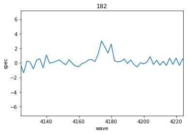
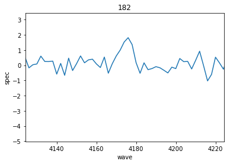
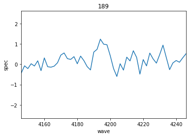
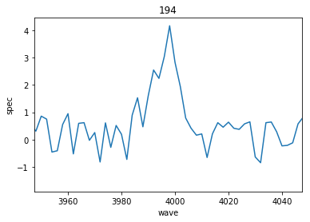
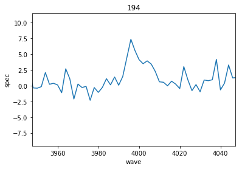
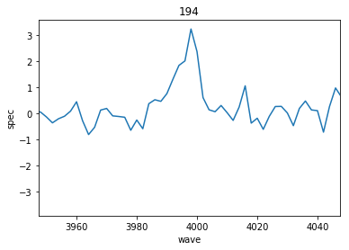
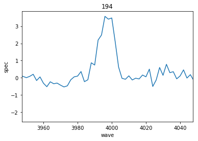
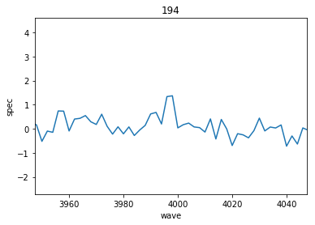
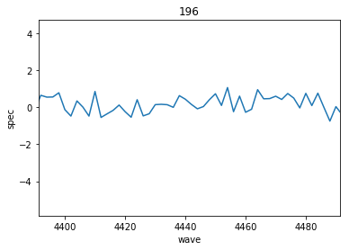

Extracting Spectra
==================

This notebook demonstrates how to grab 1D aperture summed HETDEX spectra
for an input of ID, RA and DEC using the ``Extract`` Class API from
``HETDEX_API``. This can be done most directly using the command line
tool ``get_spec.py``. It can be used both interactively on a compute
node via ``idev`` or through a jupyter notebook as shown here, as well
as within a slurm job file. If you find you need to run as a slurm job,
please ask Erin to set you up on wrangler. We will not be using
stampede2 for slurm jobs.

Examples of what you might like to do with the spectra afterwards is
shown later. For example the spectra produced from get\_spec.py can be
translated to line intensities, or approximate pass-band magnitudes with
a few extra steps.

Import all necessary python packages.
^^^^^^^^^^^^^^^^^^^^^^^^^^^^^^^^^^^^^

These are mainly for working within the notebook. The command line tool
already has the necessary preamble built in.

.. code:: ipython3

    %matplotlib inline
    import matplotlib.pyplot as plt
    import numpy as np
    
    import astropy.units as u
    from astropy.io import fits
    from astropy.coordinates import SkyCoord
    from astropy.table import Table, join
    
    from hetdex_tools.get_spec import get_spectra
    from hetdex_api.survey import Survey
    from hetdex_api.shot import *
    
    import warnings
    
    if not sys.warnoptions:
        warnings.simplefilter("ignore")

IMPORTANT NOTE OF CAUTION WITH RUNNING ON TACC!!!
=================================================

Because this script involves opening the Fibers class object which
contains all fiber spectra from a 3 dither observation, you will be
pulling in a lot of memory for each shot that is open. **NEVER** run
this script from a login node on TACC. A login node is a node you access
when you ssh in.

You need to request a compute node instead by either

(1) using the idev command :

``idev -p skx-dev``

if it works on a small catalog, you can always run interactively using a
longer queue option

``idev -p skx-normal``

(2) using a jupyter notebook

(3) or by submitting the job into the slurm job scheduler (generally if
    you are working on more than ~200 shots

Getting all spectra at a specified RA/DEC. This will search through all shots in HDR2
-------------------------------------------------------------------------------------

If a shotid is not specified the program will search for any shot within
HDR2 that overlaps within an 11 arcmin radius of the input coordinates.
Because of the non-contiguous VIRUS footprint, there is no guarantee the
aperture defined by the input ra/dec/rad will contain enough fibers to
do a measurement. The aperture radius is 3" by default or can be
specified with the --rad argument.

.. code:: ipython3

    from hetdex_tools.get_spec import get_spectra

Open a catalog of IDs, RAs, DECs:

.. code:: ipython3

    input_cat = Table.read('/work/05350/ecooper/stampede2/hdr2-tests/hps-muse/highz_emitters.fits')

.. code:: ipython3

    input_cat

.. raw:: html

    <i>Table length=189</i>
    <table id="table47673465486752" class="table-striped table-bordered table-condensed">
    <thead><tr><th>ID</th><th>RA</th><th>DEC</th><th>WAVE</th><th>FLUX</th><th>FLUXE_L</th><th>FLUXE_H</th><th>z</th></tr></thead>
    <thead><tr><th></th><th>deg</th><th>deg</th><th>Angstrom</th><th>1e-20 erg / (cm2 s)</th><th>1e-20 erg / (cm2 s)</th><th>1e-20 erg / (cm2 s)</th><th></th></tr></thead>
    <thead><tr><th>int64</th><th>float64</th><th>float64</th><th>float64</th><th>float64</th><th>float64</th><th>float64</th><th>float64</th></tr></thead>
    <tr><td>3</td><td>35.30979166666667</td><td>-4.527130555555556</td><td>4973.93</td><td>19.9</td><td>3.1</td><td>4.7</td><td>3.0915</td></tr>
    <tr><td>4</td><td>35.31191666666666</td><td>-4.532388888888889</td><td>5261.37</td><td>42.6</td><td>12.4</td><td>11.2</td><td>1.7561</td></tr>
    <tr><td>5</td><td>35.31308333333333</td><td>-4.531666666666666</td><td>4270.67</td><td>342.1</td><td>14.3</td><td>16.5</td><td>1.757</td></tr>
    <tr><td>6</td><td>35.31816666666666</td><td>-4.4926</td><td>4591.58</td><td>32.7</td><td>3.6</td><td>3.5</td><td>2.777</td></tr>
    <tr><td>11</td><td>35.32691666666666</td><td>-4.459319444444445</td><td>4590.82</td><td>21.2</td><td>4.6</td><td>4.7</td><td>2.7764</td></tr>
    <tr><td>13</td><td>35.3305</td><td>-4.510855555555556</td><td>5250.96</td><td>11.7</td><td>1.9</td><td>2.6</td><td>3.3194</td></tr>
    <tr><td>17</td><td>35.33283333333333</td><td>-4.462030555555556</td><td>4588.13</td><td>13.2</td><td>3.4</td><td>3.9</td><td>2.7742</td></tr>
    <tr><td>22</td><td>35.34562499999999</td><td>-4.490197222222222</td><td>4586.3</td><td>17.7</td><td>4.3</td><td>5.5</td><td>2.7727</td></tr>
    <tr><td>25</td><td>35.34804166666666</td><td>-4.486058333333333</td><td>4319.48</td><td>64.3</td><td>8.8</td><td>10.1</td><td>2.5532</td></tr>
    <tr><td>...</td><td>...</td><td>...</td><td>...</td><td>...</td><td>...</td><td>...</td><td>...</td></tr>
    <tr><td>258003034</td><td>150.10573767592626</td><td>2.328916889720253</td><td>5116.3193359375</td><td>3.3640130615234374</td><td>0.7164601202602101</td><td>0.7164601202602101</td><td>3.2098000049591064</td></tr>
    <tr><td>259001001</td><td>150.11922861010837</td><td>2.3332236762264325</td><td>4871.23486328125</td><td>2.3845901489257812</td><td>0.7198298127873839</td><td>0.7198298127873839</td><td>3.0081400871276855</td></tr>
    <tr><td>259002002</td><td>150.12271795269461</td><td>2.3311474951578344</td><td>4979.3857421875</td><td>5.091370849609375</td><td>0.941842737938811</td><td>0.941842737938811</td><td>3.097130060195923</td></tr>
    <tr><td>259004007</td><td>150.12108470380272</td><td>2.3298617257957046</td><td>5020.27001953125</td><td>0.9068038177490234</td><td>0.396488253146525</td><td>0.396488253146525</td><td>3.130769968032837</td></tr>
    <tr><td>259008055</td><td>150.11836157380864</td><td>2.3218553092554695</td><td>5185.31494140625</td><td>4.764658813476562</td><td>0.8392513297253437</td><td>0.8392513297253437</td><td>3.2665600776672363</td></tr>
    <tr><td>259009056</td><td>150.115962096584</td><td>2.327410979556468</td><td>5185.60009765625</td><td>2.581982421875</td><td>0.9219445544180432</td><td>0.9219445544180432</td><td>3.2667999267578125</td></tr>
    <tr><td>259010057</td><td>150.12923118575054</td><td>2.318836329996964</td><td>5204.986328125</td><td>1.4121124267578125</td><td>0.5816445927422071</td><td>0.5816445927422071</td><td>3.282749891281128</td></tr>
    <tr><td>259011058</td><td>150.1248390835313</td><td>2.3212713174319255</td><td>5373.63037109375</td><td>1.7152011108398437</td><td>0.5433808916470996</td><td>0.5433808916470996</td><td>3.4215099811553955</td></tr>
    <tr><td>259013060</td><td>150.11824847120954</td><td>2.317702711223091</td><td>5468.52783203125</td><td>1.6527587890625</td><td>0.48986440091110417</td><td>0.48986440091110417</td><td>3.4995899200439453</td></tr>
    <tr><td>259014061</td><td>150.11463383028598</td><td>2.323572347495875</td><td>5469.24755859375</td><td>3.098494567871094</td><td>0.6771348513767546</td><td>0.6771348513767546</td><td>3.500190019607544</td></tr>
    </table>

``get_spectra()`` requires an astropy coordinates object list as an
input.

.. code:: ipython3

    input_coords = SkyCoord(ra=input_cat['RA'], dec=input_cat['DEC'])

.. code:: ipython3

    sources = get_spectra(input_coords, ID=input_cat['ID'])

Reading in the output - astropy FITS files
==========================================

.. code:: ipython3

    sources

.. raw:: html

    <i>Table length=859</i>
    <table id="table47673465929800" class="table-striped table-bordered table-condensed">
    <thead><tr><th>ID</th><th>shotid</th><th>wavelength [1036]</th><th>spec [1036]</th><th>spec_err [1036]</th><th>weights [1036]</th></tr></thead>
    <thead><tr><th></th><th></th><th>Angstrom</th><th>1e-17 erg / (Angstrom cm2 s)</th><th>1e-17 erg / (Angstrom cm2 s)</th><th></th></tr></thead>
    <thead><tr><th>int64</th><th>int64</th><th>float64</th><th>float64</th><th>float64</th><th>float64</th></tr></thead>
    <tr><td>296</td><td>20170131034</td><td>3470.0 .. 5540.0</td><td>nan .. nan</td><td>nan .. nan</td><td>0.8745953699006289 .. 0.8962739810778355</td></tr>
    <tr><td>296</td><td>20170130023</td><td>3470.0 .. 5540.0</td><td>nan .. nan</td><td>nan .. nan</td><td>1.036695141223456 .. 0.8728216998540403</td></tr>
    <tr><td>296</td><td>20170321012</td><td>3470.0 .. 5540.0</td><td>nan .. nan</td><td>nan .. nan</td><td>0.8700402031712225 .. 0.8950483608174764</td></tr>
    <tr><td>296</td><td>20181215031</td><td>3470.0 .. 5540.0</td><td>nan .. nan</td><td>nan .. nan</td><td>0.8918659317213776 .. 1.007810640516669</td></tr>
    <tr><td>296</td><td>20190105022</td><td>3470.0 .. 5540.0</td><td>nan .. nan</td><td>nan .. nan</td><td>0.8940789956448113 .. 0.9174282070263918</td></tr>
    <tr><td>296</td><td>20190104018</td><td>3470.0 .. 5540.0</td><td>nan .. nan</td><td>nan .. nan</td><td>0.8265626997625068 .. 0.8364829366301355</td></tr>
    <tr><td>296</td><td>20190112023</td><td>3470.0 .. 5540.0</td><td>nan .. nan</td><td>nan .. nan</td><td>0.814348220659398 .. 0.844884930998556</td></tr>
    <tr><td>395</td><td>20170129008</td><td>3470.0 .. 5540.0</td><td>nan .. nan</td><td>nan .. nan</td><td>1.0844538375192059 .. 0.8785232630578396</td></tr>
    <tr><td>395</td><td>20170225014</td><td>3470.0 .. 5540.0</td><td>nan .. nan</td><td>nan .. nan</td><td>0.9137861548472858 .. 0.9027359421904939</td></tr>
    <tr><td>...</td><td>...</td><td>...</td><td>...</td><td>...</td><td>...</td></tr>
    <tr><td>306</td><td>20190209021</td><td>3470.0 .. 5540.0</td><td>nan .. nan</td><td>nan .. nan</td><td>0.8736964130447336 .. 0.888745319981842</td></tr>
    <tr><td>306</td><td>20190201014</td><td>3470.0 .. 5540.0</td><td>nan .. nan</td><td>nan .. nan</td><td>0.9566311035100977 .. 0.9883896419942175</td></tr>
    <tr><td>306</td><td>20190204014</td><td>3470.0 .. 5540.0</td><td>nan .. nan</td><td>nan .. nan</td><td>0.8918884535977749 .. 0.9058498789915181</td></tr>
    <tr><td>306</td><td>20190209020</td><td>3470.0 .. 5540.0</td><td>nan .. nan</td><td>nan .. nan</td><td>0.8497958587346716 .. 0.867037967494899</td></tr>
    <tr><td>258</td><td>20190204014</td><td>3470.0 .. 5540.0</td><td>nan .. nan</td><td>nan .. nan</td><td>0.6923273871207525 .. 0.7307862989656437</td></tr>
    <tr><td>258</td><td>20190209020</td><td>3470.0 .. 5540.0</td><td>nan .. nan</td><td>nan .. nan</td><td>0.4364204076167584 .. 0.468325517934493</td></tr>
    <tr><td>214004017</td><td>20190209021</td><td>3470.0 .. 5540.0</td><td>nan .. nan</td><td>nan .. nan</td><td>0.8715117745518907 .. 0.8927460075304459</td></tr>
    <tr><td>214004017</td><td>20190201014</td><td>3470.0 .. 5540.0</td><td>nan .. nan</td><td>nan .. nan</td><td>0.8969401444098902 .. 0.925522301588956</td></tr>
    <tr><td>214004017</td><td>20190204014</td><td>3470.0 .. 5540.0</td><td>nan .. nan</td><td>nan .. nan</td><td>0.9016206496570766 .. 0.9210519174869711</td></tr>
    <tr><td>214004017</td><td>20190209020</td><td>3470.0 .. 5540.0</td><td>nan .. nan</td><td>nan .. nan</td><td>0.8562647867838443 .. 0.8812533299666864</td></tr>
    </table>

Join your input and output table so you can match up any properties you
like

.. code:: ipython3

    output_table = join(input_cat, sources)

.. code:: ipython3

    output_table

.. raw:: html

    <i>Table length=859</i>
    <table id="table47673465453984" class="table-striped table-bordered table-condensed">
    <thead><tr><th>ID</th><th>RA</th><th>DEC</th><th>WAVE</th><th>FLUX</th><th>FLUXE_L</th><th>FLUXE_H</th><th>z</th><th>shotid</th><th>wavelength [1036]</th><th>spec [1036]</th><th>spec_err [1036]</th><th>weights [1036]</th></tr></thead>
    <thead><tr><th></th><th>deg</th><th>deg</th><th>Angstrom</th><th>1e-20 erg / (cm2 s)</th><th>1e-20 erg / (cm2 s)</th><th>1e-20 erg / (cm2 s)</th><th></th><th></th><th>Angstrom</th><th>1e-17 erg / (Angstrom cm2 s)</th><th>1e-17 erg / (Angstrom cm2 s)</th><th></th></tr></thead>
    <thead><tr><th>int64</th><th>float64</th><th>float64</th><th>float64</th><th>float64</th><th>float64</th><th>float64</th><th>float64</th><th>int64</th><th>float64</th><th>float64</th><th>float64</th><th>float64</th></tr></thead>
    <tr><td>182</td><td>150.05175</td><td>2.2376444444444443</td><td>4174.25</td><td>25.6</td><td>5.2</td><td>5.8</td><td>2.4337</td><td>20170222007</td><td>3470.0 .. 5540.0</td><td>nan .. nan</td><td>nan .. nan</td><td>0.8779764074573124 .. 0.8919157194039836</td></tr>
    <tr><td>182</td><td>150.05175</td><td>2.2376444444444443</td><td>4174.25</td><td>25.6</td><td>5.2</td><td>5.8</td><td>2.4337</td><td>20170202003</td><td>3470.0 .. 5540.0</td><td>nan .. nan</td><td>nan .. nan</td><td>0.9882423520354104 .. 0.9140588857024189</td></tr>
    <tr><td>189</td><td>150.05504166666665</td><td>2.31525</td><td>4195.93</td><td>12.9</td><td>6.7</td><td>8.7</td><td>2.4515</td><td>20170331006</td><td>3470.0 .. 5540.0</td><td>nan .. nan</td><td>nan .. nan</td><td>0.8342767868348164 .. 0.6895230963441078</td></tr>
    <tr><td>194</td><td>150.05908333333332</td><td>2.2405861111111114</td><td>3997.41</td><td>61.0</td><td>4.3</td><td>4.9</td><td>2.2882</td><td>20170222007</td><td>3470.0 .. 5540.0</td><td>nan .. nan</td><td>nan .. nan</td><td>0.8799012694259848 .. 0.8974807985409177</td></tr>
    <tr><td>194</td><td>150.05908333333332</td><td>2.2405861111111114</td><td>3997.41</td><td>61.0</td><td>4.3</td><td>4.9</td><td>2.2882</td><td>20170202003</td><td>3470.0 .. 5540.0</td><td>nan .. nan</td><td>nan .. nan</td><td>0.9602315220879565 .. 0.9175058500267246</td></tr>
    <tr><td>194</td><td>150.05908333333332</td><td>2.2405861111111114</td><td>3997.41</td><td>61.0</td><td>4.3</td><td>4.9</td><td>2.2882</td><td>20181117010</td><td>3470.0 .. 5540.0</td><td>nan .. nan</td><td>nan .. nan</td><td>0.8559235841764234 .. 0.794577504985113</td></tr>
    <tr><td>194</td><td>150.05908333333332</td><td>2.2405861111111114</td><td>3997.41</td><td>61.0</td><td>4.3</td><td>4.9</td><td>2.2882</td><td>20181115017</td><td>3470.0 .. 5540.0</td><td>nan .. nan</td><td>nan .. nan</td><td>0.8569610088571226 .. 0.8640680243953127</td></tr>
    <tr><td>194</td><td>150.05908333333332</td><td>2.2405861111111114</td><td>3997.41</td><td>61.0</td><td>4.3</td><td>4.9</td><td>2.2882</td><td>20181118019</td><td>3470.0 .. 5540.0</td><td>nan .. nan</td><td>nan .. nan</td><td>0.8649696188899028 .. 0.8181062728556395</td></tr>
    <tr><td>194</td><td>150.05908333333332</td><td>2.2405861111111114</td><td>3997.41</td><td>61.0</td><td>4.3</td><td>4.9</td><td>2.2882</td><td>20181114020</td><td>3470.0 .. 5540.0</td><td>nan .. nan</td><td>nan .. nan</td><td>0.8211261682267719 .. 0.730172296780675</td></tr>
    <tr><td>...</td><td>...</td><td>...</td><td>...</td><td>...</td><td>...</td><td>...</td><td>...</td><td>...</td><td>...</td><td>...</td><td>...</td><td>...</td></tr>
    <tr><td>259013060</td><td>150.11824847120954</td><td>2.317702711223091</td><td>5468.52783203125</td><td>1.6527587890625</td><td>0.48986440091110417</td><td>0.48986440091110417</td><td>3.4995899200439453</td><td>20181118019</td><td>3470.0 .. 5540.0</td><td>nan .. nan</td><td>nan .. nan</td><td>0.9307507649120658 .. 0.9281907728724444</td></tr>
    <tr><td>259013060</td><td>150.11824847120954</td><td>2.317702711223091</td><td>5468.52783203125</td><td>1.6527587890625</td><td>0.48986440091110417</td><td>0.48986440091110417</td><td>3.4995899200439453</td><td>20181117010</td><td>3470.0 .. 5540.0</td><td>nan .. nan</td><td>nan .. nan</td><td>0.9106082834079701 .. 0.9220499697672992</td></tr>
    <tr><td>259013060</td><td>150.11824847120954</td><td>2.317702711223091</td><td>5468.52783203125</td><td>1.6527587890625</td><td>0.48986440091110417</td><td>0.48986440091110417</td><td>3.4995899200439453</td><td>20170331006</td><td>3470.0 .. 5540.0</td><td>nan .. nan</td><td>nan .. nan</td><td>0.9060295449499145 .. 0.9269857435694085</td></tr>
    <tr><td>259014061</td><td>150.11463383028598</td><td>2.323572347495875</td><td>5469.24755859375</td><td>3.098494567871094</td><td>0.6771348513767546</td><td>0.6771348513767546</td><td>3.500190019607544</td><td>20190209020</td><td>3470.0 .. 5540.0</td><td>nan .. nan</td><td>nan .. nan</td><td>0.7318436179831916 .. 0.5622419233153927</td></tr>
    <tr><td>259014061</td><td>150.11463383028598</td><td>2.323572347495875</td><td>5469.24755859375</td><td>3.098494567871094</td><td>0.6771348513767546</td><td>0.6771348513767546</td><td>3.500190019607544</td><td>20181117010</td><td>3470.0 .. 5540.0</td><td>nan .. nan</td><td>nan .. nan</td><td>0.653139609464094 .. 0.8869889929169428</td></tr>
    <tr><td>259014061</td><td>150.11463383028598</td><td>2.323572347495875</td><td>5469.24755859375</td><td>3.098494567871094</td><td>0.6771348513767546</td><td>0.6771348513767546</td><td>3.500190019607544</td><td>20181118019</td><td>3470.0 .. 5540.0</td><td>nan .. nan</td><td>nan .. nan</td><td>0.6663712716634254 .. 0.9199753054414613</td></tr>
    <tr><td>259014061</td><td>150.11463383028598</td><td>2.323572347495875</td><td>5469.24755859375</td><td>3.098494567871094</td><td>0.6771348513767546</td><td>0.6771348513767546</td><td>3.500190019607544</td><td>20181116015</td><td>3470.0 .. 5540.0</td><td>nan .. nan</td><td>nan .. nan</td><td>0.8829887356451047 .. 0.9406534995459687</td></tr>
    <tr><td>259014061</td><td>150.11463383028598</td><td>2.323572347495875</td><td>5469.24755859375</td><td>3.098494567871094</td><td>0.6771348513767546</td><td>0.6771348513767546</td><td>3.500190019607544</td><td>20181115017</td><td>3470.0 .. 5540.0</td><td>nan .. nan</td><td>nan .. nan</td><td>0.725419458839305 .. 0.9484062532919376</td></tr>
    <tr><td>259014061</td><td>150.11463383028598</td><td>2.323572347495875</td><td>5469.24755859375</td><td>3.098494567871094</td><td>0.6771348513767546</td><td>0.6771348513767546</td><td>3.500190019607544</td><td>20181114020</td><td>3470.0 .. 5540.0</td><td>nan .. nan</td><td>nan .. nan</td><td>0.6578912231097742 .. 0.8448288222708636</td></tr>
    <tr><td>259014061</td><td>150.11463383028598</td><td>2.323572347495875</td><td>5469.24755859375</td><td>3.098494567871094</td><td>0.6771348513767546</td><td>0.6771348513767546</td><td>3.500190019607544</td><td>20190204014</td><td>3470.0 .. 5540.0</td><td>nan .. nan</td><td>nan .. nan</td><td>0.8417866788242421 .. 0.7424472468916552</td></tr>
    </table>

.. code:: ipython3

    sel = output_table['FLUX'] > 10
    
    for row in output_table[sel][0:10]:
        plt.figure()
        wave_obj = row['WAVE']
        wave = row['wavelength']
        spec = row['spec']
        plt.plot(wave, spec)
        plt.xlim(wave_obj-50, wave_obj+50)
        plt.xlabel('wave')
        plt.ylabel('spec')
        plt.title(row['ID'])

.. image:: output_20_8.png

Examples of running get\_spec as a command line job:
====================================================

You can run these commands from the command line by removing the "!"
command but be sure you are on a compute node by calling ``idev`` first.

.. code:: ipython3

    !hetdex_get_spec --ra 150.02548 --dec 2.087987 --ID cosmos_LAE --outfile cosmos_LAE

Speed things up using multiprocessing
-------------------------------------

You can speed up processes (by up to ~30x) with python multiprocessing
if you are working interactively in a notebook or in an idev session
(**NEVER FROM A LOGIN NODE**). Use the multiprocessing option with the
argument -mp True or --multiprocess True

.. code:: ipython3

    !hetdex_get_spec --multiprocess -ra 150.02548 -dec 2.087987 -id mptest -o mptest

Save output as individual astropy tables for each ID/shot combination:
----------------------------------------------------------------------

If you prefer to save each spectra to a table, you can do this. We don't
recommend this for large numbers of data, but understand that sometimes
its easy to start with a readable table. The tables will be stored in
the files named ``spec_[ID]_[shotid].tab``

.. code:: ipython3

    !hetdex_get_spec  --multiprocess --single -ra 150.02548 -dec 2.087987 -id cosmos_lae

Getting all spectra at a specified RA/DEC in a specific OBSERVATION/SHOT
------------------------------------------------------------------------

Perhaps you only want to focus on a specific shot. Then you can use the
-s argument to put the shotid either as an interger value 'YYYYMMDDOBS'=
20190104008 or as a str '20190104v009'. Note if you don't give an --ID
option the default is 'DEX'

This is a command line routine so remove the "!" if you are running in a
terminal.

.. code:: ipython3

    !hetdex_get_spec  -ra 8.86535 -dec 0.59352  -s 20190104008 -o 20190104008

This is particularly helpful if you plan to submit each shot as a
separate task. For this reason, I suggest changing the default --outfile
option to -o 20190104008 to create the output pickle file 20190104008

Work on a list of ID/RA/DECs
----------------------------

This can either be a saved astropy table, or an space delimited text
file with 3 columns where the columns are ID, RA, DEC. If you want more
functionality with your input catalog, just talk to Erin. Note that
running this job will take about 30 minutes so only execute if you want
to wait around to explore the output.

.. code:: ipython3

    !cp /work/05350/ecooper/stampede2/3dhst/3dhst_input.cat .

.. code:: ipython3

    !hetdex_get_spec  --multiprocess -i '3dhst_input.cat' -o '3dhst'
