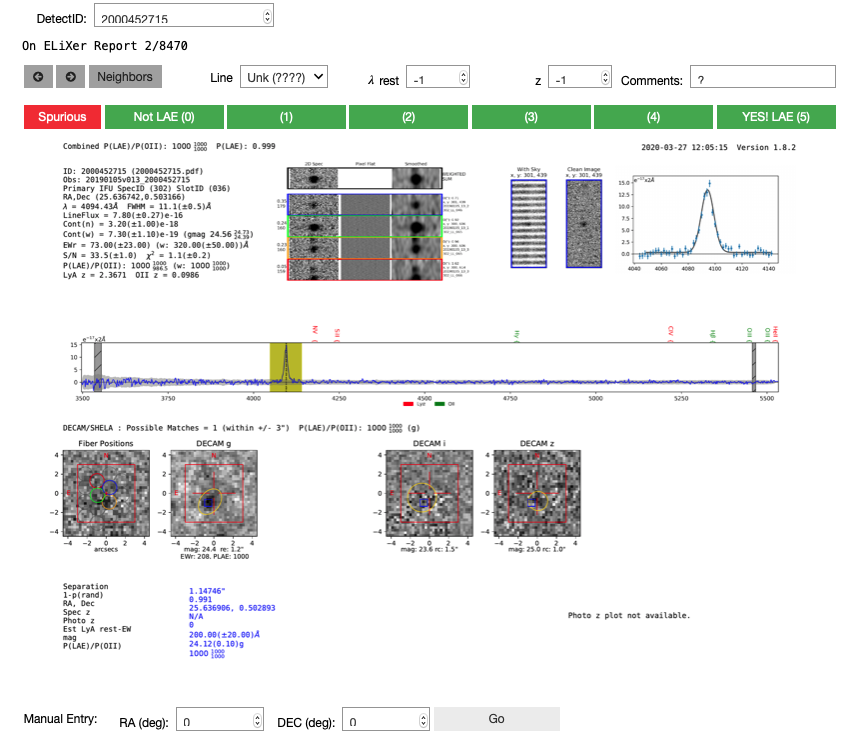

Elixer Widget
-------------

In order to streamline classifications we have developed a GUI using the
ipywidgets package to quickly scan through ELixer report summaries and
store source classifications. If you do not have previous experience
classifying with these reports, we highly recommend you read the
Elixer\_readme.pdf located in

::

    https://github.com/HETDEX/elixer/blob/hdr2/docs/Elixer_readme.pdf

ELiXer reports allow us to visually classify HETDEX line emitting
galaxies by combining HETDEX fiber spectra and 2D CCD images of line
detections with ancillary photometric images and catalogs. You only need
to know the detectid of a source to look up the ELiXer report.

You can either use the widget to explore a subset of sources from the
detections database The GUI will take either a detectlist in the form of
a numpy array, a saved detectlist (saved previously using np.savetxt),
or a saved classification table file. You can only classify objects
within this input list. You may also specify the name of the output file
for the classification table.

Launch the widget
~~~~~~~~~~~~~~~~~

The widget is launched by calling the class ``ElixerWidget()`` from
``hetdex_api.elixer_widget_cls``. When you launch the widget you are
generating a dictionary to store your visual classifications as well as
initializing the widget. It either loads in a pre-defined detection list
or if no argument is given it loads a list of all HDR2 detections.

First run this to prevent scrolling in individual cells in the jupyter
notebook

.. code:: javascript

    %%javascript
    IPython.OutputArea.prototype._should_scroll = function(lines) {
        return false;
    }

.. parsed-literal::

    <IPython.core.display.Javascript object>

.. code:: ipython3

    import numpy as np

.. code:: ipython3

    from hetdex_api.elixer_widget_cls import ElixerWidget
    from hetdex_api.detections import Detections

Get Elixers for a detections database query
~~~~~~~~~~~~~~~~~~~~~~~~~~~~~~~~~~~~~~~~~~~

``Detections()`` initiates the detections class and stores each array
from the HDF5 detections table as array attributes that can easily be
indexed through numpy. It also populates attribute arrays with ELiXeR
OII to LAE probabilities (note these are preliminary) as well as
measuring an approximate gband magnitude from the 1D HETDEX spectra. If
you call it with the ``refine()`` method option you will automatically
have all bad detections removed from the database (for example, newly
discovered bad amps, bad detectids due software issues or HDR2 shots
that we have now decided should not be used for scientific analysis for
various reasons.) You may also optionally add a refine(gmagcut=XX)
option to remove all sources brighter than that value.

.. code:: ipython3

    detects = Detections('hdr2').refine(gmagcut=23)

For example here is a selection that would help us find a sample of nice
bright LAEs, and of course some interloping OII emitters:

.. code:: ipython3

    sel = (detects.sn > 10) * (detects.chi2 < 1.6) * (detects.date >= 20190101) 
    np.sum(sel)

Then insert the selected detectid list to the ``detectlist`` option in
the ElixerWidget call. You can click up and down your list using the
arrows. The neighbors button is a great new feature that will allow you
to look into all nearby sources to the detection. If there is a catalog
match, you can grab the spectrum quickly to help you decide which
catalog match best matces the detection.

.. code:: ipython3

    elix_widget = ElixerWidget(detectlist=detects.detectid[sel]) 

Open up a file with a list of detectids
~~~~~~~~~~~~~~~~~~~~~~~~~~~~~~~~~~~~~~~

To open the GUI to explore the previous detectid list:

.. code:: ipython3

    np.savetxt('detectLAEs.txt', detects.detectid[sel], fmt='%i')

.. code:: ipython3

    elix_widget = ElixerWidget(detectfile='detectLAEs.txt')

.. parsed-literal::

    interactive(children=(BoundedIntText(value=2000452673, description='DetectID:', max=9900000000, min=1000000000…

Or if you have done some classifications previously and want to continue
with the list (by default this list is saved as
``elixer_classifications.dat``). If you use the resume=True flag, the
detectID will start after the highest detectID classified previously.

.. code:: ipython3

    # elix_widget = ElixerWidget(savedfile='elixer_classifications.dat', resume=True)

Where the classifications are stored
~~~~~~~~~~~~~~~~~~~~~~~~~~~~~~~~~~~~

``elix_widget`` is a class object that contains arrays of the input
detectid, vis\_class and comment values output from the above GUI. It
can be saved and shared with the group using the ``Save Progress``
button above. It saves

.. code:: ipython3

    elix_widget.detectid

.. parsed-literal::

    array([2000452673, 2000452715, 2000452896, ..., 2001095017, 2001095018,
           2001095021], dtype=int32)

.. code:: ipython3

    elix_widget.vis_class

.. parsed-literal::

    array([0, 0, 0, ..., 0, 0, 0])

The output is ingested into an astropy Table object under the attribute
``output`` and then saved to a txt file. The file name will be the
savedfile name if provided to the widget upon intialization. Or you can
provide the file name as outfile='filename.dat' as an argument upon
initialization. By default, it will save the table to
``elixer_cls.dat``. In order for this to exist, you have to make at
least one classification in the above widget.

.. code:: ipython3

    elix_widget.output

.. raw:: html

    <i>Table length=8470</i>
    <table id="table47304369926664" class="table-striped table-bordered table-condensed">
    <thead><tr><th>detectid</th><th>vis_class</th><th>flag</th><th>z</th><th>counterpart</th><th>comments</th></tr></thead>
    <thead><tr><th>int64</th><th>int64</th><th>int64</th><th>float64</th><th>int64</th><th>bytes80</th></tr></thead>
    <tr><td>2000452673</td><td>5</td><td>1</td><td>-1.0</td><td>-1</td><td>?</td></tr>
    <tr><td>2000452715</td><td>0</td><td>0</td><td>-1.0</td><td>-1</td><td>?</td></tr>
    <tr><td>2000452896</td><td>0</td><td>0</td><td>-1.0</td><td>-1</td><td>?</td></tr>
    <tr><td>2000452913</td><td>0</td><td>0</td><td>-1.0</td><td>-1</td><td>?</td></tr>
    <tr><td>2000452943</td><td>0</td><td>0</td><td>-1.0</td><td>-1</td><td>?</td></tr>
    <tr><td>2000452951</td><td>0</td><td>0</td><td>-1.0</td><td>-1</td><td>?</td></tr>
    <tr><td>2000453037</td><td>0</td><td>0</td><td>-1.0</td><td>-1</td><td>?</td></tr>
    <tr><td>2000453044</td><td>0</td><td>0</td><td>-1.0</td><td>-1</td><td>?</td></tr>
    <tr><td>2000453087</td><td>0</td><td>0</td><td>-1.0</td><td>-1</td><td>?</td></tr>
    <tr><td>2000453175</td><td>0</td><td>0</td><td>-1.0</td><td>-1</td><td>?</td></tr>
    <tr><td>...</td><td>...</td><td>...</td><td>...</td><td>...</td><td>...</td></tr>
    <tr><td>2001094995</td><td>0</td><td>0</td><td>-1.0</td><td>-1</td><td>?</td></tr>
    <tr><td>2001095000</td><td>0</td><td>0</td><td>-1.0</td><td>-1</td><td>?</td></tr>
    <tr><td>2001095002</td><td>0</td><td>0</td><td>-1.0</td><td>-1</td><td>?</td></tr>
    <tr><td>2001095003</td><td>0</td><td>0</td><td>-1.0</td><td>-1</td><td>?</td></tr>
    <tr><td>2001095004</td><td>0</td><td>0</td><td>-1.0</td><td>-1</td><td>?</td></tr>
    <tr><td>2001095007</td><td>0</td><td>0</td><td>-1.0</td><td>-1</td><td>?</td></tr>
    <tr><td>2001095016</td><td>0</td><td>0</td><td>-1.0</td><td>-1</td><td>?</td></tr>
    <tr><td>2001095017</td><td>0</td><td>0</td><td>-1.0</td><td>-1</td><td>?</td></tr>
    <tr><td>2001095018</td><td>0</td><td>0</td><td>-1.0</td><td>-1</td><td>?</td></tr>
    <tr><td>2001095021</td><td>0</td><td>0</td><td>-1.0</td><td>-1</td><td>?</td></tr>
    </table>

Classifying a pre-defined list
~~~~~~~~~~~~~~~~~~~~~~~~~~~~~~

Most often, we will provide the team with a pre-made list to classify.
Use the ``savedfile`` and ``resume=True`` options so that your
classifiying list resumes where you last left off.

.. code:: ipython3

    from hetdex_api.elixer_widget_cls import ElixerWidget
    from hetdex_api.detections import Detections

.. code:: ipython3

    elix_widget = ElixerWidget(savedfile='elixer_hdr2_testlist.dat', resume=True)

.. parsed-literal::

    interactive(children=(BoundedIntText(value=2000452715, description='DetectID:', max=9900000000, min=1000000000…

