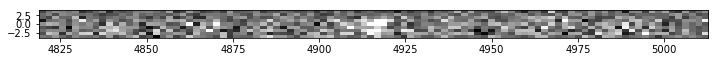
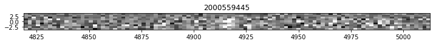
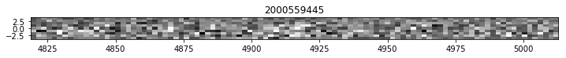
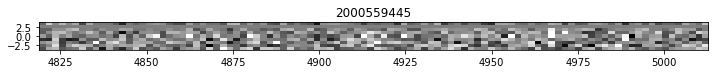
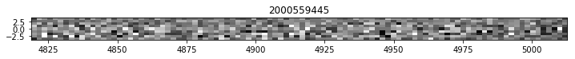
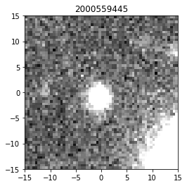
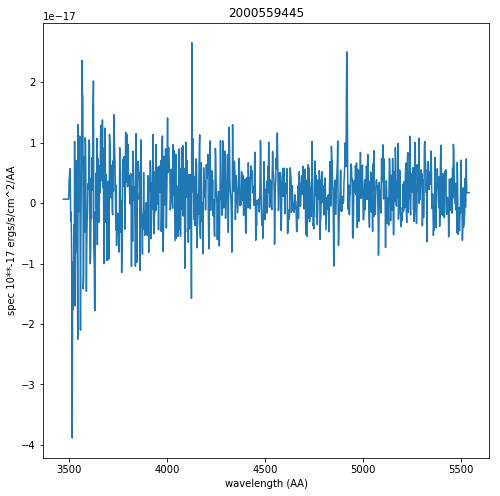

How to Open Machine Learning Inputs
===================================

For each detectid in the line emission database (detect\_hdr2.h5) we
have generated 100 pixel (200 Angstrom) by 9 pixel fiber cutouts of the
weighted sum of all fibers used to measured the extracton as well as
cutouts of the four brightest fibers contributing to the flux. We also
include the 1D spectrum (this is the same product included in the
Spectra table for the detect\_hdr2.h5 file) and a 30 arcsec x 30 arcsec
cutout of HSC r-band imaging for the detection in available.

.. code:: ipython3

    import tables as tb
    import numpy as np
    
    from astropy.table import Table, join
    import astropy.units as u
    
    import matplotlib.pyplot as plt
    from matplotlib.colors import LogNorm
    from astropy.visualization import ZScaleInterval
    
    from hetdex_api.config import HDRconfig

.. code:: ipython3

    config = HDRconfig('hdr2')

Pytables and hetdex\_api.config provide an easy interface to the ML products
----------------------------------------------------------------------------

.. code:: ipython3

    fileh = tb.open_file(config.detectml, 'r') 

Here is the hierarchical structure:

.. code:: ipython3

    fileh

.. parsed-literal::

    File(filename=/data/05350/ecooper/hdr2/detect/detect_ml_hdr2.h5, title='', mode='r', root_uep='/', filters=Filters(complevel=0, shuffle=False, bitshuffle=False, fletcher32=False, least_significant_digit=None))
    / (RootGroup) ''
    /FiberImages (Table(1063824,)) 'Fiber Cutout Images'
      description := {
      "detectid": Int64Col(shape=(), dflt=0, pos=0),
      "im_wave": Float32Col(shape=(100,), dflt=0.0, pos=1),
      "im_sum": Float32Col(shape=(9, 100), dflt=0.0, pos=2),
      "im_array": Float32Col(shape=(4, 9, 100), dflt=0.0, pos=3)}
      byteorder := 'little'
      chunkshape := (56,)
      autoindex := True
      colindexes := {
        "detectid": Index(9, full, shuffle, zlib(1)).is_csi=True}
    /PhotImages (Table(1063704,)) 'Photometric Images'
      description := {
      "detectid": Int64Col(shape=(), dflt=0, pos=0),
      "im_phot": Float32Col(shape=(60, 60), dflt=0.0, pos=1),
      "im_phot_hdr": StringCol(itemsize=2880, shape=(), dflt=b'', pos=2)}
      byteorder := 'little'
      chunkshape := (60,)
      autoindex := True
      colindexes := {
        "detectid": Index(9, full, shuffle, zlib(1)).is_csi=True}
    /Spec1D (Table(1063824,)) 'Aperture Summed Spectrum'
      description := {
      "detectid": Int64Col(shape=(), dflt=0, pos=0),
      "spec1D": Float32Col(shape=(1036,), dflt=0.0, pos=1),
      "spec1D_err": Float32Col(shape=(1036,), dflt=0.0, pos=2)}
      byteorder := 'little'
      chunkshape := (63,)
      autoindex := True
      colindexes := {
        "detectid": Index(9, full, shuffle, zlib(1)).is_csi=True}

Open the 2 Summed Fiber Image
=============================

Because we have over 1 million detections in each table and each table
contains several 2D arrays, the best way to navigate the file is by
detectid. We have indexed all three tables based on the detectid so it
is fast to query. But we do suggest you do it one by one. Please do not
make copies of every component of this file on TACC anywhere on /work.
Ideally you should learn to use the h5 files, otherwise pick smaller
subsets of detections to work with.

.. code:: ipython3

    detectid_obj = 2000559445

.. code:: ipython3

    obj_data = fileh.root.FiberImages.read_where('detectid == detectid_obj')[0]

.. code:: ipython3

    height=9 # in pixels
    detectid = obj_data['detectid']
    wave = obj_data['im_wave']
    im_sum = obj_data['im_sum'] # this is the 2D summed image, 1st dim is height in fiber dims, 2nd dim is wave dim
    im_array = obj_data['im_array'] # this is the 4 brightest fibers, 1st dim is fibers, 2nd dim is fiber dims, 3rd is wavelength
    zscale = ZScaleInterval(contrast=0.5,krej=2.5)
    vmin, vmax = zscale.get_limits(values=im_sum)
    plt.figure(figsize=(12,5))
    plt.imshow(im_sum,vmin=vmin, vmax=vmax,extent=[wave[0], wave[-1], -int(height/2.), int(height/2.)], origin="lower",cmap=plt.get_cmap('gray'),interpolation="none")
    plt.show()

Get Single Fiber cutouts for the four brightest fibers:
=======================================================

The 'im\_array' column consists of fiber cutouts of the 4 brightest
fibers

.. code:: ipython3

    # plot each fiber for 4th object in example table
    height=9
    
    detectid = obj_data['detectid']
    wave = obj_data['im_wave']
    im_sum = obj_data['im_sum'] # this is the 2D summed image, 1st dim is height in fiber dims, 2nd dim is wave dim
    im_array = obj_data['im_array'] # this is the 4 brightest fibers, 1st dim is fibers, 2nd dim is fiber dims, 3rd is wavelength
    for im_i in np.arange(0,4):
        zscale = ZScaleInterval(contrast=0.5,krej=2.5)
        vmin, vmax = zscale.get_limits(values=im_array[im_i])
        plt.figure(figsize=(12,4))
        plt.title(str(detectid))
        plt.imshow(im_array[im_i],vmin=vmin, vmax=vmax,extent=[wave[0], wave[-1], -int(height/2.), int(height/2.)], origin="lower",cmap=plt.get_cmap('gray'),interpolation="none")
        plt.show()

Get the HSC 'r' band image if available
---------------------------------------

.. code:: ipython3

    phot_image_table = Table(fileh.root.PhotImages.read_where('detectid == detectid_obj'))

.. code:: ipython3

    #Loop over the images
    height=9
    for row in phot_image_table:
        detectid = row['detectid']
        im_phot = row['im_phot'] # this is the r-band image
        zscale = ZScaleInterval(contrast=0.5,krej=2.5)
        vmin, vmax = zscale.get_limits(values=im_phot)
        plt.figure()
        plt.title(str(detectid))
        plt.imshow(im_phot,vmin=vmin, vmax=vmax,extent=[-15, 15, -15, 15], origin="lower",cmap=plt.get_cmap('gray'),interpolation="none")
        plt.show()

Get the Detection Spectrum
--------------------------

The 1D aperture Summed Spectrum is also contained in this file

.. code:: ipython3

    spec_table = Table(fileh.root.Spec1D.read_where('detectid == detectid_obj'))

.. code:: ipython3

    wave_rect = 2.0 * np.arange(1036) + 3470.0
    plt.figure(figsize=(8,8))
    plt.plot(wave_rect, spec_table['spec1D'][0]*10**-17 * u.erg / (u.cm ** 2 * u.s * u.AA))
    plt.xlabel('wavelength (AA)')
    plt.ylabel('spec 10**-17 ergs/s/cm^2/AA')
    plt.title(detectid_obj)

.. parsed-literal::

    <matplotlib.text.Text at 0x2b5a1ddcbeb8>

PLEASE CLOSE THE H5 FILE WHEN DONE
----------------------------------

When done with an h5 file you should close it:

.. code:: ipython3

    fileh.close()

