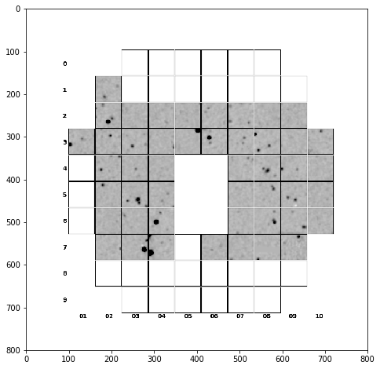
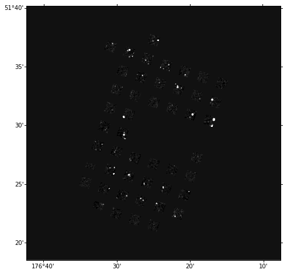
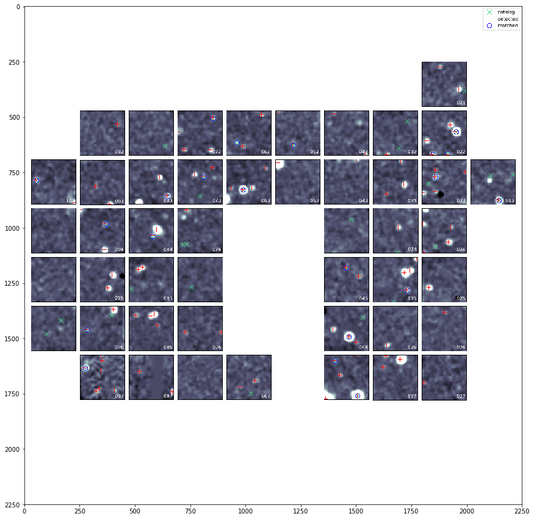

.. container:: cell markdown

   .. rubric:: 07 - Accessing Astrometry Data
      :name: 07---accessing-astrometry-data

.. container:: cell markdown

   The astrometric calibration data for each shot is located within the
   Astrometry Class in each shot HDF5 file. While the astrometric
   location for each fiber in a shot is located in the Fibers Class,
   this group provides calibration details such as stars used to
   calculate the astrometry, their positions and various measurements of
   the differences (offsets) between the positions in the HETDEX data
   and the positions in the star catalog used. It also contains fits and
   png coadd (spectrally summed) images of the focal plane. Please read
   the HDR1 doc at /work/03946/hetdex/hdr1/doc for more details as there
   are many files stored in this group.

.. container:: cell code

   .. code:: python

      %matplotlib inline
      import matplotlib.pyplot as plt
      from matplotlib.colors import LogNorm

      from astropy.wcs import WCS
      import astropy.units as u
      from astropy.coordinates import SkyCoord
      from astropy.io import fits

      from hetdex_api.shot import *

.. container:: cell code

   .. code:: python

      datevobs = '20190208v022'

.. container:: cell code

   .. code:: python

      fileh = open_shot_file(datevobs)

.. container:: cell markdown

   The Astrometry group has several subgroups and tables.

.. container:: cell code

   .. code:: python

      fileh.root.Astrometry

   .. container:: output execute_result

      ::

         /Astrometry (Group) 'Astrometry Info'
           children := ['ShuffleCfg' (Array), 'CoaddImages' (Group), 'NominalVals' (Table), 'PositionOffsets' (Group), 'QA' (Table), 'fplane' (Table), 'LogInfo' (Array), 'CatalogMatches' (Group), 'Dithall' (Group), 'StarCatalog' (Table)]

.. container:: cell markdown

   .. rubric:: Stars used to measure the astrometry
      :name: stars-used-to-measure-the-astrometry

.. container:: cell markdown

   To see the stars used to fit for the astrometry, you can access the
   star catalog:

.. container:: cell code

   .. code:: python

      Table(fileh.root.Astrometry.StarCatalog.read())

   .. container:: output execute_result

      ::

         <Table length=49>
         ignore       star_ID         ra_cat    dec_cat  ...    r       i       z   
         int64         int64         float64    float64  ... float64 float64 float64
         ------ ------------------- ---------- --------- ... ------- ------- -------
              1 1237657628453109819 176.277512 51.505997 ...   15.86   15.71   15.68
              1 1237657628453109841 176.325746 51.514137 ...   17.05    16.9   16.88
              1 1237657628453109928 176.372566 51.370387 ...   19.09   18.56    18.3
              1 1237657628453110337 176.297934 51.503135 ...   21.29   20.25   19.67
              1 1237657628453110400 176.332563 51.520302 ...   21.94   20.86   20.22
              1 1237657628453110431 176.346492 51.547069 ...   20.87   20.44   20.28
              1 1237657628453110434 176.349529  51.55241 ...   19.87   19.46    19.2
              1 1237657628453110474 176.377846 51.525152 ...   21.66   20.17    19.5
              1 1237657628453110476 176.408951 51.379396 ...   20.75   19.37   18.67
              1 1237657628453110490 176.411611  51.38808 ...   22.85   22.45   21.72
            ...                 ...        ...       ... ...     ...     ...     ...
              1 1237657856072089685 176.502332 51.619658 ...   23.03   24.05   23.12
              1 1237657856072089729 176.465627 51.608463 ...   18.25   18.08   17.97
              1 1237657856072089777 176.458994 51.599127 ...   19.52   18.16   17.41
              1 1237657856072089810 176.429004  51.59328 ...   19.73   18.68   18.01
              1 1237657856072089941 176.409881 51.628145 ...   22.29   22.31   22.42
              1 1237657856072089944 176.413203 51.621296 ...   22.74    21.7   21.81
              1 1237657856072089964 176.427282 51.590381 ...   22.42   22.03   22.39
              1 1237657856072089998  176.45677 51.603621 ...   20.78    20.3   19.85
              1 1237657856072090306  176.47468 51.578115 ...   22.04   21.01    20.7
              1 1237657856072090314 176.486051 51.583417 ...   22.67    22.2   21.24

.. container:: cell markdown

   To see a table of the catalog and virus position of each star used
   for the astrometry:

.. container:: cell code

   .. code:: python

      Table(fileh.root.Astrometry.CatalogMatches.exp01.read())

   .. container:: output execute_result

      ::

         <Table length=22>
           RA_det    DEC_det  IFUSLOT_det ...    xifu_cat       yifu_cat    ifuslot_cat
          float64    float64     int64    ...    float64        float64        int64   
         ---------- --------- ----------- ... -------------- -------------- -----------
         176.548659 51.479772          72 ...  16.6875668587   -15.47994151          72
          176.37607 51.577375          24 ... -25.4956891255  22.0152621231          24
         176.349562 51.552353          35 ...  -11.904242484 -14.1308342555          35
         176.297944 51.503104          47 ...   18.674593259  12.4277243958          47
         176.277302 51.506004          47 ... -20.7028846301 -13.0626130842          47
         176.408738 51.379419          96 ... -1.35218702179  16.3159256143          96
         176.503797 51.466447          73 ...  5.81793351004 -4.61527046171          73
         176.429073  51.59319          23 ...   5.6868906528  9.42280937953          23
         176.551571 51.381581         103 ...  1.96426341643  18.9960304447         103
         176.483727 51.488298          63 ... -9.03747495118  6.14177128984          63
         176.377858 51.525252          45 ...  13.8007235675 0.102312296087          45
         176.525964 51.495769          62 ... -10.6216796834  13.1344946555          62
         176.465584 51.608376          22 ...  1.44697458983 -14.0089780117          22
         176.456007 51.603501          22 ... -23.1388790096 -4.44143101701          22
         176.458712 51.598921          22 ... -24.0270907198  12.4607734848          22
         176.507553 51.441934          83 ... -16.3939793321 -18.7210294798          83
         176.325683 51.514253          46 ... -9.26310214351 -3.26420601773          46
         176.372442  51.37038          97 ...  10.6655405688  19.0414079764          97
         176.399951 51.621099          13 ... -20.9789302388 -7.11066472816          13
         176.472629 51.429161          84 ... -6.17900329056 -2.19316623142          84
         176.508167 51.523905          52 ...  -13.682929044  4.86641729455          52
         176.493282 51.404667          94 ...  7.57304307689 -5.18731633066          94

.. container:: cell markdown

   The group PositionOffsets contains the offset for each star between
   the HETDEX data and the star catalog. A table for each dithered
   exposure is provided. The positions, positional offsets and the ifu
   location of the star is provided. For example:

.. container:: cell code

   .. code:: python

      Table(fileh.root.Astrometry.PositionOffsets.exp01.read())

   .. container:: output execute_result

      ::

         <Table length=22>
          xoffset   yoffset    ra_dex    dec_dex    ra_cat    dec_cat  ifuslot
          float64   float64   float64    float64   float64    float64   int64 
         --------- --------- ---------- --------- ---------- --------- -------
          0.586357  0.146983 176.548659 51.479772 176.548496 51.479731      72
           0.60665  0.022571  176.37607 51.577375 176.375901 51.577369      24
          0.119709 -0.204723 176.349562 51.552353 176.349529  51.55241      35
          0.037327  -0.11109 176.297944 51.503104 176.297934 51.503135      47
         -0.754959   0.02542 176.277302 51.506004 176.277512 51.505997      47
         -0.765873  0.081359 176.408738 51.379419 176.408951 51.379396      96
          0.212912  0.214216 176.503797 51.466447 176.503738 51.466387      73
          0.248355 -0.324949 176.429073  51.59319 176.429004  51.59328      23
          0.331011 -0.021539 176.551571 51.381581 176.551479 51.381587     103
         -0.430952  0.053941 176.483727 51.488298 176.483847 51.488283      63
          0.044901  0.359989 176.377858 51.525252 176.377846 51.525152      45
          -0.58932 -0.176957 176.525964 51.495769 176.526128 51.495818      62
         -0.153534 -0.312755 176.465584 51.608376 176.465627 51.608463      22
         -2.748583 -0.433378 176.456007 51.603501  176.45677 51.603621      22
         -1.014821 -0.741958 176.458712 51.598921 176.458994 51.599127      22
          0.243648  0.222547 176.507553 51.441934 176.507485 51.441872      83
         -0.227812  0.417521 176.325683 51.514253 176.325746 51.514137      46
         -0.446786 -0.025275 176.372442  51.37038 176.372566 51.370387      97
          0.277447  0.084832 176.399951 51.621099 176.399874 51.621075      13
          0.945968  0.504008 176.472629 51.429161 176.472366 51.429021      84
          0.151938  0.207412 176.508167 51.523905 176.508125 51.523847      52
          0.488959 -0.954608 176.493282 51.404667 176.493146 51.404932      94

.. container:: cell markdown

   .. rubric:: Coadd Images
      :name: coadd-images

.. container:: cell markdown

   The CoaddImages group contains png and fits images of the spectrally
   compressed data for the focal plane

.. container:: cell code

   .. code:: python

      fileh.root.Astrometry.CoaddImages

   .. container:: output execute_result

      ::

         /Astrometry/CoaddImages (Group) 'Coadd Images'
           children := ['png_exp03' (ImageArray), 'png_exp01' (ImageArray), 'match_exp01' (ImageArray), 'match_exp02' (ImageArray), 'match_exp03' (ImageArray), 'png_exp02' (ImageArray), 'exp01' (ImageArray), 'exp02' (ImageArray), 'exp03' (ImageArray)]

.. container:: cell code

   .. code:: python

      png01 = fileh.root.Astrometry.CoaddImages.png_exp01.read()

.. container:: cell code

   .. code:: python

      plt.figure(figsize=(14,8))
      plt.imshow(png01)

   .. container:: output execute_result

      ::

         <matplotlib.image.AxesImage at 0x2b88def52bd0>

   .. container:: output display_data

      |image0|

.. container:: cell code

   .. code:: python

      plt.imsave(datevobs + '_exp01.png',png01)

.. container:: cell code

   .. code:: python

      fits_exp01 = fits.PrimaryHDU(fileh.root.Astrometry.CoaddImages.exp01.read() )

.. container:: cell code

   .. code:: python

      fits_exp01.header = fileh.root.Astrometry.CoaddImages.exp01.attrs['HEADER']
      fits_exp01.header

   .. container:: output execute_result

      ::

         SIMPLE  =                    T / file does conform to FITS standard             
         BITPIX  =                  -32 / number of bits per data pixel                  
         NAXIS   =                    2 / number of data axes                            
         NAXIS1  =                 1300 / length of data axis 1                          
         NAXIS2  =                 1300 / length of data axis 2                          
         EXTEND  =                    T / FITS dataset may contain extensions            
         CRVAL1  =            176.41605                                                  
         CRVAL2  =            51.489523                                                  
         CTYPE1  = 'RA---TAN'                                                            
         CTYPE2  = 'DEC--TAN'                                                            
         CD1_1   =           -0.0002777                                                  
         CD1_2   =                  0.0                                                  
         CD2_2   =            0.0002777                                                  
         CD2_1   =                    0                                                  
         CRPIX1  =                650.0                                                  
         CRPIX2  =                650.0                                                  
         CUNIT1  = 'deg     '                                                            
         CUNIT2  = 'deg     '                                                            
         EQUINOX =                 2000                                                  
         COMMENT   FITS (Flexible Image Transport System) format is defined in 'Astronomy
         COMMENT   and Astrophysics', volume 376, page 359; bibcode: 2001A&A...376..359H 

.. container:: cell code

   .. code:: python

      wcs = WCS(fits_exp01.header)

.. container:: cell code

   .. code:: python

      plt.figure(figsize=(10,8))
      plt.subplot(projection=wcs)
      plt.imshow(fits_exp01.data, vmin=-1.5, vmax=20, cmap=plt.get_cmap('gray'),interpolation="none")

   .. container:: output execute_result

      ::

         <matplotlib.image.AxesImage at 0x2b88e03a7f50>

   .. container:: output display_data

      |image1|

.. container:: cell code

   .. code:: python

      fits_exp01.writeto(datevobs + '.fits', overwrite=True)

.. container:: cell markdown

   .. rubric:: Match PDF images
      :name: match-pdf-images

.. container:: cell markdown

   The ``match_exp??`` datasets in the CoaddImages group display the
   focal plane of the shot and overplotted are the catalog stars, the
   VIRUS stars and the matched stars listed in the CatalogMatches table.
   These are very useful plots for determing the success of the
   astrometric solution produced by astrometry.py.

.. container:: cell code

   .. code:: python

      immatch = fileh.root.Astrometry.CoaddImages.match_exp01.read()

.. container:: cell code

   .. code:: python

      plt.figure(figsize=(15,15))
      plt.imshow(immatch)

   .. container:: output execute_result

      ::

         <matplotlib.image.AxesImage at 0x2b88e0ffaa10>

   .. container:: output display_data

      |image2|

.. container:: cell code

   .. code:: python

