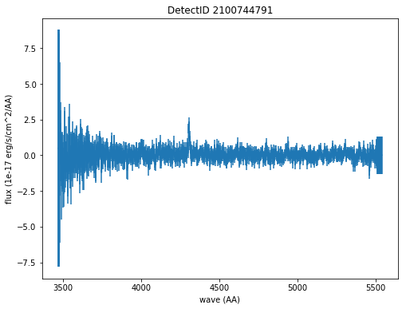
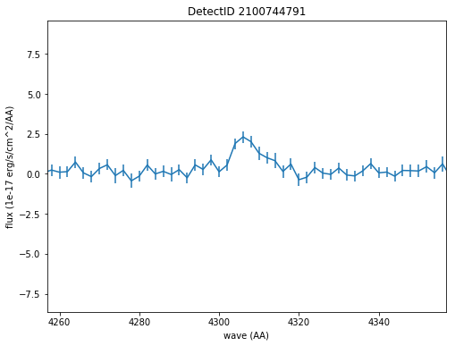

Detections Database and API
===========================

   This notebook demonstrates how to access the HDF5 container for the
   HETDEX line detections database. This database is a catalog of line
   emission detections and their associated 1D, aperture summed,
   psf-weighted spectra. There are three tables contained within this
   HDF5 file:

   #. Detections - this is the main database of line detection sources.
      It provides the position and central wavelength of each detection
      and corresponding line fluxes. A source detection corresponds to
      an emission line so it is possible to have multiple line
      detections at different wavelengths for a single source. There can
      also be multiple observations of the same line if it has been
      observed in multiple shots or if it is associated with a large
      source.

   #. Fibers - for each source detection, this table lists information
      about each fiber used to extract the flux measurment and weighted
      spectrum. This allows a user to return to the processed data
      products (ie. the shot HDF5 files) to investigate the source
      further.

   #. Spectra - for each source, this table contains arrays of
      wavelength and 1D flux-weighted aperture summed spectral data and
      corresponding errors. Non-calibrated spectra is also provided in
      counts

   #. Elixer - a direct row matching of Elixer classification info for
      each row in the Detections table. The hetdex gmag value is also
      found in this table. For full Elixer data including catalog and
      aperture P(LAE)/P(OII) values please see the detects/elixer.h5
      file for a specific release. These are the ones currently
      accessible in the API and the curated catalogs:

      "plae_sdss_g" = P(LAE)/P(OII) from g-mag with HETDEX 1 D spectrum
      limits in plae_sdss_g_max/min

      "combined_plae" = ELiXer weighted combination of the multiple
      PLAE/POII with error in combine_plae_err

      "plae_classification" = ELiXer probability that the line is LyA
      (0.0 - 1.0) [WARNING! Very experimental!!]

.. container:: cell code

   .. code:: python

      %matplotlib inline

      import numpy as np
      import tables as tb
      import matplotlib.pyplot as plt

      from astropy.table import Table, Column, join
      from astropy.coordinates import SkyCoord
      import astropy.units as u

      from hetdex_api.config import HDRconfig
      from hetdex_api.detections import Detections
      from hetdex_api.elixer_widget_cls import ElixerWidget

.. container:: cell code

   .. code:: python

      %%javascript
      IPython.OutputArea.prototype._should_scroll = function(lines) {
          return false;
      }

   .. container:: output display_data

      ::

         <IPython.core.display.Javascript object>

.. container:: cell markdown

   .. rubric:: Use the latest curated catalog:
      :name: use-the-latest-curated-catalog

.. container:: cell code

   .. code:: python

      detects = Detections( curated_version='2.1.1')

.. container:: cell code

   .. code:: python

      # this is a suggested query to find LAEs:
      sel_lae = (detects.sn > 5.5) * (detects.plae_classification > 0.75) * (np.logical_not(detects.gmag<20))

.. container:: cell code

   .. code:: python

      #spectra can be accessed using get_spectrum()

      spec = detects.get_spectrum(2100191119)

.. container:: cell code

   .. code:: python

      spec

   .. container:: output execute_result

      ::

         <Table length=1036>
          wave1d             spec1d                     spec1d_err         
         Angstrom 1e-17 erg / (Angstrom cm2 s) 1e-17 erg / (Angstrom cm2 s)
         float32            float32                      float32           
         -------- ---------------------------- ----------------------------
           3470.0                 -0.016949153                         9.75
           3472.0                 -0.016949153                         9.75
           3474.0                 -0.016949153                         9.75
           3476.0                 -0.016949153                         9.75
           3478.0                 -0.016949153                         9.75
           3480.0                 -0.016949153                         9.75
           3482.0                 -0.016949153                         9.75
           3484.0                        0.875                     9.254767
           3486.0                    0.5010593                     9.188029
              ...                          ...                          ...
           5522.0                  -0.05632306                     1.176408
           5524.0                  -0.05632306                     1.176408
           5526.0                  -0.05632306                     1.176408
           5528.0                  -0.05632306                     1.176408
           5530.0                  -0.05632306                     1.176408
           5532.0                  -0.05632306                     1.176408
           5534.0                  -0.05632306                     1.176408
           5536.0                  -0.05632306                     1.176408
           5538.0                  -0.05632306                     1.176408
           5540.0                  -0.05632306                     1.176408

.. container:: cell markdown

   .. rubric:: Explore Using ElixerWidget:
      :name: explore-using-elixerwidget

.. container:: cell code

   .. code:: python

      elix_widget = ElixerWidget(detectlist = detects.detectid[sel_lae])

   .. container:: output display_data

      .. code:: json

         {"model_id":"819dd0dde46849fc95bc2cf1d1979430","version_major":2,"version_minor":0}

.. container:: cell markdown

   .. rubric:: Initiate the API and Access the full database
      :name: initiate-the-api-and-access-the-full-database

.. container:: cell markdown

   When you call ``Detections()`` you intiate the Detections Class
   object which takes columns from the Detections Table in the HDF5 file
   and adds them as array attributes to the Detections class object. It
   also converts ra/dec into astropy skycoords in the ``coords``
   attribute, calculates an approximate gband magnitude using the 1D
   spectra and adds elixer probabilities for each detection. If you
   append the call with ``refine()`` then a number of downselections are
   applied to the database to return a more robust list of line
   emitters. ``refine()`` removes spurious detections found in bad amps
   or at the edges of the CCD or in shots that are not deemed
   appropriate for HETDEX analysis. It can also remove all bright
   objects above a specific gband magnitude if desired (default to None
   if no option is given).

.. container:: cell code

   .. code:: python

      # To access the latest HDRX.X lines database (ie. the full H5 file):

      detects = Detections()

      # to remove the latest bad amps and pixels (this isn't needed if you are using a curated catalog)

      # detects = Detections(survey='hdr2.1', catalog_type='lines').refine()

      # or if you want to open the continuum source catalog:
      # detects = Detections(survey='hdr2.1', catalog_type='continuum')

.. container:: cell markdown

   .. rubric:: Note if you do not want to load the whole table, but just
      access spectra for a specific detectid:
      :name: note-if-you-do-not-want-to-load-the-whole-table-but-just-access-spectra-for-a-specific-detectid

.. container:: cell code

   .. code:: python

      det_object = Detections('hdr2.1', loadtable=False)

.. container:: cell code

   .. code:: python

      spec = det_object.get_spectrum(2100191119)

.. container:: cell code

   .. code:: python

      spec

   .. container:: output execute_result

      ::

         <Table length=1036>
          wave1d             spec1d                     spec1d_err         
         Angstrom 1e-17 erg / (Angstrom cm2 s) 1e-17 erg / (Angstrom cm2 s)
         float32            float32                      float32           
         -------- ---------------------------- ----------------------------
           3470.0                 -0.016949153                         9.75
           3472.0                 -0.016949153                         9.75
           3474.0                 -0.016949153                         9.75
           3476.0                 -0.016949153                         9.75
           3478.0                 -0.016949153                         9.75
           3480.0                 -0.016949153                         9.75
           3482.0                 -0.016949153                         9.75
           3484.0                        0.875                     9.254767
           3486.0                    0.5010593                     9.188029
              ...                          ...                          ...
           5522.0                  -0.05632306                     1.176408
           5524.0                  -0.05632306                     1.176408
           5526.0                  -0.05632306                     1.176408
           5528.0                  -0.05632306                     1.176408
           5530.0                  -0.05632306                     1.176408
           5532.0                  -0.05632306                     1.176408
           5534.0                  -0.05632306                     1.176408
           5536.0                  -0.05632306                     1.176408
           5538.0                  -0.05632306                     1.176408
           5540.0                  -0.05632306                     1.176408

.. container:: cell markdown

   Here are a list of attributes built into the Detections class:

.. container:: cell code

   .. code:: python

      detects.__dict__.keys()

   .. container:: output execute_result

      ::

         dict_keys(['version', 'survey', 'loadtable', 'filename', 'hdfile', 'detectid', 'shotid', 'ra', 'dec', 'date', 'obsid', 'wave', 'wave_err', 'flux', 'flux_err', 'linewidth', 'linewidth_err', 'continuum', 'continuum_err', 'sn', 'sn_err', 'chi2', 'chi2_err', 'multiframe', 'fibnum', 'x_raw', 'y_raw', 'amp', 'chi2fib', 'detectname', 'expnum', 'fiber_id', 'ifuid', 'ifuslot', 'inputid', 'noise_ratio', 'specid', 'weight', 'x_ifu', 'y_ifu', 'combined_continuum', 'combined_continuum_err', 'combined_plae', 'combined_plae_err', 'mag_sdss_g', 'mag_sdss_g_err', 'plae_classification', 'plae_sdss_g', 'plae_sdss_g_max', 'plae_sdss_g_min', 'gmag', 'gmag_err', 'field', 'fwhm', 'fluxlimit_4540', 'throughput', 'n_ifu', 'vis_class', 'coords'])

.. container:: cell markdown

   If you prefer working in astropy tables, you can grab it this way:

.. container:: cell code

   .. code:: python

      detect_table = detects.return_astropy_table()

.. container:: cell code

   .. code:: python

      detect_table

   .. container:: output execute_result

      ::

         <Table length=1482880>
          detectid         fwhm        ... plae_sdss_g_max plae_sdss_g_min
           int64         float64       ...     float32         float32    
         ---------- ------------------ ... --------------- ---------------
         2100000000 2.3224666118621826 ...          1000.0          1000.0
         2100000001 2.3224666118621826 ...          1000.0          1000.0
         2100000003 2.3224666118621826 ...          1000.0          1000.0
         2100000004 2.3224666118621826 ...          1000.0          1000.0
         2100000009 2.3224666118621826 ...          1000.0          1000.0
         2100000011 2.3224666118621826 ...           0.001           0.001
         2100000014 2.3224666118621826 ...           0.001           0.001
         2100000015 2.3224666118621826 ...           0.001           0.001
         2100000018 2.3224666118621826 ...           0.001           0.001
         2100000019 2.3224666118621826 ...    0.0010718828           0.001
                ...                ... ...             ...             ...
         2102591412 1.2000000476837158 ...     0.028081242     0.020003833
         2102591413 1.2000000476837158 ...       0.9141632       0.6729304
         2102591414 1.2000000476837158 ...          1000.0          1000.0
         2102591415 1.2000000476837158 ...          1000.0          1000.0
         2102591416 1.2000000476837158 ...          1000.0          1000.0
         2102591417 1.2000000476837158 ...          1000.0          1000.0
         2102591418 1.2000000476837158 ...          1000.0          1000.0
         2102591420 1.2000000476837158 ...          1000.0          1000.0
         2102591421 1.2000000476837158 ...          1000.0          1000.0
         2102591422 1.2000000476837158 ...        891.0008        73.63269

.. container:: cell markdown

   .. rubric:: How we made the subset catalog for the team:
      :name: how-we-made-the-subset-catalog-for-the-team

.. container:: cell code

   .. code:: python

      sel_field = (detects.field == 'cosmos') | (detects.field == 'dex-fall') | (detects.field == 'dex-spring') | (detects.field == 'egs') | (detects.field == 'goods-n')
      sel_chi2 = detects.chi2 < 1.2
      sel_wave = ( detects.wave >= 3510 ) * (detects.wave <= 5490)
      sel_lw = (detects.linewidth <= 6)
      sel_cont = detects.continuum > -3
      sel_sn = detects.sn >= 4.8
      sel_chi2fib = (detects.chi2fib < 4.5)

      sel_cat = sel_field * sel_chi2 * sel_wave * sel_lw * sel_cont * sel_sn * sel_chi2fib

      det_table = detects.return_astropy_table()

.. container:: cell code

   .. code:: python

      team_table = detect_table[sel_cat]

.. container:: cell markdown

   .. rubric:: Querying by sky coordinates
      :name: querying-by-sky-coordinates

.. container:: cell markdown

   Upon initialization of the Detections Class, sky coordinates are
   converted to an Astropy sky coordinates array to allow for easy
   querying:

.. container:: cell code

   .. code:: python

      detects.coords

   .. container:: output execute_result

      ::

         <SkyCoord (ICRS): (ra, dec) in deg
             [(149.79932 , 1.986114), (149.80261 , 1.991804),
              (149.80013 , 1.987484), ..., ( 36.488354, 0.404577),
              ( 36.49977 , 0.405466), ( 36.496384, 0.411001)]>

.. container:: cell markdown

   To query a region of the sky, you can use the Detections function
   ``query_by_coords`` which takes an astropy coords objects as an
   argument as well as a radius represented by an astropy quantity. It
   returns a boolean mask to index the Detections class object.

.. container:: cell code

   .. code:: python

      obj_coords = SkyCoord(199.35704 * u.deg, 51.06718 * u.deg, frame='icrs')

.. container:: cell code

   .. code:: python

      maskregion = detects.query_by_coords(obj_coords, 10. * u.arcsec)

.. container:: cell markdown

   The Detections class allows slicing so that a boolean mask applied to
   the class will slice each array attribute accordingly:

.. container:: cell code

   .. code:: python

      detects_in_region = detects[maskregion]
      print(np.size(detects_in_region.detectid))

   .. container:: output stream stdout

      ::

         6

.. container:: cell markdown

   .. rubric:: Find a direct line match
      :name: find-a-direct-line-match

.. container:: cell markdown

   If you want to find an exact line match you can use the function
   ``find_match()``

.. container:: cell code

   .. code:: python

      obj_coords = SkyCoord(199.35704 * u.deg, 51.06718 * u.deg, frame='icrs')

.. container:: cell code

   .. code:: python

      wave_obj = 3836.

.. container:: cell code

   .. code:: python

      idx = detects.find_match(obj_coords, wave=wave_obj, radius=5.*u.arcsec, dwave=5 )

.. container:: cell code

   .. code:: python

      detects.detectid[idx]

   .. container:: output execute_result

      ::

         array([2100191119])

.. container:: cell code

   .. code:: python

      detect_table[idx]

   .. container:: output execute_result

      ::

         <Table length=1>
          detectid         fwhm        ... plae_sdss_g_max plae_sdss_g_min
           int64         float64       ...     float32         float32    
         ---------- ------------------ ... --------------- ---------------
         2100191119 1.4780957698822021 ...          1000.0          1000.0

.. container:: cell markdown

   .. rubric:: Check out matched sources in the ElixerWidget
      :name: check-out-matched-sources-in-the-elixerwidget

.. container:: cell markdown

   For this example, we have found 12 detections in this region, we can
   examine these via the ELiXer reports using the ``ElixerWidget()``
   class from ``hetdex_api.elixer_widget_cls.py``. To do so we need to
   save the detectid list to examine in the widget.

.. container:: cell code

   .. code:: python

      np.savetxt('detects_obj.txt', detects_in_region.detectid)

.. container:: cell markdown

   You can the run the elixer_widget to scan through the ELiXer reports
   for this object. Use the "Next DetectID" button to scan the list. The
   "DetectID" text widget will give access to all reports interactively
   and scans in increasing single digit increments, but the green Next
   DetectID button will go in order of the ingest list from
   'detects_obj.txt'.

.. container:: cell code

   .. code:: python

      elix_widget = ElixerWidget(detectlist = detects_in_region.detectid)
      #elix_widget = ElixerWidget(detectfile='detects_obj.txt')

   .. container:: output display_data

      .. code:: json

         {"model_id":"3cd3da9069ec4d05a8c4cdc3ec8e458d","version_major":2,"version_minor":0}

.. container:: cell markdown

   For more information on using the Elixer Widgets GUI go to Notebook
   12. We will discuss team classification efforts there. But for quick
   investigation its helpful to pull the GUI up to just scan through a
   detection list.

.. container:: cell markdown

   .. rubric:: Accessing 1D Spectra
      :name: accessing-1d-spectra

.. container:: cell markdown

   Spectra in counts and flux-calibrated units are stored in the Spectra
   Table of the Detection HDF5 file, it can be accessed directly through
   the Detections class object which stores the detect HDF5 as an
   attribute:

.. container:: cell code

   .. code:: python

      print(detects.hdfile)

   .. container:: output stream stdout

      ::

         /scratch/03946/hetdex/hdr2.1/detect/detect_hdr2.1.h5 (File) ''
         Last modif.: 'Thu Aug 13 11:38:47 2020'
         Object Tree: 
         / (RootGroup) ''
         /Detections (Table(1482880,)) 'HETDEX Line Detection Catalog'
         /Elixer (Table(1482880,)) 'Elixer Info'
         /Fibers (Table(28328155,)) 'Fiber info for each detection'
         /Spectra (Table(1482880,)) '1D Spectra for each Line Detection'

.. container:: cell code

   .. code:: python

      spectra = detects.hdfile.root.Spectra

.. container:: cell markdown

   This is a very large table so its not advised to read it in all at
   once. The columns are:

.. container:: cell code

   .. code:: python

      spectra.cols

   .. container:: output execute_result

      ::

         /Spectra.cols (Cols), 12 columns
           detectid (Column(1482880,), int64)
           wave1d (Column(1482880, 1036), ('<f4', (1036,)))
           spec1d (Column(1482880, 1036), ('<f4', (1036,)))
           spec1d_err (Column(1482880, 1036), ('<f4', (1036,)))
           counts1d (Column(1482880, 1036), ('<f4', (1036,)))
           counts1d_err (Column(1482880, 1036), ('<f4', (1036,)))
           apsum_counts (Column(1482880, 1036), ('<f4', (1036,)))
           apsum_counts_err (Column(1482880, 1036), ('<f4', (1036,)))
           apcor (Column(1482880, 1036), ('<f4', (1036,)))
           flag_pix (Column(1482880, 1036), ('<f4', (1036,)))
           spec1d_nc (Column(1482880, 1036), ('<f4', (1036,)))
           spec1d_nc_err (Column(1482880, 1036), ('<f4', (1036,)))

.. container:: cell markdown

   Flux calibrated, psf-weighted 1D spectra can be retrieved via the API
   for a single detectid through the function ``get_spectrum``:

.. container:: cell code

   .. code:: python

      detectid_nice_lae = 2100744791
      spec_table = detects.get_spectrum(detectid_nice_lae) 

.. container:: cell code

   .. code:: python

      detects.plot_spectrum(detectid_nice_lae)

   .. container:: output display_data

      |image0|

.. container:: cell markdown

   or if we want to zoom in on the emission line:

.. container:: cell code

   .. code:: python

      cw = detects.wave[detects.detectid == detectid_nice_lae]
      detects.plot_spectrum(detectid_nice_lae, xlim=(cw-50, cw+50))

   .. container:: output display_data

      |image1|

.. container:: cell markdown

   You can also save the spectrum to a text file. It is automatically
   saved as spec_##detectid##.dat, but you can also use the argument
   ``outfile``

.. container:: cell code

   .. code:: python

      detects.save_spectrum(detectid_nice_lae)
      # or
      # detects.save_spectrum(detectid_nice_lae, outfile='tmp.txt')

.. container:: cell markdown

   .. rubric:: Getting Fiber information for a detection
      :name: getting-fiber-information-for-a-detection

.. container:: cell markdown

   You can find a list of all fibers used in the measurement in the
   Fibers table. The Fibers table and its associated columns can be
   accessed similar to the Spectra table by searching for a match in the
   the detectid column.

.. container:: cell code

   .. code:: python

      fibers = detects.hdfile.root.Fibers
      fibers.cols

   .. container:: output execute_result

      ::

         /Fibers.cols (Cols), 23 columns
           detectid (Column(28328155,), int64)
           ra (Column(28328155,), float32)
           dec (Column(28328155,), float32)
           multiframe (Column(28328155,), |S20)
           fiber_id (Column(28328155,), |S38)
           x_ifu (Column(28328155,), float32)
           y_ifu (Column(28328155,), float32)
           date (Column(28328155,), int32)
           obsid (Column(28328155,), int32)
           expnum (Column(28328155,), int32)
           distance (Column(28328155,), float32)
           timestamp (Column(28328155,), |S17)
           wavein (Column(28328155,), float32)
           flag (Column(28328155,), int32)
           weight (Column(28328155,), float32)
           ADC (Column(28328155, 5), ('<f4', (5,)))
           amp (Column(28328155,), |S2)
           fibnum (Column(28328155,), int32)
           ifuid (Column(28328155,), |S3)
           ifuslot (Column(28328155,), |S3)
           specid (Column(28328155,), |S3)
           x_raw (Column(28328155,), int32)
           y_raw (Column(28328155,), int32)

.. container:: cell markdown

   Access the fiber table for the above source:

.. container:: cell code

   .. code:: python

      fiber_table = fibers.read_where("detectid == detectid_nice_lae") 

.. container:: cell code

   .. code:: python

      Table(fiber_table)

   .. container:: output execute_result

      ::

         <Table length=22>
          detectid      ra       dec         multiframe      ... specid x_raw y_raw
           int64     float32   float32        bytes20        ... bytes3 int32 int32
         ---------- --------- --------- -------------------- ... ------ ----- -----
         2100744791 211.52325  51.71597 multi_025_076_032_LU ...    025   415    40
         2100744791 211.52484 51.714375 multi_025_076_032_LL ...    025   418   524
         2100744791 211.52377 51.714127 multi_025_076_032_LL ...    025   418   533
         2100744791 211.52502 51.715073 multi_025_076_032_LL ...    025   416   690
         2100744791 211.52396 51.714825 multi_025_076_032_LL ...    025   416   707
         2100744791 211.52289 51.714573 multi_025_076_032_LL ...    025   416   716
         2100744791 211.52414 51.715523 multi_025_076_032_LL ...    025   415   872
         2100744791 211.52307 51.715275 multi_025_076_032_LL ...    025   415   881
         2100744791 211.52524 51.714676 multi_025_076_032_LL ...    025   418   524
         2100744791 211.52417 51.714428 multi_025_076_032_LL ...    025   418   533
         2100744791 211.52435 51.715126 multi_025_076_032_LL ...    025   416   707
         2100744791 211.52328 51.714874 multi_025_076_032_LL ...    025   416   716
         2100744791 211.52454 51.715824 multi_025_076_032_LL ...    025   415   872
         2100744791 211.52347 51.715576 multi_025_076_032_LL ...    025   415   881
         2100744791  211.5224 51.715324 multi_025_076_032_LL ...    025   415   890
         2100744791 211.52388 51.715908 multi_025_076_032_LU ...    025   415    40
         2100744791 211.52281 51.715656 multi_025_076_032_LU ...    025   415    49
         2100744791 211.52458  51.71476 multi_025_076_032_LL ...    025   416   707
         2100744791 211.52351  51.71451 multi_025_076_032_LL ...    025   416   716
         2100744791 211.52477 51.715458 multi_025_076_032_LL ...    025   415   872
         2100744791  211.5237  51.71521 multi_025_076_032_LL ...    025   415   881
         2100744791 211.52263 51.714962 multi_025_076_032_LL ...    025   415   890

.. container:: cell markdown

   When you are done with the HDF5 file, close it. The data that you
   extracted into tables and arrays will remain.

.. container:: cell code

   .. code:: python

      detects.hdfile.close()

.. container:: cell markdown

   .. rubric:: Accessing the ELiXer Classifications
      :name: accessing-the-elixer-classifications

.. container:: cell code

   .. code:: python

      config = HDRconfig(survey='hdr2.1')
      file_elix = tb.open_file(config.elixerh5)

.. container:: cell code

   .. code:: python

      file_elix.root.Detections

   .. container:: output execute_result

      ::

         /Detections (Table(1567634,)) 'ELiXer Detection Summary Table'
           description := {
           "detectid": Int64Col(shape=(), dflt=0, pos=0),
           "detectname": StringCol(itemsize=64, shape=(), dflt=b'', pos=1),
           "elixer_version": StringCol(itemsize=16, shape=(), dflt=b'', pos=2),
           "elixer_datetime": StringCol(itemsize=21, shape=(), dflt=b'', pos=3),
           "ra": Float32Col(shape=(), dflt=-999.999, pos=4),
           "dec": Float32Col(shape=(), dflt=-999.999, pos=5),
           "wavelength_obs": Float32Col(shape=(), dflt=-999.999, pos=6),
           "wavelength_obs_err": Float32Col(shape=(), dflt=-999.999, pos=7),
           "ccd_adjacent_mag": Float32Col(shape=(), dflt=99.9, pos=8),
           "central_single_fiber_mag": Float32Col(shape=(), dflt=99.9, pos=9),
           "chi2": Float32Col(shape=(), dflt=-999.999, pos=10),
           "chi2_err": Float32Col(shape=(), dflt=-999.999, pos=11),
           "combined_continuum": Float32Col(shape=(), dflt=-999.999, pos=12),
           "combined_continuum_err": Float32Col(shape=(), dflt=-999.999, pos=13),
           "combined_plae": Float32Col(shape=(), dflt=-999.999, pos=14),
           "combined_plae_err": Float32Col(shape=(), dflt=-999.999, pos=15),
           "continuum_full_spec": Float32Col(shape=(), dflt=-999.999, pos=16),
           "continuum_full_spec_err": Float32Col(shape=(), dflt=-999.999, pos=17),
           "continuum_line": Float32Col(shape=(), dflt=-999.999, pos=18),
           "continuum_line_err": Float32Col(shape=(), dflt=-999.999, pos=19),
           "continuum_sdss_g": Float32Col(shape=(), dflt=-999.999, pos=20),
           "continuum_sdss_g_err": Float32Col(shape=(), dflt=-999.999, pos=21),
           "eqw_rest_lya_full_spec": Float32Col(shape=(), dflt=-999.999, pos=22),
           "eqw_rest_lya_full_spec_err": Float32Col(shape=(), dflt=-999.999, pos=23),
           "eqw_rest_lya_line": Float32Col(shape=(), dflt=-999.999, pos=24),
           "eqw_rest_lya_line_err": Float32Col(shape=(), dflt=-999.999, pos=25),
           "eqw_rest_lya_sdss_g": Float32Col(shape=(), dflt=-999.999, pos=26),
           "eqw_rest_lya_sdss_g_err": Float32Col(shape=(), dflt=-999.999, pos=27),
           "ffsky_subtraction": BoolCol(shape=(), dflt=False, pos=28),
           "fieldname": StringCol(itemsize=32, shape=(), dflt=b'', pos=29),
           "flux_line": Float32Col(shape=(), dflt=-999.999, pos=30),
           "flux_line_err": Float32Col(shape=(), dflt=-999.999, pos=31),
           "fwhm_line_aa": Float32Col(shape=(), dflt=-999.999, pos=32),
           "fwhm_line_aa_err": Float32Col(shape=(), dflt=-999.999, pos=33),
           "ifuid": StringCol(itemsize=3, shape=(), dflt=b'', pos=34),
           "ifuslot": StringCol(itemsize=3, shape=(), dflt=b'', pos=35),
           "mag_full_spec": Float32Col(shape=(), dflt=-999.999, pos=36),
           "mag_full_spec_err": Float32Col(shape=(), dflt=-999.999, pos=37),
           "mag_sdss_g": Float32Col(shape=(), dflt=-999.999, pos=38),
           "mag_sdss_g_err": Float32Col(shape=(), dflt=-999.999, pos=39),
           "multiline_flag": BoolCol(shape=(), dflt=False, pos=40),
           "multiline_frac_score": Float32Col(shape=(), dflt=-999.999, pos=41),
           "multiline_name": StringCol(itemsize=16, shape=(), dflt=b'', pos=42),
           "multiline_prob": Float32Col(shape=(), dflt=-999.999, pos=43),
           "multiline_raw_score": Float32Col(shape=(), dflt=-999.999, pos=44),
           "multiline_rest_w": Float32Col(shape=(), dflt=-999.999, pos=45),
           "multiline_z": Float32Col(shape=(), dflt=-999.999, pos=46),
           "obsid": Int32Col(shape=(), dflt=0, pos=47),
           "plae_classification": Float32Col(shape=(), dflt=-999.999, pos=48),
           "plae_full_spec": Float32Col(shape=(), dflt=-999.999, pos=49),
           "plae_full_spec_max": Float32Col(shape=(), dflt=-999.999, pos=50),
           "plae_full_spec_min": Float32Col(shape=(), dflt=-999.999, pos=51),
           "plae_line": Float32Col(shape=(), dflt=-999.999, pos=52),
           "plae_line_max": Float32Col(shape=(), dflt=-999.999, pos=53),
           "plae_line_min": Float32Col(shape=(), dflt=-999.999, pos=54),
           "plae_sdss_g": Float32Col(shape=(), dflt=-999.999, pos=55),
           "plae_sdss_g_max": Float32Col(shape=(), dflt=-999.999, pos=56),
           "plae_sdss_g_min": Float32Col(shape=(), dflt=-999.999, pos=57),
           "pseudo_color_blue_flux": Float32Col(shape=(), dflt=-999.999, pos=58),
           "pseudo_color_blue_flux_err": Float32Col(shape=(), dflt=-999.999, pos=59),
           "pseudo_color_flag": Int64Col(shape=(), dflt=0, pos=60),
           "pseudo_color_red_flux": Float32Col(shape=(), dflt=-999.999, pos=61),
           "pseudo_color_red_flux_err": Float32Col(shape=(), dflt=-999.999, pos=62),
           "pseudo_color_rvb_ratio": Float32Col(shape=(), dflt=-999.999, pos=63),
           "pseudo_color_rvb_ratio_err": Float32Col(shape=(), dflt=-999.999, pos=64),
           "response": Float32Col(shape=(), dflt=-999.999, pos=65),
           "seeing_fwhm": Float32Col(shape=(), dflt=-999.999, pos=66),
           "shotid": Int64Col(shape=(), dflt=0, pos=67),
           "sn": Float32Col(shape=(), dflt=-999.999, pos=68),
           "sn_err": Float32Col(shape=(), dflt=-999.999, pos=69),
           "specid": StringCol(itemsize=3, shape=(), dflt=b'', pos=70),
           "spectral_slope": Float32Col(shape=(), dflt=-999.999, pos=71),
           "spectral_slope_err": Float32Col(shape=(), dflt=0.0, pos=72),
           "spurious_reason": StringCol(itemsize=32, shape=(), dflt=b'', pos=73)}
           byteorder := 'little'
           chunkshape := (574,)
           autoindex := True
           colindexes := {
             "detectid": Index(9, full, shuffle, zlib(1)).is_csi=True}

.. container:: cell markdown

   Note: these are also appended to the Detections() class object. Each
   column in the above table can be accessed as an attribute of the
   Detections() class object. For example, the probability of LAE to OII
   measured from the HETDEX continuum is:

.. container:: cell code

   .. code:: python

      #detects.plae_poii_hetdex

.. container:: cell markdown

   or the nearest neighbour magnitude in an ancillary photometric
   catalog is:

.. container:: cell code

   .. code:: python

      #detects.mag_match

.. container:: cell markdown

   and this comes from the filter:

.. container:: cell code

   .. code:: python

      #detects.cat_filter

.. container:: cell code

   .. code:: python

