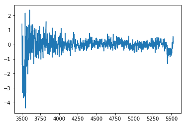

hetdex_get_spec: Extracting a sourcelist through the commandline
================================================================

.. container:: cell markdown

   This notebook demonstrates how to grab 1D aperture summed HETDEX
   spectra for an input of ID, RA and DEC using the ``Extract`` Class
   API from ``HETDEX_API``. This can be done most directly using the
   command line tool ``get_spec.py``. It can be used both interactively
   on a compute node via ``idev`` or through a jupyter notebook as shown
   here, as well as within a slurm job file. If you find you need to run
   as a slurm job, please ask Erin to set you up on wrangler. We will
   not be using stampede2 for slurm jobs.

   Examples of what you might like to do with the spectra afterwards is
   shown later. For example the spectra produced from get_spec.py can be
   translated to line intensities, or approximate pass-band magnitudes
   with a few extra steps.

.. container:: cell markdown

   .. rubric:: Import all necessary python packages.
      :name: import-all-necessary-python-packages

   These are mainly for working within the notebook. The command line
   tool already has the necessary preamble built in.

.. container:: cell code

   .. code:: python

      %%javascript
      IPython.OutputArea.prototype._should_scroll = function(lines) {
          return false;
      }

   .. container:: output display_data

      ::

         <IPython.core.display.Javascript object>

.. container:: cell code

   .. code:: python

      %matplotlib inline
      import sys
      import matplotlib.pyplot as plt
      import numpy as np
      import pickle

      from input_utils import setup_logging
      import astropy.units as u
      from astropy.io import fits
      from astropy.coordinates import SkyCoord
      from astropy.table import Table, join

      import hetdex_api
      from hetdex_api.extract import Extract
      from hetdex_api.survey import Survey
      from hetdex_api.shot import *

      import warnings

      if not sys.warnoptions:
          warnings.simplefilter("ignore")

.. container:: cell markdown

   .. rubric:: IMPORTANT NOTE OF CAUTION WITH RUNNING ON TACC!!!
      :name: important-note-of-caution-with-running-on-tacc

.. container:: cell markdown

   Because this script involves opening the Fibers class object which
   contains all fiber spectra from a 3 dither observation, you will be
   pulling in a lot of memory for each shot that is open. **NEVER** run
   this script from a login node on TACC. A login node is a node you
   access when you ssh in.

   You need to request a compute node instead by either

   (1) using the idev command :

   ``idev -p skx-dev``

   if it works on a small catalog, you can always run interactively
   using a longer queue option

   ``idev -p skx-normal``

   (2) using a jupyter notebook

   (3) or by submitting the job into the slurm job scheduler (generally
   if you are working on more than ~200 shots

.. container:: cell markdown

   .. rubric:: Getting all spectra at a specified RA/DEC. This will
      search through all shots in HDR1
      :name: getting-all-spectra-at-a-specified-radec-this-will-search-through-all-shots-in-hdr1

.. container:: cell markdown

   If a shotid is not specified the program will search for any shot
   within HDR1 that overlaps within an 11 arcmin radius of the input
   coordinates. Because of the non-contiguous VIRUS footprint, there is
   no guarantee the aperture defined by the input ra/dec/rad will
   contain enough fibers to do a measurement. The aperture radius is 3"
   by default or can be specified with the --rad argument. Use the
   --outfile argument to label the output pickle file. Otherwise the
   default 'output.pkl' will be used.

   You can run these commands from the command line by removing the "!"
   command but be sure you are on a compute node by calling ``idev``
   first.

.. container:: cell code

   .. code:: python

      !hetdex_get_spec --ra 150.02548 --dec 2.087987 --ID cosmos_LAE --outfile cosmos_LAE

   .. container:: output stream stdout

      ::

         [INFO - 2020-01-09 13:51:51,094] Extracting for ID: cosmos_LAE
         [INFO - 2020-01-09 13:51:51,112] Searching through all shots
         [INFO - 2020-01-09 13:51:51,112] Finding shots of interest
         [INFO - 2020-01-09 13:51:52,767] Number of shots of interest: 18
         [INFO - 2020-01-09 13:51:52,767] Extracting 18 sources
         [INFO - 2020-01-09 13:51:52,771] Working on shot: 20170105009
         [INFO - 2020-01-09 13:51:52,773] Accessing object one by one
         [INFO - 2020-01-09 13:51:59,855] Working on shot: 20170106001
         [INFO - 2020-01-09 13:51:59,856] Accessing object one by one
         [INFO - 2020-01-09 13:52:05,849] Working on shot: 20170106002
         [INFO - 2020-01-09 13:52:05,850] Accessing object one by one
         [INFO - 2020-01-09 13:52:10,732] Working on shot: 20170106003
         [INFO - 2020-01-09 13:52:10,733] Accessing object one by one
         [INFO - 2020-01-09 13:52:16,206] Working on shot: 20170107012
         [INFO - 2020-01-09 13:52:16,208] Accessing object one by one
         [INFO - 2020-01-09 13:52:21,069] Working on shot: 20170107013
         [INFO - 2020-01-09 13:52:21,070] Accessing object one by one
         [INFO - 2020-01-09 13:52:26,617] Working on shot: 20171220015
         [INFO - 2020-01-09 13:52:26,618] Accessing object one by one
         [INFO - 2020-01-09 13:52:40,413] Working on shot: 20171221016
         [INFO - 2020-01-09 13:52:40,414] Accessing object one by one
         [INFO - 2020-01-09 13:52:52,714] Working on shot: 20171222013
         [INFO - 2020-01-09 13:52:52,715] Accessing object one by one
         [INFO - 2020-01-09 13:53:04,911] Extracting cosmos_LAE
         [INFO - 2020-01-09 13:53:05,030] Working on shot: 20171225015
         [INFO - 2020-01-09 13:53:05,031] Accessing object one by one
         [INFO - 2020-01-09 13:53:18,668] Working on shot: 20180110021
         [INFO - 2020-01-09 13:53:18,668] Accessing object one by one
         [INFO - 2020-01-09 13:53:30,742] Extracting cosmos_LAE
         [INFO - 2020-01-09 13:53:30,862] Working on shot: 20180113013
         [INFO - 2020-01-09 13:53:30,863] Accessing object one by one
         [INFO - 2020-01-09 13:53:41,029] Working on shot: 20180114013
         [INFO - 2020-01-09 13:53:41,030] Accessing object one by one
         [INFO - 2020-01-09 13:53:56,101] Extracting cosmos_LAE
         [INFO - 2020-01-09 13:53:56,216] Working on shot: 20180120008
         [INFO - 2020-01-09 13:53:56,217] Accessing object one by one
         [INFO - 2020-01-09 13:54:09,610] Extracting cosmos_LAE
         [INFO - 2020-01-09 13:54:09,756] Working on shot: 20180123009
         [INFO - 2020-01-09 13:54:09,757] Accessing object one by one
         [INFO - 2020-01-09 13:54:22,319] Extracting cosmos_LAE
         [INFO - 2020-01-09 13:54:22,467] Working on shot: 20180124010
         [INFO - 2020-01-09 13:54:22,468] Accessing object one by one
         [INFO - 2020-01-09 13:54:22,904] Extracting cosmos_LAE
         [INFO - 2020-01-09 13:54:23,050] Working on shot: 20180209009
         [INFO - 2020-01-09 13:54:23,051] Accessing object one by one
         [INFO - 2020-01-09 13:54:45,680] Extracting cosmos_LAE
         [INFO - 2020-01-09 13:54:45,822] Working on shot: 20180210006
         [INFO - 2020-01-09 13:54:45,823] Accessing object one by one
         [INFO - 2020-01-09 13:55:04,014] Extracting cosmos_LAE

.. container:: cell markdown

   .. rubric:: Speed things up using multiprocessing
      :name: speed-things-up-using-multiprocessing

.. container:: cell markdown

   You can speed up processes (by up to ~30x) with python
   multiprocessing if you are working interactively in a notebook or in
   an idev session (**NEVER FROM A LOGIN NODE**). Use the
   multiprocessing option with the argument -mp True or --multiprocess
   True

.. container:: cell code

   .. code:: python

      !hetdex_get_spec --multiprocess -ra 150.02548 -dec 2.087987 -id mptest -o mptest

   .. container:: output stream stdout

      ::

         [INFO - 2020-01-09 13:55:06,201] Extracting for ID: mptest
         [INFO - 2020-01-09 13:55:06,219] Searching through all shots
         [INFO - 2020-01-09 13:55:06,219] Finding shots of interest
         [INFO - 2020-01-09 13:55:08,011] Number of shots of interest: 18
         [INFO - 2020-01-09 13:55:08,011] Extracting 18 sources
         [INFO - 2020-01-09 13:55:08,054] Working on shot: 20170105009
         [INFO - 2020-01-09 13:55:08,056] Working on shot: 20170106002
         [INFO - 2020-01-09 13:55:08,057] Working on shot: 20170106001
         [INFO - 2020-01-09 13:55:08,057] Working on shot: 20170106003
         [INFO - 2020-01-09 13:55:08,058] Accessing object one by one
         [INFO - 2020-01-09 13:55:08,058] Accessing object one by one
         [INFO - 2020-01-09 13:55:08,059] Accessing object one by one
         [INFO - 2020-01-09 13:55:08,059] Accessing object one by one
         [INFO - 2020-01-09 13:55:08,061] Working on shot: 20170107012
         [INFO - 2020-01-09 13:55:08,063] Working on shot: 20170107013
         [INFO - 2020-01-09 13:55:08,063] Accessing object one by one
         [INFO - 2020-01-09 13:55:08,064] Working on shot: 20171220015
         [INFO - 2020-01-09 13:55:08,065] Accessing object one by one
         [INFO - 2020-01-09 13:55:08,066] Accessing object one by one
         [INFO - 2020-01-09 13:55:08,066] Working on shot: 20171221016
         [INFO - 2020-01-09 13:55:08,068] Accessing object one by one
         [INFO - 2020-01-09 13:55:08,070] Working on shot: 20171222013
         [INFO - 2020-01-09 13:55:08,072] Working on shot: 20171225015
         [INFO - 2020-01-09 13:55:08,073] Accessing object one by one
         [INFO - 2020-01-09 13:55:08,074] Accessing object one by one
         [INFO - 2020-01-09 13:55:08,074] Working on shot: 20180110021
         [INFO - 2020-01-09 13:55:08,076] Accessing object one by one
         [INFO - 2020-01-09 13:55:08,077] Working on shot: 20180113013
         [INFO - 2020-01-09 13:55:08,079] Working on shot: 20180114013
         [INFO - 2020-01-09 13:55:08,079] Accessing object one by one
         [INFO - 2020-01-09 13:55:08,080] Working on shot: 20180120008
         [INFO - 2020-01-09 13:55:08,081] Accessing object one by one
         [INFO - 2020-01-09 13:55:08,082] Accessing object one by one
         [INFO - 2020-01-09 13:55:08,084] Working on shot: 20180123009
         [INFO - 2020-01-09 13:55:08,085] Working on shot: 20180124010
         [INFO - 2020-01-09 13:55:08,086] Accessing object one by one
         [INFO - 2020-01-09 13:55:08,087] Accessing object one by one
         [INFO - 2020-01-09 13:55:08,087] Working on shot: 20180209009
         [INFO - 2020-01-09 13:55:08,090] Accessing object one by one
         [INFO - 2020-01-09 13:55:08,093] Working on shot: 20180210006
         [INFO - 2020-01-09 13:55:08,095] Accessing object one by one
         [INFO - 2020-01-09 13:55:08,657] Extracting mptest
         [INFO - 2020-01-09 13:55:08,869] Extracting mptest
         [INFO - 2020-01-09 13:55:08,906] Extracting mptest
         [INFO - 2020-01-09 13:55:08,913] Extracting mptest
         [INFO - 2020-01-09 13:55:08,933] Extracting mptest
         [INFO - 2020-01-09 13:55:08,944] Extracting mptest
         [INFO - 2020-01-09 13:55:08,959] Extracting mptest
         [INFO - 2020-01-09 13:55:08,986] Extracting mptest
         [INFO - 2020-01-09 13:55:09,123] Extraction of sources completed in 0.02 minutes.

.. container:: cell markdown

   .. rubric:: Save output as individual astropy tables for each ID/shot
      combination:
      :name: save-output-as-individual-astropy-tables-for-each-idshot-combination

.. container:: cell markdown

   If you prefer to save each spectra to a table, you can do this. We
   don't recommend this for large numbers of data, but understand that
   sometimes its easy to start with a readable table. The tables will be
   stored in the files named ``spec_[ID]_[shotid].tab``

.. container:: cell code

   .. code:: python

      !hetdex_get_spec  --multiprocess --single -ra 150.02548 -dec 2.087987 -id cosmos_lae

   .. container:: output stream stdout

      ::

         [INFO - 2020-01-09 13:55:11,030] Extracting for ID: cosmos_lae
         [INFO - 2020-01-09 13:55:11,048] Searching through all shots
         [INFO - 2020-01-09 13:55:11,048] Finding shots of interest
         [INFO - 2020-01-09 13:55:12,614] Number of shots of interest: 18
         [INFO - 2020-01-09 13:55:12,614] Extracting 18 sources
         [INFO - 2020-01-09 13:55:12,654] Working on shot: 20170105009
         [INFO - 2020-01-09 13:55:12,655] Working on shot: 20170106002
         [INFO - 2020-01-09 13:55:12,657] Working on shot: 20170106001
         [INFO - 2020-01-09 13:55:12,659] Working on shot: 20170107012
         [INFO - 2020-01-09 13:55:12,660] Accessing object one by one
         [INFO - 2020-01-09 13:55:12,660] Accessing object one by one
         [INFO - 2020-01-09 13:55:12,660] Working on shot: 20170106003
         [INFO - 2020-01-09 13:55:12,661] Accessing object one by one
         [INFO - 2020-01-09 13:55:12,661] Accessing object one by one
         [INFO - 2020-01-09 13:55:12,662] Accessing object one by one
         [INFO - 2020-01-09 13:55:12,664] Working on shot: 20171220015
         [INFO - 2020-01-09 13:55:12,664] Working on shot: 20170107013
         [INFO - 2020-01-09 13:55:12,666] Accessing object one by one
         [INFO - 2020-01-09 13:55:12,666] Accessing object one by one
         [INFO - 2020-01-09 13:55:12,667] Working on shot: 20171221016
         [INFO - 2020-01-09 13:55:12,669] Accessing object one by one
         [INFO - 2020-01-09 13:55:12,670] Working on shot: 20171222013
         [INFO - 2020-01-09 13:55:12,672] Accessing object one by one
         [INFO - 2020-01-09 13:55:12,673] Working on shot: 20180110021
         [INFO - 2020-01-09 13:55:12,675] Accessing object one by one
         [INFO - 2020-01-09 13:55:12,675] Working on shot: 20171225015
         [INFO - 2020-01-09 13:55:12,677] Working on shot: 20180113013
         [INFO - 2020-01-09 13:55:12,677] Working on shot: 20180114013
         [INFO - 2020-01-09 13:55:12,678] Accessing object one by one
         [INFO - 2020-01-09 13:55:12,679] Accessing object one by one
         [INFO - 2020-01-09 13:55:12,679] Accessing object one by one
         [INFO - 2020-01-09 13:55:12,680] Working on shot: 20180120008
         [INFO - 2020-01-09 13:55:12,682] Accessing object one by one
         [INFO - 2020-01-09 13:55:12,685] Working on shot: 20180123009
         [INFO - 2020-01-09 13:55:12,687] Accessing object one by one
         [INFO - 2020-01-09 13:55:12,687] Working on shot: 20180124010
         [INFO - 2020-01-09 13:55:12,689] Accessing object one by one
         [INFO - 2020-01-09 13:55:12,690] Working on shot: 20180209009
         [INFO - 2020-01-09 13:55:12,692] Working on shot: 20180210006
         [INFO - 2020-01-09 13:55:12,693] Accessing object one by one
         [INFO - 2020-01-09 13:55:12,695] Accessing object one by one
         [INFO - 2020-01-09 13:55:13,338] Extracting cosmos_lae
         [INFO - 2020-01-09 13:55:13,338] Extracting cosmos_lae
         [INFO - 2020-01-09 13:55:13,365] Extracting cosmos_lae
         [INFO - 2020-01-09 13:55:13,371] Extracting cosmos_lae
         [INFO - 2020-01-09 13:55:13,374] Extracting cosmos_lae
         [INFO - 2020-01-09 13:55:13,383] Extracting cosmos_lae
         [INFO - 2020-01-09 13:55:13,406] Extracting cosmos_lae
         [INFO - 2020-01-09 13:55:13,421] Extracting cosmos_lae
         [INFO - 2020-01-09 13:55:13,547] Extraction of sources completed in 0.02 minutes.

.. container:: cell markdown

   .. rubric:: Getting all spectra at a specified RA/DEC in a specific
      OBSERVATION/SHOT
      :name: getting-all-spectra-at-a-specified-radec-in-a-specific-observationshot

.. container:: cell markdown

   Perhaps you only want to focus on a specific shot. Then you can use
   the -s argument to put the shotid either as an interger value
   'YYYYMMDDOBS'= 20190104008 or as a str '20190104v009'. Note if you
   don't give an --ID option the default is 'DEX'

   This is a command line routine so remove the "!" if you are running
   in a terminal.

.. container:: cell code

   .. code:: python

      !hetdex_get_spec  -ra 8.86535 -dec 0.59352  -s 20190104008 -o 20190104008

   .. container:: output stream stdout

      ::

         [INFO - 2020-01-09 13:55:15,618] Extracting for ID: 1
         [INFO - 2020-01-09 13:55:15,636] Finding shots of interest
         [INFO - 2020-01-09 13:55:15,637] Number of shots of interest: 1
         [INFO - 2020-01-09 13:55:15,637] Extracting 1 sources
         [INFO - 2020-01-09 13:55:15,638] Working on shot: 20190104008
         [INFO - 2020-01-09 13:55:15,639] Accessing object one by one
         [INFO - 2020-01-09 13:55:46,506] Extracting 1

.. container:: cell markdown

   This is particularly helpful if you plan to submit each shot as a
   separate task. For this reason, I suggest changing the default
   --outfile option to -o 20190104008 to create the output pickle file
   20190104008

.. container:: cell markdown

   .. rubric:: Work on a list of ID/RA/DECs
      :name: work-on-a-list-of-idradecs

.. container:: cell markdown

   This can either be a saved astropy table, or an space delimited text
   file with 3 columns where the columns are ID, RA, DEC. If you want
   more functionality with your input catalog, just talk to Erin. Note
   that running this job will take about 30 minutes so only execute if
   you want to wait around to explore the output.

.. container:: cell code

   .. code:: python

      !cp /work/05350/ecooper/stampede2/3dhst/3dhst_input.cat .

.. container:: cell code

   .. code:: python

      !hetdex_get_spec  --multiprocess -i '3dhst_input.cat' -o '3dhst'

.. container:: cell markdown

   .. rubric:: Example Batch Job production - wrangler
      :name: example-batch-job-production---wrangler

.. container:: cell markdown

   To help those with lists that need to access more than ~200 shots
   here is an example of how you can break down extractions into several
   slurm tasks giving each shot a separate process. First use the
   ``get_shots_of_interest.py`` function (on a login node is fine) to
   retrieve a text list of SHOTIDs stored in the file ``shotlist`` in
   the working directory.

   You can see my example of this run in the directory:

   ::

      /work/05350/ecooper/wrangler/test_extract/3dhst

.. container:: cell markdown

   Feel free to try it yourself on **wrangler**

.. container:: cell code

   .. code:: python

      ! mkdir 3dhst
      ! cd 3dhst
      ! cp /work/05350/ecooper/wrangler/test_extract/3dhst/3dhst_input.cat .

.. container:: cell code

   .. code:: python

      ! hetdex_get_shots -i '3dhst_input.cat'

.. container:: cell markdown

   Then you can use ``awk`` to create a process/task list of all the
   jobs you want to do. It is most efficient to send each shot in as a
   separate process.

.. container:: cell code

   .. code:: python

      ! awk '{print "hetdex_get_spec -i 3dhst_input.cat -s", $1, "-o", $1}' shotlist > run_shot

.. container:: cell markdown

   Then you need to combine all the files together to make for easier
   analysis. Use the --fits option to generate a astropy fits table as
   output. It will default to a pickle file.

.. container:: cell code

   .. code:: python

      ! hetdex_get_spec --fits --merge --outfile '3dhst_master'

.. container:: cell markdown

   .. rubric:: Reading in the output - astropy FITS files
      :name: reading-in-the-output---astropy-fits-files

.. container:: cell markdown

   By default the output data is stored as a FITS file using astropy
   Table fuction. You can read in the output file produced using astropy
   Tables. The show_in_notebook() feature is handy for interactive
   searching of your output.

.. container:: cell code

   .. code:: python

      from astropy.table import Table
      source_table = Table.read('/work/05350/ecooper/stampede2/3dhst/3dhst.fits')

.. container:: cell code

   .. code:: python

      source_table.show_in_notebook()

   .. container:: output execute_result

      ::

         <IPython.core.display.HTML object>

.. container:: cell code

   .. code:: python

      source_table[49]

   .. container:: output execute_result

      ::

         <Row index=49>
           ID     shotid   wavelength [1036]         spec [1036]                spec_err [1036]                     weights [1036]             
                                Angstrom     1e-17 erg / (Angstrom cm2 s) 1e-17 erg / (Angstrom cm2 s)                                         
         int64    int64         float64                float64                      float64                            float64                 
         ----- ----------- ----------------- ---------------------------- ---------------------------- ----------------------------------------
         22372 20170202006  3470.0 .. 5540.0                   nan .. nan                   nan .. nan 0.9414811124967308 .. 0.9481296342243881

.. container:: cell markdown

   The spectrum can be accessed by row index:

.. container:: cell code

   .. code:: python

      wave = source_table['wavelength'][49]
      spec = source_table['spec'][49]
      plt.plot(wave, spec)

   .. container:: output execute_result

      ::

         [<matplotlib.lines.Line2D at 0x2ad7203a3cc0>]

   .. container:: output display_data

      |image0|

