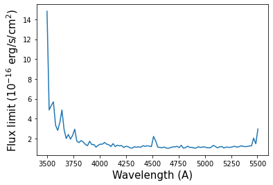
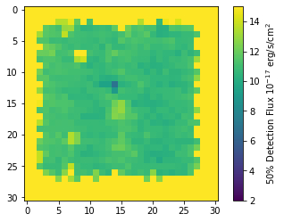
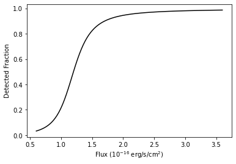
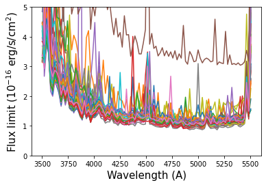

Flux Limits
=======

   After installing the HETDEX API we can import the tools to read the
   HDF5 sensivity cube containers

.. container:: cell code

   .. code:: python

      import matplotlib as mpl
      import matplotlib.pyplot as plt

      from astropy.table import Table

      from hetdex_api.survey import Survey
      from hetdex_api.flux_limits.hdf5_sensitivity_cubes import (SensitivityCubeHDF5Container, 
                                                                 return_sensitivity_hdf_path)
      # has to be here, as SensitivityCube sets a backend
      %matplotlib inline

.. container:: cell markdown

   The sensitivity cube class expects the full path to the HDF file
   containing the flux limits for a given shot. A simple function is
   provided to generate the file path from a given datevobs, so to start
   we need to pick a datevobs. Let's use the survey table, as described
   in the first notebook.

.. container:: cell code

   .. code:: python

      survey = Survey("hdr2.1")
      survey_table = survey.return_astropy_table()
      survey_table[-10:]

   .. container:: output execute_result

      ::

         <Table length=10>
            shotid     field      objid   ...  trajcra  shot_flag     fluxlimit_4540    
            int64     bytes12    bytes18  ...  float32     bool          float64        
         ----------- ---------- --------- ... --------- --------- ----------------------
         20200625017 dex-spring DEXsp4017 ...   210.738      True 3.4022886355000006e-16
         20200625018 dex-spring DEXsp3967 ... 220.26654      True 1.0518607855000001e-16
         20200625019 dex-spring DEXsp7185 ... 231.37999      True        9.963181855e-17
         20200625020 dex-spring DEXsp6525 ... 234.13976      True  9.209148355000002e-17
         20200625021 dex-spring DEXsp6671 ...  240.1725      True  9.047872855000001e-17
         20200626016 dex-spring DEXsp7175 ... 230.67612      True  5.863015855000002e-17
         20200626017 dex-spring DEXsp7111 ... 224.85326      True  7.762371355000001e-17
         20200626018 dex-spring DEXsp6508 ... 233.65271      True  7.803667855000001e-17
         20200626019 dex-spring DEXsp6618 ... 239.17342      True  8.676019855000001e-17
         20200626020 dex-spring DEXsp6718 ... 244.99399      True  7.303015855000002e-17

.. container:: cell markdown

   Let pick datevobs ``20190209v024`` as an example. We'll load the
   latest version, and also some HDR1 data to show how to access old
   releases.

.. container:: cell code

   .. code:: python

      datevobs = "20190209v024"
      hdf_filename_hdr1 = return_sensitivity_hdf_path(datevobs, release="hdr1")
      hdf_filename_hdr2pt1 = return_sensitivity_hdf_path(datevobs, release="hdr2.1")

.. container:: cell markdown

   .. rubric:: New: Choosing your data release model
      :name: new-choosing-your-data-release-model

.. container:: cell markdown

   New for HDR2.1, you can now specify a ``flim_model``. This lets you
   chose which model you want for the flux limits. Available so far are
   ``hdr1`` and ``hdr2pt1``. The default is ``hdr2pt1``, the ``hdr1``
   model should give you the same results as the HDR1 flux limits. You
   can also now specify an aperture correction to apply to the data via
   ``aper_corr``. The default is ``aper_corr=1`` which is appropriate
   for HDR2.1, for HDR1 set ``aper_corr=None`` to read and apply the
   correction from the header of the cubes.

.. container:: cell code

   .. code:: python

      hdfcont_hdr1 = SensitivityCubeHDF5Container(filename=hdf_filename_hdr1, flim_model="hdr1", 
                                                  aper_corr=None)

.. container:: cell markdown

   The call is different for HDR2.1, as aperture corrections are already
   applied, so for HDR2.1 the correct call is

.. container:: cell code

   .. code:: python

      hdfcont_hdr2 = SensitivityCubeHDF5Container(filename=hdf_filename_hdr2pt1)
      # or to be explicit
      hdfcont_hdr2 = SensitivityCubeHDF5Container(filename=hdf_filename_hdr2pt1, aper_corr=1.0, 
                                                  flim_model="hdr2pt1")

.. container:: cell code

   .. code:: python

      print(hdf_filename_hdr2pt1)

   .. container:: output stream stdout

      ::

         /data/05350/ecooper/hdr2.1/reduction/flim/20190209v024_sensitivity_cube.h5

.. container:: cell markdown

   .. rubric:: Finding what IFUs are available
      :name: finding-what-ifus-are-available

.. container:: cell markdown

   A method is supplied that shows the contents of the HDF5 container.
   This just calls the ``print`` function on the underlying ``tables``
   File object. From this you can see what IFUs and shots are stored.

.. container:: cell code

   .. code:: python

      hdfcont_hdr2.list_contents()

   .. container:: output stream stdout

      ::

         /data/05350/ecooper/hdr2.1/reduction/flim/20190209v024_sensitivity_cube.h5 (File) ''
         Last modif.: 'Mon Jul 27 10:22:06 2020'
         Object Tree: 
         / (RootGroup) ''
         /virus_20190209v024 (Group) ''
         /virus_20190209v024/ifuslot_013 (CArray(1036, 31, 31), fletcher32, shuffle, zlib(4)) '50% Detection Limits'
         /virus_20190209v024/ifuslot_021 (CArray(1036, 31, 31), fletcher32, shuffle, zlib(4)) '50% Detection Limits'
         /virus_20190209v024/ifuslot_022 (CArray(1036, 31, 31), fletcher32, shuffle, zlib(4)) '50% Detection Limits'
         /virus_20190209v024/ifuslot_023 (CArray(1036, 31, 31), fletcher32, shuffle, zlib(4)) '50% Detection Limits'
         /virus_20190209v024/ifuslot_024 (CArray(1036, 31, 31), fletcher32, shuffle, zlib(4)) '50% Detection Limits'
         /virus_20190209v024/ifuslot_025 (CArray(1036, 31, 31), fletcher32, shuffle, zlib(4)) '50% Detection Limits'
         /virus_20190209v024/ifuslot_026 (CArray(1036, 31, 31), fletcher32, shuffle, zlib(4)) '50% Detection Limits'
         /virus_20190209v024/ifuslot_027 (CArray(1036, 31, 31), fletcher32, shuffle, zlib(4)) '50% Detection Limits'
         /virus_20190209v024/ifuslot_032 (CArray(1036, 31, 31), fletcher32, shuffle, zlib(4)) '50% Detection Limits'
         /virus_20190209v024/ifuslot_033 (CArray(1036, 31, 31), fletcher32, shuffle, zlib(4)) '50% Detection Limits'
         /virus_20190209v024/ifuslot_034 (CArray(1036, 31, 31), fletcher32, shuffle, zlib(4)) '50% Detection Limits'
         /virus_20190209v024/ifuslot_035 (CArray(1036, 31, 31), fletcher32, shuffle, zlib(4)) '50% Detection Limits'
         /virus_20190209v024/ifuslot_036 (CArray(1036, 31, 31), fletcher32, shuffle, zlib(4)) '50% Detection Limits'
         /virus_20190209v024/ifuslot_037 (CArray(1036, 31, 31), fletcher32, shuffle, zlib(4)) '50% Detection Limits'
         /virus_20190209v024/ifuslot_042 (CArray(1036, 31, 31), fletcher32, shuffle, zlib(4)) '50% Detection Limits'
         /virus_20190209v024/ifuslot_043 (CArray(1036, 31, 31), fletcher32, shuffle, zlib(4)) '50% Detection Limits'
         /virus_20190209v024/ifuslot_044 (CArray(1036, 31, 31), fletcher32, shuffle, zlib(4)) '50% Detection Limits'
         /virus_20190209v024/ifuslot_045 (CArray(1036, 31, 31), fletcher32, shuffle, zlib(4)) '50% Detection Limits'
         /virus_20190209v024/ifuslot_046 (CArray(1036, 31, 31), fletcher32, shuffle, zlib(4)) '50% Detection Limits'
         /virus_20190209v024/ifuslot_047 (CArray(1036, 31, 31), fletcher32, shuffle, zlib(4)) '50% Detection Limits'
         /virus_20190209v024/ifuslot_052 (CArray(1036, 31, 31), fletcher32, shuffle, zlib(4)) '50% Detection Limits'
         /virus_20190209v024/ifuslot_053 (CArray(1036, 31, 31), fletcher32, shuffle, zlib(4)) '50% Detection Limits'
         /virus_20190209v024/ifuslot_062 (CArray(1036, 31, 31), fletcher32, shuffle, zlib(4)) '50% Detection Limits'
         /virus_20190209v024/ifuslot_063 (CArray(1036, 31, 31), fletcher32, shuffle, zlib(4)) '50% Detection Limits'
         /virus_20190209v024/ifuslot_067 (CArray(1036, 31, 31), fletcher32, shuffle, zlib(4)) '50% Detection Limits'
         /virus_20190209v024/ifuslot_072 (CArray(1036, 31, 31), fletcher32, shuffle, zlib(4)) '50% Detection Limits'
         /virus_20190209v024/ifuslot_073 (CArray(1036, 31, 31), fletcher32, shuffle, zlib(4)) '50% Detection Limits'
         /virus_20190209v024/ifuslot_074 (CArray(1036, 31, 31), fletcher32, shuffle, zlib(4)) '50% Detection Limits'
         /virus_20190209v024/ifuslot_075 (CArray(1036, 31, 31), fletcher32, shuffle, zlib(4)) '50% Detection Limits'
         /virus_20190209v024/ifuslot_076 (CArray(1036, 31, 31), fletcher32, shuffle, zlib(4)) '50% Detection Limits'
         /virus_20190209v024/ifuslot_077 (CArray(1036, 31, 31), fletcher32, shuffle, zlib(4)) '50% Detection Limits'
         /virus_20190209v024/ifuslot_082 (CArray(1036, 31, 31), fletcher32, shuffle, zlib(4)) '50% Detection Limits'
         /virus_20190209v024/ifuslot_083 (CArray(1036, 31, 31), fletcher32, shuffle, zlib(4)) '50% Detection Limits'
         /virus_20190209v024/ifuslot_084 (CArray(1036, 31, 31), fletcher32, shuffle, zlib(4)) '50% Detection Limits'
         /virus_20190209v024/ifuslot_085 (CArray(1036, 31, 31), fletcher32, shuffle, zlib(4)) '50% Detection Limits'
         /virus_20190209v024/ifuslot_086 (CArray(1036, 31, 31), fletcher32, shuffle, zlib(4)) '50% Detection Limits'
         /virus_20190209v024/ifuslot_087 (CArray(1036, 31, 31), fletcher32, shuffle, zlib(4)) '50% Detection Limits'
         /virus_20190209v024/ifuslot_092 (CArray(1036, 31, 31), fletcher32, shuffle, zlib(4)) '50% Detection Limits'
         /virus_20190209v024/ifuslot_093 (CArray(1036, 31, 31), fletcher32, shuffle, zlib(4)) '50% Detection Limits'
         /virus_20190209v024/ifuslot_094 (CArray(1036, 31, 31), fletcher32, shuffle, zlib(4)) '50% Detection Limits'
         /virus_20190209v024/ifuslot_095 (CArray(1036, 31, 31), fletcher32, shuffle, zlib(4)) '50% Detection Limits'
         /virus_20190209v024/ifuslot_096 (CArray(1036, 31, 31), fletcher32, shuffle, zlib(4)) '50% Detection Limits'
         /virus_20190209v024/ifuslot_097 (CArray(1036, 31, 31), fletcher32, shuffle, zlib(4)) '50% Detection Limits'
         /virus_20190209v024/ifuslot_103 (CArray(1036, 31, 31), fletcher32, shuffle, zlib(4)) '50% Detection Limits'
         /virus_20190209v024/ifuslot_104 (CArray(1036, 31, 31), fletcher32, shuffle, zlib(4)) '50% Detection Limits'
         /virus_20190209v024/ifuslot_105 (CArray(1036, 31, 31), fletcher32, shuffle, zlib(4)) '50% Detection Limits'
         /virus_20190209v024/ifuslot_106 (CArray(1036, 31, 31), fletcher32, shuffle, zlib(4)) '50% Detection Limits'

.. container:: cell markdown

   .. rubric:: Extracting IFUs
      :name: extracting-ifus

.. container:: cell markdown

   We can extract a particular IFU like this. Note that you have to add
   the string ``ifuslot_`` to the three digit IFU slot. Supplying The
   ``datevobs`` is optional when only one shot flux limit is stored in a
   file (the default). Note that you have to append 'virus_' to the
   datevshot. Here is an example for HDR1. Ignore the ``nsigma``
   warnings, that is just related to how the data is stored and will be
   fixed in the future.

.. container:: cell code

   .. code:: python

      scube = hdfcont_hdr2.extract_ifu_sensitivity_cube("ifuslot_036")
      # Gives the same result as below in this case, as there's only one datevshot in the file
      scube = hdfcont_hdr2.extract_ifu_sensitivity_cube("ifuslot_036", datevshot="virus_" + datevobs)

   .. container:: output stream stdout

      ::

         No nsigma found, assuming nsigma=1.0 
         No nsigma found, assuming nsigma=1.0 

.. container:: cell markdown

   For comparison, here we'll grab the same HDR1 IFU

.. container:: cell code

   .. code:: python

      scube_hdr1 = hdfcont_hdr1.extract_ifu_sensitivity_cube("ifuslot_036")

   .. container:: output stream stdout

      ::

         No nsigma found, assuming nsigma=6.0 

.. container:: cell markdown

   .. rubric:: Using the sensitivity cube
      :name: using-the-sensitivity-cube

   Now we have the ``SensitivityCube`` object we can extract the flux
   where we expect to detect 50% of sources in erg/s/cm\ :math:`^2` from
   it like this. **New for this release** is the requirement to specify
   a S/N ratio cut. You should set this to the S/N cut applied to your
   catalogue, here we use

.. container:: cell code

   .. code:: python

      sncut = 6.0

.. container:: cell code

   .. code:: python

      # Compute the central RA, DEC from the cubes WCS for the purposes of this test
      shape = scube.sigmas.shape
      ra, dec, lambda_ = scube.wcs.all_pix2world(shape[2]/2., shape[1]/2., shape[0]/2., 0)

      # RA DEC (in degrees) Wavelength (Angstrom)
      scube.get_f50(ra, dec, 4240, sncut)

   .. container:: output execute_result

      ::

         1.163686308978734e-16

.. container:: cell markdown

   Locations out of ra, dec or wavelength range return 999, e.g.

.. container:: cell code

   .. code:: python

      scube.get_f50(ra, dec, 424000, sncut)

   .. container:: output execute_result

      ::

         999.0

.. container:: cell markdown

   Of course we can also pass an array of coordinates, to get multiple
   results, e.g. to plot the flux limit versus wavelength

.. container:: cell code

   .. code:: python

      from numpy import linspace
      wls = linspace(3500.0, 5505.0, 100)
      flims = scube.get_f50(ra, dec, wls, sncut)
      plt.plot(wls[flims < 999], flims[flims < 999]*1e16)
      plt.xlabel("Wavelength (A)", fontsize=15.0)
      plt.ylabel("Flux limit ($10^{-16}$ erg/s/cm$^2$)", fontsize=15.0)

   .. container:: output execute_result

      ::

         Text(0, 0.5, 'Flux limit ($10^{-16}$ erg/s/cm$^2$)')

   .. container:: output display_data

      |image0|

.. container:: cell markdown

   If you want to access the the cube of 50% flux limits you can convert
   the ``sigmas`` member of the ``SensitivityCube`` class to flux limits
   via the ``f50_from_noise`` method. For example to plot the flux limit
   versus ra and dec for the slice at 4750AA we can do

.. container:: cell code

   .. code:: python

      # Use WCS to find correct slice
      ix, iy, iz = scube.wcs.all_world2pix(ra, dec, 4750.0, 0)
      slice_ = scube.f50_from_noise(scube.sigmas[int(iz), :, :], sncut)
      plt.imshow(slice_*1e17)
      plt.colorbar(label="50% Detection Flux $10^{-17}$ erg/s/cm$^2$")
      plt.clim(2.0, 15)

   .. container:: output display_data

      |image1|

.. container:: cell markdown

   .. rubric:: Fraction of detected sources versus flux
      :name: fraction-of-detected-sources-versus-flux

   To get the fraction of sources detected at a particular flux, rather
   than just the flux limit value one can use this method

.. container:: cell code

   .. code:: python

      # Flux (cgs) RA DEC (in degrees) Wavelength (Angstrom) 
      scube.return_completeness(4.1e-17, ra, dec, 4245, sncut)

   .. container:: output execute_result

      ::

         0.014376673288408248

.. container:: cell markdown

   This completeness is computed using a functional form, this function
   takes two parameters: the flux limit and a slope which controls how
   quickly completeness falls off. The latter is fixed to our best guess
   in this version of the API (**this means it might not be all that
   accurate!**), in the future this will all be better tested. By
   definition the flux values from ``get_f50`` correspond to 50%
   completeness, i.e.

.. container:: cell code

   .. code:: python

      flux = scube.get_f50(ra, dec, 4245, sncut)
      scube.return_completeness(flux, ra, dec, 4245, sncut)

   .. container:: output execute_result

      ::

         0.5

.. container:: cell markdown

   Here is a plot of the completeness versus flux at some position. Note
   we use the flux limit computed above to define the range of the plot

.. container:: cell code

   .. code:: python

      fluxes = linspace(0.5*flux, 3.0*flux, 100)
      compl = scube.return_completeness(fluxes, ra, dec, 4245, sncut)
      plt.plot(fluxes*1e16, compl, "k-")
      plt.xlabel("Flux ($10^{-16}$ erg/s/cm$^2$)")
      plt.ylabel("Detected Fraction")

   .. container:: output execute_result

      ::

         Text(0, 0.5, 'Detected Fraction')

   .. container:: output display_data

      |image2|

.. container:: cell markdown

   .. rubric:: Looping over all the IFUs in an HDF5 file
      :name: looping-over-all-the-ifus-in-an-hdf5-file

   If you want to loop over all the IFUs then an iterator is provided.
   It returns pairs of IFU slot and sensitivity cube. In this example we
   overplot flux limits for all of the IFUs in the shot

.. container:: cell code

   .. code:: python

      for ifu_name, tscube in hdfcont_hdr2.itercubes():
          
          # Compute the central RA, DEC from the cubes WCS
          shape = tscube.sigmas.shape
          ra, dec, lambda_ = tscube.wcs.all_pix2world(shape[2]/2., shape[1]/2., shape[0]/2., 0)
          
          # Get the flux limits at this RA/DEC and a range of wavelengths
          flims = tscube.get_f50(ra, dec, wls, sncut)
          
          # Plot
          plt.plot(wls[flims < 999], flims[flims < 999]*1e16, label=ifu_name)
          
      plt.xlabel("Wavelength (A)", fontsize=15.0)
      plt.ylabel("Flux limit ($10^{-16}$ erg/s/cm$^2$)", fontsize=15.0)
      plt.ylim(0, 5.0)
      plt.show()    

   .. container:: output stream stdout

      ::

         No nsigma found, assuming nsigma=1.0 (warning will not repeat)

   .. container:: output display_data

      |image3|

.. container:: cell code

   .. code:: python

.. container:: cell code

   .. code:: python

