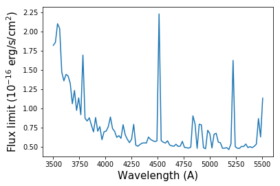
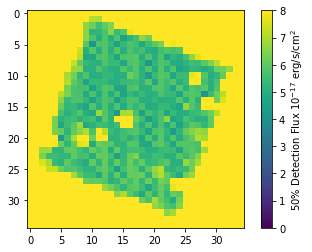
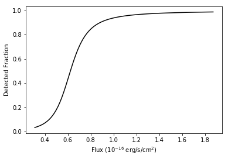

Flux Limits
===========

   After installing the HETDEX API we can import the tools to read the
   HDF5 sensivity cube containers

.. container:: cell code

   .. code:: python

      %matplotlib inline

      import matplotlib.pyplot as plt
      from astropy.table import Table

      from hetdex_api.survey import Survey
      from hetdex_api.flux_limits.hdf5_sensitivity_cubes import (SensitivityCubeHDF5Container, 
                                                                 return_sensitivity_hdf_path)

.. container:: cell markdown

   The sensitivity cube class expects the full path to the HDF file
   containing the flux limits for a given shot. A simple function is
   provided to generate the file path from a given datevobs, so to start
   we need to pick a datevobs. Let's use the survey table, as described
   in the first notebook.

.. container:: cell code

   .. code:: python

      survey = Survey("hdr1")
      survey_table = Table(survey.hdfile.root.Survey[:])
      survey_table[-10:]

   .. container:: output execute_result

      ::

         <Table length=10>
          field    date   obsid ... yditherpos [3]  yoffset [3]        yrms [3]     
         bytes12  int32   int32 ...    float32        float32          float32      
         ------- -------- ----- ... -------------- -------------- ------------------
             cal 20190201     8 ...  0.0 .. 0.8715 1e-05 .. 3e-05 0.48836 .. 0.50151
             cal 20190201     9 ...  0.0 .. 1.2916   -0.0 .. -0.0   0.6864 .. 0.6321
             cal 20190202    22 ...  0.0 .. 1.2873   -0.0 .. -0.0 0.42725 .. 0.42419
             cal 20190203    12 ...  0.0 .. 1.1569    0.0 .. -0.0  0.24279 .. 0.2453
             cal 20190203    13 ...  0.0 .. 1.1211    0.0 .. -0.0 0.17181 .. 0.26734
             cal 20190204    11 ...   0.0 .. 1.245  2e-05 .. -0.0 0.46322 .. 0.34703
             cal 20190205    14 ...  0.0 .. 1.2141  1e-05 .. -0.0 0.33886 .. 0.25879
             cal 20190207    19 ...  0.0 .. 1.1333    -0.0 .. 0.0  0.68693 .. 0.4041
             cal 20190208    33 ...  0.0 .. 1.1775    0.0 .. -0.0  0.1237 .. 0.40124
             cal 20190208    34 ...  0.0 .. 1.1392  -1e-05 .. 0.0 0.41253 .. 0.19523

.. container:: cell markdown

   Let pick datevobs ``20190209v024`` as an example

.. container:: cell code

   .. code:: python

      datevobs = "20190209v024"
      hdf_filename = return_sensitivity_hdf_path(datevobs)
      hdfcont = SensitivityCubeHDF5Container(filename=hdf_filename)

.. container:: cell markdown

   A method is supplied that shows the contents of the HDF5 container.
   This just calls the ``print`` function on the underlying ``tables``
   File object. From this you can see what IFUs and shots are stored.

.. container:: cell code

   .. code:: python

      hdfcont.list_contents()

   .. container:: output stream stdout

      ::

         /work/03946/hetdex/hdr1/reduction/flim/20190209v024_sensitivity_cube.h5 (File) ''
         Last modif.: 'Fri Mar 29 12:50:06 2019'
         Object Tree: 
         / (RootGroup) ''
         /virus_20190209v024 (Group) ''
         /virus_20190209v024/ifuslot_013 (CArray(1036, 35, 35), fletcher32, shuffle, zlib(4)) '50% Detection Limits'
         /virus_20190209v024/ifuslot_021 (CArray(1036, 35, 35), fletcher32, shuffle, zlib(4)) '50% Detection Limits'
         /virus_20190209v024/ifuslot_022 (CArray(1036, 35, 35), fletcher32, shuffle, zlib(4)) '50% Detection Limits'
         /virus_20190209v024/ifuslot_023 (CArray(1036, 35, 35), fletcher32, shuffle, zlib(4)) '50% Detection Limits'
         /virus_20190209v024/ifuslot_024 (CArray(1036, 35, 35), fletcher32, shuffle, zlib(4)) '50% Detection Limits'
         /virus_20190209v024/ifuslot_025 (CArray(1036, 35, 35), fletcher32, shuffle, zlib(4)) '50% Detection Limits'
         /virus_20190209v024/ifuslot_026 (CArray(1036, 35, 35), fletcher32, shuffle, zlib(4)) '50% Detection Limits'
         /virus_20190209v024/ifuslot_027 (CArray(1036, 35, 35), fletcher32, shuffle, zlib(4)) '50% Detection Limits'
         /virus_20190209v024/ifuslot_032 (CArray(1036, 35, 35), fletcher32, shuffle, zlib(4)) '50% Detection Limits'
         /virus_20190209v024/ifuslot_033 (CArray(1036, 35, 35), fletcher32, shuffle, zlib(4)) '50% Detection Limits'
         /virus_20190209v024/ifuslot_034 (CArray(1036, 35, 35), fletcher32, shuffle, zlib(4)) '50% Detection Limits'
         /virus_20190209v024/ifuslot_035 (CArray(1036, 35, 35), fletcher32, shuffle, zlib(4)) '50% Detection Limits'
         /virus_20190209v024/ifuslot_036 (CArray(1036, 35, 35), fletcher32, shuffle, zlib(4)) '50% Detection Limits'
         /virus_20190209v024/ifuslot_037 (CArray(1036, 35, 35), fletcher32, shuffle, zlib(4)) '50% Detection Limits'
         /virus_20190209v024/ifuslot_042 (CArray(1036, 35, 35), fletcher32, shuffle, zlib(4)) '50% Detection Limits'
         /virus_20190209v024/ifuslot_043 (CArray(1036, 35, 35), fletcher32, shuffle, zlib(4)) '50% Detection Limits'
         /virus_20190209v024/ifuslot_044 (CArray(1036, 35, 35), fletcher32, shuffle, zlib(4)) '50% Detection Limits'
         /virus_20190209v024/ifuslot_045 (CArray(1036, 35, 35), fletcher32, shuffle, zlib(4)) '50% Detection Limits'
         /virus_20190209v024/ifuslot_046 (CArray(1036, 35, 35), fletcher32, shuffle, zlib(4)) '50% Detection Limits'
         /virus_20190209v024/ifuslot_047 (CArray(1036, 35, 35), fletcher32, shuffle, zlib(4)) '50% Detection Limits'
         /virus_20190209v024/ifuslot_052 (CArray(1036, 35, 35), fletcher32, shuffle, zlib(4)) '50% Detection Limits'
         /virus_20190209v024/ifuslot_053 (CArray(1036, 35, 35), fletcher32, shuffle, zlib(4)) '50% Detection Limits'
         /virus_20190209v024/ifuslot_062 (CArray(1036, 35, 35), fletcher32, shuffle, zlib(4)) '50% Detection Limits'
         /virus_20190209v024/ifuslot_063 (CArray(1036, 35, 35), fletcher32, shuffle, zlib(4)) '50% Detection Limits'
         /virus_20190209v024/ifuslot_067 (CArray(1036, 35, 35), fletcher32, shuffle, zlib(4)) '50% Detection Limits'
         /virus_20190209v024/ifuslot_072 (CArray(1036, 35, 35), fletcher32, shuffle, zlib(4)) '50% Detection Limits'
         /virus_20190209v024/ifuslot_073 (CArray(1036, 35, 35), fletcher32, shuffle, zlib(4)) '50% Detection Limits'
         /virus_20190209v024/ifuslot_074 (CArray(1036, 35, 35), fletcher32, shuffle, zlib(4)) '50% Detection Limits'
         /virus_20190209v024/ifuslot_075 (CArray(1036, 35, 35), fletcher32, shuffle, zlib(4)) '50% Detection Limits'
         /virus_20190209v024/ifuslot_076 (CArray(1036, 35, 35), fletcher32, shuffle, zlib(4)) '50% Detection Limits'
         /virus_20190209v024/ifuslot_077 (CArray(1036, 35, 35), fletcher32, shuffle, zlib(4)) '50% Detection Limits'
         /virus_20190209v024/ifuslot_082 (CArray(1036, 35, 35), fletcher32, shuffle, zlib(4)) '50% Detection Limits'
         /virus_20190209v024/ifuslot_083 (CArray(1036, 35, 35), fletcher32, shuffle, zlib(4)) '50% Detection Limits'
         /virus_20190209v024/ifuslot_084 (CArray(1036, 35, 35), fletcher32, shuffle, zlib(4)) '50% Detection Limits'
         /virus_20190209v024/ifuslot_085 (CArray(1036, 35, 35), fletcher32, shuffle, zlib(4)) '50% Detection Limits'
         /virus_20190209v024/ifuslot_086 (CArray(1036, 35, 35), fletcher32, shuffle, zlib(4)) '50% Detection Limits'
         /virus_20190209v024/ifuslot_087 (CArray(1036, 35, 35), fletcher32, shuffle, zlib(4)) '50% Detection Limits'
         /virus_20190209v024/ifuslot_092 (CArray(1036, 35, 35), fletcher32, shuffle, zlib(4)) '50% Detection Limits'
         /virus_20190209v024/ifuslot_093 (CArray(1036, 35, 35), fletcher32, shuffle, zlib(4)) '50% Detection Limits'
         /virus_20190209v024/ifuslot_094 (CArray(1036, 35, 35), fletcher32, shuffle, zlib(4)) '50% Detection Limits'
         /virus_20190209v024/ifuslot_095 (CArray(1036, 35, 35), fletcher32, shuffle, zlib(4)) '50% Detection Limits'
         /virus_20190209v024/ifuslot_096 (CArray(1036, 35, 35), fletcher32, shuffle, zlib(4)) '50% Detection Limits'
         /virus_20190209v024/ifuslot_097 (CArray(1036, 35, 35), fletcher32, shuffle, zlib(4)) '50% Detection Limits'
         /virus_20190209v024/ifuslot_103 (CArray(1036, 35, 35), fletcher32, shuffle, zlib(4)) '50% Detection Limits'
         /virus_20190209v024/ifuslot_104 (CArray(1036, 35, 35), fletcher32, shuffle, zlib(4)) '50% Detection Limits'
         /virus_20190209v024/ifuslot_105 (CArray(1036, 35, 35), fletcher32, shuffle, zlib(4)) '50% Detection Limits'
         /virus_20190209v024/ifuslot_106 (CArray(1036, 35, 35), fletcher32, shuffle, zlib(4)) '50% Detection Limits'

.. container:: cell markdown

   We can extract a particular IFU like this. Note that you have to add
   the string 'ifuslot_' to the three digit IFU slot. Supplying The
   ``datevobs`` is optional when only one shot flux limit is stored in a
   file (the default). Note that you have to append 'virus_' to the
   datevshot.

.. container:: cell code

   .. code:: python

      scube = hdfcont.extract_ifu_sensitivity_cube("ifuslot_036")
      # Gives the same result as below in this case, as there's only one datevshot in the file
      scube = hdfcont.extract_ifu_sensitivity_cube("ifuslot_036", datevshot="virus_" + datevobs)

.. container:: cell markdown

   .. rubric:: Using the sensitivity cube
      :name: using-the-sensitivity-cube

   Now we have the ``SensitivityCube`` object we can extract the flux
   where we expect to detect 50% of sources in erg/s/cm^2 from it like
   this

.. container:: cell code

   .. code:: python

      # Compute the central RA, DEC from the cubes WCS for the purposes of this test
      shape = scube.f50vals.shape
      ra, dec, lambda_ = scube.wcs.all_pix2world(shape[2]/2., shape[1]/2., shape[0]/2., 0)

      # RA DEC (in degrees) Wavelength (Angstrom)
      scube.get_f50(ra, dec, 4240)

   .. container:: output execute_result

      ::

         5.5829675e-17

.. container:: cell markdown

   Locations out of range return 999, e.g.

.. container:: cell code

   .. code:: python

      scube.get_f50(ra + 10.0, dec, 42400)

   .. container:: output execute_result

      ::

         999.0

.. container:: cell markdown

   Of course we can also pass an arrays of coordinates, to get multiple
   results, e.g. to plot the flux limit versus wavelength

.. container:: cell code

   .. code:: python

      from numpy import linspace
      wls = linspace(3500.0, 5505.0, 100)
      flims = scube.get_f50(ra, dec, wls)
      plt.plot(wls[flims < 999], flims[flims < 999]*1e16)
      plt.xlabel("Wavelength (A)", fontsize=15.0)
      plt.ylabel("Flux limit ($10^{-16}$ erg/s/cm$^2$)", fontsize=15.0)

   .. container:: output execute_result

      ::

         <matplotlib.text.Text at 0x2ab5745f4f98>

   .. container:: output display_data

      |image0|

.. container:: cell markdown

   If you want to access the the cube of 50% flux limits it is given in
   the ``f50vals`` member of the ``SensitivityCube`` class. For example
   to plot the flux limit versus ra and dec for the slice at 4750AA we
   can do

.. container:: cell code

   .. code:: python

      # Use WCS to find correct slice
      ix, iy, iz = scube.wcs.all_world2pix(ra, dec, 4750.0, 0)
      slice_ = scube.f50vals[int(iz), :, :]
      plt.imshow(slice_*1e17)
      plt.colorbar(label="50% Detection Flux $10^{-17}$ erg/s/cm$^2$")
      plt.clim(0.0, 8)

   .. container:: output display_data

      |image1|

.. container:: cell markdown

   .. rubric:: Fraction of detected sources versus flux
      :name: fraction-of-detected-sources-versus-flux

   To get the fraction of sources detected at a particular flux, rather
   than just the flux limit value one can use this method

.. container:: cell code

   .. code:: python

      # Flux (cgs) RA DEC (in degrees) Wavelength (Angstrom) 
      scube.return_completeness(4.1e-17, ra, dec, 4245)

   .. container:: output execute_result

      ::

         0.07662806625020163

.. container:: cell markdown

   This completeness is computed using a functional form, this function
   takes two parameters: the flux limit and a slope which controls how
   quickly completeness falls off. The latter is fixed to our best guess
   in this version of the API (**this means it might not be all that
   accurate!**), in the future this will all be better tested. By
   definition the flux limit stored in the cubes corresponds to 50%
   completeness, i.e.

.. container:: cell code

   .. code:: python

      flux = scube.get_f50(ra, dec, 4245)
      scube.return_completeness(flux, ra, dec, 4245)

   .. container:: output execute_result

      ::

         0.5

.. container:: cell markdown

   Here is a plot of the completeness versus flux at some position. Note
   we use the flux limit computed above to define the range of the plot

.. container:: cell code

   .. code:: python

      fluxes = linspace(0.5*flux, 3.0*flux, 100)
      compl = scube.return_completeness(fluxes, ra, dec, 4245)
      plt.plot(fluxes*1e16, compl, "k-")
      plt.xlabel("Flux ($10^{-16}$ erg/s/cm$^2$)")
      plt.ylabel("Detected Fraction")

   .. container:: output execute_result

      ::

         <matplotlib.text.Text at 0x2ab57a75b080>

   .. container:: output display_data

      |image2|

.. container:: cell markdown

   .. rubric:: Looping over all the IFUs in an HDF5 file
      :name: looping-over-all-the-ifus-in-an-hdf5-file

   If you want to loop over all the IFUs then an iterator is provided.
   It returns pairs of IFU slot and sensitivity cube. In this example we
   overplot flux limits for all of the IFUs in the shot

.. container:: cell code

   .. code:: python

      for ifu_name, scube in hdfcont.itercubes():
          
          # Compute the central RA, DEC from the cubes WCS
          shape = scube.f50vals.shape
          ra, dec, lambda_ = scube.wcs.all_pix2world(shape[2]/2., shape[1]/2., shape[0]/2., 0)
          
          # Get the flux limits at this RA/DEC and a range of wavelengths
          flims = scube.get_f50(ra, dec, wls)

          # Plot
          plt.plot(wls[flims < 999], flims[flims < 999]*1e16, label=ifu_name)

      plt.xlabel("Wavelength (A)", fontsize=15.0)
      plt.ylabel("Flux limit ($10^{-16}$ erg/s/cm$^2$)", fontsize=15.0)
      plt.ylim(0, 5.0)
      plt.show()

          

   .. container:: output display_data

      |image3|

.. |image3| image:: images/7af5efa02ef48d80c87d94d46d0871bca0a9eee6.png
