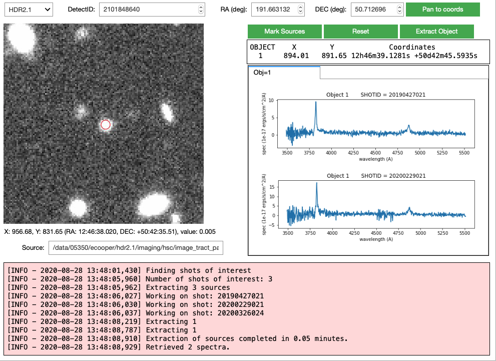

The QueryWidget: Interactive spectral extraction
================================================

.. container:: cell markdown

   .. rubric:: Setup
      :name: setup

.. container:: cell markdown

   Make sure the widgetsnbextension and ipyevents exentensions are
   activated. You only need to do this once.

.. container:: cell code

   .. code:: python

      ! jupyter nbextension enable --py widgetsnbextension
      ! jupyter nbextension enable --py ipyevents

   .. container:: output stream stdout

      ::

         Enabling notebook extension jupyter-js-widgets/extension...
               - Validating: OK
         Enabling notebook extension ipyevents/extension...
               - Validating: OK

.. container:: cell code

   .. code:: python

      from hetdex_api.query_widget import QueryWidget 

.. container:: cell code

   .. code:: python

      %%javascript
      IPython.OutputArea.prototype._should_scroll = function(lines) {
          return false;
      }

   .. container:: output display_data

      ::

         <IPython.core.display.Javascript object>

.. container:: cell markdown

   .. rubric:: Intro to the QueryWidget Class
      :name: intro-to-the-querywidget-class

.. container:: cell markdown

   To initiate the QueryWidget you can do a call to the class without
   any optional parameters. This will open up on a predefined
   detectid/coordinate as an example. The widget can handle both changes
   to the detectid or manual changes to the input RA and DEC (in
   degrees). In order to load the corresponding imaging at the input
   coordinate you need to press the ``Pan to Coords`` button. This will
   take a couple seconds to load so be patient.

.. container:: cell markdown

   The QueryWidget is created using the astrowidgets interface to ginga.
   In many ways ginga is like ds9 providing interactive capabilities
   with astronomical images. If your cursor is not producing changes to
   the output under the image, then its not working properly. Ginga is
   very interactive with mouse and trackpad changes. Many of the things
   that took menu switches in ds9 can be done with keyboard shortcuts.
   See this page for a summary of changes. You should be able to pan
   around with your trackpad and scroll in and out with +/-. Changes in
   contrast and scale are also available through keyboard/mouse clicks.

   https://ginga.readthedocs.io/en/stable/quickref.html#ginga-quick-reference

   They can also be entered in as attributes and some examples will
   follow below. To learn the full extent you can read about ginga and
   astrowidgets here:

   https://astrowidgets.readthedocs.io/ https://ginga.readthedocs.io/

.. container:: cell markdown

   .. rubric:: How initiate the QueryWidget and grab HETDEX sources
      :name: how-initiate-the-querywidget-and-grab-hetdex-sources

.. container:: cell markdown

   The widget will bring up any g-band ancillary HETDEX imaging data we
   have around a coordinate/detectid. If there is no g-band, it will get
   the r-band data and if there is no r-band, it will get an image from
   SDSS. You can attempt to extract HETDEX spectra at any coordinate
   using the "Mark Sources" button. Once done selecting regions, press
   ``Stop Marking``. A table of coordinates will show up below the
   buttons. Then you can press the ``Extract Object`` button to grab
   HETDEX spectra. This will extract 3" radius aperures (or change this
   using the aperture= "astropy unit" option). Then spectra will be
   retrieved from HDR1. This will take about a minute (it will speed up
   soon hopefully). Once the spectra is retrieved (one spectra for each
   separate shotid/observation of the source), they are displayed in
   tabs on the right hand of the widget.

.. container:: cell code

   .. code:: python

      query_widget = QueryWidget()

.. container:: cell markdown

   The spectra table can be found as an attribute to the QueryWidget
   class:

.. container:: cell code

   .. code:: python

      query_widget.spec_table

   .. container:: output execute_result

      ::

         <Table length=3>
           ID     shotid   ...              weights [1036]             
                           ...                                         
         int64    int64    ...                 float64                 
         ----- ----------- ... ----------------------------------------
             1 20180210011 ... 0.8017265121415571 .. 0.8291069391479085
             2 20180210011 ... 0.7178780136038434 .. 0.7269465767702127
             3 20180210011 ... 0.8016517024772064 .. 0.8330369494599621

.. container:: cell markdown

   .. rubric:: Extract on an input coordinate
      :name: extract-on-an-input-coordinate

.. container:: cell markdown

   Open directly on a desired coordinate:

.. container:: cell code

   .. code:: python

      import astropy.units as u
      from astropy.coordinates import SkyCoord

      coord = SkyCoord(150.025513 * u.deg, 2.087767 * u.deg, frame='icrs')

.. container:: cell code

   .. code:: python

      query_widget2 = QueryWidget(coords=coord)

.. image:: images/elix_widget.png

.. container:: cell markdown

   .. rubric:: Extract on a detectid
      :name: extract-on-a-detectid

.. container:: cell code

   .. code:: python

      query_widget3 = QueryWidget(detectid = 1000615767)
