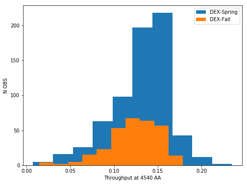

Survey Class
============

   The survey HDF5 file is a master look up table for each observation
   made by VIRUS for HETDEX. It can be accessed directly through the
   HDF5 survey file, or through the Survey class API. The Survey class
   includes information for each three dither set HETDEX observation in
   HDR1. It includes both science and calibration shots. Any quantity
   related to an individual dither is provided in an array of length
   three. Fundamental properties of a shot and quality assessment values
   for seeing (fwhm), astrometry, flux limits and transparency
   (response_4540) are tabulated to allow for querying of desired shots.

   We first introduce the basic API to query the Survey Class by sky
   coordinates to get a list of shots where fibers are located within
   that region. Later on in this notebook we show some basic querying of
   the Survey class and demonstrate a few examples.

.. container:: cell markdown

   .. rubric:: Initiate the Survey class :
      :name: initiate-the-survey-class-

.. container:: cell code

   .. code:: python

      %matplotlib inline
      import tables as tb
      import numpy as np
      import matplotlib.pyplot as plt

      from astropy.table import Table
      import astropy.units as u
      from astropy.coordinates import SkyCoord

      from hetdex_api.survey import Survey

.. container:: cell code

   .. code:: python

      survey = Survey('hdr1')

.. container:: cell markdown

   This calls the HDR1 survey class and sets each column in the survey
   table as an attribute to this object. This is how it looks through an
   astropy Table object:

.. container:: cell code

   .. code:: python

      Table(survey.hdfile.root.Survey[:])

   .. container:: output execute_result

      ::

         <Table length=1714>
          field    date   obsid ... yditherpos [3]   yoffset [3]         yrms [3]     
         bytes12  int32   int32 ...    float32         float32           float32      
         ------- -------- ----- ... -------------- ---------------- ------------------
          cosmos 20170103     2 ...   0.0 .. 1.741   -1e-05 .. -0.0 0.33429 .. 0.17898
          cosmos 20170103     3 ...   0.0 .. 1.367      -0.0 .. 0.0 0.35298 .. 0.29886
          cosmos 20170105     8 ...    0.0 .. 1.68     -0.0 .. -0.0 0.20898 .. 0.03161
          cosmos 20170105     9 ...   0.0 .. 2.996 3e-05 .. 0.00019  0.37773 .. 0.3977
          cosmos 20170105    10 ...     0.0 .. 2.1      -0.0 .. 0.0 0.39384 .. 0.50996
          cosmos 20170105    11 ...   0.0 .. 0.079     -0.0 .. -0.0 0.54034 .. 0.35707
          cosmos 20170106     1 ...   0.0 .. 0.391  -1e-05 .. 1e-05 0.27743 .. 0.40041
          cosmos 20170106     2 ...   0.0 .. 2.099      0.0 .. -0.0  0.30044 .. 0.2474
          cosmos 20170106     3 ...   0.0 .. 2.153      0.0 .. -0.0  0.30677 .. 0.4222
          cosmos 20170107    12 ...   0.0 .. 0.538  0.00034 .. -0.0  0.6705 .. 0.21377
             ...      ...   ... ...            ...              ...                ...
             cal 20190201     8 ...  0.0 .. 0.8715   1e-05 .. 3e-05 0.48836 .. 0.50151
             cal 20190201     9 ...  0.0 .. 1.2916     -0.0 .. -0.0   0.6864 .. 0.6321
             cal 20190202    22 ...  0.0 .. 1.2873     -0.0 .. -0.0 0.42725 .. 0.42419
             cal 20190203    12 ...  0.0 .. 1.1569      0.0 .. -0.0  0.24279 .. 0.2453
             cal 20190203    13 ...  0.0 .. 1.1211      0.0 .. -0.0 0.17181 .. 0.26734
             cal 20190204    11 ...   0.0 .. 1.245    2e-05 .. -0.0 0.46322 .. 0.34703
             cal 20190205    14 ...  0.0 .. 1.2141    1e-05 .. -0.0 0.33886 .. 0.25879
             cal 20190207    19 ...  0.0 .. 1.1333      -0.0 .. 0.0  0.68693 .. 0.4041
             cal 20190208    33 ...  0.0 .. 1.1775      0.0 .. -0.0  0.1237 .. 0.40124
             cal 20190208    34 ...  0.0 .. 1.1392    -1e-05 .. 0.0 0.41253 .. 0.19523

.. container:: cell markdown

   It also converts RA and DEC into astropy coordinate objects.

.. container:: cell code

   .. code:: python

      survey.coords

   .. container:: output execute_result

      ::

         <SkyCoord (ICRS): (ra, dec) in deg
             [(149.88757 ,  1.88533 ), (150.48583 ,  2.48316 ),
              (149.77143 ,  2.59229 ), ..., (183.522807, 32.89606 ),
              (223.660533, 55.181573), (223.703193, 55.194919)]>

.. container:: cell markdown

   Shots are labeled based on their observation date and observation ID:

.. container:: cell code

   .. code:: python

      survey.date

   .. container:: output execute_result

      ::

         array([20170103, 20170103, 20170105, ..., 20190207, 20190208, 20190208],
               dtype=int32)

.. container:: cell code

   .. code:: python

      survey.obsid

   .. container:: output execute_result

      ::

         array([ 2,  3,  8, ..., 19, 33, 34], dtype=int32)

.. container:: cell markdown

   A specific shot can be linked either by an integer combination of
   these two values, called ``shotid``, or the ``DATEvOBS`` form:

.. container:: cell code

   .. code:: python

      survey.datevobs

   .. container:: output execute_result

      ::

         array(['20170103v002', '20170103v003', '20170105v008', ...,
                '20190207v019', '20190208v033', '20190208v034'], dtype='<U12')

.. container:: cell code

   .. code:: python

      survey.shotid

   .. container:: output execute_result

      ::

         array([20170103002, 20170103003, 20170105008, ..., 20190207019,
                20190208033, 20190208034])

.. container:: cell markdown

   .. rubric:: Searching for shots near a sky coordinate
      :name: searching-for-shots-near-a-sky-coordinate

.. container:: cell markdown

   Most users searching for observations will want to get a list of
   observations/shots at a specific sky position. Each shot has a single
   associated sky coordinate. We can retrieve a list of shots that may
   contain fibers in a specific region. However, because of the varying
   and non-contiguous footprint of VIRUS, this is not an immediate
   guarantee a region has been observed. You must further query fibers
   in each shot to determine this. See Notebook 02 to learn how to query
   with the Fibers Class API.

.. container:: cell markdown

   .. rubric:: get_shotlist()
      :name: get_shotlist

   This function which operates on the Survey class object. An astropy
   coordinates object is required as input.

.. container:: cell code

   .. code:: python

      coords = SkyCoord(11.628530 * u.deg, 0.081790 * u.deg, frame='icrs')

.. container:: cell markdown

   We can either search a rectangular region, width and height in
   degrees:

.. container:: cell code

   .. code:: python

      shotlist = survey.get_shotlist(coords, width=0.5, height=0.2)

.. container:: cell code

   .. code:: python

      shotlist

   .. container:: output execute_result

      ::

         array([20171119003, 20180106004, 20181003009, 20181005017, 20181107014])

.. container:: cell markdown

   or we can search a circular aperture with a radius given in degress,
   or in an astropy quantity object:

.. container:: cell code

   .. code:: python

      shotlist = survey.get_shotlist(coords, radius=10*u.arcmin)

   .. container:: output stream stderr

      ::

         WARNING: AstropyDeprecationWarning: The truth value of a Quantity is ambiguous. In the future this will raise a ValueError. [astropy.units.quantity]

.. container:: cell code

   .. code:: python

      shotlist

   .. container:: output execute_result

      ::

         array([20171119003, 20180106004, 20181003009, 20181107014])

.. container:: cell markdown

   From here a user can take their shotlist and query the position on
   the Fibers class and see if their region of interest is observed in
   the survey.

.. container:: cell markdown

   .. rubric:: Basic querying for the Survey Class
      :name: basic-querying-for-the-survey-class

.. container:: cell markdown

   The Survey HDF5 itself contains information about the quality of each
   observation. A user can query different parameters and plot up
   general shot quantities. For example, we can compare the distribution
   of throughput values (technically the response at 4540 AA) between
   the HETDEX spring and HETDEX fall fields:

.. container:: cell markdown

   .. rubric:: Example: Plotting up the canonical throughput value at
      4540 AA
      :name: example-plotting-up-the-canonical-throughput-value-at-4540-aa

.. container:: cell code

   .. code:: python

      idx_spring = np.where( (survey.field == 'dex-spring') * np.isfinite(survey.response_4540) )

.. container:: cell code

   .. code:: python

      idx_fall = np.where( (survey.field == 'dex-fall') * np.isfinite(survey.response_4540))

.. container:: cell code

   .. code:: python

      plt.figure(figsize=(8,6))
      plt.hist(survey.response_4540[idx_spring], label = 'DEX-Spring')
      plt.hist(survey.response_4540[idx_fall], label = 'DEX-Fall')
      plt.xlabel('Throughput at 4540 AA')
      plt.ylabel('N OBS')
      plt.legend()

   .. container:: output execute_result

      ::

         <matplotlib.legend.Legend at 0x2ba588f69f28>

   .. container:: output display_data

      |image0|

.. container:: cell markdown

   .. rubric:: Example: Plotting up the locations of all cosmos shots:
      :name: example-plotting-up-the-locations-of-all-cosmos-shots

.. container:: cell code

   .. code:: python

      idx_cosmos = np.where(survey.field == 'cosmos')

.. container:: cell code

   .. code:: python

      plt.figure(figsize=(8,6))
      plt.scatter(survey.ra[idx_cosmos],survey.dec[idx_cosmos])
      plt.xlabel('RA (deg)')
      plt.ylabel('DEC (deg)')
      plt.show()

   .. container:: output display_data

      |image1|

.. container:: cell markdown

   .. rubric:: Exploring the Survey HDF5 File
      :name: exploring-the-survey-hdf5-file

.. container:: cell markdown

   The hdfile attribute contains the link to the survey HDF5 file.
   Calling it will show you all the information in the HDF5 file. You
   may interact with this directly rather than using the Survey class
   initiation.

.. container:: cell code

   .. code:: python

      survey.hdfile

   .. container:: output execute_result

      ::

         File(filename=/work/03946/hetdex/hdr1/survey/survey_hdr1.h5, title='HDR1 Survey file ', mode='r', root_uep='/', filters=Filters(complevel=0, shuffle=False, bitshuffle=False, fletcher32=False, least_significant_digit=None))
         / (RootGroup) 'HDR1 Survey file '
         /Survey (Table(1714,)) 'Main Survey Info'
           description := {
           "field": StringCol(itemsize=12, shape=(), dflt=b'', pos=0),
           "date": Int32Col(shape=(), dflt=0, pos=1),
           "obsid": Int32Col(shape=(), dflt=0, pos=2),
           "objid": StringCol(itemsize=18, shape=(), dflt=b'', pos=3),
           "ra": Float64Col(shape=(), dflt=0.0, pos=4),
           "dec": Float64Col(shape=(), dflt=0.0, pos=5),
           "pa": Float64Col(shape=(), dflt=0.0, pos=6),
           "response_4540": Float32Col(shape=(), dflt=0.0, pos=7),
           "fwhm_flag": Int32Col(shape=(), dflt=0, pos=8),
           "fwhm_gaussian": Float32Col(shape=(), dflt=0.0, pos=9),
           "fwhm_moffat": Float32Col(shape=(), dflt=0.0, pos=10),
           "moffat_beta": Float32Col(shape=(), dflt=0.0, pos=11),
           "relflux_guider": Float32Col(shape=(3,), dflt=0.0, pos=12),
           "relflux_virus": Float32Col(shape=(3,), dflt=0.0, pos=13),
           "structaz": Float32Col(shape=(), dflt=0.0, pos=14),
           "darktime": Float32Col(shape=(3,), dflt=0.0, pos=15),
           "datevobs": StringCol(itemsize=12, shape=(), dflt=b'', pos=16),
           "expnum": Int32Col(shape=(3,), dflt=0, pos=17),
           "exptime": Float32Col(shape=(3,), dflt=0.0, pos=18),
           "fluxlimit_4550": Float32Col(shape=(), dflt=0.0, pos=19),
           "mjd": Float32Col(shape=(3,), dflt=0.0, pos=20),
           "n_ifu": Int32Col(shape=(), dflt=0, pos=21),
           "nstars_fit": Int32Col(shape=(3,), dflt=0, pos=22),
           "ra_flag": StringCol(itemsize=1, shape=(3,), dflt=b'', pos=23),
           "shotid": Int64Col(shape=(), dflt=0, pos=24),
           "trajcdec": Float32Col(shape=(), dflt=0.0, pos=25),
           "trajcpa": Float32Col(shape=(), dflt=0.0, pos=26),
           "trajcra": Float32Col(shape=(), dflt=0.0, pos=27),
           "xditherpos": Float32Col(shape=(3,), dflt=0.0, pos=28),
           "xoffset": Float32Col(shape=(3,), dflt=0.0, pos=29),
           "xrms": Float32Col(shape=(3,), dflt=0.0, pos=30),
           "yditherpos": Float32Col(shape=(3,), dflt=0.0, pos=31),
           "yoffset": Float32Col(shape=(3,), dflt=0.0, pos=32),
           "yrms": Float32Col(shape=(3,), dflt=0.0, pos=33)}
           byteorder := 'little'
           chunkshape := (229,)

.. |image1| image:: images/ab6bb373fe75c03fbdb059b0c10e89e1e2aa9546.png
