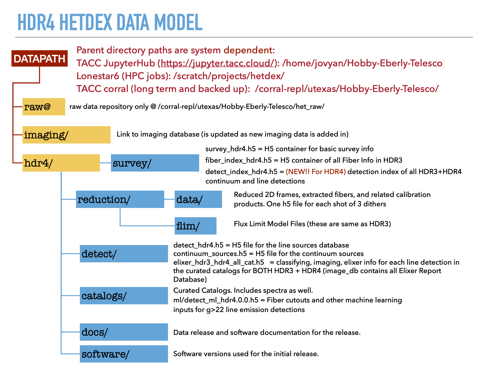

Introduction
============

HETDEX API consists of all code related to HETDEX data releases. It contains both scripts to generate H5 container files that store data products and meta data related to HETDEX data processing. It also consists of a number of high-level user access tools that allow a user to query HETDEX fiber spectra based on sky coordinates. 

We recommend you click through the links on the left sidebar "Navigating the Data". We have APIs for the different levels of H5 files: survey, fibers, flux limits and detections. There are also higher level interactive widgets like ElixerWidget and QueryWidget which provide interactive tools through Jupyter Notebooks, as well we have the commandline tool `hetdex_get_spec` to run spectral extractions from a terminal if you prefer to avoid python and notbooks. Please reach out to Erin Mentuch Cooper if you have questions or find issues with `hetdex-api` (erin _at_ astro.as.utexas.edu).

HETDEX Data Model
-----------------

   .. container:: output display_data

      |image0|

